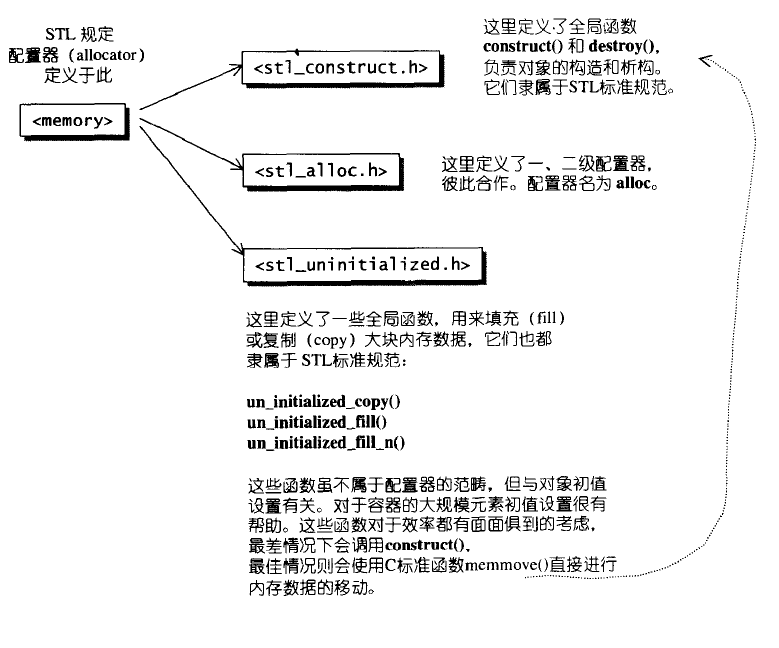
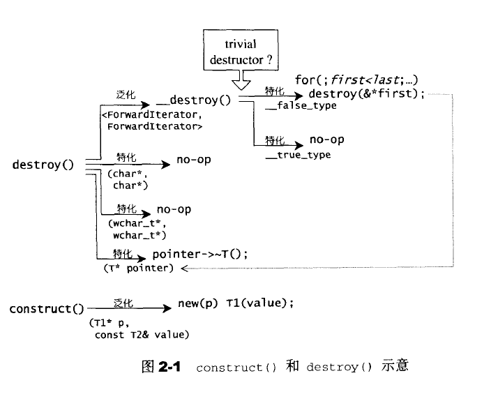
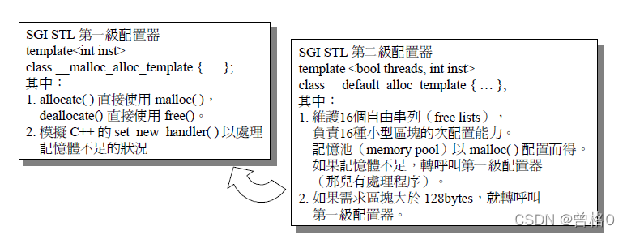
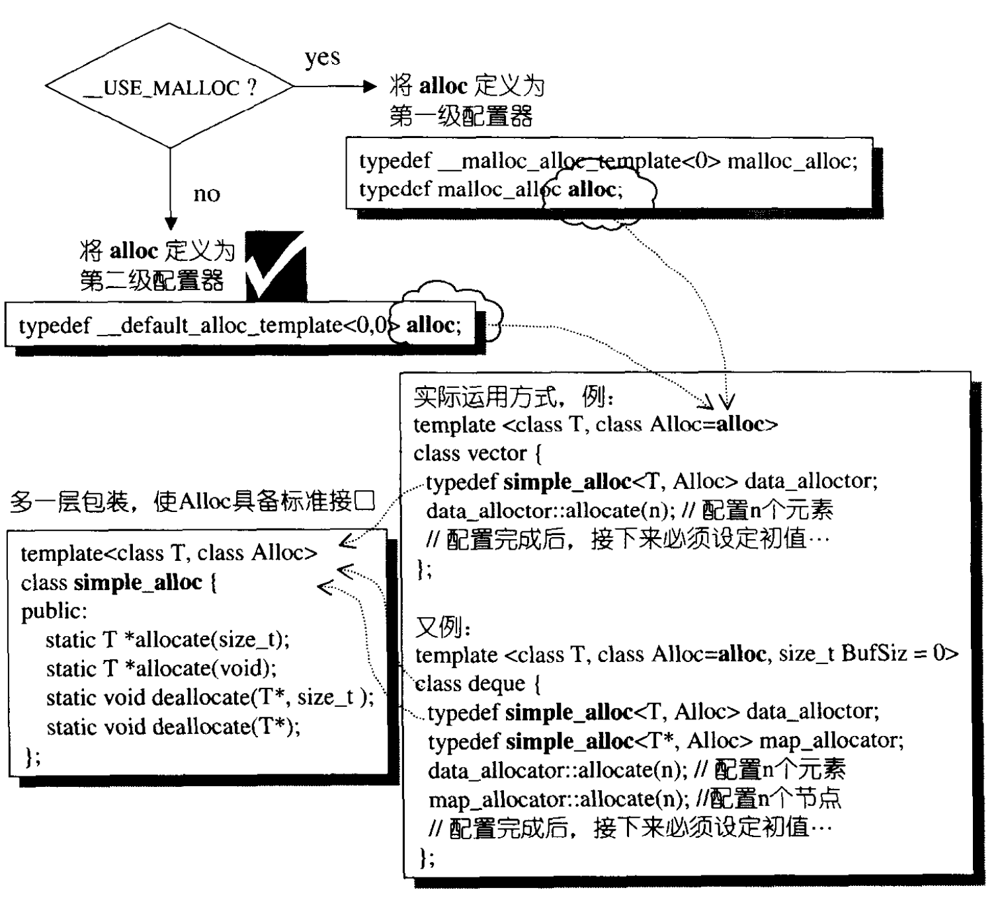
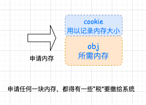
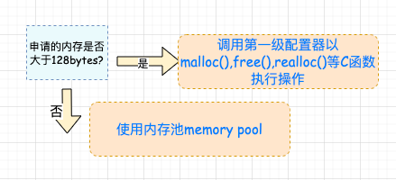
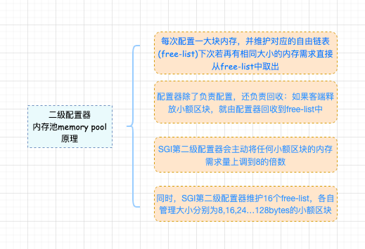
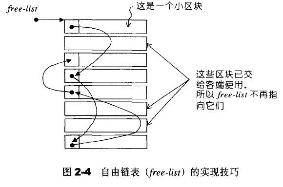
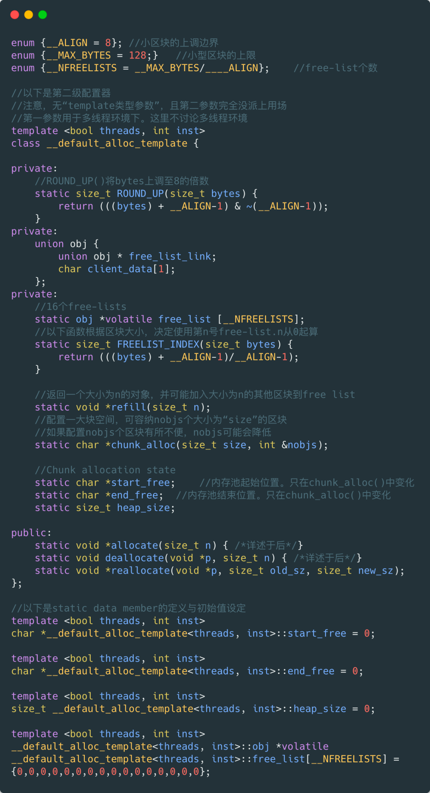
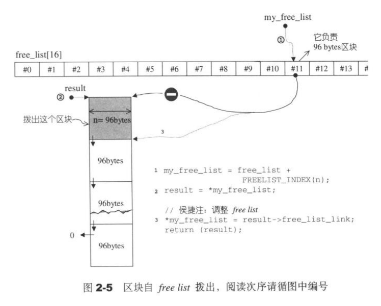

[TOC]


# 空间配置器

​		allocator 是空间配置器，定义于头文件 std::allocator 类模板是所有标准库容器所用的默认分配器 (Allocator)，若不提供用户指定的分配器。默认分配器无状态，即任何给定的 allocator 实例可交换、比较相等，且能解分配同一 `allocator` 类型的任何其他实例所分配的内存。

## 空间配置器的标准接口

根据 STL 的规范，以下是 allocator 的必要接口：

成员类型：

| 类型                                          | 定义                                                         |
| :-------------------------------------------- | :----------------------------------------------------------- |
| value_type                                    | T                                                            |
| pointer (C++17 中弃用)(C++20 中移除)          | T*                                                           |
| const_pointer (C++17 中弃用)(C++20 中移除)    | const T*                                                     |
| reference (C++17 中弃用)(C++20 中移除)        | T&                                                           |
| const_reference (C++17 中弃用)(C++20 中移除)  | const T&                                                     |
| size_type                                     | std::size_t                                                  |
| difference_type                               | std::ptrdiff_t                                               |
| propagate_on_container_move_assignment(C++14) | std::true_type                                               |
| rebind (C++17 中弃用)(C++20 中移除)           | template< class U > struct rebind { typedef allocator other; }; |
| is_always_equal(C++17)                        | std::true_type                                               |

成员函数：

| 函数                                  | 定义                                                         |
| :------------------------------------ | :----------------------------------------------------------- |
| (构造函数)                            | 创建新的 allocator 实例(公开成员函数)                        |
| (析构函数)                            | 析构 allocator 实例(公开成员函数)                            |
| address(C++17 中弃用)(C++20 中移除)   | 获得对象的地址，即使重载了 operator&(公开成员函数)           |
| allocate                              | 分配未初始化的存储，<u>相当于分配一大块内存</u>   (公开成员函数) |
| deallocate                            | 解分配存储，<u>将一大块内存析构</u>(公开成员函数)            |
| max_size(C++17 中弃用)(C++20 中移除)  | 返回最大的受支持分配大小(公开成员函数)                       |
| construct(C++17 中弃用)(C++20 中移除) | 在分配的存储构造对象，构造一个个对象   (公开成员函数)        |
| destroy(C++17 中弃用)(C++20 中移除)   | 析构在已分配存储中的对象，析构一个个对象(公开成员函数)       |


### 简单实现

```c++
namespace JJ
{
template<typename T>
class allocator {
public:
    typedef T value_type;
    typedef T* pointer;
    typedef const T* const_pointer;
    typedef T& reference;
    typedef const T& const_reference;
    typedef std::size_t size_type;
    typedef std::ptrdiff_t difference_type;

    // rebind allocator of type U
    template<typename U>
    struct rebind {
        typedef allocator<U> other;
    };
public:
    allocator() {}
    ~allocator() {}
    static pointer allocate(size_type n, const void* hidt = 0) {
        T* tmp = new T[n];
        std::cout << "allocate, n=" << n << " p = "<< tmp << std::endl;
        return tmp;
    }
    static void deallocate(void* p, size_type n) {
        std::cout << "deallocate n = "<< n <<" p = "<< p <<  std::endl;
        delete[] static_cast<T*>(p);
    }
    static pointer address(T& x){
        return (pointer)&x;
    }
    size_type max_size() const{return 1000;}

    static void construct(T* p, const T& val){
        std::cout << "construct  in:"<< p << std::endl;
        new(p) T(val);
    }
    static void destroy(T* p){
        std::cout << "destroy  in:"<< p << std::endl;
    }
    
};

} // namespace JJ
```

​		上面只是简单的 allocator 实现，真实情况比这个要复杂的多。 SGI 标准的空间配置器，也只是对 ::operator new和 ::operator delete 做了一层薄薄的封装。

​		STL allocator 将两阶段操作区分开来。内存配置操作由 alloc:allocate() 负责；内存释放操作由 alloc::deallocate() 负责；对象构造操作由 ::construct() 负责，对象析构操作由 ::destroy() 负责。




### 构造和析构基本工具： `construct()`和`destory()`

下面是 c++11 中 <stl_construct.h> 的部分内容

```c++
#ifndef _STL_CONSTRUCT_H #define _STL_CONSTRUCT_H 1 
#include <new> #include <bits/move.h> #include <ext/alloc_traits.h> 
namespace std _GLIBCXX_VISIBILITY(default)
{
_GLIBCXX_BEGIN_NAMESPACE_VERSION

  /** * Constructs an object in existing memory by invoking an allocated * object's constructor with an initializer. */
//c++11 新添加Construct函数 

#if __cplusplus >= 201103L   template<typename _T1, typename... _Args>
    inline void
    _Construct(_T1* __p, _Args&&... __args)
    { ::new(static_cast<void*>(__p)) _T1(std::forward<_Args>(__args)...); }
#else   template<typename _T1, typename _T2>
    inline void
    _Construct(_T1* __p, const _T2& __value)
    {
      // _GLIBCXX_RESOLVE_LIB_DEFECTS
      // 402. wrong new expression in [some_]allocator::construct
      ::new(static_cast<void*>(__p)) _T1(__value);
    }
#endif 
  /** * Destroy the object pointed to by a pointer type. */
    //接受指针，并直接调用指针类的析构函数

  template<typename _Tp>
    inline void
    _Destroy(_Tp* __pointer)
    { __pointer->~_Tp(); }
//模板函数

  template<bool>
    struct _Destroy_aux
    {
      template<typename _ForwardIterator>
        static void
        __destroy(_ForwardIterator __first, _ForwardIterator __last)
    {
      for (; __first != __last; ++__first)
        std::_Destroy(std::__addressof(*__first));
    }
    };
//特例化函数判断对象是否含有默认构造函数，如果是则什么也不做，这样可以提高效率

  template<>
    struct _Destroy_aux<true>
    {
      template<typename _ForwardIterator>
        static void
        __destroy(_ForwardIterator, _ForwardIterator) { }
    };

  /** * Destroy a range of objects. If the value_type of the object has * a trivial destructor, the compiler should optimize all of this * away, otherwise the objects' destructors must be invoked. */

    //销毁一系列对象。如果对象的value_type是一个默认的析构函数，编译器应该优化所有这些，否则必须调用对象的析构函数。

  template<typename _ForwardIterator>
    inline void
    _Destroy(_ForwardIterator __first, _ForwardIterator __last)
    {
        //迭代器别名

      typedef typename iterator_traits<_ForwardIterator>::value_type
                       _Value_type;

      std::_Destroy_aux<__has_trivial_destructor(_Value_type)>::
    __destroy(__first, __last);
    }

  /** * Destroy a range of objects using the supplied allocator. For * nondefault allocators we do not optimize away invocation of * destroy() even if _Tp has a trivial destructor. */
    //使用支持的allocator销毁一系列对象，如果没有非默认的allocators不会进行销毁函数的初始化，即便，对象含有默认构造函数

  template<typename _ForwardIterator, typename _Allocator>
    void
    _Destroy(_ForwardIterator __first, _ForwardIterator __last,
         _Allocator& __alloc)
    {
      typedef __gnu_cxx::__alloc_traits<_Allocator> __traits;
      for (; __first != __last; ++__first)
    __traits::destroy(__alloc, std::__addressof(*__first));
    }

  template<typename _ForwardIterator, typename _Tp>
    inline void
    _Destroy(_ForwardIterator __first, _ForwardIterator __last,
         allocator<_Tp>&)
    {
      _Destroy(__first, __last);
    }

_GLIBCXX_END_NAMESPACE_VERSION
} // namespace std
#endif
```

​		上述代码中 `_Destroy_aux` 主要是用来检测，对象是否有自定义的析构函数，如果有就进行迭代调用。如果没有(使用默认析构函数)直接跳过，避免资源浪费。




### 空间的配置与释放，std::alloc

构造空间的配置与释放，由 < stl_alloc.h > 负责；设计思路如下：

- 向 `system heap` 请求空间
- 考虑多线程状态
- 考虑内存不足时的应变措施
- 考虑过多“小型区块”可能造成的内存碎片 ( fragment ) 问题。

​        考虑到小型区块可能造成的内存破碎问题，SGI 设计了双层级配置器,第一级配置器直接使用 `malloc()` 和`free()` ；第二级配置器则视情况采用不同的策略。当配置区块超过 128 byte 时，视之为足够大，使用第一级配置器，当小于 128 byte 时，视之为过小，采用复杂的 **memory pool** 整理方式。而不再求助于第一级适配器。使用哪一级适配器取决于 `__USE_MALLOC` 是否被定义。



第一级配置器与第二级配置器的包装接口和运用方式：



#### 一级适配器 __malloc_alloc_template 剖析

```c++
//一级适配器
template <int inst>
class __malloc_alloc_template
{
private:
    //函数指针，所代表的函数将用来处理内存不足的情况
    //oom: out of memory
    static void *oom_malloc(size_t);
    static void *oom_realloc(void*,size_t);
    static void (*__malloc_alloc_oom_handler)();

public:
    static void *allocate(size_t n)
    {
        //一级配置器必须使用malloc()
        void *result=malloc(n);
        //当无法满足需求时，改用oom_malloc()
        if(0==result) result=oom_malloc(n);
        return result;
    }
    static void deallocate(void *p,size_t)
    {
        //第一级配置器直接使用free()
        free(p);
    }
    
    //输入旧size和新size
    static void* reallocate(void *p,size_t,size_t new_sz)
    {
        void* result=realloc(p,new_sz);
        if(0==result) result=oom_realloc(p,new_sz);
        return result; 
    }
    
    //指定自己的out-of-memory handler
    static void (* set_malloc_handler(void(*f)()))()
    {
        //获取函数指针
        void (* old)()=__malloc_alloc_oom_handler;
        __malloc_alloc_oom_handler=f;
        return(old); 
    }
};

//下面是用户提供的malloc_alloc函数
template <int inst>
void (*__malloc_alloc_template<inst>::__malloc_alloc_oom_handler)()=0;

template <int inst>
void *__malloc_alloc_template<inst>::oom_malloc(size_t n)
{
    //获取内存分配句柄函数指针
    void (*my_malloc_handler)();
    void *result;
    for(;;)
    {
        //指针指向分配函数
        my_malloc_handler = __malloc_alloc_oom_handler;
        //分配失败抛出异常
        if(0 == my_malloc_handler){__THROW_BAD_ALLOC;}
        //调用处理例程，企图释放内存
        (*my_malloc_handler)();
        //再次尝试分配内存
        result=malloc();
        if(result) return(result);
    }
}

//内存调用分配不成功时，进行二次调用
template <int inst>
void * __malloc_alloc_template<inst>::oom_realloc(void *p,size_t n)
{
    void (*my_malloc_handler)();
    void *result;
    for(;;)
    {
        my_malloc_handler=__malloc_alloc_oom_handler;
        if(0==my_malloc_handler){__THROW_BAD_ALLOC;}
        //尝试调用处理例程
        (*my_malloc_handler)();
        //尝试分配内存
        result=realloc(p,n);
        if(result) return(result);
    }
}

//注意,以下参数直接将inst指定为0
typedef __malloc_alloc_template<0> malloc_alloc;
```

​		第一级配置器以 malloc()，free()，realloc() 等 C 函数执行实际的内存配置、释放、重配置操作，并实现类似 **C++ new-handler** 的机制，就是类似如果直接 malloc 无法完成任务，会调用用户指定的处理函数来兜底。

​		

#### 第二级适配器 __default_alloc_template 剖析

​		第二级配置器多了一些机制，专门针对内存碎片。内存碎片化带来的不仅仅是回收时的困难，配置也是一个负担，额外负担永远无法避免，毕竟系统要划出这么多的资源来管理另外的资源，但是区块越小，额外负担率就越高。



​		简单来说 SGI 第二级配置器的做法是：

- 如果大于 128 bytes 就交给第一级配置器处理；
- 对于小于 128 bytes 的内存，以内存池管理，此方法称为：**sub-allocation （次层配置）**，每次配置一大块内存，并维护对应的自由链表（free-list），下次若再有大小相同的内存需求，直接从 free-list 中拔出。释放也由 free-list 回收管理。






<u>为了方便管理，小区块的内存需求量总是 8 的倍数，并维护 **16 个 free-lists**，各自管理大小分别为 8、16、24、32.........128 bytes 的小额区块</u>， free-list 的节点结构如下：

```c++
union obj{
    union obj * free_list_link;
    char client_data[1];
}
```

​		由于 obj 使用的是 union ，所以<u>从 free_ list_link 来看 obj 是一个指向**下一个** obj 的指针</u>；<u>从 client_data 来看，obj 可被视为一个指向实际区块的指针</u>。所以不会造成维护链表所必须得指针而浪费内存。



##### 第二级配置器的部分实现




### 空间配置函数 allocate()

​		__default_alloc_template 拥有配置器的标准接口函数 allocate()。此函数首先判断区块大小，大于 128bytes就调用第一级配置器，小于 128bytes 就检查对应的 free list。如果有可用区块就直接拿来用，没有就将区块的大小上调至 8 倍数边界，然后调用 `refill()` 准备为 `free list` 重新填充空间。

```c++
//n must be > 0
static void * allocate(size_t n)
  {
    obj * __VOLATILE * my_free_list;
    obj * __RESTRICT result;
    
    //要申请的空间大于128bytes就调用第一级配置
    if (n > (size_t) __MAX_BYTES) {
        return(malloc_alloc::allocate(n));
    }
    //寻找 16 个free lists中恰当的一个
    my_free_list = free_list + FREELIST_INDEX(n);
    result = *my_free_list;
    if (result == 0) {
        //没找到可用的free list，准备新填充free list
        void *r = refill(ROUND_UP(n));
        return r;
    }
    //调整 free list
    *my_free_list = result -> free_list_link;
    return (result);
  };
```

区块自 free list 调出的操作，如下所示：




