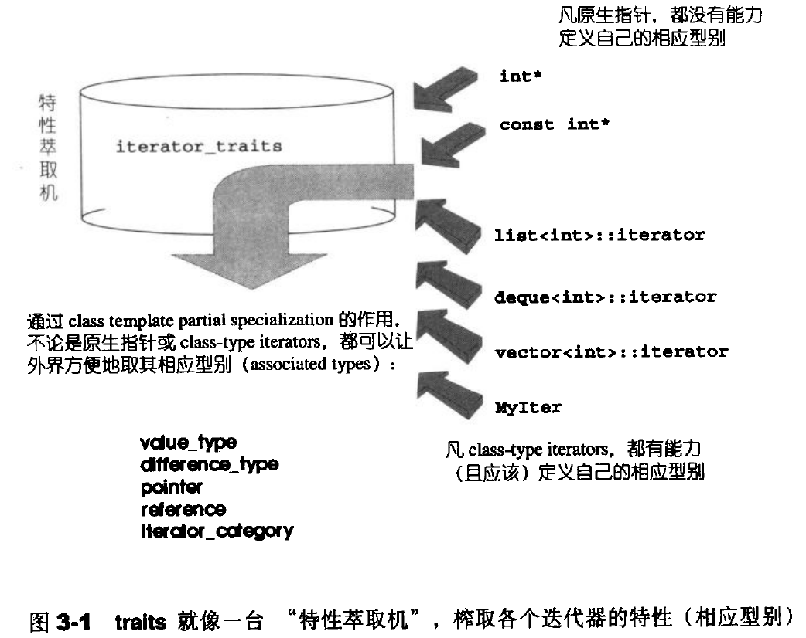
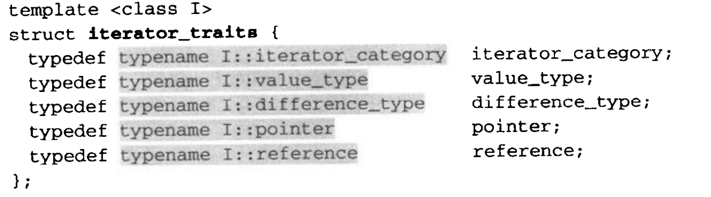
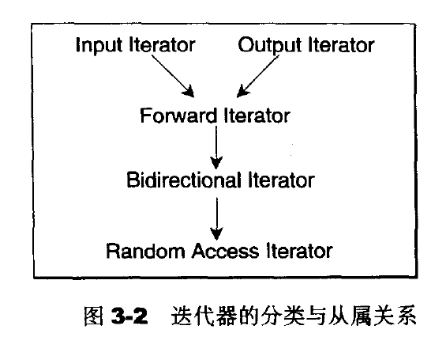

# 迭代器(iterators) 概念与 traits 编程技法

​		迭代器是一种抽象设计的概念，实现程序语言中并没有直接对应的概念的实物。使用的 23 种设计模式中的迭代器模式：提供一种方法可以依次访问某个聚合物所含的各个容器的元素。 STL 的中心思想在于：将数据容器和算法分开来。而迭代器就是扮演着两者之间的胶合剂角色。


## 迭代器是一种 smart pointer

​		迭代器是一种行为类似指针的对象，指针中最常见也最重要的行为便是间接引用 (dereference) 和成员访问(member access) ，**<u>因此迭代器最重要的就是对 operator* 和 operator-> 进行重载操作。</u>** C++ STL 中有一个auto_ptr（11中已经废弃），是用来包装一个原生指针 ( native pointer ) 的对象。可以解决各种内存漏洞。下面是 auto_ptr 的源码精要:

```c++
template<class T>
class auto_ptr
{
public:
    explicit auto_ptr(T *p=0):pointer(p){}
    template<class U>
    auto_ptr(auto_ptr<U>& rhs):pointee(rhs.release()){}
    ~auto_ptr(){delete pointee;}
    template<class U>
    auto_ptr<T>& operator=(auto_ptr<U>& rhs)
    {
        if(this!=&rhs) reset(rhs.release());
        return *this;
    }
    T& operator*() const {return *pointee;}
    T* operator->() const {return pointee;}
    T* get() const {return pointee;}  
private:
    T *pointee;
}
```

​		有了模仿对象。现在我们来为 list 设计一个迭代器：

```c++
template <class Item>
struct LisIter
 {
     Item* ptr;
     ListIter(Item* p=0):ptr(p){}
     //关键操作

     Item& operator*() const {return *ptr;}
     Item* operator->() const {return ptr;}
     ListIter& operator++()
     {
        ptr=ptr->next();
        return *this;
     } 
     ListIter operator++(int)
     {
        ListIter tmp=*this;
        ++*this;
        retrun tmp;
     }
     bool operator==(const ListIter& i) const
     {
        return ptr!=i.ptr;
     }
 };
```


## Traits编程技法–STL源码门钥

​		迭代器所指的型别，称为该迭代器的 value type。value 用于函数的传回值就无法正常工作了。毕竟函数的 “ template 参数推导机制” 推导的只是参数，无法推导函数的返回值类型。使用**内嵌类型**可以很好的避免这种问题。例如：

```c++
template <class T>
struct MyIter {
    //内嵌类型声明
    typedef T value_type;
    T* ptr;
    MyIter(T* p=0):ptr(p){}
    T& operator*() const {return *ptr;} 
}

template <class I>
typename I::value_type //此为 func 的返回值型别  注意：这里的typename必须要加  表示 I::value_type 是一种型别
func(I ite){return *ite;}

MyIter<int> ite(new int(8));
cout<<func(ite);
```

​		看起来不错！ 但是似乎有个陷阱：并不是所有迭代器都是 class type，原生指针就不是。如果不是 class type，就无法为它定义内嵌型别。**偏特化**可以做到：


#### 偏特化的意义

​		如果 class template 拥有一个以上的 template 参数， 我们可以针对其中某个（或数个，但非全部）template 参数进行特化工作。换句话说，我们可以在泛化设计中提供一个特化版本。

例如：

```c++
template<typename T>
class C{...};
```

偏特化：

```c++
template<typename T>
class C<T*>{...};  //这个特化版本仅适用于 “ T 为原生指针” 的情况
```

有了这项利器，我们便可以解决前述的 “内嵌型别” 未能解决的问题。现在我们可以针对 “ 迭代器之 template 参数为指针 ” 者，设计特化版的迭代器。

下面这个 class template 专门用来 “ 萃取 ” 迭代器的特性：

```c++
template<class T>
class iterator_traits{  // traits 意为 “特性” 
    typedef typename I::value_type  value_type;
};
```

​		这个所谓的 **traits** ，其意义是，<u>如果 I 有自己的 value\_type，那么通过这个 traits 的作用，萃取出来的 value\_type 就是 I::value\_type</u>。  换句话说，如果 I 有自己的 value type ，那先前的 func() 可以改写成：

```c++
template<class T>
typename iterator_traits<I>::value_type
func(I ite) {
    return *ite;
}
```

​		其实就是多了一层间接性，这有什么好处呢？   

**好处就是 traits 可以特化 ！！**

例如：

```c++
template<class T>
struct iterator_traits<T*>{  // traits 意为 “特性” 
    typedef T  value_type;
};
```

于是，原生指针 int* 虽然不是一种 class type，但可以通过 traits 取其 value type，就解决了先前的问题。


下图说明了 **traits** 锁扮演的 ”**特性萃取**“ 角色，萃取各个迭代器的特性：




常用的迭代器类型有5种：

- value_type:  迭代器所指对象的型别。
- difference_type: 两个迭代器之间的距离，因此也可以用来表示一个容器的最大容量。表示头尾之间的距离参数。其原型是`typedef ptrdiff_t difference_type`;使用时可以用`typename iterator_traits<I>::difference_type`
- reference_type: `typedef const T& reference type`
  - 迭代器分为两种`const`和非`const`；不允许/允许改变所指内容的对象。
- pointer type：主要还是对象的指针类型。
- iterator_category： 主要用于大规模的迭代器



根据移动特性与施行操作，迭代器被分为5类

- input iterator: 这种迭代器所指的对象，不允许外界改变。只读(read only)
- output Iterator: 唯写(write only)
- Forward Iterator: 允许“写入型”算法(如replace())在此种迭代器所形成的区间上进行读写操作。
- Bidirectional Iterator: 可以双向移动。某些算法需要逆向走访某个迭代器区间(例如逆向拷贝某范围内的元素)，可以使用Bidirectional Iterators。
- Random Access Iterator:  前四中迭代器都只提供一部分指针算术能力，第五种则涵盖所有指针和算术能力，包括p+n,p-n,p[n],p1-p2,p1小于p2。

;

## 3.5 std::iterator的保证

STL 提供了一个 iterator class 。每个新设计的迭代器都继承自它，可以保证STL所需之规范

```c++
template <
      class Category,
      class T,
      class Distance=ptrdiff_t,
      class Pointer=T*,
      class Reference=T&
          >
struct iterator
{
  typedef Category iterator_category;
  typedef T value_type;
  typedef Distance difference_type;
  typedef Pointer pointer;
  typedef Reference reference;
  
};

//使用

std::iterator<std::forward_iterator_tag,Item> 
```

纯粹的接口类型类，因此没有额外的负担。

总结：traits编程技法大量用于STL实现品中，利用“内嵌型别”的编程技巧与编译器的template参数推导功能,增强了c++的类型推导能力。


## 3.6 iterator源码完整重列

```c++
//源自 <stl_iterator.h>

struct input_iterator_tag{};
struct output_iterator_tag{};
struct forward_iterator_tag:public input_iterator_tag{};
struct bidirectional_iterator_tag:public forward_iterator_tag{};
struct random_access_iterator_tag:public bidirectional_iterator_tag{};
//迭代器封装类

template <
      class Category,
      class T,
      class Distance=ptrdiff_t,
      class Pointer=T*,
      class Reference=T&
          >
struct iterator
{
  typedef Category iterator_category;
  typedef T value_type;
  typedef Distance difference_type;
  typedef Pointer pointer;
  typedef Reference reference;
  
};
//traits

template <class Iterator>
struct iterator_traits{
  typedef typename Iterator::iterator_category iterator_category;
  typedef typename Iterator::value_type value_type;
  typedef typename Iterator::difference_type difference_type;
  typedef typename Iterator::pointer pointer;
  typedef typename Iterator::reference reference;
}
//为原生指针而设计的traits偏特化版

template <class T>
struct iteraror_traits<T*>
{
    typedef random_access_iterator_tag iterator_category;
    typedef T value_type;
    typedef ptrdiff_t difference_type;
    typedef T* pointer;
    typedef T& reference;
};
...
```

## SGI STL的私房菜 __type_traits

iterator_traits负责萃取迭代器的特性，__type_traits则负责萃取型别(type)的特性。它提供了一种机制，允许针对不同的型别属性，在编译时期完成函数派送决定。


