## 序列式容器

### 4.1 容器的概观与分类

容器主要分为两类：

- 序列式容器：数据的有序存放如list、vector
- 关联式容器：数据的相互关联如map和pair等


第四章主要讲述序列容器

### 4.2 vector

#### 4.2.1 vector概述

​		vector与array非常相似，但是**array是静态空间**，一旦配置了就不能改变，vector是动态空间，可以自己动态增长；

​		vector本质还是使用的allocator来进行内存空间的分配，因此它的内存模式是由allocator来决定的。所以**vector是一个连续的空间，但是每次分配的过于小的时候，会造成数据的搬移，比较浪费时间。而vector的迭代器是普通的指针。**([指针和引用的区别](https://www.cnblogs.com/LLD-3/p/9664100.html);[C++中指针和引用区别—详解版](https://blog.csdn.net/qq_39539470/article/details/81273179));

**数据结构**

​		vector 所采用的数据结构非常简单：线性连续空间。它以两个迭代器 start 和 finish 分别指向配置得来的连续空间中目前已经被使用的范围，并以迭代器 end_of_storage 指向整块连续空间(含备用空间)的尾端，并且为了方便扩充，vector 实际配置的大小(capacity)可能比客户端需求更大一些，以备将来可能的扩充。vector 的容量永远大于或等于其大小。一旦容量等于大小，便是满载，下次再有新增元素，整个 vector 就要进行搬移。即 capacity > size 永远成立

```
template <class T,class Alloc=alloc>
class vector
{
    ...
protected:
    //目前使用的空间的头部

    iterator start;
    //目前使用的空间的尾部

    iterator finish;
    //目前可用空间的尾部

    iterator end_of_storage;  

}
```

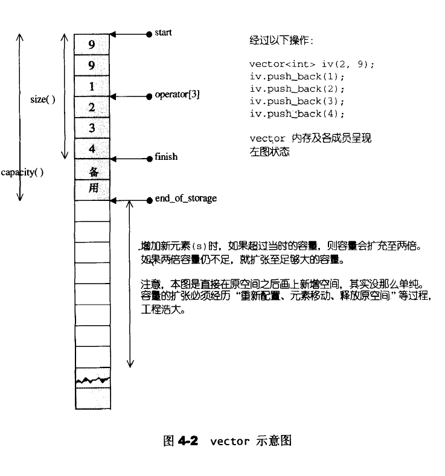

这里内存分配的关键函数代码如下

```c++
template <class T,class Alloc>
void vector<T,Alloc>::insert_aux(iterator position,const T& x)
{   
    //检查是否还有备用空间

    if(finish!=end_of_storage){
        //在备用空间起始处构造一个元素，并以vector最后一个元素为其初始值

        construct(finish,*(finish-1));
        //移动finish指针
        
        ++finish;
        //拷贝内容

        T x_copy=x;
        //执行拷贝

        copy_backward(position,finish-2,finish-1);
        *position=x_copy；
    }else {
        //进入这里表示已经不存在可用空间

        const size_type old_size=size();
        //决定分配空间的大小

        const size_type len=old_size!=0?2*old_size:1;
        //实际分配

        iterator new_start=data_allocator::allocate(len);
        iterator new_finish=new_start;
        try{
            //拷贝元素

            new_finish=uninitialized_copy(start,position,new_start);
            //为新元素设定初值x
            
            construct(new_finish,x);
            //调整指针位置

            ++new_finish;
            //将备用空间中的内容拷贝过来，这里主要是为了，后面的容量指针和相关信息

            new_finish=uninitialized_copy(position,finish,new_finish);
        }catch(...){
            destroy(new_start,new_finish);
            data_allocator::deallocate(new_start,len);
            throw;
        }
        //释放原来的内存
        destroy(begin(),end());
        deallocate();

        //调整迭代器，指向新vector
        start=new_start;
        finish=new_finish;
        end_of_storage=new_start+len;
    }
}
```


注意这里的迭代器失效。


### 4.3 list

​		相较于vector的连续线性空间，list相对复杂很多，但是，它的好处是每次插入或者删除一个元素就配置或者释放一个元素空间，因此list对空间的运用有绝对的精准，一点也不浪费。并且任何元素的插入或者删除，list永远是常数运行时间。

​		list不能像vector那样使用普通指针作为迭代器，因为其节点不保证子啊存储空间中连续存在。迭代器在递增时指向下一个节点，递减时指向上一个节点。

​		list的插入和接合(splice)都不会造成原有的list迭代失效，这在vector中是不成立的。但是它会使得操作指向的迭代器失效。

​		SGI的list不仅是一个双向链表，而且还是一个环状双向链表。

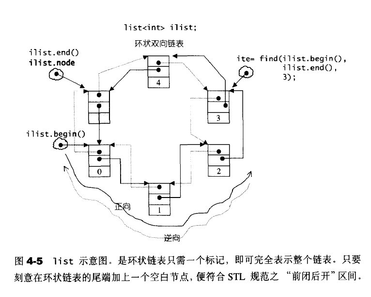

**list的构造和内存管理**

list为了方便空间配置器，额外定义了一个list_node_allocator，为的就是更方便地以节点大小为配置单位；

```c++
protected:
    //配置一个节点并传回

    link_type get_node() {return list_node_allocator::allocate();}
    //释放一个节点

    void put_node(link_type p){list_node_allocator::deallocate(p);}
    //产生(配置并构造)一个节点，带有元素值

    link_type create_node(const T& x)
    {
        link_type p=get_node();
        //全局函数，构造/析构函数

        construct(&p->data,x);
        return p;
    }
    //销毁一个节点

    void destroy_node(link_type p)
    {
        //析构函数

        destroy(&p->data);
        put_node(p);
    }
```

list提供多个构造函数，default constructor允许我们不指定任何参数做出一个空的list出来。


注意这里的插入是先产生在插入，并且是头插法。这样可以避免尾部迭代器的变动，减少工作量。

list内部提供一个transfer操作；将某个连续范围的元素迁移到某个特定位置之前。操作比较复杂。

```c++
//transfer

// typedef list_node* link_type;
void transfer(iterator position,iterator first,iterator last)
{
    if(position!=last)
    {
        (*(link_type((*last.node).prev))).next=position.node;
        (*(link_type((*first.node).prev))).next=last.node;
        (*(link_type((*position.node).prev))).next=first.node;
        link_type tmp=link_type((*position.node).prev);
        (*last.node).prev=(*first.node).prev;
        (*first.node).prev=tmp;
    }
}
```

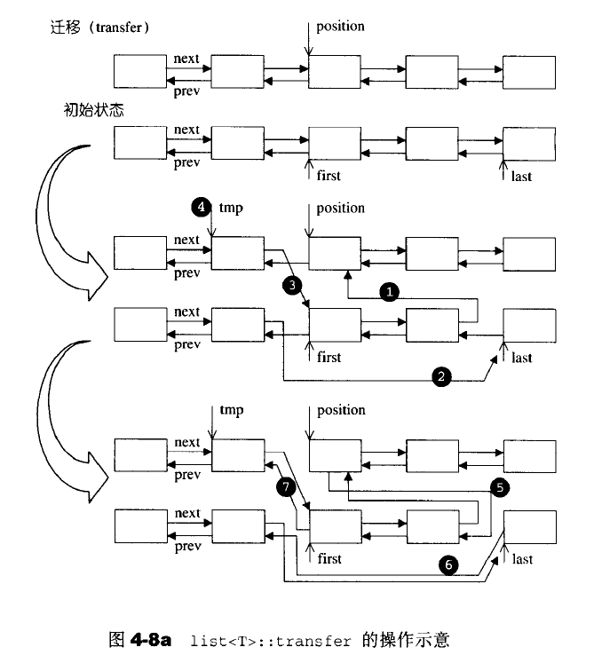

​		list 的 splice() 结合函数，有许多版本，便便指针的重新链接；但是因为链表的链接特性，因此链表无法使用sort()算法，必须使用自己的 sort()

### 4.4 deque

deque是**双向开口的连续性空间**；

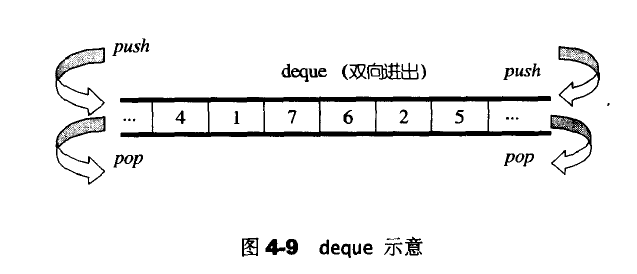

deque允许常数时间内对端进行匀速的插入或者移除操作，并且没有所谓的容量(capacity)的概念，因为他是动态地以分段连续空间组合而成的，随时可以增加一段新的空间并链接起来。因此deque的迭代器并不是普通的指针；因此除非必要，我们应该尽可能选择使用vector而非deque，为了操作的高效，可将deque先完整复制到一个vector身上，将vector排序后，再复制回去。

deque避开了vector中的反复内存搬移，但是迭代器架构却异常复杂。

deque采用一块所谓的map(一小块连续内存空间)作为主空间。其中每个元素都是指针，指向另外一段较大的连续线性空间，称为缓冲区，缓冲区才是 deque 的存储空间主体。

```c++
protected:
    //指向元素的指针

    typedef pointer* map_pointer;

protected:
    //指向的map节点指针

    map_pointer map;
    //map指针数量

    size_type map_size;
```

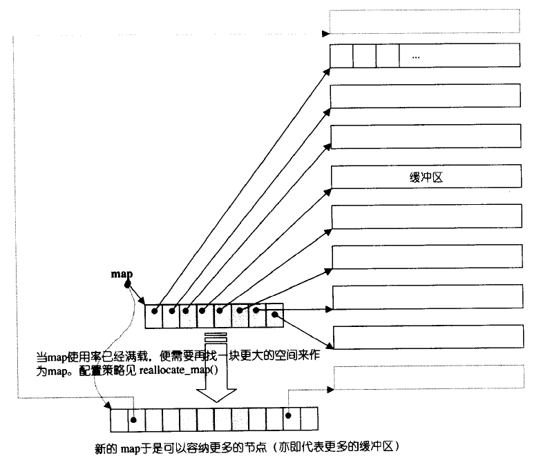

下面是 deque 中的迭代器关键代码

```c++
struct _deque_iterator
{
    typedef __deque_iterator<T,T&,T*,BufSize> iterator;
    static size_t buffer_size(){return __deque_buf_size(BufSize,sizeof(T));}
    //保持与容器的联结
    //此迭代器所指缓冲区中的当前行(current)元素

    T* cur;
    //缓冲区的头部元素

    T* first;
    //缓冲区的尾部元素

    T* last;
    //缓冲区管理中心

    map_pointer node;

    inline size_t __deque_buf_size(size_t n,size_t sz)
    {
        return n!=0?n:(sz<512?size_t(512/sz):size_t(1));
    }

};
```

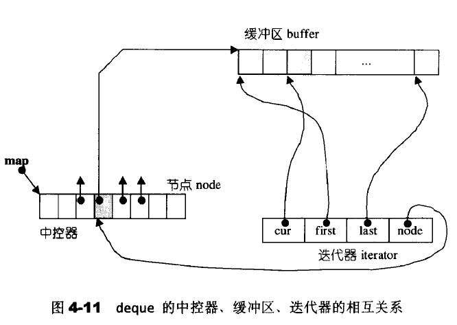


deque数据结构

```c++
template <class T,class Alloc=alloc,size_t BufSiz=0>
class deque
{
public:
    typedef T value_type;
    typedef value_type* pointer;
    typedef size_t size_type;
    ...
protected:
    //元素的指针的指针

    typedef pointer* map_pointer;
    //第一个节点

    iterator start;
    //最后一个节点

    iterator finish;
    //指向mao,mao是连续空间

    map_pointer map;
    //map内指针数量

    size_type map_size;
}
```

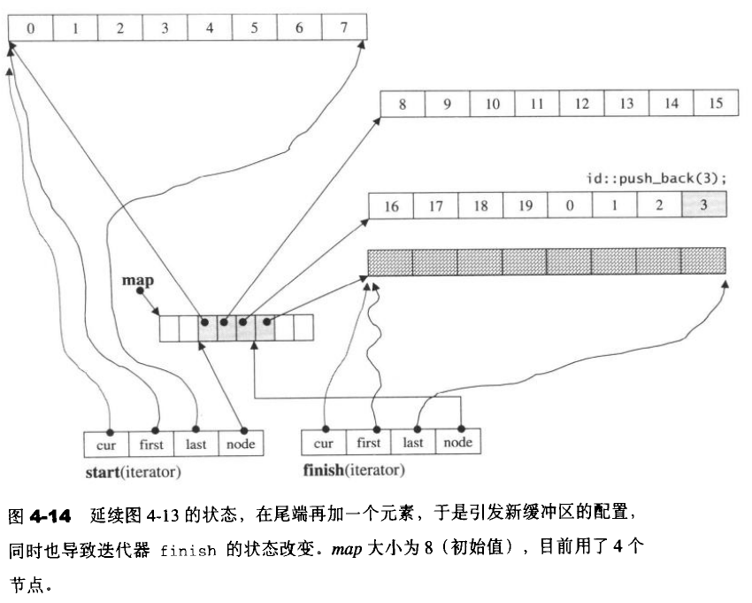

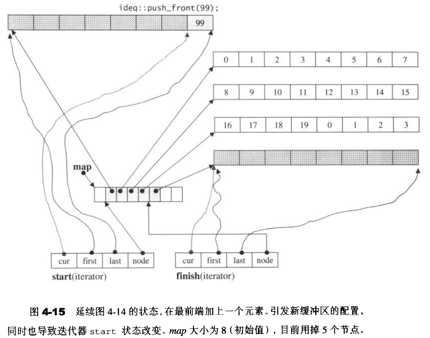


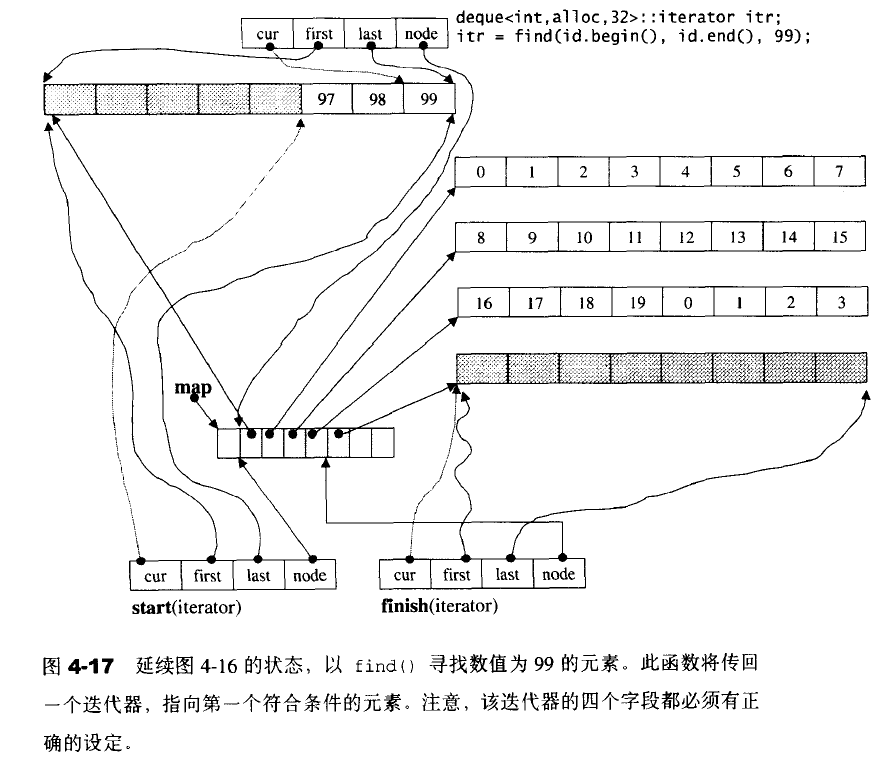

### 4.5 stack

stack允许新增元素、移除元素、取得最顶端元素。但是不允许遍历行为。 stack没有迭代器，所有元素都是靠存取函数进行操作。 stack以list作为底层容器，键list作为底层结构并封闭其头端口。

### 4.6 queue

queue是一种先进先出的数据结构。有两个出口，允许新增元素、移除元素、从最低端加入元素、取得最顶端元素。

queue主要是用deque作为双向开口的数据结构，作为缺省的情况下作为queue底部结构。

queue没有迭代器，符合“先进先出”的条件，只有queue顶端的元素，才有机会被外界取用。queue不提供遍历功能，也不提供迭代器。

### 4.7 heap(隐式表示，implicit representation)

可以使用 array 的 i 表示某一个节点，那么左子节点就必须位于array的2i处，右子节点必须位于array的2i+1处。 根据元素排列方式，heap可以分为：

- max-heap: 每个节点键值都大于或者等于其子节点的键值
- min-heap: 每个节点键值都小于或者等于其子节点的键值


下面是进行插入排序的关键代码

```c++
template <class RandomAccessIterator>
inline void push_heap(RandomAccessIterator first,
                        RandomAccessIterator last)
{
    //调用此函数时，新元素应该已经置于底部容器的最尾端

    __push_heap_aux(first,last,distance_type(first),value_type(first));
}

template <class RandomAccessIterator,class Distance,class T>

inline void __push_heap_aux(RandomAccessIterator first,RandomAccessIterator last,Distance*,T*)
{
    //将新值置于底部容器的最底端

    __push_heap(first,Distance((last-first)-1),Distance(0),T(*(last-1)));
}

template <class RandomAccessIterator,class Distance,class T>
void __push_heap(RandomAccessIterator first,Distance holeIndex,Distance topIndex,T value)
{
    //找到父节点

    Distance parent=(holeIndex-1)/2;
    //这里使用while循环，循环调节插入的节点位置

    while(holeIndex>topIndex&&
        *(first+parent)<value) {
        //当尚未达到顶端，且父节点小鱼新值(于是不符合heap的次序特性)

        //令当前值为父值

        *（first+holeIndex）=*(first+parent);
        holeIndex=parent;
        //更新parent index

        parent=(holeIndex-1)/2;
    }
    //令洞值为新值，完成插入操作

    *(first+holeIndex)=value;

}
```

​		对于 heap_pop：将根节点取走后，填入上述失去声明空间的叶节点值，再将它拿来和其它两个子节点比较值，并与较大子节点对调位置，直到根节点的键值大于左右两个子节点，或者直到放至叶节点为止。

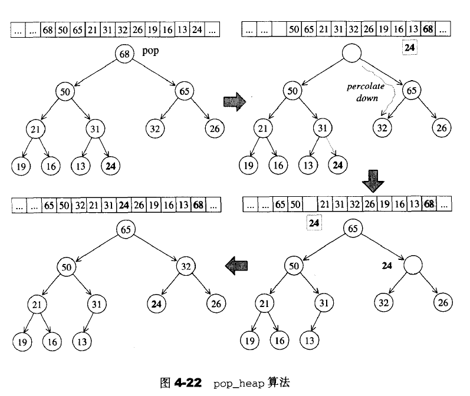

```c++
template <class RandomAccessIterator>
inline void pop_heap(RandomAccessIterator first,
                        RandomAccessIterator last)
{
    //调用此函数时，新元素应该已经置于底部容器的最尾端

    __pop_heap_aux(first,last,value_type(first));
}

template <class RandomAccessIterator,class Distance,class T>

inline void __pop_heap_aux(RandomAccessIterator first,RandomAccessIterator last,Distance*,T*)
{
    //pop操作应该为容器的第一个元素，因此，首先设定欲调整值为尾值，然后将首值调至尾节点(所以以上将迭代器result设为last-1)。然后重整[first,last-1)，使之重新形成一个合格的heap

    __pop_heap(first,last-1,T(*(last-1)),distance_type(first));
}

template <class RandomAccessIterator,class Distance,class T>
void __pop_heap(RandomAccessIterator first,
        RandomAccessIterator last,
        RandomAccessIterator result,
        T value,
        Distance*
        )
{
    //设定尾值为首值，于是尾值即为欲求结果，可由客户端稍后再以底层容器之pop_back()取出尾值

    *result=*first;
    //重新调整heap,洞号为0(亦即树根处)，欲调整值为value(原尾值)；

    __adjust_heap(first,Distance(0),Distance(last-first),value);

}
//一下这个__adjust_head()不允许指定“大小比较标准”
template <class RandomAccessIterator,class Distance,class T>
void __adjust_heap(
    RandomAccessIterator first,
    Distance holeIndex,
    Distance len,
    T value
    )
{
    Distance topIndex=holeIndex;
    //洞节点的右节点

    Distance secondchild=2*holeIndex+2;
    while(secondchild<len) {
        //使secondchild代表较大节点

        if(*(first+secondchild)<*(first+(secondchild-1)))
        {
            secondchild--;
        }
        //令较大子值为洞值，再令洞号下移至较大子节点处

        *(first+holeIndex)=*(first+secondchild);
        holeIndex=secondchild;
        //找出新洞节点的右子节点

        secondchild=2*(secondchild+1);
    }
    //没有右子节点，只有左子节点

    if(secondchild==len){
        //Percolate down:令左子值为洞值，再令洞号下移至左子节点处。

        *(first+holeIndex)=*(first+(secondchild-1));
        holeIndex=secondchild-1;
    }
    //将欲调整值填入目前的洞号内，注意，此时肯定满足次序特性

    __push_heap(first,holeIndex,topIndex,value);
}
```

**sort_heap算法**

可以通过每次取得heap的最大值来进行pop_heap操作，对，每次操作将操作范围从后向前缩减一个元素(因为pop_heap会把键值最大的元素放在底部容器的最尾端)，当整个程序执行完毕时，我们便有了一个递增序列

```c++
template <class RandomAccessIterator>
void sort_heap(RandomAccessIterator first,
                RandomAccessIterator last)
{
    //以下，每执行一次pop_heap(),极值(在STL heap中为极大值)即被放在尾端。这样一直下去，最后得到排序结果

    while(last-first>1) {
        //每执行pop_heap()一次，操作范围即退缩一格

        pop_heap(first,last--);
    }
}
```

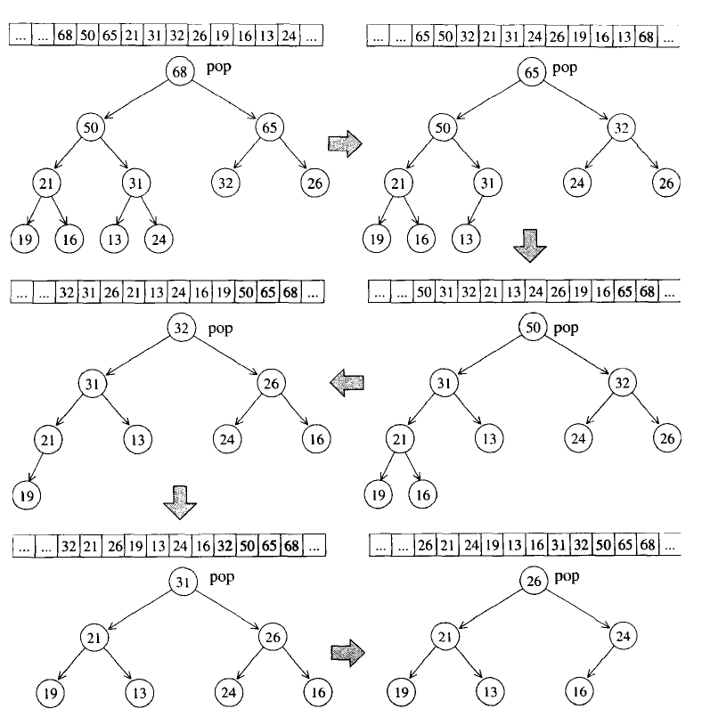

**make_heap算法**

```c++
template <class RandomAccessIterator>
inline void make_heap(
    RandomAccessIterator first,
    RandomAccessIterator last
    )
{
    __make_heap(first,last,value_type(first),distance_type(first));
}
template <class RandomAccessIterator ,class T,class Distance>
void __make_heap(RandomAccessIterator first,
                RandomAccessIterator last,
                T*,
                Distance)
{
    //长度不够直接跳出

    if(last-first<2) return;
    //获取数据的长度

    Distance len=last-first;
    //找出第一个需要重排的子树头部，以parent标出。由于任何叶节点都不需要执行 perlocate down,所以有一下计算。parent命名佳，以holeIndex更好

    Distance parent=(len-2)/2;

    while(true)
    {
        //重新排列以parent为首的子树。len是为了让__adjust_heap()判断操作范围

        __adjust_heap(first,parent,len,T(*(first+parent)));
        
        if(parent==0) return;
        //移动头部节点

        parent--;
    }
}
```

注意heap没有迭代器

### 4.9 slist

STL list是一个双向链表(double linked list)。SGI STL 另外提供了一个单项链表(slist)。这个容器并不再标准规格之内。

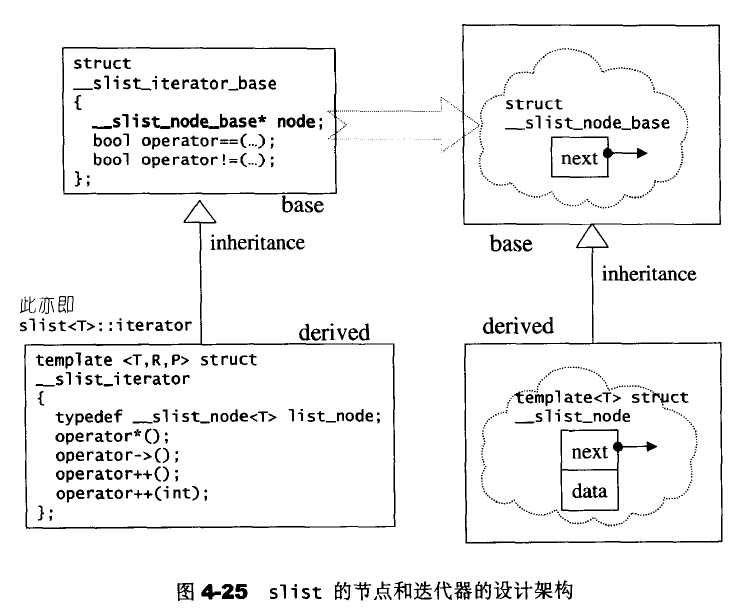

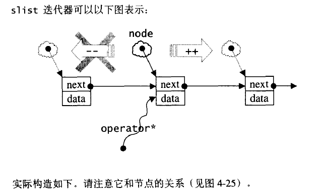


