## 第五章 关联式(associative)容器

​		当元素被插入到关联式容器中时，容器内部结构(可能是RB-tree或者hash-table)便依照其键值大小，以某种特定规则将这个元素放置于合适的位置，关联式容器没有所谓头尾(只有最大元素和最小元素)；所以不会有所谓`push_back()`、`push_front()`等行为的操作。 一般而言关联式容器的内部结构是一个二叉平衡树，以便获得良好的搜寻效率。二叉平衡树有许多变形包括：AVL-tree、RB-tree、AA-tree；其中RB-tree被广泛应用于关联式容器。

### 5.1 树的导览

这里可以去看数据结构与算法中关于树的描述，在此不做过多叙述。

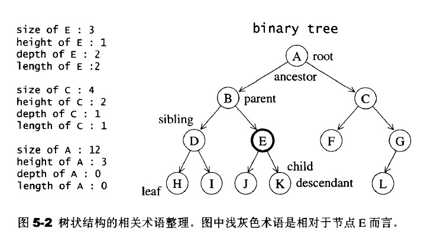

### 5.2 RB-tree(红黑树)

*参考链接：* [红黑树(四)之 C++的实现](https://www.cnblogs.com/skywang12345/p/3624291.html)

AVL-tree基本规则：

- 每个节点不是红色就是黑色(图中深色底纹代表黑色，浅色底纹代表红色，同下)。
- 根节点为黑色
- 如果节点为红，其子节点必须为黑色
- 任一节点至NULL(树尾端)的任何路径，所含之黑节点数木必须相同

关于它的特性，需要注意的是：

- 特性(3)中的叶子节点，是只为空(NIL或null)的节点。
- 特性(5)，确保没有一条路径会比其他路径长出俩倍。因而，红黑树是相对是接近平衡的二叉树。


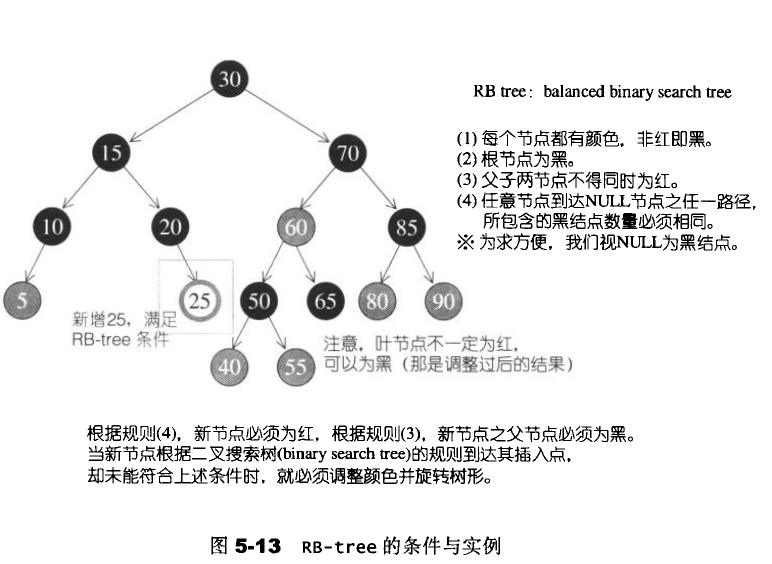

#### 5.2.1 插入节点

因为红黑树的规则对于不同的插入存在以下四种情况：

- 状况1：s为黑色x为外侧插入，对此情况，先对P,G做一次单旋转，再更改P,G颜色，即可重新满足红黑树的规则3。

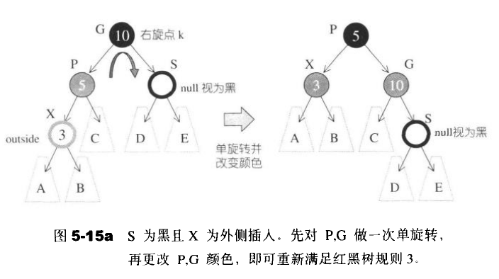

- 状况2:S为黑且x为内侧插入，对此情况，我们必须先对P,X做一次单旋转并更改G,X颜色，再将结果对G做一次单旋转，级可再次满足红黑树规则3.

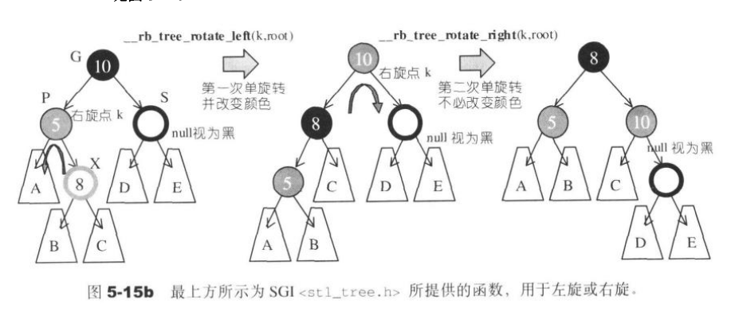

- 状况3:S为红色且X为外侧插入，对此情况，先对P和G做一次单旋转，并改变X的颜色。此时如果GG为黑，一切搞定，如果GG为红，则是状况4

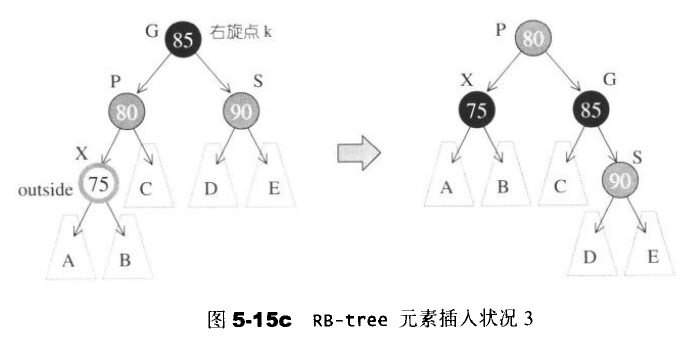

- 状况4:S为红且X为外侧插入。对此情况，先对P和G做一次单旋转，并改变X的颜色。此时如果GG亦为红，还得持续往上做，直到不再有父子连续为红的情况发生。

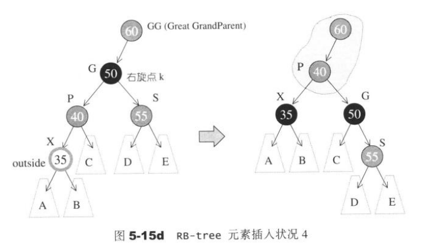

#### 5.2.2 一个由上而下的程序

一个由上而下的程序，假设新增节点为A,那么就沿着A的路径，只要看到某个节点X的两个子节点皆为红色，就把X该为红色，并把两个子节点改为黑色。然后在进行旋转变换。

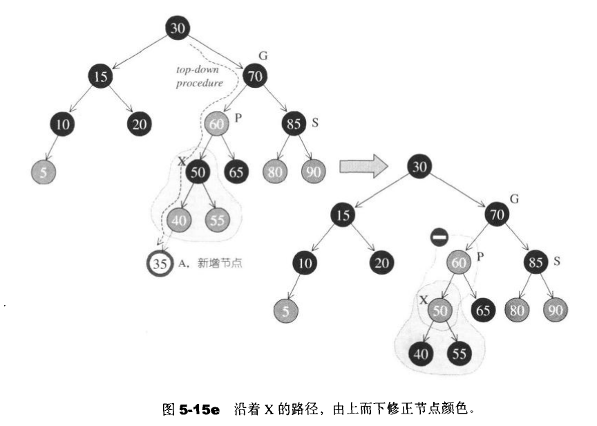

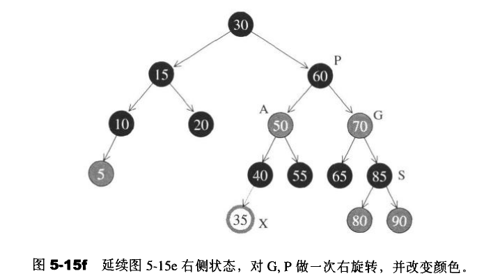

#### 5.2.3 RB-tree的节点设计

```
typedef bool __rb_tree_color_type;
//红色为0

const __rb_tree_color_type __rb_tree_red=false;
const __rb_tree_color_type __rb_tree_black=true;

struct __rb_tree_node_base
{
    typedef __rb_tree_color_type color_type;
    typedef __rb_tree_node_base* base_ptr;
    //节点颜色，非红即黑

    color_type color;
    //节点的父节点指针

    base_ptr parent;
    //左节点指针

    base_ptr left;
    //右节点指针

    base_ptr right;
    static base_ptr minimum(base_ptr x)
    {
        while(x->left!=0)x=x->left;
        return x;
    }
    static base_ptr maximum(base_ptr x)
    {
        while(x->right!=0)x=x->right;
        return x;
    }
};

template <class Value>
struct  _rb_tree_node:public __rb_tree_node_base
{
    typedef __rb_tree_node<Value>* link_type;
    //节点值

    Value value_field;
    
};
```

#### 5.2.4 RB-tree的迭代器

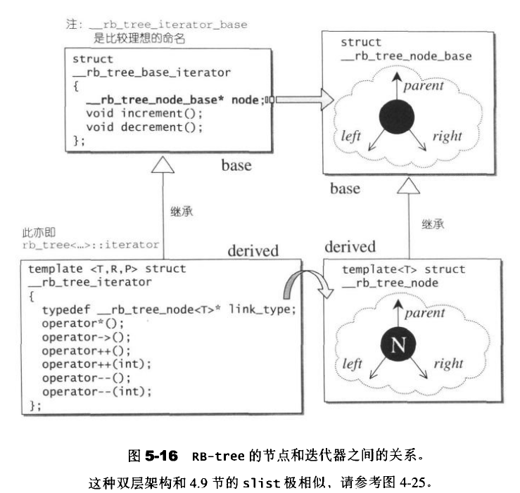

```
struct __rb_tree_base_iterator
{
    typedef __rb_tree_node_base::base_ptr base_ptr;
    typedef bidirectional_iterator_tag iterator_category;
    typedef ptrdiff_t difference_type;
    //用来与容器之间产生一个连接关系

    base_ptr node;
    void increment()
    {
        //状况1

        if(node->right!=0)
        {
            //存在右节点，就往右节点走
            
            node=node->right;
            //然后一直往左子树，走到底

            while(node->left!=0) {
                node=node->left;
            }
            //状况2

        }else{
            //没有右子节点，先找出父节点

            base_ptr y=node->parent;
            //如果现行节点本身就是个右子节点,就一直上朔，直到"不为右子节点"为止

            while(node==y->right)
            {
                node=y;
                y=y->node;
            }
            //如果此时右子节点不等于次吃的父节点状况3，此时的父节点即为解答，否则此时的node为解答状况4

            if(node->right!=y)
            {
                node=y;
            }
        }
    }
    //注意：以上判断"若此时的右子节点不等于次吃的父节点"，是为了应付一种特殊情况：
    //我们欲寻找根节点的下一个节点，而恰巧根节点无左右子节点
    //以上的特殊做法必须配合RB-tree根节点与特殊之header之间的特殊关系

    //以下可以实现于operator--内，因为再无他处会调用此函数了

    void decrement()
    {
        //如果是红节点，且父节点的父节点等于自己,即node为head或者end节点的时候

        if(node->color==__rb_tree_red&&
            node->parent->parent==node){
            node=node->right;
        }else if(node->left!=0)
        {
            base_ptr y=node->left;
            //一直向右循环查找下去，直到没有右子节点

            while(y->right!=0){
                y=y->right;
            }
            node=y; 
        }else{
            //即非根节点，亦无左子节点
            //先找到符节点

            base_ptr y=node->parent;
            //找寻父节点的左子节点直到node不是左子节点

            while(node==y->left)
            {
                //这里主要是一直上朔

                node=y;
                y=y->parent;
            }
        }
    }

};
//RB-tree的正规迭代器

template <class Value,class Ref,class Ptr>
struct __rb_tree_iteraror:public __rb_tree_base_iterator
{
    typedef Value value_type;
    typedef Ref reference;
    typedef Ptr pointer;
    typedef __rb_tree_iterator<Value,Value&,Value*> iterator;
    typedef __rb_tree_iterator<Value,const Value&,const Value*> const_iterator;
    typedef __rb_tree_iterator<Value,Ref,Ptr> self;
    typedef __rb_tree_node<Value>* link_type;

    __rb_tree_iterator() {}
    __rb_tree_iterator(link_type x){node=x;}
    __rb_tree_iterator(const iterator& it){node=it.node;}

    reference operator*() const {return link_type(node)->value_field;}
#ifndef __SGI_STL_NO_ARROW_OPERATOR     pointer operator->() const {return &(operator*());}
#endif     self& operator++() {increment(); return *this;}
    self operator++(int){
        self tmp=*this;
        increment();
        return tmp;
    }
    self& operator--() {decrement();return *this;}
    self operator--(int){
        self tmp=*this;
        decrement();
        return tmp;
    }
};
```

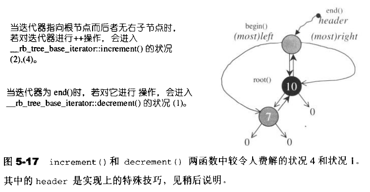

这里主要是因为当红黑数中为空的时候，head与end互为父节点

**RB-tree的数据结构**

```
template <class Key,class Value,class KeyOfValue,class Compare,class Alloc=alloc>
class rb_tree{
protected:
    typedef void*  void_pointer;
    typedef __rb_tree_node_base* base_ptr;
    typedef __rb_tree_node<Value> rb_tree_node;
    typedef simple_alloc<rb_tree_node,Alloc> rb_tree_node_allocator;
    typedef __rb_tree_color_type color_type;
public:
    typedef key key_type;
    typedef Value value_type;
    typedef value_type* pointer;
    typedef const value_type* const_pointer;
    typedef value_type& reference;
    typedef const value_type& const_reference;
    typedef rb_tree_node* link_type;
    typedef size_t size_type;
    typedef ptrdiff_t difference_type;
protected:
    link_type get_node(){return rb_tree_node_allocator::allocate();}
    void put_node(link_type p){rb_tree_node_allocator::deallocate(p);}

    link_type create_node(const value_type& x)
    {
        link_type tmp=get_node();
        __STL_TRY{
            //构造内容

            construct(&tmp->value_field,x);
        }
        __STL_UNWIND(put_node(tmp));
        return tmp;
    }
    //复制一个节点(的值和颜色)

    link_type clone_node(link_type x)
    {
        link_type tmp=create_node(x->value_field);
        tmp->color=x->color;
        tmp->left=0;
        tmp->right=0;
        return tmp;
    }
    void destroy_node(link_type p)
    {
        //析构内容

        destroy(&p->value_field);
        //释放内存

        put_node(p);
    }
protected:
    //节点数目

    size_type node_count;
    link_type header;
    //节点的键值大小比较准则，应该会是一个function object;

    Compare key_compare;
    //方便的header成员取用

    link_type& root() const {return (link_type&) header->parent;}
    link_type& leftmost() const {return (link_type&) header->left;}
    link_type& rightmost() const {return (link_type&) header->right;}
    //获取节点x的成员变量

    static link_type& left(link_type x){return (link_type&)(x->left);}
    static link_type& right(link_type x){return (link_type&)(x->right);}
    static link_type& parent(link_type x){return (link_type&)(x->parent);}
    static reference value(link_type x){return x->value_field;}
    static const Key& key(link_type x){return KeyOfValue()(value(x));}
    static color_type& color(link_type x){return (color_type&)(x->color);}
    //求取极大值和极小值
    static link_type minimum(link_type x){
        return (link_type) __rb_tree_node_base::minimum(x);
    }
    static link_type maximum(link_type x){
        return (link_type)__rb_tree_node_base::maximum(x);
    }
public:
    typedef __rb_tree_iterator<value_type,reference,pointer> iterator;
private:
    iterator __insert(base_ptr x,base_ptr y,const value_type& v);
    link_type __copy(link_type x,link_type p);
    void __erase(link_type x);
    void init(){
        //产生一个节点空间，令header指向它

        header=get_node();
        //令header为红色，用来区分header和root
        
        color(header)=__rb_tree_red;
        root()=0;
        //header的左右子节点都为自己

        leftmost()=header;
        rightmost()=header;
    }
public:
    rb_tree(const Compare& comp=Compare()):node_count(0),key_compare(comp){init();}
    ~rb_tree(){
        clear();
        put_node(header);
    }
    rb_tree<Key,Value,KeyOfValue,Compare,Alloc>& operator=(const rb_tree<Key,Value,KeyOfValue,Compare,Alloc>& x);
    //相关的基本函数

    Compare key_comp() const {return key_compare;}
    iterator begin() {return leftmost();}
    iterator end() {return header;}
    bool empty() const {return node_count==0;}
    size_type size() const {return node_count;}
    size_type max_size() const {return size_type(-1);}
public:
    //将x插入到红黑树中,保持节点独一无二

    pair<iterator,bool> insert_unique(const value_type& x);
    //插入，允许值重复

    iterator insert_equal(const value_type& x);
}
```

RB-tree的构造方式有两种，一种是拷贝构造，一种是空值构造。下面是其init()的关键函数

```
private:
    void init()
    {
        header=get_node();
        color(header)=rb_tree_redl

        root()=0;
        leftmost()=header;
        rightmost()=header;
    }
```

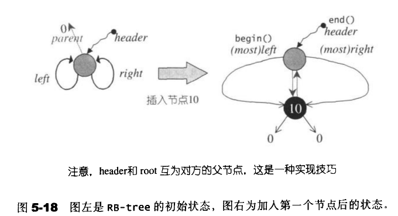

**RB-tree的关键操作**

**元素插入 insert_equal()**

```
template <class Key,class Value,class KeyOfValue,class Compare,class Alloc>

typename rb_tree<Key,Value,KeyOfValue,Compare,Alloc>::iterator 

rb_tree<Key,Value,KeyOfValue,Compare,Alloc>::insert_equal(const Value& v)
{
    link_type y=header;
    link_type x=root();
    //从根节点开始向下寻找适当的传播节点，直到到根节点，注意这里y为x的parent节点

    while(x!=0) {
        y=x;
        //遇大则左，遇小或者等于就右--v<x向左，v>=x向右

        x=key_compare(KeyOfValue()(v),key(x))?left(x):right(x);
    }
    //x为新值插入点，y为插入点之父节点，v为新值

    return __insert(x,y,v);
}
```

**元素插入操作insert_unique()**

元素插入操作–不允许重复值存在，否则插入无效 函数返回的元素是一个pair值，第一个个是RB-tree迭代器，指向新增节点，第二个元素表示是否插入成功。

```
template <Class Key,class Value,class KeyOfValue,class Compare, class Alloc>

pair<typename rb_tree<Key,Value,KeyOfValue,Compare,Alloc>::iterator,bool>

rb_tree<Key,Value,KeyOfValue,Compare,Alloc>::insert_unique(const Value& v)
{
    link_type y=header;
    //从根节点开始

    link_type x=root();
    //判断是否相同

    bool comp=true;
    //一直遍历到根节点

    while(x!=0)
    {
        y=x;
        //v是否小于目前节点的键值

        comp=key_compare(KeyOfValue()(v),key(x));
        //遇“大”向左，否则向右

        x=comp?left(x):right(x);
    }
    //离开while循环之后，即插入父节点
    //令迭代器j指向插入点的父节点

    iterator j=iterator(y);
    //如果在左边插入

    if(comp)
    {
        //如果插入节点为最左节点

        if(j==begin())
        {
            return pair<iterator,bool>(__insert(x,y,v),true); 
        }else{
            //调整j准备回头进行测试

            --j;
        }
    }
    //如果小于新值，将插入右侧
    //比较是否存在重复的值

    if(key_compare(key(j.node),KeyOfValue()(v))){
        return pair<iterator,bool>(__insert(x,y,v),true);
    }
    return pair<iterator,bool>(j,false);

}
//关键插入程序

template <class Key,class Value,class KeyOfValue,class Compare,class Alloc>
typename rb_tree<Key,Value,KeyOfValue,Compare,Alloc>::iterator

rb_tree<Key,Value,KeyOfValue,Compare,Alloc>::__insert(base_ptr x_,base_ptr y_,const Value& v)
{
    //将值隐式转换为节点指针，x插入位置，y插入父节点，v插入的值

    link_type x=(link_type)x_;
    link_type y=(link_type)y_;
    link_type z;
    //判断是否为首节点

    if(y==header||x!=0||key_compare(KeyOfValue()(v),key(y)))
    {
        //产生一个新节点

        z=create_node(v);
        //重新调整最由节点

        left(y)=z;
        if(y==header){
            root()=z;
            rightmost()=z;
            //如果y为最左节点

        }else if(y==leftmost()){
            //让最左节点永远指向z

            leftmost()=z;
        }

        //不是head节点或者空节点

    }else{
        //产生一个新节点

        z=create_node(v);
        //令新节点作为插入节点的右兄弟节点

        right(y)=z;
        //更新最右指针位置

        if(y==rightmost()){
            rightmost()=z;
        }
    }
    //设置新节点的父节点,右子节点和左子节点

    parent(z)=y;
    left(z)=0;
    right(z)=0;
    //调整和设置新节点的颜色

    __rb_tree_rebalance(z,header->parent);
    ++node_count;
    //返回插入的迭代器

    return iterator(z);
}
//调整rb-tree(旋转和改变颜色)，节点和节点的父节点

inline void __rb_tree_rebalance(__rb_tree_node_base* x,__rb_tree_node_base*& root)
{
    //新节点毕为红

    x->color=__rb_tree_red;
    //假设父节点为红色,按照之前的4种情况进行判断然后调整

    while(x!=root&&x->parent->color==__rb_tree_red){
        //判断父节点是否为左子节点

        if(x->parent==x->parent->parent->left){
            //y指向右伯节点

            __rb_tree_node_base* y=x->parent->parent->right;
            //如果y存在并且也为红色

            if(y&&y->color==__rb_tree_red)
            {
                //更改父节点为黑色

                x->parent->color=__rb_tree_black;
                //更改父节点为黑色

                y->color=__rb_tree_black;
                //更改祖父节点为红

                x->parent->parent->color=__rb_tree_red;
                //x重新指向祖节点,再次循环迭代更改

                x=x->parent->parent;
                //无伯父节点，或者伯父节点为黑

            }else{
                //如果新节点为右子节点

                if(x==x->parent->right){
                    //x重新指向父节点

                    x=x->parent;
                    //第一参数为左旋点进行左旋

                    __rb_tree_rotate_left(x,root);
                }
                //改变颜色
                x->parent->color=__rb_tree_black;
                x->parent->parent->color=__rb_tree_red;
                //第一参数为右旋点

                __rb_tree_rotate_right(x->parent->parent,root);
            }
        //父节点为祖父节点之右子节点

        }else{
            //y为左伯父节点

            __rb_tree_node_base* y=x->parent->parent->left;
            //左伯父节点存在且为红色

            if(y&&y->color==__rb_tree_red)
            {
                //更改父节点为黑

                x->parent->color=__rb_tree_black;
                //伯父节点为黑色

                y->color=__rb_tree_black;
                //更改祖父节点为红色

                x->parent->parent->color=__rb_tree_red;
                //移动指针准备继续向上查
                
                x=x->parent->parent;
            //无伯父节点或伯父节点为黑

            }else{
                //如果新节点为父节点之左子节点

                if(x==x->parent->left){
                    x=x->parent;
                    //第一参数为右旋点

                    __rb_tree_rotate_right(x,root);
                }
                x->parent->color=__rb_tree_black;
                x->parent->parent->color=__rb_tree_red;
                //第一参数为左旋点

                __rb_tree_rotate_left(x->parent->parent,root);
            }
        }
    }//end while
    //root节点永远为黑

    root->color=__rb_tree_black;
}
//左旋函数，主要是将x和它的右子节点进行交换

inline void __rb_tree_rotate_left(__rb_tree_bode_base* x,__rb_tree_bode_base*& root)
{
    //x为旋转点，y为旋转点的右子节点

    __rb_tree_node_base* y=x->right;
    //将x的右子节点为其右子节点的左节点

    x->right=y->left;
    //存在且不为0，则交换指针位置，指直接将x的右子节点与x交换位置

    if(y->left!=0){
        //更新x指针位置

        y->left->parent=x;
    }
    y->parent=x->parent;
    //这里分空节点和单左/右节点进行讨论

    if(x==root){
        root=y;
    }else if(x==x->parent->left){
        x->parent->left=y;
    }else{
        x->parent->right=y;
    }
    y->left=x;
    x->parent=y;
}

inline void __rb_tree_rotate_right(__rb_tree_node_base* x,__rb_tree_node_base*& root)
{
    //x为旋转点,y为旋转的左子节点

    __rb_tree_node_base* y=x->left;
    x->left=y->right;
    if(y->right!=0){
        y->right->parent=x;
    }
    y->parent=x->parent;
    //令y完全顶替x的地位(必须将x对其父节点的关系完全接收过来)

    if(x==root){
        root=y;
    }else if(x==x->parent->right){
        x->parent->right=y;
    }else{
        x->parent->left=y;
    }
    y->right=x;
    x->parent=y;
}

//rb-tree的查找函数

template <class Key,class Value,class KeyOfValue,class Compare,class Alloc>
typename rb_tree<Key,Value,KeyOfValue,Compare,Alloc>::iterator

rb_tree<Key,Value,KeyOfValue,Compare,Alloc>::find(const Key& k){
    //rb树的头部

    link_type y=header;
    link_type x=root();

    while(x!=0){
        if(!key_compare(key(x),k)){
            //x大于k向左走

            y=x;
            x=left(x);
        }else{
            //x小于k,遇到小值就向右走

            x=right(x);
        }
    }
    iterator j=iterator(y);
    return (j==end()|| key_compare(k,key(j.node)))?end():j;
}
```

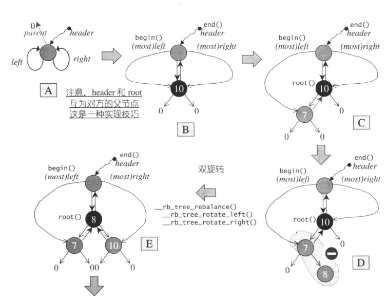

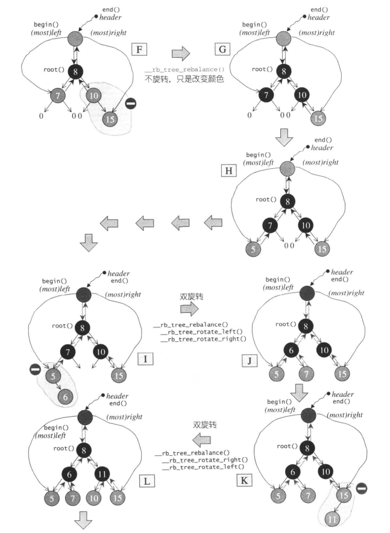

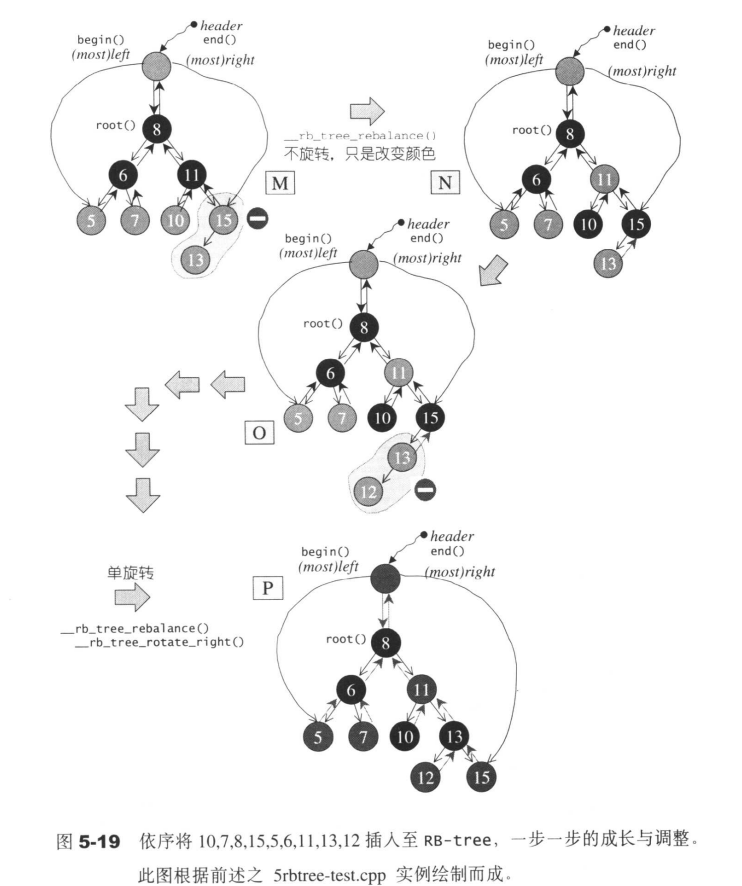

### 5