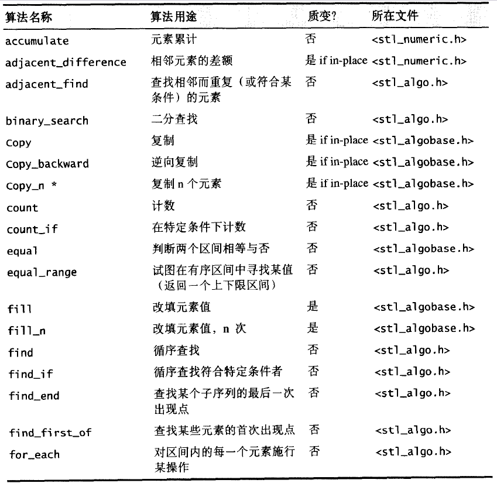
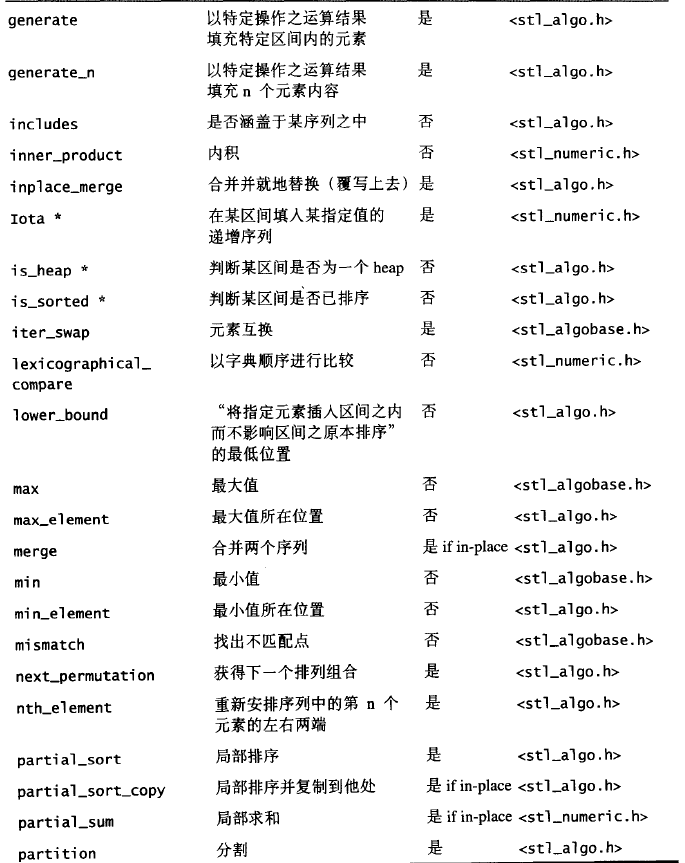
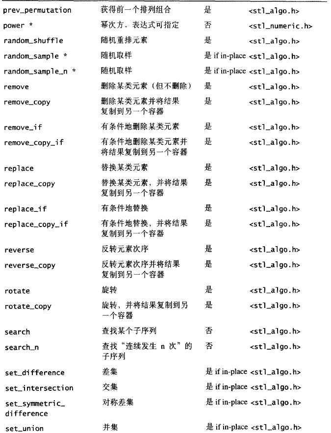
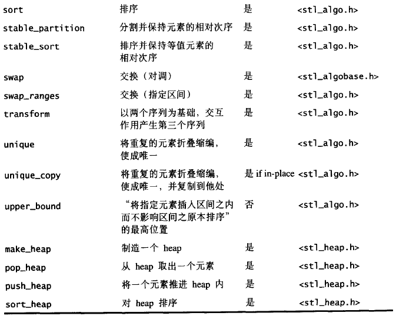
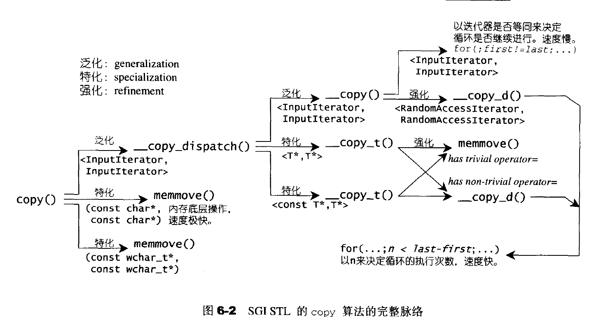
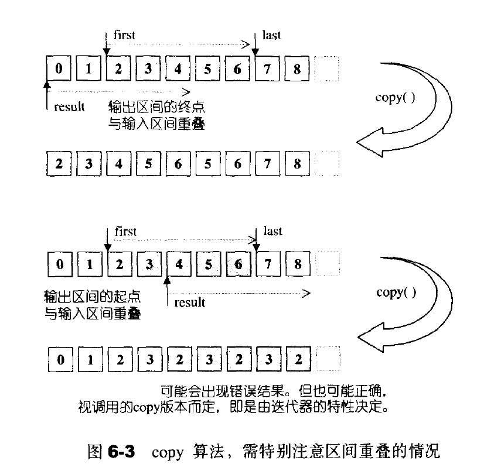
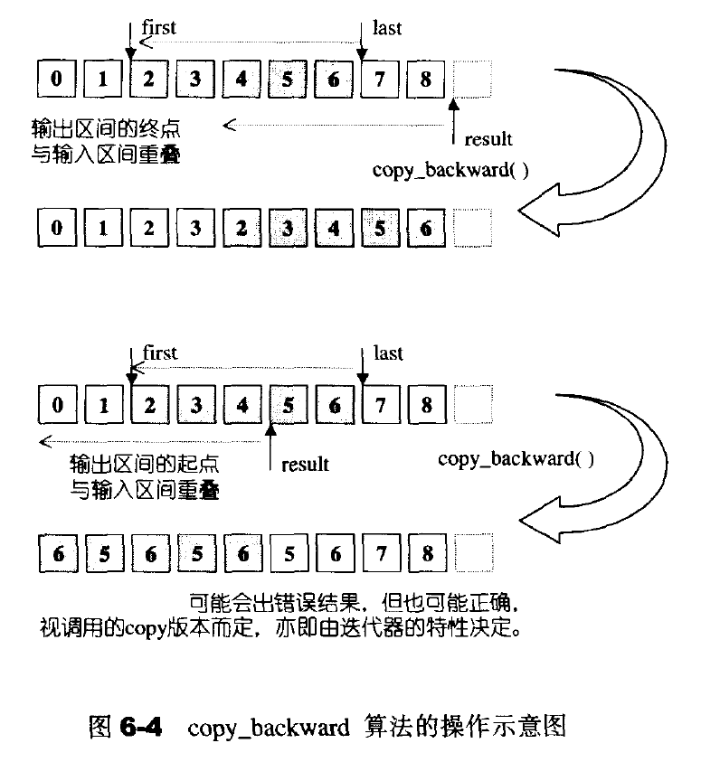

## 算法

### 算法总览和分类

**STL算法总览**









**算法分类**

- 质变算法：会改变操作对象之值；如copy、swap、replace、fill、remove、permutation、aprtition、random shuffling、sort等
- 非质变算法：不改变操作对象之值：find、search、count、for_each、equal、mismatch、max、min等


**STL算法的一般形式**

质变算法一半提供两个版本：in-place–就地改变操作对象;copy–将操作对象的内容复制一份副本(通常以_copy结尾)，操作后返回。

### 6.3 数值算法

数值算法一般包含在表头中，实现是在文件中

- accumulate 关键操作: init=init+*i(第一版本)、init=binary_op(init,*i*)(第二个版本)
- adjacent_difference:计算相邻元素的差额关键代码： *i-*(i-1)；
- inner_product:能够计算一般内积，`result=result+(*i)**(first2+(i-first))`
- partial_sum计算局部总和
- power:计算指数([C++中位运算的使用方法](https://blog.csdn.net/a1351937368/article/details/77746574/);[ STL源码分析之power算法](https://blog.csdn.net/u012062760/article/details/46401115);[快速计算x的n次幂](https://blog.csdn.net/MoreWindows/article/details/7174143))

```c++
T power(T x,Integer n,Monoidoperation op)
{
    if(n==0){
        return identity_element(op);
    }else{
        //进行位运算直到为偶数，这里主要是为了过滤掉低位的0

        while((n&1)==0){
            n>>=1;
            x=op(x,x);
        }
        //重新计算x，n变为偶数

        T result=x;
        n>>=1;
        //

        while(n!=0)
        {
            x=op(x,x);
            //发现是奇数;将奇数去除，即乘一个x

            if((n&1)!=0){
                result=op(result,x);
            }
            //除以2

            n>>=1;
        }
        return result;
    }
}
/* 第一步判断n是否为0； 第一个while循环，尽可能的将底数变的更大，更好进行后续的计算，经过第一个while之后，n肯定是一个奇数了，再进入第二个循环，如果是1，则直接返回。 第二个while循环感觉就是求当前底数（x的偶数次平方，y）的奇数（m）次平方的过程，也就是求m的二进制各个位是否为1的过程，如果当前位M为1，则结果额外乘以y的2^M次方~ */
```

在这里顺道测试了一下GCC的stl的性能

```c++
#include<bits/stdc++.h> #include<cmath> using namespace std;
//朴素算法
long pusu(int x,int n)
{
    long num=1;
    for(int i=0;i<n;i++)
    {
        num*=x;
    }
    return num;
}
//分治算法----快速幂
long fenzhi(int x,int n)
{
    long num=1;
    while(n)
    {
        if((n&1)!=0)
        {
            num*=x;
            n--;
        }
        x*=x;
        n/=2;
    }
    return num;
}
//stl算法
long stl_pow(int x,int n)
{
    if (n == 0)
    {
        return 1;
    }
    else
    {
        while ((n & 1) == 0)
        {
            n >>= 1;
            x *= x;
        }
    }
    long result = x;
    n >>= 1;
    while (n != 0)
    {
        x *= x;
        if ((n & 1) != 0)
            result *= x;
        n >>= 1;
    }
    return result;
}
int main()
{
    int x=3,n=5,k=2;
    //cin>>x>>n;
   for(int i=0;i<k;++i){
    ++x; 
  for(int j=0;j<k;++j){
    ++n;
    long result;
    clock_t start_time=clock();
    long temp1=pusu(x,n);
    cout<<"朴素算法结果:"<<temp1<<endl;
    clock_t end_time=clock();
    printf("Running time is: %lfms\n",static_cast<double>(end_time-start_time)/CLOCKS_PER_SEC*1000);
    clock_t start_time1=clock();
    long temp2=fenzhi(x,n);
    cout<<"分治算法结果:"<<temp2<<endl;
    clock_t end_time1=clock();
    printf("Running time is: %lfms\n",static_cast<double>(end_time1-start_time1)/CLOCKS_PER_SEC*1000);
    clock_t start_time2=clock();
   cout<<"STL_power:"<<stl_pow(x,n)<<endl;    
   clock_t end_time2=clock();
   printf("Running time is: %lfms\n",static_cast<double>(end_time2-start_time2)/CLOCKS_PER_SEC*1000);
   clock_t start_time3=clock();
   cout<<"STL结果:"<<std::pow(x,n)<<endl; 
   clock_t end_time3=clock();
   printf("Running time is: %lfms\n",static_cast<double>(end_time3-start_time3)/CLOCKS_PER_SEC*1000);
   printf("x %d,n %d \n",x,n);
   printf("--------------------\n");
    }
}
return 0;
}
/* 结果 朴素算法结果:4096 Running time is: 0.097000ms 分治算法结果:4096 Running time is: 0.006000ms STL_power:4096 Running time is: 0.009000ms STL结果:4096 Running time is: 0.025000ms x 4,n 6 -------------------- 朴素算法结果:16384 Running time is: 0.006000ms 分治算法结果:16384 Running time is: 0.005000ms STL_power:16384 Running time is: 0.007000ms STL结果:16384 Running time is: 0.009000ms x 4,n 7 -------------------- 朴素算法结果:390625 Running time is: 0.005000ms 分治算法结果:390625 Running time is: 0.007000ms STL_power:390625 Running time is: 0.007000ms STL结果:390625 Running time is: 0.009000ms x 5,n 8 -------------------- 朴素算法结果:1953125 Running time is: 0.006000ms 分治算法结果:1953125 Running time is: 0.007000ms STL_power:1953125 Running time is: 0.006000ms STL结果:1.95312e+06 Running time is: 0.009000ms x 5,n 9 -------------------- */
```


### 6.4 基本算法

基本常用算法定义在中，其它算法定义于

基本函数有: equal,fill,fill_n,iter_swap,lexicographical_compare,max,min,mismatch,swap;这些在之前的c++primer阅读笔记中有介绍，不再过多赘述。

lexicographical_compare：字典排列方式对两个序列，进行比较

- 如果第一序列的元素较小，返回true,否则返回false
- 如果达到last1而尚未达到last2,返回true
- 如果达到last2而尚未达到last1,返回false
- 同时达到，返回false



当复制位置的起点在复制区间内时，将会发生错误。为了防止上述错误的发生，一般都会先把目标区段使用memmove()复制下来，再进行操作。



copy改变的是[result,result+(last-first))中的迭代器所指对象，而并非更改迭代器本身。它会为输出区间的元素赋予新值，而不是产生新的元素。它不能改变输出区间的迭代器个数。因此不能将元素插入空容器中。

**copy_backward 反向拷贝**




