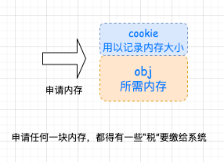

### STL 六大组件

- **容器(containers)** : vector.list.deque,set,map等数据存放的类。
- **算法(algorithms)** : 各种排序算法;sort、search、copy、erase..等
- **迭代器(iterators)** ：扮演容器与算法之间的胶合剂，是所谓的“泛型指针。共有五种类型，以及其它衍生变化。从实现的角度来看，迭代器是一种将 operator*，operator--，operator->， operator++，等指针相关操作予以重载的class template。所有STL容器都附带有自己专属的选代器——是的，只有容器设计者才知道如何遍历自己的元素。**原生指针 (native pointer)也是一种选代器**。
- **仿函数(functors)** ：行为类似函数，可以视为算法的某种策略。从实现的角度来看，仿函数是一种重载了 operator() 的 class 或 class template。**一般的函数指针可视为狭义的仿函数。**
- **配接器(adapters) **：一种用来修饰容器(containers)或仿函数(functors)或迭代器(iterators)接口的东西。
- **配置器(allocators)** : 负责空间配置与管理。


## 空间配置器

​		STL allocator 将两阶段操作区分开来。内存配置操作由 alloc:allocate() 负责；内存释放操作由 alloc::deallocate() 负责；对象构造操作由 ::construct() 负责，对象析构操作由 ::destroy() 负责。

​		考虑到小型区块可能造成的内存破碎问题，SGI 设计了**双层级配置器**,第一级配置器直接使用 `malloc()` 和`free()` ；第二级配置器则视情况采用不同的策略。当配置区块超过 128 byte 时，视之为足够大，使用**第一级配置器**，当小于 128 byte 时，视之为过小，采用复杂的 **memory pool** 整理方式。而不再求助于第一级适配器。使用哪一级适配器取决于 `__USE_MALLOC` 是否被定义。

### 第一级配置器

​		第一级配置器以 malloc()，free()，realloc() 等 C 函数执行实际的内存配置、释放、重配置操作，并实现类似 **C++ new-handler** 的机制，就是类似如果直接 malloc 无法完成任务，会调用用户指定的处理函数来兜底。

### 第二级配置器

​		第二级配置器多了一些机制，专门针对内存碎片。内存碎片化带来的不仅仅是回收时的困难，配置也是一个负担，额外负担永远无法避免，毕竟系统要划出这么多的资源来管理另外的资源，但是区块越小，额外负担率就越高。



​		简单来说 SGI 第二级配置器的做法是：

- 如果大于 128 bytes 就交给第一级配置器处理；
- 对于小于 128 bytes 的内存，以内存池管理，此方法称为：**sub-allocation （次层配置）**，每次配置一大块内存，并维护对应的自由链表（free-list），下次若再有大小相同的内存需求，直接从 free-list 中拔出。释放也由 free-list 回收管理。

<u>为了方便管理，小区块的内存需求量总是 8 的倍数，并维护 **16 个 free-lists**，各自管理大小分别为 8、16、24、32.........128 bytes 的小额区块</u>， free-list 的节点结构如下：

```c++
union obj{
    union obj * free_list_link;
    char client_data[1];
}
```

​		由于 obj 使用的是 union ，所以<u>从 free_ list_link 来看 obj 是一个指向**下一个** obj 的指针</u>；<u>从 client_data 来看，obj 可被视为一个指向实际区块的指针</u>。所以不会造成维护链表所必须得指针而浪费内存。


### 空间配置函数 allocate()

​		__default_alloc_template 拥有配置器的标准接口函数 allocate()。此函数首先判断区块大小，大于 128bytes就调用第一级配置器，小于 128bytes 就检查对应的 free list。如果有可用区块就直接拿来用，没有就将区块的大小上调至 8 倍数边界，然后调用 `refill()` 准备为 `free list` 重新填充空间。


### 空间释放函数 deallocate()

​		同样，作为第二级配置器拥有配置器标准接口函数 deallocate()。**该函数首先判断区块大小，大于 128bytes 就调用第一级配置器。小于 128bytes 就找出对应的 free_list，将区块回收。**


