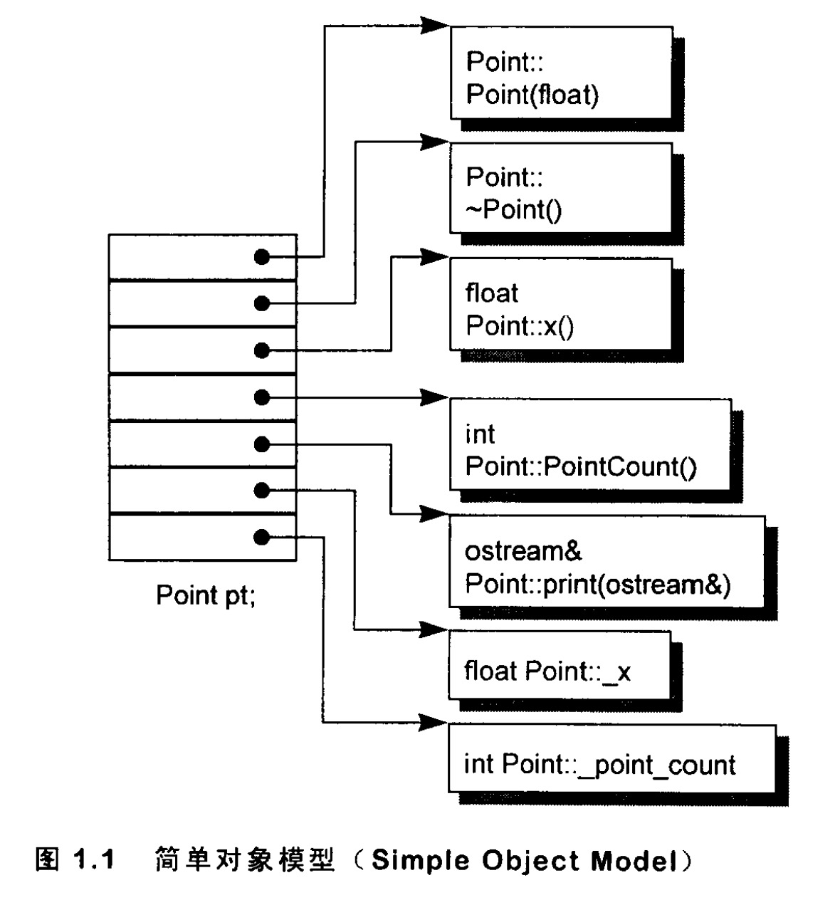
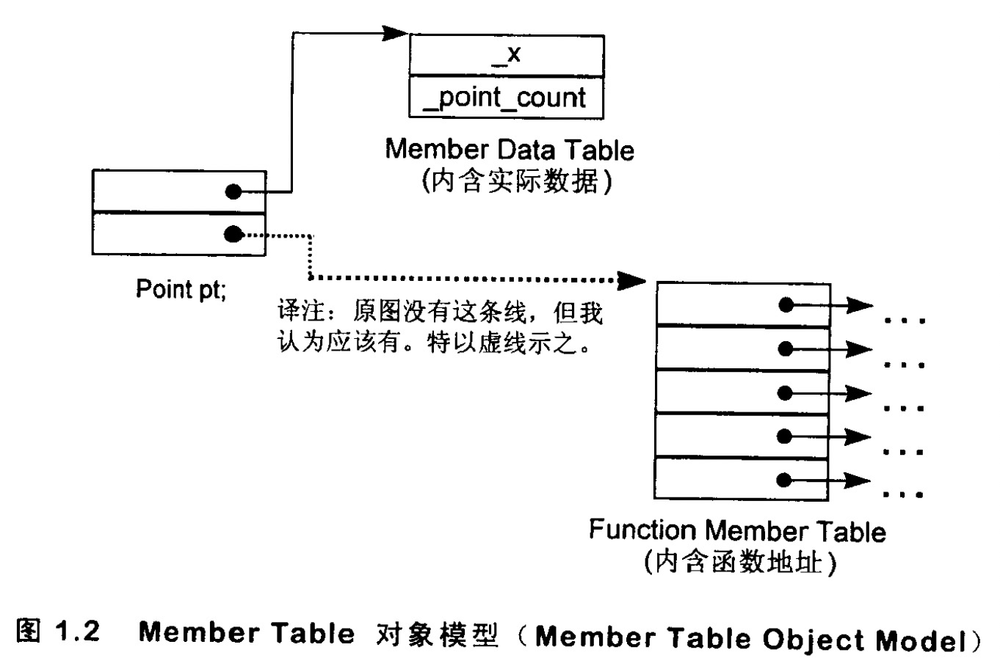
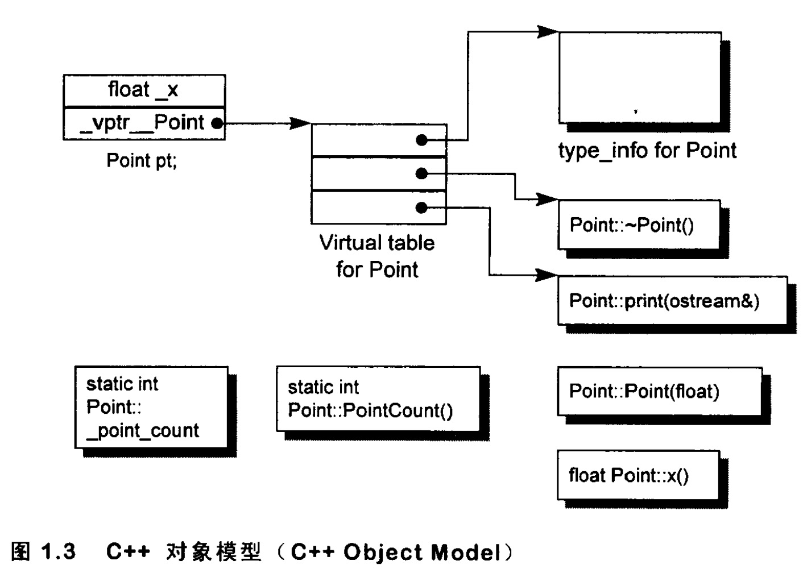
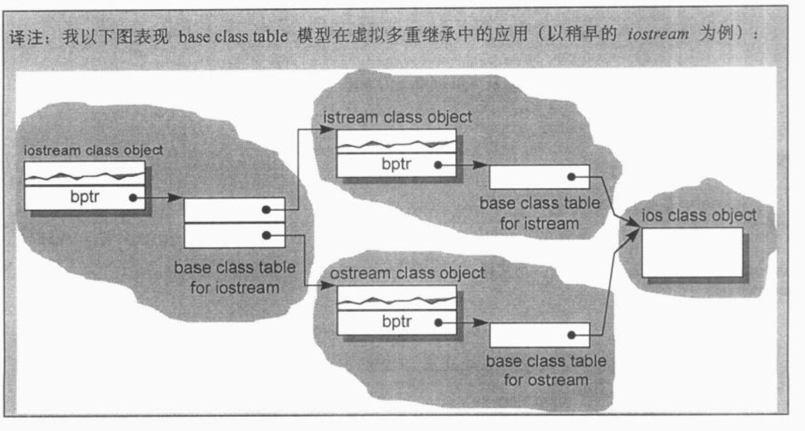
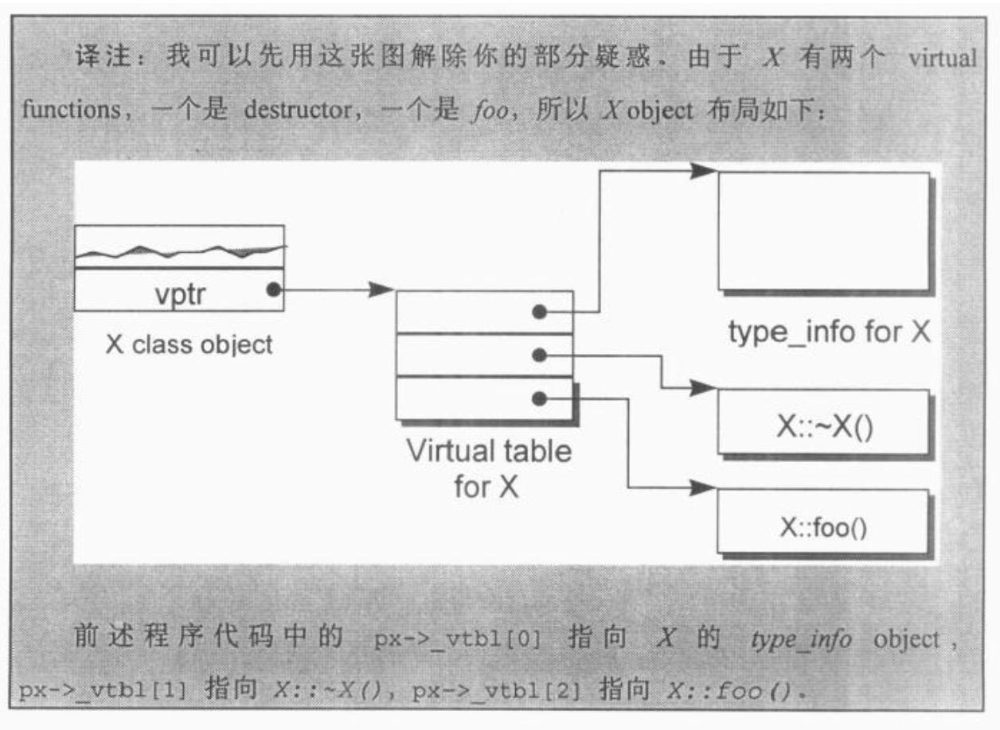

# C++ 对象模式（The C++ Object Model）

​		

[TOC]

​		在C++中，有两种class data members：static 和 nonstatic ，以及三种class member functions： static、 nonsaic 和 virtual。

​		已知下面这个 class Point 声明:

```c++
class point {
publiC:
	Point(float xval) ;
	virtual ~Point() ;
  
	float x () const;
	static int PointCount ();
  
protected:
	virtual ostream& 
		print ( ostream &os ) const;
  
	float _x;
	static int point count;
];
```

​		这个 class Point 在机器中将会被怎么样表现呢 ？ 也就是说，我们如何**模塑（modeling**）出各种 data members 和 function members 呢？


## 简单对象模型（A Simple Object Model）

​		我们的第-一个模型十分简单。它可能是为了尽量减低 C++ 编译器的设计复杂度而开发出来的，赔上的则是空间和执行期的效率。

​		在这个简单模型中，一个 object 是一系列的 slots ， 每一个 slot 指向一个members。 Members 按其声明次序，各被指定一个 slot。 每一个 data member或function member都有自己的一个 slot。 下图可以说明这种模型。



​		**<u>在这个简单模型中，members 本身并不放在 object 之中。只有 ” 指向 member 的指针 ” 才放在 object 内。</u>**

​		这么做可以避免 “ members 有不同的类型，因而需要不同的存储空间 ” 所招致的问题。Object 中的 members 是以 slot 的索引值来寻址，本例之中 _x 的索引是6，point_count 的索引是 7。一个class object的大小很容易计算出来：**<u>“指针大小， 乘以 class 中所声明的 members 数目”</u>**便是。

​		虽然这个模型并没有被应用于实际产品上，不过关于索引或 slot 数目的观
念，倒是被应用到 C++ 的 **“指向成员的指针”(pointer-to-member)** 观念之中。


## 表格驱动对象模型(A Table-driven Object Model)

​		**<u>为了对所有 classes 的所有 objects 都有一致的表达方式，另一种对象模型是把所有与 members 相关的信息抽出来，放在一个 data member table 和一个member function table 之中，class object 本身则内含指向这两个表格的指针。</u>**

​		Member function table是一系列的 slots, 每一个 slot 指出一个member function；Data member table则直接含有 data 本身，如图1.2所示。



​		虽然这个模型也没有实际应用于真正的 C++ 编译器身上，但member function table 这个观念却成为支持 virtual functions的一个有效方案。


## C++对象模型（The C++ Object Model）

​		Stroustrup 当初设计（当前亦仍占有优势）的 C++ 对象模型是从简单对象模型派生而来的，并对内存空间和存取时间做了优化。

​		在此模型中，Nonstatic data members 被配置于每一个 class object 之内，static data members 则被存放在所有的 class object 之外。Static 和 nonstatic function members 也被放在所有的 class object 之外。Virtual functions 则以两个步骤支持之:

1. 每一个 class 产生出一堆指向 virtual functions 的指针，放在表格之
   中。这个表格被称为 virtual table （**vtbl**）。
2. 每一个 class ohject 被添加了一个指针，指向相关的 virtual table。通常这个指针被称为 **vptr**。 vptr 的**设定(setting)** 和**重置(resetting)** 都由每一个 class 的 consructor、destructor 和 copy assignment 运算符自动完成。**<u>每一个 class 所关联的 type_info object (用以支持runtime type identilcation， RTTI)也经由virtual table 被指出来，通常是放在表格的第一个 slot 处。</u>**



​		上图说明 C++ 对象模型如何应用于前面所说的 Point class 身上。

​		这个模型的主要优点在于它的空间和存取时间的效率；主要缺点则是，如果应用程序代码本身未曾改变，但所用到的 class objects 的 nonstatic data members 有所修改（可能是增加、移除或更改），那么那些应用程序代码同样得重新编译。关于这点，前述的双表格模型就提供了较大的弹性，因为它多提供了一层间接性，不过它也因此付出空间和执行效率两方面的代价就是了。

### 加上继承（Adding Inheritance）

​	C++支持单一继承:

```c++
class Library_materials {. . .} ;
class Book : public Library_materials {. . .} ;
class Rental_book : public Book {. . .} ;
```

​		C++也支持多重继承:

```c++
//原本的(更早于标准版的)iostream 实现方式
class iostream: public istream,public ostream {. . .} ;
```

​		甚至，继承关系也可以指定为虚拟（virtual， 也就是共享的意思）:

```c++
class istream : virtual public ios {. . .} ;
class ostream : virtual public ios {. . .} ;
```

​		**<u>在虚拟继承的情况下，base class 不管在继承串链中被派生(derived)多少次,永远只会存在一个实体（称为subobject）</u>** 。例如 iostream 之中就只有 virtual ios base class 的一个实体。

​		一个 derived class 如何在本质上模塑其 base class 的实体呢？在 “ 简单对象
模型” 中，每一个 base class 可以被 derived class object 内的一个 slot 指出，该
slot 内含 base class subobject 的地址。这个体制的主要缺点是，因为间接性而导
致空间和存取时间上的额外负担，优点则是 class object 的大小不会因其base classes 的改变而受到影响。

​		当然啦，你也可以想象另一种所谓的 base table 模型。这里所说的 base class table 被产生出来时，表格中的每一个 slot 内含一个相关的 base class 地址，这很像 virtual table 内含每一个 virtual function 的地址一样。每一个 class object 内含一个 **bptr**，它会被初始化，指向其 base class table。这种策略的主要缺点是由于间接性而导致的空间和存取时间上的额外负担，优点则是在每一个 class object 中对于继承都有一致的表现方式：每一个 class object 都应该在某个固定位置上安放一个 base table 指针，与 base classes 的大小或数目无关。第二个优点是，不需要改变 class objects 本身，就可以放大、缩小、或更改 base class table.



​		不管上述哪一种体制，“ 间接性”的级数都将因为继承的深度而增加。例如，一个 Rental_book 需要两次间接存取才能够探取到继承自 Library_ materials 的members，而 Book 只需要一次。

​		如果在 derived class 内复制一个指针，指向继承串链中的每一个base class，倒是可以获得一个永远不变的存取时间。当然这必须付出代价，因为需要额外的空间来放置额外的指针。

​		C++ 最初采用的继承模型并不运用任何间接性： base class subobject 的 data members 被直接放置于 derived class object 中。这提供了对 base class members最紧凑而且最有效率的存取。缺点呢？当然就是: base class members 的任何改变，包括增加、移除或改变类型等等，都使得所有用到“此 base class 或其 derived class 之 objects ” 者必须重新编译.

​		自 C++ 2.0 起才新导入的 virtual base class，需要一些间接的 base class 表现
方法。Virtual base class 的原始模型是在 class object 中为每一个有关联的 virtual
base class 加上一个指针。其它演化出来的模型则若不是导入一个 virtual base class table，就是扩充原已存在的 virtual table，以便维护每一个 virtual base class 的位置。


## 对象模型如何影响程序（How the Object Model Effects Programs）

​		这对程序员带来什么意义呢？不同的对象模型，会导致“ 现有的程序代码必须修改 ” 以及 “必须加人新的程序代码 ” 两个结果。

​		例如下面这个函数，其中class X 定义了一个 copy constructor，一个 virtual destructor, 和一个 virtual function foo:

```c++
X foobar ()
{
	X	XX;
	X *px = new X;
  
	// foo() 是一个 virtua1 function
	xx.foo();
	px->foo();
  
	delete px;
	return XX;
);
```

这个函数有可能在内部被转化为：

```c++
//可能的内部转换结果
//虚拟 C++ 码
void foobar(X  &_result) 
{
	//构造 _result
	//_result 用来取代 local xx ...
	result.X::X();
  
	//折展x *px = newX;
	px = _new(sizeof(X));
	if(px != O)
		px->X::X() ;
  
	//扩展 xx.foo() 但不使用 virtual 机制
	//以 result 取代 xx
	foo(&_result);
  
	//使用virtual 机制扩展px->foo{)
	(*px->vtbl[2])(pх)
  
	//扩展 delete px;
	if (px != 0) {
		(*px->vtbl[1])(px);// destructor
		delete(pх);
	}
  
	//不需使用named return statement
	//不需要摧毁local object xx
	return;
);
```




