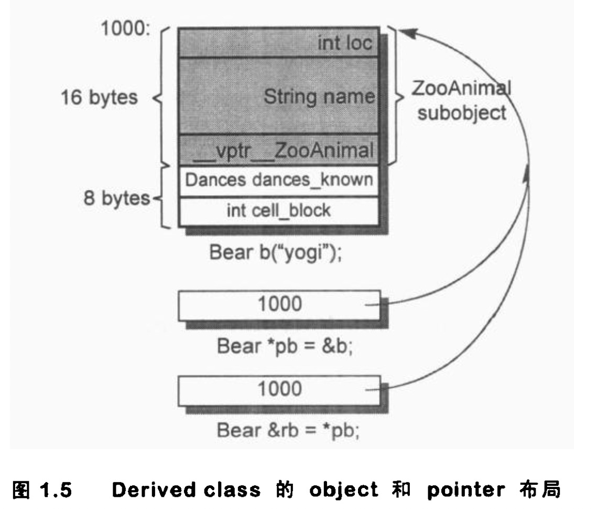
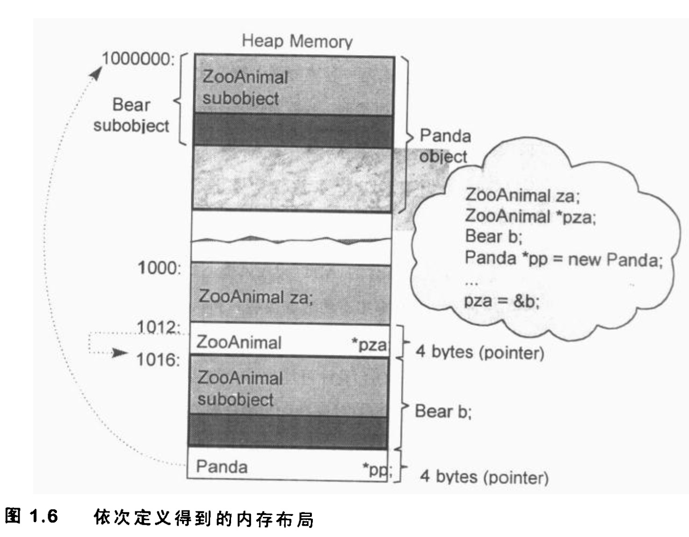

# 对象的差异(An Object Distinction)

[TOC]

C++程序设计模型直接支持三种程序设计典范：

**<u>1. 程序模型（procedural model）</u>** ，就像 C 一样，C++ 当然也支持它。字符串的处理就是一个例子，我们可以使用字符数组以及 str* 函数集（定义在标准的C函数库中）：

```c++
	char boy[] = "Danny";
	char *p_son;
	...
	p_son = new char [strlen(boy) + 1];
	strcpy( p_son, boy );
	...
	if (!strcmp(p_son, boy))
		take_to_disneyland(boy) ;
```

**<u>2.  抽象数据类型模型（abstract data type model, ADT）</u>**。该模型所谓的“抽象”是和一组表达式（public 接口）一起提供，而其运算定义仍然隐而未明。例如下面的string class:

```c++
	string girl = "Anna" ;
	string daughter;
	...
	//string::operator=() ;
	daughter = girl;
	...
	//string::operator==() ;
	if ( girl == daughter )
		take_to_disneyland( girl ) ;
```

**<u>3. 面向对象模型（ object-oriented model</u>**） 。在此模型中有一些彼此相关的类型，通过一个抽象的 base class （用以提供共通接口）被封装起来。Library_materials class 就是一个例子，真正的 subtypes 例如 Book、 Video、Compact_ Disc、Puppet、 Laptop 等等都可以从那里派生而来:

```c++
void check_in( Library_materials *pmat ) {
	if (pmat->late())
		pmat->fine();
	pmat->check_in();
  
	if ( Iender *plend = pmat->reserved() )
		pmat->notify( plend ) ;
}
```

​		纯粹以一种 paradigm（规范） 写程序，有助于整体行为的良好稳固。然而如果混合了不同的 paradigms，就可能会带来让人惊吓的后果，特别是在没有谨慎处理的情况下。最常见的疏忽发生在当你以一个 base class 的具体实体如:

```c++
Library_materials thing1;
```

来完成某种**多态(polymorphism)** 局面时:

```c++
//class Book : public Library materials {. . .} ;
Book book;

// 喔欧: thing1 不是一个 Book!
// book被裁切(sliced) 了。
// 不过 thing1 仍保有一个Library_materials.
thing1 = book;

// 喔欧: 调用的是 Library_materials::check_in()
thing1.check_in() ;
```

而不是通过 base class 的 pointer 或 reference 来完成多态局面:

```c++
// OK: 现在 thing2 参考到 book
Library_materials &thing2 = book;
// oK: 现在引发的是 Book::check_in()
thing2.check_in() ;
```

​		**<u>虽然你可以直接或间接处理继承体系中的一个 base class object，但只有通过 pointer 或 reference 的间接处理，才支持 OO 程序设计所需的多态性质。</u>**

​		上个例子中的 thing2 的定义和运用，是 OO paradigm 中一个良好的例证。thing1  的定义和运用则逸出了 OO 的习惯；它反映的是一个 ADT paradigm 的良好行为。thingl 的行为是好是坏，视程序员的意图而定。在此范例中，它的行为非常有可能不是你要的!

​		在 OO paradigm 之中，程序员需要处理一个未知实体，它的类型虽然有所界定，却有无穷可能。这组类型受限于其继承体系，然而该体系理论上没有深度和广度的限制。**<u>原则上，被指定的 object 的真实类型在每一个特定执行点之前，是无法解析的。在 C++ 中，只有通过 pointers 和 references 的操作才能够完成。</u>**相反地，在 ADT paradigm 中程序员处理的是一个拥有固定而单一类型的实体，它在编译时期就已经完全定义好了。

​		举个例子，下面这组声明:

```c++
//描述objects: 不确定类型
Librar_materials *pх = retrieve_some_material();
Librar_materials &rx = *px;

//描述已知物: 不可能有令人惊讶的结果产生
Librar_materials dx = *pх;
```

​		你绝对没有办法确定地说出 px 或 rx 到底指向何种类型的 objects ， 你只能够说它要不就是 Library_materials object，要不就是后者的一个子类型(subtype)。

​		不过，我们倒是可以确定，dx 只能是 Library_materials class 的一个 object。本节稍后，我会讨论为什么这样的行为虽然或许未如你所预期，却是良好的行为。

​		虽然 “ 对于 object 的多态操作 ” 要求此 object 必须可以经由一个 pointer 或 reference 来存取，然而 C++ 中的 pointer 或 reference 的处理却不是多态的必要
结果。想想下面的情况:

```c++
//没有多态(因为操作对象不是class object)
int *pi;

//没有语言所支持的多态(因为操作对象不是class object)
void *pvi; 

// ok : class x视为一个base class (可以有多态的效果)
X *px;
```

​		在 C++，多态只存在于一个个的 public class 体系中。举个例子，px 可能指向自我类型的一个 object，或指向以 public 派生而来的一个类型（请不要把不良的转型操作考虑在内）。Nonpublic 的派生行为以及类型为 void* 的指针可以说是多态，但它们并没有被语言明白地支持，也就是说它们必须由程序员通过明白的转型操作来管理(你或许可以说它们并不是多态对象的一线选手).

#### C++ 以下列方法支持多态:

1.经由一组隐含的转化操作。例如把一个 derived class 指针转化为一个指
向其 public base type 的指针:

```c++
shape *ps = new circle() ;
```

2.经由 virtual function 机制:

```c++
ps->rotate() ;
```

3.经由 dynamic_cast 和 typeid 运算符:

```c++
if ( circle *pc = dynamic_cast<circle*>( ps ) )
  ...
```

​		多态的主要用途是经由一个共同的接口来影响类型的封装，这个接口通常被定义在一个抽象的 base class 中。

​		例如 Library_materials class 就为 Book、Video、Puppet 等 subtype 定义了一个接口。这个共享接口是以 virtual function 机制引发的,它可以在执行期根据object 的真正类型解析出到底是哪一个函数实体被调用。经由这样的操作:

```c++
Library_material->check_out() ;
```

​		我们的代码可以避免由于 “ 借助某一特定 library 的 materials ”而导致变动无常。这不只使得 “ 当类型有所增加、修改、或删减时，我们的程序代码不需改变 ”，而且也使 “ 一个新的 Library_materials subtype 的供应者不需要重新写出 “ 对继承体系中的所有类型都共通 ” 的行为和操作。

​	考虑一下这样的码:

```c++
void rotate (
X datum,
const X *pointer,
const X &reference )
{
	//在执行期之前，无法决定到底调用哪一个 rotate() 实体
	(*pointer).rotate();
	reference.rotate();
  
	//下面这个操作总是调用 x::rotate()
	datum.rotate();
}

main() {
	Z z;//Z 是 X 的一个子类型
  
	rotate(z, &z , z);
	return 0;
}
```

​		经由 pointer 和 reference 完成的两个 “ 函数调用操作” 会被动态完成！此例中它们都调用 Z::rotate()。 

​		经由datum 完成的“函数调用操作”则可能（或可能不）经由virtual 机制。不过，它反正总是调用X::rotate() 就是了。

 (这就是所谓的 “ 编译素养 ” 问题:不管经由 datum 所调用的 virtual function 采不采用 virtual 机制，从语意来说，结果都是相同的。)

​		

​		需要多少内存才能够表现一个 class object ？一般而言要有:

- 其 nonstatic data members 的总和大小;
- 加上任何由于 alignment 的需求而填补(padding)上去的空间（可能存在于 members 之间，也可能存在于集合体边界） 。
- 加上为了支持 virtual 而由内部产生的任何额外负担(overhead)。

​        一个指针或一个reference（一个reference通常是用一个指针实现的），不管它指向哪一种数据类型，指针本身所需的内存大小是固定的。举个例子，下面有一个 ZooAnimal 声明:

```c++
class ZooAnimal {
public:
	ZooAnimal() ;
	virtua1 ~ ZooAnimal() ;
	//...
	virtual void rotate() ;
protected:
	int loc;
	String name ;
};

ZooAnimal za("Zoey");
ZooAnimal *pza = &za ;
```

​		其中的 class object   za 和指针 pza 的可能布局如图1.4所示。我将在后面再回到“data members 的布局”这个主题上。


## 指针的类型（The Type of a Pointer）

​		但是，一个指向 ZooAnimal 的指针是如何地与一个指向整数的指针或一个指向template Array (如下，与一个 String 一并产生)的指针有所不同呢?

```c++
ZooAnimal *px ;
int *pi;
Array< String > * pta;
```

​		以内存需求的观点来说，没有什么不同！它们三个都需要有足够的内存来放置一个机器地址（通常是个word，注意⚠️：不同机器上word是可变大小）。**<u>“ 指向不同类型之各指针 “ 间的差异，既不在其指针表示法不同，也不在其内容（代表一个地址）不同，而是在其所寻址出来的 object 类型不同。也就是说，” 指针类型 ” 会教导编详器如何解释某个特定地址中的内存内容及其大小：</u>**

**1. **一个指向地址 1000 的整数指针，在 32 位机器上，将涵盖地址空间 1000 ~ 1003 (因为 32 位机器上的整数是 4-bytes) 。

**2. **如果 String 是传统的 8-bytes (包括一个 4-bytes 的字符指针和一个用来表示字符串长度的整数)，那么一个 ZooAnimal 指针将横跨地址空间 1000 ~ 1015 (  4+8+4， 如图1.4)


​		嗯，那么，一个指向地址 1000 而类型为 void* 的指针，将涵盖怎样的地址空间呢？是的，我们不知道！这就是为什么一个类型为 void* 的指针只能够含有一个地址，而不能够通过它操作所指之 object 的缘故.

​		所以，**<u>转型(cast) 其实是一种编译器指令。大部分情况下它并不改变一个指针所含的真正地址，它只影响 “ 被指出之内存的大小和其内容 ” 的解释方式。</u>**


## 加上多态之后( Adding Polymorphism)

​		现在，让我们定义一个 Bear,，作为一种 ZooAnimal。 当然，经由 “public 继
承”可以完成这件任务:

```c++
class Bear : public ZooAnimal {
public:
	Bear () ;
	~Bear () ;
	//...
	void rotate () ;
	virtual void dance ( ) ;
	//...
protected:
	enum Dances {...};

	Dances dances_known ; 
	int cell_b1ock;
);
  
Bear b( "Yogi");
Bear *pb = &b;
Bear &rb = *pb;
```

​		b 、pb 、rb 会有怎样的内存需求呢？不管是 pointer 或r eference 都只需要一个 word 的空间(在 32 位机器上是 4-bytes ) 。Bear object 需要 24 bytes,也就是ZooAnimal 的 16bytes 加上 Bear 所带来的 8bytes.。下图展示可能的内存布局.



​		好，假设我们的 Bear object 放在地址 1000 处，一个 Bear 指针和一个
ZooAnimal 指针有什么不同?

```c++
Bear b;
ZooAnimal *pz = &b;
Bear *pb = &b;
```

​		**<u>它们每个都指向 Bear object 的第一个 byte。其间的差别是，pb 所涵盖的地址包含整个 Bear object，而 pz 所涵盖的地址只包含 Bear object 中的 ZooAnimal subobject。</u>**

​		除了 ZooAnimal subobject 中出现的 members，你不能够使用 pz 来直接处理 Bear 的任何 members。 唯一例外是通过 virtual 机制：

```c++
//不合法: cell_block 不是 ZooAnimal 的一个 member ,
//虽然我们知道 pz 当前指向一个 Bear object.
pz->cel1_block;

// ok: 经过一个明白的 downcast 操作就没有问题!
((Bear*)pz)->cell_block;

//下面这样更好，但它是一个 run-time operation (成本较高)
if ( Bear* pb2 = dynamic_cast< Bear* >(pz) )
	pb2->ce11_block;

// ok:因为 cell_ block 是 Bear 的一个 member.
pb->cell_block;
```

当我们写：

```c++
pz->rotate();
```

时，pz 的类型将在编译时期决定一下两点：

- 固定的可用接口。也就是说，pz 只能够调用 ZooAnimal 的 public 接口。
- 该接口的 access  level（ 例如 rotate() 是 ZooAnimal 的一个 public member ）。

​        在每一个执行点，pz 所指的 object 类型可以决定 rotate() 所调用的实体。类型信息的封装并不是维护于 pz 之中，而是维护于 link 之中，此 link 存在于 ” object 的 vptr ” 和 “' vptr 所指之 virtual table " 之间。

​		现在，请看这种情况:

```c++
Bear b;
ZooAnima za = b; //注意:这会引起切割(sliced)

//调用 ZooAnimal::rotate ()
za.rotate() ;
```

​		为什么 rotate() 所调用的是 ZooAnimal 实体而不是 Bear 实体？
​		此外，如果初始化函数 (应用于上述 assignment 操作发生时 ) 将一个 object 内容完整拷贝到另一个 object 中去，为什么 za 的 vptr 不指向 Bear 的 virtual table？

​		第二个问题的答案是，编译器在 (1) 初始化及 (2) 指定 ( assignment ) 操作( 将一个 class object 指定给另一个 class object ) 之间做出了仲裁。**<u>编译器必须确保如果某个 object 含有一个或一个以上的 vptrs， 那些 vptrs 的内容不会被 base class object 初始化或改变。</u>**

​		至于第一个问题的答案是： za 并不是 ( 而且也绝不会是 ) 一个 Bear，它是( 并且只能是 ) 一个ZooAnimal。 多态所造成的 “ 一个以上的类型 ” 的潜在力量，并不能够实际发挥在 “ 直接存取objects ” 这件事情上。有一个似是而非的观念：OO 程序设计并不支持对 object 的直接处理。

​		举个例子，下面这一组定义:

```c++
{
	ZooAnimal za ;
	ZooAnimal *pza;

	Bear b;
	Panda *pp = new Panda;

	pza = &b;
}
```

其可能的内存布局如下图所示：



​		将 za 或 b 的地址，或 pp 所含的内容 ( 也是个地址 ) 指定给 pza， 显然不是问题。**<u>一个 pointer 或一个 reference 之所以支持多态，是因为它们并不引发内存中任何 “ 与类型有关的内存委托操作(type-dependent commitment) “ ；会受到改变的只是它们所指向的内存的 “ 大小和内容解释方式 ” 而已.</u>**

​		然而，任何人如果企图改变 object za 的大小，便会违反其定义中受契约保护的 “ 资源需求量 ” 。如果把整个 Bear object 指定给 za，则会溢出它所配置得到的内存。执行结果当然也就不对了。 

​		当一个 base class **object** 被直接初始化为 ( 或是被指定为 ) 一个 derived class ：**object** 时，derived **object** 就会被**切割 (sliced)** ，以塞入较小的 base type 内存中，derived type 将没有留下任何蛛丝马迹。多态于是不再呈现，而一个严格的编译器可以在编译时期解析一个 “ 通过该 object 而触发的 virtual function 调用操作 ”，而回避 virtual 机制。如果 virtual function 被定义为 inline， 则更有效率上的大收获。

​		总而言之，多态是一种威力强大的设计机制，允许你继一个抽象的 public 接口之后，封装相关的类型。我所举的 Library_materials 体系就是一例。需要付出的代价就是额外的间接性不论是在 “ 内存的获得 ” 或是在 “ 类型的决断 ” 上。**<u>C++ 通过class 的 pointers 和 references 来支持多态，这种程序设计风格就称为”面向对象”。</u>**


