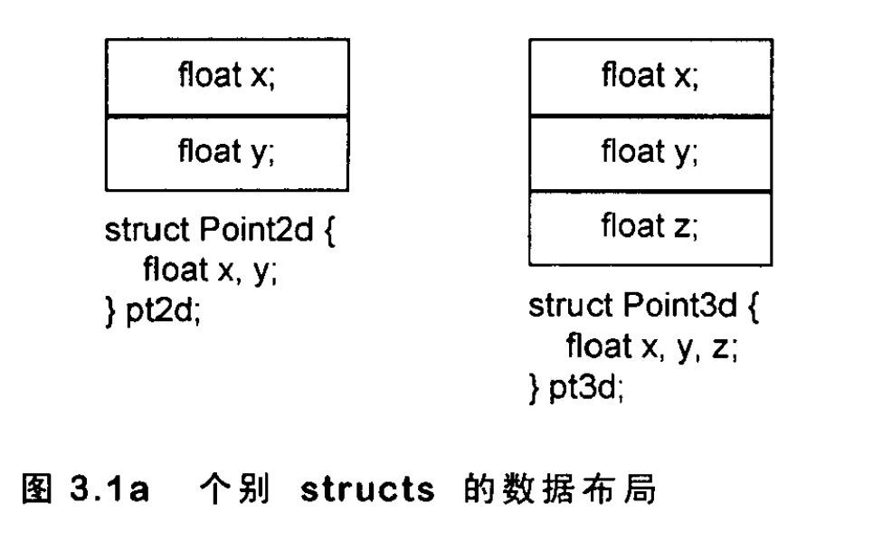
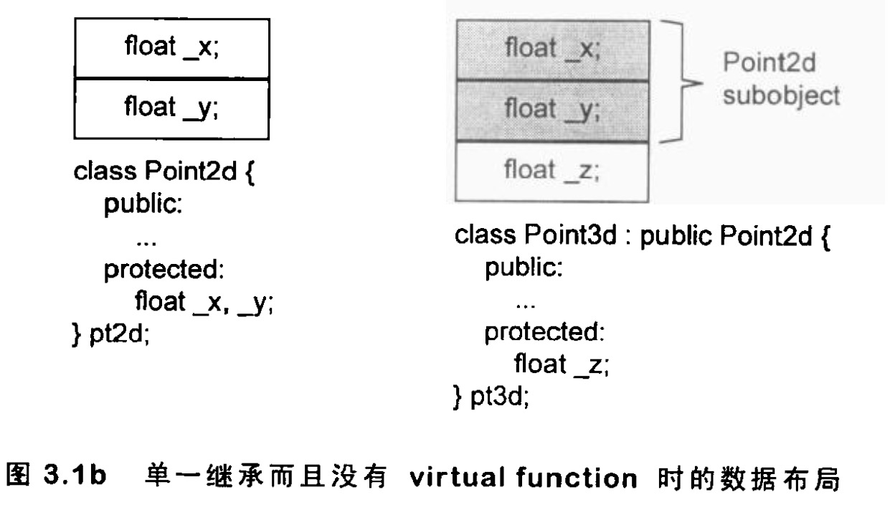
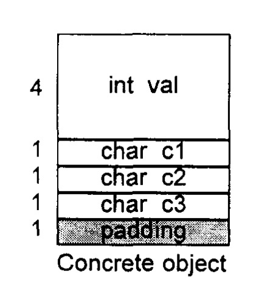
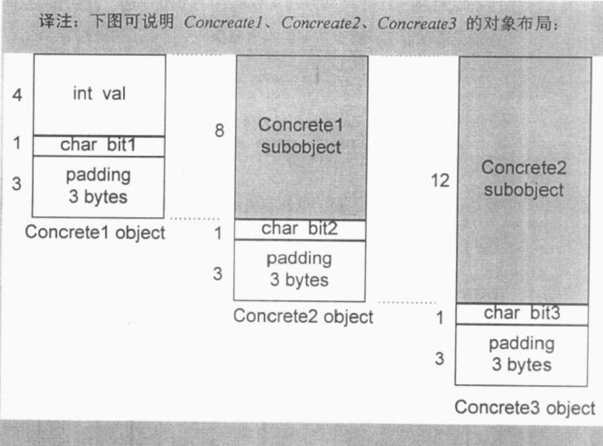
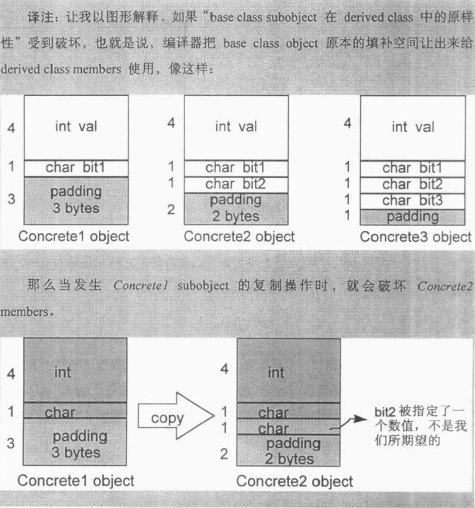
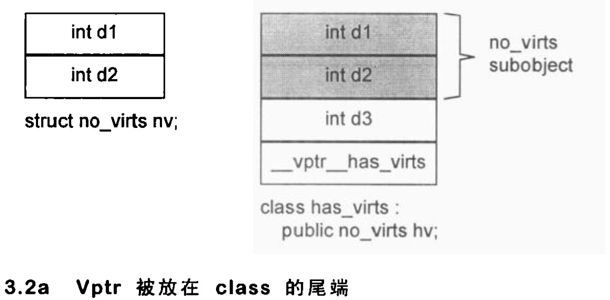
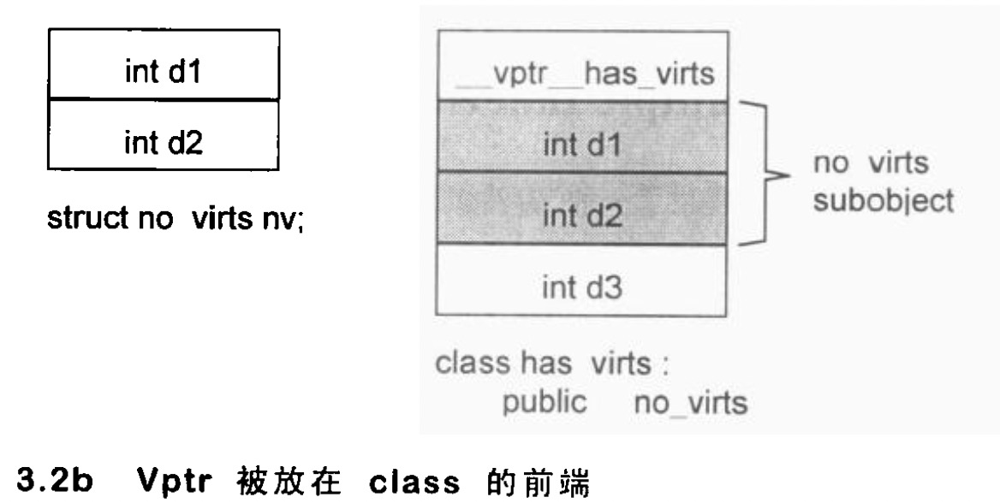
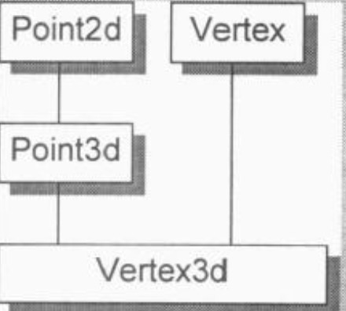
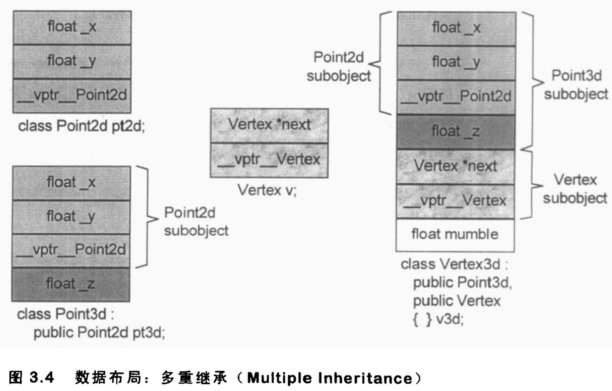

# “继承”与Data Member.md

[TOC]

现有如下代码：

```c++
//supporting abstract data . types
class Point2d {
public :
	··// constructor (S )
	// operations
	//access functions
private :
	float x, y;
};

class Point3d {
public:
	//constructor (s )
	//operations 
	//access functions
private :
	float x, y, z;
};
```

​		这和 “ 提供两层或三层继承结构，每一层 ( 代表一个维度 ) 是一个class， 派生自较低维层次 ” 有什么不同？

​		下面各小节的讨论将涵盖 “ 单一继承且不含 virtual functions ”、单一继承并含virtual functions ” 、“多重继承 ”、“虚拟继承 ” 等四种情况。下图就是 Point2d 和Point3d 的对象布局图，在没有virtual functions的情况下( 如本例)，它们和C struct完全一样。




## 只要继承不要多态 ( Inheritance without Polymorphism )

​		当 Pointer3d 继承于 Pointer2d ：

```c++
class Point2d {
public:
	Point2d( float x = 0.0, float y = 0.0 )
		:_x(x), y(y) {};
         
	float x() { return _x; }
	float y() { return _y; }
  
	void x(float newX){ x = newX;}
	void y(float newY){ y = newY;}
  
	void operator+=( const Point2d& rhs ) {
		_x += rhs.x() ;
		_y += rhs.y() ;
	}
	//... more members
protected :
	float x, _y;
};


// inheritance from concrete class
class Point3d : public Point2d {
public :
	Point3d( float x = 0.0, float y = 0.0,f1oat z = 0.0)
			: Point2d( x, y ) ,_z(z){} ;
                                 
	float z() ( return _z; }
	void z(float newZ){ z = newZ;}
             
	void operator+=( const Point3d& rhs ) {
		Point2d::operator+=( rhs ) ;
		_z += rhs.z() ;
  }
	//more members
protected :
	float _z ;
};
```

​		这样设计的好处就是可以把管理 x 和 y 坐标的程序代码局部化。此外这个设计可以明显表现出两个抽象类之间的紧密关系。

​		当这两个 classes 独立的时候，Point2d object 和 Point3d object 的声明和使用都不会有所改变。所以这两个抽象类的使用者不需要知道 objects 是否为独立的 classes 类型，或是彼此之间有继承的关系。图3.1b 显示 Point2d 和 Point3d 继承关系的实物布局，其间并没有声明 virtual 接口。



​		把两个原本独立不相干的 classes 凑成一对“type/subtype” ，并带有继承关系，会有什么易犯的错误呢？

​		经验不足的人可能会重复设计一些相同操作的函数。以我们例子中的constructor 和 operator+= 为例，它们并没有被做成 inline 函数。Point3d object的初始化操作或加法操作，将需要部分的 Point2d object 和部分的 Point3d object 作为成本。一般而言，选择某些函数做成 inline 函数，是设计 class 时的一个重要课题。

​		第二个易犯的错误是，把一个 class 分解为两层或更多层，有可能会为了 “ 表现 class 体系之抽象化 ” 而膨胀所需空间。C++语言保证 “出现在 derived class 中的base class subobject 有其完整原样性 ”，正是重点所在。

​		这似乎有点难以理解！最好的解释方法就是彻底了解一个例程，让我们从一个具体的 class 开始:

```c++
class Concrete [
public :
	//...
private :
	int val;
	char c1;
	char c2;
	char c3;
);
```



​		在一部 32 位机器中，每一个 Concrete class object 的大小都是 8 bytes,  细分如下:

1. val占用 4 bytes ;
2. cl 、c2 和 c3 各占用 1 bytes ;
3. alignment ( 调整到 word 边界 ) 需要 1 bytes。

​        现在假设，经过某些分析之后，我们决定了一个更逻辑的表达方式，把Concrete 分裂为三层结构：

```c++
class Concrete1 {
public:
	//...
private :
	int val;
	char bit1 ;
};

class Concrete2 : public Concrete1 {
public:
	//...
private :
	char bit2 ;
};

class Concrete3 : public Concrete2 {
public:
	//...
private :
	char bit3 ;
};
```

​		从设计的观点来看，这个结构可能比较合理。但从效率的观点来看，我们可能会受困于一个事实 : 现在 Concrete3 object 的大小是 16 bytes,  比原先的设计多了一倍。

​		Concretel 内含两个 members : val 和 bit1， 加起来是 5 bytes。而一个Concretel object 实际用掉 8 bytes，包括填补用的 3 bytes，以使 object 能够符合一部机器的 word 边界。不论是 C 或 C++ 都是这样。一般而言，边界调整 ( alignment ) 是由处理器 ( processor ) 来决定的.



​		这样处理主要是为了使发生对象切割的时候对象的完整性，如下图：




## 加上多态( Adding Polymorphism )

​		如果我要处理一个坐标点，而不打算在乎它是一个 Point2d 或 Point3d 实例，那么我需要在继承关系中提供一个 virtual function 接口。让我们看看如果这么做，情况会有什么改变:

```c++
// 以下的Point2d 声明请与上面的声明作比较
class Point2d {
public:
	Point2d( float x = 0.0，float y = 0.0 )
		: _X(X)，_y(y){};
  // x 和 y 的存取函数与前一版相同
	//由于对不同维度的点, 这些函数操作固定不变, 所以不必设计为 virtual
  
	//加上 z 的保留空间 ( 当前什么也没做 ) 
	virtual float z() { return 0.0; } // 2d 点的 z 为 0.0 是合理的
	virtual void z( float ) { }
  
	//设定以下的运算符为virtual
	virtual void
		operator += ( const Point2d& rhs ) {
				_x += rhs.x () ;
				_y += rhs.y() ;
  	}
	//... more members
  
protected:
		float _x,_ y;
};
```

​		只有当我们企图以**多态的方式 ( polymorphically )** 处理 2d 或 3d 坐标点时，在设计之中导人一个 virtual 接口才显得合理。也就是说，写下这样的码 : 

```c++
void foo( Point2d &p1, Point2d &p2 ) {
		//...
		p1 += p2;
		//...
}
```

​		其中 p1 和 p2 可能是 2d 也可能是 3d 坐标点。这并不是先前任何设计所能支持的。这样的弹性，当然正是面向对象程序设计的中心。支持这样的弹性，势必给我们的 Point2d class 带来空间和存取时间的额外负担 :

- 导入一个和 Point2d 有关的 virtual table， 用来存放它所声明的每一个virtual functions 的地址。这个 table 的元素数目一般而言是被声明的virtual functions 的数目，再加上一个或两个 slots  ( 用以支持 runtime type  identification).
- 在每一个 class object 中导入一个 vptr， 提供执行期的链接，使每一 object 能够找到相应的 virtual table.
- 加强 constructor， 使它能够为 vptr 设定初值，让它指向 class 所对应的virtual table。这可能意昧着在 derived class 和每一个 base class 的constructor 中，重新设定 vptr 的值。其情况视编译器的优化的积极性而定。
- 加强 destructor， 使它能够抹消 “ 指向 class 之相关 virtual table ” 的 vptr。要知道，vptr 很可能已经在 derived class destructor 中被设定为 derived class 的 virtual table 地址。记住，**<u>destructor 的调用次序是反向的 : 从 derived class 到 base class</u>** 。一个积极的优化编译器可以压抑那些大量的指定操作。

​        这些额外负担带来的冲击程度视 “ 被处理的 Point2d objects 的数目和生命期 ”而定，也视 “ 对这些 objects 做多态程序设计所得的利益 ” 而定。如果一个应用程序知道它所能使用的 point objects 只限于二维坐标点或三维坐标点，那么这种设计所带来的额外负担可能变得令人无法接受。

​		以下是新的 Point3d 声明 :

```c++
//以下的 Point3d 声明请与上面的声明做比较
class Point3d : public Point2d {
public :
	Point3d( float x = 0.0, float y = 0.0, float z = 0.0 )
				: Point2d(х, y), _z(z) { };
                  
	float z() ( return _z; ]
	void z( float newZ ){ _z = newZ; }
            
	void operator+= ( const Point2d& rhs){
		//注意上行是 Point2d& 而非 Point3d&
		Point2d::operator+= ( rhs ) ;
		_z += rhs.z() ;
	}
            
//...more members
protected:
	float _z;
};
```

​		虽然 class 的声明语法没有改变, 但每一件事情都不一样了 : 
​				两个z() member functions 以及 operator += () 运算符都成了虚拟函数;
​				每一个 Point3d class object 内含一个额外的 vptr member (继承自Point2d) ;
​				多了一个 Point3d virtual table;
​		此外，每一个 virtual member function 的调用也比以前复杂了.

​		目前在 C++ 编译器那个领域里有一个主要的讨论题目 : 把 vptr 放置在 class  object 的哪里会最好？在 cfront 编译器中，它被放在 class object 的尾端，用以支持下面的继承类型，如下图所示:

```c++
struct no_virts{
	int d1, d2 ;
};

class has_virts : public no_virts {
public:
		virtual void foo() ;
		//...
private :
		int d3;
};

no_virts *p = new has_virts ;
```



也有的放在前面：



​		把 vptr 放在 class object 的前端，对于 “ 在多重继承之下，通过指向 class members 的指针调用 virtual function ” ，会带来一些帮助。否则，不仅 “从 class object 起始点开始量起 ” 的 offset 必须在执行期备妥，甚至与 class vptr 之间的offset 也必须备妥。当然 , vptr 放在前端, 代价就是丧失了 C 语言兼容性。而且当用base class 指向 derived class 的时候需要编译器帮忙偏移（因为有vptr在前面）。


## 多重继承 ( Multiple Inheritance )

​		现考虑下面多重继承所获得的 class Vertex3d：

```c++
class Point2d {
public:
		// ... ( 拥有 virtual 接口.所以 Point2d 对象之中会有 vptr ) 
protected:
		float  _x, _y;
};

class  Point3d : public Point2d {
public:
		// ...
protected:
		float _z;
};
  
  

class Vertex {
public:
		//...(拥有 virtual 接口.所以vertex对象之中会有vptr)
protected:
		Vertex *next ;
};
  
class Vertex3d :	public Point3d, public Vertex {
public:
		//...
protected:
		float mumble;
);
```

至此，Point2d、Point3d、 Vertex、 Vertex3d 的继承关系如下:



​		多重继承的问题主要发生于 derived class objects 和其第二或后继的 base class objects之 间的转换; 不论是直接转换如下 :

```c++
extern void
mumble ( const Vertex& ) ;
Vertex3d v;
...
// 将一个 Vertex3d 转换为一个 Vertex. 这是 “ 不自然的"
mumble(v);
```

或是经由其所支持的 virtual function 机制做转换。

​		对一个多重派生对象 , 将其地址指定给 “ 最左端 ( 也就是第一个) base class 的指针 ”，情况将和单一继承时相同，因为二者都指向相同的起始地址。需付出的成本只有地址的指定操作而已。

​		至于第二个或后继的 base class 的地址指定操作，则需要将地址修改过 : 加上( 或减去，如果 down cast 的话 ) 介于中间的 base class subobject(s)大小，例如:

```c++
Vertex3d   v3d;
Vertex    *pv;
Point2d   *p2d; 
Point3d   *p3d; 
```

那么下面这个指定操作 : 

```c++
pv = &v3d;
```

需要这样的内部转化:

```c++
// 虚拟 C++ 码
pv = (Vertex*) ( ( (char*) &v3d ) + sizeof( Point3d )) ;
```

而下面的指定操作:

```c++
p2d = &v3d;
p3d = &v3d;
```

都只需要简单地拷贝其地址就行了。

如果有两个指针如下:

```c++
Vertex3d *pv3d; 
Vertex *pv;
```

​		那么下面的指定操作:

```
pv = pv3d;
```

不能够只是简单地被转换为:

```c++
//虚拟C++码
pv = (Vertex*) ( (char* )pv3d) + sizeof( Point3d ) ; 
```

​		因为如果 pv3d 为 0 ,  pv 将获得 sizeof( Point3d) 的值。这是错误的 ! 所以, 对于指针，内部转换操作需要有一个条件测试:

```c++
//虚拟C++码
pv = pv3d
		? (Vertex*) ( (char*) pv3d) + sizeof( Point3d )
		: 0;
```

​		至于 reference , 则不需要针对可能的 0 值做防卫，因为 reference 不可能参考到 “ 无物 ”( no object ) .



​		C++ Standard 并未要求Vertex3d 中的 base classes Point3d 和 Vertex 有特定的排列次序。原始的 cfront 编译器是根据声明次序来排列它们。因此cfront编译器制作出来的 Vertex3d 对象，将可被视为是一个Point3d subobject (其中又有一个Point2d subobject)加上一个 Vertex subobject , 最后再加上 Vertex3d 自己的部分。目前各编译器仍然是以此方式完成多重 base classes 的布局 ( 但如果加上虚拟继承，就不一样了 ) 。

​		如果要存取第二个 ( 或后继 ) base class 中的一个 data member,  将会是怎样
的情况？需要付出额外的成本吗？

​		不，members 的位置在编译时就固定了，因此存取 members 只是一个简单的 offset 运算，就像单一继承一样简单一不管 是经由一个指计、一个 reference 或是一个 object 来存取。