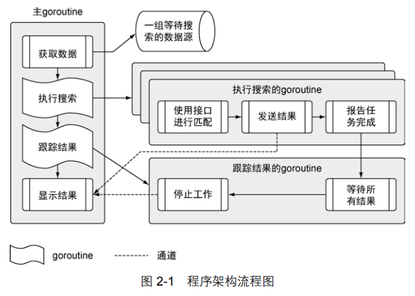

[TOC]

# 02 快速开始

​		这个程序实现的功能很常见，能在很多现在开发的 Go 程序里发现类似的功能。这个程序从不同的数据源拉取数据，将数据内容与一组搜索项做对比，然后将匹配的内容显示在终端窗口。这个程序会读取文本文件，进行网络调用，解码 XML 和 JSON 成为结构化类型数据，并且利用 Go 语言的并发机制保证这些操作的速度。

代码地址：chapter2/sample



## 程序项目与结构目录

```
- sample
  - data
     data.json -- 包含一组数据源
   - matchers
     rss.go -- 搜索 rss 源的匹配器
   - search
     default.go -- 搜索数据用的默认匹配器
     feed.go -- 用于读取 json 数据文件
     match.go -- 用于支持不同匹配器的接口
     search.go -- 执行搜索的主控制逻辑
   main.go -- 程序的入口
```

## main包

```go
package main

import (
	"log"
	"os"

	_ "github.com/goinaction/code/chapter2/sample/matchers"
	"github.com/goinaction/code/chapter2/sample/search"
)

// init is called prior to main.
func init() {
	// Change the device for logging to stdout.
	log.SetOutput(os.Stdout)
}

// main is the entry point for the program.
func main() {
	// Perform the search for the specified term.
	search.Run("president")
}

```

​		现在，只要简单了解以下内容：一个包定义一组编译过的代码，包的名字类似命名空间，可以用来间接访问包内声明的标识符。

​		这个特性可以把不同包中定义的同名标识符区别开。

​		**"import"**，顾名思义就是导入一段代码，让用户可以访问里面的标识符，例如类型、函数、常量和接口，比如main函数里面就引用了 search 包里面的 Run 函数。程序还分别导入了 log 和 os 包。  在第 7 行，导入前有个下划线：

```go
     _ "github.com/goinaction/code/chapter2/sample/matchers"
```

​		**这个技术是为了让 Go 语言对包做初始化操作，但是并不使用包里的标识符**。为了让程序的可读性更强，Go 编译器不允许声明导入某个包却不使用。下划线让编译器接受这类导入，并且调用对应包内的所有代码文件里定义的 init 函数。对这个程序来说，这样做的目的是调用 matchers 包中的 rss.go 代码文件里的 init 函数，注册 RSS 匹配器，以便后用。

​		代码中也有一个 init 函数，每个文件的 init 函数都会在 main 函数执行前调用。


## search包

​		这个程序使用的框架和业务逻辑都在 search 包里。这个包由 4 个不同的代码文件组成，每个文件对应一个独立的职责。我们会逐步分析这个程序的逻辑，到时再说明各个代码文件的作用。

​		由于整个程序都围绕**匹配器**来运作，我们先简单介绍一下什么是匹配器。这个程序里的匹配器，是指包含特定信息、用于处理某类数据源的实例。

​		在这个示例程序中有两个匹配器。框架本身实现了一个无法获取任何信息的默认匹配器，而在 matchers 包里实现了 RSS 匹配器。RSS 匹配器知道如何获取、读入并查找 RSS 数据源。随后我们会扩展这个程序，加入能读取 JSON 文档或 CSV 文件的匹配器。我们后面会再讨论如何实现匹配器。

### search.go

文件代码：

```go
package search

import (
	"log"
	"sync"
)

// A map of registered matchers for searching.
var matchers = make(map[string]Matcher)

// Run performs the search logic.
func Run(searchTerm string) {
	// Retrieve the list of feeds to search through.
	feeds, err := RetrieveFeeds()
	if err != nil {
		log.Fatal(err)
	}

	// Create an unbuffered channel to receive match results to display.
	results := make(chan *Result)

	// Setup a wait group so we can process all the feeds.
	var waitGroup sync.WaitGroup

	// Set the number of goroutines we need to wait for while
	// they process the individual feeds.
	waitGroup.Add(len(feeds))

	// Launch a goroutine for each feed to find the results.
	for _, feed := range feeds {
		// Retrieve a matcher for the search.
		matcher, exists := matchers[feed.Type]
		if !exists {
			matcher = matchers["default"]
		}

		// Launch the goroutine to perform the search.
		go func(matcher Matcher, feed *Feed) {
			Match(matcher, feed, searchTerm, results)
			waitGroup.Done()
		}(matcher, feed)
	}

	// Launch a goroutine to monitor when all the work is done.
	go func() {
		// Wait for everything to be processed.
		waitGroup.Wait()

		// Close the channel to signal to the Display
		// function that we can exit the program.
		close(results)
	}()

	// Start displaying results as they are available and
	// return after the final result is displayed.
	Display(results)
}

// Register is called to register a matcher for use by the program.
func Register(feedType string, matcher Matcher) {
	if _, exists := matchers[feedType]; exists {
		log.Fatalln(feedType, "Matcher already registered")
	}

	log.Println("Register", feedType, "matcher")
	matchers[feedType] = matcher
}
```

我们来逐步分析

```go
01  package search
02
03  import (
04  "log"
05  "sync"
06  )
07
08  // 注册用于搜索的匹配器的映射
09  var matchers = make(map[string]Matcher)
```

​		可以看到，每个代码文件都以 package 关键字开头，随后跟着包的名字。文件夹 search 下的每个代码文件都使用 search 作为包名。第 03 行到第 06 行代码导入标准库的 log 和 sync 包。

​		与第三方包不同，从标准库中导入代码时，只需要给出要导入的包名。编译器查找包的时候，总是会到 GOROOT 和 GOPATH 环境变量引用的位置去查找。

声明一个变量：

```go
08  // 注册用于搜索的匹配器的映射
09  var matchers = make(map[string]Matcher)
```

​		这个变量没有定义在任何函数作用域内，所以会被当成包级变量。这个变量使用关键字 var 声明，而且声明为 Matcher 类型的映射（map），这个映射以 string 类型值作为键，Matcher 类型值作为映射后的值。Matcher 类型在代码文件 matcher.go 中声明，后面再讲这个类型的用途。这个变量声明还有一个地方要强调一下：**<u>变量名 matchers 是以小写字母开头的。</u>**

​		在 Go 语言里，标识符要么从包里公开，要么不从包里公开**<u>。当代码导入了一个包时，程序可以直接访问这个包中任意一个公开的标识符。这些标识符以大写字母开头。以小写字母开头的标识符是不公开的，不能被其他包中的代码直接访问。</u>**但是，其他包可以间接访问不公开的标识符。例如，一个函数可以返回一个未公开类型的值，那么这个函数的任何调用者，哪怕调用者不是在这个包里声明的，都可以访问这个值。

​		这行变量声明还使用赋值运算符和特殊的内置函数 make 初始化了变量，<u>map 是 Go 语言里的一个引用类型，需要使用 make 来构造。</u>如果不先构造 map 并将构造后的值赋值给变量，会在试图使用这个 map 变量时收到出错信息。这是因为 map 变量默认的零值是 nil。

​		在 Go 语言中，所有变量都被初始化为其零值。对于数值类型，零值是 0；
​			对于字符串类型，零值是空字符串；对于布尔类型，零值是 false；
​			对于指针，零值是 nil。
​			对于引用类型来说，所引用的底层数据结构会被初始化为对应的零值。
​		但是被声明为其零值的引用类型的变量，会返回 nil 作为其值。

```go
11 // Run 执行搜索逻辑
12 func Run(searchTerm string) {
13 	// 获取需要搜索的数据源列表
14 	feeds, err := RetrieveFeeds()
15 	if err != nil {
16 		log.Fatal(err)
17 	} 
18
19 	// 创建一个无缓冲的通道，接收匹配后的结果
20 	results := make(chan *Result)
21
22 	// 构造一个 waitGroup，以便处理所有的数据源
23 	var waitGroup sync.WaitGroup
24
25 	// 设置需要等待处理
26 	// 每个数据源的 goroutine 的数量
27 	waitGroup.Add(len(feeds))
28
29 	// 为每个数据源启动一个 goroutine 来查找结果
30 	for _, feed := range feeds { 
31 		// 获取一个匹配器用于查找
32 		matcher, exists := matchers[feed.Type]
33 		if !exists {
34 			matcher = matchers["default"]
35 		} 
36
37 		// 启动一个 goroutine 来执行搜索
38 		go func(matcher Matcher, feed *Feed) {
39 			Match(matcher, feed, searchTerm, results)
40 			waitGroup.Done()
41 		}(matcher, feed)
42 	} 
43
44 	// 启动一个 goroutine 来监控是否所有的工作都做完了
45 	go func() {
46 		// 等候所有任务完成
47 		waitGroup.Wait()
48
49 		// 用关闭通道的方式，通知 Display 函数
50 		// 可以退出程序了
51 		close(results)
52 	}()
53
54 	// 启动函数，显示返回的结果，并且
55 	// 在最后一个结果显示完后返回
56 	Display(results)
57 }
```

先来看看 Run 函数是怎么定义的，如

```go
11 // Run 执行搜索逻辑
12 func Run(searchTerm string) {
```

​		Go 语言<u>使用关键字 func 声明函数，关键字后面紧跟着函数名、参数以及返回值</u>。对于 Run 这个函数来说，只有一个参数，是 string 类型的，名叫 searchTerm。这个参数是 Run 函数要搜索的搜索项。


```go
13 // 获取需要搜索的数据源列表
14 	feeds, err := RetrieveFeeds()
15 	if err != nil {
16 		log.Fatal(err)
17 	}
```

​		第 14 行调用了 search 包的 RetrieveFeeds 函数。这个函数返回两个值。第一个返回值是一组 Feed 类型的切片。**<u>切片是一种实现了一个动态数组的引用类型</u>**。在 Go 语言里可以用切片来操作一组数据。

​		第二个返回值是一个错误值。在第 15 行，检查返回的值是不是真的是一个错误。如果真的发生错误了，就会调用 log 包里的 Fatal 函数。Fatal 函数接受这个错误的值，并将这个错误在终端窗口里输出，随后终止程序。

​		不仅仅是Go语言，很多语言都允许一个函数返回多个值。一般会像 RetrieveFeeds 函数这样声明一个函数返回一个值和一个错误值。如果发生了错误，永远不要使用该函数返回的另一个值 ①这里可以看到简化变量声明运算符（:=）。这个运算符用于声明一个变量，同时给这个变量。这时必须忽略另一个值，否则程序会产生更多的错误，甚至崩溃。

​		这里可以看到简化变量声明运算符（:=）。这个运算符用于声明一个变量，同时给这个变量赋予初始值。
​		例如:    `ss := "hello"`    相当于： 

```go
	var ss string 
	ss = "hello"
```


```go
19  // 创建一个无缓冲的通道，接收匹配后的结果
20  results := make(chan *Result)
```

​		在第 20 行，使用内置的 make 函数创建了一个无缓冲的通道。根据经验，**<u>如果需要声明初始值为零值的变量，应该使用 var 关键字声明变量；如果提供确切的非零值初始化变量或者使用函数返回值创建变量，应该使用简化变量声明运算符。</u>**

​		在 Go 语言中，通道（channel）和映射（map）与切片（slice）一样，也是引用类型，不过通道本身实现的是一组带类型的值，这组值用于在 goroutine 之间传递数据。通道内置同步机制，从而保证通信安全。

之后两行是为了防止程序在全部搜索执行完之前终止:

```go
22 // 构造一个 wait group，以便处理所有的数据源
23 var waitGroup sync.WaitGroup
24
25 // 设置需要等待处理
26 // 每个数据源的 goroutine 的数量
27 waitGroup.Add(len(feeds))
```

​		Go 语言中，如果 main 函数返回，整个程序也就终止了。**<u>Go 程序终止时，还会关闭所有之前启动且还在运行的 goroutine。写并发程序的时候，最佳做法是，在 main 函数返回前，清理并终止所有之前启动的 goroutine。</u>**编写启动和终止时的状态都很清晰的程序，有助减少 bug，防止资源异常。

​		**<u>这个程序使用 sync 包的 WaitGroup 跟踪所有启动的 goroutine。非常推荐使用 WaitGroup 来跟踪 goroutine 的工作是否完成。WaitGroup 是一个计数信号量，我们可以利用它来统计所有的 goroutine 是不是都完成了工作。</u>**

​		在第 23 行我们声明了一个 sync 包里的 WaitGroup 类型的变量。之后在第 27 行，我们将 WaitGroup 变量的值设置为将要启动的 goroutine 的数量。马上就能看到，我们为每个数据源都启动了一个 goroutine 来处理数据。每个 goroutine 完成其工作后，就会递减 WaitGroup 变量的计数值，当这个值递减到 0 时，我们就知道所有的工作都做完了。

```go
29 // 为每个数据源启动一个 goroutine 来查找结果
30 	for _, feed := range feeds {
31 		// 获取一个匹配器用于查找
32 		matcher, exists := matchers[feed.Type]
33 		if !exists {
34 			matcher = matchers["default"]
35 		} 
36
37 		// 启动一个 goroutine 来执行搜索
38 		go func(matcher Matcher, feed *Feed) {
39 			Match(matcher, feed, searchTerm, results)
40 			waitGroup.Done()
41 		}(matcher, feed)
42 	}
```

​		第 30 行到第 42 行迭代之前获得的 feeds，为每个 feed 启动一个 goroutine。我们使用关键字 for range 对 feeds 切片做迭代。关键字 range 可以用于迭代数组、字符串、切片、映射和通道。<u>使用 for range 迭代切片时，每次迭代会返回两个值。第一个值是迭代的元素在切片里的索引位置，第二个值是元素值的一个副本。</u>

​		这是第二次看到使用了下划线标识符。第一次是在 main.go 里导入 matchers 包的时候。<u>这次，下划线标识符的作用是占位符，占据了保存 range 调用返回的索引值的变量的位置。</u>如果要调用的函数返回多个值，而又不需要其中的某个值，就可以使用下划线标识符将其忽略。在我们的例子里，我们不需要使用返回的索引值，所以就使用下划线标识符把它忽略掉。

​		在第 32 行，我们检查 map 是否含有符合数据源类型的值。<u>查找 map 里的键时，有两个选择：要么赋值给一个变量，要么为了精确查找，赋值给两个变量。赋值给两个变量时第一个值和赋值给一个变量时的值一样，是 map 查找的结果值。如果指定了第二个值，就会返回一个布尔标志，来表示查找的键是否存在于 map 里。如果这个键不存在，map 会返回其值类型的零值作为返回值，如果这个键存在，map 会返回键所对应值的副本。</u>

​		在第 33 行，我们检查这个键是否存在于 map 里。如果不存在，使用默认匹配器。这样程序在不知道对应数据源的具体类型时，也可以执行，而不会中断。之后，启动一个 goroutine 来执行搜索。

​		后面会进一步学习 goroutine，现在只要知道，一个 goroutine 是一个独立于其他函数运行的函数。使用关键字 go 启动一个 goroutine，并对这个 goroutine 做并发调度。在第 38 行，使用关键字 go 启动了一个匿名函数作为 goroutine。匿名函数是指没有明确声明名字的函数。<u>在 for range 循环里，为每个数据源，以 goroutine 的方式启动了一个匿名函数。这样可以并发地独立处理每个数据源的数据。</u>

​		匿名函数也可以接受声明时指定的参数。在第 38 行，指定匿名函数要接受两个参数，一个类型为 Matcher，另一个是指向一个 Feed 类型值的指针。这意味着变量 feed 是一个指针变量。指针变量可以方便地在函数之间共享数据。使用指针变量可以让函数访问并修改一个变量的状态，而这个变量可以在其他函数甚至是其他 goroutine 的作用域里声明。

​		在 goroutine 做的第一件事是调用一个叫 Match 的函数，这个函数可以在 match.go 文件里找到。Match 函数的参数是一个 Matcher 类型的值、一个指向 Feed 类型值的指针、搜索项以及输出结果的通道。我们一会儿再看这个函数的内部细节，现在只要知道，Match 函数会搜索数据源的数据，并将匹配结果输出到 results 通道。

​		一旦 Match 函数调用完毕，就会执行第 40 行的代码，递减 WaitGroup 的计数。一旦每个 goroutine 都执行调用 Match 函数和 Done 方法，程序就知道每个数据源都处理完成。调用 Done 方法这一行还有一个值得注意的细节：**<u>WaitGroup 的值没有作为参数传入匿名函数，但是匿名函数依旧访问到了这个值。</u>**

​		Go 语言支持闭包，这里就应用了闭包。实际上，在匿名函数内访问 searchTerm 和 results 变量，也是通过闭包的形式访问的。因为有了闭包，函数可以直接访问到那些没有作为参数传入的变量。匿名函数并没有拿到这些变量的副本，而是直接访问外层函数作用域中声明的这些变量本身。因为 matcher 和 feed 变量每次调用时值不相同，所以并没有使用闭包的方式访问这两个变量，如下面代码所示：

```go
29 // 为每个数据源启动一个 goroutine 来查找结果
30 for _, feed := range feeds {
31 	// 获取一个匹配器用于查找
32 	matcher, exists := matchers[feed.Type]
```

​		可以看到，在第 30 行到第 32 行，变量 feed 和 matcher 的值会随着循环的迭代而改变。**<u>如果我们使用闭包访问这些变量，随着外层函数里变量值的改变，内层的匿名函数也会感知到这些改变。所有的 goroutine 都会因为闭包共享同样的变量。除非我们以函数参数的形式传值给函数，否则绝大部分 goroutine 最终都会使用同一个 matcher 来处理同一个 feed——这个值很有可能是 feeds 切片的最后一个值。</u>**

​		随着每个 goroutine 搜索工作的运行，将结果发送到 results 通道，并递减 waitGroup 的计数，我们需要一种方法来显示所有的结果，并让 main 函数持续工作，直到完成所有的操作:

```go
44 		// 启动一个 goroutine 来监控是否所有的工作都做完了
45 		go func() {
46 			// 等候所有任务完成
47 			waitGroup.Wait()
48
49 			// 用关闭通道的方式，通知 Display 函数
50 			// 可以退出程序了
51 			close(results)
52 		}()
53
54 		// 启动函数，显示返回的结果， 
55 		// 并且在最后一个结果显示完后返回
56 		Display(results)
57 }
```

​		在第 45 行到第 52 行，我们以 goroutine 的方式启动了另一个匿名函数。这个匿名函数没有输入参数，使用闭包访问了 WaitGroup 和 results 变量。这个 goroutine 里面调用了 WaitGroup 的 Wait 方法。这个方法会导致 goroutine 阻塞，直到 WaitGroup 内部的计数到达 0。之后，goroutine 调用了内置的 close 函数，关闭了通道，最终导致程序终止。

### feed.go

​		现在已经看过了 Run 函数，让我们继续看看 search.go 文件的第 14 行中的 RetrieveFeeds 函数调用背后的代码。这个函数读取 data.json 文件并返回数据源的切片。这些数据源会输出内容，随后使用各自的匹配器进行搜索。

```go
01 package search
02
03 import (
04 		"encoding/json"
05 		"os"
06 )
07
08 const dataFile = "data/data.json"
```

​		这个代码文件在 search 文件夹里，所以第 01 行声明了包的名字为 search。第 03 行到第 06 行导入了标准库中的两个包。json 包提供编解码 JSON 的功能，os 包提供访问操作系统的功能，如读文件。

​		在第 08 行，我们声明了一个叫作 dataFile 的常量，使用内容是磁盘上根据相对路径指定的数据文件名的字符串做初始化。因为 Go 编译器可以根据赋值运算符右边的值来推导类型，声明常量的时候不需要指定类型。此外，这个常量的名称使用小写字母开头，表示它只能在 search 包内的代码里直接访问，而不暴露到包外面。

​		data.json 中的部分内容：

```json
[ 
 { 
"site" : "npr",
"link" : "http://www.npr.org/rss/rss.php?id=1001",
"type" : "rss"
},
{ 
"site" : "cnn",
"link" : "http://rss.cnn.com/rss/cnn_world.rss",
"type" : "rss"
},
 { 
"site" : "foxnews",
"link" : "http://feeds.foxnews.com/foxnews/world?format=xml",
"type" : "rss"
},
 { 
"site" : "nbcnews",
"link" : "http://feeds.nbcnews.com/feeds/topstories",
"type" : "rss"
 } 
]
```

​		这些数据文档需要解码到一个结构组成的切片里，以便我们能在程序里使用这些数据。来看看用于解码数据文档的结构类型，如下代码所示。

```go
10 // Feed 包含我们需要处理的数据源的信息
11 type Feed struct {
12 	Name string `json:"site"` 
13	URI string `json:"link"` 
14 	Type string `json:"type"` 
15 }
```

​		在第 11 行到第 15 行，我们声明了一个名叫 Feed 的结构类型。这个类型会对外暴露。这个类型里面声明了 3 个字段，每个字段的类型都是字符串，对应于数据文件中各个文档的不同字段。**<u>每个字段的声明最后 ` 引号里的部分被称作标记（tag）。这个标记里描述了 JSON 解码的元数据，用于创建 Feed 类型值的切片。每个标记将结构类型里字段对应到 JSON 文档里指定名字的字段。</u>**

​		现在可以看看 search.go 代码文件的第 14 行中调用的 RetrieveFeeds 函数了。这个函数读取数据文件，并将每个 JSON 文档解码，存入一个 Feed 类型值的切片里，如下代码所示。

```go
17 // RetrieveFeeds 读取并反序列化源数据文件
18 func RetrieveFeeds() ([]*Feed, error) {
19 		// 打开文件
20 		file, err := os.Open(dataFile)
21 		if err != nil {
22 			return nil, err
23 		} 
24
25 		// 当函数返回时
26		// 关闭文件
27 		defer file.Close()
28
29		// 将文件解码到一个切片里
30 		// 这个切片的每一项是一个指向一个 Feed 类型值的指针
31 		var feeds []*Feed
32 		err = json.NewDecoder(file).Decode(&feeds)
33
34 		// 这个函数不需要检查错误，调用者会做这件事
35 		return feeds, err
36 }
```

​		这个函数没有参数，会返回两个值。第一个返回值是一个切片，其中每一项指向一个 Feed 类型的值。第二个返回值是一个 error 类型的值，用来表示函数是否调用成功。在这个代码示例里，会经常看到返回 error 类型值来表示函数是否调用成功。这种用法在标准库里也很常见。

​		在第 20 行到第 23 行。我们使用 os 包打开了数据文件。使用相对路径调用 Open 方法，并得到两个返回值。第一个返回值是一个指针，指向 File 类型的值，第二个返回值是 error 类型的值，检查 Open 调用是否成功。紧接着第 21 行就检查了返回的 error 类型错误值，如果打开文件真的有问题，就把这个错误值返回给调用者。

​		第 27 行**<u>关键字 defer 会安排随后的函数调用在函数返回时才执行</u>**。在使用完文件后，需要主动关闭文件。**<u>使用关键字 defer 来安排调用 Close 方法，可以保证这个函数一定会被调用。哪怕函数意外崩溃终止，也能保证关键字 defer 安排调用的函数会被执行</u>**。关键字 defer 可以缩短打开文件和关闭文件之间间隔的代码行数，有助提高代码可读性，减少错误。

​		在第 31 行声明了一个名字叫 feeds，值为 nil 的切片，这个切片包含一组指向 Feed 类型值的指针。之后在第 32 行调用 json 包的 NewDecoder 函数，然后在其返回值上调用 Decode 方法。使用之前调用 Open 返回的文件句柄调用 NewDecoder 函数，并得到一个指向 Decoder 类型的值的指针。之后再调用这个指针的 Decode 方法，传入切片的地址。之后 Decode 方法会解码数据文件，并将解码后的值以 Feed 类型值的形式存入切片里。

根据 Decode 方法的声明，该方法可以接受任何类型的值，如下代码所示。

```go
func (dec *Decoder) Decode(v interface{}) error
```

​		Decode 方法接受一个类型为 interface{}的值作为参数。这个类型在 Go 语言里很特殊，一般会配合 reflect 包里提供的反射功能一起使用。

​		最后，第 35 行给函数的调用者返回了切片和错误值。在这个例子里，不需要对 Decode 调用之后的错误做检查。函数执行结束，这个函数的调用者可以检查这个错误值，并决定后续如何处理。

​		现在让我们看看搜索的代码是如何支持不同类型的数据源的。让我们去看看匹配器的代码。


### match.go/default.go

​		match.go 代码文件包含创建不同类型匹配器的代码，这些匹配器用于在 Run 函数里对数据进行搜索。让我们回头看看 Run 函数里使用不同匹配器执行搜索的代码，如：

search/search.go：

```go
29 // 为每个数据源启动一个 goroutine 来查找结果
30 for _, feed := range feeds {
31 		// 获取一个匹配器用于查找
32 		matcher, exists := matchers[feed.Type]
33 		if !exists {
34 			matcher = matchers["default"]
35 		} 
36
37 		// 启动一个 goroutine 执行查找
38 		go func(matcher Matcher, feed *Feed) {
39 			Match(matcher, feed, searchTerm, results)
40 			waitGroup.Done()
41 		}(matcher, feed)
42 } 
```

​		代码的第 32 行，根据数据源类型查找一个匹配器值。这个匹配器值随后会用于在特定的数据源里处理搜索。之后在第 38 行到第 41 行启动了一个 goroutine，让匹配器对数据源的数据进行搜索。让这段代码起作用的关键是这个架构使用一个接口类型来匹配并执行具有特定实现的匹配器。这样，就能使用这段代码，以一致且通用的方法，来处理不同类型的匹配器值。

让我们看一下 match.go 里的代码，看看如何才能实现这一功能：

```go
01 package search
02
03 import (
04 		"log"
05 )
06
07 // Result 保存搜索的结果
08 type Result struct {
09 		Field string
10 		Content string
11 }
12
13 // Matcher 定义了要实现的
14 // 新搜索类型的行为
15 type Matcher interface {
16 		Search(feed *Feed, searchTerm string) ([]*Result, error)
17 }
```

​		让我们看一下第 15 行到第 17 行，这里声明了一个名为 Matcher 的接口类型。之前，我们只见过声明结构类型，而现在看到如何声明一个 interface（接口）类型。现在只需要知道，interface 关键字声明了一个接口，这个接口声明了结构类型或者具名类型需要实现的行为。一个接口的行为最终由在这个接口类型中声明的方法决定。

​		对于 Matcher 这个接口来说，只声明了一个 Search 方法，这个方法输入一个指向 Feed 类型值的指针和一个 string 类型的搜索项。这个方法返回两个值：一个指向 Result 类型值的指针的切片，另一个是错误值。Result 类型的声明在第 08 行到第 11 行。

​		命名接口的时候，也需要遵守 Go 语言的命名惯例。**<u>如果接口类型只包含一个方法，那么这个类型的名字以 er 结尾</u>**。我们的例子里就是这么做的，所以这个接口的名字叫作 Matcher。如果接口类型内部声明了多个方法，其名字需要与其行为关联。

​		如果要让一个用户定义的类型实现一个接口，这个用户定义的类型要实现接口类型里声明的所有方法。让我们切换到 default.go 代码文件，看看默认匹配器是如何实现 Matcher 接口的：

```go
01 package search
02
03 // defaultMatcher 实现了默认匹配器
04 type defaultMatcher struct{}
05
06 // init 函数将默认匹配器注册到程序里
07 func init() {
08 		var matcher defaultMatcher
09 		Register("default", matcher)
10 }
11
12 // Search 实现了默认匹配器的行为
13 func (m defaultMatcher) Search(feed *Feed, searchTerm string) ([]*Result, error) {
14 		return nil, nil
15 }
```

​		在第 04 行，我们使用一个空结构声明了一个名叫 defaultMatcher 的结构类型。空结构在创建实例时，不会分配任何内存。这种结构很适合创建没有任何状态的类型。对于默认匹配器来说，不需要维护任何状态，所以我们只要实现对应的接口就行。

​		在第 13 行到第 15 行，可以看到 defaultMatcher 类型实现 Matcher 接口的代码。实现接口的方法 Search 只返回两个 nil 值。其他的实现，如 RSS 匹配器的实现，会在这个方法里使用特定的业务逻辑规则来处理搜索。

​		Search 方法的声明也声明了 defaultMatcher 类型的值的接收者：

```go
13 func (m defaultMatcher) Search
```

​		如果声明函数的时候带有接收者，则意味着声明了一个方法。这个方法会和指定的接收者的类型绑在一起。在我们的例子里，Search 方法与 defaultMatcher 类型的值绑在一起。这意味着我们可以使用 defaultMatcher 类型的值或者指向这个类型值的指针来调用 Search 方法。无论我们是使用接收者类型的值来调用这个方，还是使用接收者类型值的指针来调用这个方法，编译器都会正确地引用或者解引用对应的值，作为接收者传递给 Search 方法，如：

```go
// 方法声明为使用 defaultMatcher 类型的值作为接收者
func (m defaultMatcher) Search(feed *Feed, searchTerm string)
// 声明一个指向 defaultMatcher 类型值的指针
dm := new(defaultMatch)
// 编译器会解开 dm 指针的引用，使用对应的值调用方法
dm.Search(feed, "test")

// 方法声明为使用指向 defaultMatcher 类型值的指针作为接收者
func (m *defaultMatcher) Search(feed *Feed, searchTerm string)
// 声明一个 defaultMatcher 类型的值
var dm defaultMatch
// 编译器会自动生成指针引用 dm 值，使用指针调用方法
dm.Search(feed, "test")
```

​		因为大部分方法在被调用后都需要维护接收者的值的状态，所以，一个最佳实践是，将方法的接收者声明为指针。对于 defaultMatcher 类型来说，使用值作为接收者是因为创建一个 defaultMatcher 类型的值不需要分配内存。由于 defaultMatcher 不需要维护状态，所以不需要指针形式的接收者。

​		与直接通过值或者指针调用方法不同，如果通过接口类型的值调用方法，规则有很大不同。使用指针作为接收者声明的方法，只能在接口类型的值是一个指针的时候被调用。使用值作为接收者声明的方法，在接口类型的值为值或者指针时，都可以被调用。如下代码所示：

接口方法调用所受限制的例子：

```go
// 方法声明为使用指向 defaultMatcher 类型值的指针作为接收者
func (m *defaultMatcher) Search(feed *Feed, searchTerm string)

// 通过 interface 类型的值来调用方法
var dm defaultMatcher
var matcher Matcher = dm // 将值赋值给接口类型
matcher.Search(feed, "test") // 使用值来调用接口方法

> go build
cannot use dm (type defaultMatcher) as type Matcher in assignment

// 方法声明为使用 defaultMatcher 类型的值作为接收者
func (m defaultMatcher) Search(feed *Feed, searchTerm string)

// 通过 interface 类型的值来调用方法
var dm defaultMatcher
var matcher Matcher = &dm // 将指针赋值给接口类型
matcher.Search(feed, "test") // 使用指针来调用接口方法

> go build
Build Successful
```

​		除了 Search 方法，defaultMatcher 类型不需要为实现接口做更多的事情了。从这段代码之后，不论是 defaultMatcher 类型的值还是指针，都满足 Matcher 接口，都可以作为Matcher 类型的值使用。这是代码可以工作的关键。defaultMatcher 类型的值和指针现在还可以作为 Matcher 的值，赋值或者传递给接受 Matcher 类型值的函数。


​		让我们看看 match.go 代码文件里实现 Match 函数的代码，如下代码所示。这个函数在 search.go 代码文件的第 39 行中由 Run 函数调用。

```go
19 // Match 函数，为每个数据源单独启动 goroutine 来执行这个函数
20 // 并发地执行搜索
21 func Match(matcher Matcher, feed *Feed, searchTerm string, results chan<- *Result) {
22 		// 对特定的匹配器执行搜索
23 		searchResults, err := matcher.Search(feed, searchTerm)
24 		if err != nil {
25 		log.Println(err)
26			return
27 		} 
28
29 		// 将结果写入通道
30 		for _, result := range searchResults {
31 			results <- result
32 		} 
33 }
34
35 // Display 从每个单独的 goroutine 接收到结果后
36 // 在终端窗口输出
37 func Display(results chan *Result) {
38 		// 通道会一直被阻塞，直到有结果写入
39		 // 一旦通道被关闭，for 循环就会终止
40 		for result := range results {
41 			fmt.Printf("%s:\n%s\n\n", result.Field, result.Content)
42		 } 
43 }
```

​		这个函数使用实现了 Matcher 接口的值或者指针，进行真正的搜索。这个函数接受 Matcher 类型的值作为第一个参数。只有实现了 Matcher 接口的值或者指针能被接受。因为 defaultMatcher 类型使用值作为接收者，实现了这个接口，所以 defaultMatcher 类型的值或者指针可以传入这个函数。

​		在第 23 行，调用了传入函数的 Matcher 类型值的 Search 方法。这里执行了 Matcher 变量中特定的 Search 方法。Search 方法返回后，在第 24 行检测返回的错误值是否真的是一个错误。如果是一个错误，函数通过 log 输出错误信息并返回。如果搜索并没有返回错误，而是返回了搜索结果，则把结果写入通道，以便正在监听通道的 main 函数就能收到这些结果。

​		match.go 中的最后一部分代码就是 main 函数在第 56 行调用的 Display 函数。这个函数会阻止程序终止，直到接收并输出了搜索 goroutine 返回的所有结果。

​		第 40 行的 for range 循环会一直阻塞，直到有结果写入通道。在某个搜索 goroutine 向通道写入结果后（如在 match.go 代码文件的第 31 行所见），for range 循环被唤醒，读出这些结果。之后，结果会立刻写到日志中。看上去这个 for range 循环会无限循环下去，但其实不然。一旦 search.go 代码文件第 51 行关闭了通道，for range 循环就会终止，Display 函数也会返回。

## RSS 匹配器

​		最后要看的一部分代码是 RSS 匹配器的实现代码。我们之前看到的代码搭建了一个框架，以便能够实现不同的匹配器来搜索内容。RSS 匹配器的结构与默认匹配器的结构很类似。每个匹配器为了匹配接口，Search 方法的实现都不同，因此匹配器之间无法互相替换。

​		下面 RSS 文档是一个例子。当我们访问数据源列表里 RSS 数据源的链接时，期望获得的数据就和这个例子类似。

```xml
<rss xmlns:npr="http://www.npr.org/rss/" xmlns:nprml="http://api"
	<channel>
		<title>News</title>
		<link>...</link>
		<description>...</description>
		<language>en</language>
		<copyright>Copyright 2014 NPR - For Personal Use
		<image>...</image>
		<item>
		<title>
 			Putin Says He'll Respect Ukraine Vote But U.S.
		</title>
		<description>
 			The White House and State Department have called on the
		</description>
```

​		RSS 匹配器的实现会下载这些 RSS 文档，使用搜索项来搜索标题和描述域，并将结果发送给 results 通道。为了让程序可以使用文档里的数据，解码 RSS 文档的时候需要用到 4 个结构类型，如下所示：

```go
14 type (
15 // item 根据 item 字段的标签，将定义的字段
16 // 与 rss 文档的字段关联起来
17 item struct {
18 		XMLName xml.Name `xml:"item"` 
19 		PubDate string `xml:"pubDate"` 
20 		Title string `xml:"title"` 
21 		Description string `xml:"description"` 
22 		Link string `xml:"link"` 
23 		GUID string `xml:"guid"` 
24 		GeoRssPoint string `xml:"georss:point"` 
25 } 
26
27 // image 根据 image 字段的标签，将定义的字段
28 // 与 rss 文档的字段关联起来
29 image struct {
30		 XMLName xml.Name `xml:"image"` 
31 		URL string `xml:"url"` 
32 		Title string `xml:"title"` 
33 		Link string `xml:"link"` 
34 } 
35
36 // channel 根据 channel 字段的标签，将定义的字段
37 // 与 rss 文档的字段关联起来
38 channel struct {
39 		XMLName xml.Name `xml:"channel"` 
40 		Title string `xml:"title"` 
41 		Description string `xml:"description"` 
42 		Link string `xml:"link"` 
43 		PubDate string `xml:"pubDate"` 
44 		LastBuildDate string `xml:"lastBuildDate"` 
45 		TTL string `xml:"ttl"` 
46 		Language string `xml:"language"` 
47 		ManagingEditor string `xml:"managingEditor"` 
48 		WebMaster string `xml:"webMaster"` 
49 		Image image `xml:"image"` 
50 		Item []item `xml:"item"` 
51 } 
52
53 // rssDocument 定义了与 rss 文档关联的字段
54 rssDocument struct {
55 		XMLName xml.Name `xml:"rss"` 
56 		Channel channel `xml:"channel"` 
57 } 
58 )
```

​		如果把这些结构与任意一个数据源的 RSS 文档对比，就能发现它们的对应关系。解码 XML 的方法与我们在 feed.go 代码文件里解码 JSON 文档一样。

​		接下来我们可以看看 rssMatcher 类型的声明：

​		再说明一次，这个声明与 defaultMatcher 类型的声明很像。因为不需要维护任何状态，所以我们使用了一个空结构来实现 Matcher 接口。

```go
60 // rssMatcher 实现了 Matcher 接口
61 type rssMatcher struct{}
62
63 // init 将匹配器注册到程序里
64 func init() {
65 		var matcher rssMatcher
66 		search.Register("rss", matcher)
67 }
```

​		就像在默认匹配器里看到的一样，init 函数将 rssMatcher 类型的值注册到程序里，以备后用。

​		我们记得 main.go 代码文件里的代码并没有直接使用任何 matchers 包里的标识符。不过，我们依旧需要编译器安排调用 rss.go 代码文件里的 init 函数。所以 main.go 里面的导入前面有一个下划线。

​		现在来看看最后两个用于实现 Matcher 接口的方法：

```go
114 // retrieve 发送 HTTP Get 请求获取 rss 数据源并解码
115 func (m rssMatcher) retrieve(feed *search.Feed) (*rssDocument, error) {
116 	if feed.URI == "" {
117 		return nil, errors.New("No rss feed URI provided")
118 	} 
119
120 	// 从网络获得 rss 数据源文档
121 	resp, err := http.Get(feed.URI)
122		if err != nil {
123			return nil, err
124		} 
125
126		 // 一旦从函数返回，关闭返回的响应链接
127		defer resp.Body.Close()
128
129 	// 检查状态码是不是 200，这样就能知道
130 	// 是不是收到了正确的响应
131 	if resp.StatusCode != 200 {
132 		return nil, fmt.Errorf("HTTP Response Error %d\n", resp.StatusCode)
133 	} 
134
135 	// 将 rss 数据源文档解码到我们定义的结构类型里
136 	// 不需要检查错误，调用者会做这件事
137 	var document rssDocument
138 	err = xml.NewDecoder(resp.Body).Decode(&document)
139 	return &document, err
140 }
```

​		方法 retrieve 并没有对外暴露，其执行的逻辑是从 RSS 数据源的链接拉取 RSS 文档。在第 121 行，可以看到调用了 http 包的 Get 方法。现在只需要知道，使用 http 包，Go 语言可以很容易地进行网络请求。当 Get 方法返回后，我们可以得到一个指向 Response 类型值的指针。之后会监测网络请求是否出错，并在第 127 行安排函数返回时调用 Close 方法。

​		在第 131 行，我们检测了 Response 值的 StatusCode 字段，确保收到的响应是 200。任何不是 200 的请求都需要作为错误处理。如果响应值不是 200，我们使用 fmt 包里的 Errorf 函数返回一个自定义的错误。最后 3 行代码很像之前解码 JSON 数据文件的代码。只是这次使用 xml包并调用了同样叫作 NewDecoder 的函数。这个函数会返回一个指向 Decoder 值的指针。之后调用这个指针的 Decode 方法，传入 rssDocument 类型的局部变量 document 的地址。最后返回这个局部变量的地址和 Decode 方法调用返回的错误值。

最后我们来看看实现了 Matcher 接口的方法：

```go
69 // Search 在文档中查找特定的搜索项
70 func (m rssMatcher) Search(feed *search.Feed, searchTerm string) 
([]*search.Result, error) {
71 		var results []*search.Result
72
73 		log.Printf("Search Feed Type[%s] Site[%s] For Uri[%s]\n", 
feed.Type, feed.Name, feed.URI)
74
75 		// 获取要搜索的数据
76 		document, err := m.retrieve(feed)
77 		if err != nil {
78 			return nil, err
79 		} 
80
81 		for _, channelItem := range document.Channel.Item {
82 			// 检查标题部分是否包含搜索项
83 			matched, err := regexp.MatchString(searchTerm, channelItem.Title)
84 			if err != nil {
85 				return nil, err
86 			} 
87
88 			// 如果找到匹配的项，将其作为结果保存
89 			if matched {
90 				results = append(results, &search.Result{
91 				Field: "Title",
92 				Content: channelItem.Title,
93 				})
94 			} 
95
96 				// 检查描述部分是否包含搜索项
97 			matched, err = regexp.MatchString(searchTerm, channelItem.Description)
98 			if err != nil {
99 				return nil, err
100 		} 
101
102 		// 如果找到匹配的项，将其作为结果保存
103 		if matched {
104 			results = append(results, &search.Result{
105 			Field: "Description",
106 			Content: channelItem.Description,
107 			})
108 		} 
109 	} 
110
111 	return results, nil
112 }
```

​		既然 document.Channel.Item 是一个 item 类型值的切片，我们在第 81 行对其使用 for range 循环，依次访问其内部的每一项。在第 83 行，我们使用 regexp 包里的 MatchString 函数，对 channelItem 值里的 Title 字段进行搜索，查找是否有匹配的搜索项。之后在第 84 行检查错误。如果没有错误，就会在第 89 行到第 94 行检查匹配的结果。

​		如果调用 MatchString 方法返回的 matched 的值为真，我们使用内置的 append 函数，将搜索结果加入到 results 切片里。append 这个内置函数会根据切片需要，决定是否要增加切片的长度和容量。我们会在第 4 章了解关于内置函数 append 的更多知识。这个函数的第一个参数是希望追加到的切片，第二个参数是要追加的值。在这个例子里，追加到切片的值是一个指向 Result 类型值的指针。这个值直接使用字面声明的方式，初始化为Result 类型的值。之后使用取地址运算符（&），获得这个新值的地址。最终将这个指针存入了切片。

​		在检查标题是否匹配后，第 97 行到第 108 行使用同样的逻辑检查 Description 字段。最后，在第 111 行，Search 方法返回了 results 作为函数调用的结果。


## 小结

- 每个代码文件都属于一个包，而包名应该与代码文件所在的文件夹同名。
- Go 语言提供了多种声明和初始化变量的方式。如果变量的值没有显式初始化，编译器会将变量初始化为零值。
- 使用指针可以在函数间或者 goroutine 间共享数据。
- 通过启动 goroutine 和使用通道完成并发和同步。
- Go 语言提供了内置函数来支持 Go 语言内部的数据结构。
- 标准库包含很多包，能做很多很有用的事情。
- 使用 Go 接口可以编写通用的代码和框架。


