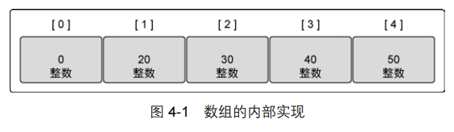
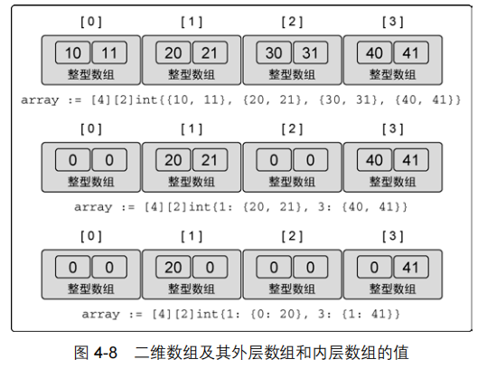
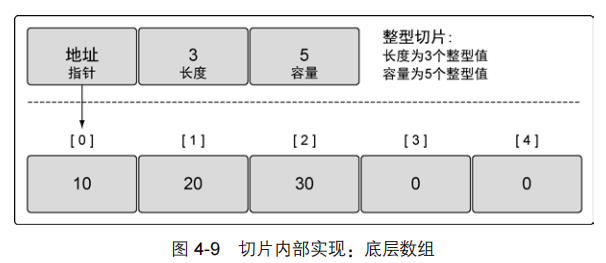
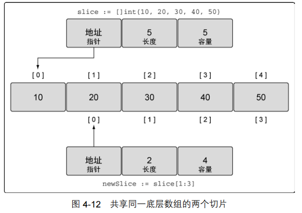
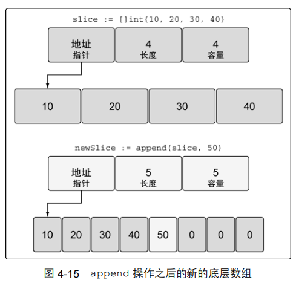
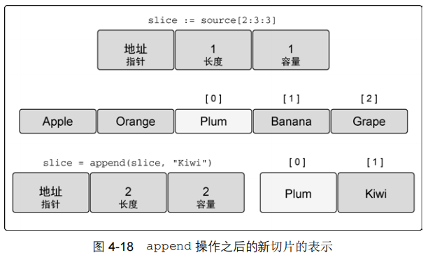
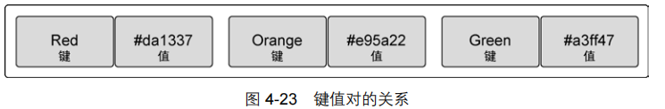
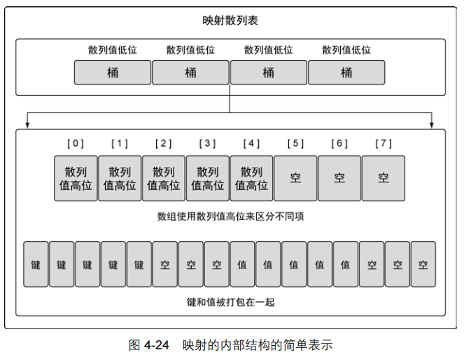
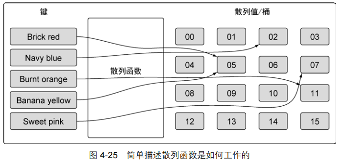

[TOC]

# Arrays, Slices and Maps


## 数组的内部实现和基础功能

### 内部实现

​        在 Go 语言里，数组是一个长度固定的数据类型，用于存储一段具有相同的类型的元素的连续块。数组存储的类型可以是内置类型，如整型或者字符串，也可以是某种结构类型。



```go
// 声明一个包含 5 个元素的整型数组
var array [5]int
```

​        一旦声明，数组里存储的数据类型和数组长度就都不能改变了。如果需要存储更多的元素，就需要先创建一个更长的数组，再把原来数组里的值复制到新数组里。

​        一种快速创建数组并初始化的方式是使用数组字面量。数组字面量允许声明数组里元素的数量同时指定每个元素的值，如下代码所示：

```go
// 声明一个包含 5 个元素的整型数组
// 用具体值初始化每个元素
array := [5]int{10, 20, 30, 40, 50}


// 声明一个整型数组
// 用具体值初始化每个元素
// 容量由初始化值的数量决定
array := [...]int{10, 20, 30, 40, 50}


// 声明一个有 5 个元素的数组
// 用具体值初始化索引为 1 和 2 的元素
// 其余元素保持零值
array := [5]int{1: 10, 2: 20}
```

​       数组变量的类型包括数组长度和每个元素的类型。只有这两部分都相同的数组，才是类型相同的数组，才能互相赋值：

```go
// 声明第一个包含 4 个元素的字符串数组
var array1 [4]string

// 声明第二个包含 5 个元素的字符串数组
// 使用颜色初始化数组
array2 := [5]string{"Red", "Blue", "Green", "Yellow", "Pink"}
// 将 array2 复制给 array1
array1 = array2

Compiler Error:
cannot use array2 (type [5]string) as type [4]string in assignment
```

### 多维数组

​        数组本身只有一个维度，不过可以组合多个数组创建多维数组。多维数组很容易管理具有父子关系的数据或者与坐标系相关联的数据。声明二维数组的示例如下代码所示。

```go
// 声明一个二维整型数组，两个维度分别存储 4 个元素和 2 个元素
var array [4][2]int

// 使用数组字面量来声明并初始化一个二维整型数组
array := [4][2]int{{10, 11}, {20, 21}, {30, 31}, {40, 41}}

// 声明并初始化外层数组中索引为 1 个和 3 的元素
array := [4][2]int{1: {20, 21}, 3: {40, 41}}

// 声明并初始化外层数组和内层数组的单个元素
array := [4][2]int{1: {0: 20}, 3: {1: 41}}
```




## 切片的内部实现和基础功能

​        **切片**是一种数据结构，这种数据结构便于使用和管理数据集合。**切片是围绕动态数组的概念构建的，可以按需自动增长和缩小。**切片的动态增长是通过内置函数 append 来实现的。这个函数可以快速且高效地增长切片。还可以通过对切片再次切片来缩小一个切片的大小。因为切片的底层内存也是在连续块中分配的，所以切片还能获得索引、迭代以及为垃圾回收优化的好处。


### 内部实现

​		切片是一个很小的对象，对底层数组进行了抽象，并提供相关的操作方法。切片有 3 个字段的数据结构，这些数据结构包含 Go 语言需要操作底层数组的元数据（如下图）。

​		**这 3 个字段分别是指向底层数组的指针、切片访问的元素的个数（即长度）和切片允许增长到的元素个数（即容量）。**后面会进一步讲解长度和容量的区别。



### 创建和初始化

​		Go 语言中有几种方法可以创建和初始化切片。是否能提前知道切片需要的容量通常会决定要如何创建切片。

#### 1．make 和切片字面量

​         一种创建切片的方法是使用内置的 make 函数。

```go
// 创建一个字符串切片
// 其长度和容量都是 5 个元素
slice := make([]string, 5)


// 创建一个整型切片
// 其长度为 3 个元素，容量为 5 个元素
slice := make([]int, 3, 5)


// 创建一个整型切片
// 使其长度大于容量
slice := make([]int, 5, 3)

Compiler Error:
len larger than cap in make([]int)
```


### 使用切片

```go
// 创建一个整型切片
// 其容量和长度都是 5 个元素
slice := []int{10, 20, 30, 40, 50}

// 改变索引为 1 的元素的值
slice[1] = 25

// 创建一个新切片
// 其长度为 2 个元素，容量为 4 个元素
newSlice := slice[1:3]
```

​		执行完上述代码中的切片动作后，我们有了两个切片，它们共享同一段底层数组，但通过不同的切片会看到底层数组的不同部分（见下图）。



​		**第一个切片 slice 能够看到底层数组全部 5 个元素的容量，不过之后的 newSlice 就看不到。对于 newSlice，底层数组的容量只有 4 个元素。newSlice 无法访问到它所指向的底层数组的第一个元素之前的部分。所以，对 newSlice 来说，之前的那些元素就是不存在的。**


### 切片增长

​		相对于数组而言，使用切片的一个好处是，可以按需增加切片的容量。Go 语言内置的 append 函数会处理增加长度时的所有操作细节。

```go
// 创建一个整型切片
// 其长度和容量都是 5 个元素
slice := []int{10, 20, 30, 40, 50}

// 创建一个新切片
// 其长度为 2 个元素，容量为 4 个元素
newSlice := slice[1:3]

// 使用原有的容量来分配一个新元素
// 将新元素赋值为 60
newSlice = append(newSlice, 60)
```

操作完成后的布局：

\markdownimage\04切片增长.png)

​        因为 newSlice 在底层数组里还有额外的容量可用，append 操作将可用的元素合并到切片的长度，并对其进行赋值。由于和原始的 slice 共享同一个底层数组，slice 中索引为 3 的元素的值也被改动了。

​		**如果切片的底层数组没有足够的可用容量，append 函数会创建一个新的底层数组，将被引用的现有的值复制到新数组里，再追加新的值**，如下代码所示：

```go
// 创建一个整型切片
// 其长度和容量都是 4 个元素
slice := []int{10, 20, 30, 40}

// 向切片追加一个新元素
// 将新元素赋值为 50
newSlice := append(slice, 50)
```



​        函数 append 会智能地处理底层数组的容量增长。**<u>在切片的容量小于 1000 个元素时，总是会成倍地增加容量。一旦元素个数超过 1000，容量的增长因子会设为 1.25，也就是会每次增加 25% 的容量。</u>**随着语言的演化，这种增长算法可能会有所改变。


### 创建切片时的 3 个索引

​        在创建切片时，第三个索引可以用来控制新切片的容量。其目的并不是要增加容量，而是要限制容量。可以看到，允许限制新切片的容量为底层数组提供了一定的保护，可以更好地控制追加操作。

```go
// 创建字符串切片
// 其长度和容量都是 5 个元素
source := []string{"Apple", "Orange", "Plum", "Banana", "Grape"}

// 将第三个元素切片，并限制容量
// 其长度为 1 个元素，容量为 2 个元素
slice := source[2:3:4]
```

​        和之前一样，第一个值表示新切片开始的元素的索引位置，这个例子中是 2。第二个值表示开始的索引位置（2）加上希望包括的元素的个数（1），2+1 的结果是 3，所以第二个值就是 3。**为了设置容量，从索引位置 2 开始，加上希望容量中包含的元素的个数（2），就得到了第三个值 4。**

​        如果试图设置的容量比可用的容量还大，就会得到一个语言运行时错误：

```go
// 这个切片操作试图设置容量为 4 
// 这比可用的容量大
slice := source[2:3:6]

Runtime Error:
panic: runtime error: slice bounds out of range
```

​        我们之前讨论过，内置函数 append 会首先使用可用容量。一旦没有可用容量，会分配一个新的底层数组。这导致很容易忘记切片间正在共享同一个底层数组。一旦发生这种情况，对切片进行修改，很可能会导致随机且奇怪的问题。对切片内容的修改会影响多个切片，却很难找到问题的原因。

​        如果在创建切片时设置切片的容量和长度一样，就可以强制让新切片的第一个 append 操作创建新的底层数组，与原有的底层数组分离。新切片与原有的底层数组分离后，可以安全地进行后续修改，如下代码所示。

```go
// 创建字符串切片
// 其长度和容量都是 5 个元素
source := []string{"Apple", "Orange", "Plum", "Banana", "Grape"}

// 对第三个元素做切片，并限制容量
// 其长度和容量都是 1 个元素
slice := source[2:3:3]

// 向 slice 追加新字符串
slice = append(slice, "Kiwi")
```

​        如果不加第三个索引，由于剩余的所有容量都属于 slice，向 slice 追加 Kiwi 会改变原有底层数组索引为 3 的元素的值 Banana。不过在代码清单 4-36 中我们限制了 slice 的容量为 1。当我们第一次对 slice 调用 append 的时候，会创建一个新的底层数组，这个数组包括 2 个元素，并将水果 Plum 复制进来，再追加新水果 Kiwi，并返回一个引用了这个底层数组的新切片，如下图所示：



​        内置函数 append 也是一个可变参数的函数。这意味着可以在一次调用传递多个追加的值。如果**使用...运算符，可以将一个切片的所有元素追加到另一个切片里**，如下代码所示。

```go
// 创建两个切片，并分别用两个整数进行初始化
s1 := []int{1, 2}
s2 := []int{3, 4}

// 将两个切片追加在一起，并显示结果
fmt.Printf("%v\n", append(s1, s2...))

Output:
[1 2 3 4]
```


### 迭代切片

​        既然切片是一个集合，可以迭代其中的元素。Go 语言有个特殊的关键字 range，它可以配合关键字 for 来迭代切片里的元素，如下代码所示。

```go
// 创建一个整型切片
// 其长度和容量都是 4 个元素
slice := []int{10, 20, 30, 40}

// 迭代每一个元素，并显示其值
for index, value := range slice {
   fmt.Printf("Index: %d Value: %d\n", index, value)
} 

Output:
Index: 0 Value: 10
Index: 1 Value: 20
Index: 2 Value: 30
Index: 3 Value: 40
```

​        当迭代切片时，关键字 range 会返回两个值。第一个值是当前迭代到的索引位置，第二个值是该位置对应元素值的一份副本。

​        需要强调的是，**<u>range 创建了每个元素的副本，而不是直接返回对该元素的引用</u>**。如果使用该值变量的地址作为指向每个元素的指针，就会造成错误。


## 映射的内部实现和基础功能

​        映射是一种数据结构，用于存储一系列无序的键值对。映射里基于键来存储值。下图通过一个例子展示了映射里键值对是如何存储的。映射功能强大的地方是，能够基于键快速检索数据。键就像索引一样，指向与该键关联的值。



### 内部实现

​        映射是一个集合，可以使用类似处理数组和切片的方式迭代映射中的元素。但映射是无序的集合，意味着没有办法预测键值对被返回的顺序。即便使用同样的顺序保存键值对，每次迭代映射的时候顺序也可能不一样。无序的原因是映射的实现使用了散列表，见下图。



​        映射的散列表（跟哈希一个意思）包含一组桶。在存储、删除或者查找键值对的时候，所有操作都要先选择一个桶。把操作映射时指定的键传给映射的散列函数，就能选中对应的桶。这个散列函数的目的是生成一个索引，这个索引最终将键值对分布到所有可用的桶里。

​        随着映射存储的增加，索引分布越均匀，访问键值对的速度就越快。如果你在映射里存储了 10 000 个元素，你不希望每次查找都要访问 10 000 个键值对才能找到需要的元素，你希望查找键值对的次数越少越好。对于有 10 000 个元素的映射，每次查找只需要查找 8 个键值对才是一个分布得比较好的映射。映射通过合理数量的桶来平衡键值对的分布。



​        Go 语言的映射生成散列键的过程比下图展示的过程要稍微长一些，不过大体过程是类似的。在我们的例子里，键是字符串，代表颜色。这些字符串会转换为一个数值（散列值）。这个数值落在映射已有桶的序号范围内表示一个可以用于存储的桶的序号。之后，这个数值就被用于选择桶，用于存储或者查找指定的键值对。对 Go 语言的映射来说，生成的散列键的一部分，具体来说是低位（LOB），被用来选择桶。


​		如果再仔细看看映射内部机构图，就能看出桶的内部实现。映射使用两个数据结构来存储数据。第一个数据结构是一个数组，内部存储的是用于选择桶的散列键的高八位值。这个数组用于区分每个键值对要存在哪个桶里。第二个数据结构是一个字节数组，用于存储键值对。该字节数组先依次存储了这个桶里所有的键，之后依次存储了这个桶里所有的值。实现这种键值对的存储方式目的在于减少每个桶所需的内存。


### 创建和初始化

```go
// 创建一个映射，键的类型是 string，值的类型是 int
dict := make(map[string]int)

// 创建一个映射，键和值的类型都是 string
// 使用两个键值对初始化映射
dict := map[string]string{"Red": "#da1337", "Orange": "#e95a22"}

// 创建一个映射，使用字符串切片作为值
dict := map[int][]string{}
```


### 使用映射

```go
// 创建一个空映射，用来存储颜色以及颜色对应的十六进制代码
colors := map[string]string{}


// 将 Red 的代码加入到映射
colors["Red"] = "#da1337"


// 通过声明映射创建一个 nil 映射
var colors map[string]string


// 将 Red 的代码加入到nil映射
colors["Red"] = "#da1337"

Runtime Error:
panic: runtime error: assignment to entry in nil map


// 获取键 Blue 对应的值
value, exists := colors["Blue"]
// 这个键存在吗？
if exists {
	fmt.Println(value)
}

// 获取键 Blue 对应的值
value := colors["Blue"]
// 这个键存在吗？
if value != "" {
	fmt.Println(value)
}

// 删除键为 Coral 的键值对
delete(colors, "Coral")
```


### 在函数间传递映射

​		在函数间传递映射并不会制造出该映射的一个副本。实际上，当传递映射给一个函数，并对这个映射做了修改时，所有对这个映射的引用都会察觉到这个修改:

```go
func main() {
// 创建一个映射，存储颜色以及颜色对应的十六进制代码
	colors := map[string]string{
		"AliceBlue": "#f0f8ff",
		"Coral": "#ff7F50",
		"DarkGray": "#a9a9a9",
		"ForestGreen": "#228b22",
	 } 
	// 显示映射里的所有颜色
	for key, value := range colors {
		fmt.Printf("Key: %s Value: %s\n", key, value)
 	} 
	// 调用函数来移除指定的键
	removeColor(colors, "Coral")
	// 显示映射里的所有颜色
	for key, value := range colors {
		fmt.Printf("Key: %s Value: %s\n", key, value)
 	} 
} 

// removeColor 将指定映射里的键删除
func removeColor(colors map[string]string, key string) {
	delete(colors, key)
}
```

output:

```
Key: AliceBlue Value: #F0F8FF
Key: Coral Value: #FF7F50
Key: DarkGray Value: #A9A9A9
Key: ForestGreen Value: #228B22
Key: AliceBlue Value: #F0F8FF
Key: DarkGray Value: #A9A9A9
Key: ForestGreen Value: #228B22
```

​		可以看到，在调用了 removeColor 之后，main 函数里引用的映射中不再有 Coral 颜色了。这个特性和切片类似，保证可以用很小的成本来复制映射。


## 小结

- 数组是构造切片和映射的基石。
- Go 语言里切片经常用来处理数据的集合，映射用来处理具有键值对结构的数据。
- 内置函数 make 可以创建切片和映射，并指定原始的长度和容量。也可以直接使用切片和映射字面量，或者使用字面量作为变量的初始值。
- 切片有容量限制，不过可以使用内置的 append 函数扩展容量。
- 映射的增长没有容量或者任何限制。
- 内置函数 len 可以用来获取切片或者映射的长度。
- 内置函数 cap 只能用于切片。
- 通过组合，可以创建多维数组和多维切片。也可以使用切片或者其他映射作为映射的值。但是切片不能用作映射的键。
- 将切片或者映射传递给函数成本很小，并且不会复制底层的数据结构。


