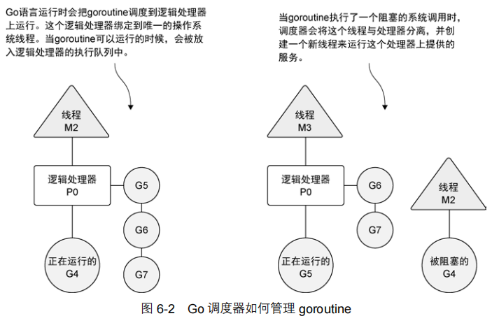
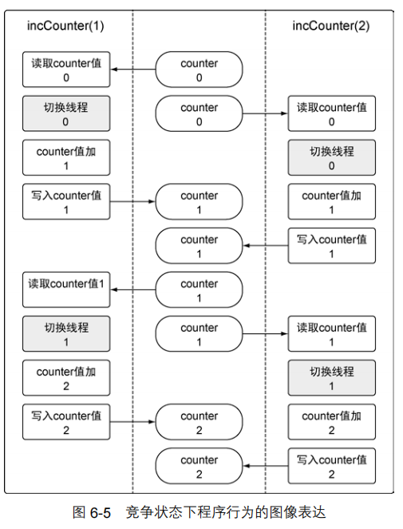
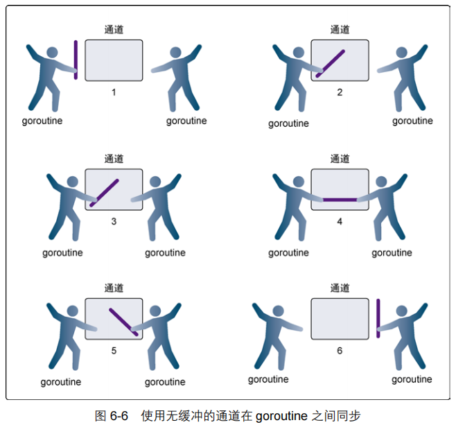
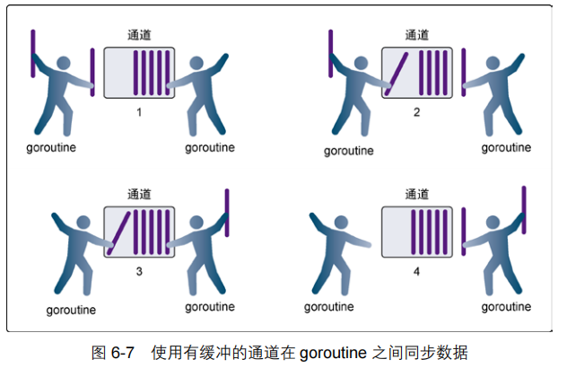

[TOC]

# 并发

​        Go 语言的并发同步模型来自一个叫作**通信顺序进程（Communicating Sequential Processes，CSP）**的范型（paradigm）。CSP 是一种消息传递模型，通过在 goroutine 之间传递数据来传递消息，而不是对数据进行加锁来实现同步访问。用于在 goroutine 之间同步和传递数据的关键数据类型叫作通道（channel）。使用通道可以使编写并发程序更容易，也能够让并发程序出错更少。


## 并发与并行

​        **操作系统会在物理处理器上调度线程来运行，而 Go 语言的运行时会在逻辑处理器上调度 goroutine来运行。**每个逻辑处理器都分别绑定到单个操作系统线程。在 1.5 版本 ①上，Go语言的运行时默认会为每个可用的物理处理器分配一个逻辑处理器。在 1.5 版本之前的版本中，默认给整个应用程序只分配一个逻辑处理器。这些逻辑处理器会用于执行所有被创建的goroutine。即便只有一个逻辑处理器，Go也可以以神奇的效率和性能，并发调度无数个goroutine。

​        在下图中，可以看到操作系统线程、逻辑处理器和本地运行队列之间的关系。**<u>如果创建一个 goroutine 并准备运行，这个 goroutine 就会被放到调度器的全局运行队列中。之后，调度器就将这些队列中的 goroutine 分配给一个逻辑处理器，并放到这个逻辑处理器对应的本地运行队列中。本地运行队列中的 goroutine 会一直等待直到自己被分配的逻辑处理器执行。</u>**




​		有时，正在运行的 goroutine 需要执行一个阻塞的系统调用，如打开一个文件。**当这类调用发生时，线程和 goroutine 会从逻辑处理器上分离，该线程会继续阻塞，等待系统调用的返回**。与此同时，这个逻辑处理器就失去了用来运行的线程。所以，**调度器会创建一个新线程，并将其绑定到该逻辑处理器上。之后，调度器会从本地运行队列里选择另一个 goroutine 来运行。一旦被阻塞的系统调用执行完成并返回，对应的 goroutine 会放回到本地运行队列，而之前的线程会保存好，以便之后可以继续使用。**

​        **<u>如果一个 goroutine 需要做一个网络 I/O 调用，流程上会有些不一样。在这种情况下，goroutine 会和逻辑处理器分离，并移到集成了网络轮询器的运行时。一旦该轮询器指示某个网络读或者写操作已经就绪，对应的 goroutine 就会重新分配到逻辑处理器上来完成操作。</u>** **调度器对可以创建的逻辑处理器的数量没有限制，但语言运行时默认限制每个程序最多创建 10 000 个线程。这个限制值可以通过调用 runtime/debug 包的 SetMaxThreads 方法来更改。如果程序试图使用更多的线程，就会崩溃。**


## goroutine

​        先通过在一个逻辑处理器上运行的例子来讲解，再来讨论如何让 goroutine 并行运行。如下代码所示的程序会创建两个 goroutine，以并发的形式分别显示大写和小写的英文字母。

```go
01 // 这个示例程序展示如何创建 goroutine
02 // 以及调度器的行为
03 package main
04
05 import ( 
06 		"fmt"
07 		"runtime"
08 		"sync"
09 ) 
10
11 // main 是所有 Go 程序的入口
12 func main() { 
13 		// 分配一个逻辑处理器给调度器使用
14 		runtime.GOMAXPROCS(1)
15
16 		// wg 用来等待程序完成
17 		// 计数加 2，表示要等待两个 goroutine
18 		var wg sync.WaitGroup
19 		wg.Add(2)
20
21 		fmt.Println("Start Goroutines")
22
23 		// 声明一个匿名函数，并创建一个 goroutine
24 		go func() { 
25 			// 在函数退出时调用 Done 来通知 main 函数工作已经完成
26 			defer wg.Done()
27
28 			// 显示字母表 3 次
29 			for count := 0; count < 3; count++ { 
30 				for char := 'a'; char < 'a'+26; char++ { 
31 					fmt.Printf("%c ", char)
32 				} 
33 			} 
34 		}()
35
36 		// 声明一个匿名函数，并创建一个 goroutine
37 		go func() { 
38 			// 在函数退出时调用 Done 来通知 main 函数工作已经完成
39 			defer wg.Done()
40
41 			// 显示字母表 3 次
42 			for count := 0; count < 3; count++ { 
43 				for char := 'A'; char < 'A'+26; char++ { 
44 					fmt.Printf("%c ", char)
45 				} 
46 			} 
47 		}()
48
49 		// 等待 goroutine 结束
50 		fmt.Println("Waiting To Finish")
51 		wg.Wait()
52
53 		fmt.Println("\nTerminating Program")
54 }
```

​        在代码的第 14 行，调用了 runtime 包的 GOMAXPROCS 函数。这个函数允许程序更改调度器可以使用的逻辑处理器的数量。如果不想在代码里做这个调用，也可以通过修改和这个函数名字一样的环境变量的值来更改逻辑处理器的数量。给这个函数传入 1，是通知调度器只能为该程序使用一个逻辑处理器。

​        在第 24 行和第 37 行，我们声明了两个匿名函数，用来显示英文字母表。第 24 行的函数显示小写字母表，而第 37 行的函数显示大写字母表。这两个函数分别通过关键字 go 创建 goroutine 来执行。根据代码中给出的输出可以看到，每个 goroutine 执行的代码在一个逻辑处理器6.2 goroutine 上并发运行的效果。

```
Start Goroutines
Waiting To Finish
A B C D E F G H I J K L M N O P Q R S T U V W X Y Z A B C D E F G H I J K L M 
N O P Q R S T U V W X Y Z A B C D E F G H I J K L M N O P Q R S T U V W X Y Z 
a b c d e f g h i j k l m n o p q r s t u v w x y z a b c d e f g h i j k l m 
n o p q r s t u v w x y z a b c d e f g h i j k l m n o p q r s t u v w x y z 
Terminating Program
```

​        第一个 goroutine 完成所有显示需要花时间太短了，以至于在调度器切换到第二个 goroutine 之前，就完成了所有任务。这也是为什么会看到先输出了所有的大写字母，之后才输出小写字母。我们创建的两个 goroutine 一个接一个地并发运行，独立完成显示字母表的任务。

​        一旦两个匿名函数创建 goroutine 来执行，main 中的代码会继续运行。这意味着 main 函数会在 goroutine 完成工作前返回。如果真的返回了，程序就会在 goroutine 有机会运行前终止。因此，在第 51 行，main 函数通过 WaitGroup，等待两个 goroutine 完成它们的工作。

​        WaitGroup 是一个计数信号量，可以用来记录并维护运行的 goroutine。如果 WaitGroup 的值大于 0，Wait 方法就会阻塞。在第 18 行，创建了一个 WaitGroup 类型的变量，之后在第 19 行，将这个 WaitGroup 的值设置为 2，表示有两个正在运行的 goroutine。为了减小 WaitGroup 的值并最终释放 main 函数，要在第 26 和 39 行，使用 defer 声明在函数退出时调用 Done 方法。

​        基于调度器的内部算法，一个正运行的 goroutine 在工作结束前，可以被停止并重新调度。调度器这样做的目的是防止某个 goroutine 长时间占用逻辑处理器。**<u>当 goroutine 占用时间过长时，调度器会停止当前正运行的 goroutine，并给其他可运行的 goroutine 运行的机会。</u>**

​        下图从逻辑处理器的角度展示了这一场景。在第 1 步，调度器开始运行 goroutine A，而 goroutine B 在运行队列里等待调度。之后，在第 2 步，调度器交换了 goroutine A 和 goroutine B。由于 goroutine A 并没有完成工作，因此被放回到运行队列。之后，在第 3 步，goroutine B 完成了它的工作并被系统销毁。这也让 goroutine A 继续之前的工作。


## 竞争状态

​		如果两个或者多个 goroutine 在没有互相同步的情况下，访问某个共享的资源，并试图同时读和写这个资源，就处于相互竞争的状态，这种情况被称作竞争状态（race candition）。竞争状态的存在是让并发程序变得复杂的地方，十分容易引起潜在问题。对一个共享资源的读和写操作必须是原子化的，换句话说，**<u>同一时刻只能有一个 goroutine 对共享资源进行读和写操作</u>**。代码中给出的是包含竞争状态的示例程序。

```go
01 // 这个示例程序展示如何在程序里造成竞争状态
02 // 实际上不希望出现这种情况
03 package main
04
05 import ( 
06 		"fmt"
07 		"runtime"
08 		"sync"
09 ) 
10
11 var ( 
12 		// counter 是所有 goroutine 都要增加其值的变量
13 		counter int
14
15 		// wg 用来等待程序结束
16 		wg sync.WaitGroup
17 ) 
18
19 // main 是所有 Go 程序的入口
20 func main() { 
21 		// 计数加 2，表示要等待两个 goroutine
22 		wg.Add(2)
23
24 		// 创建两个 goroutine
25 		go incCounter(1)
26 		go incCounter(2)
27
28 		// 等待 goroutine 结束
29 		wg.Wait()
30 		fmt.Println("Final Counter:", counter)
31 } 
32
33 // incCounter 增加包里 counter 变量的值
34 func incCounter(id int) { 
35 		// 在函数退出时调用 Done 来通知 main 函数工作已经完成
36 		defer wg.Done()
37
38 		for count := 0; count < 2; count++ { 
39 			// 捕获 counter 的值
40 			value := counter
41
42 			// 当前 goroutine 从线程退出，并放回到队列
43 			runtime.Gosched()
44
45 			// 增加本地 value 变量的值
46 			value++
47
48 			// 将该值保存回 counter
49 			counter = value
50 		} 
51 }
```

对应的输出如下：

```
Final Counter: 2
```

​		每个 goroutine 都会覆盖另一个 goroutine 的工作。这种覆盖发生在 goroutine 切换的时候。每个 goroutine 创造了一个 counter 变量的副本，之后就切换到另一个 goroutine。当这个 goroutine再次运行的时候，counter 变量的值已经改变了，但是 goroutine 并没有更新自己的那个副本的值，而是继续使用这个副本的值，用这个值递增，并存回 counter 变量，结果覆盖了另一个goroutine 完成的工作。



​        Go 语言有一个特别的工具，可以在代码里检测竞争状态。在查找这类错误的时候，这个工具非常好用，尤其是在竞争状态并不像这个例子里这么明显的时候。让我们用这个竞争检测器来检测一下我们的例子代码，如下代码所示。

```go
go build -race // 用竞争检测器标志来编译程序
./example // 运行程序
==================
WARNING: DATA RACE
Write by goroutine 5:
	main.incCounter()
		/example/main.go:49 +0x96
Previous read by goroutine 6:
	main.incCounter()
		/example/main.go:40 +0x66
Goroutine 5 (running) created at:
	main.main()
		/example/main.go:25 +0x5c
Goroutine 6 (running) created at:
	main.main()
         /example/main.go:26 +0x73
==================
Final Counter: 2 
Found 1 data race(s)

Line 49: counter = value
Line 40: value := counter
Line 25: go incCounter(1)
Line 26: go incCounter(2)
```

​		竞争检测器查到的哪个 goroutine 引发了数据竞争，以及哪两行代码有冲突。毫不奇怪，这几行代码分别是对 counter 变量的读和写操作。

​		一种修正代码、消除竞争状态的办法是，使用 Go 语言提供的锁机制，来锁住共享资源，从而保证 goroutine 的同步状态。


## 锁住共享资源

​        Go 语言提供了传统的同步 goroutine 的机制，就是对共享资源加锁。如果需要顺序访问一个整型变量或者一段代码，atomic 和 sync 包里的函数提供了很好的解决方案。下面我们了解一下 atomic 包里的几个函数以及 sync 包里的 mutex 类型。


### 原子函数

​		原子函数能够以很底层的加锁机制来同步访问整型变量和指针。我们可以用原子函数来修正代中创建的竞争状态，如下代码所示。

```go
01 // 这个示例程序展示如何使用 atomic 包来提供
02 // 对数值类型的安全访问
03 package main
04
05 import ( 
06 		"fmt"
07 		"runtime"
08 		"sync"
09 		"sync/atomic"
10 ) 
11
12 var ( 
13 		// counter 是所有 goroutine 都要增加其值的变量
14		 counter int64
15
16 		// wg 用来等待程序结束
17 		wg sync.WaitGroup
18 ) 
19
20 // main 是所有 Go 程序的入口
21 func main() { 
22 		// 计数加 2，表示要等待两个 goroutine
23 		wg.Add(2)
24
25 		// 创建两个 goroutine
26 		go incCounter(1)
27 		go incCounter(2)
28
29 		// 等待 goroutine 结束
30 		wg.Wait()
31
32 		// 显示最终的值
33 		fmt.Println("Final Counter:", counter)
34 } 
35
36 // incCounter 增加包里 counter 变量的值
37 func incCounter(id int) { 
38 		// 在函数退出时调用 Done 来通知 main 函数工作已经完成
39 		defer wg.Done()
40
41 		for count := 0; count < 2; count++ { 
42 			// 安全地对 counter 加 1 
43 			atomic.AddInt64(&counter, 1)
44
45 			// 当前 goroutine 从线程退出，并放回到队列
46 			runtime.Gosched()
47 		} 
48 }
```

输出：`Final Counter: 4 `

​        现在，程序的第 43 行使用了 atmoic 包的 AddInt64 函数。这个函数会同步整型值的加法，方法是强制同一时刻只能有一个 goroutine 运行并完成这个加法操作。当 goroutine 试图去调用任何原子函数时，这些 goroutine 都会自动根据所引用的变量做同步处理。现在我们得到了正确的值 4。


### 互斥锁

​        另一种同步访问共享资源的方式是使用互斥锁（mutex）。互斥锁这个名字来自互斥（mutual exclusion）的概念。互斥锁用于在代码上创建一个临界区，保证同一时间只有一个 goroutine 可以执行这个临界区代码。我们还可以用互斥锁来修正代码中创建的竞争状态，如下代码所示。

```go
01 // 这个示例程序展示如何使用互斥锁来
02 // 定义一段需要同步访问的代码临界区
03 // 资源的同步访问
04 package main
05
06 import ( 
07 		"fmt"
08 		"runtime"
09 		"sync"
10 ) 
11
12 var ( 
13 		// counter 是所有 goroutine 都要增加其值的变量
14 		counter int
15
16 		// wg 用来等待程序结束
17 		wg sync.WaitGroup
18
19 		// mutex 用来定义一段代码临界区
20 		mutex sync.Mutex
21 ) 
22
23 // main 是所有 Go 程序的入口
24 func main() { 
25 		// 计数加 2，表示要等待两个 goroutine
26 		wg.Add(2)
27
28 		// 创建两个 goroutine
29 		go incCounter(1)
30 		go incCounter(2)
31
32 		// 等待 goroutine 结束
33 		wg.Wait()
34 		fmt.Printf("Final Counter: %d\\n", counter)
35 } 
36
37 // incCounter 使用互斥锁来同步并保证安全访问，
38 // 增加包里 counter 变量的值
39 func incCounter(id int) { 
40 		// 在函数退出时调用 Done 来通知 main 函数工作已经完成
41 		defer wg.Done()
42
43 		for count := 0; count < 2; count++ { 
44 			// 同一时刻只允许一个 goroutine 进入
45 			// 这个临界区
46 			mutex.Lock()
47 			{ 
48 				// 捕获 counter 的值
49 				value := counter
50
51 				// 当前 goroutine 从线程退出，并放回到队列
52 				runtime.Gosched() 
53
54 				// 增加本地 value 变量的值
55 				value++
56
57 				// 将该值保存回 counter
58 				counter = value
59 			} 
60 			mutex.Unlock()
61 			// 释放锁，允许其他正在等待的 goroutine
62 			// 进入临界区
63 		} 
64 }
```

​		对 counter 变量的操作在第 46 行和第 60 行的 Lock()和 Unlock()函数调用定义的临界区里被保护起来。使用大括号只是为了让临界区看起来更清晰，并不是必需的。同一时刻只有一个 goroutine 可以进入临界区。之后，直到调用 Unlock()函数之后，其他 goroutine 才能进入临界区。当第 52 行强制将当前 goroutine 退出当前线程后，调度器会再次分配这个 goroutine 继续运行。当程序结束时，我们得到正确的值 4，竞争状态不再存在。


## 通道

​		在 Go 语言里，你不仅可以使用原子函数和互斥锁来保证对共享资源的安全访问以及消除竞争状态，还可以使用通道，通过发送和接收需要共享的资源，在 goroutine 之间做同步。

​		当一个资源需要在 goroutine 之间共享时，通道在 goroutine 之间架起了一个管道，并提供了确保同步交换数据的机制。声明通道时，需要指定将要被共享的数据的类型。可以通过通道共享内置类型、命名类型、结构类型和引用类型的值或者指针。

​		在 Go 语言中需要使用内置函数 make 来创建一个通道，如下代码所示。

```go
// 无缓冲的整型通道
unbuffered := make(chan int)

// 有缓冲的字符串通道
buffered := make(chan string, 10)
```

​       在代码中，可以看到使用内置函数 make 创建了两个通道，一个无缓冲的通道，一个有缓冲的通道。make 的第一个参数需要是关键字 chan，之后跟着允许通道交换的数据的类型。如果创建的是一个有缓冲的通道，之后还需要在第二个参数指定这个通道的缓冲区的大小。

​       向通道发送值或者指针需要用到`<-`操作符，如下代码所示。

```go
// 有缓冲的字符串通道
buffered := make(chan string, 10)

// 通过通道发送一个字符串
buffered <- "Gopher"

// 从通道接收一个字符串
value := <-buffered
```

​        当从通道里接收一个值或者指针时，`<-`运算符在要操作的通道变量的左侧。

​        通道是否带有缓冲，其行为会有一些不同。理解这个差异对决定到底应该使用还是不使用缓冲很有帮助。下面我们分别介绍一下这两种类型。


### 无缓冲的通道

​        **无缓冲的通道（unbuffered channel）**<u>是指在接收前没有能力保存任何值的通道</u>。**<u>这种类型的通道要求发送 goroutine 和接收 goroutine 同时准备好，才能完成发送和接收操作。如果两个 goroutine没有同时准备好，通道会导致先执行发送或接收操作的 goroutine 阻塞等待。这种对通道进行发送和接收的交互行为本身就是同步的。其中任意一个操作都无法离开另一个操作单独存在。</u>**

​		可以看到一个例子，展示两个 goroutine 如何利用无缓冲的通道来共享一个值。



​        在第 1 步，两个 goroutine 都到达通道，但哪个都没有开始执行发送或者接收。在第 2 步，左侧的 goroutine 将它的手伸进了通道，这模拟了向通道发送数据的行为。这时，<u>这个 goroutine 会在通道中被锁住，直到交换完成</u>。在第 3 步，右侧的 goroutine 将它的手放入通道，这模拟了从通道里接收数据。这个 goroutine 一样也会在通道中被锁住，直到交换完成。在第 4 步和第 5 步，进行交换，并最终，在第 6 步，两个 goroutine 都将它们的手从通道里拿出来，这模拟了被锁住的 goroutine 得到释放。<u>两个 goroutine 现在都可以去做别的事情了。</u>

​        为了讲得更清楚，让我们来看两个完整的例子。这两个例子都会使用无缓冲的通道在两个goroutine 之间同步交换数据。在网球比赛中，两位选手会把球在两个人之间来回传递。选手总是处在以下两种状态之一：要么在等待接球，要么将球打向对方。可以使用两个 goroutine 来模拟网球比赛，并使用无缓冲的通道来模拟球的来回，如下代码所示。

```go
01 // 这个示例程序展示如何用无缓冲的通道来模拟
02 // 2 个 goroutine 间的网球比赛
03 package main
04
05 import ( 
06 		"fmt"
07 		"math/rand"
08		"sync"
09 		"time"
10 ) 
11
12 // wg 用来等待程序结束
13 var wg sync.WaitGroup
14
15 func init() { 
16 		rand.Seed(time.Now().UnixNano())
17 } 
18
19 // main 是所有 Go 程序的入口
20 func main() { 
21 		// 创建一个无缓冲的通道
22 		court := make(chan int)
23
24 		// 计数加 2，表示要等待两个 goroutine
25 		wg.Add(2)
26
27 		// 启动两个选手
28 		go player("Nadal", court)
29 		go player("Djokovic", court)
30
31 		// 发球
32 		court <- 1 
33
34 		// 等待游戏结束
35 		wg.Wait()
36 } 
37
38 // player 模拟一个选手在打网球
39 func player(name string, court chan int) { 
40 		// 在函数退出时调用 Done 来通知 main 函数工作已经完成
41 		defer wg.Done()
42
43 		for { 
44 			// 等待球被击打过来
45 			ball, ok := <-court
46 			if !ok { 
47 				// 如果通道被关闭，我们就赢了
48 				fmt.Printf("Player %s Won\n", name)
49 				return
50 			} 
51
52 			// 选随机数，然后用这个数来判断我们是否丢球
53 			n := rand.Intn(100)
54 			if n%13 == 0 { 
55 				fmt.Printf("Player %s Missed\n", name)
56
57 				// 关闭通道，表示我们输了
58 				close(court)
59 				return
60 			} 
61
62 			// 显示击球数，并将击球数加 1 
63 			fmt.Printf("Player %s Hit %d\n", name, ball)
64 			ball++
65
66 			// 将球打向对手
67 			court <- ball
68 		} 
69 }
```

运行这个程序会得到输出：

```go
Player Nadal Hit 1 
Player Djokovic Hit 2 
Player Nadal Hit 3 
Player Djokovic Missed
Player Nadal Won
```

​        在 main 函数的第 22 行，创建了一个 int 类型的无缓冲的通道，让两个 goroutine 在击球时能够互相同步。之后在第 28 行和第 29 行，创建了参与比赛的两个 goroutine。在这个时候，两个 goroutine 都阻塞住等待击球。在第 32 行，将球发到通道里，程序开始执行这个比赛，直到某个 goroutine 输掉比赛。

​		在 player 函数里，在第 45 行，goroutine 从通道接收数据，用来表示等待接球。这个接收动作会锁住goroutine，直到有数据发送到通道里。通道的接收动作返回时，第 46 行会检测 ok 标志是否为 false。如果这个值是 false，表示通道已经被关闭，游戏结束。


​		另一个例子，用不同的模式，使用无缓冲的通道，在 goroutine 之间同步数据，来模拟接力比赛。在接力比赛里，4 个跑步者围绕赛道轮流跑（如代码清单 6-22 所示）。第二个、第三个和第四个跑步者要接到前一位跑步者的接力棒后才能起跑。比赛中最重要的部分是要传递接力棒，要求同步传递。在同步接力棒的时候，参与接力的两个跑步者必须在同一时刻准备好交接。

```go
01 // 这个示例程序展示如何用无缓冲的通道来模拟
02 // 4 个 goroutine 间的接力比赛
03 package main
04
05 import ( 
06 		"fmt"
07 		"sync"
08 		"time"
09 ) 
10
11 // wg 用来等待程序结束
12 var wg sync.WaitGroup
13
14 // main 是所有 Go 程序的入口
15 func main() { 
16 		// 创建一个无缓冲的通道
17 		baton := make(chan int)
18
19 		// 为最后一位跑步者将计数加 1 
20 		wg.Add(1)
21
22 		// 第一位跑步者持有接力棒
23 		go Runner(baton)
24
25 		// 开始比赛
26 		baton <- 1 
27
28 		// 等待比赛结束
29 		wg.Wait()
30 } 
31
32 // Runner 模拟接力比赛中的一位跑步者
33 func Runner(baton chan int) { 
34 		var newRunner int
35
36 		// 等待接力棒
37 		runner := <-baton
38
39 		// 开始绕着跑道跑步
40 		fmt.Printf("Runner %d Running With Baton\n", runner)
41
42 		// 创建下一位跑步者
43 		if runner != 4 { 
44 			newRunner = runner + 1 
45 			fmt.Printf("Runner %d To The Line\n", newRunner)
46 			go Runner(baton)
47 		} 
48
49 		// 围绕跑道跑
50 		time.Sleep(100 * time.Millisecond)
51
52 		// 比赛结束了吗？
53 		if runner == 4 { 
54 			fmt.Printf("Runner %d Finished, Race Over\n", runner)
55 			wg.Done()
56 			return
57 		} 
58
59 		// 将接力棒交给下一位跑步者
60 		fmt.Printf("Runner %d Exchange With Runner %d\n",
61 					runner,
62 					newRunner)
63
64 		baton <- newRunner
65 }
```

输出：

```
Runner 1 Running With Baton
Runner 1 To The Line
Runner 1 Exchange With Runner 2 
Runner 2 Running With Baton
Runner 2 To The Line
Runner 2 Exchange With Runner 3 
Runner 3 Running With Baton
Runner 3 To The Line
Runner 3 Exchange With Runner 4 
Runner 4 Running With Baton
Runner 4 Finished, Race Over
```

​        在 main 函数的第 17 行，创建了一个无缓冲的 int 类型的通道 baton，用来同步传递接力棒。在第 20 行，我们给 WaitGroup 加 1，这样 main 函数就会等最后一位跑步者跑步结束。在第 23 行创建了一个 goroutine，用来表示第一位跑步者来到跑道。之后在第 26 行，将接力棒交给这个跑步者，比赛开始。最终，在第 29 行，main 函数阻塞在 WaitGroup，等候最后一位跑步者完成比赛。

​		在 Runner goroutine 里，可以看到接力棒 baton 是如何在跑步者之间传递的。在第 46 行就会创建一位新跑步者，准备接力下一棒，直到 goroutine 是第四个跑步者。。在第 55 行，如果第四个跑步者完成了比赛，就调用 Done，将 WaitGroup 减 1，之后 goroutine 返回。如果这个 goroutine 不是第四个跑步者，那么在第 64 行，接力棒会交到下一个已经在等待的跑步者手上。在这个时候，goroutine 会被锁住，直到交接完成。


### 有缓冲的通道

​         ※※**<u>有缓冲的通道（buffered channel）是一种在被接收前能存储一个或者多个值的通道。这种类型的通道并不强制要求 goroutine 之间必须同时完成发送和接收。通道会阻塞发送和接收动作的条件也会不同。只有在通道中没有要接收的值时，接收动作才会阻塞。只有在通道没有可用缓冲区容纳被发送的值时，发送动作才会阻塞。这导致有缓冲的通道和无缓冲的通道之间的一个很大的不同：无缓冲的通道保证进行发送和接收的 goroutine 会在同一时间进行数据交换；有缓冲的通道没有这种保证。</u>**



​        让我们看一个使用有缓冲的通道的例子，这个例子管理一组 goroutine 来接收并完成工作。有缓冲的通道提供了一种清晰而直观的方式来实现这个功能，如下代码所示。

```go
01 // 这个示例程序展示如何使用
02 // 有缓冲的通道和固定数目的
03 // goroutine 来处理一堆工作
04 package main
05
06 import ( 
07 		"fmt"
08 		"math/rand"
09 		"sync"
10 		"time"
11 ) 
12
13 const ( 
14 		numberGoroutines = 4 // 要使用的 goroutine 的数量
15 		taskLoad = 10 // 要处理的工作的数量
16 ) 
17
18 // wg 用来等待程序完成
19 var wg sync.WaitGroup
20
21 // init 初始化包，Go 语言运行时会在其他代码执行之前
22 // 优先执行这个函数
23 func init() { 
24 		// 初始化随机数种子
25 		rand.Seed(time.Now().Unix())
26 } 
27
28 // main 是所有 Go 程序的入口
29 func main() { 
30 		// 创建一个有缓冲的通道来管理工作
31 		tasks := make(chan string, taskLoad)
32
33 		// 启动 goroutine 来处理工作
34 		wg.Add(numberGoroutines)
35 		for gr := 1; gr <= numberGoroutines; gr++ { 
36 			go worker(tasks, gr)
37 		} 
38
39 		// 增加一组要完成的工作
40 		for post := 1; post <= taskLoad; post++ { 
41 			tasks <- fmt.Sprintf("Task : %d", post)
42 		} 
43
44 		// 当所有工作都处理完时关闭通道
45 		// 以便所有 goroutine 退出
46 		close(tasks)
47
48 		// 等待所有工作完成
49 		wg.Wait()
50 } 
51
52 // worker 作为 goroutine 启动来处理
53 // 从有缓冲的通道传入的工作
54 func worker(tasks chan string, worker int) { 
55 		// 通知函数已经返回
56 		defer wg.Done()
57
58 		for { 
59 			// 等待分配工作
60 			task, ok := <-tasks
61 			if !ok { 
62 				// 这意味着通道已经空了，并且已被关闭
63 				fmt.Printf("Worker: %d : Shutting Down\n", worker)
64 				return
65 			} 
66
67 			// 显示我们开始工作了
68 			fmt.Printf("Worker: %d : Started %s\n", worker, task)
69
70 			// 随机等一段时间来模拟工作
71 			sleep := rand.Int63n(100)
72 			time.Sleep(time.Duration(sleep) * time.Millisecond)
73
74 			// 显示我们完成了工作
75 			fmt.Printf("Worker: %d : Completed %s\n", worker, task)
76 		} 
77 }
```

输出：

```
Worker: 1 : Started Task : 1 
Worker: 2 : Started Task : 2 
Worker: 3 : Started Task : 3 
Worker: 4 : Started Task : 4 
Worker: 1 : Completed Task : 1 
Worker: 1 : Started Task : 5 
Worker: 4 : Completed Task : 4 
Worker: 4 : Started Task : 6 
Worker: 1 : Completed Task : 5 
Worker: 1 : Started Task : 7 
Worker: 2 : Completed Task : 2 
Worker: 2 : Started Task : 8 
Worker: 3 : Completed Task : 3 
Worker: 3 : Started Task : 9 
Worker: 1 : Completed Task : 7 
Worker: 1 : Started Task : 10
Worker: 4 : Completed Task : 6 
Worker: 4 : Shutting Down
Worker: 3 : Completed Task : 9 
Worker: 3 : Shutting Down
Worker: 2 : Completed Task : 8 
Worker: 2 : Shutting Down
Worker: 1 : Completed Task : 10
Worker: 1 : Shutting Down
```

​		由于程序和 Go 语言的调度器带有随机成分，这个程序每次执行得到的输出会不一样。不过，通过有缓冲的通道，使用所有 4 个 goroutine 来完成工作，这个流程不会变。从输出可以看到每个 goroutine 是如何接收从通道里分发的工作。

​		第 46 行中关闭通道的代码非常重要。当通道关闭后，goroutine 依旧可以从通道接收数据，但是不能再向通道里发送数据。能够从已经关闭的通道接收数据这一点非常重要，因为这允许**<u>通道关闭后依旧能取出其中缓冲的全部值，而不会有数据丢失。从一个已经关闭且没有数据的通道里获取数据，总会立刻返回，并返回一个通道类型的零值。如果在获取通道时还加入了可选的标志，就能得到通道的状态信息。</u>**


## 小结

- 并发是指 goroutine 运行的时候是相互独立的。
- 使用关键字 go 创建 goroutine 来运行函数。
- goroutine 在逻辑处理器上执行，而逻辑处理器具有独立的系统线程和运行队列。
- 竞争状态是指两个或者多个 goroutine 试图访问同一个资源。
- 原子函数和互斥锁提供了一种防止出现竞争状态的办法。
- 通道提供了一种在两个 goroutine 之间共享数据的简单方法。
- 无缓冲的通道保证同时交换数据，而有缓冲的通道不做这种保证。


