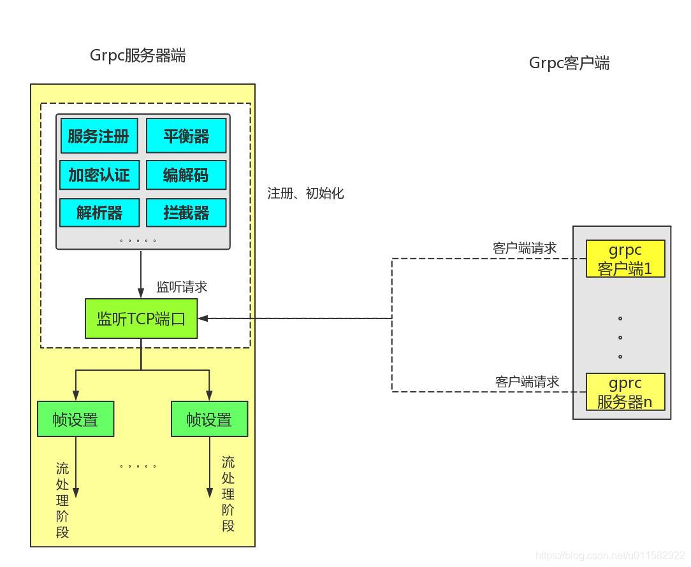
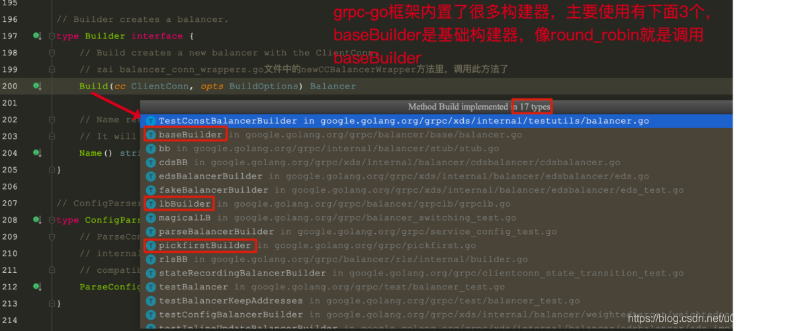
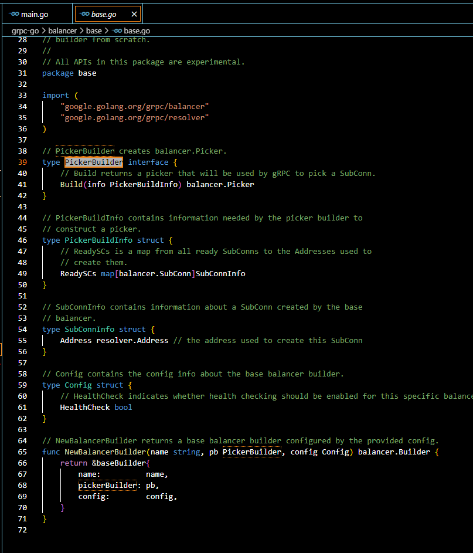

[TOC]


# Server 启动

可以自己先思考一下，假设让我们自己去开发一个简单版本的grpc服务器端启动时都会做什么事情呢?

- 一些初始化工作
- 监听某个端口
- 注册服务端提供的服务
  。。。。。

接下来看一下grpc-go框架服务器端启动时的流程图：



在下面的章节中只是介绍了常用的初始化组件，有些功能需要手动显示的调用，

或者 import 导入才能初始化或者注册，

比方说 grpc-go/encoding/gzip/gzip.go 文件中的 gzip 压缩器需要手动导入，因此就不再一一介绍了。

一个链接请求，对应一个 http2Server 对象，一个帧接收器，一个帧发送器;


## 1、注册、初始化工作

### 1.1、注册服务

通过下面的形式，可以将提供的服务注册到grpc服务器端，以供客户端调用；

这里我们以源码中自带的heloworld为例，将SayHello服务注册到grpc服务器端：

```go
// Package main implements a server for Greeter service.
package main

import (
	"context"
	"flag"
	"fmt"
	"log"
	"net"

	"google.golang.org/grpc"
	pb "google.golang.org/grpc/examples/helloworld/helloworld"
)

var (
	port = flag.Int("port", 50051, "The server port")
)

// server is used to implement helloworld.GreeterServer.
type server struct {
	pb.UnimplementedGreeterServer
}

// SayHello implements helloworld.GreeterServer
func (s *server) SayHello(ctx context.Context, in *pb.HelloRequest) (*pb.HelloReply, error) {
	log.Printf("Received: %v", in.GetName())
	return &pb.HelloReply{Message: "Hello " + in.GetName()}, nil
}

func main() {
	flag.Parse()
	lis, err := net.Listen("tcp", fmt.Sprintf(":%d", *port))
	if err != nil {
		log.Fatalf("failed to listen: %v", err)
	}
	s := grpc.NewServer()
	pb.RegisterGreeterServer(s, &server{})
	log.Printf("server listening at %v", lis.Addr())
	if err := s.Serve(lis); err != nil {
		log.Fatalf("failed to serve: %v", err)
	}
}
```


### 1.2、解析器初始化

在grpc框架里内置了几种解析器，也可以自定义解析器；

像passthrough、dns解析器在grpc服务器启动时会自己注册；

像manual、xds解析器，需要在代码里显示注册才生效；


#### 1.2.1、passthrough解析器(默认使用，启动时自己注册)

```go
func init() {
   resolver.Register(&passthroughBuilder{})
}
```


#### 1.2.2、dns解析器(启动时自己注册)

```go
func init() {
   resolver.Register(NewBuilder())
}
```


#### 1.2.3、Manual解析器(需要手动显示的注册)

```go
func GenerateAndRegisterManualResolver() (*Resolver, func()) {
   scheme := strconv.FormatInt(time.Now().UnixNano(), 36)
   r := NewBuilderWithScheme(scheme)
   resolver.Register(r)
   return r, func() { resolver.UnregisterForTesting(scheme) }
}
```

如果想要使用manual解析器的话，需要手动显示的注册一下，如下参考例子:

```go
func main() {
   flag.Parse()

   //手动注册指定解析器
   r, cleanup := manual.GenerateAndRegisterManualResolver()
   defer cleanup()
   r.InitialState(resolver.State{
      Addresses: []resolver.Address{
         {Addr: "localhost:50051"},
         {Addr: "localhost:50052"},
      },
   })

   address := fmt.Sprintf("%s:///unused", r.Scheme())
```


#### 1.2.4、xds 解析器(需要手动显示的注册)

xds解析器，一般情况下，grpc服务器启动时并没有注册xds解析器，需要手动的注册。

```go
func init() {
   resolver.Register(&xdsResolverBuilder{})
}
```


### 1.3、平衡构建器的注册

平衡构建器的注册是通过…/balancer/balancer.go文件中的Register函数来实现的。

```go
func Register(b Builder) {
   m[strings.ToLower(b.Name())] = b
}
```

注册时，需要传入一个构建器Builder，类型是接口：

```go
// Builder creates a balancer.
type Builder interface {
   // Build creates a new balancer with the ClientConn.
   // 在 balancer_conn_wrappers.go文件中的newCCBalancerWrapper方法里，调用此方法了
   Build(cc ClientConn, opts BuildOptions) Balancer //为客户端连接器ClientConn创建一个平衡器

   // Name returns the name of balancers built by this builder.
   // It will be used to pick balancers (for example in service config).
   Name() string //返还的是平衡器的名称；注册或者根据名称获取指定平衡器时使用的。
}
```

下面图片展示了当前grpc-go框架中内置的平衡构建器：



注意：

平衡构建器是用来创建平衡器的。

平衡器的创建是在客户端跟服务器端进行链接过程中创建的


#### 1.3.1、baseBuilder平衡构建器

在grpc-go/balancer/base/balancer.go文件中定义了baseBuilder平衡构建器。

```go
type baseBuilder struct {
   name          string         //用来设置构建器的名称
   pickerBuilder PickerBuilder  //这是一个picker构建器
   config        Config
}
```

看一下PickerBuilder源码,在grpc-go/balancer/base/base.go文件中:

```go
// PickerBuilder creates balancer.Picker.
type PickerBuilder interface {
   // Build returns a picker that will be used by gRPC to pick a SubConn.
   Build(info PickerBuildInfo) balancer.Picker //创建一个balancer.Picker构建器
}
```

**这个Picker到底是用来做什么呢？**

​		比方说，在某个场景下存在多个服务器端提供服务，客户端同时与这些服务器端建立起了链接，当客户端需要调用服务器端的服务时，需要从这些链接中根据平衡器策略选择一个链接进行服务调用。

（简单的说，就是picker需要从众多链接中选择一个进行帧的接收）

下面图片显示了grpc-go框架中内置实现的PickerBuilder：



baseBuilder构建器是基础构建器，启动时不需要注册；

或者可以认为baseBuilder是一个平衡构建器模板，像下面的round_robin平衡构建器就是以这个模块为基础创建的。


#### 1.3.2、pickFirst平衡构建器注册

在grpc-go/pickfirst.go文件中注册了pickFirst构建器：

```go
func init() {
   balancer.Register(newPickfirstBuilder())
}
```

其中，传入的构建器newPickerfirstBuilder()，代码如下:

```go
// PickFirstBalancerName is the name of the pick_first balancer.
const PickFirstBalancerName = "pick_first"

// 初始化Pickerfirst 构建器
func newPickfirstBuilder() balancer.Builder {
   return &pickfirstBuilder{}
}

type pickfirstBuilder struct{}
```


#### 1.3.3、round_robin平衡器注册

在grpc-go/balancer/roundrobin/roundrobin.go文件中：

```go
// Name is the name of round_robin balancer.
const Name = "round_robin"  //设置平衡器的名称

// newBuilder creates a new roundrobin balancer builder.
//创建round_robin平衡构建器函数，内部调用的是base.NewBalancerBuilder函数
func newBuilder() balancer.Builder {
   return base.NewBalancerBuilder(Name, &rrPickerBuilder{}, base.Config{HealthCheck: true})
}

//将round_robin平衡器构建器注册到grpc服务器里
func init() {
   balancer.Register(newBuilder())
}

//定义一个rrPickerBuilder结构体；
//很明显，前缀rr是round_robin的首字母缩写；
//在grpc-go框架中，有很多类似的情况。
type rrPickerBuilder struct{}
```

接下来，看一下base.NewBalancerBuilder函数内部：

```go
func NewBalancerBuilder(name string, pb PickerBuilder, config Config) balancer.Builder {
    //round_robin构建器内部调用的是baseBuilder构建器
      return &baseBuilder{
      name:          name,
      pickerBuilder: pb,
      config:        config,
   }
}
```

在实现平衡器的过程中最主要的就是要实现PickerBuilder，

如何众多链接中选择一个链接进行客户端跟服务器端的数据交换，也就是设置选择链接的策略。

不同的平衡器选择策略不同，如随机选择，始终选择第一个pickerFirst，或者根据链接的权重进行选择，或者轮询选择策略round_robin。


#### 1.3.4、grpclb平衡器注册

在grpc-go/balancer/grpclb/grpclb.go文件中，进行了初始化:

```go
//注册lb构建器
func init() {
   balancer.Register(newLBBuilder())
   dns.EnableSRVLookups = true
}

//创建lb构建器函数，内部调用的是newLBBuilderWithFallbackTimeout函数
// newLBBuilder creates a builder for grpclb.
func newLBBuilder() balancer.Builder {
      return newLBBuilderWithFallbackTimeout(defaultFallbackTimeout)
}
func newLBBuilderWithFallbackTimeout(fallbackTimeout time.Duration) balancer.Builder {
   return &lbBuilder{
      fallbackTimeout: fallbackTimeout,
   }
}

type lbBuilder struct {
   fallbackTimeout time.Duration
}
```

需要说明的是，grpclb构建器在grpc启动时默认并没有启动，如果想要启动的话，需要显示的导入，如下所示：

在/grpc-go/examples/features/load_balancing/server/main.go测试用例中：

```go
package main

import (
   "context"
   "fmt"
   "github.com/CodisLabs/codis/pkg/utils/log"
   "net"
   "sync"

   "google.golang.org/grpc"

   _ "google.golang.org/grpc/balancer/grpclb"
   pb "servergrpc/examples/features/proto/echo"
)
```

### 1.4、编解码器初始化

grpc-go框架中使用protoc作为默认的编解码器。

在grpc-go/encoding/proto/proto.go文件中：

```go
// Name is the name registered for the proto compressor.
const Name = "proto"

//注册编解码器codec
func init() {
   encoding.RegisterCodec(codec{})
}

// codec is a Codec implementation with protobuf. It is the default codec for gRPC.
type codec struct{}
```

看一下，encoding.RegisterCodec函数内部:

```go
func RegisterCodec(codec Codec) {
   if codec == nil {
      panic("cannot register a nil Codec")
   }
   if codec.Name() == "" {
      panic("cannot register Codec with empty string result for Name()")
   }
   contentSubtype := strings.ToLower(codec.Name())
   registeredCodecs[contentSubtype] = codec //protoc注册到registeredCodecs容器里
}
```

注意： 此函数并非线程安全的，在启动时如果存在多个相同名称的编码器注册的话，会以最后一个注册的编码器有效。


### 1.5、拦截器初始化

拦截器的初始化主要分为两大步骤：

#### 1.5.1、自定义拦截器

例如：在grpc-go/examples/features/interceptor/server/main.go文件中：

```go
func unaryInterceptor(ctx context.Context, req interface{}, info *grpc.UnaryServerInfo, handler grpc.UnaryHandler) (interface{}, error) {
   // authentication (token verification)
   md, ok := metadata.FromIncomingContext(ctx)
   if !ok {
      return nil, errMissingMetadata
   }
   if !valid(md["authorization"]) {
      return nil, errInvalidToken
   }
   m, err := handler(ctx, req)
   if err != nil {
      logger("RPC failed with error %v", err)
   }
   return m, err
}
```


#### 1.5.2、将拦截器注册到服务器端

```go
func main() {
   flag.Parse()

   lis, err := net.Listen("tcp", fmt.Sprintf(":%d", *port))
   if err != nil {
      log.Fatalf("failed to listen: %v", err)
   }

   //将拦截器注册到gprc服务器端
   s := grpc.NewServer(grpc.Creds(creds), grpc.UnaryInterceptor(unaryInterceptor), grpc.StreamInterceptor(streamInterceptor))

   // Register EchoServer on the server.
   pb.RegisterEchoServer(s, &server{})

   if err := s.Serve(lis); err != nil {
      log.Fatalf("failed to serve: %v", err)
   }
}
```

这里仅仅说明一下，grpc-go是如何注册拦截器的，后面的章节将详细的分享拦截器的原理。


## 2、服务器监听工作

### 2.1、grpc服务器是如何监听客户端的请求呢？

例如，在grpc-go/examples/helloworld/greeter_server/main.go文件中:

```go
func main() {
   lis, err := net.Listen("tcp", port)//创建一个监听目标，只监听tcp协议的请求，端口号是port
   if err != nil {
      log.Fatalf("failed to listen: %v", err)
   }
   s := grpc.NewServer()//创建grpc服务器
   pb.RegisterGreeterServer(s, &server{})//将服务注册到grpc服务器里
   if err := s.Serve(lis); err != nil {    //启动grpc服务器对监听目标开始监听
      log.Fatalf("failed to serve: %v", err)
   }
}
```

进入方法Serve里：

在grpc-go/server.go文件里：(只显示了核心代码):

```go
func (s *Server) Serve(lis net.Listener) error {
   s.serve = true //表示grpc服务器端处于运行状态
   // 1、将监听 进行存储，true表示处于监听状态
   ls := &listenSocket{Listener: lis} 
   for {
      rawConn, err := lis.Accept()//阻塞方式监听客户端的请求，如果没有请求时会一直阻塞此处。
    
      //针对新的链接，grpc服务器开启一个协程处理客户端的链接。一个请求链接对应一个协程；
      go func() {
         s.handleRawConn(rawConn)
      }()
   }
}
```


后面的章节再详细的介绍接收到客户端的请求后，grpc服务器端做了哪些事情。

本篇文章主要是分析了grpc服务器端启动后，都做了哪些事情；

这样的话，以后用到哪个组件时，就知道在什么地方进行的初始化，赋值等操作了。


