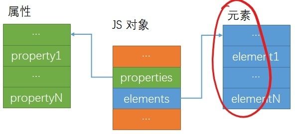
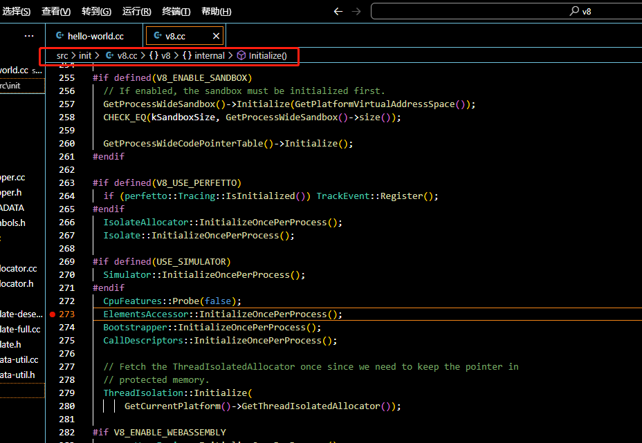
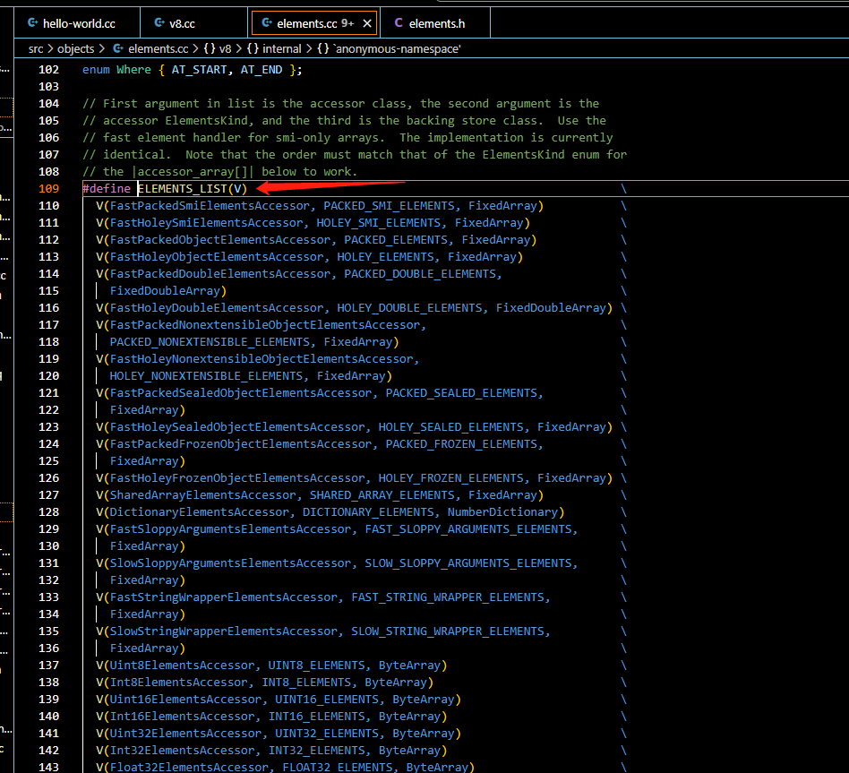
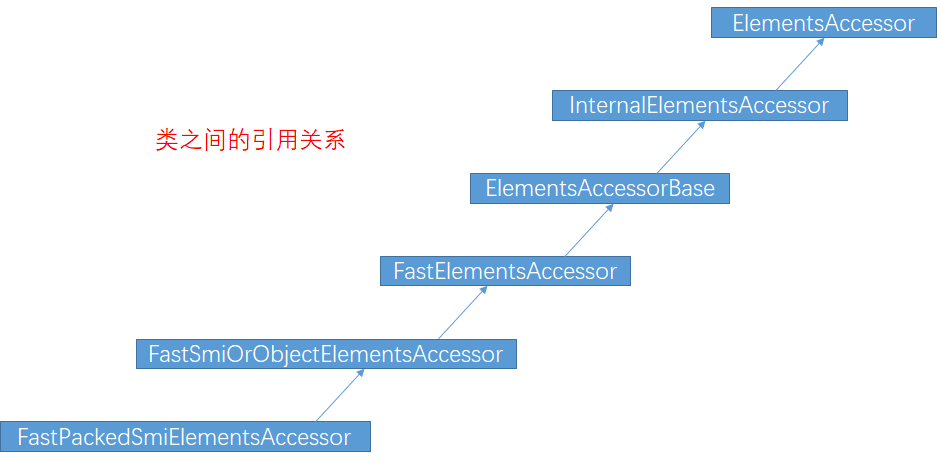
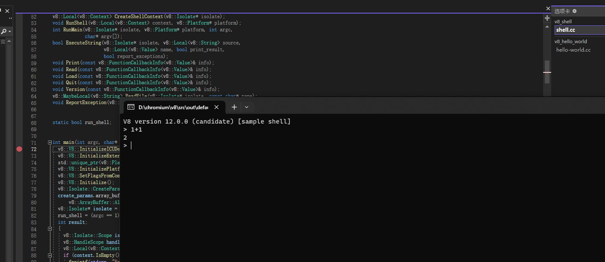
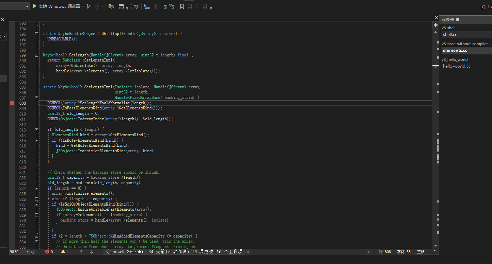
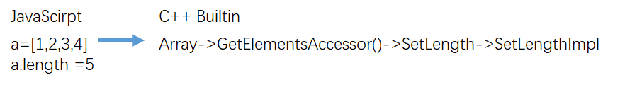

​		V8的启动全过程涉及很多知识，本篇文章的作用为学习V8代码起个头，所以咱们聊聊相对简单的元素(Element)初始化。通过元素的初始化，了解如何跟踪V8代码，以及了解V8的代码风格。

​		先来说什么是元素，Element是什么？先来看一个概念，`{a:”foo”,b:”bar”}`，这个对象有两个名字属性(name properties)，”a” 和 ”b”,它们不能用数组下标索引，有下标索引属性的，通常被称为元素(Element), 例如：[“foo”,”bar”]，0位置是”foo”，1位置是”bar”。这在V8中的处理方式有很大的不同，先通过一张图说明一下javascript 对象在 V8 中的表现形式。



​		从图可以看出，在 V8 中 javascript 对象内部是分开做存储的，name property 和元素分开存储的，也就是图版中红色标记的部分。直接给出在 V8 中定位元素代码和调试跟踪方法，见下图。



从文中的断点单步进入就能跟踪分析。


## 四、元素(ELement)原理及重要数据结构

### 1.主要代码和数据结构

​		Element中的大量方法，例如 pop 或者 slice 方法等，大多都是用来对一段连续的地址空间进行操作的。ElementsAccessor 是操作 Element 的基类，在Element上的每个操作都会对应到 ElmentsAccessor。

```C++
void ElementsAccessor::InitializeOncePerProcess() {
  static ElementsAccessor* accessor_array[] = {
#define ACCESSOR_ARRAY(Class, Kind, Store) new Class(),
     ELEMENTS_LIST(ACCESSOR_ARRAY)//这里初化的宏义
#undef ACCESSOR_ARRAY
  };
  STATIC_ASSERT((sizeof(accessor_array) / sizeof(*accessor_array)) ==
                kElementsKindCount);
  elements_accessors_ = accessor_array;
}
```

​		代码中的ACCESSOR_ARRAY和ELEMENTS_LIST两个宏配合完成初始化，ELEMENTS_LIST中也能看到所有种类的Element，也就是Element kinds，如下图所示。



​		以 FastPackedSmiElemntsAccessor 为例进行分析，这个类从名字可以看出来它是连续存储的 Smi 类型(V8中规定)，连续存储是指数据地址中没有空洞，例如：a =[1,2,3]，这就是 packed(连续) Smi，b = [1,,3],这就是Holey Smi。

​		何为 Smi ? 就是小整数，以 32 位 CPU 为例说明，最低的一位(bit)是表示类型的，如果是 1，则是指针，是 0表示是 Smi。

​		FastPackedSmiElementsAccessor中没有具体实现的功能， 我们直接看他的父类 FastSmiOrObjectElementsAccessor,这里有一些功能的实现，但目前看完这些功能，是没有办法在脑海中构建出一个Element结构来的，现在还为时尚早，因为这里只有Element的初始化，没有讲它是如何使用的，比如：slice方法是如何实现的，这里并没有详细说明，这里主要说明了初始化。接着看 FastElementsAccessor 这个父类，这里定义的功能实现比 FastSmiOrObjectElementsAccessor 中多，方法名中包含 ” Normailize ” 字样的方法非常重要，因为任何一个 Javascript 中关于 Element 的操作方法(比如 slice )的执行过程都与 Normalize 类方法有关，Normalize 是 Element 的操作方法到最终实现之间的必经之路。

NormalizeImpl是Normalize方法的具体实现，再进入下一个父类。

最后给出类型的嵌套关系，如下图。



​		看完这些类中的各种方法，感觉方法之间无法关联起来，这是正常的，因为到目前为止，我们还没有进入方法的调用过程。


### 2.从 element.length 看执行过程

​		到目前为止，我们还只是看 ELement 的初始化过程，如果能让所有的成员动起来，可以提高我们的学习效率，借助debug让代码动起来，如下图。



​		我们调试的是shell.cc，它的位置在 samples\下，我们没有使用 hello world，改为使用shell.cc，只是因为shell的交互性更强，让你看到”动起来”的效果更明显，hello world依旧是最简单的学习方式。



​		如图在 elements.cc 中的 SetLengthImpl 函数中打上断点，并在刚起来的shell中输入

```c++
a=[1,2,3,4]
a.length = 7 //特意改变数组长度，为了能触发断点
```

这样就能触发断点了。


### 3.数据结构Accessors

我们先来看一下这个结构的部分源代码。

```cpp
// Accessors contains all predefined proxy accessors.
class Accessors : public AllStatic {
 public:
#define ACCESSOR_GETTER_DECLARATION(_, accessor_name, AccessorName, ...) \
  static void AccessorName##Getter(                                      \
      v8::Local<v8::Name> name,                                          \
      const v8::PropertyCallbackInfo<v8::Value>& info);
  ACCESSOR_INFO_LIST_GENERATOR(ACCESSOR_GETTER_DECLARATION, /* not used */)
#undef ACCESSOR_GETTER_DECLARATION

#define ACCESSOR_SETTER_DECLARATION(accessor_name)          \
  static void accessor_name(                                \
      v8::Local<v8::Name> name, v8::Local<v8::Value> value, \
      const v8::PropertyCallbackInfo<v8::Boolean>& info);
  ACCESSOR_SETTER_LIST(ACCESSOR_SETTER_DECLARATION)
#undef ACCESSOR_SETTER_DECLARATION
...
省略很多代码... ....
...
```

​		这个Accessors的作用是什么？通过上面的例子来说明：上面定义的 a.length = 5 的执行过程是：需要先找到它的 Accessors，然后才能到具体的 setlength，这正好和 V8 的 ElementsAccessor说明是对应的，如下图。




