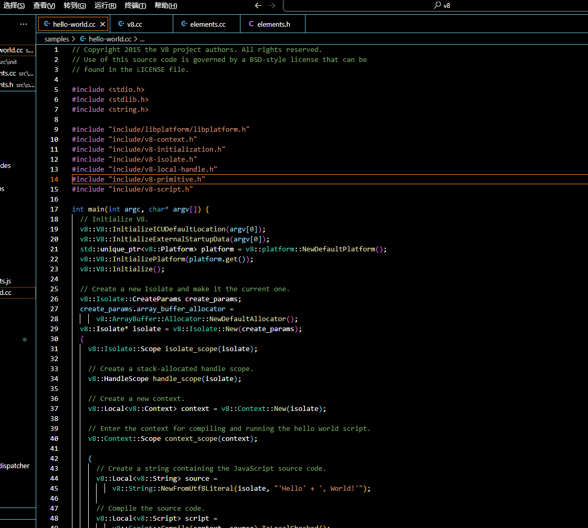
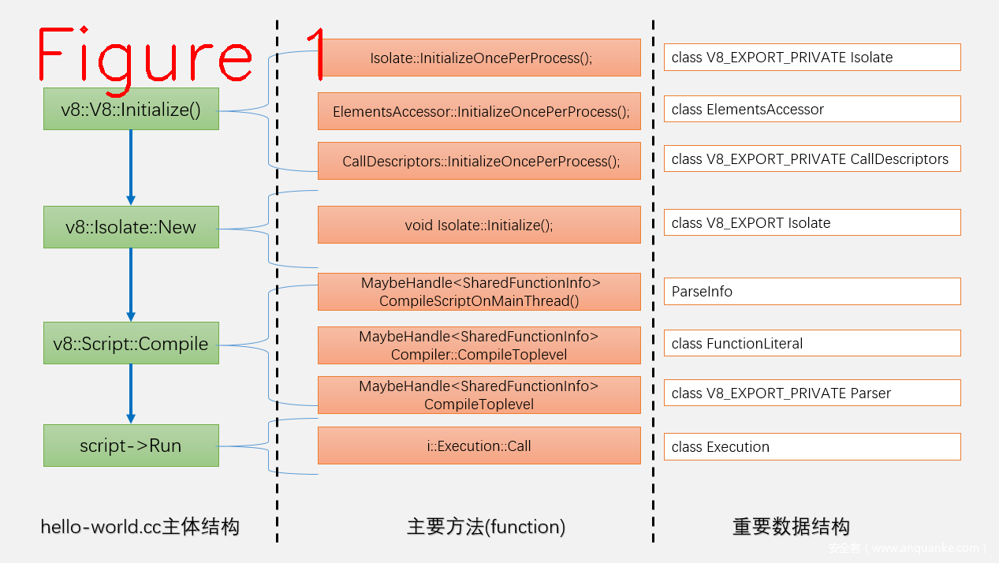

## 1 V8运行过程

​		以 v8\samples\hello-world.cc 为例，这个例子是运行V8功能的最小代码集合，只包含了 V8 的最重要最基本的功能，适合入门。例如，徒增学习难度的优化编译功能，在这个例子中就没出现，优化编译是 V8 最重要的部分，是提升性能的关键，但对初学者并没有用，所以说只有基础功能的 hello-world 最适合入门。



​		上面这段代码是 hello-world.cc 中最重要的部分，V8 的初始化是 **v8::V8::Initialize()**，Isolate的创建**v8::Isolate::New**，编译**v8::Script::Compile**，执行**script->Run**。handle和context没有提及，因为对初学者不重要。

```C++
  // Initialize V8.
  //ICU:处理字符串比较、数字格式化、其他地区等功能库
  v8::V8::InitializeICUDefaultLocation(argv[0]);
  //用于初始化外部的启动数据。V8 的一些部分（如内置的 JavaScript 库和 ICU 数据）可能存储为外部的二进制数据。在初始化 V8 之前，这些数据需要被加载。
  v8::V8::InitializeExternalStartupData(argv[0]);

  //V8 的 "平台" 抽象提供了一个与底层操作系统和环境的接口，
  //它包括了事件循环、线程、任务和其他系统相关的操作。
  std::unique_ptr<v8::Platform> platform = v8::platform::NewDefaultPlatform();
  //将之前创建的平台对象传递给 V8 引擎，这样 V8 就可以使用该平台进行操作了。
  v8::V8::InitializePlatform(platform.get());

  //V8 JavaScript 引擎的核心初始化方法
  v8::V8::Initialize();
```

​		下图说明了每个阶段的重要数据结构，可以利用VS2019的debug跟踪查看详细过程（跟踪方法见上一篇文章）。



​		V8代码量很大，通过重要数据结构和中间结果入手学习，可以很好地抓住V8的主线功能，把主线功能理解透彻之后，再学习旁支功能可达到事半功倍的效果。接下来，以上图中主要方法为主，结合主要数据结构进行单独讲解。


## 2 V8::Initialize

```c++

void V8::Initialize() {
  //更新 V8 的启动状态，标记 V8 正在初始化。
  AdvanceStartupState(V8StartupState::kV8Initializing);
  CHECK(platform_);

  // Update logging information before enforcing flag implications.
  //日志标志的处理
  FlagValue<bool>* log_all_flags[] = {
      &v8_flags.log_all,
      &v8_flags.log_code,
      &v8_flags.log_code_disassemble,
      &v8_flags.log_deopt,
      &v8_flags.log_feedback_vector,
      &v8_flags.log_function_events,
      &v8_flags.log_ic,
      &v8_flags.log_maps,
      &v8_flags.log_source_code,
      &v8_flags.log_source_position,
      &v8_flags.log_timer_events,
      &v8_flags.prof,
      &v8_flags.prof_cpp,
  };
  if (v8_flags.log_all) {
    // Enable all logging flags
    for (auto* flag : log_all_flags) {
      *flag = true;
    }
    v8_flags.log = true;
  } else if (!v8_flags.log) {
    // Enable --log if any log flag is set.
    for (const auto* flag : log_all_flags) {
      if (!*flag) continue;
      v8_flags.log = true;
      break;
    }
    // Profiling flags depend on logging.
    v8_flags.log = v8_flags.log || v8_flags.perf_prof ||
                   v8_flags.perf_basic_prof || v8_flags.ll_prof ||
                   v8_flags.prof || v8_flags.prof_cpp || v8_flags.gdbjit;
  }

  FlagList::EnforceFlagImplications();

  if (v8_flags.predictable && v8_flags.random_seed == 0) {
    // Avoid random seeds in predictable mode.
    v8_flags.random_seed = 12347;
  }

  if (v8_flags.stress_compaction) {
    v8_flags.force_marking_deque_overflows = true;
    v8_flags.gc_global = true;
    v8_flags.max_semi_space_size = 1;
  }

  if (v8_flags.trace_turbo) {
    // Create an empty file shared by the process (e.g. the wasm engine).
    std::ofstream(Isolate::GetTurboCfgFileName(nullptr).c_str(),
                  std::ios_base::trunc);
  }

  // Do not expose wasm in jitless mode.
  //
  // Even in interpreter-only mode, wasm currently still creates executable
  // memory at runtime. Unexpose wasm until this changes.
  // The correctness fuzzers are a special case: many of their test cases are
  // built by fetching a random property from the the global object, and thus
  // the global object layout must not change between configs. That is why we
  // continue exposing wasm on correctness fuzzers even in jitless mode.
  // TODO(jgruber): Remove this once / if wasm can run without executable
  // memory.
#if V8_ENABLE_WEBASSEMBLY
  if (v8_flags.jitless && !v8_flags.correctness_fuzzer_suppressions) {
    DISABLE_FLAG(expose_wasm);
  }
#endif

  // When fuzzing and concurrent compilation is enabled, disable Turbofan
  // tracing flags since reading/printing heap state is not thread-safe and
  // leads to false positives on TSAN bots.
  // TODO(chromium:1205289): Teach relevant fuzzers to not pass TF tracing
  // flags instead, and remove this section.
  if (v8_flags.fuzzing && v8_flags.concurrent_recompilation) {
    DISABLE_FLAG(trace_turbo);
    DISABLE_FLAG(trace_turbo_graph);
    DISABLE_FLAG(trace_turbo_scheduled);
    DISABLE_FLAG(trace_turbo_reduction);
#ifdef V8_ENABLE_SLOW_TRACING
    // If expensive tracing is disabled via a build flag, the following flags
    // cannot be disabled (because they are already).
    DISABLE_FLAG(trace_turbo_trimming);
    DISABLE_FLAG(trace_turbo_jt);
    DISABLE_FLAG(trace_turbo_ceq);
    DISABLE_FLAG(trace_turbo_loop);
    DISABLE_FLAG(trace_turbo_alloc);
    DISABLE_FLAG(trace_all_uses);
    DISABLE_FLAG(trace_representation);
#endif
    DISABLE_FLAG(trace_turbo_stack_accesses);
  }

  // The --jitless and --interpreted-frames-native-stack flags are incompatible
  // since the latter requires code generation while the former prohibits code
  // generation.
  CHECK(!v8_flags.interpreted_frames_native_stack || !v8_flags.jitless);

  //系统的特定初始化
  base::OS::Initialize(v8_flags.hard_abort, v8_flags.gc_fake_mmap);

  //如果设置了随机种子，将其传递给平台的内存分配器和虚拟地址空间。
  if (v8_flags.random_seed) {
    GetPlatformPageAllocator()->SetRandomMmapSeed(v8_flags.random_seed);
    GetPlatformVirtualAddressSpace()->SetRandomSeed(v8_flags.random_seed);
  }

  if (v8_flags.print_flag_values) FlagList::PrintValues();

  // Initialize the default FlagList::Hash.
  FlagList::Hash();

  // Before initializing internals, freeze the flags such that further changes
  // are not allowed. Global initialization of the Isolate or the WasmEngine
  // already reads flags, so they should not be changed afterwards.
  if (v8_flags.freeze_flags_after_init) FlagList::FreezeFlags();

#if defined(V8_ENABLE_SANDBOX)
  // If enabled, the sandbox must be initialized first.
  GetProcessWideSandbox()->Initialize(GetPlatformVirtualAddressSpace());
  CHECK_EQ(kSandboxSize, GetProcessWideSandbox()->size());

  GetProcessWideCodePointerTable()->Initialize();
#endif

  //IsolateAllocator 是负责为 V8 的 Isolate（隔离环境）提供内存的组件。
  //这个函数确保在进程级别为 IsolateAllocator 进行一次性初始化。
  IsolateAllocator::InitializeOncePerProcess();
  //代表了一个 V8 的隔离执行环境。每个 Isolate 都是独立的，并拥有自己的堆、栈和运行时状态。
  //这个函数确保 Isolate 的静态或全局资源在进程级别被初始化一次。
  Isolate::InitializeOncePerProcess();

  //CpuFeatures 是 V8 中用于检测和管理 CPU 功能（例如 SIMD 指令或其他优化）的组件。
  CpuFeatures::Probe(false);
  //ElementsAccessor 提供了对 JavaScript 对象数组元素的访问和操作的方法。
  ElementsAccessor::InitializeOncePerProcess();
  //Bootstrapper 负责 V8 引擎的启动和初始化，包括加载内置的 JavaScript 库。
  Bootstrapper::InitializeOncePerProcess();
  //CallDescriptors 与函数调用的描述和管理相关
  CallDescriptors::InitializeOncePerProcess();

  // Fetch the ThreadIsolatedAllocator once since we need to keep the pointer in
  // protected memory.
  ThreadIsolation::Initialize(
      GetCurrentPlatform()->GetThreadIsolatedAllocator());

#if V8_ENABLE_WEBASSEMBLY
  wasm::WasmEngine::InitializeOncePerProcess();
#endif  // V8_ENABLE_WEBASSEMBLY

  ExternalReferenceTable::InitializeOncePerProcess();

  // 更新 V8 的启动状态，标记 V8 已初始化。
  AdvanceStartupState(V8StartupState::kV8Initialized);
}
```


## 3 V8启动时的内存申请

**InitReservation** 负责为 V8 申请内存，代码位置src\utils\allocation.cc。

旧版代码：

```C++
    // Reserve a region of twice the size so that there is an aligned address
    // within it that's usable as the cage base.
    VirtualMemory padded_reservation(params.page_allocator,
                                   params.reservation_size * 2,
                                   reinterpret_cast<void*>(hint));
    Address address =
              VirtualMemoryCageStart(padded_reservation.address(), params);
    ...省略了很多行代码...
    // Now free the padded reservation and immediately try to reserve an
    // exact region at aligned address. We have to do this dancing because
    // the reservation address requirement is more complex than just a
    // certain alignment and not all operating systems support freeing parts
    // of reserved address space regions.
    padded_reservation.Free();
    VirtualMemory reservation(params.page_allocator,
                              params.reservation_size,
                              reinterpret_cast<void*>(address));
```

​		**<u>申请内存时为了保证内存对齐，它的做法是先申请两倍的内存,然后从中找一个适合做内存对齐的地址，再把两倍内存释放，从刚找到的地址申请需要的4G大小</u>**。具体做法是：padded_reservation 申请一个两倍大小的内存（8G）,再利用padded_reservation.Free()释放，再用reservation申请的4G内存则是V8真正的内存。下面讲解V8管理内存的主要数据结构：**VirtualMemoryCage**。V8向操作系统申请4G内存，用于后续的所有工作，例如创新Isolate，等等。V8的内存方式采用的段页式，和操作系统（OS）的方法类似，但不像OS有多个段，V8只有一个段，但有很多页。

新版代码：

```cpp

bool VirtualMemoryCage::InitReservation(
    //...
    Address hint = params.requested_start_hint;
    // Require the hint to be properly aligned because here it's not clear
    // anymore whether it should be rounded up or down.
    CHECK(IsAligned(hint, params.base_alignment));
    VirtualMemory reservation(params.page_allocator, params.reservation_size,
                              reinterpret_cast<void*>(hint),
                              params.base_alignment, params.jit);
    //...
```

新版本为直接申请4G大小内存。

<u>它会检查提供的 `hint` 地址是否与所需的 `base_alignment` 对齐，然后使用 `VirtualMemory` 类来直接进行预留。这意味着，只要你提供正确的 `hint` 和 `base_alignment`，V8 就可以确保得到满足对齐需求的地址，而不需要任何额外的预留和释放步骤。</u>

**VirtualMemeoryCage**的定义在allocation.h中，我们对它的结构进行说明。

```cpp
// +-----------+------------ ~~~ --+- ~~~ -+
// |    ...    |   ...             |  ...  |
// +-----------+------------ ~~~ --+- ~~~ -+
// ^           ^
// cage base   allocatable base
//
//             <------------------->
//               allocatable size
// <------------------------------->
//              cage size
// <--------------------------------------->
//            reservation size
```

​		“a VirtualMemory reservation” 是 V8 源码中的叫法，reservation size 是4G，也就是 v8 申请内存的总大小，cage base 是这个内存的基址，可以先理解为cage base是页表位置，allocatable开始是v8可以分配的，用于创新 isolate。VirtualMemoryCage 中的成员 reservation_ 负责指向这个4G内存。另一个重要的结构是ReservationParams , 申请内存大小(4G), 对齐方式，指针压缩等参数都在这个结构中定义。


## 3 Isolate

​		**<u>Isolate 是一个完整的 V8 实例，有着完整的堆栈和 Heap。V8 是虚拟机，isolate 才是运行 javascript 的宿主。一个 Isolate 是一个独立的运行环境, 包括但不限于堆管理器(heap)、垃圾回收器（gc）等</u>**。<u>在一个时间，有且只有一个线程能在 isolate 中运行代码，也就是说同一时刻，只有一个线程能进入 isolate ,多个线程可以通过切换来共享同一个isolate。</u>

```C++
/**
 * Isolate represents an isolated instance of the V8 engine.  V8 isolates have
 * completely separate states.  Objects from one isolate must not be used in
 * other isolates.  The embedder can create multiple isolates and use them in
 * parallel in multiple threads.  An isolate can be entered by at most one
 * thread at any given time.  The Locker/Unlocker API must be used to
 * synchronize.
 */
class V8_EXPORT Isolate {
 public:
  /**
   * Initial configuration parameters for a new Isolate.
   */
  struct V8_EXPORT CreateParams {
    CreateParams();
    ~CreateParams();

    /**
     * Allows the host application to provide the address of a function that is
     * notified each time code is added, moved or removed.
     */
    JitCodeEventHandler code_event_handler = nullptr;

    /**
     * ResourceConstraints to use for the new Isolate.
     */
    ResourceConstraints constraints;

    /**
     * Explicitly specify a startup snapshot blob. The embedder owns the blob.
     */
    StartupData* snapshot_blob = nullptr;

    /**
     * Enables the host application to provide a mechanism for recording
     * statistics counters.
     */
    CounterLookupCallback counter_lookup_callback = nullptr;
//.....
//省略多行
//.....
```

​		上面这段代码是isolate对外(export)提供的接口，方便其它程序的使用。 这个isolate可以理解为javascript的运行单元，多个线程也就是多个任务可以共享一个运行单元，这种共享类似操作系统中的调度机制，涉及到几个重要的概念：任务切换（亦称任务调度）、中断、上下文(context)的切换方法，由此我们引出 V8 中几个重要的概念。
**a.Context：上下文，所有的 JS 代码都是在某个 V8 Context 中运行的。**
**b.Handle，一个指定 JS 对象的索引，它指向此 JS 对象在 V8 堆中的位置。**
**c.Handle Scope，包含很多 handle 的集合，用于对多个 handle 进行统一管理,当 Scope 被移出堆时，它所管理的 handle 集合也就被释放了。**
其它的重要概念，本文不涉及，暂不深究。
​		Isolate 还有一个对内的 isolate 数据结构,代码如下。它可以与对外接口进行无差别转换，在转换过程中，数据不会丢失。

```C++
class V8_EXPORT_PRIVATE Isolate final : private HiddenFactory {
  // These forward declarations are required to make the friend declarations in
  // PerIsolateThreadData work on some older versions of gcc.
  class ThreadDataTable;
  class EntryStackItem;

 public:
  Isolate(const Isolate&) = delete;
  Isolate& operator=(const Isolate&) = delete;

  using HandleScopeType = HandleScope;
  void* operator new(size_t) = delete;
  void operator delete(void*) = delete;

  // A thread has a PerIsolateThreadData instance for each isolate that it has
  // entered. That instance is allocated when the isolate is initially entered
  // and reused on subsequent entries.
  class PerIsolateThreadData {
   public:
    PerIsolateThreadData(Isolate* isolate, ThreadId thread_id)
        : isolate_(isolate),
          thread_id_(thread_id),
          stack_limit_(0),
          thread_state_(nullptr)
//省略很多代码...
```

​		这个 isolate 是 V8 内部使用的，不对外开放。这个结构贯穿了 V8 虚拟机的始终，是我们必须要掌握的，从入门的角度来讲，这个结构不是我们最先需要掌握的，我们只需要知道它，用到相关的成员再来查找，下文讲解的几个重要结构，其实都是 i::isolate 的成员。


## 3 编译

​		编译涉及到的概念包括：

​			词法分析，用来生成 token 字；

​			语法分析(parse)，最后生成抽象语法树（AST）。

​		下面介绍重要的数据结构

```C++
// A container for the inputs, configuration options, and outputs of parsing.
class V8_EXPORT_PRIVATE ParseInfo {
 public:
  ParseInfo(Isolate* isolate, const UnoptimizedCompileFlags flags,
            UnoptimizedCompileState* state);

  // Creates a new parse info based on parent top-level |outer_parse_info| for
  // function |literal|.
  static std::unique_ptr<ParseInfo> ForToplevelFunction(
      const UnoptimizedCompileFlags flags,
      UnoptimizedCompileState* compile_state, const FunctionLiteral* literal,
      const AstRawString* function_name);

  ~ParseInfo();

  template <typename IsolateT>
  EXPORT_TEMPLATE_DECLARE(V8_EXPORT_PRIVATE)
  Handle<Script> CreateScript(IsolateT* isolate, Handle<String> source,
                              MaybeHandle<FixedArray> maybe_wrapped_arguments,
                              ScriptOriginOptions origin_options,
                              NativesFlag natives = NOT_NATIVES_CODE);

  // Either returns the ast-value-factory associcated with this ParseInfo, or
  // creates and returns a new factory if none exists.
  AstValueFactory* GetOrCreateAstValueFactory();
```

​		这个结构的作用是接收 javascript 源码（U16格式），输出就是AST，在它输出 AST 过程中，会临时生成Token，AST 生成后销毁，不做永久保存，生成 token 过程中还用到了缓存(cache)机制来提高效率。下面先来看一段 JS 的 AST 语法树，如图2。


上图左侧是 js 源码，右侧是通过VS2019的调试工具看到的AST树，借助 d8 工具也能打印 AST 树，如下图所示，一屏显示不全，只截取了部分。


下面是AST树的主要数据结构。

```c++
class FunctionLiteral final : public Expression {
 public:
  enum ParameterFlag : uint8_t {
    kNoDuplicateParameters,
    kHasDuplicateParameters
  };
  enum EagerCompileHint : uint8_t { kShouldEagerCompile, kShouldLazyCompile };

  // Empty handle means that the function does not have a shared name (i.e.
  // the name will be set dynamically after creation of the function closure).
  template <typename IsolateT>
  MaybeHandle<String> GetName(IsolateT* isolate) const {
    return raw_name_ ? raw_name_->AllocateFlat(isolate) : MaybeHandle<String>();
  }
  bool has_shared_name() const { return raw_name_ != nullptr; }
  const AstConsString* raw_name() const { return raw_name_; }
  void set_raw_name(const AstConsString* name) { raw_name_ = name; }
  DeclarationScope* scope() const { return scope_; }
  ZonePtrList<Statement>* body() { return &body_; }
  void set_function_token_position(int pos) { function_token_position_ = pos; }
  int function_token_position() const { return function_token_position_; }
  int start_position() const;
  int end_position() const;
  bool is_anonymous_expression() const {
    return syntax_kind() == FunctionSyntaxKind::kAnonymousExpression;
  }
  //省略很多代码... ...
```

​		**Abstract Syntax Tree抽象语法树（AST）是精简版的解析树(parse tree)，在编译过程中，解析树是包含 javascript 源码所有语法信息的树型表示结构，它是代码在编译阶段的等价表示。抽象语法树概念是相对于解析树而言，对解析树进行裁剪，去掉一些语法信息和一些不重要的细节，所以叫抽象语法树。**
​		V8 编译的第一个阶段是扫描(scanner) js 源代码文本，把文本拆成一些单词,再传入分词器，经过一系列的类型识别，根据词的类型识别单词的含义，进而产生 token 序列，单词识别过程有一个预先定义好的识别器类型模板，如下图。


上图中只截取了部分，可根据文件名自行查阅。


## 4 代码执行

图5中给出来了执行 Javascript 代码的关键位置，从此处debug跟踪，将最终进入字节码(bytecode)的执行过程。


下面来看 Exectuion 这个数据结构，这个结构承载着运行过程前后的相关信息。

```c++
  class Execution final : public AllStatic {
 public:
  // Whether to report pending messages, or keep them pending on the isolate.
  enum class MessageHandling { kReport, kKeepPending };
  enum class Target { kCallable, kRunMicrotasks };

  // Call a function, the caller supplies a receiver and an array
  // of arguments.
  //
  // When the function called is not in strict mode, receiver is
  // converted to an object.
  //
  V8_EXPORT_PRIVATE V8_WARN_UNUSED_RESULT static MaybeHandle<Object> Call(
      Isolate* isolate, Handle<Object> callable, Handle<Object> receiver,
      int argc, Handle<Object> argv[]);
  //省略很多
```

​		从图5中标记的位置跟踪进入能看到执行的细节，目前我们还没提到 AST 如何生成字节码，但已基本梳理了 v8 从启动到运行的关建过程，和关键的数据结构。我们已经能看到 Javascript 源码对应的 AST 树是什么样子，它在执行期时的字节码又是什么样。


