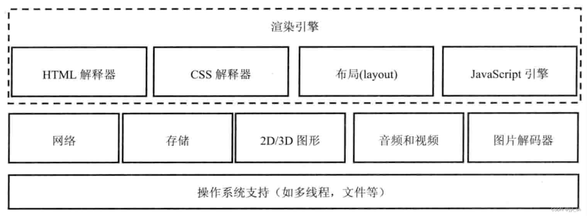
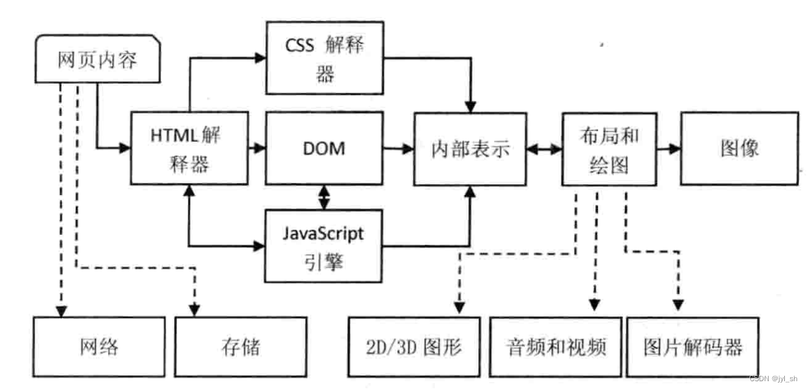

### 浏览器内核

内核主要分为三个层次，最上层为渲染引擎。

浏览器渲染引擎功能模块：

- HTML 解释器：解释 HTML 文本，将 HTML 文本解释成 DOM 树。
- CSS 解释器：级联样式表的解释器，为 DOM 中的各个元素对象计算出样式信息。
- 布局：DOM 创建之后，WebKit 需要将其中的元素对象同样式信息结合起来，计算它们的大小位置等布局信息，形成一个能够表示这所有信息的内部表示模型。
- JavaScript 引擎：JavaScript 引擎能够解释 JavaScript 代码并通过 DOM 接口和 CSSOM 接口来修改网页内容和样式信息，改变渲染结果。
- 绘图：使用图形库将布局计算后的各个网页的节点绘制成图像结果。

### 渲染引擎的一般渲染过程

​		实线表示先后关系，虚线表示在渲染过程中每个阶段可能使用到的其他模块

​		中间层为基础模块，这层包括网络、存储、2D/3D图形、音频视频和图片解码器等。实际上，渲染引擎还应该包括如何使用这些依赖模块的部分，这部分的工作其实并不少，因为需要使用设计出合适的框架使用它们来高效的渲染网页。

​		最下层为操作系统的支持层，如线程支持和文件支持等。

 		首先是网页内容，输入到 HTML 解释器，HTML 解释器在解释它后构建成一颗 DOM 树，这期间如果遇到 JavaScript 代码则交给JavaScript 引擎去处理，如果网页中包含 CSS，则交给 CSS 解释器去解释。当 DOM 树建立的时候，渲染引擎接收来自 CSS 解释器的样式信息，构建一个新的内部绘图模型。该模型由布局模块计算模型内部各个元素的位置和大小信息，最后由绘图模块完成从该模型到图像的绘制。

​		图中虚线箭头的指向表示在渲染过程中，每个阶段可能使用到其他模块，在网页内容的下载中，需要使用到网路和存储；在计算布局和绘图的时候，需要使用2D/3D的图形模块，同时因为要生成最后的可视化结果，这时需要开始解码音频、视频和图片，同其他内容一起绘制到最后的图像中。

​		在渲染完成之后，用户可能需要跟渲染的结果进行交互，或者网页自身有动画操作，一般而言，这需要持续的重复渲染过程。

