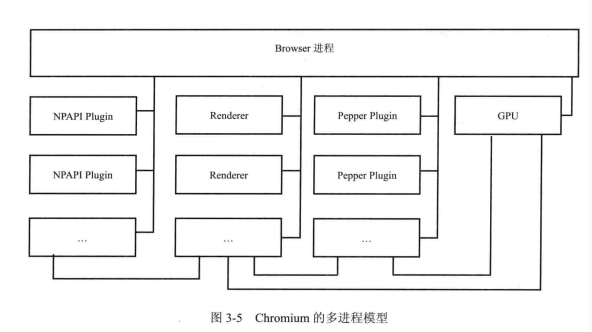
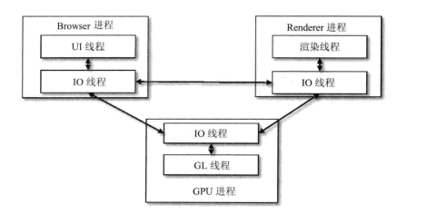
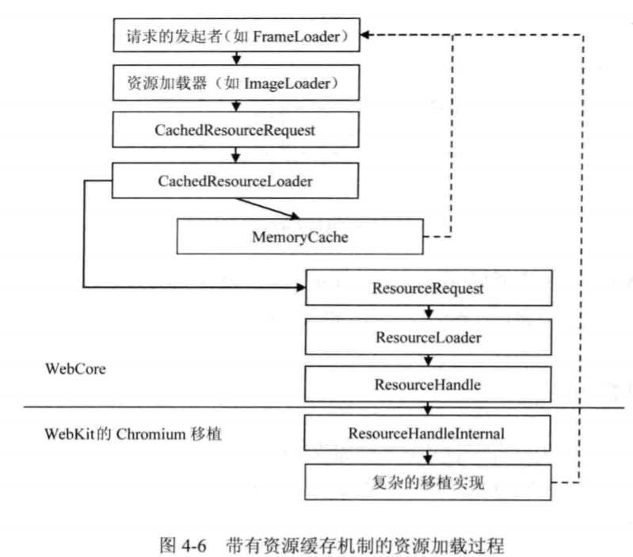
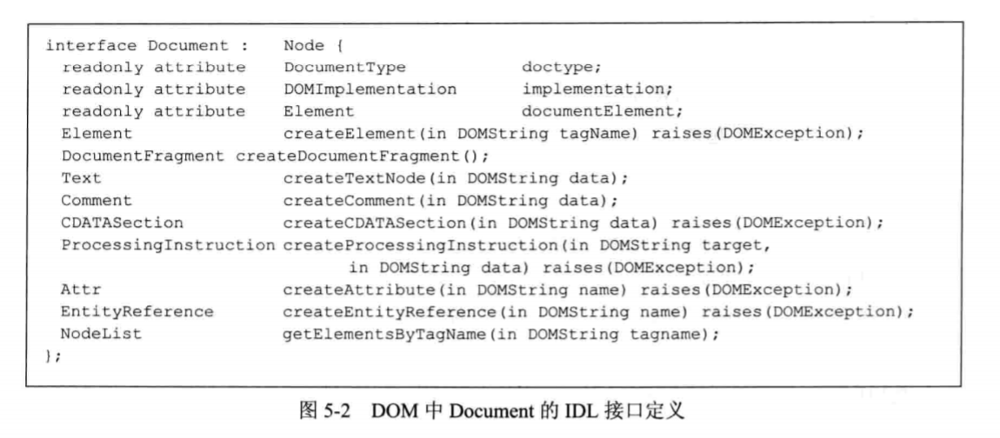
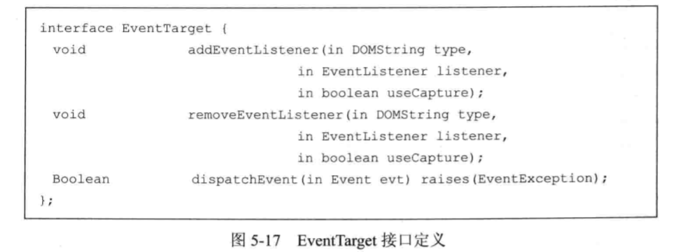

### 浏览器内核

内核主要分为三个层次，最上层为渲染引擎。

浏览器渲染引擎功能模块：

- HTML 解释器：解释 HTML 文本，将 HTML 文本解释成 DOM 树。
- CSS 解释器：级联样式表的解释器，为 DOM 中的各个元素对象计算出样式信息。
- 布局：DOM 创建之后，WebKit 需要将其中的元素对象同样式信息结合起来，计算它们的大小位置等布局信息，形成一个能够表示这所有信息的内部表示模型。
- JavaScript 引擎：JavaScript 引擎能够解释 JavaScript 代码并通过 DOM 接口和 CSSOM 接口来修改网页内容和样式信息，改变渲染结果。
- 绘图：使用图形库将布局计算后的各个网页的节点绘制成图像结果。

### 渲染引擎的一般渲染过程

​		实线表示先后关系，虚线表示在渲染过程中每个阶段可能使用到的其他模块

​		中间层为基础模块，这层包括网络、存储、2D/3D图形、音频视频和图片解码器等。实际上，渲染引擎还应该包括如何使用这些依赖模块的部分，这部分的工作其实并不少，因为需要使用设计出合适的框架使用它们来高效的渲染网页。

​		最下层为操作系统的支持层，如线程支持和文件支持等。

 		首先是网页内容，输入到 HTML 解释器，HTML 解释器在解释它后构建成一颗 DOM 树，这期间如果遇到 JavaScript 代码则交给JavaScript 引擎去处理，如果网页中包含 CSS，则交给 CSS 解释器去解释。当 DOM 树建立的时候，渲染引擎接收来自 CSS 解释器的样式信息，构建一个新的内部绘图模型。该模型由布局模块计算模型内部各个元素的位置和大小信息，最后由绘图模块完成从该模型到图像的绘制。

​		图中虚线箭头的指向表示在渲染过程中，每个阶段可能使用到其他模块，在网页内容的下载中，需要使用到网路和存储；在计算布局和绘图的时候，需要使用2D/3D的图形模块，同时因为要生成最后的可视化结果，这时需要开始解码音频、视频和图片，同其他内容一起绘制到最后的图像中。

​		在渲染完成之后，用户可能需要跟渲染的结果进行交互，或者网页自身有动画操作，一般而言，这需要持续的重复渲染过程。

webKit 的渲染过程大致可分成三大阶段（三阶段后面又细分具体过程）：

1. 从 URL 到构建完 DOM 树

   - 用户输入网页 URL 时，webKit 调用资源加载器加载对应资源
   - 加载器依赖网络模块建立连接，发送请求
   - 收到的网页被 HTML 解释器转变成 DOM 树
   - 如果遇到 JavaScript 代码，调用 js 引擎解释执行
   - DOM 树构建完触发 DOMContent 事件，DOM 树构建完成及网页依赖资源都加载完成后触发 onload 事件。

2. 从 DOM 树构建完 webKit 的绘图上下文

   

   - css 文件被解释成内部结构，附加在 DOM 树形成 renderObject 渲染树。
   - 渲染树创建，webKit 同时会构建 renderLayer 层次树和一个虚拟的绘图上下文。

3. 从绘图上下文到生成图像

   

   - 绘图实现类结合图像库将绘制的结果返回给浏览器

webKit 整体架构如下图：

而 webKit2 则是在 webKit 基础上一组支持新架构的接口层。该接口与网页渲染工作代码不在同一个进程，实现了 chromium 多进程的优点。webKit2 接口使用不需要接触背后的多进程机制。

如上图，网页渲染在 web 进程与 webKit2 所在的 UI 进程不是同一进程。

- #### chromium

​        chromium 浏览器使用的也是基于 webKit 的 Blink 引擎，它相当于 chrome 的创新版，一些新技术都会先在 chromium 上实验。在 chromium，webKit 只是它的一部分。其中 content 模块和接口是对 chromium 渲染网页功能的抽象，**它在 webKit 的上层渲染网页**，以便可以使用沙箱模型和跨进程 GPU 等机制。相当于封装内层，提供 content 接口层让人调用。

- #### 多进程模型

多进程模型的优势：

1. 避免单个页面的崩溃而影响浏览器的稳定性。
2. 避免第三方插件崩溃影响浏览器的稳定性。
3. 方便安全模型的实施。

上图是 chromium 的多进程模型，其中连线代表 IPC 进程间通信，chromium 浏览器主要进程类型有：

1. Browser 进程
   - 浏览器的主进程，负责页面的显示和各页面的管理，是所有其他类型线程的祖先，负责它们的创建与销毁，有且仅有一个。
2. Renderer 进程
   - 网页的渲染线程，可能有多个，不一定和网页数量相同
3. NPAPI 插件进程
   - 进程为创建 NPAPI 类型的插件创建，每种类型插件只会创建一次，插件进程共享
4. GPU 进程
   - 最多只有一个，GPU 硬件加速时才创建
5. Pepper 插件进程
   - 同 NPAP I插件进程 ，为创建 Pepper 类型的插件创建。
6. 其他类型进程
   - 分场景使用，例如 Linux 的 ”Zygote“ 进程，”Sandbox“ 准备进程。

**多进程模型下网页的渲染：**

1. Browser 进程收到请求，由 UI 线程处理，将对应任务转给 I/O 线程，再传递给 Render 进程
2. Render 进程的 IO 线程处理后交给渲染线程渲染，最后 render 进程将结果由IO 线程传递给 Browser 进程
3. Browser 进程收到结果并绘制出来。

**Renderer创建方式**

Chromium 允许用户配置 Renderer 进程的创建方式，有以下四种方式：

- Process-per-site-instance：每个页面都创建一个独立的渲染线程
- Process-per-site：同一个域的页面共享同一线程
- Process-per-tab（Chromium默认）：每个标签页都创建一个独立的渲染线程
- Single process：不为页面创建任何独立线程，渲染在Browser进程进行。**主要在Android WebView使用。**

下图为 WebKit 由内到外的交互：

- #### webKit2 与 chromium 的区别

  首先，两者都是多进程架构的模型，两者的根本目的都要实现 UI 和渲染的分离，区别在于设计理念：

1. Chromium 从浏览器角度出发，使用的仍是 webKit 接口，在 webKit 上构建多进程架构实现，成本低，对移动资源消耗大。
2. webKit2 定位为渲染引擎，尽量将多进程架构隐藏，只暴露相应接口，但实现代价高。

## 网页加载与渲染

- #### webKit资源加载机制

1. **资源缓存**

   当 webKit 请求资源时，先从资源池查找是否存在相应的资源（通过URL，不同的 URL 被认为不同的资源。），如果有，直接取出使用，否则创建一个新的 CachedResource 子类的对象并真正发送请求给服务器，当 webKit 收到资源后将其设置到该资源类的对象中去，以便内存缓存后下次使用。

2. **资源加载器**

   webKit 共有三种类型的加载器：

   - 针对每种资源类型的特定加载器，仅加载某一种资源：例如 ImageLoader
   - 资源缓存机制的资源加载器，所有的特定加载器都可以共享它所查找出来的缓存资源 --CacheResourceLoader 类。
   - 通用的资源加载器 --resourceLoader 类，webKit 使用该类只负责获取资源的数据，属于 CachedResource 类，但不是继承CacheResourceLoader 类。

   

通常资源的加载是异步执行的，这样不会阻碍 WebKit 的渲染过程。webKit 能够并发下载资源以及下载 JavaScript 代码。

- #### DOM树

DOM 结构的基本要素就是“节点”，整个文档（Document）也是一个节点，称文档节点。除了文档节点还有元素节点，属性节点，注释节点等等。

Document 继承 Node，具有一些属性和方法。

- ####  HTML 解释器

HTML 解释器的工作就是讲网页资源由字节流解释成 DOM 树结构。

大体概括为：

1. 词法分析，解释器检查网页编码格式，通过 HTMLTokenizer 类将字节流转化为一个个词语。
2. XSSAuditor 验证词语，过滤不安全内容。
3. 词语到节点，调用 HTMLTreeBuilder 类来创建
4. 节点到 DOM 树，调用 HTMLConstructionSite 类来完成

- #### 事件机制

​       事件在工作分为两主体，一是事件，二是事件目标。Node 节点继承EventTarget 类。下图接口用来注册和移除监听。

​		当渲染引擎收到事件，它会检查哪个元素是直接的事件目标，事件会经过自顶向下捕获和自底向上冒泡的两个过程。

- #### RenderObject树

  在 DOM 树构建完成后，webKit 要为 DOM 树节点构建 RenderObject 树，一个 RenderObject 对应绘制 DOM 节点所需要的各种信息。那么问题来了，DOM树哪些节点需要创建 RenderObject 呢？大概有以下三类：

  1. document 节点
  2. 可视节点，如 body，div 。(ps: 不可视节点比如 head script 等)
  3. 匿名的 RenderObject 不对应任何 DOM，例如 RenderBlock

- #### webKit布局

当 webKit 创建 RenderObject 对象后，根据框模型计算各对象的位置，大小等信息的过程称为布局计算。

Frame 类用于表示网页的框结构，每个框都有一个 frameView 类表示框的视图结构。其中 layout 和 needslayout 用来计算布局和是否需要重新布局。布局计算先递归子女节点的位置和大小，最后得出自己节点布局。当可视区域发生变化后，webKit 都需要重新计算布局。

- #### 渲染方式

网页渲染的方式主要有三种：

1. 软件渲染：CPU完成，处理2D方面的操作，适合简单网页

   RenderObject 图像的绘制又分为以下三阶段：

   - 绘制层中背景和边框
   - 绘制浮动内容
   - 绘制前景，即内容部分等

2. 硬件加速渲染：GPU完成，适合3D绘图，但消耗内存资源

3. 混合渲染：既有CPU也有GPU

CPU绘制使用缓存机制可以减少重绘开销，每个renderLayer对象对应图像的一个图层，浏览器把所有图层合成图像就叫做合成化渲染。

