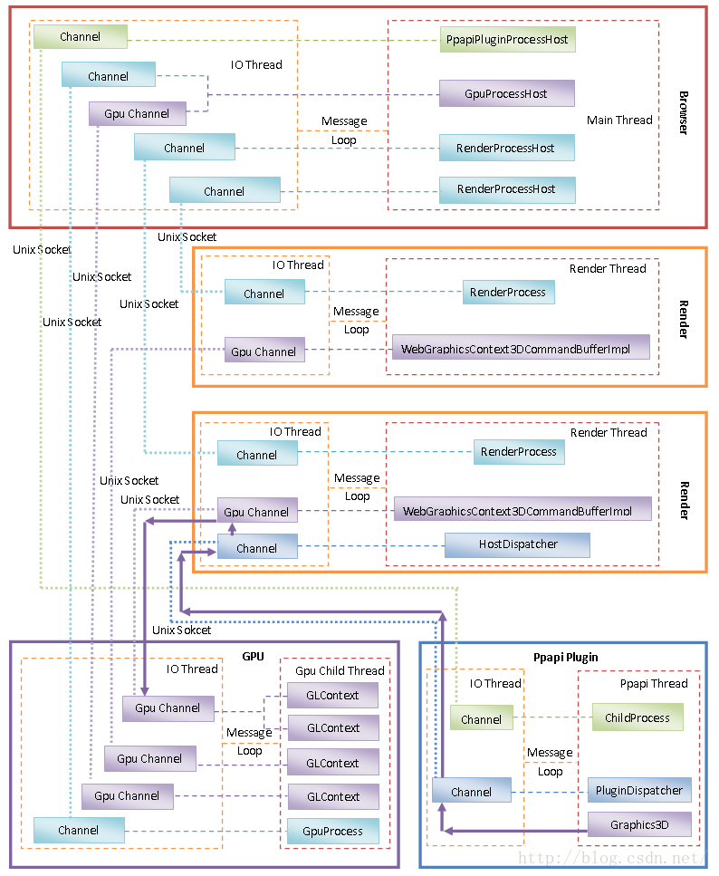

# Chromium 多进程架构简要介绍和学习计划

​		Chromium以多进程架构著称，它主要包含四类进程，分别是**Browser进程**、**Render进程**、**GPU进程**和**Plugin进程**。之所以要将Render进程、GPU进程和Plugin进程独立出来，是为了解决它们的不稳定性问题。也就是说，Render进程、GPU进程和Plugin进程由于不稳定而引发的 Crash 不会导致整个浏览器崩溃。本文就对Chromium 的多进程架构进行简要介绍，以及制定学习计划。

​		<u>一个 Chromium 实例只有一个 Browser 进程和一个 GPU 进程，但是 Render 进程和 Plugin 进程可能有若干个</u>。

- Browser 进程负责合成浏览器的 UI，包括标题栏、地址栏、工具栏以及各个 TAB 的网页内容。
- Render 进程负责解析和渲染网页的内容。一般来说，一个 TAB 就对应有一个 Render 进程。但是我们也可以设置启动参数，让具有相同的域名的 TAB 都运行在同一个 Render 进程中。简单起见，我们就假设一个 TAB就对应有一个 Render 进程。**<u>无论是 Browser 进程，还是 Render 进程，当启用了硬件加速渲染时，它们都是通过 GPU 进程来渲染 UI 的。</u>**不过 Render 进程是将网页内容渲染在一个离屏窗口的，例如渲染在一个Frame  Buffer Object 上，而 Browser 进程是直接将 UI 渲染在 Frame Buffer 上，也就是屏幕上。正因为如此，**Render 进程渲染好的网页 UI 要经过 Browser 进程合成之后，才能在屏幕上看到。**
- Plugin 进程，就是用来运行第三方开发的 Plugin，以便可以扩展浏览器的功能。例如，Flash 就是一个Plugin，它运行在独立的 Plugin 进程中。注意，为了避免创建过多的 Plugin 进程，同一个 Plugin 的不同实例都是运行在同一个 Plugin 进程中的。也就是说，不管是在同一个 TAB 的网页创建的同类 Plugin ，还是在不同 TAB 的网页创建的同类 Plugin ，它们都是运行在同一个 Plugin 进程中。

​        从上面的分析就可以知道，虽然每一个进程的职责不同，但是它们不是相互孤立的，而是需要相同协作，这样就需要执行**进程间通信（IPC）**。

​		例如，Render 进程渲染好自己负责解析的网页之后，需要通知 GPU 进程离屏渲染已经解决好的网页的 UI，接着还要通知 Browser 进程合成已经离屏渲染好的网页 UI。同样，Browser 进程也需要通过 GPU 进程合成标题栏、地址栏、工具栏和各个网页的离屏 UI。对于 Plugin 进程，Render 进程需要将一些网页的事件发送给它处理，这样 Render 进程就需要与 Plugin 进程进行通信。反过来，Plugin 进程也需要通过 SDK 接口向 Render 进程请求一些网页相关的信息，以便可以扩展网页的内容。更进一步地，如果 Plugin 进程需要绘制自己的UI，那么它也需要通过 Render 进程间接地和 GPU 进程进行通信。 

​		以上分析的Browser进程、Render进程、GPU进程和Plugin进程，以及它们之间的通信方式，可以通过图片描述，如下所示：

​		从上图可以看到，每一个进程除了具有一个用来实现各自职责的主线程之外，都具有一个 IO 线程。**这个 IO 线程不是用来执行读写磁盘文件之类的 IO 的，而是用来负责执行 IPC 的**。它们之所以称为 IO 线程，是因为它们操作的对象是一个文件描述符。即然操作的对象是文件描述符，当然也可以称之类 IO。当然，这些是特殊的 IO，具体来说，就是一个UNIX  Socket。UNIX Socket 是用来执行本地 IPC 的，它的概念与管道是类似的。只不过管道的通信是单向的，一端只能读，另一端只能写，而 UNIX Socket 的通信是双向的，每一端都既可读也可写。

