[TOC]

## 内核特征

- 渲染引擎的功能主要包括：**HTML解释器**、**CSS解释器**、**布局（lay out）**、**JS引擎**。
  - HTML解释器：将 HTML 文 本解释成 DOM.
  - CSS解释器：为 DOM 各个元素计算出样式信息，为布局提供基础设施。
  - 布局：将 DOM 元素对象和样式信息结合，计算大小位置等布局信息，形成一个内部表示模型。
  - JS引擎：js 可以修改网页内容，JS 引擎解析 js 并通过 DOM 接口和 CSSOM 接口修改网页内容和样式信息，从而改变渲染结果。
  - 绘图：使用图形库，将布局计算后的网页节点绘制成图像结果。
- 渲染引擎依赖了：网络、存储、2D/3D图形、音频和视频、图片解码器。
  同样一起依赖了OS的支持（如线程、文件等）。

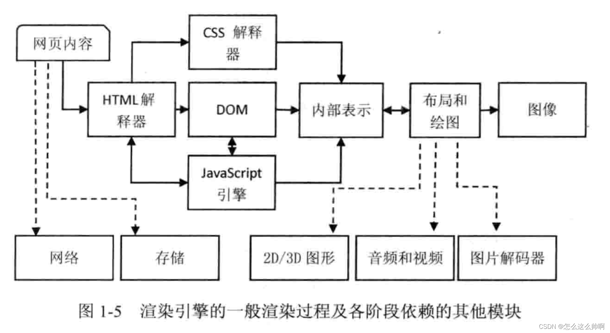

### HTML 网页和结构

#### 网页构成与结构

- html 是一种半结构化数据表现方式，结构特征有：树状、层次、框结构。
  - js代码用于控制网页内部逻辑。即控制用户端逻辑。
  - CSS用于描述网页显示信息。
- HTML5 ：
  - 2D、3D图形以及多媒体方面的支持。使得2D、3D图形以及多媒体 被浏览器原生支持。不需要第三方插件。
- 网页结构：
  - 框结构：每个框结构包含一个HTML文档，使用元素嵌套框。桌面端应用较为广泛。
  - 层次结构：网页中元素可能分布在不同层次中，webkit 为他们构建新层，是为了渲染引擎在处理上的方便和高效。

如：创建新层可以更有效的处理视频解码器和浏览器之间的交互和渲染问题。
如：层1为video创建的层；；层2为需要3D变换的div创建的层；层3、4对应canvas，有着HTML5中的2D、3D绘图操作。
可以使用浏览器的 show composited layer borders 打开网页的层次结构显示详细观看。

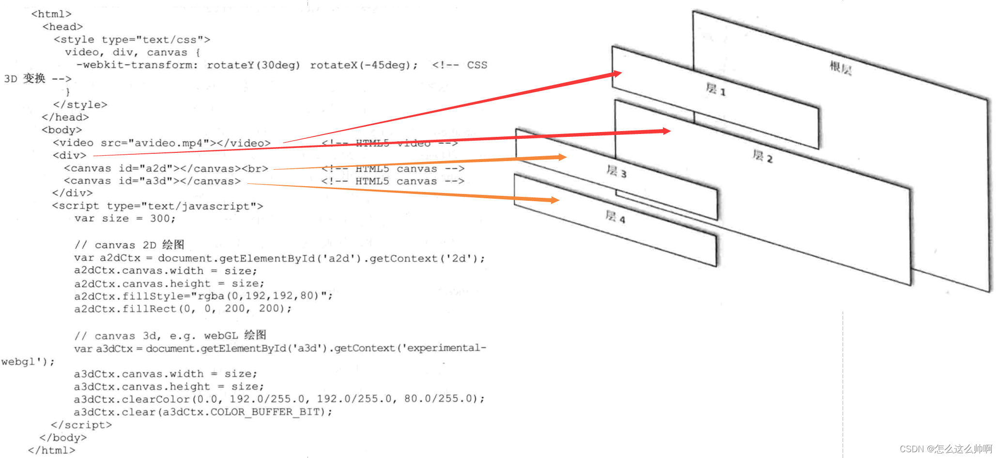

### WebKit 的网页渲染过程

渲染分为三个阶段：URL 到 DOM、DOM 到构建绘图上下文、绘图上下文到最终图像

#### URL 到 DOM

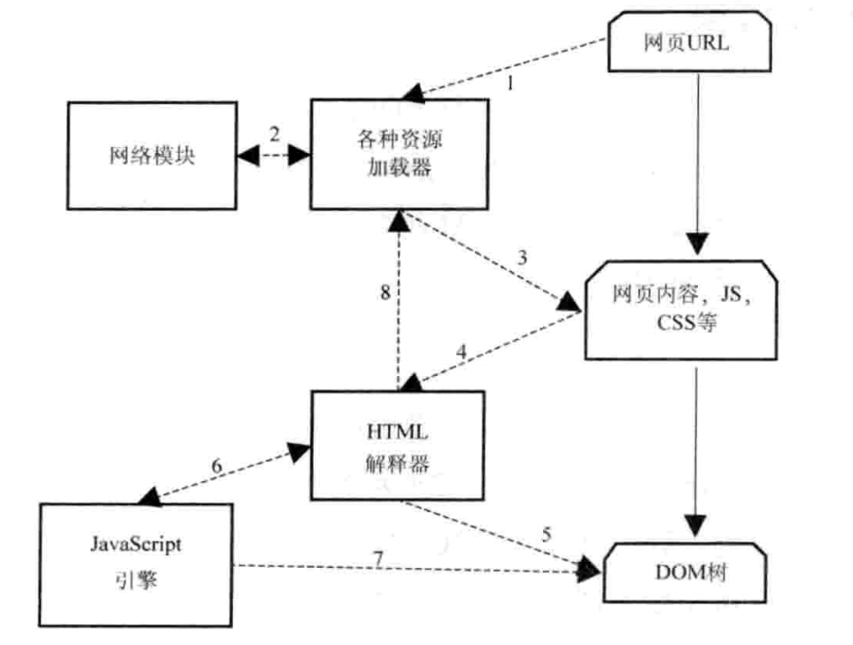

具体过程如下：

1. 当用户输入网页 URL 的时候，WebKit 调用其资源加载器加载该 URL 对应的网页。
2. 加载器依赖网络模块建立连接，发送请求并接收答复。
3. WebKit 接收到各种网页或者资源的数据，其中某些资源可能是同步或异步获取的。
4. 网页被交给 **HTML 解释器**转变成一系列的词语（Token）。
5.  解释器根据词语构建**节点（Node）**，形成DOM树。
6.  如果节点是 JavaScript 代码的话，调用 **JavaScript 引擎**解释并执行。
7.  JavaScript 代码可能会修改 DOM 树的结构。
8.  如果节点需要依赖其他资源，例如图片、CSS、视频等，调用资源加载器来加载它们，但是它们是异步的，不会阻碍当前 DOM 树的继续创建；如果是 JavaScript 资源 URL（没有标记异步方式），则需要停止当前 DOM 树的创建，直到 JavaScript 的资源加载并被 JavaScript 引擎执行后才继续 DOM 树的创建。

在上述的过程中，网页在加载和渲染过程中会发出 “ DOMConent ” 事件和D OM 的 “ onload”  事件，分别在 DOM 树构建完之后，以及 DOM 树建完并且网页所依赖的资源都加载完之后发生。

#### DOM 到构建绘图上下文

具体过程如下：

1. CSS 文件被 CSS 解释器解释成内部表示结构。 
2. CSS 解释器工作完之后，在 DOM 树上附加解释后的样式信息，这就是 RenderObject 树。 
3. RenderObject 节点在创建的同时，WebKit 会根据网页的层次结构创建 RenderLayer 树，同时构建一个虚拟的绘图上下文。

#### 绘图上下文到最终图像

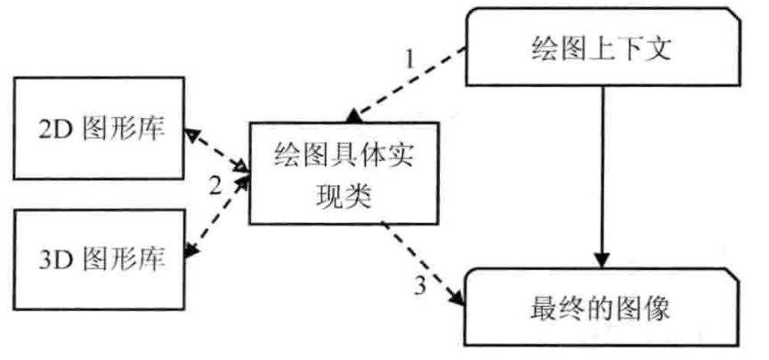

具体过程如下：

1. 绘图上下文是一个与平台无关的抽象类，它将每个绘图操作桥接到不同的具体实现类，也就是绘图具体实现类。 
2. 绘图实现类将 2D 图形库或者 3D 图形库绘制的结果保存下来，交给浏览器来同浏览器界面一起显示。

## WebKit 架构及模块

​		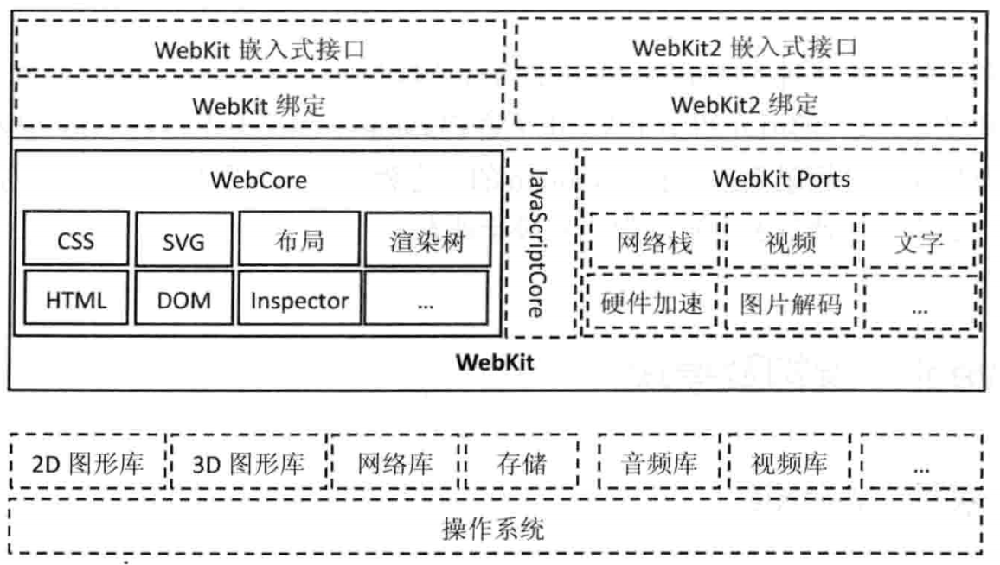

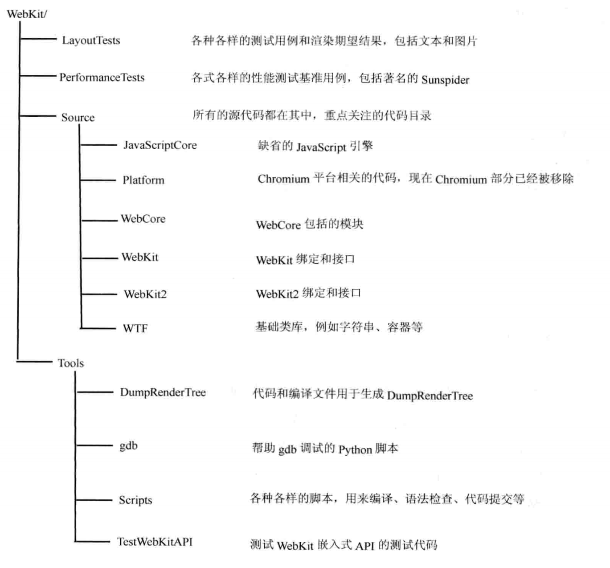

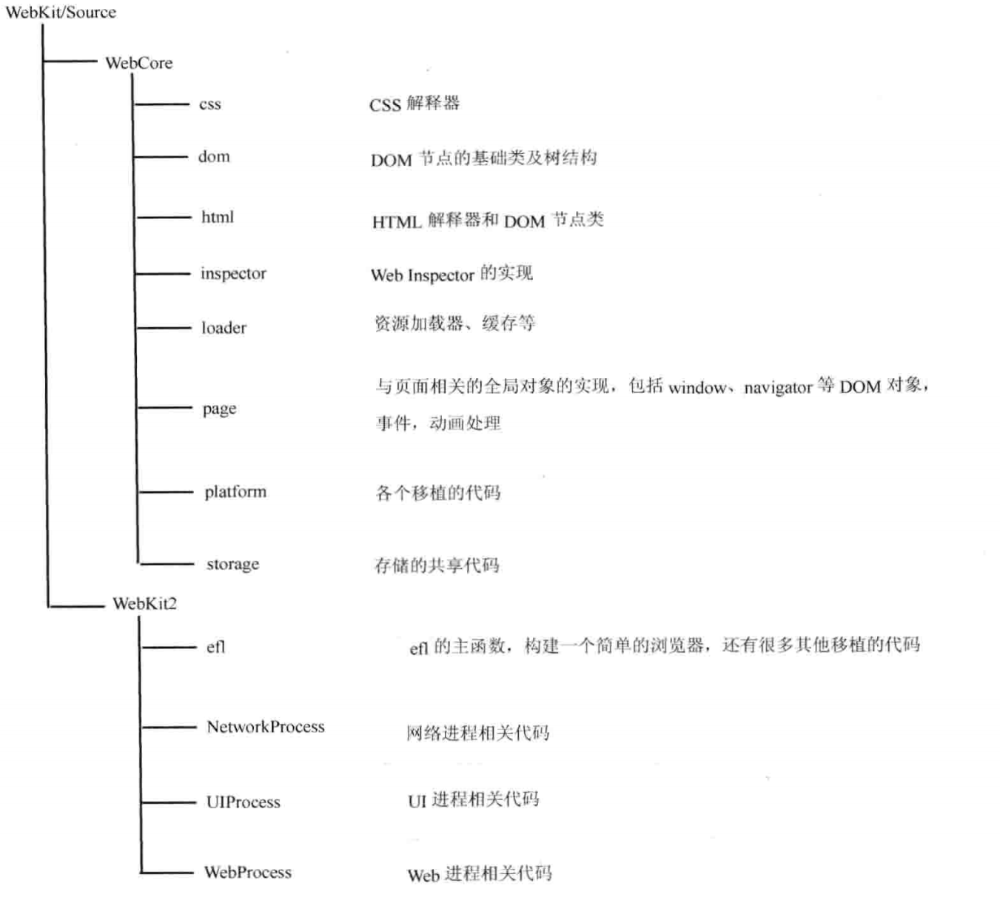

#### webkit2

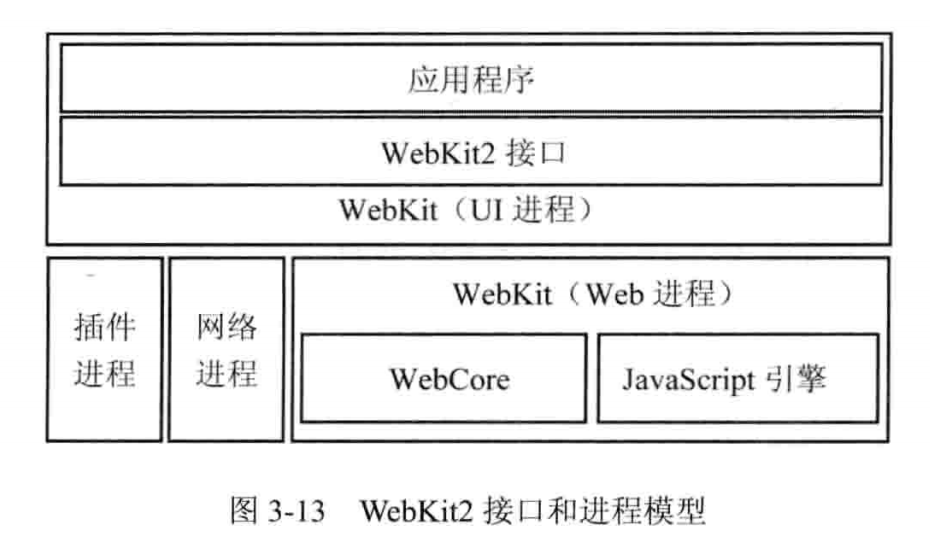

### Webkit 资源和加载机制

#### 一、资源

HTML 支持的资源主要包括以下几种类型：

- HTML 页面，包括各式各样的HTML元素
- JavaScript
- CSS
- 图片
- SVG
- CSS Shader
- 音频、视频、文字
- 字体文件
- XSL样式表：使用XSLT语言编写的XSLT代码文件

在 webkit 种通过不同的类来表示这些资源，webkit 为这些资源提供了一个公共基类 **CachedResource**

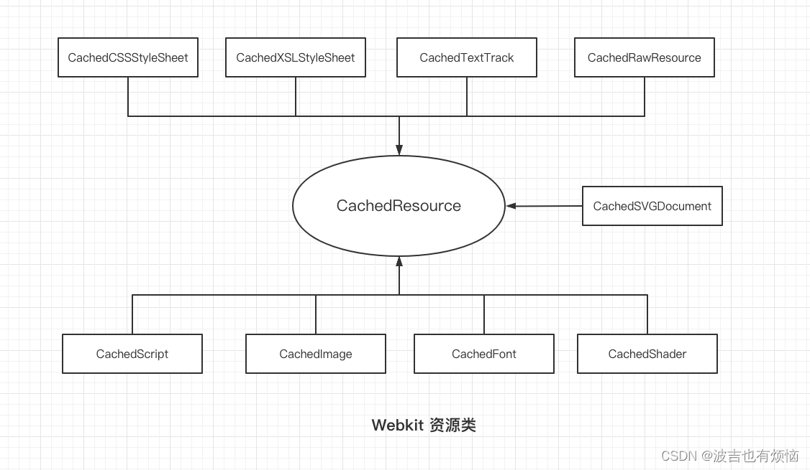

CachedRawResource 是HTML文本对应的资源

#### 资源缓存

​		使用资源缓存是为了提高资源的利用率，资源缓存的基本思想：

1. 建立一个资源的缓存池
2. 需要资源时先从缓存池中获取，如果缓存池中没有，webkit 就回创建一个新的 CachedResource 子类的对象，并发送真正的请真正的请求给服务器，服务器返回资源之后，webkit 就会将接收到的资源设置到该资源类的对象中去，并缓存下载方便下次使用
3. 缓存池是建立在内存中的

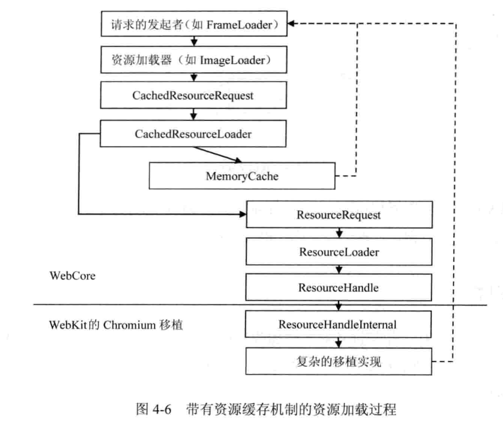

##### 资源加载器

- webkit 总共有三种类型的资源加载器：
  - 第一种是针对每种资源类型的特定加载器，这种加载器的特点是仅加载一种资源
  - 第二种：资源缓存机制的资源加载器的特点是所有特定加载器都更想它来查找并插入缓存资源 - CachedResourceLoader类，特定资源加载器是通过缓存机制的资源加载器来查找是否有资源缓存，属于HTML文档对象
  - 第三种： 通用资源加载器 - ResourceLoader类，是在webkit需要从网络或者文件系统获取资源的时候使用该类只负责获得资源的数据，因此被所有特定资源加载器所共享

##### 资源池的生命周期

​		资源池的大小是有先的，必须要使用相应的机制来替换资源池中的资源，以便加入新的资源， 资源池中替换、更新资源的机制就是资源池的生命周期

**资源池采用什么机制来更新资源？**

采用LRU(Least Recent Used)最近最少使用算法

**webkit 如何判断下次使用的时候是否需要更行该资源而重新从服务器请求？**

- 当一个资源被加载之后，通常就会被放入资源池，当用户打开网页后他想刷新当前页面，资源池并不会清除所有的资源，重新请求服务器，也不会直接利用当前的资源
- webkit的做法是，首先会判断资源是否在资源池中，如果资源在资源池中，那么会向服务器发送一个请求，告诉服务器资源池中的信息(过期时间，修改时间等)， 服务器会更具这行信息作出判断，如果没有更新，服务器则会返回304的状态码，表示不需要更新，直接利用资源池中的资源，如果资源不在资源池中，webkit会向服务器发送加载资源的请求

## HTML 解释器和 DOM 模型

### DOM 模型

​		DOM （Document Object Model）的全称是文档对象模型，它可以以一种独立于平台和语言的方式访问和修改一个文档的内容和结构。这里的文档可以是 HTML 文档、XML 文档或者 XHTML 文档。DOM 以面向对象的方式来描述文档，在 HTML 文档中，Web 开发者可以使用 JavaScript 语言来访问、创建、删除或者修改 DOM 结构，其主要目的是动态改变 HTML 文档的结构。

###  DOM 树

#### 结构模型

​		DOM 结构构成的基本要素是 “Node” ，而文档的 DOM 结构就是由层次化的节点组成。在 DOM 模型中，节点的概念很宽泛，整个文档（Document ）就是一个节点，称为文档节点。HTML 中的标记（Tag）也是一种节点，称为元素（Element）节点。还有一些其他类型的节点，例如 属性节点（标记的属性）、Entity 节点、ProcessingIntruction 节点、CDataSection 节点、注释（Comment）节点等。

​		文档的节点使用 IDL 语言来描述，文档继承自节点类型，使用Node接口。

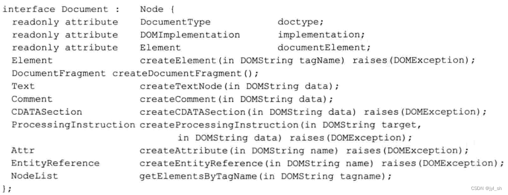

​		HTML 文档的接口定义，都继承自文档的接口，同时又有自己的属性和接口，这些都跟HTML文档的具体应用相关。

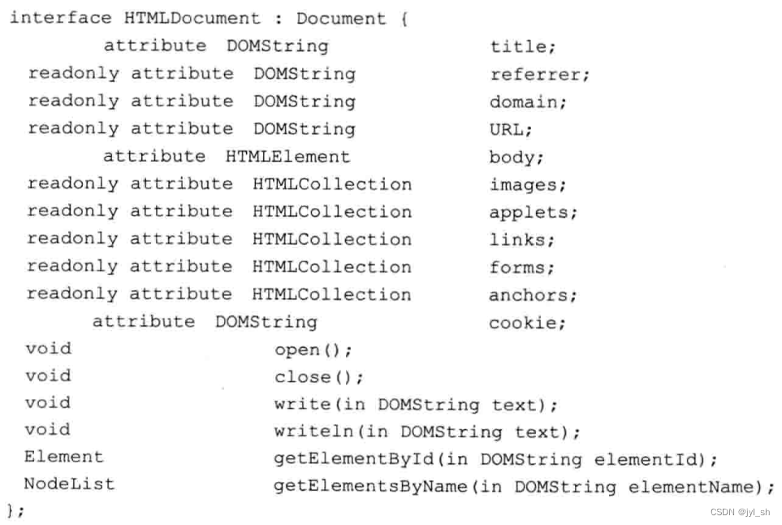

#### DOM 树

​		众多的节点按照层次组织构成一个 DOM 树结构，DOM 树的根就是 HTMLDocument，HTML 网页中的标签则被转换成一个个的元素节点。同数据结构中的树形结构一样，这些节点之间也存在父子或兄弟关系。

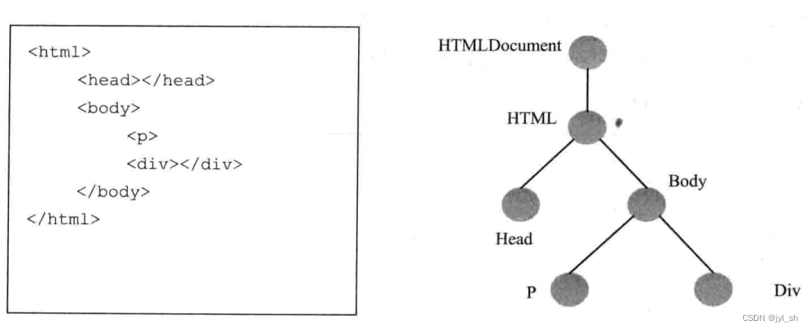

树中存在元素节点和文档节点，其实在规范内部还存在属性节点，但不属于元素节点。在图中没有表现出来

### HTML 解释器

#### 解释过程

​		HTML 解释器的工作就是**将网络或者本地磁盘获取的 HTML 网页和资源从字节流解释成 DOM 树结构**。

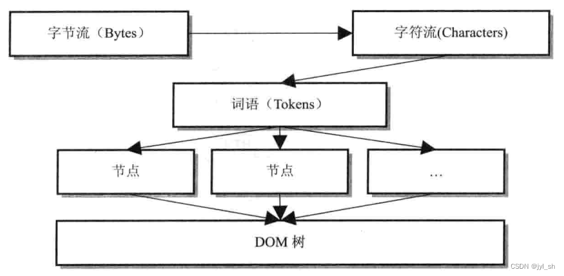

​		这一过程中，WebKit 内部对网页内容在各个阶段的结构表示。 WebKit 中这一过程如下：首先是字节流，经过解码之后是字符流，然后通过词法分析器会被解释成词语（Tokens），之后经过语法分析器构建成节点，最后这些节点被组建成一棵 DOM 树。

​		WebKit 为完成这一过程，引入比较复杂的基础设施类。

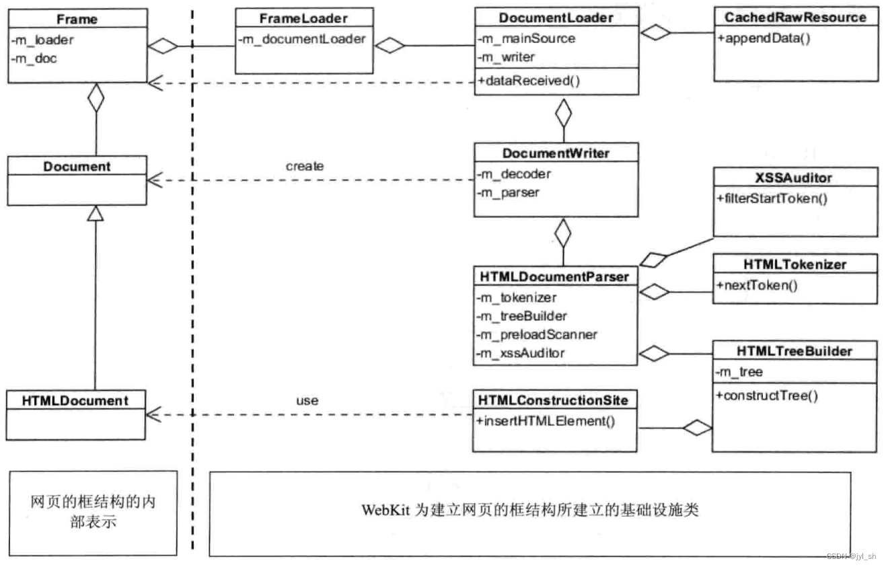

​		左边部分网页框结构，框对应于 Frame 类，而文档对应于 HTMLDocument 类，所以框包含文档、HTMLDocument 类继承自 Document 类。也是遵循 DOM 标准的，因为 Document 有两个子类，另外一个是XMLDocument 。这里没有描述内嵌的复杂框结构，但是足以说明网页基本结构内部表示。在实际应用中，网页内嵌框也会重复这样的动作。

​		右边部分是 WebKit 为建立网页框结构所建立的设施，先看 FrameLoder 类，它是框中内容的加载器，类似于资源和资源加载器。因为 Frame 对象中包含 Document 对象，所以 WebKit 同样需要 DocumentLoader 类帮助加 载HTML 文档并从字节流到构建的 DOM 树，DocumentWriter 类是一个辅助类，它会创建 DOM 树的根节点 HTMLDocument 对象，同时该类包括两个成员变量，一个用于文档的字符解码类，另一个就是 HTML 解释器HTMLDocumentParser 类。

​		HTMLDocumentParser 类是一个管理类，包括了用于各种工作的其他类，如字符串到词语需要用到词法分析器 HTMLTokenizer 类。该管理类读入字符串，输出一个词语，这些词语经过 XSSAuditor 做完安全检查之后，就会输出到 HTMLTreeBuilder 类。

​		HTML Tree Builder 类负责 DOM 树的建立，它本身能够通过词语创建一个个的节点对象，然后，借由HTMLConstructionSite 类来将这些点对象构建成一颗树。

​		下图是 WebKit 收到网络回复的字节流的时候，从字节流到构建 DOM 树的时序图，详述了调用过程，但省略了一些次要调用。ResourceLoader 类和 CachedRawResource 类收到网络栈的数据后，调用D ocumentLoader类的 commitData 方法，然后 DocumentWriter 类会创建一个根节点 HTMLDocument对 象，然后将数据append 输送到 HTMLDocumentParser 对象，后面就是将其解释成词语，创建节点对象然后建立以HTMLDocument 为根的 DOM 树。

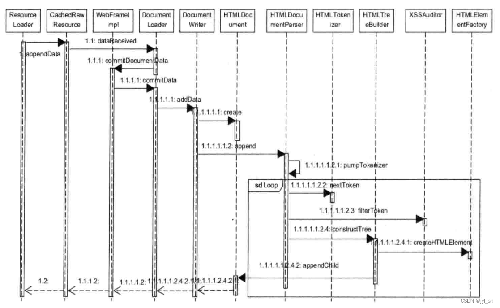

#### 词法分析

​		在进行词法分析之前，解释器首先要做的事情就是检查该网页内容使用的编码格式，以便后面使用合适的解码器。如果解释器在 HTML 网页中找到了设置的编码格式， WebKit 会使用相应的解码器来将字节流转换成特定格式的字符串。如果没有特殊格式，词法分析器 HTMLTokenizer 类可以直接进行词法分析。

​		**词法分析的工作都是由 HTMLTokenizer 来完成 ，简单来说，它就是一个状态机—输入的是字符串，输出的是一个个词语。因为字节流可能是分段的，所以输入的字符串可能也是分段的，但是这对词法分析器来说没有什么特别之处，它会自己维护内部的状态信息。**

​		词法分析器的主要接口是 “nextToken” 函数，调用者只需要关键字符串传入，然后就会得到一个词语，并对传入的字符串设置相应的信息，表示当前处理完的位置，如此循环，如果词法分析器遇到错误，则报告状态错误码，主要逻辑在图中给予了描述。

​		**对于 “nextToken” 函数的调用者而言，它首先设置输入需要解释的字符串，然后循环调用 NextToken 函数,直到处理结束。 “nextToken” 方法每次输出一个词语，同时会标记输入的字符串，表明哪些字符已经被处理过了。因此，每次词法分析器都会根据上次设置的内部状态和上次处理之后的字符串来生成一个新的词语。 “nextToken” 函数内部使用了超过 70 种状态，图中只显示了 3 种状态。对于每个不同的状态，都有相应的处理逻辑。**

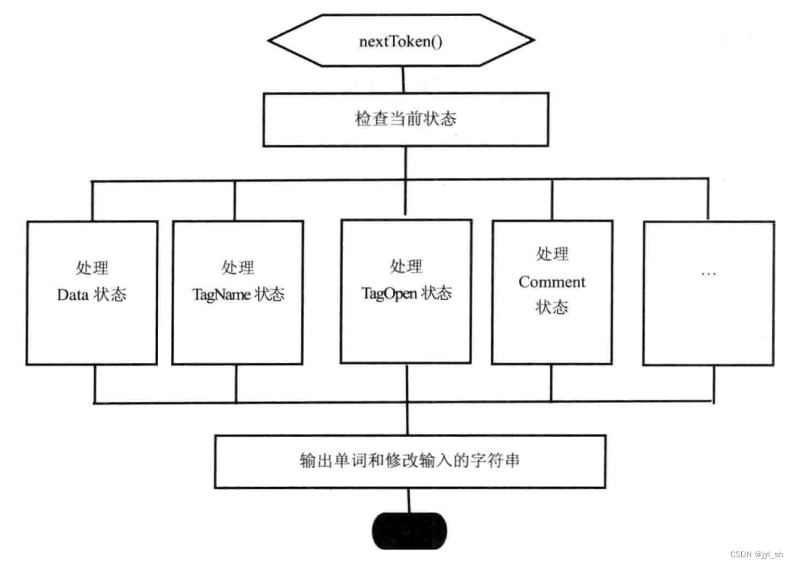

​		而对于词语的类别，WebKit 只定义了很少，HTMLToken 类定义了 6 种词语类别，包括 DOCTYPE、StartTag、EndTag、Comment、Character 和 EndOfFile，这里不涉及 HTML 的标签类型等信息，那是后面语法分析的工作。

#### XSSAuditor 验证词语

​		当词语生成之后，**WebKit 需要使用 XSSAuditor 来验证词语流（Token Stream）**。XSS 指的是 Cross Site Security , 主要是针对安全方面的考虑。

​		根据 XSS 的安全机制，对于解析出来的这些词语，可能会阻碍某些内容的进一步执行，所以 XSSAuditor 类主要负责过滤这些被阻止的内容，**只有通过的词语才会作后面的处理**。

#### 词语到节点

​		经过词法分析器解释之后的词语随之被 XSSAuditor 过滤并且在没有被阻止之后，将被 WebKit 用来构建 DOM 节点。从词语到构建节点的步骤是由 HTMLDocumentParser 类调用 HTMLTreeBuilder 类的 “constructTree” 函数来实现。该函数实际上是利用 ProcessToken 函数来处理 6 种词语类型。

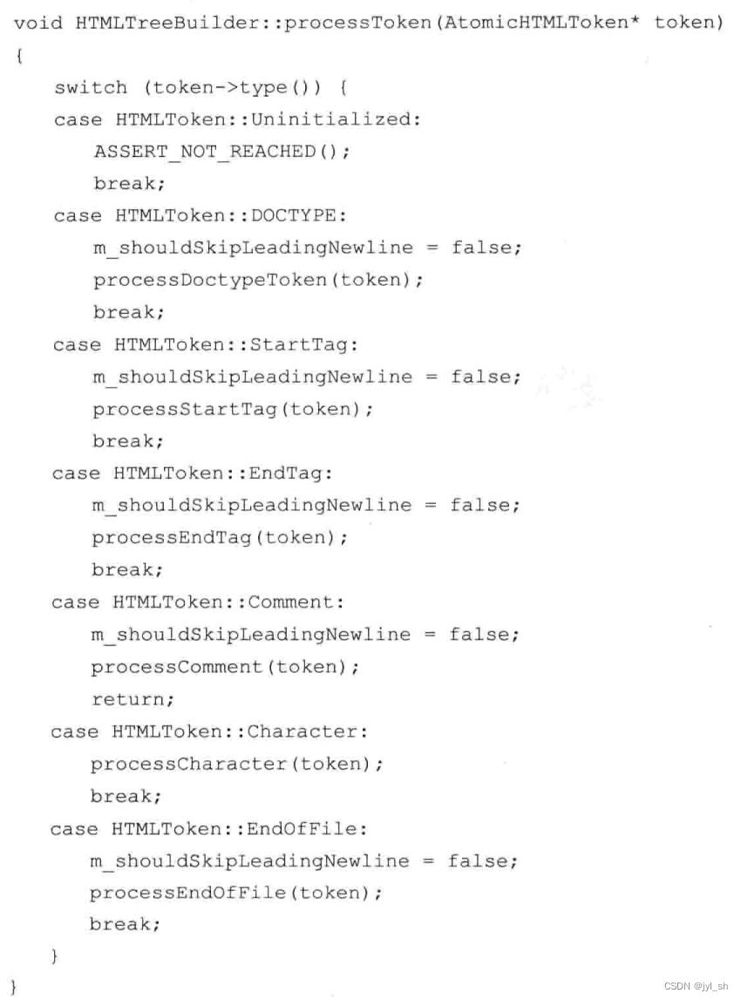

#### 节点到 DOM 树

​		从节点到构建 DOM 树，包括为树中的元素节点创建属性节点等工作由 HTMLConstructionSite 类来完成。正如前面介绍的，该类包含一个 DOM 树的根节点 ——HTMLDocument 对象，其他的元素节点都是它的后代。

​		因为 HTML 文档的 Tag 标签是有开始和结束标记的，所以构建这一过程可以使用栈结构来帮忙。HTMLConstructionSite 类中包含一个 “HTMLElementStack”  变量，它是一个保存元素节点的栈，其中的元素节点是当前有开始标记但是还没有结束标记的元素节点。想象一下 HTML 文档的特点，例如一个片段  “\<body>\
\\</img>\
\</body>”，当解释到 img 元素的开始标记时，栈中的元素就是 body 、div 和 img ,当遇到 img 的结束标记时，img 退栈， img 是 div 元素的子女；当遇到 div 的结束标记时，div 退栈，表明 div 和它的子女都已处理完，以此类推。

​		根据 DOM 标准中的定义，节点有很多类型，如元素节点、属性节点等。同 DOM 标准一样，一切的基础都是 Node 类。在 WebKit 中， DOM 中的接口 Interface 对应于 C++ 的类，Node 类是其他类的基类，在下面的图中        显示了 DOM 的主要相关节点类。图中的 Node 类实际上继承自 EventTarget 类，它表明 Node 类能够接受事件，这个会在 DOM 事件处理中介绍。Node 类还继承自另外一个基类 ——ScriptWrappable，这个跟 JavaScript 引擎相关。

​		Node 的子类就是 DOM 中定义的同名接口，元素类，文档类和属性类均继承自一个抽象出来的 ContainerNode 类，表明它们能够包含其他的节点对象。回到 HTML 文档来说，元素和文档对应的类注是 HTMLElement 类和 HTMLDocument 类，实际上 HTML 规范还包含众多的 HTMLElement 子类，用于表示 HTML 语法中众多的标签。

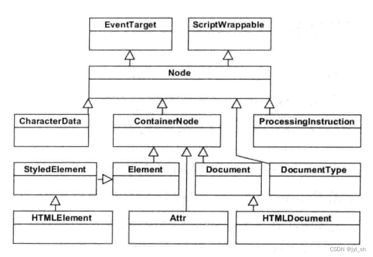

### JavaScript 的执行

​		在 HTML 解释器的工作过程中，可能会有 JavaScript 代码（全局作用域的代码）需要执行，它发生在将字符串解释成词语之后、创建各种节点的时候。这也是全局执行的 JavaScript 代码不能访问 DOM 树的原因——因为 DOM 树还没有被创建完。

​		WebKit 将 DOM 树创建过程中需要执行的 JavaScript 代码交由H TMLScriptRunner 类来负责。工作方式很简单，就是利用 JavaScript 引擎来执行 Node 节点中包含的代码。细节见 HTML Script Runner::excuteParsingBlockingScript 方法。

​		因为 JavaScript 代码可能会调用如 “ document.write() ” 来修改文档结构，所以 JavaScript 代码的执行会阻碍后面节点的创建，同时当然也会组在后面资源的下载，这时候 WebKit 对需要什么资源一无所知，这导致了资源不能够并发地下载这一严重影响性能的问题。下图示例一，JavaScript 代码的执行阻碍了后面 img 图片的下载。当该 Script 节点使用 src 属性的时候，情况变得更差，因为 WebKit 还需要等待网络获取 JavaScript 文档，所以关于JavaScript 的使用有以下两点建议。

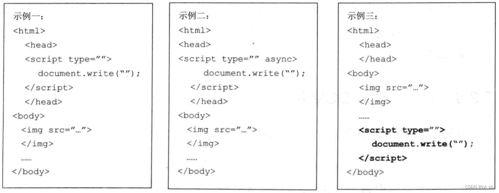

1. 将 “ script ” 元素加上 “async” 属性，表明这是一个可以异步执行的 JavaScript 代码。在 HTMLScriptRunner 类中就有相应的函数执行异步的 JavaScript 代码，图中示例二给出了使用方法。

2. 将 “ script ” 元素放在 “body” 元素的最后，这样它不会阻碍其他资源的并发下载。

但是不这样做的时候，WebKit 使用预扫描和预加载机制来实现资源的并发下载而不被 JavaScript 的执行所阻碍。

​		具体做法是：当遇到需要执行 JavaScript 代码的时候，WebKit 先暂停当前 JavaScript 代码的执行，使用预先扫描器 HTMLPreloadScanner 类来扫描后面的词语。如果 WebKit 发现它们需要使用其他资源，那么使用预资源加载器 HTMLPreloadScanner 类来发送请求，在这之后，才执行 JavaScript代码。预先扫描器本身并不创建节点对象，也不会构建 DOM 树，所以速度比较快。

​		当 DOM 树构建完之后，WebKit 触发 “DOMContentLoaded” 事件，注册在该事件上的 JavaScript 函数会被调用。当所在资源都被加载完之后，WebKit 触发 “onload” 事件。

