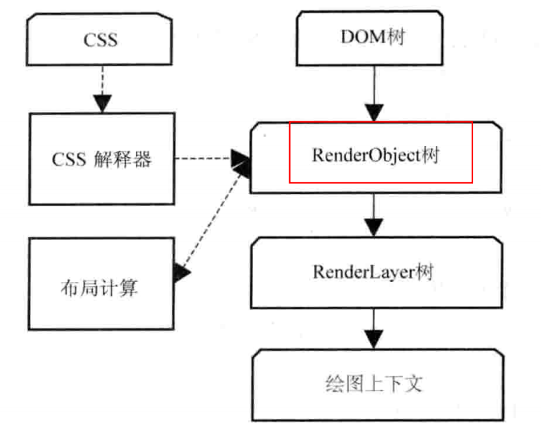

[TOC]

## 内核特征

- 渲染引擎的功能主要包括：**HTML解释器**、**CSS解释器**、**布局（lay out）**、**JS引擎**。
  - HTML解释器：将 HTML 文 本解释成 DOM.
  - CSS解释器：为 DOM 各个元素计算出样式信息，为布局提供基础设施。
  - 布局：将 DOM 元素对象和样式信息结合，计算大小位置等布局信息，形成一个内部表示模型。
  - JS引擎：js 可以修改网页内容，JS 引擎解析 js 并通过 DOM 接口和 CSSOM 接口修改网页内容和样式信息，从而改变渲染结果。
  - 绘图：使用图形库，将布局计算后的网页节点绘制成图像结果。
- 渲染引擎依赖了：网络、存储、2D/3D图形、音频和视频、图片解码器。
  同样一起依赖了OS的支持（如线程、文件等）。

### HTML 网页和结构

#### 网页构成与结构

- html 是一种半结构化数据表现方式，结构特征有：树状、层次、框结构。
  - js代码用于控制网页内部逻辑。即控制用户端逻辑。
  - CSS用于描述网页显示信息。
- HTML5 ：
  - 2D、3D图形以及多媒体方面的支持。使得2D、3D图形以及多媒体 被浏览器原生支持。不需要第三方插件。
- 网页结构：
  - 框结构：每个框结构包含一个HTML文档，使用元素嵌套框。桌面端应用较为广泛。
  - 层次结构：网页中元素可能分布在不同层次中，webkit 为他们构建新层，是为了渲染引擎在处理上的方便和高效。

如：创建新层可以更有效的处理视频解码器和浏览器之间的交互和渲染问题。
如：层1为video创建的层；；层2为需要3D变换的div创建的层；层3、4对应canvas，有着HTML5中的2D、3D绘图操作。
可以使用浏览器的 show composited layer borders 打开网页的层次结构显示详细观看。

### WebKit 的网页渲染过程

渲染分为三个阶段：URL 到 DOM、DOM 到构建绘图上下文、绘图上下文到最终图像

#### URL 到 DOM

具体过程如下：

1. 当用户输入网页 URL 的时候，WebKit 调用其资源加载器加载该 URL 对应的网页。
2. 加载器依赖网络模块建立连接，发送请求并接收答复。
3. WebKit 接收到各种网页或者资源的数据，其中某些资源可能是同步或异步获取的。
4. 网页被交给 **HTML 解释器**转变成一系列的词语（Token）。
5.  解释器根据词语构建**节点（Node）**，形成DOM树。
6.  如果节点是 JavaScript 代码的话，调用 **JavaScript 引擎**解释并执行。
7.  JavaScript 代码可能会修改 DOM 树的结构。
8.  如果节点需要依赖其他资源，例如图片、CSS、视频等，调用资源加载器来加载它们，但是它们是异步的，不会阻碍当前 DOM 树的继续创建；如果是 JavaScript 资源 URL（没有标记异步方式），则需要停止当前 DOM 树的创建，直到 JavaScript 的资源加载并被 JavaScript 引擎执行后才继续 DOM 树的创建。

在上述的过程中，网页在加载和渲染过程中会发出 “ DOMConent ” 事件和D OM 的 “ onload”  事件，分别在 DOM 树构建完之后，以及 DOM 树建完并且网页所依赖的资源都加载完之后发生。

#### DOM 到构建绘图上下文

具体过程如下：

1. CSS 文件被 CSS 解释器解释成内部表示结构。 
2. CSS 解释器工作完之后，在 DOM 树上附加解释后的样式信息，这就是 RenderObject 树。 
3. RenderObject 节点在创建的同时，WebKit 会根据网页的层次结构创建 RenderLayer 树，同时构建一个虚拟的绘图上下文。

#### 绘图上下文到最终图像

具体过程如下：

1. 绘图上下文是一个与平台无关的抽象类，它将每个绘图操作桥接到不同的具体实现类，也就是绘图具体实现类。 
2. 绘图实现类将 2D 图形库或者 3D 图形库绘制的结果保存下来，交给浏览器来同浏览器界面一起显示。

## WebKit 架构及模块

​		

#### webkit2

### Webkit 资源和加载机制

#### 一、资源

HTML 支持的资源主要包括以下几种类型：

- HTML 页面，包括各式各样的HTML元素
- JavaScript
- CSS
- 图片
- SVG
- CSS Shader
- 音频、视频、文字
- 字体文件
- XSL样式表：使用XSLT语言编写的XSLT代码文件

在 webkit 种通过不同的类来表示这些资源，webkit 为这些资源提供了一个公共基类 **CachedResource**

CachedRawResource 是HTML文本对应的资源

#### 资源缓存

​		使用资源缓存是为了提高资源的利用率，资源缓存的基本思想：

1. 建立一个资源的缓存池
2. 需要资源时先从缓存池中获取，如果缓存池中没有，webkit 就回创建一个新的 CachedResource 子类的对象，并发送真正的请真正的请求给服务器，服务器返回资源之后，webkit 就会将接收到的资源设置到该资源类的对象中去，并缓存下载方便下次使用
3. 缓存池是建立在内存中的

##### 资源加载器

- webkit 总共有三种类型的资源加载器：
  - 第一种是针对每种资源类型的特定加载器，这种加载器的特点是仅加载一种资源
  - 第二种：资源缓存机制的资源加载器的特点是所有特定加载器都更想它来查找并插入缓存资源 - CachedResourceLoader类，特定资源加载器是通过缓存机制的资源加载器来查找是否有资源缓存，属于HTML文档对象
  - 第三种： 通用资源加载器 - ResourceLoader类，是在webkit需要从网络或者文件系统获取资源的时候使用该类只负责获得资源的数据，因此被所有特定资源加载器所共享

##### 资源池的生命周期

​		资源池的大小是有先的，必须要使用相应的机制来替换资源池中的资源，以便加入新的资源， 资源池中替换、更新资源的机制就是资源池的生命周期

**资源池采用什么机制来更新资源？**

采用LRU(Least Recent Used)最近最少使用算法

**webkit 如何判断下次使用的时候是否需要更行该资源而重新从服务器请求？**

- 当一个资源被加载之后，通常就会被放入资源池，当用户打开网页后他想刷新当前页面，资源池并不会清除所有的资源，重新请求服务器，也不会直接利用当前的资源
- webkit的做法是，首先会判断资源是否在资源池中，如果资源在资源池中，那么会向服务器发送一个请求，告诉服务器资源池中的信息(过期时间，修改时间等)， 服务器会更具这行信息作出判断，如果没有更新，服务器则会返回304的状态码，表示不需要更新，直接利用资源池中的资源，如果资源不在资源池中，webkit会向服务器发送加载资源的请求

