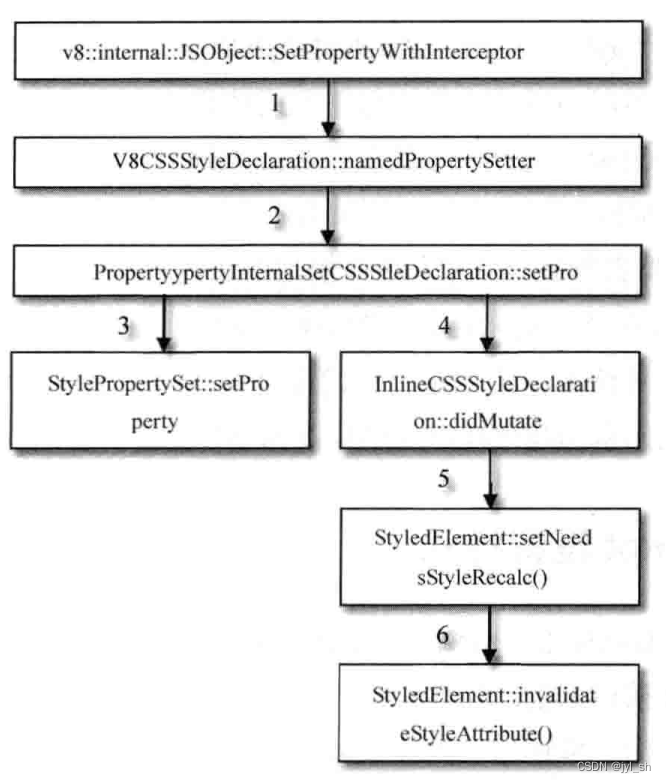

[TOC]

# CSS 解释器和样式布局

​		CSS 解释器和规则<u>匹配处于 DOM 树建立之后，RenderObject树之前，CSS解释器解释后的结果会保存起来，然后 RenderObject 树基于该结果来进行规范匹配和布局计算</u>。当网页有用户交互或者动画等动作的时候，通过 CSSOM 等技术，JavaScript 代码同样可以非常方便地修改 CSS代 码，WebKit 此时需要重新解释样式并重复以上这个过程。

### 框模型

​		框模型（Box model，或称箱子模型）是CSS标准中引入来表示HTML标签元素的布局结构。一个框模型大致包括了四个部分，它们从外到内分别是外边距（Margin）、边框（Border）、内边距（Padding）和内容（Content）。图描述的就是一个标准的框模型结构。在HTML网页中，每个可视元素（之所以强调可视是因为很多HTML元素其实不是用来显示的，例如用来表示语义的元素）的布局都是按照框模型来设计的。网页通过对元素设置这些样式属性，就可以达到特定的布局效果。

## CSS 解释器和规则匹配

### 样式的WebKit表示类

​		在 DOM 树中，CSS 样式可以包含在 “ style”  元素中或者使用 “ link ” 来引用一个 CSS 文档。对于 CSS 样式表，不管是内嵌还是外部文档，WebKit 都使用 CSSStyleSheet 类来表示。图描述了WebKit内部是如何表示CSS文档的。

​		一切的起源都是从 DOM 中的 Document 类开始。先看 Document 类之外的左上部分：包括一个DocumentStyleSheetCollection 类，该类包含了所有 CSS 样式表；还包括 WebKit 的内部表示类CSSStyleSheet，它包含 CSS 的 href、类型、内容等信息。CSS 的内容就是样式信息 StyleSheetContents，包含了一个样式规则（StyleRuleBase）列表。样式规则被用在CSS的解释器的工作过程中。

​		下面的部分 WebKit 主要是将解释之后的规则组织起来，用于为 DOM 中的元素匹配相应的规则，从而应用规则中的属性值序列。这一过程的主要负责者是 StyleSheetResolver 类，它属于 Document 类，并包含了一个DocumentRuleSets 类用来表示多个规则集合（RuleSet）。每个规则集合都是将之前解释之后的结果合并起来，并进行分类，例如 id 类规则、标签类规则等。至于为什么是多个规则集合，是因为这些规则集合可能源自于默认的规则集合（前面提到过WebKit使用默认的CSS样式信息），或者网页自定义的规则集合等。

​		下面让我们更进一步重点介绍样式规则。样式规则是解释器的输出结构，是样式匹配的输入数据。样式规则有很多类型，图描述了这些类和继承关系。

- Style： 这个是基本类型，大多数规则属于这个类型。
- lmport： 是WebKit中为了方便而引入的，其对应的是一个导入CSS文件的Style元素。
- Media： 对应于CSS标准中的@media类型。
- Fontface： CSS3新引入的自定义字体的规则类型。
- Page： 对应于CSS标准中的@page类型。
- Keyframes： 对应于WebKit中的@-webkit-key-frames类型，可以用来定制特定帧的样式属性信息。
- Region： 对CSS标准正在进行中的Regions的支持，这方便了开发者对页面进行分区域排版。

这些类基本上跟 CSS 的标准相对应，当然也有特例，那就是 StyleRuleImport，它是 WebK it引入的一个新的类型，主要对应的是导入 CSS 文件的元素。

​		接下来剖析规则的内部是如何组成和表示的。图描述的是一个CSS规则（从示例代码中获取）和WebKit的内部结构表示类。

首先最外层的是样式规则，通常一个样式表可能包括一个或者多个样式规则，这里描述的样式规则对应于图中的StyleRule类。

​		然后是选择器部分，图的上半部分是一个选择器列表，这在现实中是比较常见的，因为选择的条件可能有多个。举个例子，“a[class=abc]”其实是两个选择器合起来的，第一个是“a”，它是一个标签选择器；第二个是“[class=abc]”，它是一个属性选择器。这两个选择器合起来的含义就是匹配元素是“a”的标签并且它的类别为“abc”。选择器在WebKit的内部表示是CSSSelector类。在规则中，CSSSelector类使用一个对象列表来表示它们。

​		最后是这个规则对应的属性集合CSSPropertySet。WebKit使用了一些类来分别表示属性名字CSSPropertyID、属性值CSSValue。图6-7清晰地描述了它们的结构。

### 解释过程

CSS 解释过程是指从 CSS 字符串经过 CSS 解释器处理后变成渲染引擎的内部规则表示的过程。在WebKit中，这一过程如图所示

​		这一过程并不复杂，基本的思想是由 CSSParser 类负责。CSSParser 类其实也是桥接类，实际的解释工作是由 CSSGrammer.y.in 来完成。CSSGrammer.y.in 是 Bison 的输入文件，Bison 是一个生成解释器的工具。Bison根据 CSSGrammer.y.in 生成CSS解释器——CSSGrammer 类。当然 CSSGrammer 类需要调用 CSSParser 类来处理解释结果，例如需要使用 CSSParser 类创建选择器对象、属性、规则等。

​		当WebKit需要解释CSS内容的时候，它调用CSSParser对象来设置CSSGrammer对象等，解释过程中需要的回调函数由CSSParser来负责处理，最后WebKit将创建好的结果直接设置到StyleSheetContents对象中，这一过程显得直接而且简单。

​		在解释网页中自定义的 CSS 样式之前，实际上 WebKit 渲染引擎会为每个网页设置一个默认的样式，这决定了网页所没有设置的元素属性及其属性默认值和将要显示的效果。一般来讲，不同的 WebKit 移植可以设置不同的默认样式。下面是 Chrome 浏览器使用的默认样式，这些样式决定了默认的网页显示效果。

### 样式规则匹配

​		样式规则建立完成之后，WebKit 保存规则结果在 DocumentRuleSets 对象类中。当 DOM 的节点建立之后，WebKit 会为其中的一些节点（只限于可视节点，在第7章中介绍）选择合适的样式信息。根据前面的描述，这些工作都是由 StyleResolver 来负责的。当然，实际的匹配工作还是在 DocumentRuleSets 类中完成的。

​		下图描述了参与样式规则匹配的WebKit主要相关类。基本的思路是使用 StyleResolver 类来为 DOM 的元素节点匹配样式。StyleResolver 类根据元素的信息，例如标签名、类别等，从样式规则中查找最匹配的规则，然后将样式信息保存到新建的 RenderStyle 对象中。最后，这些 RenderStyle 对象被 RenderObject 类所管理和使用。

​		规则的匹配则是由 ElementRuleCollector 类来计算并获得，它根据元素的属性等信息，并从DocumentRuleSets 类中获取规则集合，**依次按照 ID、类别、标签等选择器信息逐次匹配获得元素的样式**。那么具体的过程如何呢？下图为我们描述了WebKit如何为HTML元素获取样式并从规则集合中匹配的过程。

		首先，当 WebKit 需要为 HTML 元素创建 RenderObject 类的时候，首先 StyleResolver 类负责获取样式信息，并返回 RenderStyle 对象，RenderStyle 对象包含了匹配完的结果样式信息。

​		其次，根据实际需求，每个元素可能需要匹配不同来源的规则，依次是用户代理（浏览器）规则集合、用户规则集合和 HTML 网页中包含的自定义规则集合。这三个规则的匹配方式是类似的，这里是以自定义规则的匹配为例加以说明的。

​		再次，对于自定义规则集合，它先查找 ID 规则，检查有无匹配的规则，之后依次检查类型规则、标签规则等。如果某个规则匹配上该元素，WebKit把这些规则保存到匹配结果中。

​		最后，WebKit对这些规则进行排序。对于该元素需要的样式属性，WebKit选择从高优先级规则中选取，并将样式属性值返回。

## JavaScript 设置样式

​		CSSOM 定义了 JavaScript 访问样式的能力和方式。示例代码6-1中的第29行所示的是使用 CSSOM 接口来更改属性值的。在 WebKit 中，这需要 JavaScript 引擎和渲染引擎协同完成。为了描述这一过程，可能会涉及到一些JavaScript 引擎的调用，目前比较难以理解，所以读者只需要有一个大致的印象即可，在第9章的 JavaScript 引擎中会有更详细和系统的介绍。

​		大致的过程是，JavaScript 引擎调用设置属性值的公共处理函数，然后该函数调用属性值解析函数，在这个例子中则是 CSS 的 JavaScript 绑定函数。而 WebKit 将解析后的信息设置到元素的 “style” 属性的样式 “webkitTransform”中，然后设置标记表明该元素需要重新计算样式，并触发重新计算布局。最后就是 WebKit的 重新绘图，图6-12描述了其中的主要过程。

## WebKit 布局

​		当 WebKit 创建 RenderObject 对象之后，每个对象是不知道自己的位置、大小等信息的，WebKit 根据框模型来计算它们的位置、大小等信息的过程称为布局计算（或者称为排版）。

​		下图描述了这一过程中涉及的主要 WebKit 类。第5章描述过Frame类，用于表示网页的框结构，每个框都有一个FrameView类，用于表示框的视图结构。

​		FrameView 类主要负责视图方面的任务，例如网页视图大小、滚动、布局计算、绘图等，它是一个总入口类。图中标注了两个跟布局计算密切相关的函数——**“layout”** 和 **“needsLayout”**，它们用来布局计算和决定是否需要布局计算，实际的布局计算则是在 RenderObject 类中。

​		布局计算根据其计算的范围大致可以分为两类：第一类是对整个 RenderObject 树进行的计算；第二类是对RenderObject 树中某个子树的计算，常见于文本元素或者是 overflow:auto 块的计算，这种情况一般是其子树布局的改变不会影响其周围元素的布局，因而不需要重新计算更大范围内的布局。

### 布局计算

布局计算是一个递归的过程，这是因为一个节点的大小通常需要先计算它的子女节点的位置、大小等信息。

​		下图描述了 RenderObject 节点计算布局的主要过程，中间省略了很多判断和步骤，主要逻辑都是由RenderObject 类的 “layout” 函数来完成。

​		首先，该函数会判断 RenderObject 节点是否需要重新计算，通常这需要通过检查位数组中的相应标记位、子女是否需要计算布局等来确定。

​		其次，该函数会确定网页的宽度和垂直方向上的外边距，这是因为网页通常是在垂直方向上滚动，而水平方向尽量不需要滚动。

​		再次，**该函数会遍历其每一个子女节点，依次计算它们的布局**。每一个元素会实现自己的“layout”函数，根据特定的算法来计算该类型元素的布局。如果页面元素定义了自身的宽高，那么WebKit按照定义的宽高来确定元素的大小，而对于像文本节点这样的内联元素则需要结合其字号大小及文字的多少等来确定其对应的宽高。如果页面元素所确定的宽高超过了布局容器包含块所能提供的宽高，同时其overflow的属性为visible或auto，WebKit则会提供滚动条来保证可以显示其所有内容。除非网页定义了页面元素的宽高，一般来说页面元素的宽高是在布局的时候通过相关计算得出来的。如果元素它有子女，则WebKit需要递归这一过程。

​		最后，节点根据它的子女们的大小计算得出自己的高度，整个过程结束。

哪些情况下需要重新计算布局呢？总体来讲，只要样式发生变化，WebKit都需要重新计算，但是实际场景中，有以下一些情况。

​		首先，当网页首次被打开的时候，浏览器设置网页的可视区域（viewport），并调用计算布局的方法。这其实也描述了一种常见的情景，就是当可视区域发生变化的时候，WebKit都需要重新计算布局，这是因为网页的包含块的大小发生了改变。

​		其次，网页的动画会触发布局计算。当网页显示结束后，动画可能改变样式属性，那么WebKit就需要重新计算。

​		然后，JavaScript 代码通过 CSSOM 等直接修改样式信息，它们也会触发WebKit重新计算布局。

​		最后，用户的交互也会触发布局计算，例如翻滚网页，这会触发新区域布局的计算。

CSS的布局计算是以包含块和框模型为基础的，这表示这些元素的布局计算都依赖于块，例如“div”通常就是一个块，如前面所述它们通常是在垂直方向上展开。但是，CSS标准也规定了行布局形式，这就是内联元素。内联元素表现的是行布局形式，就是说这些元素以行进行显示。以“div”元素为例，如果设置属性“style”为“display:inline”时，则该元素是内联元素，那么它可能与前面的元素在同一行。如果该元素没有设置这个属性时，则是块元素，那么在新的行里显示。这显然会增加处理的复杂性，为此，WebKit的处理方式是——对于一个块元素对应的RenderObject对象，它的子女要么都是块元素的RenderObject对象，要么都是非内联元素对应的RenderObject对象，这可以通过建立匿名块（Anonymous Block）对象来实现，在下一章也会作介绍。

