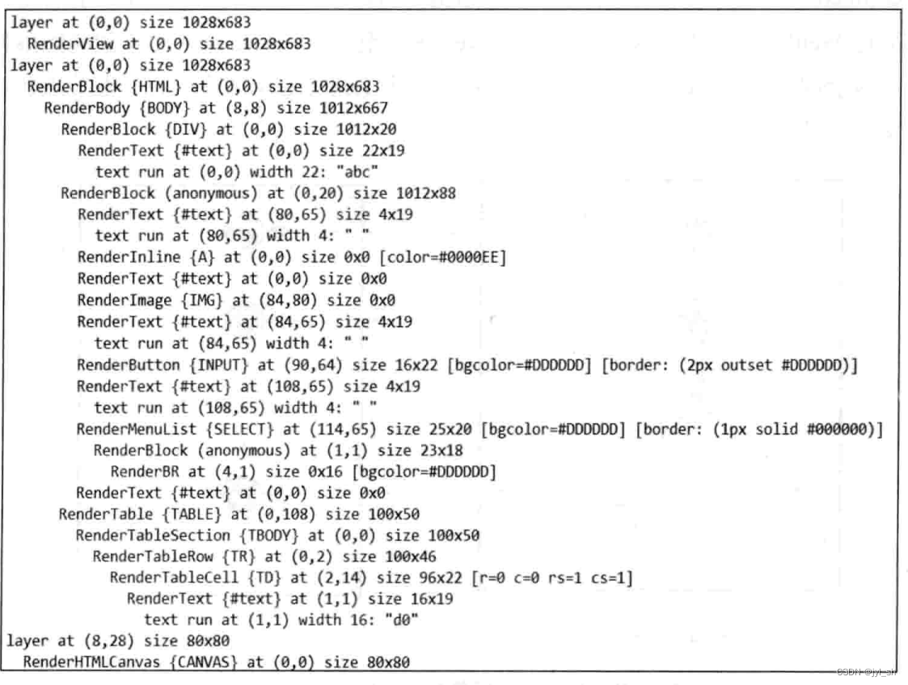

[TOC]


# 渲染基础


## RenderObject 树

### RenderObject 基础类

为了解释说明渲染原理，首先使用一个网页示例代码来说明。

```html
<!DOCTYPE html>
<html lang="en">

<head></head>

<body>
    <div>abc</div>
    <canvas id="webg1" width="80" height="80"></canvas>
    <a href="mailto:joe@example.com?subject=feedback">email me</a>
    
    <input type="button" name="" />
    <select name="" multiple>
        <option value="">option</option>
    </select>
    <table>
        <tr>
            <td>data</td>
        </tr>
    </table>
    <script>
    var canvas = document.getElementById('webg1')
    var g1 = canvas.getContext('experimental-webg1')
    if (g1) {
        alert("There's no WebGl context available. ")
        return
    }
    </script>
</body>

</html>
```

​		在DOM树中，某些节点是用户不可见的，也就是说这些只是起一些其他方面而不是显示内容的作用。例如表示 HTML 文件头的 “meta” 节点，在最终的显示结果中，用户是看不到它的存在的，笔地称之为 “非可视化节点”。该类型其实还包含很多元素，例如示例代码7-1中的 “head”、“script” 等。而另外的节点就是用来展示网页内容的，例如示例代码中的 “body”、“div”、“span”、“canvas”、“img” 等，这些节点可以显示一块区域，如文字、图片、2D图形等，被称为“可视节点”。

​		对于这些“可视节点”，因为 WebKit 需要将它们的内容绘制到最终的网页结果中，所以 WebKit 会为它们建立相应的 RenderObject 对象。**一个 RenderObject 对象保存了为绘制 DOM 节点所需要的各种信息，例如样式布局信息，经过WebKit的处理之后，RenderObject对象知道如何绘制自己**。这些RenderObject对象同DOM的节点对象类似，它们也构成一棵树，在这里我们称之为RenderObjectTree。

​		RenderObjec t树是基于 DOM 树建立起来的一棵新树，是为了布局计算和渲染等机制而构建的一种新的内部表示。RenderObject 树节点和 DOM 树节点**不是一一对应关系**，那么哪些情况下为一个DOM节点建立新的RenderObject对象呢？以下是三条规则，从这些规则出发会为DOM树节点创建一个RenderObject对象。

- DOM 树的 document 节点。
- DOM 树中的可视节点，例如html、body、div等。而WebKit不会为非可视化节点创建RenderObject节点，例如上面提到的一些例子。
- 某些情况下 WebKit 需要建立匿名的 RenderObject 节点，该节点不对应于 DOM 树中的任何节点，而是WebKit 处理上的需要，典型的例子就是匿名的 RenderBlock 节点。

WebKit在创建DOM树被创建的同时也创建RenderObject对象。当然，如果DOM树被动态加入了新节点，WebKit也可能创建相应的RenderObject对象。下图示例的是RenderObject对象被创建时所涉及的主要类。


​		每个 Element 对象都会递归调用“attach”函数，该函数检查 Element 对象是否需要创建 RenderObject。如果需要，该函数会使用 NodeRenderingContext 类来根据DOM节点的类型来创建对应的 RenderObject 节点。

​		DOM 树中，元素节点包含很多类型。同 DOM 树一样，RenderObject 树中的节点也有很多类型。下图描述了 RenderObject 类和它的主要子类。图中间的是 RenderObject 类，它包含了 RenderObject 的主要虚函数，大概可以分成以下几类。

- 为了遍历和修改 RenderObject 树而涉及的众多函数，遍历操作函数如 parent()、firstChild()、nextSibling()、previousSibling()等，修改操作函数如 addChild()、removeChild() 等。
- 用来计算布局和获取布局相关信息的函数，例如 layout()、style()、enclosingBox()。
- 用来判断该 RenderObject 对象属于哪种类型的子类，这里面有各式各样的类似 “IsASubClass” 的函数，这些函数可以知道它们的类型以作相应的转换。
- 跟 RenderObject 对象所在的 RenderLayer 对象相关的操作，这些操作将在下一节中再描述。
- 坐标和绘图相关的操作，WebKit 使用这些操作让 RenderObject 对象将内容绘制在传入的绘制结果对象中，例如 paint()、repaint() 等。

其实WebKit还定义了其他各式各样的类，这里只描述一些主要部分和后面使用到的函数。


​		RenderBoxModelObject 类是描述所有跟 CSS 中的框模型相关联类的基类，所以读者能够看到子类例如RenderInline类（div:inline-box）和RenderBox类。RenderBox 类则是使用箱子模型的类，它包括了外边距、边框、内边距和内容等信息。

​		RenderBlock 类用来表示块元素。为了处理上的方便，WebKit 某些情况下需要建立匿名的 RenderBlock 对象，因为 RenderBlock 的子女必须都是内嵌的元素或者都是非内嵌的元素。所以，当 RenderBlock 对象包含两种元素的时候，WebKit 会为相邻的内嵌元素创建一个块节点，也就是 RenderBlock 对象，然后设置该对象为原先内嵌元素父亲的子女，最后设置这些内嵌元素为 RenderBlock 对象的子女。由于匿名 RenderObject 对象它没有对应的 DOM 树中的节点，所以 WebKit 统一使用 Document 节点来对应匿名对象。


### RenderObject 树

​		RenderObject 对象构成了一棵树。RenderObject 树的创建过程主要是由 NodeRenderingContext 类来负责，下图描述了 WebKit 如何创建 RenderObject 对象并构建 RenderObject 树的。


​		基本思路是，首先 WebKit 检查该 DOM 节点是否需要创建 RenderObject 对象。如果需要，WebKit 建立或者获取一个创建 RenderObject 对象的 NodeRenderingContext 对象，NodeRenderingContext 对象会分析需要创建的 RenderObject 对象的父亲节点、兄弟节点等，设置这些信息后完成插入树的动作。

​		那么建立后的 RenderObject 树和 DOM 树之间的对应关系是怎么样的呢？根据示例代码中网页的源代码，WebKit中的DOM树表示如下图左边所示的结构（省略了一些次要节点），下图右边描述的就是WebKit中对应的RenderObject树。


​		上图使用虚线箭头表示两种树的节点对应关系，其中HTMLDocument节点对应RenderView节点，RenderView节点是RenderObject树的根节点。另外，从图中可以看出，WebKit 没有 为HTMLHeadElement 节点（非可视化元素）没有被创建 RenderObject 子类的对象


## 网页层次和 RenderLayer 树

### 层次和RenderLayer对象

​		前面章节介绍了网页的层次结构，也就是说网页是可以分层的，这有两点原因，一是为了方便网页开发者开发网页并设置网页的层次，二是为了 WebKit 处理上的便利，也就是说为了简化渲染的逻辑。

​		WebKit 会为网页的层次创建相应的 RenderLayer 对象。当某些类型 RenderObject 的节点或者具有某些 CSS 样式的 RenderObject 节点出现的时候，WebKit 就会为这些节点创建 RenderLayer 对象。一般来说，某个RenderObject 节点的后代都属于该节点，除非 WebKit 根据规则为某个后代 RenderObject 节点创建了一个新的RenderLayer 对象。

​		RenderLayer 树是基于 RenderObject 树建立起来的一棵新树。根据上面所述笔者可以得出这样的结论：RenderLayer 节点和 RenderObject 节点不是一一对应关系，而是一对多的关系。那么哪些情况下的RenderObject 节点需要建立新的 RenderLayer 节点呢？以下是基本规则。

- DOM 树的 Document 节点对应的 RenderView 节点。
- DOM 树中的 Document 的子女节点，也就是 HTML 节点对应的 RenderBlock 节点。
- **显式的指定 CSS 位置的 RenderObject 节点**。
- **有透明效果的 RenderObject 节点。**
- **节点有溢出（Overflow）、alpha或者反射等效果的RenderObject节点。**
- 使用Canvas 2D和3D (WebGL)技术的RenderObject节点。
- Video节点对应的RenderObject节点。

除了根节点也就是 RenderLayer 节点，一个 RenderLayer 节点的父亲就是该 RenderLayer 节点对应的RenderObject 节点的祖先链中最近的祖先，并且祖先所在的 RenderLayer 节点同该节点的 RenderLayer 节点不同。基于这一原理，这些 RenderLayer 节点也构成了一棵 RenderLayer 树。

​		每个 RenderLayer 节点包含的 RenderObject 节点其实是一棵 RenderObject 子树。理想情况下，每个RenderLayer 对象都会有一个后端类，该后端类用来存储该 RenderLayer 对象绘制的结果。实际情况中则比较复杂，在不同的渲染模式下，不同 WebKit 的移植中，情况都不一样，这些在后面介绍。RenderLayer 节点的使用可以有效地减小网页结构的复杂程度，并在很多情况下能够减少重新渲染的开销。

​		在 WebKit 创建 RenderObject 树之后，WebKit 也会创建 RenderLayer 树。当然某些 RenderLayer 节点也有可能在执行 JavaScript 代码时或者更新页面的样式被创建。同 RenderObject 类不同的是，**RenderLayer 类没有子类，它表示的是网页的一个层次，并没有 “ 子层次 ” 的说法。**


### 构建 RenderLayer 树

​		RenderLayer 树的构建过程其实非常简单，甚至比构建 RenderObject 树还要简单。根据前面所述的条件来判断一个 RenderObject 节点是否需要建立一个新的 RenderLayer 对象，并设置 RenderLayer 对象的父亲和兄弟关系即可，这里不再介绍。

​		为了直观地理解 RenderLayer 树，根据示例代码中的源代码，WebKit 中的 RenderObject 树表示如图7-5左边所示的结构（省略了一些节点），图7-5的右边描述的就是 WebKit 所生成的对应 RenderLayer 树。根据RenderLayer 对象创建的条件来看，该示例代码的 RenderLayer 树应该包含三个 RenderLayer 节点——根节点和它的子女，以及叶节点。


​		在上一章，笔者介绍了布局计算，本章紧接着又介绍了 RenderObject 树和 RenderLayer 树，通过一些示意图，相信读者应该理解这些概念的含义。下面来看一下示例代码7-1在WebKit中的实际内部表示和布局信息，图7-6是 WebKit 内部表示的具体结构 RenderObject 树、RenderLayer 树和布局信息中的大小和位置信息。下面根据RenderLayer 树的节点来分析它们。

​		首先，图=中的 “ layer at (x, x)” 表示的是不同的 RenderLayer 节点，下面所有 RenderObject 子类的对象均属于该 RenderLayer 对象。以第一个 RenderLayer 节点为例，它对应于 DOM 树中的 Document 节点。后面的 “(0, 0)” 表示该节点在网页坐标系中的位置，最后的 “1028×683” 信息表示该节点的大小，第一层包含的RenderView 节点后面的信息也是同样的意思。



示例代码的布局信息、RenderObject树和RenderLayer树

​		其次，仔细查看其中最大的部分，也就是第二个 layer，其包含了 HTML 中的绝大部分元素。这里有三点需要解释一下：第一，“head” 元素没有相应的 RenderObject对象，如上面所解释的，因为 “head” 不是一个可视的元素；第二，“canvas” 元素并在第二个 layer 中，而是在第三个 layer（RenderHTMLCanvas）中，虽然该元素仍然是 RenderBody 节点的子女；第三，该 laye r层中包含一个匿名（Anonymous）的 RenderBlock 节点，该匿名节点包含了 RenderText 和 RenderInline 等子节点，原因之前已经介绍过。

​		再次，来看一下第三个layer层，也就是最下面的层。因为 JavaScript 代码为 “canvas” 元素创建了一个WebGL 的 3D 绘图上下文对象，WebKit 需要重新生成一个新的 RenderLayer 对象。

最		后，来说明一下三个层次的创建时间。在创建 DOM 树之后，WebKit 会接着创建第一个和第二个 layer 层。但是，第三个 RenderLayer 对象是在 WebKit 执行 JavaScript 代码时才被创建的，这是因为 WebKit 需要检查出J avaScript 代码是否为 “canvas” 确实创建了3D绘图上下文，而不是在遇到 “canvas” 元素时创建新的RenderLayer 对象。


## 渲染方式


### 绘图上下文（GraphicsContext）

​		上面介绍了 WebKit 的内部表示结构，RenderObject 对象知道如何绘制自己，但是，问题是 RenderObject 对象用什么来绘制内容呢？在 WebKit 中，绘图操作被定义了一个抽象层，这就是绘图上下文，所有绘图的操作都是在该上下文中来进行的。绘图上下文可以分成两种类型，第一种是用来绘制 2D 图形的上下文，称之为 2D 绘图上下文（GraphicsContext）；第二种是绘制 3D 图形的上下文，称之为 3D 绘图上下文（GraphicsContext3D）。这两种上下文都是抽象基类，也就是说它们只提供接口，因为 WebKit 需要支持不同的移植。而这两个抽象基类的具体绘制则由不同的移植提供不同的实现，每个移植使用的实际绘图类非常不一样，依赖的图形率也不一样，图7-7描述了抽象类和WebKit的移植实现类的关系。


​		PlatfromGraphicsContext 类和 PlatformGraphicsContext3D 类是两个表示上下文的类，其实它们的类定义取决于各个移植。在 WebKit 的 Safari 移植中，这两个类其实是 CGContext 和 CGLContextObj ；而在Chromium 移植中，它们则是 PlatformContextSkia 和 GrContext。同之前描述的基类和子类的关系不一样，这些不是父子类关系，而是 WebKit 直接通过 C 语言的 typedef 来将每个不同移植的类重命名成PlatfromGraphicsContext 和 PlatformGraphicsContext3D。

​		2D 绘图上下文的具体作用就是提供基本绘图单元的绘制接口以及设置绘图的样式。绘图接口包括画点、画线、画图片、画多边形、画文字等，绘图样式包括颜色、线宽、字号大小、渐变等。RenderObject 对象知道自己需要画什么样的点，什么样的图片，所以 RenderObject 对象调用绘图上下文的这些基本操作就是绘制实际的显示结果，图7-8描述了 RenderObject 类和 GraphicsContext 类的关系。


### 渲染方式

​		在完成构建 DOM 树之后，WebKit 所要做的事情就是构建渲染的内部表示并使用图形库将这些模型绘制出来。提到网页的渲染方式，目前主要有两种方式，第一种是软件渲染，第二种是硬件加速渲染。其实这种描述并不精确，因为还有一种混合模式。要理解这一概念，笔者还得接着本章介绍的 RenderLayer 树来继续深入挖掘。

​		**每个 RenderLayer 对象可以被想象成图像中的一个层，各个层一同构成了一个图像**。在渲染的过程中，浏览器也可以作同样的理解。每个层对应网页中的一个或者一些可视元素，这些元素都绘制内容到该层上，在本书中，一律把这一过程称为绘图操作。如果绘图操作使用 CPU 来完成，那么称之为软件绘图。如果绘图操作由 GPU 来完成，称之为 GPU 硬件加速绘图。理想情况下，每个层都有个绘制的存储区域，这个存储区域用来保存绘图的结果。最后，需要将这些层的内容合并到同一个图像之中，本书中称之为**合成（Compositing）**，使用了合成技术的渲染称之为合成化渲染。

​		**所以在 RenderObject 树和 RenderLayer 树之后，WebKit 的机制操作将内部模型转换成可视的结果分为两个阶段：每层的内容进行绘图工作及之后将这些绘图的结果合成为一个图像。**对于软件渲染机制，WebKit 需要使用 CPU 来绘制每层的内容，按照上面的介绍，可能觉得需要合成这些层，其实软件渲染机制是没有合成阶段的，为什么？原因很简单，没有必要。在软件渲染中，通常渲染的结果就是一个位图（Bitmap），绘制每一层的时候都使用该位图，区别在于绘制的位置可能不一样，当然每一层都按照从后到前的顺序。当然，你也可以为每层分配一个位图，问题是，一个位图就已经能够解决所有问题。下图是网页的三种渲染方式。


​		从上图可以看到，**软件渲染中网页使用的一个位图，实际上就是一块 CPU 使用的内存空间**。图中的第二种和第三种方式，都是使用了合成化的渲染技术，也就是使用GPU硬件来加速合成这些网页层，合成的工作都是由GPU 来做，这里称为**硬件加速合成（Accelerated Compositing）**。但是，对于每个层，这两种方式有不同的选择。其中某些层，第二种方式使用 CPU 来绘图，另外一些层使用 GPU 来绘图。对于使用 CPU 来绘图的层，该层的结果首先当然保存在 CPU 内存中，之后被传输到 GPU 的内存中，这主要是为了后面的合成工作。第三种渲染方式使用 GPU 来绘制所有合成层。第二种方式和第三种方式其实都属于硬件加速渲染方式。前面的这些描述，是把 RenderLayer 对象和实际的存储空间对应，现实中不是这样的，这只是理想的情况。

​		到这里，读者可能感到奇怪为什么会有三种渲染方式，这是因为三种方式各有各的优缺点和适用场景，在介绍它们的特点之前，先了解一些渲染方面的基本知识。

​		首先，对于常见的 2D 绘图操作，使用 GPU 来绘图不一定比使用 CPU 绘图在性能上有优势，例如绘制文字、点、线等，原因是 CPU 的使用缓存机制有效减少了重复绘制的开销而且不需要 GPU 并行性。其次，GPU 的内存资源相对 CPU 的内存资源来说比较紧张，而且网页的分层使得 GPU 的内存使用相对比较多。鉴于此，就目前的情况来看，三者都存在是有其合理性的，下面分析一下它们的特点。

- 软件渲染是目前很常见的技术，也是浏览器最早使用的渲染方式这一技术**比较节省内存**，特别是更宝贵的GPU内存，但是软件渲染只能处理 2D 方面的操作。简单的网页没有复杂绘图或者多媒体方面的需求，软件渲染方式就比较合适来渲染该类型的网页。问题是，一旦遇上了 HTML5 的很多新技术，软件渲染显然无能为力，一是因为能力不足，典型的例子是 CSS3D、WebGL 等；二是因为性能不好，例如视频、Canvas 2D等。所以，软件渲染技术被使用得越来越少，特别是在移动领域。软件渲染同硬件加速渲染另外一个很不同的地方就是对更新区域的处理。当网页中有一个更新小型区域的请求（如动画）时，软件渲染可能只需要计算一个极小的区域，而硬件渲染可能需要重新绘制其中的一层或者多层，然后再合成这些层。硬件渲染的代价可能会大得多。
- 对于硬件加速的合成化渲染方式来说，每个层的绘制和所有层的合成均使用 GPU 硬件来完成，这对需要使用3D 绘图的操作来说特别适合。这种方式下，在 RenderLayer 树之后，WebKit 和 Chromium 还需要建立更多的内部表示，例如 GraphicsLayer 树、合成器中的层（如 Chromium 的 CCLayer ）等，目的是支持硬件加速机制，这显然会消耗更多的内存资源。但是，一方面，硬件加速机制能够支持现在所有的HTML5定义的2D或者3D绘图标准；另一方面，关于更新区域的讨论，如果需要更新某个层的一个区域，因为软件渲染没有为每一层提供后端存储，因而它需要将和这个区域有重叠部分的所有层次的相关区域依次从后向前重新绘制一遍，而硬件加速渲染只需要重新绘制更新发生的层次。因而在某些情况下，软件渲染的代价更大。当然，这取决于网页的结构和渲染策略，这些都是需要重点关注和讨论的。
- 软件绘图的合成化渲染方式结合了前面两种方式的优点，这是因为很多网页可能既包含基本的HTML元素，也包含一些HTML5新功能，使用CPU绘图方式来绘制某些层，使用GPU来绘制其他一些层。原因当然是前面所述的基于性能和内存方面综合考虑的结果。


## WebKit 软件渲染技术


### 软件渲染过程

​		在很多情况下，也就是没有那些需要硬件加速内容的时候（包括但不限于CSS3 3D变形、CSS3 03D变换、WebGL和视频），WebKit 可以使用软件渲染技术来完成页面的绘制工作（除非读者强行打开硬件加速机制），目前用户浏览的很多门户网站、论坛网站、社交网站等所设计的网页，都是采用这项技术来完成页面的渲染。

​		要分析软件渲染过程，需要关注两个方面，其一是 RenderLayer 树，其二是每个 RenderLayer 所包含的RenderObject 子树。首先来看 WebKit 如何遍历 RenderLayer 树来绘制各个层。

​		对于每个 RenderObject 对象，需要三个阶段绘制自己：

- 第一阶段是绘制该层中所有块的背景和边框，
- 第二阶段是绘制浮动内容，
- 第三阶段是前景（Foreground），也就是内容部分、轮廓（它是CSS标准属性，绘制于元素周围的一条线，位于边框边缘的外围）等部分。

当然，每个阶段还可能会有一些子阶段。值得指出的是，内嵌元素的背景、边框、前景等都是在第三阶段中被绘制的，这是不同之处。

​		下图描述了一个 RenderLayer 层是如何绘制自己和子女的，这一过程是一个递归过程。图中的函数名未来可能会发生变化，所以读者更多关注它们的含义。图中的调用顺序可以作如下理解：这里主要节选了一些重要步骤，事实上这一绘制过程还可能包含其他一些相对较小的步骤。图中有些步骤的操作并不是总是发生。这里是一个大致的过程，下面是详细分析。


1. 对于当前的 RenderLayer 对象而言，WebKit 首先绘制反射层（Reflectionlayer），这是由 CSS 定义的。
2. 然后WebKit开始绘制RenderLayer对象对应的RenderObject节点的背景层（PaintBackground-ForFragments），也就是调用“PaintPhaseBlockBackground”函数，读者记住这里仅是绘制该对象的背景层，而不包括RenderObject的子女。其中“Fragments”的含义是可能绘制的几个区域，因为网页需要更新的区域可能不是连续的，而是多个小块，所以WebKit绘制的时候需要更新这些非连续的区域即可，下面也是一样的道理。
3. 图中的“paintList”（z坐标为负数的子女层）阶段负责绘制很多Z坐标为负数的子女层。这是一个递归过程。Z坐标为负数的层在当前RenderLayer对象层的后面，所以WebKit先绘制后面的层，然后当前RenderLayer对象层可能覆盖它们。
4. 图中“PaintForegroundForFragments()”这个步骤比较复杂，包括以下四个子阶段：首先进入“PaintPhaseChildBlockBackground”阶段，WebKit绘制RenderLayer节点对应的RenderObject节点的所有后代节点的背景，如果某个被选中的话，WebKit改为绘制选中区域背景（网页内容选中的时候可能是另外的颜色）；其次，进入“PaintPhaseFloat”绘制阶段，WebKit绘制浮动的元素；再次，进入“PaintPhaseForeground”阶段，WebKit绘制RenderObject节点的内容和后代节点的内容（如文字等）；最后，进入“PaintPhaseChildOutlines”绘制阶段，WebKit的目的是绘制所有后代节点的轮廓。
5. 进入“PaintOutlineForFragments”步骤。WebKit在该步骤中绘制RenderLayer对象对应的RenderObject节点的轮廓（PaintPhaseOutline）。
6. 进入绘制RenderLayer对象的子女步骤。WebKit首先绘制溢出（Overflow）的RenderLayer节点，之后依次绘制Z坐标为正数的RenderLayer节点。
7. 进入该RenderObject节点的滤镜步骤。这是CSS标准定义在元素之上的最后一步。

上面是从 RenderLayer 节点和它所包含的 RenderObject 子树来解释软件绘图这一过程，那么对于 RenderLayer树包含的每个 RenderObject 而言，它们是如何被处理的呢？

​		因为 RenderObject 类有很多子类，每个子类都不一样，不过很多子类的绘制其实比较简单，所以，为了能比较清楚地说明 RenderObject 绘制的过程，这里以典型的 RenderBlock 类为例来说明，因为它是以框模型为基础的类，下图给出了绘制 RenderBlock 类的过程。


​		在上图中，“paint” 是 RenderObject 基类的绘图函数，用来绘制该对象的入口函数，在 RenderBlock 类中，它被重新实现了。一个 RenderObject 类的 “paint” 函数在绘制时可能会被多次调用，因为不同的绘制阶段（前面的一张图提到的）都需要调用它来绘制不同的部分，所以读者会发现上图右侧标记了在哪些阶段才会调用该绘制函数（或者是哪些阶段该函数不会被调用），至于这些阶段的顺序则是由 RenderLayer 对象中的调用过程来控制的。

​		图中的 “paintContents” 函数主要用来遍历和绘制它的子女，在某些情况下，WebKit 其实并不需要该函数，例如RenderLayer 对象**仅需要绘制对应的 RenderObject 子树的根节点的时候**。

​		对于其他类型的节点，绘制过程大致是这一过程的一个子集。例如 RenderText 类没有子女，也不需要绘制框模型的边框等，所以 WebKit 仅需要绘制自己的内容。


​		在上面这一过程中，Webkit 所使用的绘图上下文都是 2D 的，因为没有 GPU 加速，所以 3D 的绘图上下文没有办法工作。这意味着，每一层上的 RenderObject 子树中不能包含使用 3D 绘图的节点，例如 Canvas 3D（WebGL）节点等。同时，每个 RenderLayer 层上使用的CSS 3D变形等操作也没有办法得到支持。

​		最开始的时候，也就是 **WebKit 第一次绘制网页的时候，WebKit 绘制的区域等同于可视区域大小**。而这在之后，WebKit 只是**首先计算需要更新的区域，然后绘制同这些区域有交集的 RenderObject 节点**。这也就是说，**如果更新区域跟某个 RenderLayer 节点有交集，WebKit 会继续查找 RenderLayer 树中包含的 RenderObject 子树中的特定一个或一些节点，而不是绘制整个 RenderLayer 对应的 RenderObject 子树**。下图描述了在软件渲染过程中 WebKit 实际更新的区域，也就是之前描述软件渲染过程的生成结果。


​		WebKit 软件渲染结果的储存方式，在不同的平台上可能不一样，但是基本上都是 CPU 内存的一块区域，多数情况下是一个位图（Bitmap）。至于这个位图如何处理，如何跟之前绘制的结果合并，如何显示出来，都跟WebKit 的不同移植相关。下面介绍一下Chromium是如何处理的。


### Chromium 的多进程软件渲染技术

​		在 Chromium 的设计和实现中，因为设计者引入了多进程模型，所以 Chromium 需要将渲染结果从Renderer 进程传递到 Browser 进程。

​		先来看看 Renderer 进程。前面介绍了 WebKit 的 Chromium 移植的接口类是 RenderViewImpl，该类包含一个用于表示一个网页的渲染结果的 WebViewImpl 类。其实，RenderViewImpl 类还有一个作用就是同 Browser进程通信，所以它继承自 RenderWidget 类。RenderWidget 类不仅负责调度页面渲染和页面更新到实际的WebViewImpl 类等操作，而且它负责同 Browser 进程的通信。另一个重要的设施是 PlatformCanvas 类，也就是SkiaCanvas（Skia是一个2D图形库），RenderObject 树的实际绘制操作和绘制结果都由该类来完成，它类似于2D绘图上下文和后端存储的结合体。

​		再来看看 Browser 进程。第一个设施就是 RenderWidgetHost 类，一样的必不可少，它负责同 Renderer 进程的通信。RenderWidgetHost 类的作用是传递 Browser 进程中网页操作的请求给 Renderer 进程的RenderWidget 类，并接收来自对方的请求。第二个是 BackingStore 类，顾名思义，它就是一个后端的存储空间，它的大小通常就是网页可视区域的大小，该空间存储的数据就是页面的显示结果。BackingStore 类的作用很明显，第一，它保存当前的可视结果，所以 Renderer 进程的绘制工作不会影响该网页结果的显示；第二，WebKit 只需要绘制网页的变动部分，因为其余的部分保存在该后端存储空间，Chromium 只需要将网页的变动更新到该后端存储中即可。

​		最后来看看这两个进程是如何传递信息和绘制内容的。两个进程传递绘制结果是通过 TransportDIB 类来完成，该类在Linux系统下其实是一个共享内存的实现。**对 Renderer 进程来说，Skia Canvas 把内容绘制到位图中，该位图的后端即是共享的 CPU 内存**。当 Browser 进程接收到 Renderer 进程关于绘制完成的通知消息，Browser 进程会把共享内存的内容复制到 BackingStore 对象中，然后释放共享内存。

​		Browser 进程中的后端存储最后会被绘制在显示窗口中，用户就能够看到网页的结果。下图显示的是软件渲染的架构图，其思想主要来源于 Chromium 的官方网站，但这里做了一些扩充。


​		根据上面的组成部分，一个多进程软件渲染过程大致是这样的：RenderWidget 类接收到更新请求时，Chromium 创建一个共享内存区域。然后 Chromium 创建 Skia 的 SkCanvas 对象，并且 RenderWidget 会把实际绘制的工作派发给 RenderObject 树。具体来讲，WebKit 负责遍历 RenderObject 树，每个 RenderObject 节点根据需要来绘制自己和子女的内容并存储到目标存储空间，也就是 SkCanvas 对象所对应的共享内存的位图中。最后，RenderWidgetHost 类把位图复制到 BackingStore 对象的相应区域中，并调用 “Paint” 函数来把结果绘制到窗口中。

​		后面我们会介绍在哪些时候请求绘制网页内容，这里先了解两种会触发重新绘制网页中某些区域的请求，如下面所示。

- 前端请求： 该类型的请求从Browser进程发起的请求，可能是浏览器自身的一些需求，也有可能是X窗口系统（或者其他窗口系统）的请求。一个典型的例子就是用户因操作网页引起的变化。
- 后端请求： 由于页面自身的逻辑而发起更新部分区域的请求，例如HTML元素或者样式的改变、动画等。一个典型的例子是JavaScript代码每隔50ms便会更新网页样式，这时样式更新会触发部分区域的重绘。

下面逼仄来解释一下当有绘制或者更新某个区域的请求时，Chromium 和 WebKit 是如何来处理这些请求的。具体过程下图所示，下面是其中主要的步骤。


1. Renderer进程的消息循环（Message Loop）调用处理“界面失效”的回调函数，该函数主要调用RenderWidget::DoDeferredUpdate来完成绘制请求。
2. RenderWidget::DoDeferredUpdate函数首先调用Layout函数来触发检查是否有需要重新计算的布局和更新请求。
3. RenderWidget类调用TransportDIB类来创建共享内存，内存大小为绘制区域的高×宽×4，同时调用Skia图形库来创建一个SkCanvas对象。SKCanvas对象的绘制目标是一个使用共享内存存储的位图。
4. 当渲染该页面的全部或者部分时，ScrollView类请求按照从前到后的顺序遍历并绘制所有RenderLayer对象的内容到目标的位图中。Webkit绘制每个RenderLayer对象通过以下步骤来完成：首先Webkit计算重绘的区域是否和RenderLayer对象有重叠，如果有，Webkit要求绘制该层中的所有RenderObject对象。图7-14中省略了该部分的具体内容，详情请参考代码。
5. 绘制完成后，Renderer进程发送UpdateRect的消息给Browser进程，Renderer进程同时返回以完成渲染的过程。Browser进程接收到消息后首先由BackingStoreManager类来获取或者创建BackingStoreX对象（在Linux平台上），BackingStoreX对象的大小与可视区域相同，包含整个网页的坐标信息，它根据UpdateRect的更新区域的位置信息将共享内存的内容绘制到自己的对应存储区域中。

最后 Browser 进程将 UpdateRect 的回复消息发送到 Renderer 进程，这是因为 Renderer 进程知道 Browser 进程已经使用完该共享内存，可以进行回收利用等操作，这样就完成了整个过程。

这一过程需要一些内存方面的拷贝，这是因为网页的渲染和网页的显示是在两个不同的进程，而这些拷贝在下一章介绍的硬件加速渲染机制中可以避免。当然，硬件加速渲染机制也引入一些其他方面的问题。


