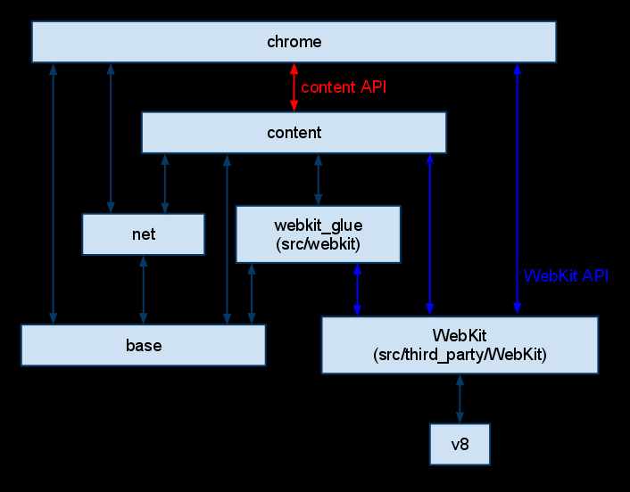

# 概览

​		Chromium主要分为两个部分（不包括其他库）：browser 和 renderer （其中包括Blink，即web engine）。browser 是主进程，代表所有的 UI 和 I/O。renderer 是由 browser 驱动的（通常是）每个标签的子进程。它嵌入Blink来进行布局和渲染。

# 顶级目录概览

当你浏览和搜索Chromium代码或检出Chromium代码时，你会注意到许多顶级目录：

- android_webview：为src/content提供一个外观，适合集成到Android平台。不打算用于单独的Android应用程序（APK）。更多关于Android WebView源代码组织的信息。
- apps：Chrome打包应用。
- base：所有子项目之间共享的通用代码。这里包含了诸如字符串操作、通用实用程序等内容。只有当它必须在其他一个以上的顶级项目之间共享时，才在此处添加内容。
- breakpad：Google的开源崩溃报告项目。此项目直接从Google Code的Subversion仓库中提取。
- build：所有项目共享的与构建相关的配置。
- cc：Chromium合成器实现。
- chrome：Chromium浏览器（见下文）。
- chrome/test/data：运行某些测试的数据文件。
- components：依赖于Content Module的组件目录作为它们依赖的最上层。
- content：多进程沙盒浏览器所需的核心代码（见下文）。
- device：跨平台抽象的常见低级硬件API。
- net：为Chromium开发的网络库。在webkit仓库中运行我们的简单test_shell时，可以单独使用它。另请参阅chrome/common/net。
- sandbox：试图阻止被黑客攻击的渲染器修改系统的沙盒项目。
- skia + third_party/skia：Google的Skia图形库。我们在ui/gfx中的额外类包装了Skia。
- sql：我们对sqlite的包装。
- testing：包含我们用于单元测试的Google开源的GTest代码。
- third_party：200+个小型和大型"外部"库，如图像解码器、压缩库和网页引擎Blink（因为它从WebKit继承了许可限制）。添加新包。
- .../blink/renderer：负责将HTML、CSS和脚本转换为绘制命令和其他状态更改的网页引擎。
- tools
- ui/gfx：共享的图形类。它们构成了Chromium UI图形的基础。
- ui/views：一个简单的UI开发框架，提供渲染、布局和事件处理。大部分的浏览器UI都是在这个系统中实现的。此目录包含基础对象。一些更特定于浏览器的对象在chrome/browser/ui/views中。
- url：Google的开源URL解析和规范化库。
- v8：V8 Javascript库。此项目直接从Google Code的Subversion仓库中提取。

这里有一个稍微过时的依赖关系图。特别是，WebKit被blink/renderer替代。较低的模块不能直接包含来自较高模块的代码（例如，content不能包含来自chrome的头文件），但可以使用embedder API与其通信。

