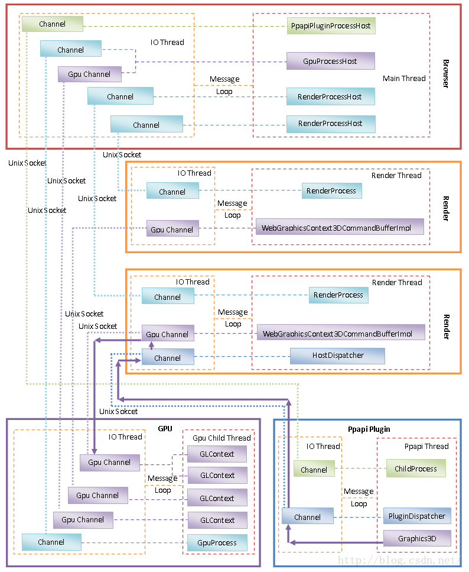
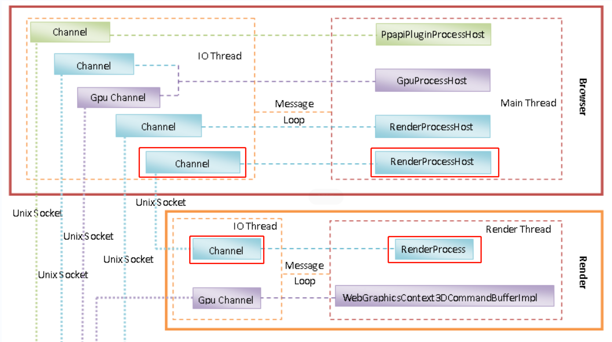
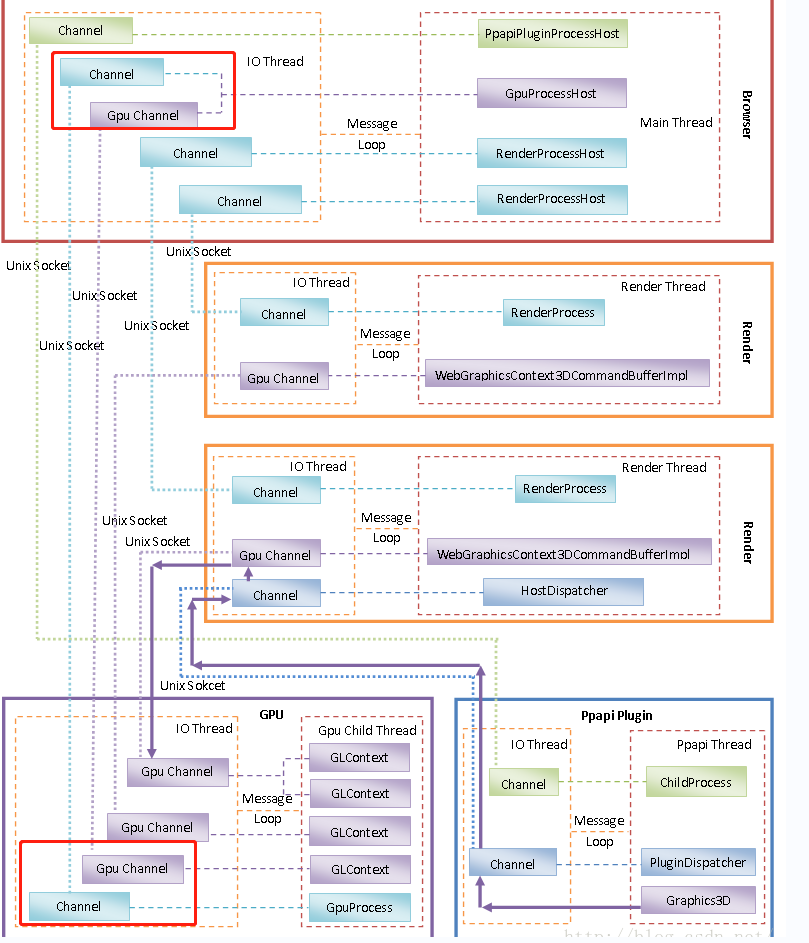
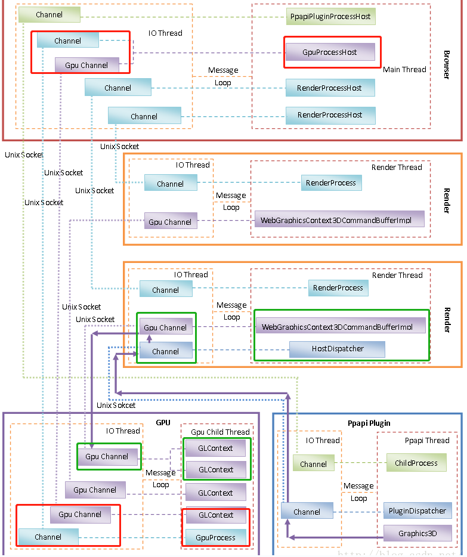
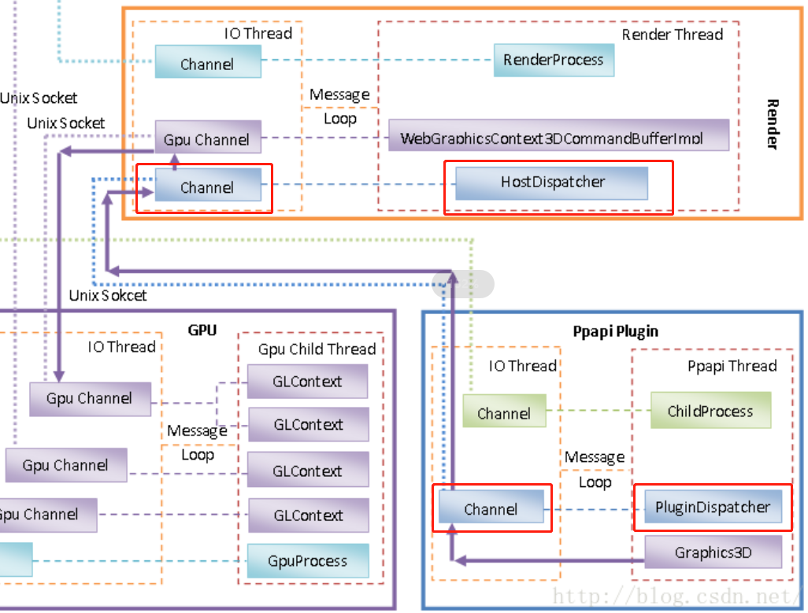

[TOC]

# Chromium 多进程架构简要介绍和学习计划

​		Chromium以多进程架构著称，它主要包含四类进程，分别是**Browser进程**、**Render进程**、**GPU进程**和**Plugin进程**。之所以要将Render进程、GPU进程和Plugin进程独立出来，是为了解决它们的不稳定性问题。也就是说，Render进程、GPU进程和Plugin进程由于不稳定而引发的 Crash 不会导致整个浏览器崩溃。本文就对Chromium 的多进程架构进行简要介绍，以及制定学习计划。

​		<u>一个 Chromium 实例只有一个 Browser 进程和一个 GPU 进程，但是 Render 进程和 Plugin 进程可能有若干个</u>。

- Browser 进程负责合成浏览器的 UI，包括标题栏、地址栏、工具栏以及各个 TAB 的网页内容。
- Render 进程负责解析和渲染网页的内容。一般来说，一个 TAB 就对应有一个 Render 进程。但是我们也可以设置启动参数，让具有相同的域名的 TAB 都运行在同一个 Render 进程中。简单起见，我们就假设一个 TAB就对应有一个 Render 进程。**<u>无论是 Browser 进程，还是 Render 进程，当启用了硬件加速渲染时，它们都是通过 GPU 进程来渲染 UI 的。</u>**不过 Render 进程是将网页内容渲染在一个离屏窗口的，例如渲染在一个Frame  Buffer Object 上，而 Browser 进程是直接将 UI 渲染在 Frame Buffer 上，也就是屏幕上。正因为如此，**Render 进程渲染好的网页 UI 要经过 Browser 进程合成之后，才能在屏幕上看到。**
- Plugin 进程，就是用来运行第三方开发的 Plugin，以便可以扩展浏览器的功能。例如，Flash 就是一个Plugin，它运行在独立的 Plugin 进程中。注意，为了避免创建过多的 Plugin 进程，同一个 Plugin 的不同实例都是运行在同一个 Plugin 进程中的。也就是说，不管是在同一个 TAB 的网页创建的同类 Plugin ，还是在不同 TAB 的网页创建的同类 Plugin ，它们都是运行在同一个 Plugin 进程中。

​        从上面的分析就可以知道，虽然每一个进程的职责不同，但是它们不是相互孤立的，而是需要相同协作，这样就需要执行**进程间通信（IPC）**。

​		例如，Render 进程渲染好自己负责解析的网页之后，需要通知 GPU 进程离屏渲染已经解决好的网页的 UI，接着还要通知 Browser 进程合成已经离屏渲染好的网页 UI。

同样，Browser 进程也需要通过 GPU 进程合成标题栏、地址栏、工具栏和各个网页的离屏 UI。

对于 Plugin 进程，Render 进程需要将一些网页的事件发送给它处理，这样 Render 进程就需要与 Plugin 进程进行通信。

反过来，Plugin 进程也需要通过 SDK 接口向 Render 进程请求一些网页相关的信息，以便可以扩展网页的内容。更进一步地，如果 Plugin 进程需要绘制自己的UI，那么它也需要通过 Render 进程间接地和 GPU 进程进行通信。 

​		以上分析的Browser进程、Render进程、GPU进程和Plugin进程，以及它们之间的通信方式，可以通过图片描述，如下所示：

​		从上图可以看到，每一个进程除了具有一个用来实现各自职责的主线程之外，都具有一个 IO 线程。**这个 IO 线程不是用来执行读写磁盘文件之类的 IO 的，而是用来负责执行 IPC 的**。

​		它们之所以称为 IO 线程，是因为它们操作的对象是一个文件描述符。即然操作的对象是文件描述符，当然也可以称之类 IO。当然，这些是特殊的 IO，具体来说，就是一个UNIX  Socket。UNIX Socket 是用来执行本地 IPC 的，它的概念与管道是类似的。只不过管道的通信是单向的，一端只能读，另一端只能写，而 UNIX Socket 的通信是双向的，每一端都既可读也可写。

​		关于IO线程的实现，简单来说，就是我们创建了一个UNIX Socket之后，就可以获得两个文件描述符。其中一个文件描述符作为 Server 端，增加到 Server 端的 IO 线程的消息循环中去监控，另一个文件描述符作为 Client 端，增加到 Client 端的 IO 线程的消息循环中去监控。对这些文件描述符的读写操作都封装在一个 Channel 对象。因此，Server 端和 Client 端都有一个对应的 Channel 对象。

​		当一个进程的主线程执行某个操作需要与另一个进程进行通信时，它的主线程就会将一个消息发送到 IO 线程的消息循环去。IO 线程在处理这个消息的时候，就会通过前面已经创建好的 UNIX Socket 转发给目标进程处理。目标进程在其 IO 线程接收到消息之后，一般也会通过其主线程的消息循环通知主线程执行相应的操作。这就是说，在 Chromium 里面，线程间通过消息循环进行通信，而进程间通过 UNIX Socket 进行通信的。

### Browser 与 Render 通信

​       我们先来看 Browser 进程和 Render 进程之间的通信。Browser 进程每启动一个 Render 进程，都会创建一个 **RenderProcessHost** 对象。Render 进程启动之后，会创建一个 **RenderProcess** 对象来描述自己。这样，Browser 进程和 Render 进程之间的通信就通过上述的 RenderProcessHost 对象和 RenderProcess 对象进行。

### Browser 与 GPU 通信

​		再来看 Browser 进程和 GPU 进程之间的通信。Browser 进程会创建一个 GpuProcessHost 对象来描述它启动的 GPU 进程，GPU 进程启动之后，会创建一个 GpuProcess 进程。这样，Browser 进程和 GPU 进程之间的通信就通过上述的 **GpuProcessHost** 对象和 GpuProcess 对象进行。<u>注意，这两个对象之间的 Channel 是用来执行信令类通信的。</u>例如，Browser 进程通过上述 Channel 可以通知 GPU 进程创建另外一个 Channel，专门用来执行 OpenGL 命令。这个<u>专门用来执行 OpenGL 命令的 Channel 称为 Gpu Channel。</u>

​		GPU 进程需要同时为多个进程执行 OpenGL 命令，而 OpenGL 命令又是具有状态的，因此，GPU 进程就需要为每一个 Client 进程创建一个 OpenGL 上下文，也就是一个 **GLContext** 对象。GPU 进程在为某一个 Client 进程执行 OpenGL 命令之前，需要找到之前为该Client进程创建的 GLContext 对象，并且将该 GLContext 对象描述的 OpenGL 上下文设置为当前的 OpenGL 上下文。

### Render 与 GPU 通信

​		Render 进程也需要与 GPU 进行通信，这意味着它们也像Browser进程一样，需要与 GPU 进程建立一对 Gpu Channel。

​		<u>不过，Render 进程不能像 Browser 进程一样，直接请求 GPU 进程创建一对 Gpu Channel。Render进程首先要向 Browser 进程发送一个创建 Gpu Channel 的请求，Browser 进程收到这个请求之后，再向 GPU 进程转发。GPU 接收到创建 Gpu Channel 的请求后，就会创建一个 UNIX Socket，并且将 Server 端的文件描述符封装在一个 GpuChannel 对象中，而将 Client 端的文件描述符返回给 Browser 进程，Browser 进程再返回到Render 进程，这样 Render 进程就可以创建一个 Client 端的 Gpu Channel 了。</u>

​		除了创建一个 Client 端的 Gpu Channel，Render 进程还会创建一个 WebGrahpicsContext3DCommandBufferImpl 对象，用来描述一个 Client端的 OpenGL 上下文，这个 OpenGL 上下文与 GPU 进程里面的 GLContext 对象描述的 OpenGL 上下文是对应的。

### Render 与 Plugin 通信

​       最后我们再来看 Render 进程与 Plugin 进程之间的通信。Chromium 支持两种类型的插件，一种是 NPAPI插件，另一种是 PPAPI 插件。NPAPI 插件是来自于 Mozilla 的一种插件机制，它被很多浏览器所支持，Chromium 也不例外。不过由于运行在 NPAPI 插件中的代码不能利用完全利用 Chromium 的沙箱技术和其他安全防护技术，现在 NPAPI 插件已经不被支持。因此这里我们就只关注 PPAPI 插件机制。

​       <u>Render 进程在解析网页的过程中发现需要创建一个 PPAPI 插件实例时，就会通知 Browser 进程创建一个Plugin 进程</u>。当然，如果对应的 Plugin 进程已经存在，就会利用它，而不是再启动一个。Browser 进程每启动一个 Plugin进程，都会创建一个 **PpapiPluginProcessHost** 对象描述它。Plugin 进程启动完成后，也会创建一个**ChildProcess**对象描述自己。

​		这样，以后 <u>Browser 进程和 Plugin 进程</u>就可以通过 **PpapiPluginProcessHost** 对象和 **ChildProcess** 对象之间的 Channel 进行通信。但是 Render 进程和 Plugin 之间的通信需要另外一个 Channel。因此，Browser 进程会进一步请求 Plugin 进程创建另外一个 Channel，用来在 Render 进程和 Plugin 进程之间进行通信。有了这个Channel 之后，Render 进程会创建一个 **HostDispatcher** 对象，而 Plugin 进程会创建一个 **PluginDispatcher** 对象，以后 Render 进程和 Plugin 进程之间的通信就通过上述两个对象进行。

​		前面提到，Plugin 进程有可能也需要渲染 UI，因此，PPAPI 插件机制提供了一个 Graphics3D 接口，PPAPI插件可以通过该接口与 GPU 进行通信。注意，Plugin 进程和 GPU 进程之间的通信，不同于 Render 进程和 GPU进程之间的通信，前者没有一个专门的 Channel 用来执行IPC通信。不过，Plugin 进程却可以利用之前它已经与Render 进程建立好的 Channel 进行通信。这意味着，**<u>Plugin 进程和GPU 进程之间的通信是要通过 Render 进程间接进行的。具体来说，就是 Plugin 进程首先要将 OpenGL 命令发送给 Render 进程，然后再由 Render 进程通过 Gpu Channel 发送给 GPU 进程执行。</u>**

​		在 Chromium 的运行过程中，进程之间需要发送很多 IPC 消息。不同类型的 IPC 消息会被不同的模块处理。为了能够快速地对这些 IPC 消息进行分发处理，Chromium 提供了一套灵活的消息发分机制。这套分发机制规定**<u>每一个 IPC 消息都具有一个 32 位的 Routing ID 和一个也是 32 位的 Type，其中，Type 的高 16 位描述的是 IPC消息类别，低 16 位没有特殊的意义。</u>**

​		基于IPC消息的类别信息，我们可以在 IO 线程中注册一系列的 MessageFilter，每一个 Filter 都可以指定自己所支持的 IPC 消息类别。IO 线程接收到一个 IPC 消息的时候，首先就会根据它的类别查找有没有注册相应的 MessageFilter。如果有的话，就快速地在 IO 线程分发给它处理。

​       此外，我们还可以 IO 线程中注册一个 Listener。当一个 IPC 消息没有相应的 MessageFilter 可以处理时，那么它接下来就会分发给上述注册的 Listener 处理。注意，这时候 Listener 处理代码运行在注册时的线程中。这个线程一般就是主线程。Listener 首先根据 IPC消息的 Type 进行分发给相应的 Handler 进行处理。如果没有相应的 Handler 可以处理，并且 Listener 支持注册 Router，那么就会再根据 IPC 消息的 Routing ID 分发相应的 Router 进行处理。

### 计划

​		关于Chromium的多进程架构，我们就介绍到这里。在接下来的一系列文章，我们再结合源代码详细分析它的实现细节。具体来说，包括以下几个情景分析：

   1. Render进程的启动过程分析；

   2. IPC消息分发机制分析；

   3. GPU进程的启动过程分析；

   4. Plugin进程的启动过程分析；

​		这里我们有意略过 Browse r进程的启动过程分析，这是因为 Browser 进程实际上就是 Android 应用程序进程，但是会涉及到一些Chromium 相关库的加载过程，而且有些 Chromium 相关库会由 Zygote 进程执行预加载处理，等到后面我们分析 WebView 的启动过程时，再详细分析 Browser 进程的启动过程。

​		同时，我们在分析 Render 进程的启动过程之后，并没有马上连贯分析 GPU 进程的启动过程，而是先分析一下前面描述过的 IPC 消息分发机制的具体实现，这是因为理解了 Render 进程的启动过程之后，我们就可以以它与 Browse r进程间的通信过程为情景，更好地理解 Chromium 的 IPC 消息分发机制。

​		当分析完成上述四个情景之后，我们还有一个重要任务，那就是分析 Render 进程和 Plugin 进程是如何通过 GPU 进程进行硬件加速渲染 UI 的。硬件加速渲染是智能设备获得流畅 UI 的必要条件。可以说，没有硬件加速渲染的支持，设备 UI 动画要达到 60fps ，是非常困难的。Chromium 使用硬件加速渲染的方式非常独特，具有以下特点：

   1. Render 进程和 Plugin 进程虽然调用了 OpenGL 的 API，但是这些API仅仅是一个代理接口，也就是这些API调用仅仅是将对应的命令发送给GPU进程处理而已。

   2. 有些OpenGL API，例如glBufferSubData，除了要发送对应的命令给GPU进程之外，还需要发送该命令关联的数据给GPU进程。这些数据往往很大的，这样就涉及到如何正确有效地传输它们给GPU进程。

   3. GPU进程只有一个用来处理Client端发送过来的OpenGL命令的线程，但是该线程却要同时服务多个Client端，也就是要同时为Render进程、Plugin进程以及Browser进程服务，每一个Client端都相当于有一个OpenGL上下文，这将会涉及到如何为每一个OpenGL上下文进行调度的问题。

   4. GPU进程同时服务的多个Client端，它们并不是相互孤立的，它们有时候存在一定的关联性。例如，Render进程渲染好的离屏UI，需要交给Browser进程合成，以便可以最终显示在屏幕中。也就是说，Browser进程需要等待Render进程渲染完成之后，才可以进行合成，否则就会得到不完整的UI。对于GPU进程来说，涉及到的问题就是如何在两个不同的OpengGL上下文中进行同步。

