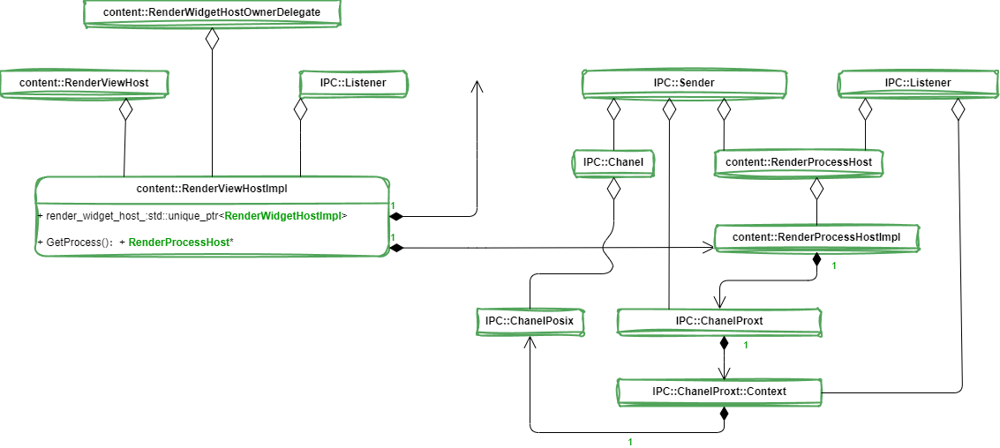
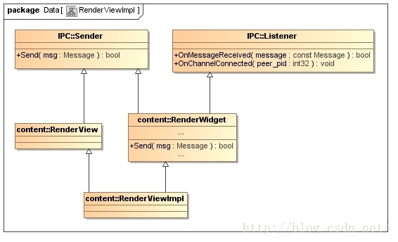
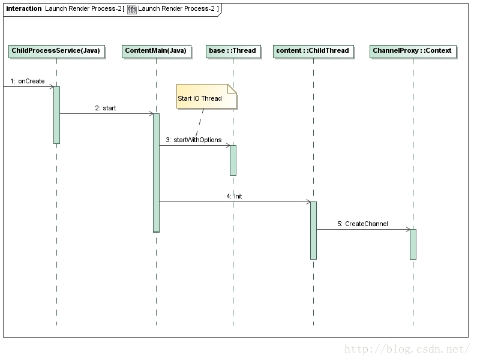

[TOC]


# Render进程启动过程分析

​		在配置多进程的情况下，Chromium 的网页渲染和 JS 执行在一个单独的进程中进行。这个进程称为**Render进程**，由 Browser 进程启动，它们通过**UNIX Socket**进行通信。本文就详细分析Chromium的Browser进程启动Render进程的过程。

Render 进程启动完成之后，将与 Browser 进程建立以下的 IPC 通道，如下图所示：


​       在 Browser 进程中，<u>一个 **RenderProcessHost** 对象用来描述它所启动的一个 Render 进程，而一个 **RenderViewHost** 对象用来描述运行在一个 Render 进程中的一个网页</u>，我们可以将它理解为浏览器中的一个 TAB。这两个对象在 Render 进程中都有一个对等体，它们分别是一个 RenderProcess 对象和一个 RenderView 对象。这里说的对等体，就是它们是 Browser 进程和 Render 进程进行 IPC 的两个端点，类似于 TCP/IP 网络堆栈中的层对层通信。例如，RenderViewHost 和 RenderView 之间的 IPC 通信，就代表了 Browser 进程请求 Render 进程加载、更新和渲染一个网页。

​       RenderViewHost 和 RenderView 之间的 IPC 通信，实际上是通过一个 UNIX Socket 进行的。<u>这个 UNIX Socket 的两端分别被封装为两个 Channel 对象，分别运行在 Browser 进程和 Render 进程各自的 IO 线程中</u>。这样 RenderViewHost 和 RenderView 之间的 IPC 通信就要通过上述的两个 Channel 对象进行。

​       在 Browser 进程中，由于 RenderViewHost 对象运行在主线程中，因此当它需要请求运行在 IO 线程中的 Channel 对象执行一次 IPC时，就要通过 IO 线程的消息循环进行。这符合我们在前面 Chromium 多线程模型设计和实现分析一文中提到的 Chromium 的多线程设计哲学：每一个对象都只运行在一个线程中，对象之间需要通信时就通过消息循环进行。同样，在 Render 进程中，由于 RenderView 对象运行在 Render 线程中，因此<u>当 Render 进程的 Channel 对象接收一个来自 Browser 进程的 RenderViewHost 对象的 IPC 消息时，需要通过 Render 线程的消息循环将 IPC 消息转发给 RenderView 进行处理。</u>从 RenderView 对象到 RenderViewHost 对象的通信过程也是类似的。

​		我们分析 Render 进程的启动过程，目的就是为了能够理解 Browser 进程和 Render 进程是如何建立 IPC 通道的，因为以后 Browser 进程与 Render 进程的交互和协作，都是通过这个 IPC 通道进行的。为此，我们在分析 Render 进程的启动过程中，将着重分析图中涉及到的各个对象的初始过程。

## Browser 进程

​		事实上，RenderProcessHost、RenderViewHost、RenderProcess 和 RenderView仅仅是定义了一个抽象接口，真正用来执行 IPC 通信的对象，是实现了上述抽象接口的一个实现者对象，这些实现者对象的类型以 Impl 结尾，因此，RenderProcessHost、RenderViewHost、RenderProcess和RenderView对应的实现者对象的类型就分别为RenderProcessHostImpl、RenderViewHostImpl、RenderProcessImpl和RenderViewImpl。

​		为了更好地理解 Render 进程的启动过程，我们有必要了解上述Impl对象的类关系图。

​		RenderViewHostImpl 对象的类关系图如下所示：



​		RenderViewHostImpl 类多重继承了 **RenderViewHost** 类和 **RenderWidgetHostOwnerDelegate** 类，RenderWidgetHostOwnerDelegate 是由 RenderViewHostImpl 和 RenderWidgetHostImpl 解开耦合的中间类，所以可以看到一些解析里面使用的是 RenderWidgetHostImpl。一般是在 RenderWidgetHostImpl 进行一些IPC消息，但是这里没有进行继承，是使用了成员变量来进行这些操作。

​		实际上，当RenderViewHostImpl 类需要发起一次 IPC 时，它是通过指向的一个RenderProcessHost接口进行的。该RenderProcessHost 接口指向的实际上是一个 RenderProcessHostImpl 对象，<u>它的类关系图如上图右边所示</u>。

​		RenderProcessHostImpl 类实现了 RenderProcessHost 接口，后者又多重继承了 Sender 和 Listener 类。

​		**<u>RenderProcessHostImpl 类有一个成员变量 channel_，它指向了一个 ChannelProxy 对象。ChannelProxy 类实现了 Sende r接口，RenderProcessHostImpl 类就是通过它来发送 IPC 消息的。</u>**

​		**<u>ChannelProxy 类有一个成员变量 context_，它指向了一个 ChannelProxy::Context 对象。ChannelProxy::Context 类实现了Listener 接口，因此它可以用来接收 IPC 消息。ChannelProxy 类就是通过 ChannelProxy::Context 类来发送和接收 IPC 消息的。</u>**

​		**<u>ChannelProxy::Context 类有一个类型为 Channel 的成员变量 channel_，它指向的实际上是一个 ChannelPosix 对象。ChannelPosix 类继承了 Channe l类，后者又实现了 Sender 接口。ChannelProxy::Context 类就是通过 ChannelPosix 类发送IPC消息的。</u>**

​		绕了一圈，总结来说，**<u>就是 RenderProcessHostImpl 类是分别通过 ChannelPosix 类和 ChannelProxy::Context 类来发送和接收IPC消息的。</u>**


## Render 进程

​		上面分析的 RenderViewHostImpl 对象和 RenderProcessHostImpl 对象都是运行在 Browser 进程的，接下来要分析的RenderViewImpl 类和 RenderProcessImpl 类是运行在 Render 进程的。

​		RenderViewImpl 对象的类关系图如下所示：



​		RenderViewImpl 类多重继承了 RenderView 类和 RenderWidget 类。RenderView 类实现了 Sender 接口。RenderWidget 类也实现了 Sender 接口，同时也实现了 Listener 接口，因此它可以用来发送和接收 IPC 消息。

​		RenderWidget 类实现了接口 Sender 的成员函数 **`Send`**，RenderViewImpl 类就是通过它来发送 IPC 消息的。RenderWidget 类的成员函数 **`Send`** 又是通过一个用来描述 Render 线程的 **RenderThreadImpl** 对象来发送IPC 类的。这个 RenderThreadImpl 对象可以通过调用 RenderThread 类的静态成员函数**`Get`**获得。

​       **RenderThreadImpl** 对象的类关系图如下所示：


​		RenderThreadImpl 类多重继承了 RenderThread 类和 ChildThread 类。RenderThread 类实现了 Sender 接口。ChildThread 类也实现 Sender 接口，同时也实现了 Listener 接口，因此它可以用来发送和接收 IPC 消息。

​		ChildThread 类有一个成员变量 channel_ ，它指向了一个 SyncChannel 对象。SyncChannel 类继承了上面提到的 ChannelProxy 类，因此，ChildThread 类通过其成员变量 channel_ 指向的 SyncChannel 对象可以发送IPC 消息。

​		从上面的分析又可以知道，ChannelProxy 类最终是通过 ChannelPosix 类发送 IPC 消息的，因此总结来说，就是 **<u>RenderThreadImpl 是通过 ChannelPosix 类发送 IPC 消息的</u>**。

​       接下来我们再来看 RenderProcessImpl 对象的类关系图，如下所示：


​		RenderProcessImpl 类继承了 RenderProcess 类，RenderProcess 类又继承了 ChildProcess 类。ChildProcess 类有一个成员变量 **io_thread_**，它指向了一个 Thread 对象。该 Thread 对象描述的就是 Render 进程的 IO 线程。


​		有了上面的基础知识之后，接下来我们开始分析 Render 进程的启动过程。我们将 Render 进程的启动过程划分为两部分：

- <u>第一部分是在 Browser 进程中执行的，它主要负责创建一个 UNIX Socket，并且将该 UNIX Socket 的 Client端描述符传递给接下来要创建的 Render 进程。</u>
- <u>第二部分是在 Render 进程中执行的，它负责执行一系列的初始化工作，其中之一就是将 Browser 进程传递过来的 UNIX Socket 的 Client 端描述符封装在一个 Channel 对象中，以便以后可以通过它来和 Browser 进程执行 IPC。</u>


​		Render 进程启动过程的第一部分子过程如下所示：


​		上图列出的仅仅是一些核心过程，接下来我们通过代码来分析这些核心过程。

​		我们首先了解什么情况下 Browser 进程会启动一个 Render 进程。**<u>当我们在 Chromium的 地址栏输入一个网址，然后进行加载的时候，Browser 进程经过判断，发现需要在一个新的 Render 进程中渲染该网址的内容时，就会创建一个 RenderViewHostImpl 对象，并且调用它的成员函数 CreateRenderView 触发启动一个新的 Render 进程。后面我们分析 WebView 加载一个 URL 的时候，就会看到触发创建 RenderViewHostImpl 对象的流程。</u>**

### RenderViewHostImpl

​     RenderViewHostImpl对象的创建过程，即RenderViewHostImpl类的构造函数的实现如下所示：

```c++
RenderViewHostImpl::RenderViewHostImpl(
    SiteInstance* instance,
    RenderViewHostDelegate* delegate,
    RenderWidgetHostDelegate* widget_delegate,
    int routing_id,
    int main_frame_routing_id,
    bool swapped_out,
    bool hidden)
    : RenderWidgetHostImpl(widget_delegate,
                           instance->GetProcess(),
                           routing_id,
                           hidden),
      ...... {
 
  ......
}
```

#### SiteInstanceImpl

​      这里我们主要关注类型为 SiteInstance 的参数 instance，它指向的实际上是一个 SiteInstanceImpl 对象，用来描述 Chromium 当前加载的一个网站实例。RenderViewHostImpl 类的构造函数调用该 SiteInstanceImpl 对象的成员函数 GetProcess 获得一个 RenderProcessHostImpl 对象，如下所示：

```c++
RenderProcessHost* SiteInstanceImpl::GetProcess() {
  ......
 
  // Create a new process if ours went away or was reused.
  if (!process_) {
    BrowserContext* browser_context = browsing_instance_->browser_context();
 
    // If we should use process-per-site mode (either in general or for the
    // given site), then look for an existing RenderProcessHost for the site.
    bool use_process_per_site = has_site_ &&
        RenderProcessHost::ShouldUseProcessPerSite(browser_context, site_);
    if (use_process_per_site) {
      process_ = RenderProcessHostImpl::GetProcessHostForSite(browser_context,
                                                              site_);
    }
 
    // If not (or if none found), see if we should reuse an existing process.
    if (!process_ && RenderProcessHostImpl::ShouldTryToUseExistingProcessHost(
            browser_context, site_)) {
      process_ = RenderProcessHostImpl::GetExistingProcessHost(browser_context,
                                                               site_);
    }
 
    // Otherwise (or if that fails), create a new one.
    if (!process_) {
      if (g_render_process_host_factory_) {
        process_ = g_render_process_host_factory_->CreateRenderProcessHost(
            browser_context, this);
      } else {
        StoragePartitionImpl* partition =
            static_cast<StoragePartitionImpl*>(
                BrowserContext::GetStoragePartition(browser_context, this));
        process_ = new RenderProcessHostImpl(browser_context,
                                             partition,
                                             site_.SchemeIs(kGuestScheme));
      }
    }
 
    ......
  }
  ......
 
  return process_;
}
```

​       这个函数定义在文件 content/browser/site_instance_impl.cc 中。

​       SiteInstanceImpl 对象的成员变量 process_ 是一个 **RenderProcessHost** 指针，当它的值等于 NULL 的时候，就表示 Chromium 还没有为当前正在处理的一个 SiteInstanceImpl 对象创建过 Render 进程，这时候就需要创建一个 RenderProcessHostImpl 对象，并且保存在成员变量 process_ 中，以及返回给调用者，以便调用者接下来可以通过它启动一个 Render 进程。

​		另一方面，如果 SiteInstanceImpl 对象的成员变量 process_ 已经指向了一个 RenderProcessHostImpl 对象，那么就直接将该 RenderProcessHostImpl 对象返回给调用者即可。


​		注意上述 RenderProcessHostImpl 对象的创建过程：

   1. <u>如果 Chromium 启动时，指定了**同一个网站**的所有网页都在同一个 Render 进程中加载，即本地变量 use_ process_ per_site 的值等于 true，那么这时候 **SiteInstanceImpl** 类的成员函数 GetProcess 就会先调用RenderProcessHostImpl 类的静态函 数GetProcessHostForSite 检查之前是否已经为当前正在处理的SiteInstanceImpl 对象描述的网站创建过 Render 进程。如果已经创建过，那么就可以获得一个对应的RenderProcessHostImpl 对象。</u>

   2. <u>如果按照上面的方法找不到一个相应的 RenderProcessHostImpl 对象，本来就应该要创建一个新的 Render 进程了，也就是要创建一个新的 RenderProcessHostImpl 对象了。但是由于当前创建的 Render 进程已经超出预设的最大数量了，这时候就要复用前面已经启动的 Rende r进程，即使这个 Render 进程加载的是另一个网站的内容。</u>

   3. <u>如果通过前面两步仍然找不到一个对应的 RenderProcessHostImpl 对象，这时候就真的是需要创建一个RenderProcessHostImpl 对象了。取决于 SiteInstanceImpl 类的静态成员变量g_render_process_host_factory_ 是否被设置，创建一个新的 RenderProcessHostImpl 对象的方式有所不同。如果该静态成员变量被设置了指向一个 RenderProcessHostFactory 对象，那么就调用该RenderProcessHostFactory 对象的成员函数 CreateRenderProcessHost 创建一个从 RenderProcessHost 类继承下来的子类对象。否则的话，就直接创建一个 RenderProcessHostImpl 对象。</u>

​        这一步执行完成后，回到 RenderViewHostImpl 类的构造函数中，从这里返回的 RenderProcessHostImpl 对象用来初始化 RenderViewHostImpl 类的父类 RenderWidgetHostImpl ，如下所示：

```c++
RenderWidgetHostImpl::RenderWidgetHostImpl(RenderWidgetHostDelegate* delegate,
                                           RenderProcessHost* process,
                                           int routing_id,
                                           bool hidden)
    : ......,
      process_(process),
      ...... {
  ......
}
```

​		这个函数定义在文件 content/browser/renderer_host/render_widget_host_impl.cc 中。

​		参数 process 指向的 **RenderProcessHostImpl** 对象保存在 RenderWidgetHostImpl 类的成员变量 process_中，以后就可以通过 **RenderWidgetHostImpl** 类的成员函数 GetProcess 获得该RenderProcessHostImpl 对象，如下所示：

```c++
RenderProcessHost* RenderWidgetHostImpl::GetProcess() const {
  return process_;
}
```

​      有了 RenderProcessHostImpl 之后，接下来我们就开始分析 RenderViewHostImpl 类的成员函数CreateRenderView 创建一个新的 Render 进程的过程了，如下所示：

```c++
bool RenderViewHostImpl::CreateRenderView(
    const base::string16& frame_name,
    int opener_route_id,
    int proxy_route_id,
    int32 max_page_id,
    bool window_was_created_with_opener) {
  ......
 
  if (!GetProcess()->Init())
    return false;
 
  ......
 
}
```

​		这个函数定义在文件 content/browser/renderer_host/render_view_host_impl.cc 中。

​		RenderViewHostImpl 类的成员函数 CreateRenderView 首先调用从父类 RenderWidgetHostImpl 继承下来的成员函数 GetProcess 获得一个 RenderProcessHostImpl 对象，接着再调用该 RenderProcessHostImpl 对象的成员函数 Init 检查是否需要为当前加载的网页创建一个新的 Render 进程。

​		RenderProcessHostImpl 类的成员函数 Init 的实现如下所示：

```c++
bool RenderProcessHostImpl::Init() {
  // calling Init() more than once does nothing, this makes it more convenient
  // for the view host which may not be sure in some cases
  if (channel_)
    return true;
 
  ......
 
  // Setup the IPC channel.
  const std::string channel_id =
      IPC::Channel::GenerateVerifiedChannelID(std::string());
  channel_ = IPC::ChannelProxy::Create(
      channel_id,
      IPC::Channel::MODE_SERVER,
      this,
      BrowserThread::GetMessageLoopProxyForThread(BrowserThread::IO).get());
 
  ......
 
  CreateMessageFilters();
 
  ......
 
  if (run_renderer_in_process()) {
    ......
    in_process_renderer_.reset(g_renderer_main_thread_factory(channel_id));
 
    base::Thread::Options options;
    ......
    options.message_loop_type = base::MessageLoop::TYPE_DEFAULT;
    
    in_process_renderer_->StartWithOptions(options);
 
    g_in_process_thread = in_process_renderer_->message_loop();
 
    ......
  } else {
    ......
 
    CommandLine* cmd_line = new CommandLine(renderer_path);
    ......
    AppendRendererCommandLine(cmd_line);
    cmd_line->AppendSwitchASCII(switches::kProcessChannelID, channel_id);
 
    ......
 
    child_process_launcher_.reset(new ChildProcessLauncher(
        new RendererSandboxedProcessLauncherDelegate(channel_.get()),
        cmd_line,
        GetID(),
        this));
 
    ......
  }
 
  return true;
}
```

​		RenderProcessHostImpl 类有一个类型为 scoped_ptr<IPC::ChannelProxy > 成员变量 channel_，当它引用了一个 IPC::ChannelProxy 对象的时候，就表明已经为当前要加载的网而创建过 Render 进程了，因此在这种情况下，就无需要往前执行了。

​		我们假设到目前为止，还没有为当前要加载的网页创建过 Render 进程。接下来 RenderProcessHostImpl 类的成员函数 Init 就会做以下四件事情：

#### Init

  1. 先调用 IPC::Channel 类的静态成员函数 **`GenerateVerifiedChannelID`** 生成一个接下来用于创建 UNIX Socket 的名字，接着再以该名字为参数，调用 IPC::ChannelProxy 类的静态成员函数 **`Create`** 创建一个用于执行 IPC 的 Channel，该 Channel 就保存在 RenderProcessHostImpl 类的成员变量 channel_ 中。
  2. 调用 RenderProcessHostImpl 类的成员函数 CreateMessageFilters 创建一系列的 Message Filter，用来过滤 IPC 消息。
  3. <u>如果所有网页都在 Browser 进程中加载，即不单独创建 Render 进程来加载网页，那么这时候调用父类RenderProcessHost 的静态成员函数 run_renderer_in_process 的返回值就等于 true。在这种情况下，就会通过在本进程（即 Browser 进程）创建一个**新的线程**来渲染网页。</u>这个线程由 RenderProcessHostImpl 类的静态成员变量 g_renderer_main_thread_factory 描述的一个函数创建，它的类型为**InProcessRendererThread**。InProcessRendererThread 类继承了 base::Thread 类，从前面 Chromium 多线程模型设计和实现分析一文可以知道，当调用它的成员函数 StartWithOptions 的时候，新的线程就会运行起来。这时候如果我们再调用它的成员函数 message_loop，就可以获得它的 Message Loop。有了这个Message Loop 之后，以后就可以向它发送消息了。

   4. 如果网页要单独的 Render 进程中加载，那么调用创建一个命令行，并且以该命令行以及前面创建的IPC::ChannelProxy 对象为参数，创建一个 **ChildProcessLauncher** 对象，而该 ChildProcessLauncher 对象在创建的过程，就会启动一个新的 Render 进程。


   接下来，我们主要分析第 1、3 和 4 件事情，第 2 件事情在接下来的一篇文章中分析 IPC 消息分发机制时再分析。

### IPC::Channel

​		第一件事情涉及到 IPC::Channel 类的静态成员函数 GenerateVerifiedChannelID 和 IPC::ChannelProxy 类的静态成员函数**`Create`**。

​		IPC::Channel 类的静态成员函数 GenerateVerifiedChannelID 的实现如下所示：

```c++
std::string Channel::GenerateVerifiedChannelID(const std::string& prefix) {
  // A random name is sufficient validation on posix systems, so we don't need
  // an additional shared secret.
 
  std::string id = prefix;
  if (!id.empty())
    id.append(".");
 
  return id.append(GenerateUniqueRandomChannelID());
}
```

​		IPC::Channel 类的静态成员函数 GenerateVerifiedChannelID 实际上是调用另外一个静态成员函数GenerateUniqueRandomChannelID 生成一个唯一的随机名字，后者的实现如下所示：

```c++
base::StaticAtomicSequenceNumber g_last_id;
 
......
 
std::string Channel::GenerateUniqueRandomChannelID() {
  ......
 
  int process_id = base::GetCurrentProcId();
  return base::StringPrintf("%d.%u.%d",
      process_id,
      g_last_id.GetNext(),
      base::RandInt(0, std::numeric_limits<int32>::max()));
}
```

​		从这里就可以看到，这个用来创建 UNIX Socket 的名字由当前进程的 PID、一个顺序数和一个随机数通过 "." 符号连接而成的。

​		回到 RenderProcessHostImpl 类的成员函数 Init 中，有了用来创建 UNIX Socket 的名字之后，就可以调用IPC::ChannelProxy 类的静态成员函数 **`Create`** 创建一个 Channel 了，如下所示：

```c++
scoped_ptr<ChannelProxy> ChannelProxy::Create(
    const IPC::ChannelHandle& channel_handle,
    Channel::Mode mode,
    Listener* listener,
    base::SingleThreadTaskRunner* ipc_task_runner) {
  scoped_ptr<ChannelProxy> channel(new ChannelProxy(listener, ipc_task_runner));
  channel->Init(channel_handle, mode, true);
  return channel.Pass();
}
```

​		IPC::ChannelProxy 类的静态成员函数 **`Create`** 首先是创建了一个 ChannelProxy 对象，然后再调用该ChannelProxy 对象的成员函数 Init 执行初始化工作，最后返回该 ChannelProxy 对象给调用者。

#### ChannelProxy 

​		ChannelProxy 对象的创建过程如下所示：

```c++
ChannelProxy::ChannelProxy(Listener* listener,
                           base::SingleThreadTaskRunner* ipc_task_runner)
    : context_(new Context(listener, ipc_task_runner)), did_init_(false) {
}
```

​      ChannelProxy 类的构造函数主要是创建一个 **ChannelProxy::Context** 对象，并且将该ChannelProxy::Context 对象保存在成员变量 context_ 中。

​      ChannelProxy::Context 对象的创建过程如下所示：

```c++
ChannelProxy::Context::Context(Listener* listener,
                               base::SingleThreadTaskRunner* ipc_task_runner)
    : listener_task_runner_(base::ThreadTaskRunnerHandle::Get()),
      listener_(listener),
      ipc_task_runner_(ipc_task_runner),
      ......
      message_filter_router_(new MessageFilterRouter()),
      ...... {
  ......
}
```

​       ChannelProxy::Context 类有三个成员变量是需要特别关注的，它们分别是：

1. **listenter_task_runner_** 。这个成员变量的类型为 scoped_refptr< base::**SingleThreadTaskRunner** >，它指向的是一个**SingleThreadTaskRunner**对象。这个SingleThreadTaskRunner对象通过调用ThreadTaskRunnerHandle类的静态成员函数Get获得。从前面Chromium多线程模型设计和实现分析一文可以知道，ThreadTaskRunnerHandle 类的静态成员函数 Get 返回的 SingleThreadTaskRunner 对象实际上是当前线程的一个 **MessageLoopProxy** 对象，通过该 MessageLoopProxy 对象可以向当前线程的消息队列发送消息。当前线程即为 Browser 进程的主线程。
2. **listener_** 。这是一个 IPC::Listener 指针，它的值设置为参数 listener 的值。从前面的图可以知道，RenderProcessHostImpl 类实现了 IPC::Listener 接口，而且从前面的调用过程过程可以知道，参数 listener 指向的就是一个 RenderProcessHostImpl 对象。**以后正在创建的 ChannelProxy::Context 对象在 IO 线程中接收到 Render 进程发送过来的 IPC 消息之后，就会转发给成员变量 listener_ 指向的RenderProcessHostImpl 对象处理，但是并不是让后者直接在 IO 线程处理，而是让后者在成员变量listener_task_runner_ 描述的线程中处理，即 Browser 进程的主线程处理。**也就是说，ChannelProxy::Context 类的成员变量 listener_task_runner_ 和 listener_ 是配合在一起使用的，后面我们分析 IPC 消息的分发机制时就可以看到这一点。
3. **ipc_task_runner_**。这个成员变量与前面分析的成员变量 listener_task_runner 一样，类型都为scoped_refptr<base::SingleThreadTaskRunner >，指向的者是一个 SingleThreadTaskRunner 对象。不过，这个 SingleThreadTaskRunner 对象由参数 ipc_task_runner 指定。**从前面的调用过程可以知道，这个SingleThreadTaskRunner 对象实际上是与 Browser 进程的 IO 线程关联的一个 MessageLoopProxy 对象。这个 MessageLoopProxy 对象用来接收 Render 进程发送过来的 IPC 消息。也就是说，Browser 进程在 IO 线程中接收 IPC 消息。**

​    ChannelProxy::Context 类还有一个重要的成员变量 message_filter_router_ ，它指向一个**MessageFilterRouter** 对象，用来过滤 IPC 消息，后面我们分析 IPC 消息的分发机制时再详细分析。

​    回到 ChannelProxy 类的静态成员函数 Create 中，创建了一个 ChannelProxy 对象之后，接下来就调用它的成员函数 Init 进行初始化，如下所示：

```c++
void ChannelProxy::Init(const IPC::ChannelHandle& channel_handle,
                        Channel::Mode mode,
                        bool create_pipe_now) {
  ......
 
  if (create_pipe_now) {
    ......
    context_->CreateChannel(channel_handle, mode);
  } else {
    context_->ipc_task_runner()->PostTask(
        FROM_HERE, base::Bind(&Context::CreateChannel, context_.get(),
                              channel_handle, mode));
  }
 
  // complete initialization on the background thread
  context_->ipc_task_runner()->PostTask(
      FROM_HERE, base::Bind(&Context::OnChannelOpened, context_.get()));
 
  ......
}
```

​		从前面的调用过程知道，参数 channel_handle 描述的是一个 UNIX Socket 名称，参数 mode 的值为IPC::Channel::MODE_SERVER，参数 create_pipe_now 的值为 true。<u>这样，ChannelProxy 类的成员函数 Init 就会马上调用前面创建的 ChannelProxy::Context 对象的成员函数 CreateChannel 创建一个 IPC 通信通道，也就是在当前线程中创建一个 IPC 通信通道 。</u>

​      另一个方面，如果参数 create_pipe_now 的值等于 false，那么 ChannelProxy 类的成员函数 Init 就不是在当前线程创建 IPC 通信通道，而是在 **IO 线程中创建**。因为它先通过前面创建的 ChannelProxy::Context 对象的成员函数 ipc_task_runner 获得其成员变量 ipc_task_runner_ 描述的 SingleThreadTaskRunner 对象，然后再将创建IPC 通信通道的任务发送到该 SingleThreadTaskRunner 对象描述的 IO 线程的消息队列去。当该任务被处理时，就会调用 ChannelProxy::Context 类的成员函数 CreateChannel。

​      当调用 ChannelProxy::Context 类的成员函数 CreateChannel 创建好一个 IPC 通信通道之后，ChannelProxy类的成员函数 Init 还会向当前进程的 IO 线程的消息队列发送一个消息，该消息绑定的是 ChannelProxy::Context类的成员函数 **`OnChannelOpened`**。因此，接下来我们就分别分析 ChannelProxy::Context 类的成员函数**`CreateChannel`** 和 **`OnChannelOpened`**。

​       ChannelProxy::Context类的成员函数**`CreateChannel`**的实现如下所示：

```c++
void ChannelProxy::Context::CreateChannel(const IPC::ChannelHandle& handle,
                                          const Channel::Mode& mode) {
  ......
  channel_ = Channel::Create(handle, mode, this);
}
```

​      ChannelProxy::Context 类的成员函数 CreateChannel 调用 Channel 类的成员函数 Create 创建了一个 IPC 通信通道，如下所示：

```c++
scoped_ptr<Channel> Channel::Create(
    const IPC::ChannelHandle &channel_handle, Mode mode, Listener* listener) {
  return make_scoped_ptr(new ChannelPosix(
      channel_handle, mode, listener)).PassAs<Channel>();
}
```

​		从这里可以看到，对于 Android 平台来说，IPC 通信通道通过一个 ChannelPosix 对象描述，该ChannelPosix 对象的创建过程如下所示：

```c++
ChannelPosix::ChannelPosix(const IPC::ChannelHandle& channel_handle,
                           Mode mode, Listener* listener)
    : ChannelReader(listener),
      mode_(mode),
      ......
      pipe_(-1),
      client_pipe_(-1),
#if defined(IPC_USES_READWRITE)
      fd_pipe_(-1),
      remote_fd_pipe_(-1),
#endif  // IPC_USES_READWRITE
      pipe_name_(channel_handle.name),
      ...... {
  ......
  if (!CreatePipe(channel_handle)) {
    ......
  }
}
```

​		从前面的调用过程可以知道，参数 channel_handle 描述的是一个 UNIX Socket 名称，参数 mode 的值等于IPC::Channel::MODE_SERVER，参数 listener 指向的是前面创建的 ChannelProxy::Context 对象。

​		ChannelPosix 类继承了 ChannelReader 类，后者用来读取从 Render 进程发送过来的 IPC 消息，并且将读取到的 IPC 消息发送给参数 listener 描述的 ChannelProxy::Context 对象，因此这里会将参数 listener 描述的ChannelProxy::Context 对象传递给 ChannelReader 的构造函数。

​		ChannelPosix 类通过 UNIX Socket 来描述 IPC 通信通道，这个 UNIX Socket 的 Server 端和 Client 文件描述符分别保存在成员变量 pipe_ 和 client_pipe_ 中。如果定义了宏 IPC_USES_READWRITE，那么当发送的消息包含有文件描述时，就会使用另外一个专用的 UNIX Socket 来传输文件描述符给对方。这个专用的 UNIX Socket 的Server 端和 Client 端文件描述符保存在成员变量 fd_pipe_ 和 remote_fd_pipe_ 中。后面分析 IPC 消息的分发过程时，我们再详细分析这一点。

​      ChannelPosix 类的构造函数最后调用了另外一个成员函数 CreatePipe 开始创建 IPC 通信通道，如下所示：

```c++
bool ChannelPosix::CreatePipe(
    const IPC::ChannelHandle& channel_handle) {
  ......
 
  int local_pipe = -1;
  if (channel_handle.socket.fd != -1) {
    ......
  } else if (mode_ & MODE_NAMED_FLAG) {
    ......
  } else {
    local_pipe = PipeMap::GetInstance()->Lookup(pipe_name_);
    if (mode_ & MODE_CLIENT_FLAG) {
      if (local_pipe != -1) {
        ......
        local_pipe = HANDLE_EINTR(dup(local_pipe));
        ......
      } else {
        ......
 
        local_pipe =
            base::GlobalDescriptors::GetInstance()->Get(kPrimaryIPCChannel);
      }
    } else if (mode_ & MODE_SERVER_FLAG) {
      ......
      base::AutoLock lock(client_pipe_lock_);
      if (!SocketPair(&local_pipe, &client_pipe_))
        return false;
      PipeMap::GetInstance()->Insert(pipe_name_, client_pipe_);
    } 
    ......
  }
 
#if defined(IPC_USES_READWRITE)
  // Create a dedicated socketpair() for exchanging file descriptors.
  // See comments for IPC_USES_READWRITE for details.
  if (mode_ & MODE_CLIENT_FLAG) {
    if (!SocketPair(&fd_pipe_, &remote_fd_pipe_)) {
      return false;
    }
  }
#endif  // IPC_USES_READWRITE
 
  ......
 
  pipe_ = local_pipe;
  return true;
}
```

​		**ChannelHandle** 类除了用来保存 UNIX Socket 的名称之外，还可以用来保存与该名称对应的 UNIX Socket 的文件描述符。在我们这个情景中，参数 channel_handle 仅仅保存了即将要创建的 UNIX Socket 的名称。

​		ChannelPosix 类的成员变量 mode_ 的值等于 **IPC::Channel::MODE_SERVER**，它的 MODE_NAMED_FLAG位等于 0。Render 进程启动之后，也会调用到 ChannelPosix 类的成员函数 **`CreatePipe`** 创建一个 Client 端的IPC 通信通道，那时候用来描述 Client 端 IPC 通信通道的 ChannelPosix 对象的成员变量 mode_ 的值**IPC::Channel::MODE_CLIENT**，它的 MODE_NAMED_FLAG 位同样等于 0。因此，无论是在 Browser 进程中创建的 Server 端 IPC 通信通道，还是在 Render 进程中创建的 Client 端 IPC 通信通道，在调用 ChannelPosix 类的成员函数 CreatePipe 时，都按照以下逻辑进行。

​       对于 Client 端的 IPC 通信通道，即 ChannelPosix 类的成员变量 mode_ 的 MODE_CLIENT_FLAG 位等于 1 的情况，**首先是在一个 Pipe Map 中检查是否存在一个 UNIX Socket 文件描述符与成员变量 pipe_name_ 对应。如果存在，那么就使用该文件描述符进行 IPC 通信。如果不存在，那么再到 Global Descriptors 中检查是否存在一个 UNIX Socket 文件描述符与常量 kPrimaryIPCChannel 对应。如果存在，那么就使用该文件描述符进行 IPC 通信。实际上，当网页不是在独立的 Render 进程中加载时，执行的是前一个逻辑，而当网页是在独立的 Render 进程中加载时，执行的是后一个逻辑。**

​       Chromium 为了能够统一地处理网页在独立 Render 进程和不在独立 Render 进程加载两种情况，会对后者进行一个抽象，即会假设后者也是在独立的 Render 进程中加载一样。这样，Browser 进程在加载该网页时，同样会创建一个 RenderProcess对象，不过该 RenderProcess 对象没有对应的一个真正的进程，对应的仅仅是Browser 进程中的一个线程。也就是这时候，RenderPocessHost 对象和 RenderProcess 对象执行的仅仅是进程内通信而已，不过它们仍然是按照进程间的通信规则进行，也就是通过 IO 线程来间接进行。

​		**<u>不过，在进程内建立 IPC 通信通道和在进程间建立 IPC 通信通道的方式是不一样的。具体来说，就是在进程间建立 IPC 通信通道，需要将描述该通道的 UNIX Socket 的 Client 端文件描述符从 Browser 进程传递到 Render进程，Render 进程接收到该文件描述符之后，就会以 kPrimaryIPCChannel 为键值保存在 Global Descriptors中。而在进程内建立 IPC 通信通道时，描述 IPC 通信通道的 UNIX Socke t的 Client 端文件描述符直接以 UNIX Socket 名称为键值，保存在一个 Pipe Map 中即可。</u>**后面我们分析在进程内在进程间创建 Client 端 IPC 通信通道时，会继续看到这些相关的区别。

​		对于 Server 端的 IPC 通信通道，即 ChannelPosix 类的成员变量 mode_ 的 MODE_SERVER_FLAG 位等于1的情况，ChannelPosix 类的成员函数 CreatePipe 调用函数 SocketPair 创建了一个 UNIX Socket，其中，Server 端文件描述符保存在成员变量 pipe_ 中，而 Client 端文件描述符保存在成员变量 client_pipe_ 中，并且 Client 端文件描述符还会以与前面创建的 UNIX Socket 对应的名称为键值，保存在一个 Pipe Map 中，这就是为建立进程内IPC 通信通道而准备的。

​		最后，如果定义了 IPC_USES_READWRITE 宏，如前面提到的，那么还会继续创建一个专门用来在进程间传递文件描述的 UNIX Socket，该 UNIX Socket 的 Server 端和 Client 端文件描述符分别保存在成员变量 fd_pipe_ 和remote_fd_pipe_ 中。

​		这一步执行完成之后，一个 Server 端 IPC 通信通道就创建完成了。回到 ChannelProxy 类的成员函数 Init中，它接下来是发送一个消息到 Browser 进程的 IO 线程的消息队列中，该消息绑定的是 ChannelProxy::Context类的成员函数 OnChannelOpened，它的实现如下所示：

```c++
void ChannelProxy::Context::OnChannelOpened() {
  ......
 
  if (!channel_->Connect()) {
    OnChannelError();
    return;
  }
 
  ......
}
```

​      从前面的分析可以知道，ChannelProxy::Context 类的成员变量 channel_ 指向的是一个 ChannelPosix 对象，这里调用它的成员函数 Connect 将它描述的 IPC 通信通道交给当前进程的 IO 线程进行监控。

​      ChannelPosix 类的成员函数 Connect 的实现如下所示：

```c++
bool ChannelPosix::Connect() {
  ......
 
  bool did_connect = true;
  if (server_listen_pipe_ != -1) {
    ......
  } else {
    did_connect = AcceptConnection();
  }
  return did_connect;
}
```

​      当 ChannelPosix 类的成员变量 server_listen_pipe_ 的值不等于 -1 时，表示它描述的是一个用来负责监听 IPC通信通道连接消息的 Socket 中，也就是这个 Socket 不是真正用来执行 Browser 进程和 Render 进程之间的通信的，而是 Browser 进程首先对 ChannelPosix 类的成员变量 server_listen_pipe_ 描述的 Socket 进行 **listen**，接着 Render 进程通过 **connect** 连接到该 Socket，使得 Browser 进程 accepet 到一个新的 Socket，然后再通过这个新的 Socket 与 Render 进程执行 IPC。

​      在我们这个情景中，ChannelPosix 类的成员变量 server_listen_pipe_ 的值等于 -1，因此接下来 ChannelPosix 类的成员函数 Connect 调用了另外一个成员函数 AcceptConnection，它的实现如下所示：

```c++
bool ChannelPosix::AcceptConnection() {
  base::MessageLoopForIO::current()->WatchFileDescriptor(
      pipe_, true, base::MessageLoopForIO::WATCH_READ, &read_watcher_, this);
  QueueHelloMessage();
 
  if (mode_ & MODE_CLIENT_FLAG) {
    // If we are a client we want to send a hello message out immediately.
    // In server mode we will send a hello message when we receive one from a
    // client.
    waiting_connect_ = false;
    return ProcessOutgoingMessages();
  } else if (mode_ & MODE_SERVER_FLAG) {
    waiting_connect_ = true;
    return true;
  } else {
    NOTREACHED();
    return false;
  }
}
```

​       ChannelPosix 类的成员函数 AcceptConnection 首先是获得与当前进程的 IO 线程关联的一个MessageLoopForIO 对象，接着再调用该 MessageLoopForIO 对象的成员函数 WatchFileDescriptor 对成员变量pipe_  描述的一个 UNIX Socket 进行监控。MessageLoopForIO 类的成员函数 WatchFileDescriptor 最终会调用到在前面 Chromium 多线程模型设计和实现分析一文中提到的 MessagePumpLibevent 对该 UNIX Socket 进行监控。这意味着当该 UNIX Socket 有新的 IPC 消息需要接收时，当前正在处理的 ChannelPosix 对象的成员函数OnFileCanReadWithoutBlocking 就会被调用。

​       接下来，ChannelPosix 类的成员函数 AcceptConnection 还会调用另外一个成员函数**`QueueHelloMessage`**创建一个 Hello Message，并且将该 Message 添加到内部的一个 IPC 消息队列去等待发送给对方进程。执行 IPC的双方，就是通过这个 Hello Message 进行握手的。<u>具体来说，就是 Server 端和 Client 端进程建立好连接之后，由 Client 端发送一个 Hello Message 给 Server 端，Server 端接收到该 Hello Message 之后，就认为双方已经准备就绪，可以进行 IPC 了。</u>

​       因此，如果当前正在处理的 ChannelPosix 对象描述的是 Client 端的通信通道，即它的成员变量 mode_ 的MODE_CLIENT_FLAG 位等于 1，那么 ChannelPosix 类的成员函数 AcceptConnection 就会马上调用另外一个成员函数**`ProcessOutgoingMessages`**前面创建的 Hello Message 发送给 Server 端。

​       另一方面，如果当前正在处理的 ChannelPosix 对象描述的是 Server 端的通信通道，那么 ChannelPosix 类的成员函数 AcceptConnection 就仅仅是将成员变量 waiting_connect_ 的值设置为 true，表示正在等待 Client 端发送一个 Hello Message 过来。

​       关于Hello Message的发送和接收，我们在接下来的一篇文章分析IPC消息分发机制时再详细分析。

​       这一步执行完成之后，Server 端的 IPC 通信通道就创建完成了，也就是 Browser 进程已经创建好了一个Server 端的 IPC 通信通道。回到 RenderProcessHostImpl 类的成员函数 **`Init`** 中，它接下来要做的事情就是启动 Render 进程。

​       我们首先考虑网页不是在独立的 Render 进程加载的情况，即在 Browser 进程加载的情况，这时候并没有真的启动了一个 Render 进程，而仅仅是在 Browser 进程中创建了一个 RenderProcess 对象而已，如下所示：

```c++
bool RenderProcessHostImpl::Init() {
  ......
 
  // Setup the IPC channel.
  const std::string channel_id =
      IPC::Channel::GenerateVerifiedChannelID(std::string());
  channel_ = IPC::ChannelProxy::Create(
      channel_id,
      IPC::Channel::MODE_SERVER,
      this,
      BrowserThread::GetMessageLoopProxyForThread(BrowserThread::IO).get());
 
  ......
 
  if (run_renderer_in_process()) {
    ......
    in_process_renderer_.reset(g_renderer_main_thread_factory(channel_id));
 
    base::Thread::Options options;
    ......
    options.message_loop_type = base::MessageLoop::TYPE_DEFAULT;
    
    in_process_renderer_->StartWithOptions(options);
 
    g_in_process_thread = in_process_renderer_->message_loop();
 
    ......
  } else {
    ......
  }
 
  return true;
}
```

​       前面在分析 RenderProcessHostImpl 类的成员函数 Init 时提到，RenderProcessHostImpl 类的静态成员变量 g_renderer_main_thread_factory 描述的是一个函数，通过它可以创建一个类型为 InProcessRendererThread 的线程。

​       一个类型为 InProcessRendererThread 的线程的创建过程如下所示：

```c++
InProcessRendererThread::InProcessRendererThread(const std::string& channel_id)
    : Thread("Chrome_InProcRendererThread"), channel_id_(channel_id) {
}
```

​		从这里就可以看到，InProcessRendererThread 类是从 Thread 类继承下来的，因此这里调用了 Thread 类的构造函数。

​		此外，InProcessRendererThread 类的构造函数还会将参数 channel_id 描述的一个 UNIX Socket 名称保存在成员变量 channel_id_ 中。从前面的分析可以知道，该名称对应的 UNIX Socket 已经创建出来了，并且它的Client 端文件描述符以该名称为键值，保存在一个 Pipe Map 中。

​		回到 RenderProcessHostImpl 类的成员函数 Init 中，接下来它会调用前面创建的 InProcessRendererThread 对象的成员函数 **`StartWithOptions`** 启动一个线程。从前面 Chromium 多线程模型设计和实现分析一文可以知道，当该线程启动起来之后，并且在进入消息循环之前，会被调用InProcessRendererThread 类的成员函数 Init 执行初始化工作。

​      InProcessRendererThread 类的成员函数 Init 的实现如下所示：

```c++
void InProcessRendererThread::Init() {
  render_process_.reset(new RenderProcessImpl());
  new RenderThreadImpl(channel_id_);
}
```

​		InProcessRendererThread 类的成员函数 Init 首先在当前进程，即 Browser 进程，创建了一个RenderProcessImpl 对象，保存在成员变量 render_process_ 中，描述一个假的 Render 进程，接着再创建了一个 RenderThreadImpl 对象描述当前线程，即当前正在处理的 InProcessRendererThread 对象描述的线程。

​		在 RenderProcessImpl 对象的创建中，会创建一个 IO 线程，该 IO 线程负责与 Browser 进程启动时就创建的一个 IO 线程执行 IPC 通信。从图可以知道，RenderProcessImpl 类继承了 RenderProcess 类，RenderProcess 类又继承了 ChildProcess 类，创建 IO 线程的工作是从 ChildProcess 类的构造函数中进行的，如下所示：

```c++
ChildProcess::ChildProcess()
    : ...... {
  ......
 
  // We can't recover from failing to start the IO thread.
  CHECK(io_thread_.StartWithOptions(
      base::Thread::Options(base::MessageLoop::TYPE_IO, 0)));
 
  ......
}
```

​		从这里就可以看到，ChildProcess 类的构造函数调用了成员变量 io_thread_ 描述的一个 Thread 对象的成员函数 StartWithOptions 创建了一个 IO 线程。

​		回到 InProcessRendererThread 类的成员函数 Init 中，在 RenderThreadImpl 对象的创建过程，会创建一个 Client 端的 IPC 通信通道，如下所示：

```c++
RenderThreadImpl::RenderThreadImpl(const std::string& channel_name)
    : ChildThread(channel_name) {
  ......
}
```

​      从这里可以看到，RenderThreadImpl 类继承了 ChildThread 类，创建 Client 端 IPC 通信通道的过程是在ChildThread 类的构造函数中进行的，如下所示：

```c++
ChildThread::ChildThread(const std::string& channel_name)
    : channel_name_(channel_name),
      ..... {
  Init();
}
```

​       ChildThread 类的构造函数将参数 channel_name 描述的一个 UNIX Socke t的名称保存在成员变量channel_name_ 之后，就调用了另外一个成员函数 **`Init`** 执行创建 Client 端 IPC 通信通道的工作，如下所示： 

```c++
void ChildThread::Init() {
  ......
 
  channel_ =
      IPC::SyncChannel::Create(channel_name_,
                               IPC::Channel::MODE_CLIENT,
                               this,
                               ChildProcess::current()->io_message_loop_proxy(),
                               true,
                               ChildProcess::current()->GetShutDownEvent());
 
  ......
}
```

​		Client 端 IPC 通信通道通过 IPC::SyncChannel 类的静态成员函数**`Create`**进行创建，如下所示：

```c++
scoped_ptr<SyncChannel> SyncChannel::Create(
    const IPC::ChannelHandle& channel_handle,
    Channel::Mode mode,
    Listener* listener,
    base::SingleThreadTaskRunner* ipc_task_runner,
    bool create_pipe_now,
    base::WaitableEvent* shutdown_event) {
  scoped_ptr<SyncChannel> channel =
      Create(listener, ipc_task_runner, shutdown_event);
  channel->Init(channel_handle, mode, create_pipe_now);
  return channel.Pass();
}
```

​       IPC::SyncChannel 类的静态成员函数 **`Create`** 首先调用另外一个重载版本的静态成员函数 Create 创建一个SyncChannel 对象，接着再调用该 SyncChannel 的成员函数**`Init`**执行初始化工作。

​       IPC::SyncChannel 类是从 IPC::ChannelProxy 类继承下来的，它与 IPC::ChannelProxy 的区别在于，前者既可以用来发送同步的 IPC 消息，也可以用来发送异步的 IPC 消息，而后者只可以用来发送异步消息。所谓同步 IPC消息，就是发送者发送它给对端之后，会一直等待对方发送一个回复，而对于异步 IPC 消息，发送者把它发送给对端之后，不会进行等待，而是直接返回。后面分析 IPC 消息的分发机制时我们再详细分析这一点。

​       IPC::SyncChannel 类的成员函数**`Init`**是从父类 IPC::ChannelProxy 类继承下来的，后者我们前面已经分析过了，主要区别在于这里传递第二个参数 mode 的值等于 **IPC::Channel::MODE_CLIENT** ，表示要创建的是一个Client 端的 IPC 通信通道。

​       接下来，我们就主要分析 IPC::SyncChannel 类三个参数版本的静态成员函数 Create 创建 SyncChannel 对象的过程，如下所示：

```c++
scoped_ptr<SyncChannel> SyncChannel::Create(
    Listener* listener,
    base::SingleThreadTaskRunner* ipc_task_runner,
    WaitableEvent* shutdown_event) {
  return make_scoped_ptr(
      new SyncChannel(listener, ipc_task_runner, shutdown_event));
}
```

​      IPC::SyncChannel 类三个参数版本的静态成员函数 **`Create`** 创建了一个 SyncChannel 对象，并且将该SyncChannel 对象返回给调用者。

​      SyncChannel 对象的创建过程如下所示：

```c++
SyncChannel::SyncChannel(
    Listener* listener,
    base::SingleThreadTaskRunner* ipc_task_runner,
    WaitableEvent* shutdown_event)
    : ChannelProxy(new SyncContext(listener, ipc_task_runner, shutdown_event)) {
  ......
  StartWatching();
}
```

​		从前面的调用过程可以知道，参数 listener 描述的是一个 ChildThread 对象，参数 ipc_task_runner 描述的是与前面在 ChildProcess 类的构造函数中创建的 IO 线程关联的一个 MessageLoopProxy 对象，参数shutdown_event 描述的是一个 ChildProcess 关闭事件。

​		对于第三个参数 shutdown_event 的作用，我们这里做一个简单的介绍，在接下来一篇文章中分析IPC消息的分发机制时再详细分析:
​		前面提到，SyncChannel 可以用来发送同步消息，这意味着发送线程需要进行等待。这个等待过程是通过我们在前面提到的 WaitableEvent 类实现的。也就是说，每一个同步消息都有一个关联的 WaitableEvent 对象。此外，还有一些异常情况需要处理。例如，SyncChannel 在等待一个同步消息的过程中，有可能对方已经退出了，这相当于是发生了一个 ChildProcess 关闭事件。在这种情况下，继续等待是没有意义的。因此，当 SyncChannel监控到 ChildProcess 关闭事件时，就可以执行一些清理工作了。此外，SyncChannel 在等待一个同步消息的过程中，也有可能收到对方发送过来的非回复消息。在这种情况下，SyncChannel 需要获得通知，以便可以对这些非回复消息进行处理。SyncChannel 获得此类非回复消息的事件通知是通过另外一个称为 Dispatch Event 的WaitableEvent 对象获得的。这意味着 SyncChannel 在发送一个同步消息的过程中，需要同时监控多个WaitableEvent 对象。

​      了解了各个参数的含义之后，我们就开始分析 SyncChannel 类的构造函数。它首先是创建了一个SyncChannel::SyncContext 对象，并且以该 SyncChannel::SyncContext 对象为参数，调用父类 ChannelProxy 的构造函数，以便可以对父类 ChannelProxy 进行初始化。

​       SyncChannel::SyncContext 对象的创建过程如下所示：

```c++
SyncChannel::SyncContext::SyncContext(
    Listener* listener,
    base::SingleThreadTaskRunner* ipc_task_runner,
    WaitableEvent* shutdown_event)
    : ChannelProxy::Context(listener, ipc_task_runner),
      ......,
      shutdown_event_(shutdown_event),
      ...... {
}
```

​       从这里可以看到，SyncChannel::SyncContext 类是从 ChannelProxy::Context 类继承下来的，因此这里会调用 ChannelProxy::Context 类的构造函数进行初始化。此外，SyncChannel::SyncContext 类的构造函数还会将参数 shutdown_event 描述的一个 ChildProcess 关闭事件保存在成员变量 shutdown_event_ 中。

​       回到 SyncChannel 类的构造函数中，当它创建了一个 SyncChannel::SyncContext 对象之后，就使用该SyncChannel::SyncContext 对象来初始化父类 ChannelProxy，如下所示：

```c++
ChannelProxy::ChannelProxy(Context* context)
    : context_(context), 
      did_init_(false) {
}
```

​		注意，参数 context 的类型虽然为一个 ChannelProxy::Context 指针，但是它实际上指向的是一个SyncChannel::SyncContext 对象，该 SyncChannel::SyncContext 对象保存在成员变量 context_ 中。

​      继续回到 SyncChannel 类的构造函数中，它用一个 SyncChannel::SyncContext 对象初始化了父类ChannelProxy 之后，继续调用另外一个成员函数 StartWatching 监控我们在前面提到的一个 Dispatch Event，如下所示：

```c++
void SyncChannel::StartWatching() {
  ......
  dispatch_watcher_callback_ =
      base::Bind(&SyncChannel::OnWaitableEventSignaled,
                  base::Unretained(this));
  dispatch_watcher_.StartWatching(sync_context()->GetDispatchEvent(),
                                  dispatch_watcher_callback_);
}
```

​		SyncChannel 类的成员函数 StartWatching 调用成员变量 dispatch_watcher_ 描述的一个WaitableEventWatcher 对象的成员函数 StartWatching 对 Dispatch Event 进行监控，从这里就可以看到，Dispatch Event 可以通过前面创建的 SyncChannel::SyncContext 对象的成员函数 sync_context 获得，并且当该Display Event 发生时，SyncChannel 类的成员函数 **`OnWaitableEventSignaled`** 就会被调用。

​		前面在分析 ChannelProxy 类的成员函数 Init 时，我们提到，当它调用另外一个成员函数 CreateChannel 创建了一个 IPC 通信通道之后，会调用其成员变量 context_ 描述的一个 ChannelProxy::Context 对象的成员函数**`OnChannelOpened`**将已经创建好的的 IPC 通信通道增加到 IO 线程的消息队列中去监控。由于在我们这个情景中，ChannelProxy 类的成员变量 context_ 指向的是一个 SyncChannel::SyncContext 对象，因此，当ChannelProxy 类的成员函数 Init 创建了一个 IPC 通信通道之后，它接下来调用的是 SyncChannel::SyncContext类的成员函数 **`OnChanneIOpened`** 将已经创建好的 IPC 通信通道增加到 IO 线程的消息队列中去监控。

​      SyncChannel::SyncContext 类的成员函数 OnChanneIOpened 的实现如下所示：

```c++
void SyncChannel::SyncContext::OnChannelOpened() {
  shutdown_watcher_.StartWatching(
      shutdown_event_,
      base::Bind(&SyncChannel::SyncContext::OnWaitableEventSignaled,
                 base::Unretained(this)));
  Context::OnChannelOpened();
}
```

​      SyncChannel::SyncContext 类的成员函数 OnChanneIOpened 首先是调用成员变量 shutdown_watcher_ 描述的一个 WaitableEventWatcher 对象的成员函数 StartWatching 监控成员变量 shutdown_event_ 描述的一个ChildProcess 关闭事件。从这里就可以看到，当 ChildProcess 关闭事件发生时，SyncChannel::SyncContext 类的成员函数 **`OnWaitableEventSignaled`** 就会被调用。

​      最后，SyncChannel::SyncContext 类的成员函数 OnChanneIOpened 调用了父类 ChannelProxy 的成员函数OnChannelOpened 将 IPC 通信通道增加到 IO 线程的的消息队列中去监控。

​      这一步执行完成之后，一个 Client 端的 IPC 通信通道就创建完成了。这里我们描述的 Client 端 IPC 通信通道的创建过程虽然是发生在 Browser 进程中的，不过这个过程与在独立的 Render 进程中创建的 Client 端 IPC 通信通道的过程是一样的。这一点在接下来的分析中就可以看到。

### 独立Render

​      回到前面分析的 RenderProcessHostImpl 类的成员函数Init中，对于需要在独立的Render进程加载网页的情况，它就会启动一个 Render 进程，如下所示：

```c++
bool RenderProcessHostImpl::Init() {
  ......
 
  // Setup the IPC channel.
  const std::string channel_id =
      IPC::Channel::GenerateVerifiedChannelID(std::string());
  channel_ = IPC::ChannelProxy::Create(
      channel_id,
      IPC::Channel::MODE_SERVER,
      this,
      BrowserThread::GetMessageLoopProxyForThread(BrowserThread::IO).get());
 
  ......
 
  if (run_renderer_in_process()) {
    ......
  } else {
    ......
 
    CommandLine* cmd_line = new CommandLine(renderer_path);
    ......
    AppendRendererCommandLine(cmd_line);
    cmd_line->AppendSwitchASCII(switches::kProcessChannelID, channel_id);
 
    ......
 
    child_process_launcher_.reset(new ChildProcessLauncher(
        new RendererSandboxedProcessLauncherDelegate(channel_.get()),
        cmd_line,
        GetID(),
        this));
 
    ......
  }
 
  return true;
}
```

​       RenderProcessHostImpl 类的成员函数 Init 创建了一个 Server 端的 IPC 通信通道之后，就会通过一个**ChildProcessLauncher** 对象来启动一个 Render 进程。不过在启动该 Render 进程之前，首先要构造好它的启动参数，也就是命令行参数。

​       Render 进程的启动命令行参数通过一个 CommandLine 对象来描述，它包含有很多选项，不过现在我们只关心两个。一个是 switches::kProcessType，另外一个是 switches::kProcessChannelID。其中，switches::kProcessChannelID 选项对应的值设置为本地变量 channel_id 描述的值，即前面调用 IPC::Channel 类的静态成员函数 GenerateVerifiedChannelID 生成的一个 UNIX Socket 名称。

​		选项 switches::kProcessType 的值是通过 RenderProcessHostImpl 类的成员函数AppendRendererCommandLine 设置的，如下所示：

```c++
void RenderProcessHostImpl::AppendRendererCommandLine(
    CommandLine* command_line) const {
  // Pass the process type first, so it shows first in process listings.
  command_line->AppendSwitchASCII(switches::kProcessType,
                                  switches::kRendererProcess);
  
    ......
}
```

​       从这里就可以看到，选项 switches::kProcessType 的值设置为 kRendererProcess，这表示接下来我们通过ChildProcessLauncher 类启动的进程是一个 Render 进程。

​       回到 RenderProcessHostImpl 类的成员函数Init中，当要启动的 Render 进程的命令行参数准备好之后，接下来就通过 ChildProcessLauncher 类的构造函数启动一个 Render 进程，如下所示：

```c++
ChildProcessLauncher::ChildProcessLauncher(
    SandboxedProcessLauncherDelegate* delegate,
    CommandLine* cmd_line,
    int child_process_id,
    Client* client) {
  context_ = new Context();
  context_->Launch(
      delegate,
      cmd_line,
      child_process_id,
      client);
}
```

​       ChildProcessLauncher 类的构造函数首先创建了一个 ChildProcessLauncher::Context 对象，保存在成员变量 context_ 中，并且调用该 ChildProcessLauncher::Context 对象的成员函数 Launch 启动一个 Render 进程。

​       ChildProcessLauncher::Context 类的成员函数 Launch 的实现如下所示：

```c++
class ChildProcessLauncher::Context
    : public base::RefCountedThreadSafe<ChildProcessLauncher::Context> {
 public:
  ......
 
  void Launch(
      SandboxedProcessLauncherDelegate* delegate,
      CommandLine* cmd_line,
      int child_process_id,
      Client* client) {
    client_ = client;
 
    ......
 
    BrowserThread::PostTask(
        BrowserThread::PROCESS_LAUNCHER, FROM_HERE,
        base::Bind(
            &Context::LaunchInternal,
            make_scoped_refptr(this),
            client_thread_id_,
            child_process_id,
            delegate,
            cmd_line));
  }
 
  ......
};
```

​       ChildProcessLauncher::Context 类的成员函数 **`Launch`** 通过调用 BrowserThread 类的静态成员函数PostTask 向 Browser 进程的一个专门用来启动子进程的 **BrowserThread::PROCESS_LAUNCHER** 线程的消息队列发送一个任务，该任务绑定了 ChildProcessLauncher::Context 类的成员函数**`LaunchInternal`**。因此，接下来 ChildProcessLauncher::Context 类的成员函数**`LaunchInternal`**就会在BrowserThread::PROCESS_LAUNCHER 线程中执行，如下所示：

```c++
class ChildProcessLauncher::Context  
    : public base::RefCountedThreadSafe<ChildProcessLauncher::Context> {  
 public:  
  ......  
  
  static void LaunchInternal(  
      // |this_object| is NOT thread safe. Only use it to post a task back.  
      scoped_refptr<Context> this_object,  
      BrowserThread::ID client_thread_id,  
      int child_process_id,  
      SandboxedProcessLauncherDelegate* delegate,  
      CommandLine* cmd_line) {  
    ......  
    int ipcfd = delegate->GetIpcFd();  
    ......  
  
    std::vector<FileDescriptorInfo> files_to_register;  
    files_to_register.push_back(  
        FileDescriptorInfo(kPrimaryIPCChannel,  
                           base::FileDescriptor(ipcfd, false)));  
    ......  
  
    StartChildProcess(cmd_line->argv(), child_process_id, files_to_register,  
        base::Bind(&ChildProcessLauncher::Context::OnChildProcessStarted,  
                   this_object, client_thread_id, begin_launch_time));  
  
    ......  
  }  
  
  ......  
};  
```

​		从前面的调用过程可以知道，参数 delegate 指向的一个 **SandboxedProcessLauncherDelegate** 对象封装了前面创建的一个 ChannelProxy 对象，通过调用它的成员函数 **`GetIpcFd`** 可以获得它所封装的 ChannelProxy 对象描述的一个 UNIX Socket 的 Client 端文件描述符。该 Client 端文件描述符接下来以 **kPrimaryIPCChannel** 为键值封装在一个 FileDescriptorInfo 对象，并且该 FileDescriptorInfo 对象最终会保存在本地变量files_to_register 描述的一个 std::vector。该 std::vector 最后又会传递给函数 StartChildProcess，后者负责执行启动 Render 进程的工程。

​		函数 StartChildProcess 的实现如下所示：

```c++
void StartChildProcess(  
    const CommandLine::StringVector& argv,  
    int child_process_id,  
    const std::vector<content::FileDescriptorInfo>& files_to_register,  
    const StartChildProcessCallback& callback) {  
  JNIEnv* env = AttachCurrentThread();  
  ......  
  
  // Create the Command line String[]  
  ScopedJavaLocalRef<jobjectArray> j_argv = ToJavaArrayOfStrings(env, argv);  
  
  size_t file_count = files_to_register.size();  
  DCHECK(file_count > 0);  
  
  ScopedJavaLocalRef<jintArray> j_file_ids(env, env->NewIntArray(file_count));  
  base::android::CheckException(env);  
  jint* file_ids = env->GetIntArrayElements(j_file_ids.obj(), NULL);  
  base::android::CheckException(env);  
  ScopedJavaLocalRef<jintArray> j_file_fds(env, env->NewIntArray(file_count));  
  base::android::CheckException(env);  
  jint* file_fds = env->GetIntArrayElements(j_file_fds.obj(), NULL);  
  base::android::CheckException(env);  
  ScopedJavaLocalRef<jbooleanArray> j_file_auto_close(  
      env, env->NewBooleanArray(file_count));  
  base::android::CheckException(env);  
  jboolean* file_auto_close =  
      env->GetBooleanArrayElements(j_file_auto_close.obj(), NULL);  
  base::android::CheckException(env);  
  for (size_t i = 0; i < file_count; ++i) {  
    const content::FileDescriptorInfo& fd_info = files_to_register[i];  
    file_ids[i] = fd_info.id;  
    file_fds[i] = fd_info.fd.fd;  
    file_auto_close[i] = fd_info.fd.auto_close;  
  }  
  env->ReleaseIntArrayElements(j_file_ids.obj(), file_ids, 0);  
  env->ReleaseIntArrayElements(j_file_fds.obj(), file_fds, 0);  
  env->ReleaseBooleanArrayElements(j_file_auto_close.obj(), file_auto_close, 0);  
  
  Java_ChildProcessLauncher_start(env,  
      base::android::GetApplicationContext(),  
      j_argv.obj(),  
      child_process_id,  
      j_file_ids.obj(),  
      j_file_fds.obj(),  
      j_file_auto_close.obj(),  
      reinterpret_cast<intptr_t>(new StartChildProcessCallback(callback)));  
}  
```

​		函数 **`StartChildProcess`** 将参数 argv 转换为一个 Java 层的 String 数组，并且将参数 files_to_register 描述的一个类型为 FileDescriptorInfo 的 std::vector 转换为两个 Java 层的 int 数组以及一个 boolean 数组，其中，第一个 int 数组描述的一组 ID，第二个 int 数组描述的是与第一个 int 数组描述的 ID 对应的一组文件描述符，而另外一个 boolean 数组描述第二个 int 数组描述的一组文件描述符那些是需要自动关闭的。

​		最后，函数 StartChildProcess 最后调用了另外一个函数 Java_ChildProcessLauncher_start 通过 Java 层的接口来启动一个子进程，如下所示：

```java
static void Java_ChildProcessLauncher_start(JNIEnv* env, jobject context,  
    jobjectArray commandLine,  
    JniIntWrapper childProcessId,  
    jintArray fileIds,  
    jintArray fileFds,  
    jbooleanArray fileAutoClose,  
    jlong clientContext) {  
  /* Must call RegisterNativesImpl()  */  
  CHECK_CLAZZ(env, ChildProcessLauncher_clazz(env),  
      ChildProcessLauncher_clazz(env));  
  jmethodID method_id =  
      base::android::MethodID::LazyGet<  
      base::android::MethodID::TYPE_STATIC>(  
      env, ChildProcessLauncher_clazz(env),  
      "start",  
  
"("  
"Landroid/content/Context;"  
"[Ljava/lang/String;"  
"I"  
"[I"  
"[I"  
"[Z"  
"J"  
")"  
"V",  
      &g_ChildProcessLauncher_start);  
  
     env->CallStaticVoidMethod(ChildProcessLauncher_clazz(env),  
          method_id, context, commandLine, as_jint(childProcessId), fileIds,  
              fileFds, fileAutoClose, clientContext);  
  jni_generator::CheckException(env);  
  
}  
```

​		函数 **`Java_ChildProcessLauncher_start`** 调用参数 env 描述的一个 JNI 环境对象调用了 Java 层的ChildProcessLauncher 类的成员函数 start 执行启动子进程的操作。

​		Java 层的 ChildProcessLauncher 类的成员函数 start 的实现如下所示：

```java
public class ChildProcessLauncher {  
    ......  
  
    static void start(  
            Context context,  
            final String[] commandLine,  
            int childProcessId,  
            int[] fileIds,  
            int[] fileFds,  
            boolean[] fileAutoClose,  
            long clientContext) {  
        ......  
        FileDescriptorInfo[] filesToBeMapped = new FileDescriptorInfo[fileFds.length];  
        for (int i = 0; i < fileFds.length; i++) {  
            filesToBeMapped[i] =  
                    new FileDescriptorInfo(fileIds[i], fileFds[i], fileAutoClose[i]);  
        }  
        assert clientContext != 0;  
  
        int callbackType = CALLBACK_FOR_UNKNOWN_PROCESS;  
        boolean inSandbox = true;  
        String processType = getSwitchValue(commandLine, SWITCH_PROCESS_TYPE);  
        if (SWITCH_RENDERER_PROCESS.equals(processType)) {  
            callbackType = CALLBACK_FOR_RENDERER_PROCESS;  
        } else if (SWITCH_GPU_PROCESS.equals(processType)) {  
            callbackType = CALLBACK_FOR_GPU_PROCESS;  
        } else if (SWITCH_PPAPI_BROKER_PROCESS.equals(processType)) {  
            inSandbox = false;  
        }  
  
        ChildProcessConnection allocatedConnection = null;  
        synchronized (ChildProcessLauncher.class) {  
            if (inSandbox) {  
                allocatedConnection = sSpareSandboxedConnection;  
                sSpareSandboxedConnection = null;  
            }  
        }  
        if (allocatedConnection == null) {  
            allocatedConnection = allocateBoundConnection(context, commandLine, inSandbox);  
            ......  
        }  
  
        ......  
        triggerConnectionSetup(allocatedConnection, commandLine, childProcessId, filesToBeMapped,  
                callbackType, clientContext);  
        ......  
    }  
  
    ......  
}  
```


​		ChildProcessLauncher 类的成员函数 start 首先将参数 fileIds、fileFds 和 fileAutoClose 描述的文件描述符信息封装在一个 **FileDescriptorInfo** 数组中。记住 ，这里面包含了一个 ID 值 为kPrimaryIPCChannel 的文件描述符，该文件描述符描述的是用作 IPC 通信通道的一个 UNIX Socket 的客户端文件描述符。

​		接下来，ChildProcessLauncher 类的成员函数 start 判断要启动的子进程需不需要运行在沙箱中。ChildProcessLauncher 类负责启动所有的 Browser子 进程，包括：

1. Render进程；

2. GPU进程；

3. Plugin进程；

4. Broker进程。

​        其中，前面三种进程都是需要运行在沙箱里面的。这里所谓的沙箱，就是一个 android:isolatedProcess 属性被设置为 true 的 Service 进程，它不具有任何宿主应用程序申请的权限，这一点我们在前面Chromium多进程架构简要介绍和学习计划一文有提及到。

​		对于第四种进程，它不是运行在沙箱里面的，这意味着它具有宿主应用程序申请的权限。什么情况下 Browser 进程会启动一个 Broker 进程呢？ Chromium 给 Pepper Plugin 提供了一个 PPB_BrokerTrusted 接口，通过该接口的成员函数 Connect 可以请求 Browser 进程创建一个 Broker 进程。由于 Broker 进程是一个具有特权的进程，因此，一个 Pepper Plugin 在调用 PPB_BrokerTrusted 接口的成员函数 Connect 的时候，Chromium会弹出一个 infobar 提示用户，只有用户同意的情况下，才允许请求 Browser 进程创建一个 Broker 进程。Broker 进程同样会加载请求启动它的 Pepper Plugin 对应的模块文件，但是会调用不同的入口点函数。Broker 进程启动完成之后，Pepper Plugin 可以通过 PPB_BrokerTrusted 接口的 GetHandle 获得一个用来与Broker进程执行IPC的UNIX Socket文件描述符。通过该UNIX Socket文件描述符，Pepper Plugin就可以请求Broker进程执行一些特权操作了，这样就可以绕开Pepper Plugin由于运行在沙箱不能执行特权操作的问题。注意，这一切都是在用户允许的前提下才能够进行的。


​		ChildProcessLauncher 类的成员函数 start 通过获取命令行参数里面的 SWITCH_PROCESS_TYPE 选项确定要启动的子进程的类型，从而确定是否要将它运行在沙箱中。当要启动的子进程要运行沙箱的时候，本地变量inSandbox 的值就会被设置为 true。

​		ChildProcessLauncher 类提供了一个静态成员函数 warmUp，Browser 进程可以调用它提前启动一个运行在沙箱中的 Service 进程，并且获得该 Service 进程的一个 ServiceConnection 对象，该 ServiceConnection 对象封装在一个 ChildProcessConnectionImpl 对象中，并且该 ChildProcessConnectionImpl 对象保存在ChildProcessLauncher 类的静态成员变量 sSpareSandboxedConnection 中。

​		在要启动的子进程需要运行在沙箱的情况下，ChildProcessLauncher类的成员函数start尝试复用之前预先启动的子进程，因为这样可以加载子进程的启动过程。注意，一旦该预先启动的子进程被复用了，ChildProcessLauncher类的静态成员变量sSpareSandboxedConnection的值就被设置为null，表示它所描述的子进程已经被复用过了。

​		不过，目前还没有在源码里面发现Browser进程有使用上述的warm up机制，因此，ChildProcessLauncher类的成员函数start接下来会调用另外一个静态成员函数allocateBoundConnection启动一个Service进程，并且调用静态成员函数triggerConnectionSetup将该Service进程的启动参数保存起来，以便等该Service进程启动完成之后，使用保存起来的参数对Service进程进行初始化。因此，接下来我们就分别分析ChildProcessLauncher类的静态成员函数allocateBoundConnection和triggerConnectionSetup。


### Render进程（Android）

#### java部分

现在，我们就将目光转向 Service 进程的启动过程，也就是 Render 进程启动过程的第二部分子过程，如下所示：



​		我们知道，一个Service在启动的时候，它的成员函数onCreate就会被调用。在我们这个情景中，启动的Service是一个SandboxedProcessService<N>，它是从ChildProcessService继承下来的，我们假设SandboxedProcessService<N>没有重写父类ChildProcessService的成员函数onCreate，那么当SandboxedProcessService<N>在新启动的Service进程中加载的过程中，ChildProcessService类的成员函数onCreate就会被调用。

​		ChildProcessService类的成员函数onCreate的实现如下所示：

```java
public class ChildProcessService extends Service {  
    ......  
  
    @Override  
    public void onCreate() {  
        ......  
  
        mMainThread = new Thread(new Runnable() {  
            @Override  
            public void run()  {  
                try {  
                    ......  
  
                    try {  
                        LibraryLoader.loadNow(getApplicationContext(), false);  
                    } catch (ProcessInitException e) {  
                        ......  
                    }  
  
                    synchronized (mMainThread) {  
                        while (mCommandLineParams == null) {  
                            mMainThread.wait();  
                        }  
                    }  
                    LibraryLoader.initialize(mCommandLineParams);  
  
                    synchronized (mMainThread) {  
                        ......  
                        while (mFileIds == null) {  
                            mMainThread.wait();  
                        }  
                    }  
                    ......  
                    int[] fileIds = new int[mFileIds.size()];  
                    int[] fileFds = new int[mFileFds.size()];  
                    for (int i = 0; i < mFileIds.size(); ++i) {  
                        fileIds[i] = mFileIds.get(i);  
                        fileFds[i] = mFileFds.get(i).detachFd();  
                    }  
                    ......  
  
                    nativeInitChildProcess(sContext.get().getApplicationContext(),  
                            ChildProcessService.this, fileIds, fileFds,  
                            mCpuCount, mCpuFeatures);  
                    ContentMain.start();  
                    ......  
                } catch (InterruptedException e) {  
                    ......  
                } catch (ProcessInitException e) {  
                    ......  
                }  
            }  
        }, MAIN_THREAD_NAME);  
        mMainThread.start();  
    }  
  
    ......  
}  
```

​		ChildProcessService 类的成员函数 onCreate 启动了一个线程，该线程由成员变量 mMainThread 描述，它主要做了以下几件事情：

​    1. 调用 LibraryLoader 类的静态成员函数 loadNow 加载了 Chromium 相关的 so 库。

​    2. 等待成员变量 mCommandLineParams 的值不等于null。当该成员变量的值不等于null的时候，它就指向了一个String数组。该String数组描述的是当前进程的命令行参数，因此，它会通过LibraryLoader类的静态成员函数initialize设置为当前进程的命令参数。

​    3. 等待成员变量mFileIds的值不等于null。当该成员变量的值不等于null的时候，另外一个成员变量mFileIds的值也不等于null，这时候它们描述了一系列的文件描述符及对应的ID。 这些文件描述符及其对应的ID会通过JNI方法nativeInitChildProcess传递给Native层。

​    4. 调用ContentMain类的静态成员函数start启动Native层的Chromium。

​        ChildProcessService类的成员变量mCommandLineParams、mFileIds和mFileIds的值开始的时候都是等于null的，那么它们是什么时候被设置的呢？前面提到，当Browser进程获得了一个可以用来与刚刚启动的Service进程进行Binder IPC的类型为IChildProcessService的Binder代理之后，就会调用该Binder代理的成员函数setupConnection，这会导致运行在刚刚启动的Service进程中的一个对应的Binder服务的成员函数setupConnection被调用。

​		通过ChildProcessService类的成员函数onBind，我们可以看到上述的Bind服务是什么，如下所示：

```java
public class ChildProcessService extends Service {  
    ......  
  
    @Override  
    public IBinder onBind(Intent intent) {  
        ......  
  
        return mBinder;  
    }  
  
    ......  
}  
```

​		从这里我们就可以看到，ChildProcessService类的成员函数onBind返回的Binder服务就即为上述提到的Binder服务，它由成员变量mBinder指定，如下所示：

```java
public class ChildProcessService extends Service {  
    ......  
  
    private final IChildProcessService.Stub mBinder = new IChildProcessService.Stub() {  
        // NOTE: Implement any IChildProcessService methods here.  
        @Override  
        public int setupConnection(Bundle args, IChildProcessCallback callback) {  
            synchronized (mMainThread) {  
                // Allow the command line to be set via bind() intent or setupConnection, but  
                // the FD can only be transferred here.  
                if (mCommandLineParams == null) {  
                    mCommandLineParams = args.getStringArray(  
                            ChildProcessConnection.EXTRA_COMMAND_LINE);  
                }  
                ......  
                mFileIds = new ArrayList<Integer>();  
                mFileFds = new ArrayList<ParcelFileDescriptor>();  
                for (int i = 0;; i++) {  
                    String fdName = ChildProcessConnection.EXTRA_FILES_PREFIX + i  
                            + ChildProcessConnection.EXTRA_FILES_FD_SUFFIX;  
                    ParcelFileDescriptor parcel = args.getParcelable(fdName);  
                    ......  
                    mFileFds.add(parcel);  
                    String idName = ChildProcessConnection.EXTRA_FILES_PREFIX + i  
                            + ChildProcessConnection.EXTRA_FILES_ID_SUFFIX;  
                    mFileIds.add(args.getInt(idName));  
                }  
  
                mMainThread.notifyAll();  
            }  
            return Process.myPid();  
        }  
    }  
  
    ......  
}  
```

​		从这里就可以看到，当ChildProcessService类的成员变量mBinder描述的Binder服务的成员函数setupConnection被调用的时候，它就会通过参数args获得Browser进程传递过来的命令行参数和文件描述符，分别保存在成员变量mCommandLineParams、mFileIds和mFileFds中，这时候这几个成员变量的值就不等于null。因此当最后ChildProcessService类的成员变量mMainThread描述的线程被唤醒之后，它就能继续往前执行，也就是执行前面提到的ChildProcessService类的JNI方法nativeInitChildProcess和ContentMain类的成员函数start。

#### C++部分

​		接下来我们就分别分析ChildProcessService类的JNI方法nativeInitChildProcess和ContentMain类的成员函数start的实现。

​		ChildProcessService类的JNI方法nativeInitChildProcess同Native层的函数Java_com_android_org_chromium_content_app_ChildProcessService_nativeInitChildProcess实现，如下所示：

```c++
__attribute__((visibility("default")))  
void   Java_com_android_org_chromium_content_app_ChildProcessService_nativeInitChildProcess(JNIEnv*  
    env, jclass jcaller,  
    jobject applicationContext,  
    jobject service,  
    jintArray extraFileIds,  
    jintArray extraFileFds,  
    jint cpuCount,  
    jlong cpuFeatures) {  
  return InitChildProcess(env, jcaller, applicationContext, service,  
      extraFileIds, extraFileFds, cpuCount, cpuFeatures);  
}  
```

​		函数Java_com_android_org_chromium_content_app_ChildProcessService_nativeInitChildProcess调用了另外一个函数InitChildProcess来对当前进程执行一些初始化工作，后者的实现如下所示：

```c++
void InitChildProcess(JNIEnv* env,  
                      jclass clazz,  
                      jobject context,  
                      jobject service,  
                      jintArray j_file_ids,  
                      jintArray j_file_fds,  
                      jint cpu_count,  
                      jlong cpu_features) {  
  std::vector<int> file_ids;  
  std::vector<int> file_fds;  
  JavaIntArrayToIntVector(env, j_file_ids, &file_ids);  
  JavaIntArrayToIntVector(env, j_file_fds, &file_fds);  
  
  InternalInitChildProcess(  
      file_ids, file_fds, env, clazz, context, service,  
      cpu_count, cpu_features);  
}  
```

​		函数**`InitChildProcess`**首先是将参数 j_file_ids 和 j_file_fds 描述的一系列文件描述符及其对应的 ID 取出来，并且分别保存在本地变量 file_ids 和 file_fds 描述的 std::vector 中，将这两个 std::vector 传递给另外一个函数**`InternalInitChildProcess`**，后者对上述文件描述符及其对应的ID的处理如下所示：

```c++
void InternalInitChildProcess(const std::vector<int>& file_ids,  
                              const std::vector<int>& file_fds,  
                              JNIEnv* env,  
                              jclass clazz,  
                              jobject context,  
                              jobject service_in,  
                              jint cpu_count,  
                              jlong cpu_features) {  
  ......  
  
  // Register the file descriptors.  
  // This includes the IPC channel, the crash dump signals and resource related  
  // files.  
  ......  
  for (size_t i = 0; i < file_ids.size(); ++i)  
    base::GlobalDescriptors::GetInstance()->Set(file_ids[i], file_fds[i]);  
  
  ......  
}  
```

​		从这里就可以看到，函数**`InternalInitChildProcess`**将参数 file_fds 描述的文件描述符以参数 file_ids 描述的 ID 为键值，注册在当前进程的一个 Global Descriptors 中。这其中就包含了一个 UNIX Socket 的 Client 端文件描述符，该文件描述符的 ID 值为 kPrimaryIPCChannel ，并且该 UNIX Socket 就是 Browser 进程用来与它请求启动的进程，例如 Render 进程、GPU 进程和 Plugin 进程，建立 IPC 通信通道使用的。

​		前面我们提到，当我们通过 IPC::SyncChannel 类的静态成员函数Create创建一个Client端的IPC通信通道时，就会从Global Descriptors中取出ID值为kPrimaryIPCChannel的文件描述符，以便可以创建一个用来与Browser进程执行IPC的通信通道。

​		这一步执行完成之后，接下来我们继续分析ContentMain类的静态成员函数start的实现，如下所示：

```java
public class ContentMain {  
    ......  
  
    public static int start() {  
        return nativeStart();  
    }  
  
    ......  
  
    private static native int nativeStart();  
}  
```

​		从这里可以看到，ContentMain类的静态成员函数start调用JNI方法nativeStart启动Native层的Chromium。

​		ContentMain类的JNI方法nativeStart由Native层的函数Java_com_android_org_chromium_content_app_ContentMain_nativeStart实现，如下所示：

```c++
__attribute__((visibility("default")))  
jint Java_com_android_org_chromium_content_app_ContentMain_nativeStart(JNIEnv*  
    env, jclass jcaller) {  
  return Start(env, jcaller);  
}  
```

   函数Java_com_android_org_chromium_content_app_ContentMain_nativeStart调用了另外一个函数Start执行启动Chromium的工作，后者的实现如下所示：

```java
static jint Start(JNIEnv* env, jclass clazz) {  
  ......  
  
  if (!g_content_runner.Get().get()) {  
    ContentMainParams params(g_content_main_delegate.Get().get());  
    g_content_runner.Get().reset(ContentMainRunner::Create());  
    g_content_runner.Get()->Initialize(params);  
  }  
  return g_content_runner.Get()->Run();  
}  
```

​        函数Start首先检查全局变量g_content_runner是否被初始化。如果还没有被初始化，那么就会调用ContentMainRunner类的静态成员函数Create创建一个ContentMainRunnerImpl对象，如下所示：

```c++
ContentMainRunner* ContentMainRunner::Create() {  
  return new ContentMainRunnerImpl();  
}  
```

​		ContentMainRunner 类的静态成员函数 Create 返回的实际上是一个 ContentMainRunnerImpl 对象，因此，上述全局变量 g_content_runner 指向的是一个 ContentMainRunnerImpl 对象。

​        回到函数Start中，创建了一个ContentMainRunnerImpl对象之后，接下来还会调用它的成员函数Initialize执行初始化工作，以及最后调用它的成员函数Run使得当前进程进入运行状态。

​		ContentMainRunnerImpl类的成员函数Run的实现如下所示：

```c++
class ContentMainRunnerImpl : public ContentMainRunner {  
 public:  
  ......  
  
  virtual int Run() OVERRIDE {  
    ......  
    const CommandLine& command_line = *CommandLine::ForCurrentProcess();  
    std::string process_type =  
          command_line.GetSwitchValueASCII(switches::kProcessType);  
  
    MainFunctionParams main_params(command_line);  
    main_params.ui_task = ui_task_;  
    ......  
  
    return RunNamedProcessTypeMain(process_type, main_params, delegate_);  
  
    ......  
  }  
  
 ......  
};  
```

​		ContentMainRunnerImpl类的成员函数Run首先是获得当前进程的命令行参数，并且保存在本地变量comand_line中。从前面的分析可以知道，当前进程的命令行参数是从Browser进程传递过来的，它里面包含了一个kProcessType选项。在我们这个情景中，这个kProcessType选项的值等于kRendererProcess。也就是说，本地变量process_type的值等于kRendererProcess。

​		最后，ContentMainRunnerImpl类的成员函数Run调用函数RunNamedProcessTypeMain使得当前进程进入运行状态，如下所示：

```c++
int RunNamedProcessTypeMain(  
    const std::string& process_type,  
    const MainFunctionParams& main_function_params,  
    ContentMainDelegate* delegate) {  
  static const MainFunction kMainFunctions[] = {  
#if !defined(CHROME_MULTIPLE_DLL_CHILD)  
    { "",                            BrowserMain },  
#endif  
#if !defined(CHROME_MULTIPLE_DLL_BROWSER)  
#if defined(ENABLE_PLUGINS)  
#if !defined(OS_LINUX)  
    { switches::kPluginProcess,      PluginMain },  
#endif  
    { switches::kWorkerProcess,      WorkerMain },  
    { switches::kPpapiPluginProcess, PpapiPluginMain },  
    { switches::kPpapiBrokerProcess, PpapiBrokerMain },  
#endif  // ENABLE_PLUGINS  
    { switches::kUtilityProcess,     UtilityMain },  
    { switches::kRendererProcess,    RendererMain },  
    { switches::kGpuProcess,         GpuMain },  
#endif  // !CHROME_MULTIPLE_DLL_BROWSER  
  };  
  
  ......  
  
  for (size_t i = 0; i < arraysize(kMainFunctions); ++i) {  
    if (process_type == kMainFunctions[i].name) {  
      if (delegate) {  
        int exit_code = delegate->RunProcess(process_type,  
            main_function_params);  
#if defined(OS_ANDROID)  
        // In Android's browser process, the negative exit code doesn't mean the  
        // default behavior should be used as the UI message loop is managed by  
        // the Java and the browser process's default behavior is always  
        // overridden.  
        if (process_type.empty())  
          return exit_code;  
#endif  
        if (exit_code >= 0)  
          return exit_code;  
      }  
      return kMainFunctions[i].function(main_function_params);  
    }  
  }  
  
  ......  
}  
```

​    	在函数**`RunNamedProcessTypeMain`**内部，定义了一个类型为 MainFunction 的静态数组 kMainFunctions。这个数组记录了每一个进程类型对应的运行入口点函数。例如，对于类型为 switches::kRendererProcess 的进程来说，即Render进程，它的运行入口点函数为 RendererMain。又如，对于类型为 switches::kGpuProcess 的进程来说，即 GPU 进程，它的运行入口点函数为 RendererMain。注意，Browser进程的类型是一个空字符串，因此它的运行入口点函数为 BrowserMain。

​    	从前面的调用过程可以知道，参数delegate指向的 ContentMainDelegate 对象来自于ContentMainRunnerImpl类的成员变量delegate_ 。对于非 Browser 进程来说，ContentMainRunnerImpl 类的成员变量 delegate_ 的值是等于 NULL 的。对于 Chromium 浏览器来说，它的 Browser 进程中的ContentMainRunnerImpl 类的成员变量 delegate_ 指向的是一个 ChromeMainDelegateChromeShellAndroid 对象，而对于 WebView 来说，它的 Browser 进程中的 ContentMainRunnerImpl 类的成员变量 delegate_ 指向的是一个 AwMainDelegate 对象。由于现在我们分析的是非 Browser 进程，因此，参数 delegate 的值就等于NULL。

​    	函数**`RunNamedProcessTypeMain`**通过遍历数组 kMainFunctions，找到与参数 process_type 对应的进程运行入口点函数，并且调用它。不过，如果参数 delegate 的值不等于 NULL，那么就会先调用它指向的一个ContentMainDelegate 对象的成员函数 RunProcess。只有当该 ContentMainDelegate 对象的成员函数RunProcess 的返回值为负值的情况下，才会调用在数组中 kMainFunctions 中找到的运行入口点函数。

​    	但是，对于Android平台的Chromium的Browser进程来说，当它从参数delegate指向的ContentMainDelegate对象的成员函数RunProcess返回来之后，不管返回值是什么，都会直接退出，而不会执行数组kMainFunctions中对应的运行入口点函数。这是因为Android平台的Chromium的Browser进程即为Android应用程序的主进程，它在Java层有着自己的消息循环，因此就不能在Native层进入运行状态，否则的话，就会影响到Android应用程序主进程的正常执行。

​    	由于当前运行的进程为Render进程，即参数delegate的值等于NULL，因此函数RunNamedProcessTypeMain就会直接调用函数RendererMain使得当前进程进入运行状态，如下所示：

```c++
int RendererMain(const MainFunctionParams& parameters) {  
  ......  
  
  base::MessageLoop main_message_loop;  
  ......  
   
  {  
    bool run_loop = true;  
    ......  
  
    RenderProcessImpl render_process;  
    new RenderThreadImpl();  
    ......  
  
    if (run_loop) {  
      ......  
      base::MessageLoop::current()->Run();  
      ......  
    }  
  }  
  
  return 0;  
}  
```


​		函数RendererMain首先是创建了一个MessageLoop对象。从前面Chromium多线程模型设计和实现分析一文可以知道，通过默认构造函数创建的MessageLoop对象的消息循环类型为TYPE_DEFAULT，这意味着Render进程的主线程通过类型为MessagePumpDefault的消息泵进入运行状态。

​    	在 Render 进程的主线程，也就是当前线程，通过类型为MessagePumpDefault的消息泵进入运行状态之前，会创建一个 RenderProcessImpl 对象和一个 RenderThreadImpl 对象。前面分析网页不在单独的 Render 进程中加载时，我们已经分析过 RenderProcessImpl 对象和 RenderThreadImpl 对象的创建过程了。其中，RenderProcessImpl 对象的创建过程将会触发在当前进程中启动一个 IO 线程，用来执行IPC，而RenderThreadImpl 对象的创建过程会触发在当前进程中创建一个 Client 端的 IPC 通信通道，并且该 IPC 通信通道是通过从 Global Descriptors 中获取ID值为 kPrimaryIPCChannel 的文件描述符创建的，具体可以参考前面分析的ChannelPosix类的成员函数CreatePipe的实现。


## 总结

​		至此，我们就分析完成了Chromium的Render进程的启动过程。对于Chromium的GPU进程和Plugin进程来说，它们的启动过程也是类似的，最主要的区别就是最后执行函数 RunNamedProcessTypeMain时，通过不同的入口点函数进入运行状态。因此，后面我们分析 GPU 进程和 Plugin 进程的启动过程时，会跳过中间的过程直接进入到对应的运行入口点函数进行分析。例如，对于 GPU 进程，直接进入到 GpuMain 函数分析，而对于 Pepper Plugin 进程来说，直接进入到 PpapiPluginMain 函 数分析。

​    <u>**回到 Chromium 的 Render 进程的启动过程来，总的来说，它主要做的事情就是与 Browser 进程建立 IPC 通信通道。这个建立过程如下所示：**</u>

​    <u>**1. Browser 进程在启动 Render 进程之前，会创建一个 UNIX Socket，并且使用该 UNIX Socket 的 Server 端文件描述符创建一个 Server 端的 IPC 通信通道。**</u>

​    <u>**2. Browser 进程在启动 Render 进程之后，会通过 Binder IPC 将前面创建的 UNIX Socket 的 Client 端文件描述符传递给 Render 进程。**</u>

​    <u>**3. Render 进程在进入运行状态之前，会使用前面获得的 Client 端文件描述符创建一个 Client 端的 IPC 通信通道。**</u>

​        <u>**由于 Browser 进程和 Render 进程创建的 IPC 通信通道使用的是同一个 UNIX Socket 的 Server 端和 Client 端文件描述符，因此它们就可以通过该 UNIX Socket 进行相互通信了。Browser 进程和 Render 进程之间是通过传递 IPC 消息进行通信的，也就是通过 UNIX Socket 来传递 IPC 消息。了解这些 IPC 消息的传递过程，对阅读Chromium 的源代码是非常有帮助的，因为 Chromium 的源代码到处充斥着 IPC 消息发送、接收和分发处理逻辑，就如同 Android 系统里面的 Binder IPC 一样普遍。**</u>


