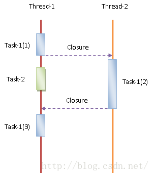
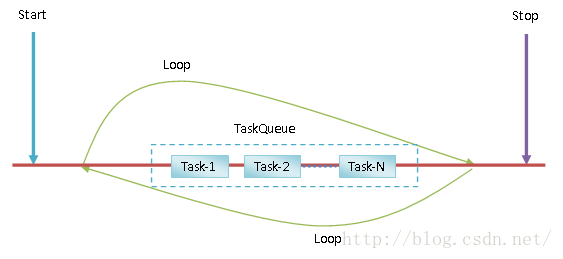
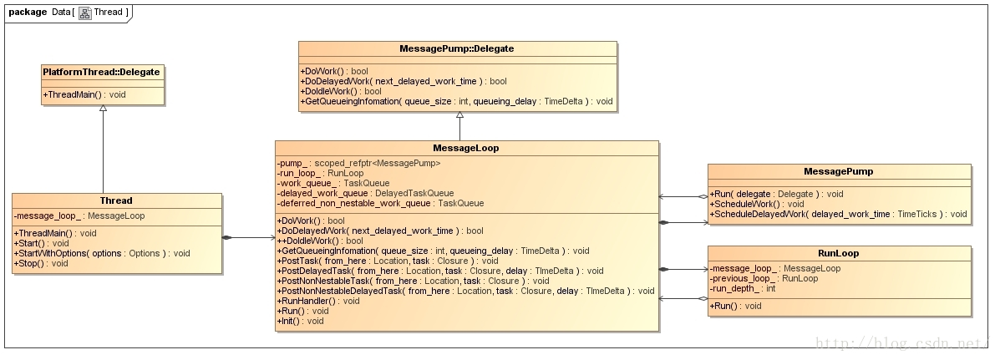
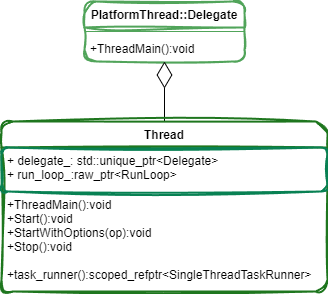
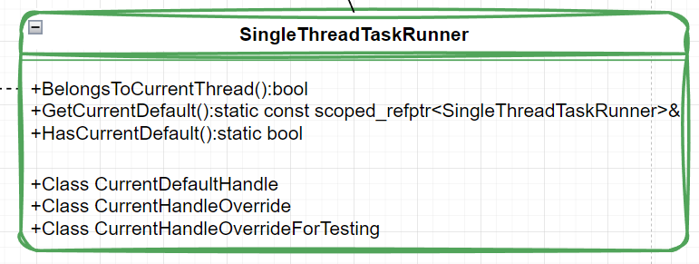

# Chromium 多线程模型设计和实现分析

[TOC]

​		Chromium除了远近闻名的多进程架构之外，它的多线程模型也相当引人注目的。

​		<u>Chromium 的多进程架构是为了解决网页的稳定性问题，而多线程模型则是为了解决网页的卡顿问题。</u>

​		为了达到这个目的，**Chromium 的多线程模型是基于异步通信的。也就是说，一个线程请求另外一个线程执行一个任务的时候，不需要等待该任务完成就可以去做其它事情，从而避免了卡顿。**

​		本文就分析Chromium的多线程模型的设计和实现。


​		这里可能会有疑问，如果一个线程请求另外一个线程执行一个任务的时候，就是要等该任务完成之后才能做其它事情，那么使用异步通信有什么用呢？的确如此，但是 Chromium 提供这种基于异步通信的多线程模型，就是希望作为开发者的你在实现一个模块的时候，尽最大努力地设计好各个子模块及其对应的数据结构，使得它们在协作时可以最大程度地进行异步通信。因此，Chromium 基于异步通信的多线程模型更多的是体现一种设计哲学。

​		 一个典型的异步通信过程如下图所示：




​		Task-1 被分解成三个子任务 Task-1(1)、Task-1(2) 和 Task-1(3)。

​		其中，Task-1(1) 由 Thread-1 执行。Task-1(1) 执行完成后，Thread-1 通过闭包的方式请求 Thread-2 执行Task-1(2)。Task-1(2) 执行完成后，Thread-2 又通过一个闭包请求 Thread-1 执行 Task-1(3)。至此，Task-1就执行完成。

​		<u>我们可以将第一个闭包看作是一个 Request 操作，而第二个闭包是一个 Reply 操作。</u>这是一个典型的异步通信过程。当然，如果不需要知道异步通信结果，那么第二个闭包和 Task-1(3) 就是不需要的。

​		假设 Thread-1 需要知道异步通信的结果，那么在上图中我们可以看到一个非常关键的点：Thread-1 并不是什么也不干就只是等着 Thread-2 执行完成 Task-1(2)，它趁着这个等待的空隙，干了另外一件事情——Task-2。如果我们将 Thread-1 看作是一个UI线程，那么就意味着这种异步通信模式是可以提高它的响应性的。

​		为了能够完成上述的异步通信过程，一个线程的生命周期如下图所示：



​		线程经过短暂的启动之后（Start），就围绕着一个任务队列（TaskQueue）不断地进行循环，直到被通知停止为止（Stop）。在围绕任务队列循环期间，它会不断地检查任务队列是否为空。如果不为空，那么就会将里面的任务（Task）取出来，并且进行处理。这样，一个线程如果要请求另外一个线程执行某一个操作，那么只需要将该操作封装成一个任务，并且发送到目标线程的任务队列去即可。

​		为了更好地理解这种基于任务队列的线程运行模式，我们脑补一下另外一种常用的基于锁的线程运行模式。一个线程要执行某一个操作的时候，就直接调用一个代表该操作的一个函数。如果该函数需要访问全局数据或者共享数据，那么就需要进行加锁，避免其它线程也正在访问这些全局数据或者共享数据。这样做的一个好处是我们只需要关心问题的建模，而不需要关心问题是由谁来执行的，只要保证逻辑正确并且数据完整即可。当然坏处也是显然的。首先是为了保持数据完整性，也就是避免访问数据时出现竞争条件，代码里面充斥着各种锁。其次，如果多个线程同时获取同一个锁，那么就会产生竞争。这种锁竞争会带来额外的开销，从而降低线程的响应性。

​		**<u>基于任务队列的线程运行模式，要求在对问题进行建模时，要提前知道谁是执行者。也就是说，在对问题进行建模时，需要指派好每一个子问题的执行者。这样我们为子问题设计数据结构时，就规定这些数据结构仅仅会被子问题的执行者访问。这样执行者在解决指派给它的问题时，就不需要进行加锁操作，因为在解决问题过程中需要访问的数据不会同时被其它执行者访问。这就是通过任务队列来实现异步通信的多线程模型的设计哲学。</u>**

​		当然，这并不是说，基于任务队列的线程运行模式可以完全避免使用锁，因为任务队列本身就是一个线程间的共享资源。想象一下，一个线程要往里面添加任务，另一个线程要从里面将任务提取出来处理。因此，所有涉及到任务队列访问的地方都是需要加锁的。但是如果我们再仔细想想，那么就会发现，任务队列只是一个基础设施，它与具体的问题是无关的。因此，只要我们遵循上述设计哲学，就可以将代码里面需要加锁的地方仅限于访问任务队列的地方，从而就可以减少锁竞争带来的额外的开销。

​		这样说来，似乎基于任务队列的线程运行模式很好，但是实际上它对问题建模提出了更高的要求，也就是进行子问题划分时，要求划分出来的子问题是正交的，这样我们才有可能为这些子问题设计出不会同时被访问的数据结构。看到“正交”两个字，是不是想起高数里面的向量空间的正交基了？或者傅里叶变换用到的一组三角函数了？其实道理就是一样一样的。


​		好了，说了这么多，我们就步入到正题，分析Chromium多线程模型的设计和实现，也就是基于任务队列的线程运行模式涉及到核心类图，如下图所示：



​		Thread 是一个用来创建带消息循环的类。当我们创建一个 Thread 对象后，调用它的成员函数 Start 或者StartWithOptions 就可以启动一个带消息循环的线程。其中，成员函数 StartWithOptions 可以指定线程创建参数。当我们不需要这个线程时，就可以调用之前创建的 Thread 对象的成员函数 Stop。

​		Thread 类继承了 PlatformThread::Delegate 类，并且重写了它的成员函数 ThreadMain 。我们知道，Chromium 是跨平台的，这样各个平台创建线程使用的 API 有可能是不一样的。不过，我们可以通过PlatformThread::Delegate 类为各个平台创建的线程提供一个入口点。这个入口点就是PlatformThread::Delegate 类的成员函数 ThreadMain。由于 Thread 类重写了父类 PlatformThread::Delegate的成员函数 ThreadMain，因此无论是哪一个平台，当它创建完成一个线程后，都会以 Thread 类的成员函数ThreadMain 作为线程的入口点。

​		Thread 类有一个重要的成员变量 message_loop_ ，它指向的是一个 MessageLoop 对象。这个MessageLoop 对象就是用来描述线程的消息循环的。MessageLoop 类内部通过成员变量 run_loop_ 指向的一个RunLoop 对象和成员变量 pump_ 指向的一个 MessagePump 对象来描述一个线程的消息循环。

​		一个线程在运行的过程中，可以有若干个消息循环，也就是一个消息循环可以运行在另外一个消息循环里面。除了最外层的消息循环，其余的消息的消息循环称为嵌套消息循环。我们为什么需要嵌套消息循环呢？这主要是跟模式对话框有关。

​		<u>考虑一个情景，我们在一个窗口弹出一个文件选择对话框。窗口必须要等到用户在文件选择对话框选择了文件之后，才能去做其它事情。窗口是在消息循环过程中打开文件对话框的，它要等待用户在文件选择对话框中选择文件 ，就意味着消息循环被中止了。由于文件选择对话框也是通过消息循环来响应用户输入的，因此如果打开的它窗口中止了消息循环，就会导致它无法响应用户输入。为了解决这个问题，就要求打开文件选择的窗口不能中止消息循环。方法就是该窗口创建一个子消息循环，该子消息循环负责处理文件选择对应框的输入事件，直到用户选择了一个文件为止。</u>


# 当前版本基于任务队列的线程模型实现方式

​		随着时间的推移，为了进一步简化和提高效率，Chromium 逐渐弃用 `MessageLoop`，转而使用基于`base::sequence_manager::SequenceManager` 和 `base::sequence_manager::TaskQueue` 的模型。这个新模型提供了更为细粒度的控制，允许更复杂的任务调度策略，同时还支持任务的优先级、延迟等特性。

​		`base::sequence_manager::TaskQueue` 是一个代表一系列任务的队列，这些任务将按照它们被添加的顺序执行。而 `SequenceManager` 则管理多个这样的任务队列，负责调度它们的执行。

​		这些变更使得 Chromium 的任务调度更为灵活和高效，满足了其不断增长和复杂化的需求。


## 基本概念

### 线程 

每个 Chrome 进程都有：

- **一个主线程** 
  - 在浏览器进程中（BrowserThread::UI）：更新UI 
  - 在渲染进程中（Blink主线程）：运行Blink的大部分 
- **一个 IO 线程** 
  - 在所有进程中：所有 IPC 消息都在此线程上到达。处理消息的应用程序逻辑可能在另一个线程中（即，IO线程可能将消息路由到绑定到不同线程的 Mojo 接口）。 
  - 更一般地说，大多数异步 I/O 都在这个线程上发生（例如，通过base::FileDescriptorWatcher）。 
  - 在浏览器进程中：这被称为BrowserThread::IO。 
- 还有一些特定目的的线程 
- 以及一个通用线程池 

大多数线程都有一个 LOOP ，从队列中获取任务并运行它们（队列可能在多个线程之间共享）。

### Tasks

​		Task 是添加到队列中以异步执行的 base::OnceClosure。

​		base::OnceClosure 存储一个函数指针和参数（类似 std::bind）。它有一个 Run() 方法，使用绑定的参数调用函数指针。它是使用 base::BindOnce 创建的。（参考[Callback<> and Bind() documentation](https://chromium.googlesource.com/chromium/src/+/refs/heads/main/docs/callback.md)文档）。

```c++
void TaskA() {}
void TaskB(int v) {}

auto task_a = base::BindOnce(&TaskA);
auto task_b = base::BindOnce(&TaskB, 42);
```

一组任务可以按以下方式之一执行：

- 并行：没有任务执行顺序，可能所有任务都在任何线程上一次性执行
- 顺序：任务按发布顺序执行，一次在任何线程上执行一个。 
- 单线程：任务按发布顺序执行，在单个线程上一次执行一个。 
  - COM 单线程：带有初始化的 COM 的单线程变体。

### 序列优先于物理线程

​		顺序执行（在虚拟线程上）比单线程执行（在物理线程上）更受青睐。除了绑定到主线程（UI）或 IO 线程的类型/方法：通过 base::SequencedTaskRunner 实现线程安全比管理自己的物理线程更好（参考下面的发布顺序任务）。

​		所有为“当前物理线程”公开的 API 都有一个“当前序列”的等价物（映射）。

​		如果你发现自己正在编写一个序列友好的类型，并且它在叶依赖中未通过线程亲和性检查（例如，THREAD_CHECKER）：请考虑使该依赖也成为序列友好的。Chrome 中的大多数核心 API 都是序列友好的，但一些遗留类型可能仍然过于严格地使用 ThreadChecker/SingleThreadTaskRunner，而它们可以依赖于“当前序列”而不再是线程亲和的。


### 发布并行任务 

#### 直接发布到线程池

​		一个可以在任何线程上运行并且与其他任务没有顺序或互斥要求的任务，应该使用在base/task/thread_pool.h 中定义的 base::ThreadPool::PostTask*() 函数之一来发布。

```c++
base::ThreadPool::PostTask(FROM_HERE, base::BindOnce(&Task));
```

这将带有默认特性的任务发布出去。

base::ThreadPool::PostTask*() 函数允许调用者通过 TaskTraits 提供关于任务的额外详细信息（参考使用TaskTraits 注释任务）。

```c++
cppCopy codebase::ThreadPool::PostTask(
    FROM_HERE, {base::TaskPriority::BEST_EFFORT, MayBlock()},
    base::BindOnce(&Task));
```

#### 通过 TaskRunner 发布

​		并行的 base::TaskRunner 是直接调用 base::ThreadPool::PostTask*() 的替代方法。当事先不知道任务是并行发布、按顺序发布还是发布到单一线程时，这是非常有用的（参考发布顺序任务、向同一线程发布多个任务）。因为  base::TaskRunner 是 base::SequencedTaskRunner 和 base::SingleThreadTaskRunner 的基类，所以一个scoped_refptr<TaskRunner>成员可以持有一个base::TaskRunner、base::SequencedTaskRunner或base::SingleThreadTaskRunner。

```C++
class A {
 public:
  A() = default;

  void PostSomething() {
    task_runner_->PostTask(FROM_HERE, base::BindOnce(&A, &DoSomething));
  }

  void DoSomething() {
  }

 private:
  scoped_refptr<base::TaskRunner> task_runner_ =
      base::ThreadPool::CreateTaskRunner({base::TaskPriority::USER_VISIBLE});
};
```

​		除非测试需要精确控制任务如何执行，否则建议直接调用 base::ThreadPool::PostTask*()（参考测试中控制任务的较少侵入性的方法）。

#### 发布顺序任务

​		序列是按发布顺序一个接一个运行的任务集合（不必在同一个线程上）。要将任务作为序列的一部分发布，请使用 base::SequencedTaskRunner。

​		发布到新序列 base::SequencedTaskRunner 可以通过 base::ThreadPool::CreateSequencedTaskRunner() 创建。

```c++
scoped_refptr<SequencedTaskRunner> sequenced_task_runner =
    base::ThreadPool::CreateSequencedTaskRunner(...);

// TaskB在TaskA完成后运行。
sequenced_task_runner->PostTask(FROM_HERE, base::BindOnce(&TaskA));
sequenced_task_runner->PostTask(FROM_HERE, base::BindOnce(&TaskB));
```

​		发布到当前（虚拟）线程 发布到当前（虚拟）线程的首选方式是通过base::SequencedTaskRunner::GetCurrentDefault()。

```c++
// 任务将在当前（虚拟）线程的默认任务队列上运行。
base::SequencedTaskRunner::GetCurrentDefault()->PostTask(
    FROM_HERE, base::BindOnce(&Task);
```

​		请注意，SequencedTaskRunner::GetCurrentDefault()**返回当前虚拟线程的默认队列**。在具有多个任务队列的线程上（例如 BrowserThread::UI ），这可以是与当前任务所属的队列不同的队列。故意不通过静态getter暴露“当前”任务运行器。要么你已经知道它并可以直接发布到它，要么你不知道，唯一合理的目标是默认队列。详细讨论请参见https://bit.ly/3JvCLsX。

### 使用序列代替锁 

​		在 Chrome 中，不鼓励使用锁。序列本身提供了线程安全性。与使用锁管理自己的线程安全性相比，更推荐始终从同一序列访问的类。

​		线程安全但不线程固定；是怎么回事呢？发布到同一序列的任务将按顺序运行。一个顺序任务完成后，下一个任务可能会被不同的工作线程接收，但该任务保证能看到其序列上前一个任务造成的任何副作用。

```c++
class A {
 public:
  A() {
    // 不要求访问是在创建序列上。
    DETACH_FROM_SEQUENCE(sequence_checker_);
  }

  void AddValue(int v) {
    // 检查所有访问都在同一序列上。
    DCHECK_CALLED_ON_VALID_SEQUENCE(sequence_checker_);
    values_.push_back(v);
  }

 private:
  SEQUENCE_CHECKER(sequence_checker_);

  // 不需要锁定，因为所有访问都在
  // 同一序列上。
  std::vector<int> values_;
};

A a;
scoped_refptr<SequencedTaskRunner> task_runner_for_a = ...;
task_runner_for_a->PostTask(FROM_HERE,
                      base::BindOnce(&A::AddValue, base::Unretained(&a), 42));
task_runner_for_a->PostTask(FROM_HERE,
                      base::BindOnce(&A::AddValue, base::Unretained(&a), 27));

// 从不同的序列访问会导致DCHECK失败。
scoped_refptr<SequencedTaskRunner> other_task_runner = ...;
other_task_runner->PostTask(FROM_HERE,
                            base::BindOnce(&A::AddValue, base::Unretained(&a), 1));
```

​		锁只应该用来交换可以在多个线程上访问的共享数据结构。如果一个线程基于昂贵的计算或通过磁盘访问对其进行更新，那么这项缓慢的工作应该在不持有锁的情况下完成。只有当结果可用时，才应使用锁来交换新数据。此方法的一个例子是在 PluginList::LoadPlugins (content/browser/plugin_list.cc) 中。如果你必须使用锁，以下是一些最佳实践和要避免的陷阱。

​		为了编写非阻塞代码，Chrome 中的许多 API 都是异步的。通常，这意味着它们要么需要在特定的线程/序列上执行，并通过自定义委托接口返回结果，要么它们采用 base::OnceCallback<>()（或base::RepeatingCallback<> ）对象，在请求的操作完成时调用该对象。在特定线程/序列上执行工作在上面的PostTask 部分中有涉及。

### 发布多个任务到同一线程

​		如果多个任务需要在同一线程上运行，将它们发布到 base::SingleThreadTaskRunner 。所有发布到同一base::SingleThreadTaskRunner 的任务都按发布顺序在同一线程上运行。

#### 在浏览器进程中发布到主线程或到 IO 线程 

​		**要发布任务到主线程或到IO线程，使用content::GetUIThreadTaskRunner({})或content::GetIOThreadTaskRunner({})**，这些来自 content/public/browser/browser_thread.h。

​		您可以为这些方法提供额外的 BrowserTaskTraits 作为参数，尽管这在 BrowserThreads 中仍然不太常见，应保留用于高级用例。

​		正在进行一个迁移（任务API v3）远离您可能仍然在整个代码库中找到的以前的基于特性的base-API（它是等效的）：

```c++
base::PostTask(FROM_HERE, {content::BrowserThread::UI}, ...);

base::CreateSingleThreadTaskRunner({content::BrowserThread::IO}) ->PostTask(FROM_HERE, ...); 
```

​		注意：在迁移期间，您不幸地需要继续手动包括content/public/browser/browser_task_traits.h. 以使用browser_thread.h API。

​		主线程和 IO 线程已经非常忙碌。因此，尽可能优先发布到通用线程（参考：发布并行任务、发布顺序任务）。发布到主线程的一个好的理由是更新 UI 或访问绑定到它的对象（例如Profile）。发布到 IO 线程的一个好的理由是访问绑定到它的组件的内部（例如IPCs、网络）。注意：发送/接收 IPC 或在网络上发送/接收数据并不需要显式地发布任务到 IO 线程。

#### 发布到自定义 SingleThreadTaskRunner

​		如果多个任务需要在同一个线程上运行，而那个线程不必是主线程或 IO 线程，那么将它们发布到由base::Threadpool::CreateSingleThreadTaskRunner 创建的 base::SingleThreadTaskRunner。

```c++
scoped_refptr<SingleThreadTaskRunner> single_thread_task_runner =
    base::Threadpool::CreateSingleThreadTaskRunner(...);

// TaskB 在TaskA完成后运行。两个任务都在同一个线程上运行。
single_thread_task_runner->PostTask(FROM_HERE, base::BindOnce(&TaskA));
single_thread_task_runner->PostTask(FROM_HERE, base::BindOnce(&TaskB));
```

请记住，我们更喜欢序列而不是物理线程，因此这种情况应该很少发生。

#### 发布到当前线程

​		重要提示：要发布一个需要与当前任务序列互斥，但不绝对需要在当前物理线程上运行的任务，请使用base::SequencedTaskRunner::GetCurrentDefault()，而不是base::SingleThreadTaskRunner::GetCurrentDefault()（参考发布到当前序列）。这将更好地记录发布任务的要求，并避免不必要地使您的API物理线程关联。在单线程任务中，base::SequencedTaskRunner::GetCurrentDefault()等同于base::SingleThreadTaskRunner::GetCurrentDefault()。如果您仍然必须发布一个任务到当前的物理线程，使用base::SingleThreadTaskRunner::CurrentDefaultHandle。

```c++
// 该任务将在将来在当前线程上运行。
base::SingleThreadTaskRunner::GetCurrentDefault()->PostTask(
    FROM_HERE, base::BindOnce(&Task));
```


## 实现类

### 废弃 MessageLoop

​		Chromium 的代码库在经历一系列的重构后，其中一个较大的变动是 `base::MessageLoop` 被废弃并由新的任务调度模型取而代之。其中，`base::Thread` 的设计也发生了改变，移除了 `message_loop_` 成员。新的调度模型更加灵活，并解决了之前模型中存在的一些问题。

在新的模型中：

1. **base::Thread**：
   - 仍然是一个线程的高级表示，但现在不直接持有一个 `MessageLoop` 实例。
   - `base::Thread` 现在使用 `base::sequence_manager::SequenceManager` 和 `base::sequence_manager::TaskQueue` 来处理和调度任务。
2. **base::sequence_manager::SequenceManager**：
   - **<u>管理任务队列并与 `MessagePump` 交互以驱动任务的执行。</u>**
3. **base::sequence_manager::TaskQueue**：
   - 表示任务队列。任务可以推送到这些队列中，并由 `SequenceManager` 管理和调度。

要将任务推送到线程上，请执行以下操作：

1. 首先，确保线程已经启动。这可以通过调用 `base::Thread::Start()` 来完成。
2. 使用 `base::Thread::task_runner()` 获取与线程关联的 `TaskRunner`。
3. 使用 `TaskRunner` 的 `PostTask` 方法将任务推送到线程上。

示例代码：

```C++
base::Thread my_thread("MyThread");
my_thread.Start();
my_thread.task_runner()->PostTask(FROM_HERE, base::BindOnce([]() {
    std::cout << "123";
}));
```

注意：这是一个简化的示例。在实际的Chromium代码库中，可能还需要处理其他细节，特别是关于线程的生命周期、任务的取消和错误处理等方面。

​		在Chromium的新的任务调度模型中，任务通常不再直接添加到`MessageLoop`上，而是通过`TaskRunner`来进行。`TaskRunner`是一个可以将任务发送到特定的执行环境（例如线程或序列）的对象。

​		特别是，`base::Thread`类提供了一个`task_runner()`方法，该方法返回一个`scoped_refptr<SingleThreadTaskRunner>`。`SingleThreadTaskRunner`是`TaskRunner`的一个子类，它确保所有的任务都在同一个线程上运行。

```c++
scoped_refptr<SingleThreadTaskRunner> task_runner()
```


### TaskRunner

​		接下来是向线程的消息队列发送消息的过程。这是通过 TaskRunner 类的以下四个成员函数向消息队列发送消息的：

  1. **PostTask**，发送需要马上进行处理的并且可以在嵌套消息循环中处理的消息。
  2. **PostDelayedTask**，发送需要延迟处理的并且可以在嵌套消息循环中处理的消息。
  3. **PostTaskAndReply**，提交一个任务，并在完成后在**原始线程**上提交另一个任务。主任务完成后需要执行的回调任务。

   4. **PostTaskAndReplyWithResult**，提交一个任务，并在完成后带结果回调**原始线程**上的任务。它允许主任务返回一个结果，并将此结果作为参数传递给回调任务。


​		向线程的消息队列发送了新的消息之后，需要唤醒线程，这是通过调用MessagePump类的成员函数Schedule进行的。

​		线程被唤醒之后 ，就会分别调用 MessageLoop 类重写父类 **`MessagePump::Delegate`** 的两个成员函数**`DoWork`** 和 **`DoDelayedWork`** 对消息队列的消息进行处理。如果没有消息可以处理，就调用 TaskRunner 类重写父类 MessagePump::Delegate 的成员函数 **`DoIdleWork`** 通知线程进入 Idle 状态，这时候线程就可以做一些 Idle Work。


### Thread



​		Thread 是一个用来创建带消息循环的类。当我们创建一个 Thread 对象后，调用它的成员函数 Start 或者StartWithOptions 就可以启动一个带消息循环的线程。其中，成员函数 StartWithOptions 可以指定线程创建参数。当我们不需要这个线程时，就可以调用之前创建的 Thread 对象的成员函数 Stop。

​		Thread 类继承了 PlatformThread::Delegate 类，并且重写了它的成员函数 ThreadMain。我们知道，Chromium 是跨平台的，这样各个平台创建线程使用的 API 有可能是不一样的。不过，我们可以通过PlatformThread::Delegate 类为各个平台创建的线程提供一个入口点。这个入口点就是PlatformThread::Delegate 类的成员函数 ThreadMain。由于 Thread 类重写了父类 PlatformThread::Delegate的成员函数 ThreadMain，因此无论是哪一个平台，当它创建完成一个线程后，都会以 Thread 类的成员函数ThreadMain 作为线程的入口点。

​		Thread 类中有一个重要成员 delegate_ ，他是一个代理，在 `base::Thread` 的 `ThreadMain()` 方法中，该线程的 `MessageLoop` 会被创建，并且可以看到，如果设置了 `delegate_`，则会调用其 `BindToCurrentThread()` 方法。这允许 `delegate_` 与新创建的消息循环进行交互。


有了前面的基础知识，接下来我们就可以大概描述Thread类描述的线程的执行过程。

首先是线程的启动过程：

      1. 调用 Thread 类的成员函数 Start 或者 StartWithOptions 启动一个线程，并且以 Thread 类的成员函数ThreadMain 作为入口点。并在 delegate_ 的初始化中创建 **`MessagePump `**
      2. Thread 类的成员函数 ThreadMain 负责**将 delegate_ 对应的消息循环绑定到当前线程**，然后进入 **`RunLoop`**的循环中。
      3. base::RunLoop 类在创建消息循环的过程中，会通过成员函数 Init 创建用来一个用来消息循环的**`MessagePump`** 对象。
      4. 消息循环创建完成之后，调用 **`RunLoop`**类的成员函数 Run 进入消息循环。

 我们首先看线程的启动过程，即 Thread 类的成员函数 **`Start`** 的实现，如下所示：

```c++
bool Thread::Start() {
  Options options;
  ......
  return StartWithOptions(options);
}
```


​       这个函数定义在文件 <u>base/threading/thread.cc</u> 中。

​		Thread 类的成员函数 **`Start`** 调用另外一个成员函数**`StartWithOptions`**来启动一个线程，后者可以通过一个类型为 Options 的参数指定线程的启动参数，这里没有指定，意味着采用默认参数启动一个线程。

   Thread 类的成员函数 **`StartWithOptions`** 的实现如下所示：

```c++
bool Thread::StartWithOptions(const Options& options) {
  ......

  StartupData startup_data(options);
  startup_data_ = &startup_data;

  if (!PlatformThread::Create(options.stack_size, this, &thread_)) {
    ......
    return false;
  }

  // Wait for the thread to start and initialize message_loop_
  base::ThreadRestrictions::ScopedAllowWait allow_wait;
  startup_data.event.Wait();

  // set it to NULL so we don't keep a pointer to some object on the stack.
  startup_data_ = NULL;
  started_ = true;

  ......
  return true;
}


bool Thread::StartWithOptions(Options options) {
    ...
        
  SetThreadWasQuitProperly(false);

  if (options.delegate) {
    DCHECK(!options.message_pump_factory);
    delegate_ = std::move(options.delegate);
  } else if (options.message_pump_factory) {
    delegate_ = std::make_unique<internal::SequenceManagerThreadDelegate>(
        MessagePumpType::CUSTOM, options.message_pump_factory);
  } else {
    delegate_ = std::make_unique<internal::SequenceManagerThreadDelegate>(
        options.message_pump_type,
        BindOnce([](MessagePumpType type) { return MessagePump::Create(type); },
                 options.message_pump_type));
  }

  start_event_.Reset();

  // Hold |thread_lock_| while starting the new thread to synchronize with
  // Stop() while it's not guaranteed to be sequenced (until crbug/629139 is
  // fixed).
  {
    AutoLock lock(thread_lock_);
    bool success = options.joinable
                       ? PlatformThread::CreateWithType(
                             options.stack_size, this, &thread_,
                             options.thread_type, options.message_pump_type)
                       : PlatformThread::CreateNonJoinableWithType(
                             options.stack_size, this, options.thread_type,
                             options.message_pump_type);
    if (!success) {
      DLOG(ERROR) << "failed to create thread";
      return false;
    }
  }

  joinable_ = options.joinable;

  return true;
}

```


​       这个函数定义在文件external/chromium_org/base/threading/thread.cc中。

​       Thread类的成员函数 **`StartWithOptions`** 首先是根据 options 来创建一个 **`MessagePump`** 。接下来再调用由平台实现的 PlatformThread 类的静态成员函数 **`Create`** 创建一个线程。

​     一般情况下，线程是不可以进入等待状态的，因为这样会降低线程的响应性。但是有时候线程不得不进入等待状态，例如现在这个情况，当前线程必须要等新创建的线程启动完成之后才能返回，否则的话有可能新创建的线程还没有启动完成。

​        当新创建的线程启动完成之后，将 Thread 类的成员变量 joinable_ 的值设置为 true，表示新创建的线程已经启动完毕。

​				在 **`StartWithOptions`** 函数中，会根据类型创建 MessagePump 实现如下：

```c++
// static
std::unique_ptr<MessagePump> MessagePump::Create(MessagePumpType type) {
  switch (type) {
    case MessagePumpType::UI:
      if (message_pump_for_ui_factory_)
        return message_pump_for_ui_factory_();
      return std::make_unique<MessagePumpForUI>();
    case MessagePumpType::IO:
      return std::make_unique<MessagePumpForIO>();
    case MessagePumpType::CUSTOM:
      NOTREACHED();
      return nullptr;
    case MessagePumpType::DEFAULT:
      return std::make_unique<MessagePumpDefault>();
  }
}
```

​		这个函数定义在文件 base/message_loop/message_pump.cc中。

​		从 MessagePump 类的成员函数**`Create`**的实现可以知道：

      1. 如果消息循环的类型为 MessageLoop::TYPE_UI，那么对应的消息泵为MessagePumpForUI，或者由函数指针 message_pump_for_ui_factory_ 指向的函数创建。但是一般不设置函数指针message_pump_for_ui_factory_ ，因此，类型为 MessageLoop::TYPE_UI 的消息循环对应的消息泵为MessagePumpForUI。在 Chromium 中，消息循环类型为 MessageLoop::TYPE_UI 的线程称为 UI 线程，也就是应用程序的主线程。
      2. 如果消息循环的类型为 MessageLoop::TYPE_IO，那么对应的消息泵为 MessagePumpForIO，即MessagePumpLibevent。在Chromium中，消息循环类型为MessageLoop::TYPE_IO的线程称为IO线程，但是**这里的IO不是读写文件的意思，而是执行IPC的意思**。
      3. 如果消息循环的类型为 MessageLoop::CUSTOM，那么对应的消息泵为自定义，这里应该不实现。
      4. 其余类型的消息循环，对应的消息泵为 MessagePumpDefault。

​        总结来说，涉及到的消息泵有 MessagePumpForUI、MessagePumpForIO 和 MessagePumpDefault 三种，各自有不同的用途，其中 MessagePumpForUI 适用于UI线程，MessagePumpForIO 适用于用来负责执行IPC的IO线程，MessagePumpDefault适用于其它的一般线程。我们先从一般性出发，分析MessagePumpDefault 的实现，后面再分析 MessagePumpForUI 和 MessagePumpForIO 的实现。


## MessagePumpDefault

​		MessagePumpDefault 类继承于 MessagePump 类，它的定义如下所示：

```c++
class MessagePumpDefault : public MessagePump {
 public:
  MessagePumpDefault();

  MessagePumpDefault(const MessagePumpDefault&) = delete;
  MessagePumpDefault& operator=(const MessagePumpDefault&) = delete;

  ~MessagePumpDefault() override;

  // MessagePump methods:
  void Run(Delegate* delegate) override;
  void Quit() override;
  void ScheduleWork() override;
  void ScheduleDelayedWork(
      const Delegate::NextWorkInfo& next_work_info) override;

 private:
  // This flag is set to false when Run should return.
  bool keep_running_;

  // Used to sleep until there is more work to do.
  WaitableEvent event_;
};
```

​		这个类定义在文件 base/message_loop/message_pump_default.h 。

​		MessagePumpDefault 类重写了父类 MessagePump 的成员函数 **`Run`**、**`Quit`**、**`ScheduleWork`**和**`ScheduleDelayedWork`**，后面我们分析消息循环的执行过程和消息的发送过程时，会看到它们的具体实现。

 MessagePumpDefault 类具有三个成员变量：

      1. keep_running_，类型为 bool，表示消息循环是否需要继续执行。只要线程不退出，消息循环就要持续执行。

      2. event_，类型为 WaitableEvent，表示一个可以进行Wait/Wake的事件变量。当线程的消息队列为空时，线程就通过它进入到Wait状态，而当向线程的消息队列发送了一个消息时，就通过它唤醒线程。

​       这样，一个消息循环及其对应的消息泵就创建完毕，回到 Thread 类的成员函数 ThreadMain 中，接下来它调用成员函数 Run 使得线程进入到运行状态，也就是围绕消息队列进行不断的循环，直到线程退出为止。

   Thread 类的成员函数 Run 的实现如下所示：

```c++
void Thread::Run(RunLoop* run_loop) {
  run_loop->Run();
}
```


​       Thread 类的成员函数 Run 调用参数 run_loop 指向的一个 RunLoop 对象的成员函数 **`Run`** 使得线程进入运行状态。

​		RunLoop 类的成员函数Run的实现如下所示：

```c++
void RunLoop::Run(const Location& location) {
  DCHECK_CALLED_ON_VALID_SEQUENCE(sequence_checker_);

  if (!BeforeRun())
    return;

  // If there is a RunLoopTimeout active then set the timeout.
  // TODO(crbug.com/905412): Use real-time for Run() timeouts so that they
  // can be applied even in tests which mock TimeTicks::Now().
  CancelableOnceClosure cancelable_timeout;
  const RunLoopTimeout* run_timeout = GetTimeoutForCurrentThread();
  if (run_timeout) {
    cancelable_timeout.Reset(BindOnce(&OnRunLoopTimeout, Unretained(this),
                                      location, run_timeout->on_timeout));
    origin_task_runner_->PostDelayedTask(
        FROM_HERE, cancelable_timeout.callback(), run_timeout->timeout);
  }

  DCHECK_EQ(this, delegate_->active_run_loops_.top());
  const bool application_tasks_allowed =
      delegate_->active_run_loops_.size() == 1U ||
      type_ == Type::kNestableTasksAllowed;
  delegate_->Run(application_tasks_allowed, TimeDelta::Max());

  AfterRun();
}
```

​        这个函数定义在文件 base/run_loop.cc 中。

​		在调用成员变量 delegate_ 指向的一个函数 **`Run`** 进入消息循环前后，RunLoop 类的成员函数 Run 分别调用了 BeforeRun 和 AfterRun 两个成员函数，目的就是为了建立好消息循环的层次关系，它们的实现如下所示：

```c++
bool RunLoop::BeforeRun() {
  // Allow Quit to be called before Run.
  if (quit_called_) {
    return false;
  }

  auto& active_run_loops = delegate_->active_run_loops_;
  active_run_loops.push(this);

  const bool is_nested = active_run_loops.size() > 1;

  if (is_nested) {
    for (auto& observer : delegate_->nesting_observers_)
      observer.OnBeginNestedRunLoop();
    if (type_ == Type::kNestableTasksAllowed)
      delegate_->EnsureWorkScheduled();
  }

  running_ = true;
  return true;
}

void RunLoop::AfterRun() {
  running_ = false;

  auto& active_run_loops = delegate_->active_run_loops_;
  DCHECK_EQ(active_run_loops.top(), this);
  active_run_loops.pop();

  // Exiting a nested RunLoop?
  if (!active_run_loops.empty()) {
    for (auto& observer : delegate_->nesting_observers_)
      observer.OnExitNestedRunLoop();

    // Execute deferred Quit, if any:
    if (active_run_loops.top()->quit_called_)
      delegate_->Quit();
  }
}
```

这两个函数定义在文件external/chromium_org/base/run_loop.cc中。

​		RunLoop 类的成员变量 delegate_ 是一个 RunLoop::Delegate 类，RunLoop::Delegate 是一个接口，允许RunLoop 与其关联线程的底层消息循环实现分离。它持有与其关联线程上的 RunLoop 使用的私有状态。这个Delegate 必须在给定线程上通过 `RunLoop::RegisterDelegateForCurrentThread()` 注册，然后 `RunLoop` 实例和 `RunLoop` 静态方法才可以在其上使用。

​		主要成员：active_run_loops_ ：存储当前线程上活跃的 RunLoop 实例。 active_run_loops_ 是一个  RunLoopStack：`stack<RunLoop *, std::vector<RunLoop *>>` 是一个基于 vector 的栈，用于存储活动的 RunLoop 。在编写基于事件的应用程序时，尤其是在图形用户界面或某些复杂的事件驱动环境中，通常可能会遇到所谓的嵌套消息循环或嵌套运行循环的情况。这意味着在一个已经运行的 `RunLoop` 中，又开始了一个新的 `RunLoop`，形成了一个嵌套结构。

​		`active_run_loops_` 栈就是为了跟踪这样的嵌套结构。当一个新的 `RunLoop` 开始时，它会被推入栈顶；当该 `RunLoop` 结束时，它会从栈顶被弹出。这样，栈顶的 `RunLoop` 始终是当前活跃的那个。如果某个时刻需要结束或控制当前活跃的 `RunLoop`，只需查看和操作栈顶的那个。

​		所以在**`RunLoop::BeforeRun()`** 运行时我们可以看到新的 RunLoop 循环被 **`push`** 进栈里面。

​		从上面的分析就可以看出，RunLoop类的成员函数BeforeRun执行的是一个Run Loop**<u>入栈</u>**操作，相应地，RunLoop 类的成员函数 AfterRun 执行的是一个Run Loop**<u>出栈</u>**操作，它将消息循环当前使用的 Run Loop 恢复为前一个 Run Loop。

​		RunLoop 类的成员变量 running_ 描述的是一个 Run Loop 当前是否正在被消息循环使用，因此，在RunLoop 类的成员函数 BeforeRun 和 AfterRun 中，它的值分别被设置为 true 和 false。

​		RunLoop 类的成员变量 quit_called_ 描述的是一个 Run Loop 是否收到退出请求。如果一个 Run Loop 当前正在消息循环使用，并且又收到了退出请求，那么就将会导致消息循环退出。这样就会导致以下两种情况：

   1. 一个 Run Loop 在即将被消息循环使用之前，就已经收到了退出请求，那么就不会被消息循环使用，表现就为在 RunLoop 类的成员函数 BeforeRun 中，如果当前正在处理的 RunLoop 对象的成员变量 quit_called_ 的值等于 true，那么就返回一个 false 值给调用者，表示当前正在处理的 RunLoop 对象不能够进入消息循环。

   2. 一个 Run Loop 在被消息循环使用期间，前一个 Run Loop 收到了退出请求，那么当前 Run Loop 结束使用之后，禁止返回到前一个 Run Loop。这意味着要结束消息循环，表现就为在 RunLoop 类的成员函数**`AfterRun`**中，如果发现当前正在处理的 RunLoop 对象的成员变量 active_run_loops 不为NULL，并且它指向的一个RunLoop对象的成员变量 quit_called 的值被设置为 true，那么就会调用当前正在处理的 RunLoop 对象的成员变量 loop_ 指向的一个 MessageLoop 对象的成员函数 QuitNow 退出消息循环。

​       回到 RunLoop 类的成员函数 Run 中，在调用成员函数 BeforeRun 成功建立好消息循环的层次关系之后，就通过当前正在处理的 delegate_ 对象进入到下一层消息循环中，这是通过调用当前正在处理的 delegate_ 对象的成员函数 Run 实现的。从前面的分析可以知道，该 delegate_ 对象描述的是就是当前线程使用的消息循环。

​		函数 **`Run`** 进入消息循环。前面我们假设该 MessagePump 对象是一个 MessagePumpDefault 对象，因此接下来我们继续分析 MessagePumpDefault 类的成员函数 **`Run`** 的实现，如下所示：

```c++
void MessagePumpDefault::Run(Delegate* delegate) {
  AutoReset<bool> auto_reset_keep_running(&keep_running_, true);

  for (;;) {
    Delegate::NextWorkInfo next_work_info = delegate->DoWork();
    bool has_more_immediate_work = next_work_info.is_immediate();
    if (!keep_running_)
      break;

    if (has_more_immediate_work)
      continue;

    has_more_immediate_work = delegate->DoIdleWork();
    if (!keep_running_)
      break;

    if (has_more_immediate_work)
      continue;

    if (next_work_info.delayed_run_time.is_max()) {
      event_.Wait();
    } else {
      event_.TimedWait(next_work_info.remaining_delay());
    }
    // Since event_ is auto-reset, we don't need to do anything special here
    // other than service each delegate method.
  }
}
```

这个函数定义在文件 base/message_loop/message_pump_default.cc 中。

​		参数 delegate 是一个 Delegate 类型的指针，但是从上面的调用过程可以知道，它指向的是一个 MessagePump 对象。

​		MessagePumpDefault 类的成员函数 **`Run`** 在一个 for 循环中不断地通过调用参数 delegate 指向的一个MessagePump 对象的成员函数**`DoWork`** 检查线程的消息队列是否有任务需要处理。如果没有，再调用**`DoIdleWork`**处理一些适用在线程空闲时进行的任务。

​		从给出的代码中，我们可以看到其工作流程如下：

1. 进入一个无限循环，该循环会一直执行，直到`keep_running_`被设置为`false`。
2. 首先尝试执行立即可运行的任务，这是通过 `delegate->DoWork()` 实现的。如果有更多立即执行的任务，那么循环会继续，否则继续下一步。
3. 如果没有立即执行的任务，那么尝试执行空闲时的任务，这是通过 `delegate->DoIdleWork()` 实现的。如果在执行空闲任务后仍有其他任务需要立即执行，循环会继续，否则进入下一步。
4. 如果还没有任何立即执行的任务，那么根据下一个任务的延迟时间来进行等待，这是通过`event_.TimedWait(next_work_info.remaining_delay())`实现的。

​        从给出的代码中，可以看到 `MessagePumpDefault::Run` 实现确实考虑了延时任务。它是通过`delegate->DoWork()` 获取下一个工作信息的，其中的 `next_work_info.delayed_run_time` 就是下一个延迟任务的执行时间。根据这个执行时间，<u>它会决定是否应该等待，以及应该等待多久。</u>

具体的逻辑是这样的：

- 如果 `next_work_info.delayed_run_time.is_max()` 为真，这意味着没有即将到来的延迟任务，所以它会调用`event_.Wait()`来无限期地等待直到有新任务到来。
- 否则，它会调用 `event_.TimedWait(next_work_info.remaining_delay())` 来等待直到下一个延迟任务的执行时间。

​		无论线程是通过哪一种情况下进行睡眠状态，都是通过 MessagePumpDefault 类的成员变量 event_ 描述的一个 WaitableEvent 对象进行，即通过调用它的成员函数 Wait 和 TimedWait 进行的。

#### TaskRunner

​		在分析MessagePump 类的成员函数 **`DoWork`** 和 **`DoIdleWork`** 之前，我们首先分析向一个线程的消息队列发送消息的过程。这是通过我们在前面提到的 TaskRunner 类的成员函数 **`PostTask`**、**`PostDelayedTask`**、 **`PostTaskAndReply`** 和 **`PostTaskAndReplyWithResult`** 实现的。


​		接下来我们继续分析 PlatformThread 类的静态成员函数 **`CreateWithType`** 的实现。以 Android 平台为例，它的实现如下所示：

```c++
bool PlatformThreadBase::CreateWithType(size_t stack_size,
                                        Delegate* delegate,
                                        PlatformThreadHandle* thread_handle,
                                        ThreadType thread_type,
                                        MessagePumpType pump_type_hint) {
  return CreateThread(stack_size, true /* joinable thread */, delegate,
                      thread_handle, thread_type, pump_type_hint);
}
```

​      这个函数定义在文件 <u>base/threading/platform thread_ posix.cc</u> 中。
​      PlatformThread 类的静态成员函数 **`CreateWithType`** 调用了另外一个函数**`CreateThread`**来创建一个线程，后者的实现如下所示：

```c++
bool CreateThread(size_t stack_size, bool joinable,
                  PlatformThread::Delegate* delegate,
                  PlatformThreadHandle* thread_handle,
                  ThreadPriority priority) {
  ......

  bool success = false;
  pthread_attr_t attributes;
  pthread_attr_init(&attributes);

  // Pthreads are joinable by default, so only specify the detached
  // attribute if the thread should be non-joinable.
  if (!joinable) {
    pthread_attr_setdetachstate(&attributes, PTHREAD_CREATE_DETACHED);
  }

  // Get a better default if available.
  if (stack_size == 0)
    stack_size = base::GetDefaultThreadStackSize(attributes);

  if (stack_size > 0)
    pthread_attr_setstacksize(&attributes, stack_size);

  std::unique_ptr<ThreadParams> params(new ThreadParams);
  params->delegate = delegate;
  params->joinable = joinable;
  params->thread_type = thread_type;
  params->message_pump_type = message_pump_type;

  pthread_t handle;
  int err = pthread_create(&handle,
                           &attributes,
                           ThreadFunc,
                           &ms);
  success = !err;
  ......

  pthread_attr_destroy(&attributes);

  .....

  return success;
}
```

​       这个函数定义在文件 <u>base/threading/platform_ thread_posix.cc</u> 中。


​       从这里就可以看到，调用 POSIX 线程库中的函数 **`pthread_create`** 创建了一个线程，并且指定新创建的线程的入口点函数为 ThreadFunc，同时传递给该入口点函数的参数为一个 ThreadParams 对象，该 ThreadParams对象封装了线程启动过程中需要使用到的一系列参数。    

  新创建线程的入口点函数 ThreadFunc 的实现如下所示：

```c++
void* ThreadFunc(void* params) {
  PlatformThread::Delegate* delegate = nullptr;

  {
    std::unique_ptr<ThreadParams> thread_params(
        static_cast<ThreadParams*>(params));
      
      ...
    delegate = thread_params->delegate;
      ...
  }
	... 
        
  delegate->ThreadMain();

  ...
  return nullptr;
}
```

​       这个函数定义在文件external/chromium_org/base/threading/platform_thread_posix.cc中。

​       函数 ThreadFunc 首先将参数 params 转换为一个 ThreadParams 对象。有了这个 ThreadParams 对象之后，就可以通过它的成员变量 delegate 获得一个 PlatformThread::Delegate 对象。从前面的调用过程可以知道，这个 PlatformThread::Delegate 对象实际上是一个 Thread 对象，用来描述新创建的线程。得到了用来描述新创建线程的 Thread 对象之后，就可以调用它的成员函数 ThreadMain 继续启动线程了。

   Thread类的成员函数ThreadMain的实现如下所示：

```c++
void Thread::ThreadMain() {
  ...
  // This binds CurrentThread and SingleThreadTaskRunner::CurrentDefaultHandle.
  delegate_->BindToCurrentThread();

  ...
      
  Init();

  {
    AutoLock lock(running_lock_);
    running_ = true;
  }

  start_event_.Signal();

  RunLoop run_loop;
  run_loop_ = &run_loop;
  Run(run_loop_);

  {
    AutoLock lock(running_lock_);
    running_ = false;
  }

  // Let the thread do extra cleanup.
  CleanUp();
    
  ...
      
  // We can't receive messages anymore.
  // (The message loop is destructed at the end of this block)
  delegate_.reset();
  run_loop_ = nullptr;
}
```


​       在调用**`StartWithOptions`**时，会创建 MessagePump ，在**`ThreadMain`**时就可以调用**`BindToCurrentThread`**绑定到该线程了。有了 MessagePump 之后，就可以创建一个 RunLoop 了。该 RunLoop 最终会保存在 Thread 类的成员变量 run_loop_ 中。

​		Thread 类的成员函数 Init 一般由子类重写，这样子类就有机会执行一些线程初始化工作。

​		再接下来，新创建的线程就需要进入运行状态，这是通过调用 Thread 类的成员函数 Run 实现的。不过在新创建线程进入运行状态之前，还会做两件事情。第一件事情是将 Thread 类的成员变量 running_ 设置为 true，表示新创建的线程正在运行。第二件事情是通过 Thread 类的成员变量  start_event_ 指向的一个**`Signal`**唤醒请求创建新线程的线程。

​		最后，当 Thread 类的成员函数 Run 执行完成返回后，需要将 Thread 类的成员变量 running_ 和message_loop_ 分别重置为 false 和 NULL，表示新创建的线程已经运行结束了，因此就不再需要 RunLoop 了。

### RunLoop 

​		接下来我们首先分析线程的 RunLoop 的创建过程，也就是 RunLoop 类的构造函数的实现，以完成线程的启动过程，然后再分析线程的运行过程，也就是 Thread 类的成员函数 Run 的实现。

​		对应的 RunLoop 类构造函数的实现如下所示：

```c++
RunLoop::RunLoop(Type type)
    : delegate_(delegate),
      type_(type),
      origin_task_runner_(SingleThreadTaskRunner::GetCurrentDefault()) {
  DCHECK(delegate_) << "A RunLoop::Delegate must be bound to this thread prior "
                       "to using RunLoop.";
  DCHECK(origin_task_runner_);
}
```

​		这个函数定义在文件 base/run_loop.cc。 

​		RunLoop 类的成员变量 type_ 描述的是消息循环的类型，origin_task_runner_ 描述的是当前使用的消息循环。 

​	 	origin_task_runner_ 是一个 SingleThreadTaskRunner 对象。

### SingleThreadTaskRunner

- 这是一个`SequencedTaskRunner`，但所有任务都在一个单独的线程上运行。
- 这个实现会：向现有线程的`MessageLoop`发布任务；为发布任务创建自己的工作线程和`MessageLoop`；或者将任务添加到 FIFO 并向非`MessageLoop`线程发出信号以便它们被处理。



1. **BelongsToCurrentThread()**:
   - 更明确的别名，指向`RunsTasksInCurrentSequence()`。判断当前任务是否属于当前线程。
2. **GetCurrentDefault()**:
   - 返回当前线程的默认`SingleThreadTaskRunner`。在为多个任务队列提供服务的线程上，优先使用默认的任务队列。
3. **HasCurrentDefault()**:
   - 返回是否为当前线程创建了`SingleThreadTaskRunner`。
4. **CurrentDefaultHandle**:
   - 这是一个嵌套类，允许将特定的`SingleThreadTaskRunner`绑定到当前线程。
5. **CurrentHandleOverride**:
   - 这是另一个嵌套类，允许在其生命周期内重写`SingleThreadTaskRunner::GetCurrentDefault()`返回的任务运行器。通常这样的重写在特殊情况下是需要的，因此它在某些特定的上下文中有一定的访问限制（如`friend`声明）。
   - 这个类还涉及到允许或不允许在其生命周期内运行的`RunLoop::Run()`。

​        最后，像许多其他 Chromium 类一样，它在析构函数中使用了`override = default`，确保子类的析构函数在适当的时候被调用。

​        总的来说，`SingleThreadTaskRunner`为在单个线程上运行的任务提供了一个高级抽象，使得任务调度更为简单和可靠。


### SequencedTaskRunner


