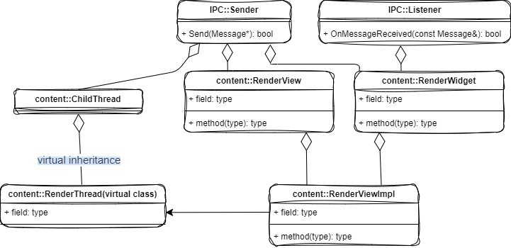

[TOC]

# 概览


## Browser 进程

​		RenderProcessHost、RenderViewHost、RenderProcess 和 RenderView 仅仅是定义了一个抽象接口，真正用来执行 IPC 通信的对象，是实现了上述抽象接口的一个实现者对象，这些实现者对象的类型以 Impl 结尾，因此，RenderProcessHost、RenderViewHost、RenderProcess 和 RenderView 对应的实现者对象的类型就分别为 RenderProcessHostImpl、RenderViewHostImpl、RenderProcessImpl 和 RenderViewImpl。

​		为了更好地理解 Render 进程的启动过程，我们有必要了解上述 Impl 对象的类关系图。

​		RenderViewHostImpl 对象的类关系图如下所示：


​		RenderViewHostImpl 类多重继承了 **RenderViewHost** 类和 **RenderWidgetHostOwnerDelegate** 类，RenderWidgetHostOwnerDelegate 是由 RenderViewHostImpl 和 RenderWidgetHostImpl 解开耦合的中间类，所以可以看到一些解析里面使用的是 RenderWidgetHostImpl。一般是在 RenderWidgetHostImpl 进行一些IPC消息，但是这里没有进行继承，是使用了成员变量来进行这些操作。

​		RenderProcessHostImpl 类实现了 RenderProcessHost 接口，后者又多重继承了 Sender 和 Listener 类。

​		**<u>RenderProcessHostImpl 类有一个成员变量 channel_，它指向了一个 ChannelProxy 对象。ChannelProxy 类实现了 Sende r接口，RenderProcessHostImpl 类就是通过它来发送 IPC 消息的。</u>**

​		**<u>ChannelProxy 类有一个成员变量 context_，它指向了一个 ChannelProxy::Context 对象。ChannelProxy::Context 类实现了Listener 接口，因此它可以用来接收 IPC 消息。ChannelProxy 类就是通过 ChannelProxy::Context 类来发送和接收 IPC 消息的。</u>**

​		**<u>ChannelProxy::Context 类有一个类型为 Channel 的成员变量 channel_，它指向的实际上是一个 ChannelPosix 对象。ChannelPosix 类继承了 Channe l类，后者又实现了 Sender 接口。ChannelProxy::Context 类就是通过 ChannelPosix 类发送IPC消息的。</u>**

​		绕了一圈，总结来说，**<u>就是 RenderProcessHostImpl 类是分别通过 ChannelPosix 类和 ChannelProxy::Context 类来发送和接收IPC消息的。</u>**


## Render 进程

​		上面分析的 RenderViewHostImpl 对象和 RenderProcessHostImpl 对象都是运行在 Browser 进程的，接下来要分析的RenderViewImpl 类和 RenderProcessImpl 类是运行在 Render 进程的。

​		RenderViewImpl 对象的类关系图如下所示：



​		RenderViewImpl 类多重继承了 **RenderView** 类和 **RenderWidget** 类。RenderView 类实现了 Sender 接口。RenderWidget 类也实现了 Sender 接口，同时也实现了 Listener 接口，因此它可以用来发送和接收 IPC 消息。

​		RenderWidget 类实现了接口 Sender 的成员函数 **`Send`**，RenderViewImpl 类就是通过它来发送 IPC 消息的。RenderWidget 类的成员函数 **`Send`** 又是通过一个用来描述 Render 线程的 **RenderThreadImpl** 对象来发送IPC 类的。这个 RenderThreadImpl 对象可以通过调用 RenderThread 类的静态成员函数**`Get`**获得。

​      **RenderThreadImpl** 对象的类关系图如下所示：


​		RenderThreadImpl 类多重继承了 RenderThread 类和 ChildThread 类。RenderThread 类实现了 Sender 接口。ChildThread 类也实现 Sender 接口，同时也实现了 Listener 接口，因此它可以用来发送和接收 IPC 消息。

​		ChildThread 类有一个成员变量 channel_ ，它指向了一个 SyncChannel 对象。SyncChannel 类继承了上面提到的 ChannelProxy 类，因此，ChildThread 类通过其成员变量 channel_ 指向的 SyncChannel 对象可以发送IPC 消息。

​		从上面的分析又可以知道，ChannelProxy 类最终是通过 ChannelPosix 类发送 IPC 消息的，因此总结来说，就是 **<u>RenderThreadImpl 是通过 ChannelPosix 类发送 IPC 消息的</u>**。

​       接下来我们再来看 RenderProcessImpl 对象的类关系图，如下所示：


​		RenderProcessImpl 类继承了 RenderProcess 类，RenderProcess 类又继承了 ChildProcess 类。ChildProcess 类有一个成员变量 **io_thread_**，它指向了一个 Thread 对象。该 Thread 对象描述的就是 Render 进程的 IO 线程。


## 启动

​		有了上面的基础知识之后，接下来我们开始分析 Render 进程的启动过程。我们将 Render 进程的启动过程划分为两部分：

- <u>第一部分是在 Browser 进程中执行的，它主要负责创建一个 UNIX Socket，并且将该 UNIX Socket 的 Client端描述符传递给接下来要创建的 Render 进程。</u>
- <u>第二部分是在 Render 进程中执行的，它负责执行一系列的初始化工作，其中之一就是将 Browser 进程传递过来的 UNIX Socket 的 Client 端描述符封装在一个 Channel 对象中，以便以后可以通过它来和 Browser 进程执行 IPC。</u>


### Browser 进程

​		Render 进程启动过程的第一部分子过程如下所示：


​		上图列出的仅仅是一些核心过程，接下来我们通过代码来分析这些核心过程。

​		我们首先了解什么情况下 Browser 进程会启动一个 Render 进程。**<u>当我们在 Chromium的 地址栏输入一个网址，然后进行加载的时候，Browser 进程经过判断，发现需要在一个新的 Render 进程中渲染该网址的内容时，就会创建一个 RenderViewHostImpl 对象，并且调用它的成员函数 CreateRenderView 触发启动一个新的 Render 进程。后面我们分析 WebView 加载一个 URL 的时候，就会看到触发创建 RenderViewHostImpl 对象的流程。</u>**


#### RenderViewHostImpl

​     RenderViewHostImpl对象的创建过程，即RenderViewHostImpl类的构造函数的实现如下所示：

```c++
RenderViewHostImpl::RenderViewHostImpl(
    SiteInstance* instance,
    std::unique_ptr<RenderWidgetHostImpl> widget,
    RenderViewHostDelegate* delegate,
    int32_t main_frame_routing_id,
    bool swapped_out,
    bool has_initialized_audio_host)
    : render_widget_host_(std::move(widget)),
      frames_ref_count_(0),
      delegate_(delegate),
      instance_(static_cast<SiteInstanceImpl*>(instance)),
      ...... {
....
  GetWidget()->set_owner_delegate(this);
  GetProcess()->AddObserver(this);
  GetProcess()->EnableSendQueue();

  if (ResourceDispatcherHostImpl::Get()) {
    BrowserThread::PostTask(
        BrowserThread::IO, FROM_HERE,
        base::BindOnce(
            &ResourceDispatcherHostImpl::OnRenderViewHostCreated,
            base::Unretained(ResourceDispatcherHostImpl::Get()),
            GetProcess()->GetID(), GetRoutingID(),
            base::RetainedRef(
                GetProcess()->GetStoragePartition()->GetURLRequestContext())));
  }

  close_timeout_.reset(new TimeoutMonitor(base::Bind(
      &RenderViewHostImpl::ClosePageTimeout, weak_factory_.GetWeakPtr())));

  input_device_change_observer_.reset(new InputDeviceChangeObserver(this));
}

RenderWidgetHostImpl* RenderViewHostImpl::GetWidget() const {
  return render_widget_host_.get();
}

RenderProcessHost* RenderViewHostImpl::GetProcess() const {
  return GetWidget()->GetProcess();
}
```


##### RenderWidgetHostImpl

​      这里我们主要关注类型为 **RenderWidgetHostImpl** 的参数 widget，RenderViewHostImpl 类的构造函数调用该 **RenderWidgetHostImpl** 对象的成员函数 **`get() `**获得一个 **RenderProcessHost** 对象，如下所示：

```c++
RenderProcessHost* SiteInstanceImpl::GetProcess() {
	......

  // Create a new process if ours went away or was reused.
  if (!process_) {
    BrowserContext* browser_context = browsing_instance_->browser_context();

    // Check if the ProcessReusePolicy should be updated.
    bool should_use_process_per_site =
        has_site_ &&
        RenderProcessHost::ShouldUseProcessPerSite(browser_context, site_);
    if (should_use_process_per_site) {
      process_reuse_policy_ = ProcessReusePolicy::PROCESS_PER_SITE;
    } else if (process_reuse_policy_ == ProcessReusePolicy::PROCESS_PER_SITE) {
      process_reuse_policy_ = ProcessReusePolicy::DEFAULT;
    }

    process_ = RenderProcessHostImpl::GetProcessHostForSiteInstance(
        browser_context, this);

    CHECK(process_);
    process_->AddObserver(this);

    // If we are using process-per-site, we need to register this process
    // for the current site so that we can find it again.  (If no site is set
    // at this time, we will register it in SetSite().)
    if (process_reuse_policy_ == ProcessReusePolicy::PROCESS_PER_SITE &&
        has_site_) {
      RenderProcessHostImpl::RegisterProcessHostForSite(browser_context,
                                                        process_, site_);
    }

    TRACE_EVENT2("navigation", "SiteInstanceImpl::GetProcess",
                 "site id", id_, "process id", process_->GetID());
    GetContentClient()->browser()->SiteInstanceGotProcess(this);

    if (has_site_)
      LockToOriginIfNeeded();
  }
  DCHECK(process_);

  return process_;
}
```

​       这个函数定义在文件 content/browser/site_instance_impl.cc 中。

​       SiteInstanceImpl 对象的成员变量 process_ 是一个 **RenderProcessHost** 指针，它从 **`RenderProcessHostImpl::GetProcessHostForSiteInstance`** 中获取的值，它的实现如下：

```c++
// static
RenderProcessHost* RenderProcessHostImpl::GetProcessHostForSiteInstance(
    BrowserContext* browser_context,
    SiteInstanceImpl* site_instance) {
  const GURL site_url = site_instance->GetSiteURL();
  SiteInstanceImpl::ProcessReusePolicy process_reuse_policy =
      site_instance->process_reuse_policy();
  bool is_for_guests_only = site_url.SchemeIs(kGuestScheme);
  RenderProcessHost* render_process_host = nullptr;

  bool is_unmatched_service_worker = site_instance->is_for_service_worker();

  // First, attempt to reuse an existing RenderProcessHost if necessary.
  switch (process_reuse_policy) {
    case SiteInstanceImpl::ProcessReusePolicy::PROCESS_PER_SITE:
      render_process_host = GetProcessHostForSite(browser_context, site_url);
      break;
    case SiteInstanceImpl::ProcessReusePolicy::USE_DEFAULT_SUBFRAME_PROCESS:
      DCHECK(SiteIsolationPolicy::IsTopDocumentIsolationEnabled());
      DCHECK(!site_instance->is_for_service_worker());
      render_process_host = GetDefaultSubframeProcessHost(
          browser_context, site_instance, is_for_guests_only);
      break;
    case SiteInstanceImpl::ProcessReusePolicy::REUSE_PENDING_OR_COMMITTED_SITE:
      render_process_host =
          FindReusableProcessHostForSite(browser_context, site_url);
      UMA_HISTOGRAM_BOOLEAN(
          "SiteIsolation.ReusePendingOrCommittedSite.CouldReuse",
          render_process_host != nullptr);
      if (render_process_host)
        is_unmatched_service_worker = false;
      break;
    default:
      break;
  }

  // If not, attempt to reuse an existing process with an unmatched service
  // worker for this site. Exclude cases where the policy is DEFAULT and the
  // site instance is for a service worker. We use DEFAULT when we have failed
  // to start the service worker before and want to use a new process.
  if (!render_process_host &&
      !(process_reuse_policy == SiteInstanceImpl::ProcessReusePolicy::DEFAULT &&
        site_instance->is_for_service_worker())) {
    render_process_host = UnmatchedServiceWorkerProcessTracker::MatchWithSite(
        browser_context, site_url);
  }

  // If not (or if none found), see if we should reuse an existing process.
  if (!render_process_host &&
      ShouldTryToUseExistingProcessHost(browser_context, site_url)) {
    render_process_host = GetExistingProcessHost(browser_context, site_url);
  }

  // Otherwise, use the spare RenderProcessHost or create a new one.
  if (!render_process_host) {
    // Pass a null StoragePartition. Tests with TestBrowserContext using a
    // RenderProcessHostFactory may not instantiate a StoragePartition, and
    // creating one here with GetStoragePartition() can run into cross-thread
    // issues as TestBrowserContext initialization is done on the main thread.
    render_process_host = CreateOrUseSpareRenderProcessHost(
        browser_context, nullptr, site_instance, is_for_guests_only);
  }

  if (is_unmatched_service_worker) {
    UnmatchedServiceWorkerProcessTracker::Register(
        browser_context, render_process_host, site_url);
  }

  // Make sure the chosen process is in the correct StoragePartition for the
  // SiteInstance.
  CHECK(render_process_host->InSameStoragePartition(
      BrowserContext::GetStoragePartition(browser_context, site_instance,
                                          false /* can_create */)));

  return render_process_host;
}
```

​		首先，它从提供的 `site_instance` 获取站点URL，并确定进程复用策略。该函数尝试根据进程复用策略重用现有的 RenderProcessHost：

- `PROCESS_PER_SITE`：为每个站点分配一个进程，如果可能，重用相同站点的现有进程。
- `USE_DEFAULT_SUBFRAME_PROCESS`：对于顶层文档隔离启用的情况，使用默认的子框架进程。
- `REUSE_PENDING_OR_COMMITTED_SITE`：重用挂起或已提交站点的进程。

如果没有找到合适的进程重用，代码会尝试匹配一个现有的与服务工作者（`service worker`）不匹配的进程。

如果上述方法都未找到合适的进程，代码会检查是否应该尝试重用现有的进程。

如果还是没有找到，代码会使用空闲的 `RenderProcessHost` 或创建一个新的进程。

如果这个过程是为了一个不匹配的服务工作者，那么它会注册到 `UnmatchedServiceWorkerProcessTracker`。

最后，代码确保选择的进程位于正确的存储分区，并返回这个进程。

​		注意上述 RenderProcessHostImpl 对象的创建过程：

  1. <u>如果 Chromium 启动时，指定了**同一个网站**的所有网页都在同一个 Render 进程中加载，即本地变量 use_ process_ per_site 的值等于 true，那么这时候 **SiteInstanceImpl** 类的成员函数 GetProcess 就会先调用RenderProcessHostImpl 类的静态函 数GetProcessHostForSite 检查之前是否已经为当前正在处理的SiteInstanceImpl 对象描述的网站创建过 Render 进程。如果已经创建过，那么就可以获得一个对应的RenderProcessHostImpl 对象。</u>
  2. <u>如果按照上面的方法找不到一个相应的 RenderProcessHostImpl 对象，本来就应该要创建一个新的 Render 进程了，也就是要创建一个新的 RenderProcessHostImpl 对象了。但是由于当前创建的 Render 进程已经超出预设的最大数量了，这时候就要复用前面已经启动的 Rende r进程，即使这个 Render 进程加载的是另一个网站的内容。</u>
  3. <u>如果通过前面两步仍然找不到一个对应的 RenderProcessHostImpl 对象，这时候就真的是需要创建一个RenderProcessHostImpl 对象了。取决于 SiteInstanceImpl 类的静态成员变量 g_render _ process _host _factory _  是否被设置，创建一个新的 RenderProcessHostImpl 对象的方式有所不同。如果该静态成员变量被设置了指向一个 RenderProcessHostFactory 对象，那么就调用该RenderProcessHostFactory 对象的成员函数 CreateRenderProcessHost 创建一个从 RenderProcessHost 类继承下来的子类对象。否则的话，就直接创建一个 RenderProcessHostImpl 对象。</u>


​        这一步执行完成后，回到 RenderViewHostImpl 类的构造函数中，从这里返回的 RenderProcessHostImpl 对象用来初始化 RenderViewHostImpl 类的父类 RenderWidgetHostImpl ，如下所示：

```c++
RenderWidgetHostImpl::RenderWidgetHostImpl(RenderWidgetHostDelegate* delegate,
                                           RenderProcessHost* process,
                                           int routing_id,
                                           mojom::WidgetPtr widget,
                                           bool hidden)
    : ......,
      process_(process),
      ...... {
  ......
}
```

​		这个函数定义在文件 content/browser/renderer_host/render_widget_host_impl.cc 中。

​		参数 process 指向的 **RenderProcessHostImpl** 对象保存在 RenderWidgetHostImpl 类的成员变量 process_ 中，以后就可以通过 **RenderWidgetHostImpl** 类的成员函数 GetProcess 获得该RenderProcessHostImpl 对象，如下所示：

```c++
RenderProcessHost* RenderWidgetHostImpl::GetProcess() const {
  return process_;
}
```

​      有了 RenderProcessHostImpl 之后，接下来我们就开始分析 RenderViewHostImpl 类的成员函数CreateRenderView 创建一个新的 Render 进程的过程了，如下所示：

```c++
bool RenderViewHostImpl::CreateRenderView(
    const base::string16& frame_name,
    int opener_route_id,
    int proxy_route_id,
    int32 max_page_id,
    bool window_was_created_with_opener) {
  ......
 
  if (!GetProcess()->Init())
    return false;
 
  ......
 
}
```

​		这个函数定义在文件 content/browser/renderer_host/render_view_host_impl.cc 中。

​		RenderViewHostImpl 类的成员函数 **`CreateRenderView`** 首先调用从父类 **RenderWidgetHostImpl** **<u>继承</u>**下来的成员函数 **`GetProcess`** 获得一个 **RenderProcessHostImpl** 对象，接着再调用该 RenderProcessHostImpl 对象的成员函数 **`Init`** 检查是否需要为当前加载的网页创建一个新的 Render 进程。

​		RenderProcessHostImpl 类的成员函数 Init 的实现如下所示：

```c++
bool RenderProcessHostImpl::Init() {
  // calling Init() more than once does nothing, this makes it more convenient
  // for the view host which may not be sure in some cases
  if (HasConnection())
    return true;

  is_dead_ = false;

  base::CommandLine::StringType renderer_prefix;
  // A command prefix is something prepended to the command line of the spawned
  // process.
  const base::CommandLine& browser_command_line =
      *base::CommandLine::ForCurrentProcess();
  renderer_prefix =
      browser_command_line.GetSwitchValueNative(switches::kRendererCmdPrefix);

  int flags = ChildProcessHost::CHILD_NORMAL;

  // Find the renderer before creating the channel so if this fails early we
  // return without creating the channel.
  base::FilePath renderer_path = ChildProcessHost::GetChildPath(flags);
  if (renderer_path.empty())
    return false;

  sent_render_process_ready_ = false;

  // We may reach Init() during process death notification (e.g.
  // RenderProcessExited on some observer). In this case the Channel may be
  // null, so we re-initialize it here.
  if (!channel_)
    InitializeChannelProxy();
  DCHECK(broker_client_invitation_);

  // Unpause the Channel briefly. This will be paused again below if we launch a
  // real child process. Note that messages may be sent in the short window
  // between now and then (e.g. in response to RenderProcessWillLaunch) and we
  // depend on those messages being sent right away.
  //
  // |channel_| must always be non-null here: either it was initialized in
  // the constructor, or in the most recent call to ProcessDied().
  channel_->Unpause(false /* flush */);

  // Call the embedder first so that their IPC filters have priority.
  GetContentClient()->browser()->RenderProcessWillLaunch(this);

  CreateMessageFilters();
  RegisterMojoInterfaces();

  if (run_renderer_in_process()) {
    DCHECK(g_renderer_main_thread_factory);
    // Crank up a thread and run the initialization there.  With the way that
    // messages flow between the browser and renderer, this thread is required
    // to prevent a deadlock in single-process mode.  Since the primordial
    // thread in the renderer process runs the WebKit code and can sometimes
    // make blocking calls to the UI thread (i.e. this thread), they need to run
    // on separate threads.
    in_process_renderer_.reset(
        g_renderer_main_thread_factory(InProcessChildThreadParams(
            BrowserThread::GetTaskRunnerForThread(BrowserThread::IO),
            broker_client_invitation_.get(),
            child_connection_->service_token())));

    base::Thread::Options options;
      
    options.message_loop_type = base::MessageLoop::TYPE_UI;
    // As for execution sequence, this callback should have no any dependency
    // on starting in-process-render-thread.
    // So put it here to trigger ChannelMojo initialization earlier to enable
    // in-process-render-thread using ChannelMojo there.
    OnProcessLaunched();  // Fake a callback that the process is ready.

    in_process_renderer_->StartWithOptions(options);

    g_in_process_thread = in_process_renderer_->message_loop();

    // Make sure any queued messages on the channel are flushed in the case
    // where we aren't launching a child process.
    channel_->Flush();
  } else {
    // Build command line for renderer.  We call AppendRendererCommandLine()
    // first so the process type argument will appear first.
    std::unique_ptr<base::CommandLine> cmd_line =
        base::MakeUnique<base::CommandLine>(renderer_path);
    if (!renderer_prefix.empty())
      cmd_line->PrependWrapper(renderer_prefix);
    AppendRendererCommandLine(cmd_line.get());

    // Spawn the child process asynchronously to avoid blocking the UI thread.
    // As long as there's no renderer prefix, we can use the zygote process
    // at this stage.
    child_process_launcher_.reset(new ChildProcessLauncher(
        base::MakeUnique<RendererSandboxedProcessLauncherDelegate>(),
        std::move(cmd_line), GetID(), this,
        std::move(broker_client_invitation_),
        base::Bind(&RenderProcessHostImpl::OnMojoError, id_)));
    channel_->Pause();

    fast_shutdown_started_ = false;
  }

  if (!gpu_observer_registered_) {
    gpu_observer_registered_ = true;
    ui::GpuSwitchingManager::GetInstance()->AddObserver(this);
  }

  is_initialized_ = true;
  init_time_ = base::TimeTicks::Now();
  return true;
}
```

​		如果 HasConnection() 返回 true，就表明已经为当前要加载的网而创建过 Render 进程了，因此在这种情况下，就无需要往前执行了。

​		我们假设到目前为止，还没有为当前要加载的网页创建过 Render 进程。

​		首先检查 channel_ 是否初始化，如果没有就调用 **`RenderProcessHostImpl::InitializeChannelProxy`** 来初始化

​		之后 **channel_** 被简短地恢复（**`Unpause`**），这样在真正的子进程启动之前可以发送消息。

​		调用**`RenderProcessWillLaunch()`**函数，让内容客户端（`GetContentClient()->browser()`）知道渲染进程即将启动。创建消息过滤器（`CreateMessageFilters()`）用来过滤 IPC 消息，并注册 Mojo 接口**RegisterMojoInterfaces()**。

​		<u>如果所有网页都在 Browser 进程中加载，即不单独创建 Render 进程来加载网页，那么这时候调用父类RenderProcessHost 的静态成员函数 run_ renderer_ in_process 的返回值就等于 true。在这种情况下，就会通过在本进程（即 Browser 进程）创建一个**新的线程**来渲染网页。</u>这个线程由 RenderProcessHostImpl 类的静态成员变量 g_renderer_main_thread_factory 描述的一个函数创建，它的类型为**InProcessRendererThread**。InProcessRendererThread 类继承了 base::Thread 类，从前面 Chromium 多线程模型设计和实现分析一文可以知道，当调用它的成员函数 StartWithOptions 的时候，新的线程就会运行起来。这时候如果我们再调用它的成员函数 message_loop，就可以获得它的 Message Loop。有了这个Message Loop 之后，以后就可以向它发送消息了。

​		如果网页要单独的 Render 进程中加载，那么调用创建一个命令行，创建一个 **ChildProcessLauncher** 对象，而该 ChildProcessLauncher 对象在创建的过程，就会启动一个新的 Render 进程。


​		接下来，我们主要分析第 IPC::Channel、InProcessRendererThread 和 ChildProcessLauncher，MessageFilters 在接下来的一篇文章中分析 IPC 消息分发机制时再分析。


#### IPC::Channel

##### ChannelProxy

RenderProcessHostImpl 类的 InitializeChannelProxy 的初始化 ChannelProxy 实现如下所示：

```c++
void RenderProcessHostImpl::InitializeChannelProxy() {
  scoped_refptr<base::SingleThreadTaskRunner> io_task_runner =
      BrowserThread::GetTaskRunnerForThread(BrowserThread::IO);

  // Acquire a Connector which will route connections to a new instance of the
  // renderer service.
  service_manager::Connector* connector =
      BrowserContext::GetConnectorFor(browser_context_);
  if (!connector) {
    // Note that some embedders (e.g. Android WebView) may not initialize a
    // Connector per BrowserContext. In those cases we fall back to the
    // browser-wide Connector.
    if (!ServiceManagerConnection::GetForProcess()) {
      // Additionally, some test code may not initialize the process-wide
      // ServiceManagerConnection prior to this point. This class of test code
      // doesn't care about render processes, so we can initialize a dummy
      // connection.
      ServiceManagerConnection::SetForProcess(ServiceManagerConnection::Create(
          mojo::MakeRequest(&test_service_), io_task_runner));
    }
    connector = ServiceManagerConnection::GetForProcess()->GetConnector();
  }

  // Establish a ServiceManager connection for the new render service instance.
  broker_client_invitation_ =
      base::MakeUnique<mojo::edk::OutgoingBrokerClientInvitation>();
  service_manager::Identity child_identity(
      mojom::kRendererServiceName,
      BrowserContext::GetServiceUserIdFor(GetBrowserContext()),
      base::StringPrintf("%d_%d", id_, instance_id_++));
  child_connection_.reset(new ChildConnection(child_identity,
                                              broker_client_invitation_.get(),
                                              connector, io_task_runner));

  // Send an interface request to bootstrap the IPC::Channel. Note that this
  // request will happily sit on the pipe until the process is launched and
  // connected to the ServiceManager. We take the other end immediately and
  // plug it into a new ChannelProxy.
  mojo::MessagePipe pipe;
  BindInterface(IPC::mojom::ChannelBootstrap::Name_, std::move(pipe.handle1));
  std::unique_ptr<IPC::ChannelFactory> channel_factory =
      IPC::ChannelMojo::CreateServerFactory(std::move(pipe.handle0),
                                            io_task_runner);

  ResetChannelProxy();

  // Do NOT expand ifdef or run time condition checks here! Synchronous
  // IPCs from browser process are banned. It is only narrowly allowed
  // for Android WebView to maintain backward compatibility.
  // See crbug.com/526842 for details.
  if (!channel_)
    channel_.reset(new IPC::ChannelProxy(this, io_task_runner.get()));
  channel_->Init(std::move(channel_factory), true /* create_pipe_now */);

  // Note that Channel send is effectively paused and unpaused at various points
  // during startup, and existing code relies on a fragile relative message
  // ordering resulting from some early messages being queued until process
  // launch while others are sent immediately. See https://goo.gl/REW75h for
  // details.
  //
  // We acquire a few associated interface proxies here -- before the channel is
  // paused -- to ensure that subsequent initialization messages on those
  // interfaces behave properly. Specifically, this avoids the risk of an
  // interface being requested while the Channel is paused, which could
  // effectively and undesirably block the transmission of a subsequent message
  // on that interface while the Channel is unpaused.
  //
  // See OnProcessLaunched() for some additional details of this somewhat
  // surprising behavior.
  channel_->GetRemoteAssociatedInterface(&remote_route_provider_);
  channel_->GetRemoteAssociatedInterface(&renderer_interface_);

  // We start the Channel in a paused state. It will be briefly unpaused again
  // in Init() if applicable, before process launch is initiated.
  channel_->Pause();
}
```

1. **任务调度器的获取**: 首先，代码获取指向I/O线程的任务运行器（`io_task_runner`）。这是因为很多与进程间通信（IPC）相关的操作需要在 I/O 线程上执行。
2. **服务管理连接器的获取**: 接下来，代码尝试获取与`browser_context_`相关的`service_manager::Connector`实例。如果不存在，则回退到浏览器级别的连接器，这在某些嵌入式环境（例如Android WebView）中可能会发生。如果这也不可行，例如在某些测试环境中，则创建一个用于测试的连接。
3. **建立服务管理连接**: 使用`broker_client_invitation_`创建一个向渲染服务实例路由连接的`ServiceManager`连接。`child_connection_`用于管理与渲染器进程的通信，并且它具有一个唯一的标识符`child_identity`。
4. **IPC通道的初始化**: 使用`mojo::MessagePipe`创建一个IPC通道，这条管道将在渲染器进程启动并连接到`ServiceManager`之前保持开启。通过`IPC::ChannelFactory`创建服务端工厂，并与`channel_`关联，它将用于跨进程通信。
5. **通道代理重置**: 调用`ResetChannelProxy`以准备新的通道实例。
6. **同步IPC的警告**: 代码中的注释明确指出，来自浏览器进程的同步IPC被禁止，这是为了避免潜在的死锁问题，特别是在Android WebView中为了向后兼容性。
7. **通道代理的初始化**: 创建`IPC::ChannelProxy`实例，并初始化通道，这个通道最初是暂停状态。它会在`RenderProcessHostImpl::Init`方法中被短暂地取消暂停，然后在进程启动之前再次暂停。
8. **接口代理的获取**: 通过通道代理获取到`remote_route_provider_`和`renderer_interface_`的关联接口代理。这是在通道暂停之前进行的，以确保在通道暂停期间仍能发送初始化消息。
9. **通道暂停**: 在函数的最后，通道被暂停，这样做是为了控制消息的发送时机，直到进程启动过程被初始化。

整体而言，这段代码涉及到了浏览器内核中对渲染进程的通信通道的建立和初始化过程。这是浏览器多进程架构中至关重要的部分，确保了渲染进程能够安全、有效地与浏览器主进程进行通信。这样的设计旨在确保浏览器的稳定性和响应性，同时提供了一个严密的、安全的沙箱环境来隔离不同的渲染进程。


