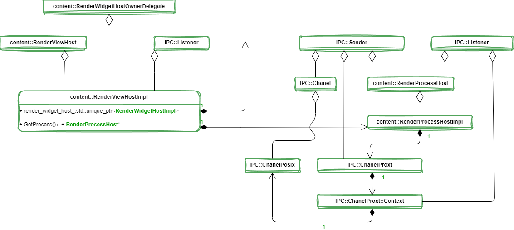

[TOC]

# Render进程启动过程分析

​		在配置多进程的情况下，Chromium 的网页渲染和 JS 执行在一个单独的进程中进行。这个进程称为**Render进程**，由 Browser 进程启动，它们通过**UNIX Socket**进行通信。本文就详细分析Chromium的Browser进程启动Render进程的过程。

Render 进程启动完成之后，将与 Browser 进程建立以下的 IPC 通道，如下图所示：

​       在 Browser 进程中，<u>一个 **RenderProcessHost** 对象用来描述它所启动的一个 Render 进程，而一个 **RenderViewHost** 对象用来描述运行在一个 Render 进程中的一个网页</u>，我们可以将它理解为浏览器中的一个 TAB。这两个对象在 Render 进程中都有一个对等体，它们分别是一个 RenderProcess 对象和一个 RenderView 对象。这里说的对等体，就是它们是 Browser 进程和 Render 进程进行 IPC 的两个端点，类似于 TCP/IP 网络堆栈中的层对层通信。例如，RenderViewHost 和 RenderView 之间的 IPC 通信，就代表了 Browser 进程请求 Render 进程加载、更新和渲染一个网页。

​       RenderViewHost 和 RenderView 之间的 IPC 通信，实际上是通过一个 UNIX Socket 进行的。<u>这个 UNIX Socket 的两端分别被封装为两个 Channel 对象，分别运行在 Browser 进程和 Render 进程各自的 IO 线程中</u>。这样 RenderViewHost 和 RenderView 之间的 IPC 通信就要通过上述的两个 Channel 对象进行。

​       在 Browser 进程中，由于 RenderViewHost 对象运行在主线程中，因此当它需要请求运行在 IO 线程中的 Channel 对象执行一次 IPC时，就要通过 IO 线程的消息循环进行。这符合我们在前面 Chromium 多线程模型设计和实现分析一文中提到的 Chromium 的多线程设计哲学：每一个对象都只运行在一个线程中，对象之间需要通信时就通过消息循环进行。同样，在 Render 进程中，由于 RenderView 对象运行在 Render 线程中，因此<u>当 Render 进程的 Channel 对象接收一个来自 Browser 进程的 RenderViewHost 对象的 IPC 消息时，需要通过 Render 线程的消息循环将 IPC 消息转发给 RenderView 进行处理。</u>从 RenderView 对象到 RenderViewHost 对象的通信过程也是类似的。

​		我们分析 Render 进程的启动过程，目的就是为了能够理解 Browser 进程和 Render 进程是如何建立 IPC 通道的，因为以后 Browser 进程与 Render 进程的交互和协作，都是通过这个 IPC 通道进行的。为此，我们在分析 Render 进程的启动过程中，将着重分析图中涉及到的各个对象的初始过程。

## Browser 进程

​		事实上，RenderProcessHost、RenderViewHost、RenderProcess 和 RenderView仅仅是定义了一个抽象接口，真正用来执行 IPC 通信的对象，是实现了上述抽象接口的一个实现者对象，这些实现者对象的类型以 Impl 结尾，因此，RenderProcessHost、RenderViewHost、RenderProcess和RenderView对应的实现者对象的类型就分别为RenderProcessHostImpl、RenderViewHostImpl、RenderProcessImpl和RenderViewImpl。

​		为了更好地理解 Render 进程的启动过程，我们有必要了解上述Impl对象的类关系图。

​		RenderViewHostImpl 对象的类关系图如下所示：

​		RenderViewHostImpl 类多重继承了 **RenderViewHost** 类和 **RenderWidgetHostOwnerDelegate** 类，RenderWidgetHostOwnerDelegate 是由 RenderViewHostImpl 和 RenderWidgetHostImpl 解开耦合的中间类，所以可以看到一些解析里面使用的是 RenderWidgetHostImpl。一般是在 RenderWidgetHostImpl 进行一些IPC消息，但是这里没有进行继承，是使用了成员变量来进行这些操作。

​		实际上，当RenderViewHostImpl 类需要发起一次 IPC 时，它是通过指向的一个RenderProcessHost接口进行的。该RenderProcessHost 接口指向的实际上是一个 RenderProcessHostImpl 对象，<u>它的类关系图如上图右边所示</u>。

​		RenderProcessHostImpl 类实现了 RenderProcessHost 接口，后者又多重继承了 Sender 和 Listener 类。

​		**<u>RenderProcessHostImpl 类有一个成员变量 channel_，它指向了一个 ChannelProxy 对象。ChannelProxy 类实现了 Sende r接口，RenderProcessHostImpl 类就是通过它来发送 IPC 消息的。</u>**

​		**<u>ChannelProxy 类有一个成员变量 context_，它指向了一个 ChannelProxy::Context 对象。ChannelProxy::Context 类实现了Listener 接口，因此它可以用来接收 IPC 消息。ChannelProxy 类就是通过 ChannelProxy::Context 类来发送和接收 IPC 消息的。</u>**

​		**<u>ChannelProxy::Context 类有一个类型为 Channel 的成员变量 channel_，它指向的实际上是一个 ChannelPosix 对象。ChannelPosix 类继承了 Channe l类，后者又实现了 Sender 接口。ChannelProxy::Context 类就是通过 ChannelPosix 类发送IPC消息的。</u>**

​		绕了一圈，总结来说，**<u>就是 RenderProcessHostImpl 类是分别通过 ChannelPosix 类和 ChannelProxy::Context 类来发送和接收IPC消息的。</u>**

## Render 进程

​		上面分析的 RenderViewHostImpl 对象和 RenderProcessHostImpl 对象都是运行在 Browser 进程的，接下来要分析的RenderViewImpl 类和 RenderProcessImpl 类是运行在 Render 进程的。

​		RenderViewImpl 对象的类关系图如下所示：

