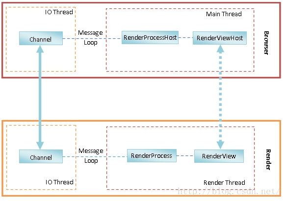
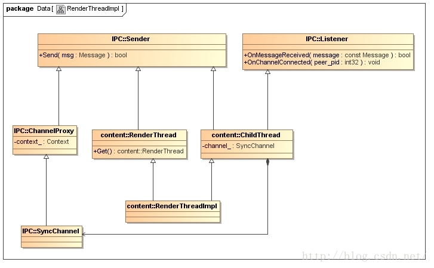
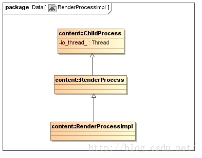

[TOC]


# Render进程启动过程分析

​		在配置多进程的情况下，Chromium 的网页渲染和 JS 执行在一个单独的进程中进行。这个进程称为**Render进程**，由 Browser 进程启动，它们通过**UNIX Socket**进行通信。本文就详细分析Chromium的Browser进程启动Render进程的过程。

Render 进程启动完成之后，将与 Browser 进程建立以下的 IPC 通道，如下图所示：



​       在 Browser 进程中，<u>一个 **RenderProcessHost** 对象用来描述它所启动的一个 Render 进程，而一个 **RenderViewHost** 对象用来描述运行在一个 Render 进程中的一个网页</u>，我们可以将它理解为浏览器中的一个 TAB。这两个对象在 Render 进程中都有一个对等体，它们分别是一个 RenderProcess 对象和一个 RenderView 对象。这里说的对等体，就是它们是 Browser 进程和 Render 进程进行 IPC 的两个端点，类似于 TCP/IP 网络堆栈中的层对层通信。例如，RenderViewHost 和 RenderView 之间的 IPC 通信，就代表了 Browser 进程请求 Render 进程加载、更新和渲染一个网页。

​       RenderViewHost 和 RenderView 之间的 IPC 通信，实际上是通过一个 UNIX Socket 进行的。<u>这个 UNIX Socket 的两端分别被封装为两个 Channel 对象，分别运行在 Browser 进程和 Render 进程各自的 IO 线程中</u>。这样 RenderViewHost 和 RenderView 之间的 IPC 通信就要通过上述的两个 Channel 对象进行。

​       在 Browser 进程中，由于 RenderViewHost 对象运行在主线程中，因此当它需要请求运行在 IO 线程中的 Channel 对象执行一次 IPC时，就要通过 IO 线程的消息循环进行。这符合我们在前面 Chromium 多线程模型设计和实现分析一文中提到的 Chromium 的多线程设计哲学：每一个对象都只运行在一个线程中，对象之间需要通信时就通过消息循环进行。同样，在 Render 进程中，由于 RenderView 对象运行在 Render 线程中，因此<u>当 Render 进程的 Channel 对象接收一个来自 Browser 进程的 RenderViewHost 对象的 IPC 消息时，需要通过 Render 线程的消息循环将 IPC 消息转发给 RenderView 进行处理。</u>从 RenderView 对象到 RenderViewHost 对象的通信过程也是类似的。

​		我们分析 Render 进程的启动过程，目的就是为了能够理解 Browser 进程和 Render 进程是如何建立 IPC 通道的，因为以后 Browser 进程与 Render 进程的交互和协作，都是通过这个 IPC 通道进行的。为此，我们在分析 Render 进程的启动过程中，将着重分析图中涉及到的各个对象的初始过程。

## Browser 进程

​		事实上，RenderProcessHost、RenderViewHost、RenderProcess 和 RenderView仅仅是定义了一个抽象接口，真正用来执行 IPC 通信的对象，是实现了上述抽象接口的一个实现者对象，这些实现者对象的类型以 Impl 结尾，因此，RenderProcessHost、RenderViewHost、RenderProcess和RenderView对应的实现者对象的类型就分别为RenderProcessHostImpl、RenderViewHostImpl、RenderProcessImpl和RenderViewImpl。

​		为了更好地理解 Render 进程的启动过程，我们有必要了解上述Impl对象的类关系图。

​		RenderViewHostImpl 对象的类关系图如下所示：


​		RenderViewHostImpl 类多重继承了 **RenderViewHost** 类和 **RenderWidgetHostOwnerDelegate** 类，RenderWidgetHostOwnerDelegate 是由 RenderViewHostImpl 和 RenderWidgetHostImpl 解开耦合的中间类，所以可以看到一些解析里面使用的是 RenderWidgetHostImpl。一般是在 RenderWidgetHostImpl 进行一些IPC消息，但是这里没有进行继承，是使用了成员变量来进行这些操作。

​		实际上，当RenderViewHostImpl 类需要发起一次 IPC 时，它是通过指向的一个RenderProcessHost接口进行的。该RenderProcessHost 接口指向的实际上是一个 RenderProcessHostImpl 对象，<u>它的类关系图如上图右边所示</u>。

​		RenderProcessHostImpl 类实现了 RenderProcessHost 接口，后者又多重继承了 Sender 和 Listener 类。

​		**<u>RenderProcessHostImpl 类有一个成员变量 channel_，它指向了一个 ChannelProxy 对象。ChannelProxy 类实现了 Sende r接口，RenderProcessHostImpl 类就是通过它来发送 IPC 消息的。</u>**

​		**<u>ChannelProxy 类有一个成员变量 context_，它指向了一个 ChannelProxy::Context 对象。ChannelProxy::Context 类实现了Listener 接口，因此它可以用来接收 IPC 消息。ChannelProxy 类就是通过 ChannelProxy::Context 类来发送和接收 IPC 消息的。</u>**

​		**<u>ChannelProxy::Context 类有一个类型为 Channel 的成员变量 channel_，它指向的实际上是一个 ChannelPosix 对象。ChannelPosix 类继承了 Channe l类，后者又实现了 Sender 接口。ChannelProxy::Context 类就是通过 ChannelPosix 类发送IPC消息的。</u>**

​		绕了一圈，总结来说，**<u>就是 RenderProcessHostImpl 类是分别通过 ChannelPosix 类和 ChannelProxy::Context 类来发送和接收IPC消息的。</u>**


## Render 进程

​		上面分析的 RenderViewHostImpl 对象和 RenderProcessHostImpl 对象都是运行在 Browser 进程的，接下来要分析的RenderViewImpl 类和 RenderProcessImpl 类是运行在 Render 进程的。

​		RenderViewImpl 对象的类关系图如下所示：


​		RenderViewImpl 类多重继承了 RenderView 类和 RenderWidget 类。RenderView 类实现了 Sender 接口。RenderWidget 类也实现了 Sender 接口，同时也实现了 Listener 接口，因此它可以用来发送和接收 IPC 消息。

​		RenderWidget 类实现了接口 Sender 的成员函数 **`Send`**，RenderViewImpl 类就是通过它来发送 IPC 消息的。RenderWidget 类的成员函数 **`Send`** 又是通过一个用来描述 Render 线程的 **RenderThreadImpl** 对象来发送IPC 类的。这个 RenderThreadImpl 对象可以通过调用 RenderThread 类的静态成员函数**`Get`**获得。

​       **RenderThreadImpl** 对象的类关系图如下所示：



​		RenderThreadImpl 类多重继承了 RenderThread 类和 ChildThread 类。RenderThread 类实现了 Sender 接口。ChildThread 类也实现 Sender 接口，同时也实现了 Listener 接口，因此它可以用来发送和接收 IPC 消息。

​		ChildThread 类有一个成员变量 channel_ ，它指向了一个 SyncChannel 对象。SyncChannel 类继承了上面提到的 ChannelProxy 类，因此，ChildThread 类通过其成员变量 channel_ 指向的 SyncChannel 对象可以发送IPC 消息。

​		从上面的分析又可以知道，ChannelProxy 类最终是通过 ChannelPosix 类发送 IPC 消息的，因此总结来说，就是 **<u>RenderThreadImpl 是通过 ChannelPosix 类发送 IPC 消息的</u>**。

​       接下来我们再来看 RenderProcessImpl 对象的类关系图，如下所示：



​		RenderProcessImpl 类继承了 RenderProcess 类，RenderProcess 类又继承了 ChildProcess 类。ChildProcess 类有一个成员变量 **io_thread_**，它指向了一个 Thread 对象。该 Thread 对象描述的就是 Render 进程的 IO 线程。


​		有了上面的基础知识之后，接下来我们开始分析 Render 进程的启动过程。我们将 Render 进程的启动过程划分为两部分：

- <u>第一部分是在 Browser 进程中执行的，它主要负责创建一个 UNIX Socket，并且将该 UNIX Socket 的 Client端描述符传递给接下来要创建的 Render 进程。</u>
- <u>第二部分是在 Render 进程中执行的，它负责执行一系列的初始化工作，其中之一就是将 Browser 进程传递过来的 UNIX Socket 的 Client 端描述符封装在一个 Channel 对象中，以便以后可以通过它来和 Browser 进程执行 IPC。</u>


​		Render 进程启动过程的第一部分子过程如下所示：


​		上图列出的仅仅是一些核心过程，接下来我们通过代码来分析这些核心过程。

​		我们首先了解什么情况下 Browser 进程会启动一个 Render 进程。**<u>当我们在 Chromium的 地址栏输入一个网址，然后进行加载的时候，Browser 进程经过判断，发现需要在一个新的 Render 进程中渲染该网址的内容时，就会创建一个 RenderViewHostImpl 对象，并且调用它的成员函数 CreateRenderView 触发启动一个新的 Render 进程。后面我们分析 WebView 加载一个 URL 的时候，就会看到触发创建 RenderViewHostImpl 对象的流程。</u>**

### RenderViewHostImpl

​     RenderViewHostImpl对象的创建过程，即RenderViewHostImpl类的构造函数的实现如下所示：

```c++
RenderViewHostImpl::RenderViewHostImpl(
    SiteInstance* instance,
    RenderViewHostDelegate* delegate,
    RenderWidgetHostDelegate* widget_delegate,
    int routing_id,
    int main_frame_routing_id,
    bool swapped_out,
    bool hidden)
    : RenderWidgetHostImpl(widget_delegate,
                           instance->GetProcess(),
                           routing_id,
                           hidden),
      ...... {
 
  ......
}
```

#### SiteInstanceImpl

​      这里我们主要关注类型为 SiteInstance 的参数 instance，它指向的实际上是一个 SiteInstanceImpl 对象，用来描述 Chromium 当前加载的一个网站实例。RenderViewHostImpl 类的构造函数调用该 SiteInstanceImpl 对象的成员函数 GetProcess 获得一个 RenderProcessHostImpl 对象，如下所示：

```c++
RenderProcessHost* SiteInstanceImpl::GetProcess() {
  ......
 
  // Create a new process if ours went away or was reused.
  if (!process_) {
    BrowserContext* browser_context = browsing_instance_->browser_context();
 
    // If we should use process-per-site mode (either in general or for the
    // given site), then look for an existing RenderProcessHost for the site.
    bool use_process_per_site = has_site_ &&
        RenderProcessHost::ShouldUseProcessPerSite(browser_context, site_);
    if (use_process_per_site) {
      process_ = RenderProcessHostImpl::GetProcessHostForSite(browser_context,
                                                              site_);
    }
 
    // If not (or if none found), see if we should reuse an existing process.
    if (!process_ && RenderProcessHostImpl::ShouldTryToUseExistingProcessHost(
            browser_context, site_)) {
      process_ = RenderProcessHostImpl::GetExistingProcessHost(browser_context,
                                                               site_);
    }
 
    // Otherwise (or if that fails), create a new one.
    if (!process_) {
      if (g_render_process_host_factory_) {
        process_ = g_render_process_host_factory_->CreateRenderProcessHost(
            browser_context, this);
      } else {
        StoragePartitionImpl* partition =
            static_cast<StoragePartitionImpl*>(
                BrowserContext::GetStoragePartition(browser_context, this));
        process_ = new RenderProcessHostImpl(browser_context,
                                             partition,
                                             site_.SchemeIs(kGuestScheme));
      }
    }
 
    ......
  }
  ......
 
  return process_;
}
```

​       这个函数定义在文件 content/browser/site_instance_impl.cc 中。

​       SiteInstanceImpl 对象的成员变量 process_ 是一个 **RenderProcessHost** 指针，当它的值等于 NULL 的时候，就表示 Chromium 还没有为当前正在处理的一个 SiteInstanceImpl 对象创建过 Render 进程，这时候就需要创建一个 RenderProcessHostImpl 对象，并且保存在成员变量 process_ 中，以及返回给调用者，以便调用者接下来可以通过它启动一个 Render 进程。

​		另一方面，如果 SiteInstanceImpl 对象的成员变量 process_ 已经指向了一个 RenderProcessHostImpl 对象，那么就直接将该 RenderProcessHostImpl 对象返回给调用者即可。


​		注意上述 RenderProcessHostImpl 对象的创建过程：

   1. <u>如果 Chromium 启动时，指定了**同一个网站**的所有网页都在同一个 Render 进程中加载，即本地变量 use_ process_ per_site 的值等于 true，那么这时候 **SiteInstanceImpl** 类的成员函数 GetProcess 就会先调用RenderProcessHostImpl 类的静态函 数GetProcessHostForSite 检查之前是否已经为当前正在处理的SiteInstanceImpl 对象描述的网站创建过 Render 进程。如果已经创建过，那么就可以获得一个对应的RenderProcessHostImpl 对象。</u>

   2. <u>如果按照上面的方法找不到一个相应的 RenderProcessHostImpl 对象，本来就应该要创建一个新的 Render 进程了，也就是要创建一个新的 RenderProcessHostImpl 对象了。但是由于当前创建的 Render 进程已经超出预设的最大数量了，这时候就要复用前面已经启动的 Rende r进程，即使这个 Render 进程加载的是另一个网站的内容。</u>

   3. <u>如果通过前面两步仍然找不到一个对应的 RenderProcessHostImpl 对象，这时候就真的是需要创建一个RenderProcessHostImpl 对象了。取决于 SiteInstanceImpl 类的静态成员变量g_render_process_host_factory_ 是否被设置，创建一个新的 RenderProcessHostImpl 对象的方式有所不同。如果该静态成员变量被设置了指向一个 RenderProcessHostFactory 对象，那么就调用该RenderProcessHostFactory 对象的成员函数 CreateRenderProcessHost 创建一个从 RenderProcessHost 类继承下来的子类对象。否则的话，就直接创建一个 RenderProcessHostImpl 对象。</u>

​        这一步执行完成后，回到 RenderViewHostImpl 类的构造函数中，从这里返回的 RenderProcessHostImpl 对象用来初始化 RenderViewHostImpl 类的父类 RenderWidgetHostImpl ，如下所示：

```c++
RenderWidgetHostImpl::RenderWidgetHostImpl(RenderWidgetHostDelegate* delegate,
                                           RenderProcessHost* process,
                                           int routing_id,
                                           bool hidden)
    : ......,
      process_(process),
      ...... {
  ......
}
```

​		这个函数定义在文件 content/browser/renderer_host/render_widget_host_impl.cc 中。

​		参数 process 指向的 **RenderProcessHostImpl** 对象保存在 RenderWidgetHostImpl 类的成员变量 process_中，以后就可以通过 **RenderWidgetHostImpl** 类的成员函数 GetProcess 获得该RenderProcessHostImpl 对象，如下所示：

```c++
RenderProcessHost* RenderWidgetHostImpl::GetProcess() const {
  return process_;
}
```

​      有了 RenderProcessHostImpl 之后，接下来我们就开始分析 RenderViewHostImpl 类的成员函数CreateRenderView 创建一个新的 Render 进程的过程了，如下所示：

```c++
bool RenderViewHostImpl::CreateRenderView(
    const base::string16& frame_name,
    int opener_route_id,
    int proxy_route_id,
    int32 max_page_id,
    bool window_was_created_with_opener) {
  ......
 
  if (!GetProcess()->Init())
    return false;
 
  ......
 
}
```

​		这个函数定义在文件 content/browser/renderer_host/render_view_host_impl.cc 中。

​		RenderViewHostImpl 类的成员函数 CreateRenderView 首先调用从父类 RenderWidgetHostImpl 继承下来的成员函数 GetProcess 获得一个 RenderProcessHostImpl 对象，接着再调用该 RenderProcessHostImpl 对象的成员函数 Init 检查是否需要为当前加载的网页创建一个新的 Render 进程。

​		RenderProcessHostImpl 类的成员函数 Init 的实现如下所示：

```c++
bool RenderProcessHostImpl::Init() {
  // calling Init() more than once does nothing, this makes it more convenient
  // for the view host which may not be sure in some cases
  if (channel_)
    return true;
 
  ......
 
  // Setup the IPC channel.
  const std::string channel_id =
      IPC::Channel::GenerateVerifiedChannelID(std::string());
  channel_ = IPC::ChannelProxy::Create(
      channel_id,
      IPC::Channel::MODE_SERVER,
      this,
      BrowserThread::GetMessageLoopProxyForThread(BrowserThread::IO).get());
 
  ......
 
  CreateMessageFilters();
 
  ......
 
  if (run_renderer_in_process()) {
    ......
    in_process_renderer_.reset(g_renderer_main_thread_factory(channel_id));
 
    base::Thread::Options options;
    ......
    options.message_loop_type = base::MessageLoop::TYPE_DEFAULT;
    
    in_process_renderer_->StartWithOptions(options);
 
    g_in_process_thread = in_process_renderer_->message_loop();
 
    ......
  } else {
    ......
 
    CommandLine* cmd_line = new CommandLine(renderer_path);
    ......
    AppendRendererCommandLine(cmd_line);
    cmd_line->AppendSwitchASCII(switches::kProcessChannelID, channel_id);
 
    ......
 
    child_process_launcher_.reset(new ChildProcessLauncher(
        new RendererSandboxedProcessLauncherDelegate(channel_.get()),
        cmd_line,
        GetID(),
        this));
 
    ......
  }
 
  return true;
}
```

​		RenderProcessHostImpl 类有一个类型为 scoped_ptr<IPC::ChannelProxy > 成员变量 channel_，当它引用了一个 IPC::ChannelProxy 对象的时候，就表明已经为当前要加载的网而创建过 Render 进程了，因此在这种情况下，就无需要往前执行了。

​		我们假设到目前为止，还没有为当前要加载的网页创建过 Render 进程。接下来 RenderProcessHostImpl 类的成员函数 Init 就会做以下四件事情：

#### Init

      1. 先调用 IPC::Channel 类的静态成员函数 **`GenerateVerifiedChannelID`** 生成一个接下来用于创建 UNIX Socket 的名字，接着再以该名字为参数，调用 IPC::ChannelProxy 类的静态成员函数 **`Create`** 创建一个用于执行 IPC 的 Channel，该 Channel 就保存在 RenderProcessHostImpl 类的成员变量 channel_ 中。
      2. 调用 RenderProcessHostImpl 类的成员函数 CreateMessageFilters 创建一系列的 Message Filter，用来过滤 IPC 消息。
      3. <u>如果所有网页都在 Browser 进程中加载，即不单独创建 Render 进程来加载网页，那么这时候调用父类RenderProcessHost 的静态成员函数 run_renderer_in_process 的返回值就等于 true。在这种情况下，就会通过在本进程（即 Browser 进程）创建一个**新的线程**来渲染网页。</u>这个线程由 RenderProcessHostImpl 类的静态成员变量 g_renderer_main_thread_factory 描述的一个函数创建，它的类型为**InProcessRendererThread**。InProcessRendererThread 类继承了 base::Thread 类，从前面 Chromium 多线程模型设计和实现分析一文可以知道，当调用它的成员函数 StartWithOptions 的时候，新的线程就会运行起来。这时候如果我们再调用它的成员函数 message_loop，就可以获得它的 Message Loop。有了这个Message Loop 之后，以后就可以向它发送消息了。
   4. 如果网页要单独的 Render 进程中加载，那么调用创建一个命令行，并且以该命令行以及前面创建的IPC::ChannelProxy 对象为参数，创建一个 **ChildProcessLauncher** 对象，而该 ChildProcessLauncher 对象在创建的过程，就会启动一个新的 Render 进程。


   接下来，我们主要分析第 1、3 和 4 件事情，第 2 件事情在接下来的一篇文章中分析 IPC 消息分发机制时再分析。

### IPC::Channel

​		第一件事情涉及到 IPC::Channel 类的静态成员函数 GenerateVerifiedChannelID 和 IPC::ChannelProxy 类的静态成员函数**`Create`**。

​		IPC::Channel 类的静态成员函数 GenerateVerifiedChannelID 的实现如下所示：

```c++
std::string Channel::GenerateVerifiedChannelID(const std::string& prefix) {
  // A random name is sufficient validation on posix systems, so we don't need
  // an additional shared secret.
 
  std::string id = prefix;
  if (!id.empty())
    id.append(".");
 
  return id.append(GenerateUniqueRandomChannelID());
}
```

​		IPC::Channel 类的静态成员函数 GenerateVerifiedChannelID 实际上是调用另外一个静态成员函数GenerateUniqueRandomChannelID 生成一个唯一的随机名字，后者的实现如下所示：

```c++
base::StaticAtomicSequenceNumber g_last_id;
 
......
 
std::string Channel::GenerateUniqueRandomChannelID() {
  ......
 
  int process_id = base::GetCurrentProcId();
  return base::StringPrintf("%d.%u.%d",
      process_id,
      g_last_id.GetNext(),
      base::RandInt(0, std::numeric_limits<int32>::max()));
}
```

​		从这里就可以看到，这个用来创建 UNIX Socket 的名字由当前进程的 PID、一个顺序数和一个随机数通过 "." 符号连接而成的。

​		回到 RenderProcessHostImpl 类的成员函数 Init 中，有了用来创建 UNIX Socket 的名字之后，就可以调用IPC::ChannelProxy 类的静态成员函数 **`Create`** 创建一个 Channel 了，如下所示：

```c++
scoped_ptr<ChannelProxy> ChannelProxy::Create(
    const IPC::ChannelHandle& channel_handle,
    Channel::Mode mode,
    Listener* listener,
    base::SingleThreadTaskRunner* ipc_task_runner) {
  scoped_ptr<ChannelProxy> channel(new ChannelProxy(listener, ipc_task_runner));
  channel->Init(channel_handle, mode, true);
  return channel.Pass();
}
```

​		IPC::ChannelProxy 类的静态成员函数 **`Create`** 首先是创建了一个 ChannelProxy 对象，然后再调用该ChannelProxy 对象的成员函数 Init 执行初始化工作，最后返回该 ChannelProxy 对象给调用者。

#### ChannelProxy 

​		ChannelProxy 对象的创建过程如下所示：

```c++
ChannelProxy::ChannelProxy(Listener* listener,
                           base::SingleThreadTaskRunner* ipc_task_runner)
    : context_(new Context(listener, ipc_task_runner)), did_init_(false) {
}
```

​      ChannelProxy 类的构造函数主要是创建一个 **ChannelProxy::Context** 对象，并且将该ChannelProxy::Context 对象保存在成员变量 context_ 中。

​      ChannelProxy::Context 对象的创建过程如下所示：

```c++
ChannelProxy::Context::Context(Listener* listener,
                               base::SingleThreadTaskRunner* ipc_task_runner)
    : listener_task_runner_(base::ThreadTaskRunnerHandle::Get()),
      listener_(listener),
      ipc_task_runner_(ipc_task_runner),
      ......
      message_filter_router_(new MessageFilterRouter()),
      ...... {
  ......
}
```

​       ChannelProxy::Context 类有三个成员变量是需要特别关注的，它们分别是：

1. **listenter_task_runner_** 。这个成员变量的类型为 scoped_refptr< base::**SingleThreadTaskRunner** >，它指向的是一个**SingleThreadTaskRunner**对象。这个SingleThreadTaskRunner对象通过调用ThreadTaskRunnerHandle类的静态成员函数Get获得。从前面Chromium多线程模型设计和实现分析一文可以知道，ThreadTaskRunnerHandle 类的静态成员函数 Get 返回的 SingleThreadTaskRunner 对象实际上是当前线程的一个 **MessageLoopProxy** 对象，通过该 MessageLoopProxy 对象可以向当前线程的消息队列发送消息。当前线程即为 Browser 进程的主线程。
2. **listener_** 。这是一个 IPC::Listener 指针，它的值设置为参数 listener 的值。从前面的图可以知道，RenderProcessHostImpl 类实现了 IPC::Listener 接口，而且从前面的调用过程过程可以知道，参数 listener 指向的就是一个 RenderProcessHostImpl 对象。**以后正在创建的 ChannelProxy::Context 对象在 IO 线程中接收到 Render 进程发送过来的 IPC 消息之后，就会转发给成员变量 listener_ 指向的RenderProcessHostImpl 对象处理，但是并不是让后者直接在 IO 线程处理，而是让后者在成员变量listener_task_runner_ 描述的线程中处理，即 Browser 进程的主线程处理。**也就是说，ChannelProxy::Context 类的成员变量 listener_task_runner_ 和 listener_ 是配合在一起使用的，后面我们分析 IPC 消息的分发机制时就可以看到这一点。
3. **ipc_task_runner_**。这个成员变量与前面分析的成员变量 listener_task_runner 一样，类型都为scoped_refptr<base::SingleThreadTaskRunner >，指向的者是一个 SingleThreadTaskRunner 对象。不过，这个 SingleThreadTaskRunner 对象由参数 ipc_task_runner 指定。**从前面的调用过程可以知道，这个SingleThreadTaskRunner 对象实际上是与 Browser 进程的 IO 线程关联的一个 MessageLoopProxy 对象。这个 MessageLoopProxy 对象用来接收 Render 进程发送过来的 IPC 消息。也就是说，Browser 进程在 IO 线程中接收 IPC 消息。**

​    ChannelProxy::Context 类还有一个重要的成员变量 message_filter_router_ ，它指向一个**MessageFilterRouter** 对象，用来过滤 IPC 消息，后面我们分析 IPC 消息的分发机制时再详细分析。

​    回到 ChannelProxy 类的静态成员函数 Create 中，创建了一个 ChannelProxy 对象之后，接下来就调用它的成员函数 Init 进行初始化，如下所示：

```c++
void ChannelProxy::Init(const IPC::ChannelHandle& channel_handle,
                        Channel::Mode mode,
                        bool create_pipe_now) {
  ......
 
  if (create_pipe_now) {
    ......
    context_->CreateChannel(channel_handle, mode);
  } else {
    context_->ipc_task_runner()->PostTask(
        FROM_HERE, base::Bind(&Context::CreateChannel, context_.get(),
                              channel_handle, mode));
  }
 
  // complete initialization on the background thread
  context_->ipc_task_runner()->PostTask(
      FROM_HERE, base::Bind(&Context::OnChannelOpened, context_.get()));
 
  ......
}
```

​		从前面的调用过程知道，参数 channel_handle 描述的是一个 UNIX Socket 名称，参数 mode 的值为IPC::Channel::MODE_SERVER，参数 create_pipe_now 的值为 true。<u>这样，ChannelProxy 类的成员函数 Init 就会马上调用前面创建的 ChannelProxy::Context 对象的成员函数 CreateChannel 创建一个 IPC 通信通道，也就是在当前线程中创建一个 IPC 通信通道 。</u>

​      另一个方面，如果参数 create_pipe_now 的值等于 false，那么 ChannelProxy 类的成员函数 Init 就不是在当前线程创建 IPC 通信通道，而是在 **IO 线程中创建**。因为它先通过前面创建的 ChannelProxy::Context 对象的成员函数 ipc_task_runner 获得其成员变量 ipc_task_runner_ 描述的 SingleThreadTaskRunner 对象，然后再将创建IPC 通信通道的任务发送到该 SingleThreadTaskRunner 对象描述的 IO 线程的消息队列去。当该任务被处理时，就会调用 ChannelProxy::Context 类的成员函数 CreateChannel。

​      当调用 ChannelProxy::Context 类的成员函数 CreateChannel 创建好一个 IPC 通信通道之后，ChannelProxy类的成员函数 Init 还会向当前进程的 IO 线程的消息队列发送一个消息，该消息绑定的是 ChannelProxy::Context类的成员函数 **`OnChannelOpened`**。因此，接下来我们就分别分析 ChannelProxy::Context 类的成员函数**`CreateChannel`** 和 **`OnChannelOpened`**。

​       ChannelProxy::Context类的成员函数**`CreateChannel`**的实现如下所示：

```c++
void ChannelProxy::Context::CreateChannel(const IPC::ChannelHandle& handle,
                                          const Channel::Mode& mode) {
  ......
  channel_ = Channel::Create(handle, mode, this);
}
```

​      ChannelProxy::Context 类的成员函数 CreateChannel 调用 Channel 类的成员函数 Create 创建了一个 IPC 通信通道，如下所示：

```c++
scoped_ptr<Channel> Channel::Create(
    const IPC::ChannelHandle &channel_handle, Mode mode, Listener* listener) {
  return make_scoped_ptr(new ChannelPosix(
      channel_handle, mode, listener)).PassAs<Channel>();
}
```

​		从这里可以看到，对于 Android 平台来说，IPC 通信通道通过一个 ChannelPosix 对象描述，该ChannelPosix 对象的创建过程如下所示：

```c++
ChannelPosix::ChannelPosix(const IPC::ChannelHandle& channel_handle,
                           Mode mode, Listener* listener)
    : ChannelReader(listener),
      mode_(mode),
      ......
      pipe_(-1),
      client_pipe_(-1),
#if defined(IPC_USES_READWRITE)
      fd_pipe_(-1),
      remote_fd_pipe_(-1),
#endif  // IPC_USES_READWRITE
      pipe_name_(channel_handle.name),
      ...... {
  ......
  if (!CreatePipe(channel_handle)) {
    ......
  }
}
```

​		从前面的调用过程可以知道，参数 channel_handle 描述的是一个 UNIX Socket 名称，参数 mode 的值等于IPC::Channel::MODE_SERVER，参数 listener 指向的是前面创建的 ChannelProxy::Context 对象。

​		ChannelPosix 类继承了 ChannelReader 类，后者用来读取从 Render 进程发送过来的 IPC 消息，并且将读取到的 IPC 消息发送给参数 listener 描述的 ChannelProxy::Context 对象，因此这里会将参数 listener 描述的ChannelProxy::Context 对象传递给 ChannelReader 的构造函数。

​		ChannelPosix类通过UNIX Socket来描述IPC通信通道，这个UNIX Socket的Server端和Client文件描述符分别保存在成员变量pipe_和client_pipe_中。如果定义了宏IPC_USES_READWRITE，那么当发送的消息包含有文件描述时，就会使用另外一个专用的UNIX Socket来传输文件描述符给对方。这个专用的UNIX Socket的Server端和Client端文件描述符保存在成员变量fd_pipe_和remote_fd_pipe_中。后面分析IPC消息的分发过程时，我们再详细分析这一点。


