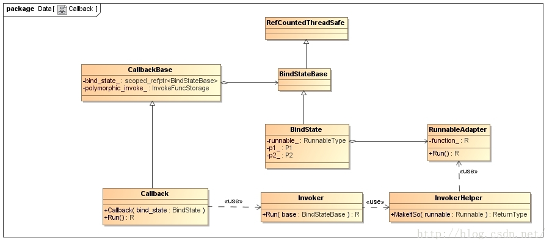

# Chromium多线程通信的Closure机制分析

[TOC]

​		为了充分利用 CPU 多核特性，Chromium 在启动时会创建很多线程，来负责执行不同的操作。这样就涉及到了多线程通信问题。

​		**<u>Chromium 为每一个线程都创建了一个消息队列。当一个线程需要另一个线程执行某一操作时，就向该线程的消息队列发送一个 Closure。这个 Closure 最终在目标线程中得到执行。</u>**

​		这种基于 Closure 的多线程通信方式在 Chromium 中使用得很普通，因此本文就对它的实现进行分析。

​		Closure 从字面翻译就是闭包的意思，但是它与 JavaScript 或者 C++ 11里面的闭包是不一样的，因为前者不像后者一样，会对作用域中的变量进行引用。

​		Chromium 多线程通信用到的 Closure 实际上是一个特殊的Callback。因此，本文实际要讲的是 Chromium的 Callback 机制。当我们理解了 Chromium 的 Callback 机制之后，就自然而然地理解 Chromium 多线程通信用到的 Closure 机制。

​		一个 Callback 从创建到调用的代码示例如下所示：

```c++
void MyFunc(int i, const std::string& str) {
    
}


base::Callback<void(const std::string&)> cb = base::Bind(&MyFunc, 23);
cb.Run("hello world");
```

​      我们首先是调用函数 base::Bind 创建了一个 Callback 对象。这个 Callback 对象与函数 MyFunc 进行绑定，同时被绑定的还有函数 MyFunc 被调用时传递进去的第一个整型参数 23。

​		我们接着调用了上述 Callback 对象的成员函数 Run，并且给它传递了一个字符串参数 “hello world”。这时候实际被调用的是函数 MyFunc，并且传递给它的两个参数分别就为整数 23 和字符串 “hello world”。

​       **如果我们把上面创建的 Callback 对象看作是一个 Closure，那么它首先会被发送到目标线程的消息队列中，然后再在目标线程中调用它的成员函数 Run，最后就会导致函数 MyFunc 在目标线程中被调用。**

​       从上面的代码片段我们可以看到一个有趣的东西，那就是函数 MyFunc 被调用时传递进去的两个参数是分开指定的。其中第一个参数在调用前指定的，而另一个参数是在调用时指定的。实际上我们可以做到所有的参数均在调用前指定，以及所有的参数均在调用时指定。当不是所有的参数均在调用时指定时，我们就可以简化一个函数的调用过程，即对一个函数实现了不同形式的调用，或者说可以使用不同的方式来调用一个函数。


​       此外，上面的代码片段创建的Callback对象是与一个全局函数绑定的。实际上，一个 Callback 对象还可以与一个类的成员函数绑定，不过这时候在调用函数 base::Bind 创建该 Callback 对象时，需要绑定一个对应的类对象，如下所示：

```c++
class MyClass {
public:
    void MyFunc(int i, const std::string& str) {}
};
 
MyClass* myclass = new MyClass;
base::Callback<void(void)> cb = base::Bind(&MyClass::MyFunc, myclass, 23, "hello world");
```

​		这里绑定的类对象就为 myclass，并且是以裸指针的形式指定的。这时候我们就需要保证 Callback 对象 cb 的成员函数 Run 被调用时，对象 myclass 还没有被销毁。


​		接下来，我们就通过源代码来分析 Chromium 的 Callback 机制的实现，也就是 Callback 对象的创建和调用过程。

​		在分析 Callback 对象的创建和调用过程之前，我们首先看它的类关系图，如下图所示：



​		从图可以看到，Callback 类是从 CallbackBase 类继承下来的。CallbackBase 类有两个成员变量 bind_state_ 和 polymorphic_invoke_ 。其中，成员变量 bind_state_ 指向的是一个 BindState 对象，该 BindState 对象是保存了其宿主 Callback 对象创建时绑定的函数以及参数。另外一个成员变量 polymorphic_invoke_ 指向的是一个InvokeFuncStorage 对象，该 InvokeFuncStorage 对象描述的是 Invoker 类的静态成员函数 Run。


