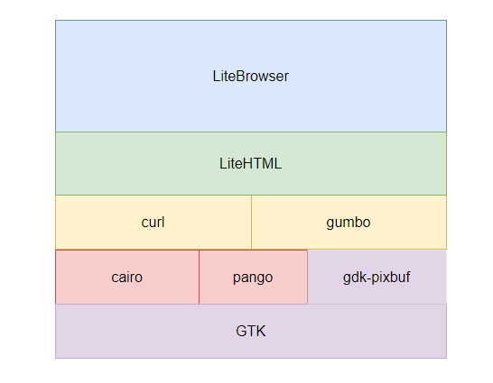
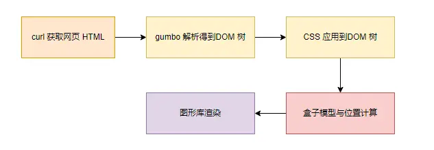

## 大致架构

​		litehtml 所做的事情很简单，解析 HTML/CSS，并渲染它们，这里的渲染指的是将元素置于恰当的位置，主要是布局的计算。也就是说，litehtml 本身并不依赖于任何图形库，我们可以自己选择图形库实现一些接口来自定义绘制。不过其实还是提供了几种图形库和平台的实现，例如在 **linux** 中，其依赖库构成的架构如下：

依赖库架构

- `LiteBrowser` 是最外层的shell，使用GTK绘制得到浏览器最基本的控件以及网页部分控件。
- `LiteHTML `是核心实现，负责浏览器解析渲染的流程控制。
- `curl`用于获取网页内容。
- [gumbo](https://link.zhihu.com/?target=https%3A//github.com/google/gumbo-parser)是google家的HTML解析库，用于将curl获取到的网页内容解析成DOM Tree。
- [cairo](https://link.zhihu.com/?target=https%3A//www.cairographics.org/)是核心的图形库，负责具体的元素绘制。
- [pango](https://link.zhihu.com/?target=https%3A//pango.gnome.org/)用于文字与字体的渲染。
- `gdk-pixbuf`是`GTK`的一部分，用于图片的渲染。
- `GTK`负责整个Widget的绘制，并提供一些控件用于绘制浏览器的基本界面。

## 渲染流程

与其他浏览器引擎类似，虽然 litehtml 很简单，但类似的渲染流程必不可少。

渲染流程

litehtml没有繁杂的设计，因此跟几遍代码执行流程就可以很容易得到上述渲染流程。

总体而言，litehtml虽然没有支持HTML/CSS所有特性，甚至JS引擎也未使用，但是它为入门者提供适合的角度来思考浏览器的渲染流程。相反，如果一开始就从chromium的渲染流程出发反而会一头雾水。

