[TOC]

# 矩阵变换

## 为什么需要Transformation

1. 描述摄像机的运动
2. 描述图像的缩放变化
3. 用于将3D视图投影到2D图像上

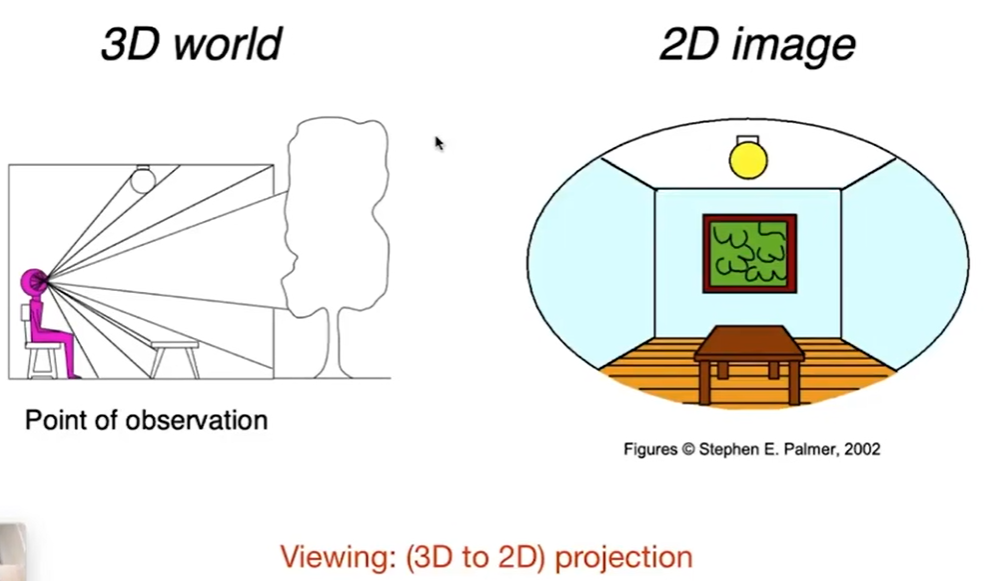

## 一、2D Transformation

Linear（线性） Transforms = Matrices
其中，线性变换包括以下4种：

### 1.1 Scale（缩放）

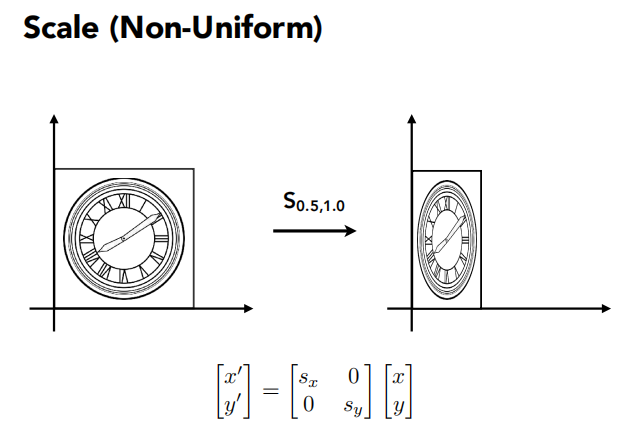

### 1.2 Reflection（反射）

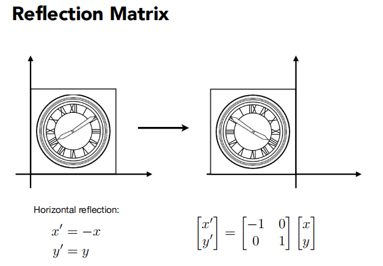

### 1.3. Shear（切变）

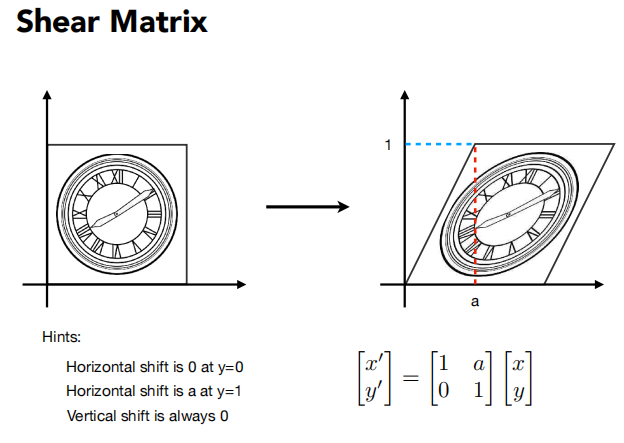

### 1.4 Rotate（旋转）

默认都是按照远点逆时针旋转

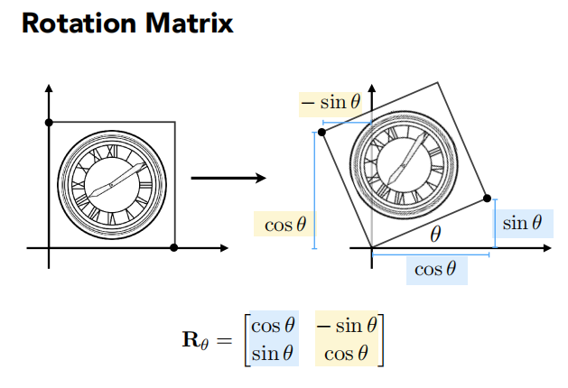

### 1.5 总结：线性变换=矩阵

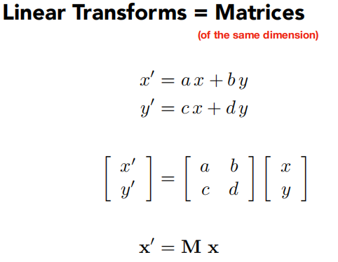

## 二、Homogeneous coordinates（齐次坐标）

- 为什么要引入齐次坐标
  - 平移变换 ：它不是线性变换，不能写成 一个x’ = M x 的形式，

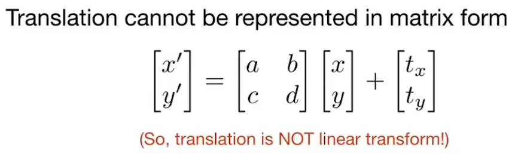

- 我们不希望把平移当做一种特殊的情况去考虑

- **引入齐次坐标：可以把线性变换和平移（二者合起来就是仿射变换），用同一种形式去表示。**

  

### 2.1 平移变换不是线性变换⟶⟶引入齐次坐标

#### 2.1.1 齐次坐标

- 可以把二维的点，增加一个维度，写成以下第一行形式
- 对于二维向量，写成以下第二行形式
- 对于二维的点，增加了一个“1”的维度，就有了一个非常好的性质
  - 在它前边乘以这样一个矩阵（图中红框圈出），得到的结果，**可以表示平移变换**。
  - 这样一来，我们的目的就达到了：用同一种形式表示线性变换和平移变换。

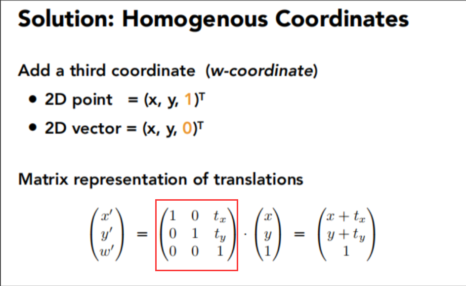

- 对于增加维度 “1” “0” 的解释
  - 为什么向量是 “0”
    - 首先回顾向量的概念：表示的是一个方向，也就是说，它有这样的性质：`平移不变性`。这就是为什么向量增加的维度是 “0” 的原因，这样一来，向量做任何平移变换操作时，就可以保证符合平移不变性。
  - 更深层次的理解
    - 增加维度的 “0” 和 “1” 是有意义的
    - 向量＋向量 = 向量   对应：0 + 0 = 0
    - 点 - 点 = 向量           对应：1 - 1 = 0
    - 点 + 向量 = 点          对应：1 + 0 = 1
    - 点 + 点 = ？？          本来一个点加一个点是没有意义的，但是人们扩充了它的定义：点+点表示的就是这两个点的中点。也就是2.1.2 中说的

#### 2.1.2 在齐次坐标下的2维点

对于任何w（w≠0），
$$
\left[
\begin{matrix}
    x\\\
    y\\\
    w
   \end{matrix}
\right]
$$
表示的就是二维点
$$
\left[\begin{matrix}    x/w\\\    y/w\\\    1   \end{matrix}\right]
$$
 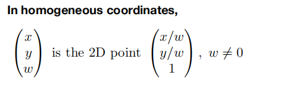

### 2.2 Affine Transformation（仿射变换）

`仿射变换=线性变换+平移`
顺序：先线性变换后平移（3D仿射同样）

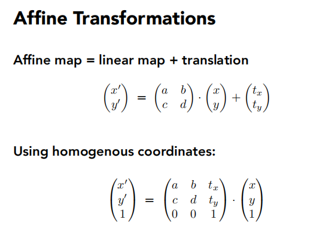

### 2.3 齐次坐标下的2D Transformations

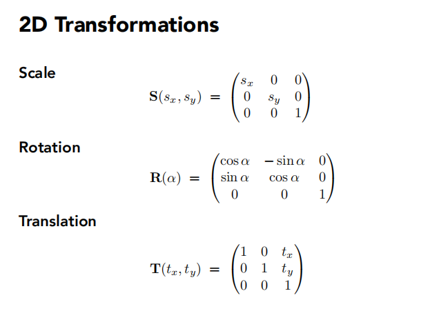

### 2.4 逆变换

逆变换就是乘以变换矩阵的逆矩阵

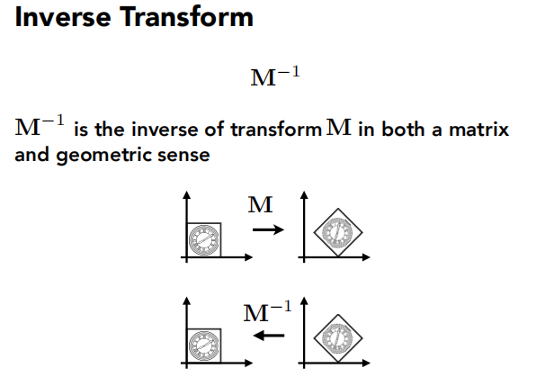

## 三、Composite Transformation（组合变换）

### 3.1 复杂的变换都是由简单的组合而来

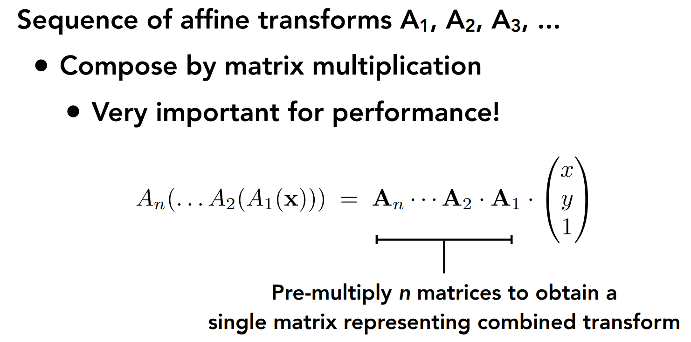

### 3.2 变换的顺序很重要

矩阵的“左乘”
一般都是选旋转后平移

### 3.3 矩阵乘法无交换律

eg.一个不在原点的做旋转：先变换到原点→旋转→转换回原来位置

### 3.4 解耦复杂变换

注意矩阵的运算顺序是从右到左

## 四、3D Transformation

### 4.1 齐次坐标下的 3 维向量和点

### 4.2 齐次坐标下的 3D Affine Transformation

