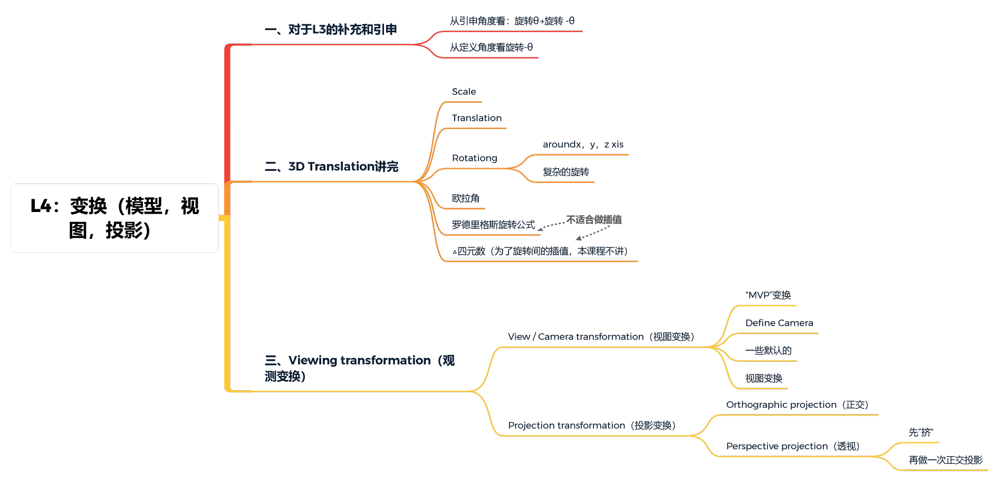
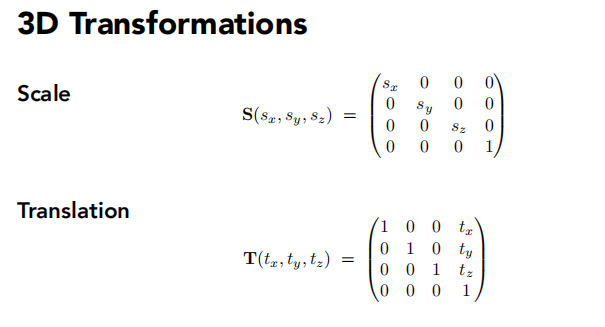
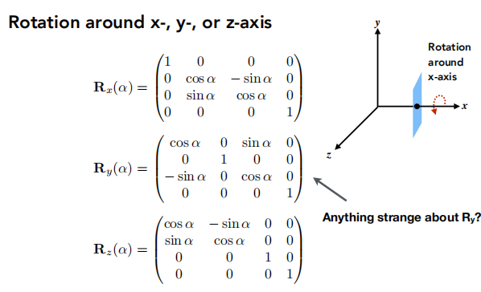
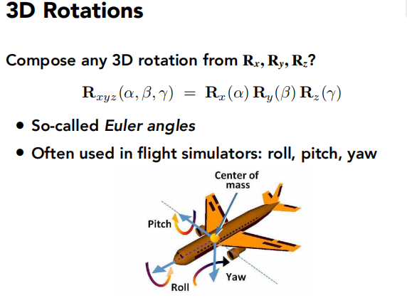
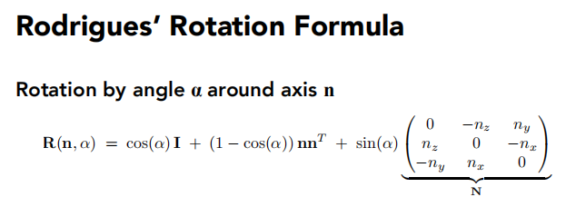
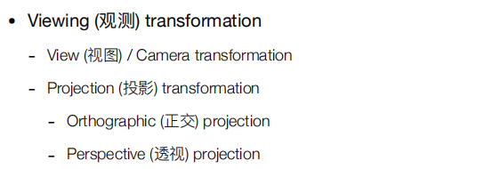

## 一、在旋转里面，矩阵的逆等价于矩阵的转置

结论：**在旋转里面，矩阵的逆=转置**。
数学上：**一个矩阵的逆=转置 →正交矩阵**

## 3D Translation

### 1.Scale缩放

### 2.Translation位移

### 3.Rotation

#### ①绕着坐标轴转

#### ②复杂的旋转→引入欧拉角

 下图源自维基百科的欧拉角示例图： 

注：由于存在旋转组合次序，所以当处于旋转次序中的中间轴一旦由于不当旋转使得它其他某个轴重合时，旋转就会出现扭曲，这种现象称为万向节死锁。而解锁时也会使得旋转插值十分扭曲。常见的解决方法是规定旋转次序、规定某个轴的旋转角度不能超过一定范围、使用四元数旋转。

#### ③罗德里格斯旋转公式

任意轴的旋转表示

 具体证明见如下链接：
https://blog.csdn.net/SKANK911/article/details/90056646 

注：

(a.)n是旋转轴，α是旋转角度

(b.)默认轴n过原点→不过原点就移到原点再变换，再移回去

## Viewing transformation（观测变换）

观测变换包括视图变换和投影变换

### 1.MVP变换（Model、View、Projection）

MVP的理解：

- Model transformation (placing objects)
  eg：找个好的地方，把所有人集合在一起，摆个pose！（把模型、场景搭好）
- View transformation (placing camera)
  eg：找一个好的角度/位置，把相机放好，往某一个角度去看。（改变的是相机）
- Projection transformation
  eg：茄子！

### 2.View translation（视图变换）

#### ①定义“Camera”

视图变化本质是通过定义一个摄像机来观察物体，所以该问题也可以转换成如何定义一个摄像机。通常一个摄像机由四个部分组成：

- 相机位置
- 相机朝向
- 相机上轴
- 相机右轴

但是我们一般只需要前三个分量，因为最后一个右轴就可以通过相机朝向和上轴叉乘得到。

我们通过相机空间观察物体，一般采用两种方式：

- 一种是相机动，物体不动；
- 另一种是物体动，相机不动。
  本课程采用的是第二种方式，并且将相机固定在`原点`，朝向`-z`轴，并使上轴与`y轴重合`。

#### ③视图变换矩阵实现

//右边的e/t/g 旋转到左边的xyz去

原始的旋转不好求→先求逆变换（好求）→旋转矩阵的逆（正交矩阵情况下=矩阵的转置）

#### ④总结

-对象会和相机一起变换（保证相对运动）

-模型变换和视图变换经常被一起叫作模型视图变换（Also know as ModelView Translation）

## 2.Projection Translation（投影变换）

​		投影所做的事是把3D空间物体投影到二维空间，同时通过一个范围约束所有坐标必须处于这段范围内，落到范围外的坐标应该被舍弃掉。

​		通常这里需要一个投影矩阵，它描述了一个范围的坐标，比如（-100,100）。投影矩阵接着会将在这个指定的范围内的坐标变换为标准设备坐标的范围(-1.0, 1.0)。

​		通常采用的投影方式有两种，一种是正交投影，另一种是透视投影。

### （1）正交投影

​		正交投影假设视点无限远，所以构成的范围是一个长方体。它常常需要我们提供长方体的高，宽，近平面距离以及远平面距离。如下图所示：

如何通过一个长方体[l,r]×[b,t]×[**f**,**n**]进行正交投影呢？通常有如下步骤：

1. 固定相机在原点，使其朝向-z，上轴和y重合；
2. 丢弃z轴；
3. 把正方体规范化到 [−1,1]3[−1,1]3 ，即先平移，后放缩

先移动到原点，再缩放

//注：

因为是右手坐标系，所以n>f

OpenGL是左手坐标系。

###  （2）透视投影 

​		透视投影更像一个近小远大的截体来规定坐标的范围，它更符合人眼成像，即产生近大远小效果，在图形学中也更常见，使用得更多。它通常需要我们提供:

- 截体的 FOV 角度
- 宽高比
- 近平面距离
- 远平面距离，如下图所示：

####   （a.）先回顾一下齐次坐标下的一个概念 

eg：两个表示的都是同一个点（1,0,0）

####  （b.）怎么做透视投影 

- 感性认识：
  - 先“挤”成长方体（①-⑥）
  - 再做一次正交投影（已知）

其中规定：       

- 近平面上和远平面上Z不变；
- 远平面中心那个点也不变；

**重点：如何挤**

① 找到挤前和挤后的关系：

② 在齐次坐标下

③ 到此已经能推出矩阵除了第三行以外的内容

一个矩阵M  乘以    $\bigl(    \begin{smallmatrix}	x\\y\\z\\1 \end{smallmatrix} \bigr)$ = $\bigl(    \begin{smallmatrix}	nx\\ny\\unknown\\z \end{smallmatrix} \bigr)$

根据矩阵乘法可以推出1、2、4行分别是什么

④ 接下来解决第三行的问题      →    近平面和远平面的z都不变、远平面中心点不变 

⑤ 近平面和远平面的 z 都不变：

假设 z 为 n，

那么，矩阵M的第三行  ×    $\bigl(    \begin{smallmatrix}	x\\y\\n\\1 \end{smallmatrix} \bigr)$ =   $n^2$ ⟹  和x，y无关  ⟹ 第三行的前两个数为0

→可知矩阵 M 第三行为（0，0，A，B）→ An + B = $n^2$

A，B未知

⑥ 远平面中心点（0，0，f）不变：

​	即 $\bigl(    \begin{smallmatrix}	0\\0\\f\\1 \end{smallmatrix} \bigr)$ 映射还是 $\bigl(    \begin{smallmatrix}	0\\0\\f\\1 \end{smallmatrix} \bigr)$ == $\bigl(    \begin{smallmatrix}	0\\0\\f^2\\f \end{smallmatrix} \bigr)$ 

​	同⑤一样，看矩阵M第三行 × $\bigl(    \begin{smallmatrix}	0\\0\\f\\1 \end{smallmatrix} \bigr)$=$f^2$   → Af+B=$f^2$

​	结合⑤和⑥的两个结论：

​	An+B = $n^2$

​	Af+B = $f^2$

​	两个式子，两个未知数，就可以解出A，B   →   解出矩阵M的第三行    →    解出矩阵M

  

 （c.）总结： 

