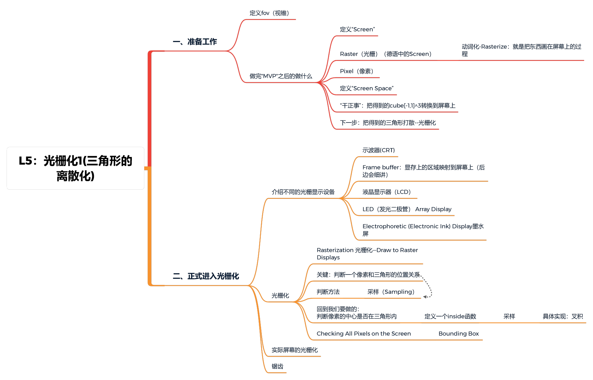
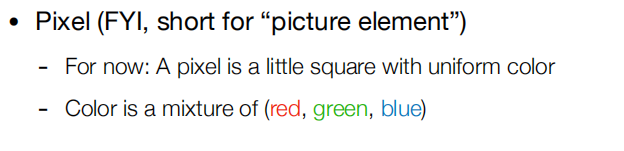

[TOC]

# 一、一些准备工作

术语说明：

- `Raster（光栅）`: 即德语中的Screen， 动词化Rasterize=drawing onto screen
- `Pixel（像素）`: Picture element的缩写
  

## 1.1 视锥定义（Define a fov）

只需要定义：`垂直的可视视角` 和 `宽高比` （其他的正交变换之类都可推导出）

fovY 表示视野角度，同时已知近平面深度为 n，远平面深度为 f，宽高比为 aspect，所以可以通过相似三角形和角度关系求得：

$tan⁡(fovY/2) = t/ |n|$

$aspect = r/t → r = aspect⋅t$

即构建透视矩阵需要视野角度 fov，宽高比，znear, zfar 四个参数。

## 1.2 视口变换

在`M（model）`,`V（view）`,`P（projection）`变换之后，我们已经得到了三维坐标在二维屏幕上的投影，同时也得到了`投影区域(Canonical Cube)`。之后所需要的就是`视口变换`。视口变换是把三维坐标与屏幕上指定的区域进行映射，简单来说就是我们在屏幕上规定了一块区域，然后将我们投影的坐标规定好，只能画在这块区域中，这就是视口变换所做的事情。

## 2.“MVP”后 做什么？

<u>MVP得到 $cube[-1，1]^3$ →   画在Screen（屏幕）</u>

### ①定义“Screen”：

- 一个二维数组
- 数组中的每个元素就是像素（分辨率就是像素的多少）
- 是一个典型的光栅成像设备

### ②Raster（光栅）就是德语中的Screen

动词化 Rasterize = drawing onto screen

### ③Pixel（像素）（PIcture element的缩写）

### ④定义“Screen Space”（屏幕空间）

认为屏幕左下角是原点，向右是 x，向上是 y

一些规定：

- Pixel's indices（像素坐标）是（x，y）的形式；x，y都是整数（integers）
- 所有的像素的表示（0，0）to（width-1，height-1）
- 像素的中心：（x+0.5，y+0.5）
- 整个屏幕覆盖（0，0）to（width，height）

### ⑤干正事：把得到的cube转换到屏幕上，即$[-1, 1]^3$  →屏幕

- 先不管z轴 →$[-1, 1]^2$ to [0, width] x [0, height]
- 方法：乘以矩阵：

 

## 2.回到正题，如何画在屏幕上。 

### 1 Rasterization 光栅化—Draw to Raster Displays

三角形：

 ①为什么是三角形： 

- 是最基础的图形，边最少
- 其他的多边形可以拆成三角形

 ②三角形的一些性质： 

-  三角形内一定是平面

-  内外的定义很明确

-  定义三个顶点后，三角形内可以插值

### 2 光栅化的关键

 如何判断一个像素和三角形的位置关系（像素中心点与三角形的位置关系）

### 3 判断方法

①采样

-  感性理解：给你一个连续函数，在不同的地方去问，它的值是多少

-  采样就是把函数离散化的过程

-  采样是图形学很重要的一个概念，此处是指利用像素中心对屏幕进行采样

 ②回到我们要做的：判断像素中心是否在三角形内： 

- 定义一个inside函数

●采样：

●具体的实现：叉积→全负/正即为三角形内

●一个特殊情况：点在边上怎么办 

- 不做处理（本课程） 
- 特殊处理（OPenGL和DX）

● Checking All Pixels on the Screen? 

 3.Rasterization on Real Displays 

 4.锯齿 

