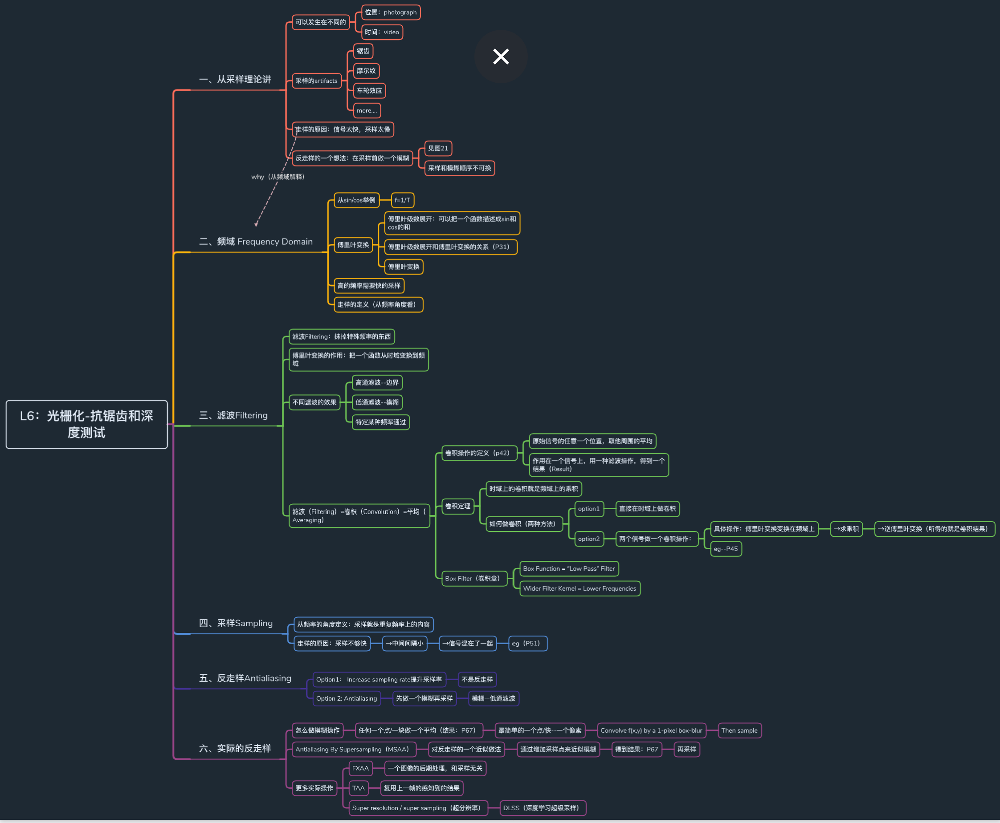
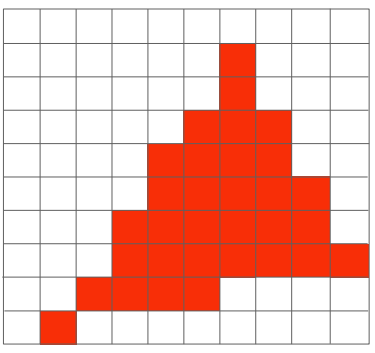

[TOC]

# 抗锯齿

​		上一节提到了光栅化三角形，而在实际中，屏幕会由于分辨率和采样频率的一些问题，导致三角形在光栅化过程中出现走样（当然，线条也会出现走样）。这是由于三角形的边或者线段在观测中是无限细的，**<u>可以看做是带宽无限的信号，而对这些图元进行像素化的过程中，采样频率不足，导致采样过程中丢失高频成分，所以产生的信号失真，在屏幕上就表现为锯齿状的图像，这种现象就称为`走样`，</u>**如下图：

​		所以我们就需要反走样来减少或消除这种效果。基本上反走样方法可分为两类。

- 第一类是<u>通过提高分辨率即增加采样点(提高采样频率)</u>，比如先在较高分辨率上对光栅进行计算，然后采用某种下采样算法得到较低分辨率的象素的属性，并显示在分辨率较低的显示器上，这类方法有SSAA；
- 另一类反走样是<u>把像素作为一个有限区域，对区域采样来调整像素的颜色或亮度，这种方法类似于图像中的前置滤波（blur等）</u>，这类方法有MSAA。

### 1.1 采样的artifacts

1. 锯齿
2. 摩尔纹
3. 车轮效应
4. 采样伪影(Artifacts)： 由于采样频率不足而产生的一些走样现象。

### 1.2 走样的原因

信号太快，采样太慢

### 1.3 反走样的一个想法：在采样前做一个模糊

注意：模糊和采样的顺序不能换，否则是错的 如下图↓

# 二、频域基本概念

### 2.1 sin/cos举例

### 2.2 傅里叶变换

关于傅里叶变换的资料：https://zhuanlan.zhihu.com/p/19763358

# 三、卷积与滤波基本概念

​		<u>假设我们以一定的频率对下面的函数进行采样，会发现当函数自身频率越高时，由于采样频率不够，恢复的函数与原来的函数也差异过大</u>。

​		高的频率需要快的采样，采样跟不上频率就会发生走样，一样的采样下无法区别出不同的频率的曲线

​		而滤波恰恰就是能够过滤掉图像（函数）中的某些频率部分。如高通滤波，低通滤波。卷积其实也是滤波的一种形式，它是对信号周围进行加权平均的一种运算。而卷积定理在频域与时域上也十分重要，即：
在函数在时域上的卷积等于其在频域上的积，反之亦然，如下图：

### 3.1 不同滤波的效果

高通滤波：边界
低通滤波：模糊

从图形学的角度考虑：滤波（Filtering）=卷积（Convolution）=平均（Averaging）

### 3.2 卷积操作

#### 3.2.1 卷积操作的定义

①原始信号的任意一个位置，取其周围的平均
②作用在一个信号上，用一种滤波操作，得到一个结果Result
eg：见下图↓

#### 3.2.2 卷积定理

**时域上的卷积就是频域上的乘积, 时域上的乘积就是频域上的卷积。**

做一个卷积的两种操作
Operation1：图和滤波器直接在时域上做卷积操作
Operation2：先把图傅里叶变换，变换到频域上，把滤波器变到频域上，两者相乘；乘完之后再逆傅里叶变换到时域上

eg：

#### 3.2.3 Box Filter（卷积盒）-低通滤波器

时域上变大 → 频域上变小

# 四、采样Sampling

### 4.1 从频率的角度定义，<u>采样就是重复频率上的内容</u>

### 4.2 走样的原因

采样不够快→中间间隔小→信号混在了一起

# 五、反走样（Antialiasing）处理方法

Option1： Increase sampling rate提升采样率
并不是反走样，不是我们这个课程需要的

Option 2: Antialiasing

先做一个模糊再采样。模糊-低通滤波（结合前边有说）

# 六、实际的反走样

### 6.1 反走样理想操作

任何一个点/块都做一个平均最简单的点→pixel像素

### 6.2 MSAA(Supersampling)

超采样就是通过对一个像素内的多个位置进行采样并取其平均值来近似1-pixel 滤波器(卷积,blur)的效果

对于 4 X MSAA来说，其步骤如下：
①假设每个像素中对四个点进行采样
②判断对于一个像素有多少个点在三角形内，然后根据比例对颜色进行"模糊"

结果如下：

MSAA 的问题：

1. 增加了计算开销

### 6.3 更多其他采样方法

1. FXAA
   一种后期图像处理，和采样无关
2. TAA
   复用上一帧感知到的结果
3. Super resolution / super sampling（超分辨率）
   DLSS深度学习。

# 七、可见性/遮挡

​		当在屏幕上画好了三角形后，我们要确定物体与物体之间的遮挡关系，而这种方法通常使用的是`Z-buffering（深度缓冲）`

### 7.1 画家算法（油画）

​		画家算法是一种比较简单的计算遮挡的算法。它把需要画的物体按深度大小的顺序进行排序，然后按由远到近的顺序依次画物体。在出现遮挡时，只需要把遮挡物体直接画在遮挡处即可，所以它会不断的覆盖之前绘制的物体。

即：先画远处，再画近处，遮挡住远处

​		但是这种算法会出现无法解决的深度顺序问题，因为它是按照绘制的多边形的深度进行排序，如下图：

### 1.2 Z-Buffer深度缓冲

​		Z-buffering相较画家算法而言更加适用，因为它是按像素的深度大小进行排序。

它的主要思想如下：
		为每一个像素存储当前的最小深度值（这里课程指的是深度越小，离视点越近，如果z轴的远近定义不一样，则会存储最大深度值），当扫描到新的像素，如果它的深度更小，则用它对应或插值的颜色值来替代当前需要显示的颜色值。

思路如下：

1. 记录当前像素的最浅深度
2. 需要一个额外的 buffer 来放深度值
   - Frame buffer stores color values
   - depth buffer（z buffer）stores depth

注意：

1. 这里为了简化概念，这里针对深度这个概念z轴是正的（近处z小，远处z大）
2. 对于深度的理解：离摄像机越近深度越小，越远深度越大
3. 越近越黑，越远越白（参考美术的颜色值：0-1对应黑到白）

流程图如下：

例子：

重点：小的（近的）遮住大的（远的）
具体操作：

- 小的→更新
- 大的→不变
- 一样→待定（z-fight：深度冲突，从别的地方再去了解）

### 1.3 Z-Buffer复杂度分析

1. 为什么不是O（nlog）（排序的最小复杂度）而是O（n）
   因为不是排序算法，只是对每个像素求最小值
2. Z-Buffer算法和顺序无关（不考虑深度相同的情况）

