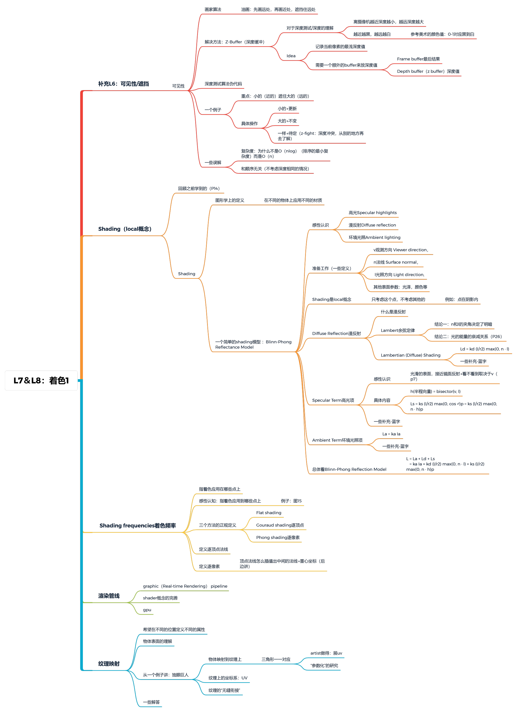

[TOC]


# Shading（着色）

shading 的字面意思就是通过对物体进行上色
对于本门课程来说：shading 的定义是对物体应用材质的过程。
而材质可以理解成物体自身对光线的各种反应情况，它反应了物体本身的物理属性。


# Blinn-Phong Reflectance Model（Blinn-Phong 光照模型）

感性认识：一个物体上可以分为三部分：高光、漫反射、环境光照


一些基本概念

1. 观测方向 v，法线 n，光照方向 l
   
2. Shading 是一个 local 概念， 即只考虑这个点的着色情况，不考虑其他的。（例如：点在阴影里）

### 3.1 `Diffuse Reflection漫反射`概念

#### 3.1.1 什么是漫反射

​		光会被均匀的反射到不同的方向，是模拟光源对物体的方向性影响，所以它是独立于视线的，图中方程也没有和视线相关的参数。$I/r^2$ 表示光的衰减情况，max⁡(0,n⋅l)max(0,**n**⋅**l**)计算的是0和 法向量与光照向量的较大值， 因为当光照向量与法向量夹角大于 90° 时，其结果会为负，没有意义，而 $k_d$ 可以看做是漫反射系数，当像素有颜色时，它是像素的颜色值，当像素有纹理时，它可以是像素的纹理值（实际上还是纹理的颜色值）

#### 3.1.2 Lambert余弦定律

- 结论一：n 和 l 的夹角决定了明暗(即物体接收到的光照能量和 n、l 夹角的余弦成正比）
  
- 结论二：光的衰减关系
  

公式表示

说明：

- max 的意义：cos 为负时无意义
- 漫反射系数 $k_d$ 引申一下颜色是怎么来的：接收的光分为：吸收的 和 反射的→产生颜色（1 为全反射=白； 0为全吸收=黑）表示为一个vector→RGB三通道→定义一个颜色
- 整体公式可知和v无关→和观察方向无关
- 只是一个经验模型，与实际物理有差异


### 3.2 Specular Term高光项

​		高光用来模拟有光泽物体上面出现的亮点，它是依赖于观察方向的，当**视线与光照向量的半程向量与法向量夹角越大时，高光影响越小，当夹角越小时，影响越大**。可以这样想象，我们需要看的是一块镜面的反射，当我们的视线与光照向量恰好对称时，高光越强。$k_d$为高光系数，h 为半程向量，这里用半程向量的好处主要是用于解决视线与光照向量在同一侧，从而引起的`光断层现象`。


#### 3.2.1 半程向量


c. 说明

- $k_s$为什么是白色→因为是经验性模型，是简化之后的
- 为什么n⃗*n* h⃗*h*不用反射方向：因为好算（用反射方向的话就是：phong模型）
- “p 次方的作用”：控制高光多大
  


### 3.3 Ambient Term环境光照

​		用来模拟即使在黑暗的情况下，世界上通常也仍然有一些光亮（月亮、远处的光），所以物体几乎永远不会是完全黑暗的这种情况。


说明：

- 环境光和l n v 都没关系 →就是一个常数→一个颜色
- 是近似/假设的

### 3.4 总体概括Blinn-Phong模型


## 四、光照规则补充

计算光照的一些简单规则：

1. `物体颜色`：我们在现实生活中看到某一物体的颜色并不是这个物体真正拥有的颜色，而是它所反射的颜色。如果想知道物体的颜色，只需要用它的颜色和光的颜色进行逐元素乘即可。

比如下面的例子，光照颜色是绿色，通过用物体颜色和光照颜色进行逐元素乘，发现最后物体吸收了一半的绿色，并且以另一半为结果反射给人眼，所以我们看到的结果应该是暗绿色的物体

```javascript
vec3 lightColor(0.0f, 1.0f, 0.0f);
vec3 objectColor(1.0f, 0.5f, 0.31f);
vec3 lightResult = lightColor * objectColor; // = (0.0f, 0.5f, 0.0f);
```

1. `利用点乘计算光照影响`：漫反射表示光会朝不同的方向进行反射，为了计算光对物体表面的影响，我们只需要光和物体表面法向量进行点乘即可，想想看一束光如果直接垂直打在物体上，其影响是最大的
   
2. `光的衰减`：光照强度会随着距离衰减，注意衰减范围是以光源为中心的圆展开的


# Shading Frequencies着色频率（指着色应用在哪些点上）

​		引起着色的不同主要就是因为着色频率不同所导致的，如下图：
​		从左到右依次应用为 面 → 顶点 →像素


​		这里主要分成对三角形进行着色，对顶点进行着色，对像素进行着色三种着色方案进行讨论

### 1.1 Flat shading（应用在表面，对三角形进行着色）

​		对每个三角形着色也称为`Flat shading` ，它是指每项属性例如纹理，法向，颜色，都是属于一个三角形的，所以三角形内部不会有插值变化。所以，三角形内部只会根据面法向量对光线反射进行计算，所有的三角形反射都看做一个平面，给人以一种块状的效果（三角形较少时），如下图：

​		简言之：两边做叉积→三角形的法线


### 1.2 Gouraud shading（逐顶点）

​		对顶点进行着色也称为`gouraud shading`，它发生在`顶点着色器阶段`。对于每个多边形的顶点都存在一个法向量，但是他的着色是**先通过这些法向量对顶点计算出光照颜色，然后用光照颜色来进行三角形内部插值**，如下图：

​		简言之：算出顶点法线，然后插值


#### 定义逐顶点法线求法

​		认为顶点的法线为相邻面的法线的平均（更优办法是根据面积加权平均）


### 1.3 Phong shading（逐像素）

​		对每个像素着色也称`phong shading`，它发生在`片段着色器阶段`。它是通过对多边形**每个顶点的法向量进行插值，然后我们通过插值得到的法向量(每个像素都有自己的法向量),再去计算光照颜色**，如下图：


​		注意：`Phong shading` 是一种**着色频率**，和`布林冯着色模型`不是一个概念。

​		使用不同的着色方案会得到不同的结果，但是也不能说某种方案就一定差于另一种方案，当顶点数足够多时，对三角形进行着色不一定会比对像素进行着色效果差，对应的内存开销也不一定比对像素进行着色小。


通过求重心坐标获取逐像素法线（后边讲）


说明：
		由于片段着色器阶段计算的坐标都是处于世界坐标系中，所以在计算光照时，所用的法向量也要转换到世界坐标系下。还记得之前我们把坐标转换到世界坐标是乘以 model 矩阵，但是法向量是不可以直接乘以 model 矩阵的，因为它仅仅是一个向量，而且也不是齐次坐标表示，所以这里需要一个法线矩阵（它是model矩阵逆的转置）来进行转换，使法向量也处于世界坐标下，详细推导可以看这里：链接: http://www.lighthouse3d.com/tutorials/glsl-12-tutorial/the-normal-matrix


