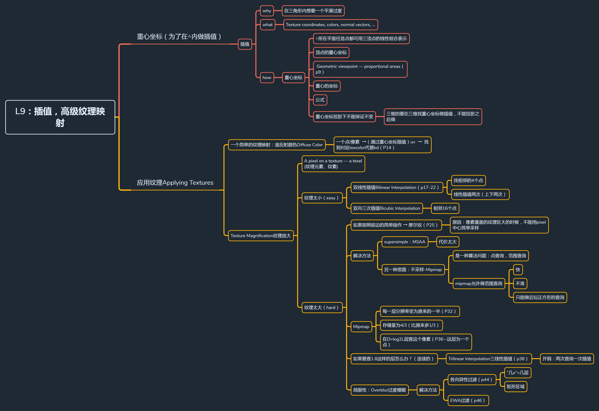

[TOC]




# 插值、高级纹理映射

## 一、重心坐标（为了在三角形内做插值）

​		关于重心坐标更完整的介绍资料见如下链接：https://zhuanlan.zhihu.com/p/58199366

​		上一篇文章说到纹理映射，实质上纹理映射就是把 uv 坐标下的纹素映射到图像像素的过程。而我们在画三角形的过程中通常只是定义了三个顶点的属性，其内部属性（`法向量`，`颜色值`，`深度值`，还有`纹理坐标`等）往往需要通过三个顶点插值得来到。所以我们需要一个插值的方式来解决这个问题，一般常用重心坐标进行插值。

​		所谓`重心`：就是找到三角形 ABC 内部的一个点P(x,y)*P*(*x*,*y*)，有(x,y)=αA+βB+γC(*x*,*y*)=*α**A*+*β**B*+*γ**C*, 且α+β+γ=1*α*+*β*+*γ*=1，那么(α,β,γ)(*α*,*β*,*γ*)就是点P的重心坐标，如下图：


### 1.1 重心坐标的另外一个定义：重心坐标可以通过面积求出来

Geometric viewpoint — proportional areas
这里$A_A$,$A_B$,$A_C$分别表示 A、B、C 点对面的三角形


### 1.2 针对任意一个点的公式


对于刚好在重心（质心）这一特殊点上的坐标：


### 1.3 重心坐标不能保证投影后不变

​		所以三维的要在三维中找到重心坐标再做插值，而不能投影后做插值

### 1.4 重心坐标的用处

​		通过坐标 A, B, C 其实可以想到，如果把 A, B, C 换成 法向量(nx,ny,nz)，纹理坐标(ux,uy)都是成立的
把 α* 看做$W_v1$, *β* 看做 $W_v2$， *γ* 看做 $W_v3$，可得如下方程：


求解可得：


## 二、应用纹理 Applying Textures

简单的纹理映射的过程：在光栅化过程中，对当前扫描到的点的uv坐标进行采样，得到的颜色直接赋给物体

```javascript
for each rasterized screen sample (x,y):
	(u,v) = evaluate texture coordinate at (x,y)
	texcolor = texture.sample(u,v);
	set sample’s color to texcolor
```

### 2.1 简单的纹理映射： 漫反射颜色 Diffuse Color

一个点/像素 →（通过重心坐标插值）uv → 查询找到对应 texcolor 代替kd


### 2.2 Texture Magnification纹理放大

应用于纹理太小的情况（纹理尺寸小，像素尺寸大）
当纹理分辨率过小，而需要用来覆盖的物体过大时，多个像素坐标 ( x, y ) 都会采样到同一个纹素，产生一些锯齿的效果，这时我们就有一些解决方法，如：最近邻插值，双线性插值，双三次插值，如下图


#### 2.2.1 最邻近插值

​		假设红点是像素坐标点对应的纹理像素坐标，那么最近邻插值就是把离它最近的纹素分配给当前像素点，这就容易导致锯齿的出现：

上图的结果就是红点的纹素应该是它右上角黑点纹素对应的值

#### 2.2.2 双线性插值

双线性插值就是找它周围四个点对应的纹素进行插值，如下图：

- 找相邻的4个点
- 做上下双线性插值（水平两次，竖直一次）
  

具体而言：


1. 先考虑一维上的线性插值，假设有一个起始点 V0 和终止点 V1，那么 V(x) 在这两点间的插值就是：
   lerp⁡(x, v0, v1) = v0 + x( v1 − v0 )
   双线性插值就是在横坐标（竖）上先做两次插值，再在竖坐标（横）上做一次插值即可

#### 2.2.3 双向三次插值Bicubic Interpolation

​		这里的双三次不同于三维空间中的三线性插值，应该叫做双三次插值（Bicubic），它是对二维空间的插值，考虑了邻近十六个采样点的插值，具体方法同双线性插值。

### 2.3 纹理分辨率过大

​		同样，当纹理分辨率过大时，如果以某种角度或者由于物体过远，对纹理进行相同的采样率得到的结果却会远远不同（往往会很差）。通俗来说就是如果我们由近到远看一个物体，同时它的纹理分辨率十分高。当它离我们比较近时，它在我们人眼中的占比非常大，我们需要对纹理有很高的采样率才能把它的很多细节看得清楚。但是当它离我们很远时，假如在肉眼中只有非常小的比例，我们就不需要看到它的很多细节，但是这时我们还是用之前的采样率去对它纹理进行采样，得到的结果就会 “ 乱掉 ”（摩尔纹），可以看下图：


​		实际上一个像素，所覆盖的纹理区域也是不同的，所以当发生这种变化或者一个像素覆盖纹理区域过大时，我们也不应该用同样的采样率对纹理进行采样。


如何解决这种问题？
解决方法1：超采样-MSAA
					 但问题是，计算消耗代价太大

解决方法2：不采样：Mipmap

​		`点查询`：已知一个点，快速查出其结果是多少。对应纹理上来说就是给定像素点，查得最近邻，双线性，双三次插值的结果

​		`范围查询`：不知道哪个点，但是给定了你一个区域，可以直接得到对应的值（平均值之类的），而mipmap就是基于范围查询的

#### 2.3.1 Mipmap

是一种快速，近似，仅限于正方形范围的范围查询
Mipmap 就是通过一张纹理，生成许多高层（分辨率每次缩小到一半）的纹理，如下图：


类似图像卷积中的图像金字塔的概念


- 思考：图像金字塔引入了多少额外存储量？
  它的开销也是十分小的，因为每次只存储了上一幅图像的1/4，对于额外开销S ,可以通过错位相减得到3S=1−14n3*S*=1−4*n*1​
  
  又因为1−14n1−4*n*1​ 取极限为1，所以S=1/3，所以总开销为 4/3。
- 如何确定某个像素P对应的Mipmap层级呢？
  首先找到该点和相邻像素点在纹理上的映射点，计算边长L，所以层级可以由D=log2L*D*=*l**o**g*2​*L*算出（因为随着层数增加，纹理分辨率是以4倍的速度减小，所以L是以2倍的速度增加的）

下图为屏幕上相邻像素点（pixel）映射到纹理上（texel）的对应关系


​		当我们得到了层级后，在这一层上进行纹理插值即可。但是我们发现，层级之间是离散的，也就是说，一些像素在0层插值，一些像素在1层插值，这种变化也会使得纹理“割裂”：


​		解决方法就是，每次插值，先在 D 层插值纹理（可以用双线性之类的方法），再在 D+1 层插值纹理，把两层结果再进行插值（把 log 的结果去和前一层和后一层进行插值比较），这样的结果就是平滑的了：


#### 2.3.2 Mipmap的局限性：Overblur 过度模糊

Mipmap也会有缺点，因为它的范围只是限定在正方形范围内的，所以会产生 over-blur 的问题


解决方法

1. 各向异性过滤 Anisotropic Filtering
   		各向异性滤波能够部分解决这种问题，因为它的范围不是限定在正方形范围内的，而是矩形范围。如果说下图中 Mipmap 的图片缩小是沿着对角线进行的，而各向异性滤波的压缩就是沿着水平和竖直线进行的


​		所以它是使得原图的像素可以查询纹理中一些矩形区域，这样就能部分解决一些形变压缩的纹理查询问题：


1. EWA过滤
   