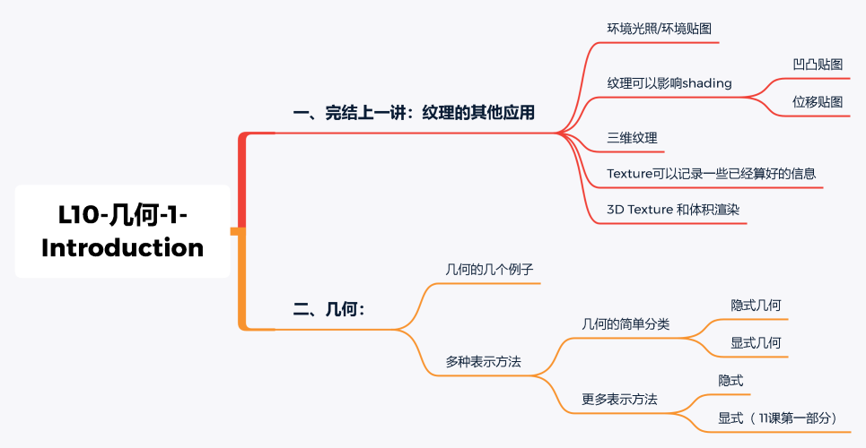

[TOC]

# 二、几何介绍

### 2.1 Implicit representations of geometry(隐式表示）

​		隐式表示的意思是我不会告诉你具体某个部位长什么样子，相反我只会告诉你这个部位的点之间服从某种的关系，因此我们可以通过这种关系来构建几何。

​		举例来说，我们知道 3D 中一个球的表面上任意点坐标都满足 $x^2+y^2+z^2 = 1$.

​		更通用地表达式是 f(x, y, z) = 0，只要满足这个公式则表示该点在这个隐式定义的物体表面上，这也是隐式表示的一个优点。

​		当然，隐式表示也有一个很明显的缺点，即我们根据表达式不能直观地知道具体表示什么形状。比如下面的隐式表达式，如果只看式子我们根本不可能知道对应的物体的几何形状是什么。

一些例子：

#### 2.1.1 constructive solid geometry（CSG）

​		隐式的还有一种常用的方法是 constructive solid geometry（CSG），即对 3D 物体几何做布尔操作，看下面的例子：

#### 2.1.2 符号距离函数(Signed Distance Function, SDF)

​		首先介绍一下这个距离函数的“距离”
​		`距离函数`返回**当前点与任意物体表面的最短距离**，如果返回的距离是负数，说明这个点在物体内部；如果为正，则在物体外部。
​		以下图为例，蓝色圆圈表示以当前点离任意表面的最短距离作为半径得到的圆。可以看到每次求得一个半径后，会朝着指定方向移动这个半径的距离，进而计算下一次的半径，这样可以减少距离比较的次数。

​		知道是什么 “ 距离 ” 后我们就可以利用距离函数来构造各种几何形状了。如下图示（从左往右看），最开始是由两个球，我们知道每个球都对应了一个距离函数，假设为 d1, d2。你可能对这个距离函数还是不太理解，我们再进一步解释，以 d1 为例，假设最左边上面那个球的中心坐标是 (x1,y1,z1) ,半径为 r ，那么$d_1=(x−x1)^2+(x−x1)^2+(x−x1)^2−r^2=0$。

​		那么我们只要将两个距离函数做一个**融合（blending）**，随着融合程度的调整，我们可以得到右边一系列的几何图形，给人一种两个水滴合在一起的感觉。

#### 2.1.3 level set methods(水平集）

​		上面的距离函数需要定义出一个解析表达式，但是有时候我们不一定能够求出这个解析式。那么针对这种情况我们可以用 **level set（水平集）**来表示几何形状。

​		下面的例子来解释什么是 level set。其实就是我们给每个格子设定一个值，然后找出值为0的地方连起来就得到了 level set，连接起来也就形成物体表面。

​		上面例子是在2D平面的levelset，我们也可以在3D上生成level set，这在医学数据上用的比较多。此时的一个大致思路是我们给三维定义出一个密度level set，因为不同器官组织的密度是不一样的，那么我们通过选取不同的levelset，也就得到了不同的器官或组织的表面形状了。

#### fractals(分形)

​		还有一种表示方式是分形，现实生活中像雪花就是一种分形。比如它整体看起来是个六边形，然后我们细看每条边又是一个六边形。其他例子如下图示：

  