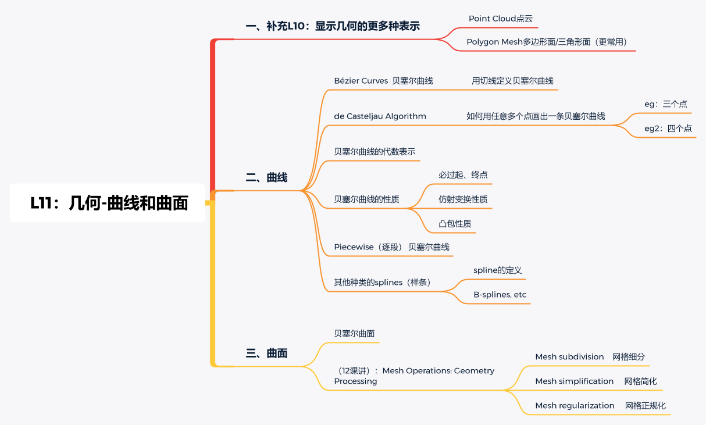

[TOC]

# 曲线和曲面

## 一、Curves（曲线）

​		在计算机图形学应用中，我们经常需要在屏幕上绘制许多不同类型的对象。对象并非都是由平面组成，有些对象可能需要用曲线来进行描绘。为了使得描绘的曲线不受分辨率的影响，研究人员就提出一种曲线–贝塞尔曲线。它是一种显示曲线，由一系列控制点与线段组成，通过它可以得到精确的曲线。

### 1.1 Bézier Curves 贝塞尔曲线

​		贝塞尔曲线受限于由一系列控制点，它是通过使用控制点的近似切线生成曲线。已知四个点 *p*1, *p*2, *p*3, *p*4，那么贝塞尔曲线就可以表示如下：

说明：
		贝塞尔曲线本质就是对线段插值，它是一个类似递归求解的过程。

#### 1.1.2 de Casteljau Algorithm（算法）

​		Casteljau 算法描述了如何求解贝塞尔曲线，下面是该算法对应三个控制点的贝塞尔曲线求解过程：

​		已知三点 *b*0，*b*1，*b*2，和插值参数 t ，第一次递归插值得到 *b*0➡*b*1 线段上的 $b^0_1$ 和 *b*1➡*b*2 线段上的 $b^1_1$ 第二次递归插值对 $b^0_1$➡$b^1_1$ 进行插值，发现他们与插值结果 $b^2_0$ 构成的线段位于同一条直线上，所以递归结束，得到贝塞尔曲线结果：b0➡$b^1_0$➡$b^2_0$➡$b^1_1$➡b2

由上图可以总结出求解一趟贝塞尔曲线的过程：

1. 给定起始点和终止点（已知插值参数 t）
2. 遍历每个控制点和该点的下一点（如 *b*0➡*b*1）形成的线段，对其进行插值。将插值后得到的点的集合中的第一个点和最后一个点替换为起点和终点。当起点和终点以及最终插值结果的点 (*b*02) 是在同一条直线（如 *b*01➡*b*02➡*b*11）时，递归结束回到 3，否则回 1。
3. 结束，记录最终插值结果的点

​        一趟贝塞尔曲线的结果只是针对于当前时间  t  得到的结果，它只是一个点。所以我们在 t 的范围内遍历 t ，得到所有贝塞尔曲线的结果，将这些点和起始点、终止点连接起来即得到完整的曲线。

配合下面两张图更容易理解：

​		可以看出每次迭代求解的规模是在逐步减小的，如果我们盯着起点，插值点，终点三点看的话，会发现它们是在逐步靠近于一条直线的。当最后一次迭代时，这三个点一定会汇聚于一条直线，这一次递归的点数也减少为起点和终点两个点。所以说求解规模在不断减小，且有终止条件，所以说这个过程也是遵循递归的。

#### 1.1.3 数学表示

其中：
		n 是贝塞尔曲线的阶数，$b_j$ 是控制点（通过控制点的切线的来计算曲线），$B_j^n$(t) 表示 Bernstein 多项式。

​		最简单的贝塞尔曲线是从点 P0到 P1 的直线，二次贝塞尔曲线由三个控制点确定，三次贝塞尔曲线由四个控制点确定:

#### 1.1.4 贝塞尔曲线的性质

##### a. 端点性质

​		第一个控制点和最后一个控制点恰好是曲线的起始点和终止点。对于控制点来说，当 t = 0 的时候处于起点，当 t = 1 的时候处于终点。

##### b. 一阶导数性质

​		第一个控制点和第二个控制点所在连线是第一个控制点所在的曲线切线；最后一个控制点和倒数第二个控制点所在连线是最后一个控制点所在的曲线切线。

		这里 3 是因为Cubic Bazier。

##### c. 仿射变换性质

​		当想要对曲线进行仿射变换时，只需要对不同的顶点进行仿射变换即可。
注意：对于投影无法使用该性质。

##### d. 凸包性质

​		贝塞尔曲线会被所有控制点形成的多边形所包围，如下图：

​		任何一个贝塞尔曲线的任意一个点，一定都在所给的控制点所形成的的凸包内。
​		一个例子：几个点在一条线上 → 根据凸包的性质可知 → 凸包就是这条线（任意点都在凸包内）

### 1.2 Piecewise（逐段） 贝塞尔曲线

为何要引入分段贝塞尔曲线？其中一个主要原因就是当控制点增多时无法很好的控制曲线的变换：

​		人们就引入了一种方法来解决这种问题：通过某几个控制点控制一段贝塞尔曲线，然后连接不同的贝塞尔曲线形成一条完整的贝塞尔曲线（通常是用四个控制点决定一个贝塞尔曲线）。这里需要注意的就是如何保持不同贝塞尔曲线连接起来也是平滑（连续）的，做法就是保持过曲线的两个控制点形成的切线大小相等，在方向上保持相反：

#### 1.2.1 曲线的连续性

1. $C^0$ 连续：即图中 $a_n$ 和 $b_0$ 都处于红点处（处于曲线中同样的位置）
   
2. $c^1$ 连续：在曲线某点保持切线连续（大小相等，方向相反）：
   

### 1.3 样条

​		既然贝塞尔曲线在控制点较多时，调整一部分控制点也会影响到整条曲线。并且分段贝塞尔曲线的拼接也不是很容易进行，因为需要保持相邻曲线的连续性，所以人们又引入了样条，它更为可控。我们可以把样条看成是一条具有弹性的木条，它可以较为灵活的改变自身的形态。而 B-样条，作为贝塞尔曲线的“补充”，除了保持贝塞尔曲线自身的特性外，它另一个最大的好处就似乎可以对曲线进行局部修改。

​		这里有一些关于 B-样条 的原理与实现的链接，现在不做深入了解：
实现: https://github.com/thibauts/b-spline.
原理: https://zhuanlan.zhihu.com/p/50450278.

##  二、贝塞尔曲面

​		同样的，贝塞尔曲面也是由贝塞尔曲线构造得到，假设存在 (n+1) × (m+1) 个空间点，则 m × n Bezier 曲面定义为：

​		简单来说，就是分别在这些控制点上构造贝塞尔曲线，其中每一条曲线又会和其他控制点构成新的曲线，最终形成贝塞尔曲面：

## 三、Mesh Operations: Geometry Processing（网格操作）

- Mesh subdivision：网格细分
- Mesh simplification：网格简化
- Mesh regularization：网格正规化

