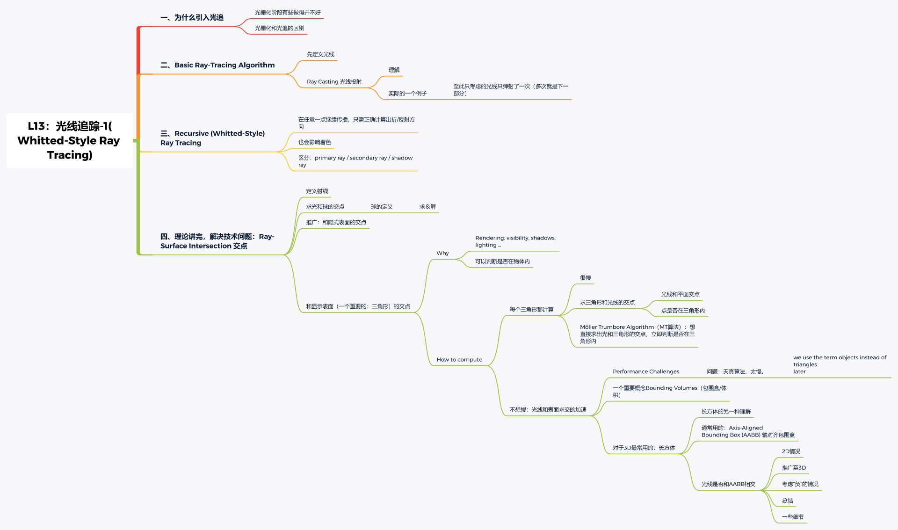

[TOC]

# 光线追踪-1-(Whitted-Style Ray Tracing)

### 1.1 为什么需要光线追踪？

​		这里常用之对比的是光栅化。<u>光栅化是把场景中的物体独立出来，并且再将物体独立成一个个的三角形面片进行渲染，通常 GPU 绘制三角形面片是并行的，所以对于物体来说，它是不知道自己周围的物体，同样的，对于三角形面片来说，它也是不知道自己周围的三角形。所以光栅化无法处理一类需要全局信息进行渲染的效果，如：`软阴影`、`Glossy 反射`以及`间接照明`</u>：

​		相比较光栅化，光线追踪是从相机出发，计算相机发出的光线（视线）与场景产生的结果，这里的光线可能会与场景中的物体碰撞后生成另外一些光线，然后生成的光线也需要继续做计算。所以对于光线追踪来说，相机产生的光线是知道整个场景信息的。

光栅化与光线追踪的对比：

1. 光栅化快，实时，是一种近似算法
2. 光纤追踪慢，离线，是一种准确的算法

### 1.2 光线

光线追踪需要光线的概念，<u>课程</u>以三个假设引入了光线的概念：

1. **光线沿着直线传播**
2. **光线之间不会碰撞**
3. **光线的可逆性。光线在场景中传播，产生反弹，假设反弹至相机，那么从相机视角来看，一定可以沿着传播的路径找到光源位置**

### 1.3 光线投射（Ray Casting）

​		光线投射的过程如下：

1. 从相机位置，向物体投射一条光线用于成像
2. 从像素中对应物体的每个位置投射回光线，检查是否在阴影中（类似 Shadow Mapping）

### 1.4 常规的着色过程

​		从视点发射一条光线，通过成像平面（某个像素）投射至物体，然后从物体发出光线至光源检查其是否在阴影中，如果不在阴影中，就可以通过某些着色方案对这个像素进行着色，如 Blinn Phong 等。

不同于常规的着色过程，下面介绍了一种递归的光线追踪方法`Recursive (Whitted-Style) Ray Tracing`。

## 二、Recursive (Whitted-Style) Ray Tracing

该方法有几点不同于常规的着色方案：

1. 光源：光线不同，这里假设光线在碰撞到物体后还会产生`折射`和`反射`。
2. 着色过程：每发生一次折射或者反射（弹射点）都计算一次着色，前提是该点不在阴影内。

如图所示，该算法的过程如下：

1. **<u>从视点从成像平面发出光线，检测是否与物体碰撞</u>**
2. **<u>碰撞后生成折射和反射部分</u>**
3. **<u>递归计算生成的光线</u>**
4. **<u>所有弹射点都与光源计算一次着色，前提是该弹射点能被光源看见</u>**
5. **<u>将所有着色通过某种加权叠加起来，得到最终成像平面上的像素的颜色</u>**

为了后续说明方便，课程定义了一些概念：

- 从视角出发第一次打到物体的光线叫做：`primary ray`
- 一次弹射之后的光线叫做：`secondary rays`
- 判断可见性的光线叫做：`shadow rays`

### 2.1 光线-表面相交

​		Recursive (Whitted-Style) Ray Tracing 涉及到光线与物体的碰撞问题，所以这里介绍一下如何判断光线-表面相交问题。

#### 2.1.1 光线定义

光线可以一个点 o 和方向向量 d 定义：
r(t) = o+td     0 ≤ t < ∞

#### 2.1.2 光线与球求交(隐式表面求法)

已知光线方程：**r(t) = o + td** 0 ≤ t < ∞
和球的方程：$p:(p−c)^2−R^2=0$

其中 p 表示球中某点， c 表示球中心点， R 表示球的半径。

那么直接将光线方程带入球的方程求解即可：
$(o+td−c)^2−R^2=0$

​		对于所有隐式表示的曲面，都可以通过该方式求解（需要注意的是光线其实是射线，所以得到的解需要是实数且为正）：
​		需满足：① 是实数 ② 是正的

#### 2.1.3 光线与三角形求交（显示表面求法）

判断是否在物体内：一个点在封闭图形内，在任意方向打一束光线出去

- 奇数个交点：内
- 偶数个交点：外
  // 推广到 3D 仍然适用

计算步骤：先求光线和平面的交点 → 再判断点是否在三角形内

光线与三角形相交最简单的便是将光线方程带入平面方程，求解：

##### Moller Trumbore Alogrithm（MT算法）

​		一种快速计算光线是否在三角形内以及算法与平面相交的算法
​		平面方程的一般式表达为：Ax + By + Cz + D = 0
​		如果光线在三角形内，那么这个点一定可以用重心坐标进行表示，那么进行求解便可得到答案：

具体步骤：
光线上的点，用重心坐标表示
→求解 -t，b1，b2（三个式子，三个未知数——求解方法：克莱姆法则）
→解出来之后，看是否合理：
		① 沿着这个方向（t非负）
		② 在三角形内（b1，b2非负）

### 2.2 光线-表面相交加速

​		加速原理：不再判断光线与每个三角形的相交情况，而是判断光线与包围物体表面的盒子来粗略判定光线是否与物体相交
​		它等同于用更简单的模型来替代原有复杂的模型，代替原有模型求解与光线的相交

#### 2.2.1 Bounding Volumes(包围盒）

​		包围盒：一个物体可以用简单的形状包围起来，保证这个物体一定在这个简单的形状中。
​		一个重要逻辑：如果光线连包围盒都碰不到，就更不可能碰到物体。

​		这里主要介绍了 AABB 包围盒（轴对称包围盒），它是轴对齐的。通常在判断物体相交情况的时候，可以先检测物体是否与 AABB 包围盒是否相交，如果相交再进一步做判断（更精细的相交判断）。

#### 2.2.2 如何判断光线与 AABB 包围盒相交？

这里给了一个 2D 的例子进行解释：

需要记住的关键概念是：

1. 光进入了所有对面，才算进入 Box
2. 光离开任意一对面，就算离开 Box
3. 什么时候有交点：t 进入 <t 离开时有交点
4. 考虑负的情况：t 离开 <0 说明 Box 在光背后
5. t 离开 ≥0 ＆ t 进入 < 0 说明光线起点在 Box 内 → 有交点
6. 对于三维包围盒来说，有如下公式成立：$t_{enter}=max⁡(t_{min}⁡),t_{exit}=min⁡(t_{max})$

**总之：当且仅当 t 进入 < t 离开 ＆＆ t 离开 ≥ 0 时，有交点**

​		这里还需要注意一些问题：为什么选包围盒比较好？

​		因为包围盒本质上是可以分为垂直于 x、y、z 的分量的，所以求解光线与包围盒的相交也可以分解成光线中某个轴的分量与包围盒某个轴的分量的相交：
