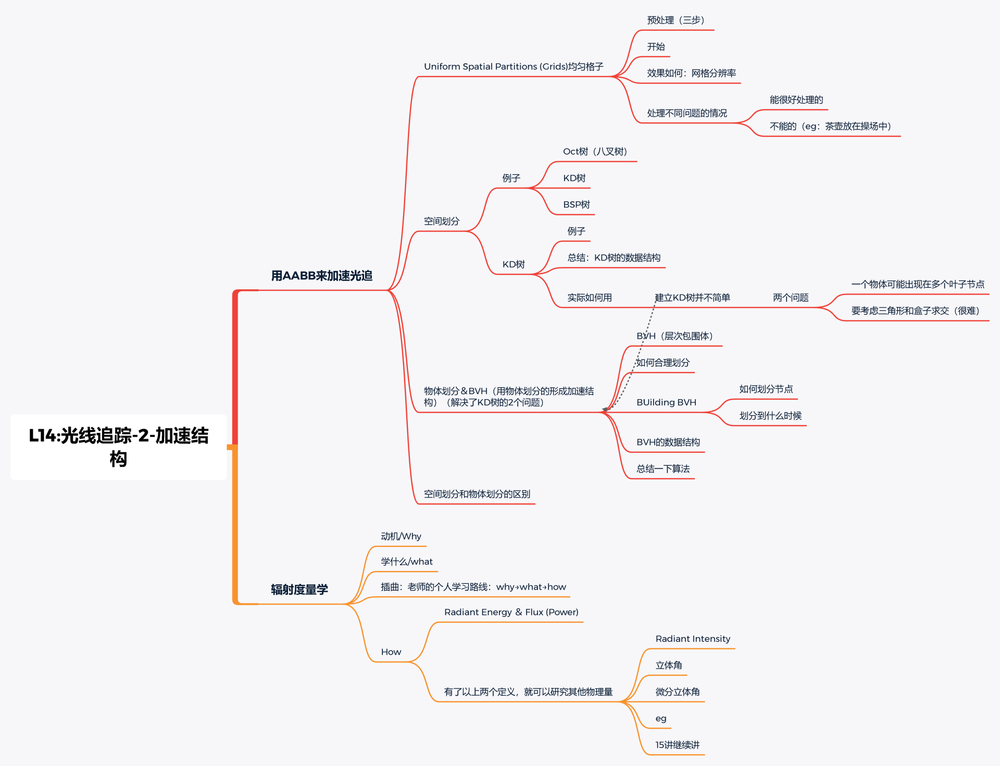

[TOC]

# 加速结构与辐射度量学

## 一、光线追踪的加速

​		上一节课说了计算<u>光线-物体</u>的求交<u>通常可以通过计算光线与物体表面包围盒的求交来进行加速</u>。这只是从物体出发的一个角度，另外一种方式是通过对场景进行划分来达到加速的效果。常用的对场景进行划分的方法有 `Uniform grids` 和 `Spatial partitions`。

### 1.1 Uniform grids

​		`Uniform grids` 简单来说就是将场景划分成一个个规整的格子，通过格子来判断光线与物体的相交情况。

构建 Uniform grids 的步骤如下：

1. 找到包围盒

2. 创建格子

3. 存储每个对象至格子中

   ​        <u>那么此时判定光线与物体相交就转换成光线与格子相交问题，当光线与格子相交后，再去考虑它与格子内物体的相交情况</u>：

这种方式有一些问题：

1. 格子的分辨率问题，如果格子的分辨率设置太小就失去了划分的意义，如果分辨率太大也不好。
2. 格子通常只适用于规整的场景，相反，物体位置较为稀疏的场景就不适用这种划分方案，因为此时很多格子都不存储物体，大量时间被浪费在了光线与格子的求交上：

### 1.2 Spatial partitions 空间划分

​		Spatial partitions 通常有 Oct-Tree（八叉树） 、KD-Tree 以及 BSP-Tree 三种划分方案：

下面将在二维对三种方案进行讨论：

​		Oct-Tree：<u>每次迭代都将区域重新切分为均匀四块，按一定规则停止切分（如切分得到的四块区域中，三块都没有物体；或四块区域都还有物体，但是此时的区域已经较小）</u>

​		KD-Tree：<u>总是沿某个轴进行切分，每次划分总会在原来的区域上生成两块新的区域（这里沿轴的次序是由交替进行的，如二维中总是按着 x/y 或 y/x 的次序进行交替切分）</u>

​		BSP-Tree：<u>每次都是沿着一定方向进行切分（非水平或竖直）</u>

### 1.3 KD-Tree 预处理

​		KD-Tree 每次划分都会生成新的两块区域，然后再在两块区域内进行划分，直至满足递归截至条件。

​		下图显示了一个[三维k-d树](https://zh.wikipedia.org/wiki/K-d树)。第一次划分（红色）把根节点（白色）划分成两个节点，然后它们分别再次被划分（绿色）为两个子节点。最后这四个子节点的每一个都被划分（蓝色）为两个子节点：

假设空间 A 被划分为如图所示 KD-Tree，那么它的结构等同于其中树结构所所描述：

#### 1.3.1 数据结构

中间节点（A，B，C，D）存储了：

1. 划分后的轴
2. 划分后的切分平面
3. 子节点的指针，叶子节点（1，2，3，4，5）存储了：区域中包含的物体的列表（obj只会存在于叶子节点）

#### 1.3.2 遍历

1. 发射光线从根节点出发，分别判断光线与左右节点是否相交，若相交则进入2；否则，则与节点不相交
2. 递归判断相交直至叶子节点，若与叶子节点相交，进入3
3. 挨个判断叶子节点存储物体与光线的相交情况

下列图分别显示了光线遍历至 B 节点的情况：

光线穿过A节点：

假设这里1号区域为叶子节点，因此要遍历A中的所有物体判断是否与光线相交

光线穿过B节点：

假设这里2号区域为叶子节点，因此要遍历2中的所有物体判断是否与光线相交

光线穿过C节点：

假设这里3号区域为叶子节点，因此要遍历3中的所有物体判断是否与光线相交

#### 1.3.3 KD-Tree 存在问题

1. KD-Tree 建立过程中需要考虑三角形与包围盒的求交问题
2. 物体可能与多个包围盒相交

### 1.4 Object Partitions（基于物体的划分） & Bounding Volume Hierarchy (BVH)

​		为了解决上述问题，人们提出了另外一种划分方案，即在场景中对**物体**进行划分，此时就不用考虑三角形与包围盒的求交问题

​		它本质是将一个场景用一个包围盒包住，然后按照一定划分方案将盒子划分成不同的子区域，不同子区域都需要包含三角形，最终划分到叶子节点时，每个叶子节点就包含了一些三角形，即包含了对应的一些物体：

#### 1.4.1 划分流程

​		下面的图片参考链接: https://www.haroldserrano.com/blog/visualizing-the-boundary-volume-hierarchy-collision-algorithm

1. 创建一个根节点
2. 创建一个AABB box 将所有物体包围在该场景中
3. 设置AABB box为根节点
   
4. 找到AABB 最长轴，并且沿着该方向将所有物体排序
   
5. 找到一个中点(基于某个轴）切分bbox
   
6. 使用分割索引，将场景分成左右两侧。
7. 对于每一侧，创建一个包含其各自对象的 AABB box。
8. 在二叉树中创建一个左右节点，并附加其对应的AABB box。
   
9. 在每个节点上重复4-8步 直到每个节点最多只包含两个物体。
   eg: 左边重复4-6步得到的结果：
   

eg:左边重复6-8步得到的结果：

整体得到的最终结果：

#### 1.4.2 如何划分节点

1. 按轴的次序进行划分
2. 按最长轴继续进行划分
3. 在物体三角形数目的最中间对物体进行划分（这里的最中间指的是划分后，两边的三角形数目基本一致）

#### 1.4.3 数据结构

- 中间节点（Internal nodes）：该节点对应的包围盒和子节点的指针
- 叶子节点（Leaf nodes）：该节点对应的包围盒和包围盒里面的物体列表

#### 1.4.4 BVH 遍历流程

遍历过程就是递归的，类似于遍历一颗二叉树：

#### 1.5 Spatial vs Object Partitions

## 二、辐射度量学

### 2.1 为什么需要辐射度量学？

​		因为需要对物理世界的光做更加真实的描述，而辐射度量学是具有物理意义的，它相较于 blinn phong 等光照模型，能够更加精确、真实地描述光照 （在图形学中）

​		为了弄清出辐射度量学如何对光照进行更加精确的描述，这里需要辐射度量学的一些相关概念来帮助理解：Radiant flux, intensity, irradiance, radiance，它们的单位表示为下图：

维基百科：https://zh.wikipedia.org/wiki/辐射度量学

### 2.2 一些基本概念理解

#### 2.2.1 Radiant Energy and Flux (Power)

​		`Radiant Energy`是电磁辐射的能量，用焦耳来表示其单位（它在图形学中较少使用）： *Q*[ J=Joule]

​		`Radiant Flux`是单位时间的能量（功率），它简单描述了一个发光体在单位时间所发出的能量/接收的能量：

$Φ≡dQ/dt[ W=Watt][lm⁡=lumen⁡]⋆$

​		在光学中经常以流明为单位，说明光的亮度,与功率 Flux 是一回事。
[lm⁡=lumen⁡]⋆

​		光在物理世界中涉及到能量的部分，通常可以用三个过程来进行概括：**发射**，**接收**以及**传播**，对应的是光源发出的光，表面接收的光，光在传播过程中的光 三个概念：

#### 2.2.2 Radiant Intensity

​		由于光源是往不同方向发射光的，所以我们需要一种方法来描述在不同方向上，光源在单位时间发射的能量（即不同方向光源产生的功率），这里采用了`Radiant Intensity`来进行描述，如图所示（假设 ω 为球面上的某个方向向量）：

那么如何描述方向？这里采用 Angles and Solid Angles（ 角度和立体角）的来进行描述

##### Angles and Solid Angles

1. Angles（角度）
   通常角度 `Angles` 可以表示为弧度制，也就是用 **弧长/ 半径** 来进行表示：

- θ = l/ r
- 圆有 2π 的 radians

1. Solid Angles（立体角是角度在空间上的延申）
   

立体角表示的是球面上的**面积与半径平方之比**：Ω = Ar2
球总共有 4π 的 steradians

定义球面上的方向向量为 ω：

​		那么求解单位立体角，我们只需要得到单位立体角对应的球面面积，然后用单位面积除以半径的平方即可，求解如下：

​		当定义了单位立体角后，就可以通过单位辐射通量来描述光源在某个方向上发出的能量。即单位方向内，光源在**单位时间发出的能量**：
​		$I(ω) ≡ d Φ dω$

​		换言之，已知辐射通量，我们就可以求出在整个球面上光源的 Radiant Intensity：

​		这里课程给了一个例子，假设一个灯泡的 Radiant flux (power) 为 815 lumens，那么它在整个球面所辐射的强度 Radiant Intensity 为：

Intensity = 815 lumens / 4pi sr 
			     = 65 candelas
（这里的 lumens 也是 Radiant flux (power) 的单位）

