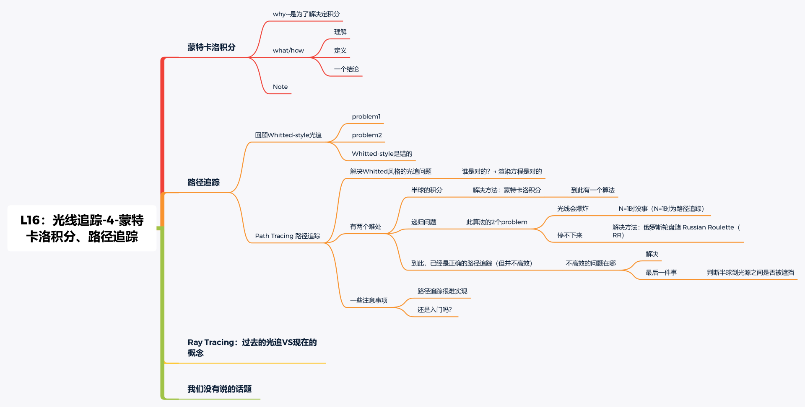

[TOC]

## 一、Monte Carlo Integration 蒙特卡洛积分

​		定积分本质上是求解曲线在区间内与坐标轴所围成的面积。Monte Carlo Integration 是一种近似求解积分的方法，它在所求定积分的函数中随机取样多次，分别对取样得到的 f(x) 值和定积分上下限的矩形求面积，然后将这些面积平均，以近似求解定积分。

1.Why Monte Carlo Integration
		为了解决定积分

2.What ＆ How
	① 蒙特卡洛积分：
		不同于黎曼积分（分为多个微小的部分），蒙特卡洛积分为：用一个随机的采样的方法。随意取一个点，对应 f(x) 为高，a → b 为宽，（假设为长方形）来近似线下的面积，重复多次采样，最后平均起来长方形的面积。
	② 定义：

当然，采样次数越多，该方法求解的定积分结果就越准确。

eg：如果在 a → b 均匀的采样，pdf = 1/(b-a)

用蒙特卡洛来算

一个特殊情况：随机变量的采样是均匀的
一个结论：任何一个积分的蒙特卡洛形式：

注意：定义在 x 域上，采样也要在 x 域上（定义和采样要在一个域）

## 二、路径追踪

​		为了解决 Whitted-Style Ray Tracing 中的一些问题，让渲染更加真实。

### 2.1 Whitted-style光线追踪的两个问题

#### 2.1.1 问题1：Whitted-Style Ray Tracing 在处理光照反射时总是沿着镜面反射方向进行，这适用于镜面材质，但却不适用于 Glossy 之类的材质

#### 2.1.2 问题2：Whitted-Style Ray Tracing 不考虑物体表面漫反射会进一步反射，但实际上漫反射物体仍会继续反射光线

以及 color bleed 现象。

### 2.2 渲染方程解决 Whiteed-style 问题

相较于这些问题，渲染方程的结果是对的，所以我们只需要按照渲染方程来求解物体表面的着色问题即可：

### 2.3 蒙特卡洛方法具体过程

先考虑简单情况（直接光照情况，且不考虑自发光项）

为了求解这个在球面上的积分，这里就需要 Monte Carlo 方法来近似求解：

进一步看如果来自某一物体的反射的间接光源时应如何处理：

通过上述公式就可以简单描述出求解着色的步骤：

1. 随机采样 N 次入射方向
2. 根据采样的入射方向，针对能够反射到光源的部分，计算 $L_i(p,ω_i)f_r(p,ω_i,ω_o)(n⋅ω_i)$
3. 累加该次求解结果
4. 平均，完成着色

同时，还需要考虑反射如果打到物体表面，物体会吸收光源进行二次反射着色过程。

但是这里还存在几个问题：

#### 问题1：光线数量会爆炸

物体表面在进行反射的过程中，反射的光线数目应该为多少？

​		如果反射的光线数目为 N，反射 次数为 M，那么对于一个像素上的射线的计算量都有可能为：$N^M$ ，这个计算量是相当大且呈指数增长的。为了减少计算量，人们将反射的光线数目设为1，而在每个像素处打入多条射线来解决这个问题（即`路径追踪`的概念）：
​		如下图所示 红色、黑色、蓝色都表示穿过同一像素的路径

​		这一步可以在一个循环里面做，即对于一个像素选取不同的位置打入射线以求解着色：

#### 问题2：递归无法停止问题

​		着色何时停止，即当光线反射多少次后，不再进行反射？这里采用了 `Russian Roulette (RR)` 来解决这个问题。

​		当满足概率为 P 时，返回除以该概率的着色结果：$L_o/P$，当概率为 (1 - P) 时，就停止反射光线，通过这种方式，我们仍然能够得到正确的着色结果。

转换为伪代码就是：

此时已经是一个正确的路径追踪算法实现了，但效率不高。

我们希望通过低采样率也能获得高采样率的效果。

#### 问题3：效率低下->不浪费算法推导

​		光线在反射的过程中打到光源是存在一定概率的，它往往与光源自身大小相关，如果光源过小，会使得大量光线无法打到光源，以致出现光线浪费现象。

​		原始蒙特卡洛方程是在着色点上进行积分的，这里需要考虑在光源上进行积分。

​		因此要找到光源出 dA 和立体角 dw 之间的关系

即先将光源投影到立体角方向 dAcosθ′ ，再计算其余 x 点的距离平方，即可得到立体角的关系。

由此，就可以重写改变积分阈的渲染方程：

这里的做法就是将物体表面接收到的 radiance 分解为两部分：来自光源和来自其他反射物体。

- 对于来自光源的部分，直接在光源上进行采样即可，采样过程就是换积分域的过程
- 对于来自其他反射的光源，仍然按照 RR 算法求解
  

伪代码如下：

#### 问题4：判断半球到光源之间有没有被挡:

解决方法：点到光源取一条连线，打一条光线，看中间有没有打到其他的物体

一些注解：
① Path Tracing 很难实现
② 还是入门吗？ 算进阶
③ Path Tracing 几乎 100% 正确

## 三、Ray Tracing：过去的光追 VS 现在的概念

1. 以前：基本都是指 Whitted-style 的光线追踪
2. Now（老师自己的定义）：所有光线传播方法的大集合
   - (Unidirectional & bidirectional) path tracing
   - Photon mapping
   - Metropolis light transport
   - VCM / UPBP…

## 四、我们没有说的话题

1. Uniformly sampling the hemisphere
   怎么均匀采样？怎么采样？
2. Monte Carlo integration allows arbitrary pdfs， What’s the best choice?
   importance sampling 重要性采样理论
3. Do random numbers matter? 随机数重要吗？
   Yes! (low discrepancy sequences)比如蓝噪音
4. I can sample the hemisphere and the light， Can I combine them?
   Yes! (multiple imp. sampling) 可以结合半球和光源采样吗？
5. The radiance of a pixel is the average of radiance on all paths passing through it
   不同Path的Radiance平均起来，为什么平均起来就是pixel的Radiance？
   Why? (pixel reconstruction filter)
6. Is the radiance of a pixel the color of a pixel? Pixel的Radiance就是它的颜色吗？
   No. (gamma correction（radiance到color的对应关系）, curves(HDR), color space)