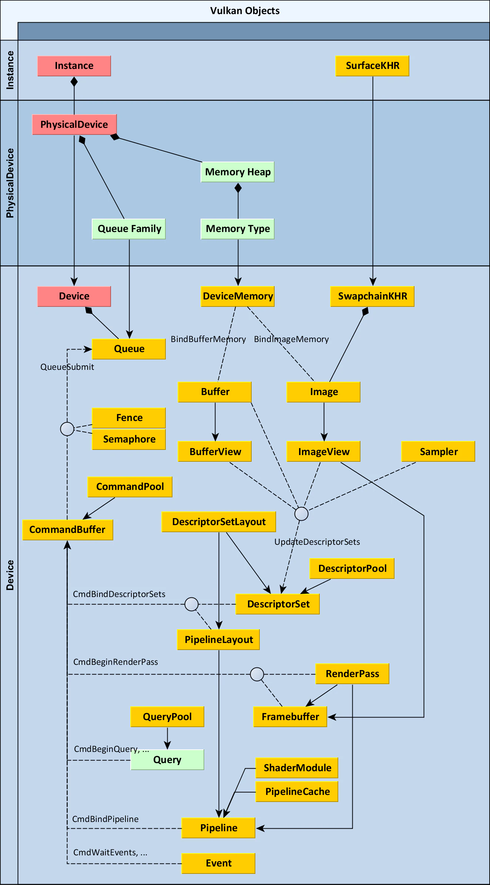

[TOC]

## understanding vulkan objects

以下是所有对象的简要描述：

**<u>实例（Instance）</u>**是创建的第一个对象。它代表了应用程序与 Vulkan 运行时之间的连接，因此在应用程序中应该只存在一次。它还存储了使用 Vulkan 所需的所有应用程序特定状态。因此，在创建实例时，必须指定要启用的所有层（如验证层）和所有扩展。

**<u>物理设备（PhysicalDevice）</u>**代表一个特定的兼容 Vulkan 的设备，如图形卡。可以从“实例”中枚举这些设备，然后可以查询它们的供应商ID、设备ID和支持的特性，以及其他属性和限制。

​		物理设备可以枚举所有可用类型的**队列族（Queue Families）**。图形队列是主要的，但还可以有其他只支持计算或传输的队列。

​		物理设备还可以枚举**内存堆（Memory Heaps）**和其中的**内存类型（Memory Types）**。内存堆代表一个特定的  RAM 池。它可以抽象为主板上的系统 RAM 或专用显卡上的某个显存空间，或者实现想要公开的任何其他主机或设备特定内存。在分配内存时，必须指定内存类型。它对内存 blob 持有特定要求，如对主机可见、一致性（在 CPU 和 GPU 之间）和缓存。这些要求可以根据设备驱动程序的不同而任意组合。

**<u>设备（Device）</u>**可以被认为是逻辑设备或已打开的设备。它是代表已初始化的 Vulkan 设备的主要对象，准备创建所有其他对象。这与 DirectX 中的设备对象概念类似。在设备创建期间，需要指定要启用的所有功能，其中一些功能是基本的，如各向异性纹理过滤。还必须声明将使用的所有队列、它们的数量以及它们的队列族。

**<u>队列（Queue）</u>**是一个代表在设备上执行的命令队列的对象。通过填充 CommandBuffers 并将它们提交到队列，使用函数 vkQueueSubmit，请求 GPU 完成的所有实际工作。如果有多个队列，如主图形队列和计算队列，可以将不同的 CommandBuffers 提交给它们。这样，可以启用异步计算，如果做得正确，可能会显著提高速度。

**<u>命令池（CommandPool）</u>**是一个简单的对象，用于分配 CommandBuffers 。它与特定的队列族连接。

**<u>命令缓冲区（CommandBuffer）</u>**是从特定命令池分配的。它表示要由逻辑设备执行的各种命令的缓冲区。可以在命令缓冲区上调用各种函数，所有这些函数都以 vkCmd 开头。它们用于指定在 CommandBuffer 提交给队列并最终由设备消耗时应执行的任务的顺序、类型和参数。

**<u>采样器</u>**不绑定到任何特定的图像。它只是一组状态参数，如过滤模式（最近邻或线性）或寻址模式（重复、夹紧边缘、夹紧边框等）。

Buffer 和 Image 是占用设备内存的两种类型的资源。<u>**Buffer** 是较简单的一个。它是一个容器，用于存储以字节为单位的长度的任意二进制数据</u>。<u>另一方面，**图像（Image）**表示一组像素。在其他图形 API 中，这个对象称为纹理</u>。创建图像需要许多更多的参数。它可以是1D、2D或3D的，具有各种像素格式（如R8G8B8A8_UNORM或R32_SFLOAT），还可以包含许多离散图像，因为它可以具有多个数组层或MIP级别（或两者兼而有之）。图像是一个单独的对象类型，因为它不一定只包含可以直接访问的线性像素集。图像可以具有由图形驱动程序管理的不同实现特定的内部格式（tiling和布局）。

​		创建特定长度的缓冲区或具有特定尺寸的图像并不会自动为其分配内存。这是一个必须由手动执行的三步过程。也可以选择使用我们的 **<u>Vulkan 内存分配器库（vulkan memory allocator）</u>**，它会为处理分配。

1. 分配 DeviceMemory，
2. 创建 Buffer 或 Image，
3. 使用函数 vkBindBufferMemory 或 vkBindImageMemory 将它们绑定在一起。

​        这就是为什么还必须创建一个 **DeviceMemory** 对象。它表示从特定内存类型（由 PhysicalDevice 支持）分配的具有特定字节长度的内存块。不应该为每个 Buffer 或 Image 分配单独的DeviceMemory。相反，应该分配较大的内存块，并将它们的部分分配给的 Buffers 和 Images。分配是一项昂贵的操作，并且还存在最大分配数量的限制，所有这些都可以从 PhysicalDevice 中查询。

创建 Swapchain 的一个例外是，每个图像都有义务分配和绑定 DeviceMemory。这是一种用于在屏幕上或在操作系统中绘制的窗口内呈现最终图像的概念。因此，创建它的方式取决于平台。如果已经使用系统API初始化了一个窗口，首先需要创建一个 SurfaceKHR 对象。它需要 Instance 对象以及一些系统相关的参数。例如，在Windows上，这些参数是：实例句柄（HINSTANCE）和窗口句柄（HWND）。<u>可以将 SurfaceKHR 对象视为Vulkan表示的窗口。</u>

从中，您可以创建 SwapchainKHR。这个对象需要一个设备。它表示一组可以在 Surface 上呈现的图像集，例如使用双缓冲或三缓冲。从交换链中，您可以查询包含的图像。这些图像已经由系统分配了相应的内存。

Buffers 和 Images 在渲染中并不总是直接使用。在它们之上还有另一层，称为视图（views）。<u>可以将它们看作数据库中的视图 - 用于以期望的方式查看一组底层数据的参数集</u>。BufferView 是基于特定缓冲区创建的对象。在创建过程中，可以传递偏移量和范围，以将视图限制在缓冲区数据的某个子集上。类似地，ImageView 是一组指向特定图像的参数。在这里，可以将像素解释为具有其他（兼容）格式，重新排列任何组件，并将视图限制在特定的 MIP 级别或数组层范围内。

着色器可以通过描述符访问这些资源（Buffers、Images 和 Samplers）。描述符本身不存在，而是总是分组在描述符集中。但是，在创建描述符集之前，必须通过创建 DescriptorSetLayout 来指定其布局，该布局的作用类似于描述符集的模板。例如，绘制 3D 几何体的渲染通道所使用的着色器可能期望：

| 绑定槽位 | 资源                                     |
| -------- | ---------------------------------------- |
| 0        | 一个可用于顶点着色器阶段的统一缓冲区。   |
| 1        | 可用于片段着色器阶段的另一个统一缓冲区。 |
| 2        | 一个采样图像。                           |
| 3        | 一个采样器，也可用于片段着色器阶段。     |

还需要创建一个 DescriptorPool。它是一个简单的对象，用于分配描述符集。在创建描述符池时，必须指定要从中分配的描述符集的最大数量以及不同类型的描述符的最大数量。

最后，分配一个 DescriptorSet。需要 DescriptorPool 和 DescriptorSetLayout 才能执行此操作。DescriptorSet 表示存储实际描述符的内存，可以配置描述符指向特定的 Buffer、BufferView、Image 或 Sampler。可以使用函数 vkUpdateDescriptorSets 来实现这一点。

可以将多个 DescriptorSets 绑定为 CommandBuffer 中的活动集，以便在渲染命令中使用。为此，请使用函数 vkCmdBindDescriptorSets。这个函数还需要另一个对象 - PipelineLayout，因为可能会绑定多个 DescriptorSets，而 Vulkan 希望提前知道应该期望多少个以及它们的类型。PipelineLayout 表示 CommandBuffer 中将绑定哪些类型的描述符集的渲染管道的配置。可以从 DescriptorSetLayout的数组中创建它。

在其他图形API中可以采取即时模式方法，只需渲染列表中接下来的内容。在Vulkan中，这是不可能的。相反，您需要提前计划您的帧渲染，并将其组织为传递和子传递。子传递不是单独的对象，所以我们不会在这里讨论它们，但它们在Vulkan的渲染系统中是一个重要部分。幸运的是，在准备工作负载时，不需要了解所有细节。例如，在提交时，可以指定要渲染的三角形数量。在Vulkan中定义RenderPass的关键部分是将在该传递中使用的附件的数量和格式。

附件是Vulkan用于表示可能以其他方式称为渲染目标的名称 - 用作渲染输出的图像。在这里，不会指向特定的图像 - 只描述它们的格式。例如，一个简单的渲染传递可能使用具有格式R8G8B8A8_UNORM的颜色附件和具有格式D16_UNORM的深度模板附件。还可以指定在传递开始时，附件内容应保留、丢弃或清除。

**<u>帧缓冲（Framebuffer）</u>**（不要与 SwapchainKHR 混淆）代表了可用作附件（渲染目标）的实际图像的链接。您可以通过指定 RenderPass 和一组 ImageView 来创建 Framebuffer 对象。当然，它们的数量和格式必须与RenderPass 的规范相匹配。Framebuffer 是 Images上的另一个层次，基本上将这些 ImageView 组合在一起，以便在特定 RenderPass 的渲染期间绑定为附件。每当开始渲染一个 RenderPass 时，都会调用函数vkCmdBeginRenderPass，并将 Framebuffer 传递给它。

**<u>管道（Pipeline）</u>**是一个大问题，因为它包含了之前列出的大部分对象。它代表整个管道的配置，并具有很多参数。<u>其中一个参数是PipelineLayout - 它定义了描述符和推送常量的布局</u>。管道有两种类型 - 计算管道和图形管道。ComputePipeline 较为简单，因为它只支持计算程序（有时称为计算着色器）。GraphicsPipeline 要复杂得多，因为它包含了所有的参数，如顶点、片段、几何、计算和曲面细分等，以及诸如顶点属性、基元拓扑、背面剔除和混合模式等。所有这些参数在早期的图形API（DirectX 9，OpenGL）中是单独的设置，后来在API的发展过程中被分组到较少的状态对象中（DirectX 10和11），现在必须在像Vulkan这样的现代API中烘焙成一个大的，不可变的对象。在渲染过程中需要每个不同的参数集合，必须创建一个新的管道。然后，可以通过调用函数vkCmdBindPipeline将其设置为CommandBuffer中的当前活动管道。

在Vulkan中，着色器编译是一个多阶段过程。首先，Vulkan不支持GLSL或HLSL等高级着色语言。相反，Vulkan接受一种名为SPIR-V的中间格式，任何高级语言都可以发出该格式。用SPIR-V中的数据填充的缓冲区用于创建ShaderModule。此对象表示着色器代码的一部分，可能是部分编译形式，但它还不是GPU可以执行的任何内容。只有在为每个着色器阶段创建管道时（将使用顶点、曲面控制、曲面求值、几何、片段或计算），才能指定ShaderModule以及入口点函数的名称（如“main”）。

还有一个名为PipelineCache的辅助对象，可以用来加速管道创建。这是一个简单的对象，可以在创建管道时选择传递，但实际上可以通过减少内存使用和管道编译时间来提高性能。驱动程序可以在内部使用它来存储一些中间数据，以便创建类似管道可能更快。还可以将PipelineCache对象的状态保存到二进制数据缓冲区，将其保存到磁盘并在下次执行应用程序时使用。我们建议您使用它们！

**<u>查询（Query）</u>**是Vulkan中的另一种对象类型。它可用于读回 GPU 写入的某些数值。有不同类型的查询，如遮挡查询（告诉您是否渲染了一些像素，即它们是否通过了所有的预处理和后处理测试并进入了帧）或时间戳查询（来自某个GPU硬件计数器的时间戳值）。查询没有自己的类型，因为它总是位于 QueryPool 内部，并且只用uint32_t索引表示。创建 QueryPool 时，可以指定包含的查询类型和数量。然后，它们可以用于向CommandBuffer 发出命令，如 vkCmdBeginQuery，vkCmdEndQuery 或 vkCmdWriteTimestamp。

最后，还有用于同步的对象：栅栏、信号量和事件。栅栏向主机发信号，表示任务已完成。它可以在主机上等待、轮询和手动取消信号。它没有自己的命令函数，但在调用 vkQueueSubmit 时传递。提交队列完成后，相应的栅栏会发出信号。

信号量在创建时没有配置参数。它可用于跨多个队列控制资源访问。它可以作为命令缓冲区提交的一部分发出信号或等待，也可以通过调用 vkQueueSubmit 在一个队列（例如计算队列）上发出信号，在另一个队列（例如图形队列）上等待。

事件也是在没有参数的情况下创建的。它可以作为提交到 CommandBuffer 的单独命令在GPU上等待或发出信号，使用函数 vkCmdSetEvent，vkCmdResetEvent 和 vkCmdWaitEvents。它还可以在一个或多个CPU线程上设置、重置和等待（通过轮询调用 vkGetEventStatus。如果同步发生在GPU上的单个点，vkCmdPipelineBarrier 也可用于类似的目的，或者在渲染过程中使用子通道依赖关系。

在此之后，您只需要学习如何调用Vulkan函数（可能是并行的！）以使GPU在每个帧上执行实际工作。然后，您将开始充分利用现代GPU提供的强大、灵活的计算能力。

## vulkan 对象

​		黑方框为 vulkan 的基础对象，蓝方框为我们为方便抽象的对象；实线可理解为直接派生，虚线为依赖；红线为强关联，DescriptorSet 和 Shader 的绿线表示他们只有逻辑上的联系

​		解释一下各个对象。

**Hardware**：即为硬件直接给出的几个组件，这5个都很好理解不多赘述，而其中 VkDevice 这个几乎和后面所有对象都关联所以不画连线了

​		在说 Queue 和 Command 前，这里就要先说到 Mantle 世代 api （都是从Mantle 演变而来我们就叫他们 Mantle 世代好了）对于上世代  api 的第一大区别了：这一代的 api 将图形绘制命令分成了 **Record** 和 **Submit**，vulkan 中对应了 command buffer 和 queue，凡是 vkCmd 开头的调用都是录制命令，vkQueue 开头的都是提交（vkQueuePresentKHR 可以理解为特殊的提交）。

**Queue**：队列这个东西是从 Mantle  世代的 api 出现的，个人的理解是对硬件执行流水线的抽象，通过提交任务执行图形计算，简单理解的话就是提交的内容对应某一个 queue 上只能依顺序执行（gpu 的并行其实并不是像很多人想的像多线程那样 fire 多少个 task 他就自动并行，就 vulkan 来讲提交的任务在一个 queue 上是按一定规则排列的）。

- **QueueFamily 与 Queue**：翻译过来应该叫做队列家族，每个Family里会有若干queue，常见的 Family 为三种：Graphic，Compute和 Transfer。Graphic 一般是全能的啥都能做，内含的 queue 数量也是最多；Compute 不支持 Graphic 相关功能；Transfer 可以专门用于上传数据。这种分法不是绝对的，要看具体硬件提供的 queueFamily 数量和支持的功能。vulkan 里的对单个queue 是禁止同一时间有多个线程进行操作的，所以申请多个 queue 能做到多个线程做submit。

**Command**：录制使用的对象是command pool和command buffer，为啥这么设计现在可以先不管。录制本质上就是一个类似 push_back 的工作，每次调 vkCmd 就往 command buffer 塞内容进去，至于这个 command buffer 在 cpu 还是 gpu 这个完全取决于硬件和驱动实现，对 vk 程序员是透明的。录制结束之后就可以提交给queue 执行了，所以理论上是这个时候 gpu 才开始真正执行。分成录制和提交的原因就是为了多线程。在 vk 里大家说的多线程渲染其实基本可以理解为多线程录制，多线程提交其实不太常见，也不好写，而且有更好的方案（往command buffer录制并不是直接就能多线程操作的，有很多限制，vk里有一个叫 secondary command buffer的东西可以直接用于多线程录制，不需要任何额外同步）。

这里有一篇arm关于多线程渲染流程最简单的描述

[Multi-Threading in Vulkancommunity.arm.com/developer/tools-software/graphics/b/blog/posts/multi-threading-in-vulkan](https://link.zhihu.com/?target=https%3A//community.arm.com/developer/tools-software/graphics/b/blog/posts/multi-threading-in-vulkan)

无优化的多线程渲染，work就是我所说的record

比起上一种做了 overlapping ，吞吐量上去了，最理想的实现应该就是这种了

**Buffer**：Vulkan主要有两种 Buffer 和 Image，Buffer一般用于vertex、index以及uniform，Image用于位图数据，也就是贴图。而Buffer要真正使用起来还得配备一个 VkDeviceMemory，下面会说。

1. **Mesh**：这个比较好理解，vertex、index各自对应一个buffer对象和一个memory对象组成一个Mesh，tutorial里也算写的很清楚。
2. **Texture**：VkImage 除了 VkDeviceMemory 还需要 VkImageView 和 VkImageSampler，VkImageView 相当于一个 accessor，具体操作都需要操作这个accessor，所以基本上VkImage和VkImageView就是个强绑定关系。VkImageSampler是采样器，anisotropy、mips等在这里设置，可以多个图共享一个采样器。
3. **Uniform**：类似Mesh，只不过这个Buffer对应的**结构体一定一定要注意内存对齐的问题！！！**不同编译器不同平台编出来的内存对齐模式都可能不一样，而vulkan对传过来的数据是有对齐要求的，这个问题我吃过药，tutorial那一章最后写过，当时给我跳过去了，结果shader里拿到的数据怎么都不对，更要命的是这个问题是validation layer无法检查出来的！

**Memory**：这里就是第二大不同了，以前的 OpenGL 创建一个Texture就能直接上传数据直接用了，uniform都是api直接传输的。到了vulkan里gpu的内存也放给程序员来管理了，VkDeviceMemory 这个对象就是代表你分配的显存。这和 c/c++自己手写内存分配器是差不多一个意思了，你可以定制很多更高级的分配策略，而且vulkan非常不鼓励小分配，vulkan的分配次数每个设备都是有上限的，就是为了让你做 suballocation。而这个活有现成的 vulkan memory allocator可以拿来直接用。

**Synchronization**：

1. vulkan不光让你自己管理内存，同步也需要手工做，cpu提交之后如何知道gpu完成任务了呢，所以有fence充当cpu和gpu之间的同步工具，cpu通过等待fence知道gpu完成任务。
2. Semaphores 用于两个提交直接建立依赖，submit和present这两个提交如果没有semaphores，用fence监听submit再通知submit肯定是低效的，所以两次submit之间通过semaphores直接在gpu内部建立依赖。
3. barrier是做啥的呢，vulkan 上传上去的数据相当于都有一个状态（usage，access mask，VkImageLayout等），这个状态首先可以给 gpu 提供更多的优化信息，其次在操作数据时由于 gpu 直接操作的数据是先在一个缓存里，在另一个阶段读取这个数据的时候可能不是同一套核心的寄存器，这时候就会发生缓存不一致的问题，所以插入一个barrier就能告诉gpu这段写完下个阶段你得先同步缓存。
4. event不太常用，我自己也没用过，但功能更精细化属于进阶内容，有兴趣可自行了解。
5. subpass dependency这个其实也提供了barrier类似的功能，是 subpass 专用的功能，subpass 算是 vulkan 特有的功能，renderpass 必须包含至少一个 [subpass](https://www.zhihu.com/search?q=subpass&search_source=Entity&hybrid_search_source=Entity&hybrid_search_extra={"sourceType"%3A"answer"%2C"sourceId"%3A1632072443})，当它只有一个的时候，dependency 建议留空，vk会补上默认值，自己写其实容易写错，tutorial 里其实就写的有问题。

**Pipeline**：VkPipeline 定义的是管线状态，隐藏面剔除啊，混合啊都是在这里设置的，而这里最重要的一个状态就是shader是在这里进行绑定的。一旦pipeline创建好了就不能改了，你要换shader就得换个新的pipeline。而 Compute Shader需要再独立的一个 Compute Pipeline，类型一样VkPipeline，但创建方法不同。提一嘴pipeline cache，这个东西就是用来加速shader加载的，因为shader即使是spirv这样底层的代码了，执行对应gpu的shader代码还是需要一趟编译变为gpu专用的最优内容为了节约这个编译时间就搞出了pipeline cache。

**FrameBuffer**：这个差不多就是 OpenGL 里的 attachment 了，只不过 FrameBuffer 通过引用各种 ImageView 打包成一个集合，FrameBuffer 就是一堆 View 的集合。从 SwapChain 获得的Image 再创建 ImageView 放到 FrameBuffer 里，就能给 gpu 用了。

**RenderPass**：最初学vulkan最让我迷惑的部分就是RenderPass了，扣了很久的文档和代码才理解，vulkan的RenderPass 本质上描述的是一次渲染我需要的绘制的目标是长什么样的。创建RenderPass时参数里填写的pAttachments其实不是真正的attachment，而是attachment的描述，比如第一个attachment是color，第二个是depth，而 RenderPass 通过 FrameBuffer 才能绑定真正的Image（vkRenderPassBeginInfo里绑定），位置一一对应。这里说一下创建时候为啥也得给一个 FrameBuffer，主要是可以限定这个 RenderPass 不要乱来，能在一创建就能保证和某个 FrameBuffer 相容。之后的渲染流程中只要符合 vk 定义的 *Render Pass Compatibility 的* FrameBuffer ，这个FrameBuffer 就能拿来绑定。

**Descriptor**：shader 里读取数据在 vulkan 里除了 vertex 数据（*layout(location = n) in* 的形式）剩下最常见的就是 uniform 了，要传输 uniform 就得通过 DescriptorSet 或 PushConstraint。

先说 Descriptor：VkDescriptorSet 的作用是引用用于作为 uniform 的 buffer 数据，主要是 VkBuffer 和 VkImage 两种，VkDescriptorSet 类似 command buffer 需要从一个 DescriptorPool 分配出来，然后通过 vkUpdateDescriptorSets() 方法绑定对应的对象。有了一个 VkDescriptorSet 之后也不能直接用，还需要一个 VkDescriptorSetLayout 来规范约束你这里多少个set，每个set里有多少buffer和image。vulkan支持一个shader用多个descriptorSet读取数据（*layout(set=m,binding = n* ) 形式），VkDescriptorSetLayout 本身只是个 layout，不存储具体的 set，set 需要在渲染时绑定。有了 VkDescriptorSetLayout 还不够，还需要一个VkPipelineLayout ，主要时因为有 PushConstraint，把前面的 VkDescriptorSetLayout 和 PushConstraint 合一块就是 VkPipelineLayout 了。同时注意 VkPipelineLayout 在创建VkPipeline 时也需要给出，也就是说 Pipeline里的 shader 也需要遵守这个 Layout。而PushConstraint 专门用于小数据传输，性能好但容量也小，直接存储在 command buffer 里的，而不是 VkBuffer，所以也不需要每次更新去 map memory然后 [memcpy](https://www.zhihu.com/search?q=memcpy&search_source=Entity&hybrid_search_source=Entity&hybrid_search_extra={"sourceType"%3A"answer"%2C"sourceId"%3A1632072443})。当然可以不用 PushConstraint （

## 大致渲染步骤

​		好了，理清这些对象之后如何调用 vulkan 其实就非常清晰了，**建议自己看着amd的图，对着代码和api按自己的理解也整理一遍，不需要和我一样（而且我这图也主要是为自己看的），等你做完就能有一个体系的认知了**。而渲染流程撇开多线程，record&submit，同步。本身和 OpenGL 没什么大的区别。

大致描述一下渲染步骤的主体就是以下这几步：

1. vkAcquireNextImageKHR —— 从 SwapChains 获取下一个可以绘制到屏幕的Image
2. vkResetCommandPool/vkResetCommandBuffer —— 清除上一次录制的 CommandBuffer，可以不清但一般每帧的内容都可能发生变化一般都是要清理的。
3. vkBeginCommandBuffer —— 开始录制
4. vkCmdBeginRenderPass —— 启用一个RenderPass，这里就连同绑定了一个 FrameBuffer
5. vkCmdBindPipeline —— 绑定Pipeline，想要换shader就得在这里做
6. vkCmdBindDescriptorSets —— 绑定 DescriptorSets，可以一次绑多个Set，也可以多次绑定多个Set，同时需要给出 PipeLineLayout
7. vkCmdBindVertexBuffers&vkCmdBindIndexBuffer —— 没啥好多说的了，绑模型
8. vkCmdDrawIndexed —— 最关键的绘制命令，这里可以根据显卡的特性支持情况换更高级的绘制命令比如[indirect](https://www.zhihu.com/search?q=indirect&search_source=Entity&hybrid_search_source=Entity&hybrid_search_extra={"sourceType"%3A"answer"%2C"sourceId"%3A1632072443})，相应的数据绑定也需要改。
9. vkCmdEndRenderPass —— 结束 RenderPass
10. vkEndCommandBuffer —— 结束 CommandBuffer
11. vkQueueSubmit —— 提交执行渲染任务
12. vkQueuePresentKHR —— 呈现渲染数据，这时候调用可能 vkQueueSubmit 还没执行完，但 Semaphores 会帮我们打点好。