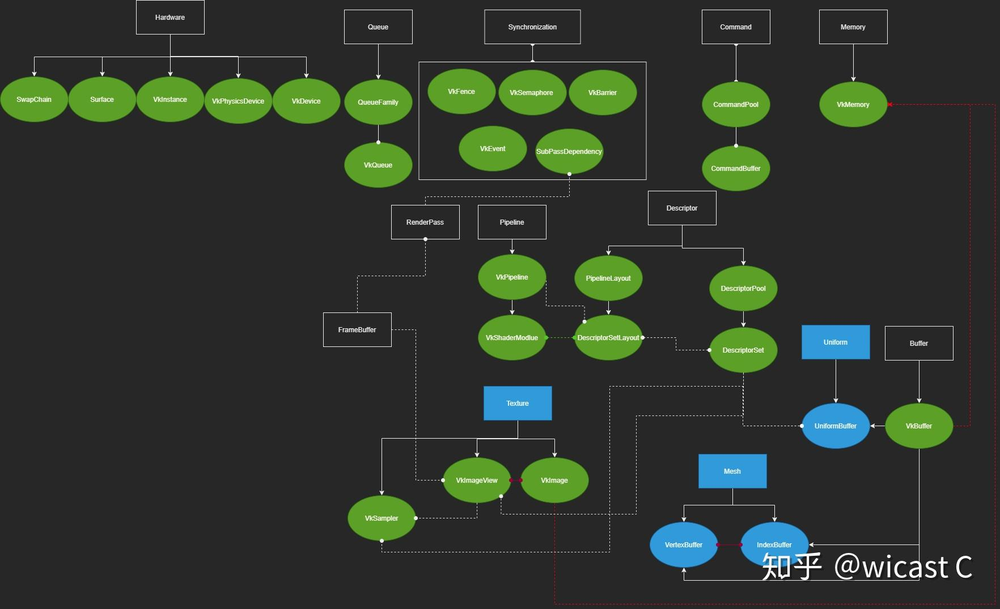

[TOC]

## understanding vulkan objects

## vulkan 对象

​		黑方框为 vulkan 的基础对象，蓝方框为我们为方便抽象的对象；实线可理解为直接派生，虚线为依赖；红线为强关联，DescriptorSet 和 Shader 的绿线表示他们只有逻辑上的联系

​		解释一下各个对象。

**Hardware**：即为硬件直接给出的几个组件，这5个都很好理解不多赘述，而其中 VkDevice 这个几乎和后面所有对象都关联所以不画连线了

​		在说 Queue 和 Command 前，这里就要先说到 Mantle 世代 api （都是从Mantle 演变而来我们就叫他们 Mantle 世代好了）对于上世代  api 的第一大区别了：这一代的api将图形绘制命令分成了 **Record** 和 **Submit**，vulkan 中对应了 command buffer 和 queue，凡是vkCmd开头的调用都是录制命令，vkQueue 开头的都是提交（vkQueuePresentKHR 可以理解为特殊的提交）。

**Queue**：队列这个东西是从 Mantle  世代的api出现的，我个人的理解是对硬件执行流水线的抽象，通过提交任务执行图形计算，简单理解的话就是提交的内容对应某一个 queue 上只能依顺序执行（gpu 的并行其实并不是像很多人想的像多线程那样fire多少个 task 他就自动并行，就vulkan来讲提交的任务在一个 queue 上是按一定规则排列的）。

- **QueueFamily与Queue**：翻译过来应该叫做队列家族，每个Family里会有若干queue，常见的 Family 为三种：Graphic，Compute和 Transfer。Graphic一般是全能的啥都能做，内含的queue数量也是最多；Compute不支持Graphic相关功能；Transfer可以专门用于上传数据。这种分法不是绝对的，要看具体硬件提供的queueFamily数量和支持的功能。vulkan 里的对单个queue 是禁止同一时间有多个线程进行操作的，所以申请多个 queue 能做到多个线程做submit。

**Command**：录制使用的对象是command pool和[command buffer](https://www.zhihu.com/search?q=command buffer&search_source=Entity&hybrid_search_source=Entity&hybrid_search_extra={"sourceType"%3A"answer"%2C"sourceId"%3A1632072443})，为啥这么设计现在可以先不管。录制本质上就是一个类似 push_back 的工作，每次调 vkCmd 就往 command buffer 塞内容进去，至于这个 command buffer 在cpu还是gpu这个完全取决于硬件和驱动实现，对vk程序员是透明的。录制结束之后就可以提交给queue执行了，所以理论上是这个时候gpu才开始真正执行。分成录制和提交的原因就是为了多线程。在vk里大家说的多线程渲染其实基本可以理解为多线程录制，多线程提交其实不太常见，也不好写，而且有更好的方案（往command buffer录制并不是直接就能多线程操作的，有很多限制，vk里有一个叫 secondary command buffer的东西可以直接用于多线程录制，不需要任何额外同步）。

这里有一篇arm关于多线程渲染流程最简单的描述

[Multi-Threading in Vulkancommunity.arm.com/developer/tools-software/graphics/b/blog/posts/multi-threading-in-vulkan](https://link.zhihu.com/?target=https%3A//community.arm.com/developer/tools-software/graphics/b/blog/posts/multi-threading-in-vulkan)

无优化的多线程渲染，work就是我所说的record

比起上一种做了 overlapping ，吞吐量上去了，最理想的实现应该就是这种了

**Buffer**：Vulkan主要有两种 Buffer 和 Image，Buffer一般用于vertex、index以及uniform，Image用于位图数据，也就是贴图。而Buffer要真正使用起来还得配备一个 VkDeviceMemory，下面会说。

1. **Mesh**：这个比较好理解，vertex、index各自对应一个buffer对象和一个memory对象组成一个Mesh，tutorial里也算写的很清楚。
2. **Texture**：VkImage 除了 VkDeviceMemory 还需要 VkImageView 和 VkImageSampler，VkImageView 相当于一个 accessor，具体操作都需要操作这个accessor，所以基本上VkImage和VkImageView就是个强绑定关系。VkImageSampler是采样器，anisotropy、mips等在这里设置，可以多个图共享一个采样器。
3. **Uniform**：类似Mesh，只不过这个Buffer对应的**结构体一定一定要注意内存对齐的问题！！！**不同编译器不同平台编出来的内存对齐模式都可能不一样，而vulkan对传过来的数据是有对齐要求的，这个问题我吃过药，tutorial那一章最后写过，当时给我跳过去了，结果shader里拿到的数据怎么都不对，更要命的是这个问题是[validation layer](https://www.zhihu.com/search?q=validation layer&search_source=Entity&hybrid_search_source=Entity&hybrid_search_extra={"sourceType"%3A"answer"%2C"sourceId"%3A1632072443})无法检查出来的！

**Memory**：这里就是第二大不同了，以前的 OpenGL 创建一个Texture就能直接上传数据直接用了，uniform都是api直接传输的。到了vulkan里gpu的内存也放给程序员来管理了，VkDeviceMemory 这个对象就是代表你分配的显存。这和 c/c++自己手写内存分配器是差不多一个意思了，你可以定制很多更高级的分配策略，而且vulkan非常不鼓励小分配，vulkan的分配次数每个设备都是有上限的，就是为了让你做 suballocation。而这个活有现成的 vulkan memory allocator可以拿来直接用。

**Synchronization**：

1. vulkan不光让你自己管理内存，同步也需要手工做，cpu提交之后如何知道gpu完成任务了呢，所以有fence充当cpu和gpu之间的同步工具，cpu通过等待fence知道gpu完成任务。
2. Semaphores 用于两个提交直接建立依赖，[submit](https://www.zhihu.com/search?q=submit&search_source=Entity&hybrid_search_source=Entity&hybrid_search_extra={"sourceType"%3A"answer"%2C"sourceId"%3A1632072443})和present这两个提交如果没有semaphores，用fence监听submit再通知submit肯定是低效的，所以两次submit之间通过semaphores直接在gpu内部建立依赖。
3. [barrier](https://www.zhihu.com/search?q=barrier&search_source=Entity&hybrid_search_source=Entity&hybrid_search_extra={"sourceType"%3A"answer"%2C"sourceId"%3A1632072443})是做啥的呢，vulkan上传上去的数据相当于都有一个状态（usage，access mask，VkImageLayout等），这个状态首先可以给gpu提供更多的优化信息，其次在操作数据时由于gpu直接操作的数据是先在一个缓存里，在另一个阶段读取这个数据的时候可能不是同一套核心的寄存器，这时候就会发生缓存不一致的问题，所以插入一个barrier就能告诉gpu这段写完下个阶段你得先同步缓存。
4. event不太常用，我自己也没用过，但功能更精细化属于进阶内容，有兴趣可自行了解。
5. subpass dependency这个其实也提供了barrier类似的功能，是 subpass 专用的功能，subpass 算是 vulkan 特有的功能，renderpass 必须包含至少一个 [subpass](https://www.zhihu.com/search?q=subpass&search_source=Entity&hybrid_search_source=Entity&hybrid_search_extra={"sourceType"%3A"answer"%2C"sourceId"%3A1632072443})，当它只有一个的时候，dependency 建议留空，vk会补上默认值，自己写其实容易写错，tutorial 里其实就写的有问题。

**Pipeline**：VkPipeline 定义的是管线状态，隐藏面剔除啊，混合啊都是在这里设置的，而这里最重要的一个状态就是shader是在这里进行绑定的。一旦pipeline创建好了就不能改了，你要换shader就得换个新的pipeline。而 Compute Shader需要再独立的一个 Compute Pipeline，类型一样VkPipeline，但创建方法不同。提一嘴[pipeline cache](https://www.zhihu.com/search?q=pipeline cache&search_source=Entity&hybrid_search_source=Entity&hybrid_search_extra={"sourceType"%3A"answer"%2C"sourceId"%3A1632072443})，这个东西就是用来加速shader加载的，因为shader即使是spirv这样底层的代码了，执行对应gpu的shader代码还是需要一趟编译变为gpu专用的最优内容为了节约这个编译时间就搞出了pipeline cache。

**FrameBuffer**：这个差不多就是 OpenGL 里的 attachment 了，只不过 FrameBuffer 通过引用各种 ImageView 打包成一个集合，FrameBuffer 就是一堆 View 的集合。从 SwapChain 获得的Image 再创建 ImageView 放到 FrameBuffer 里，就能给 gpu 用了。

**RenderPass**：最初学vulkan最让我迷惑的部分就是RenderPass了，扣了很久的文档和代码才理解，vulkan的RenderPass 本质上描述的是一次渲染我需要的绘制的目标是长什么样的。创建RenderPass时参数里填写的pAttachments其实不是真正的attachment，而是attachment的描述，比如第一个attachment是color，第二个是depth，而 RenderPass 通过 FrameBuffer 才能绑定真正的Image（vkRenderPassBeginInfo里绑定），位置一一对应。这里说一下创建时候为啥也得给一个 FrameBuffer，主要是可以限定这个 RenderPass 不要乱来，能在一创建就能保证和某个 FrameBuffer 相容。之后的渲染流程中只要符合 vk 定义的 *Render Pass Compatibility 的* FrameBuffer ，这个FrameBuffer 就能拿来绑定。

**Descriptor**：shader 里读取数据在 vulkan 里除了 vertex 数据（*layout(location = n) in* 的形式）剩下最常见的就是 uniform 了，要传输uniform就得通过 DescriptorSet 或 PushConstraint。

先说Descriptor：VkDescriptorSet 的作用是引用用于作为 uniform 的 buffer 数据，主要是 VkBuffer 和 VkImage 两种，VkDescriptorSet 类似 command buffer 需要从一个 DescriptorPool 分配出来，然后通过 vkUpdateDescriptorSets() 方法绑定对应的对象。有了一个 VkDescriptorSet 之后也不能直接用，还需要一个 VkDescriptorSetLayout 来规范约束你这里多少个set，每个set里有多少buffer和image。vulkan支持一个shader用多个descriptorSet读取数据（*layout(set=m,binding = n* ) 形式），VkDescriptorSetLayout 本身只是个 layout，不存储具体的 set，set 需要在渲染时绑定。有了 VkDescriptorSetLayout 还不够，还需要一个VkPipelineLayout ，主要时因为有 PushConstraint，把前面的 VkDescriptorSetLayout 和 PushConstraint 合一块就是 VkPipelineLayout 了。同时注意 VkPipelineLayout 在创建VkPipeline 时也需要给出，也就是说 Pipeline里的 shader 也需要遵守这个 Layout。而PushConstraint 专门用于小数据传输，性能好但容量也小，直接存储在 command buffer 里的，而不是 VkBuffer，所以也不需要每次更新去 map memory然后 [memcpy](https://www.zhihu.com/search?q=memcpy&search_source=Entity&hybrid_search_source=Entity&hybrid_search_extra={"sourceType"%3A"answer"%2C"sourceId"%3A1632072443})。当然可以不用 PushConstraint （

## 大致渲染步骤

​		好了，理清这些对象之后如何调用 vulkan 其实就非常清晰了，**建议自己看着amd的图，对着代码和api按自己的理解也整理一遍，不需要和我一样（而且我这图也主要是为自己看的），等你做完就能有一个体系的认知了**。而渲染流程撇开多线程，record&submit，同步。本身和 OpenGL 没什么大的区别。

大致描述一下渲染步骤的主体就是以下这几步：

1. vkAcquireNextImageKHR —— 从 SwapChains 获取下一个可以绘制到屏幕的Image
2. vkResetCommandPool/vkResetCommandBuffer —— 清除上一次录制的 CommandBuffer，可以不清但一般每帧的内容都可能发生变化一般都是要清理的。
3. vkBeginCommandBuffer —— 开始录制
4. vkCmdBeginRenderPass —— 启用一个RenderPass，这里就连同绑定了一个 FrameBuffer
5. vkCmdBindPipeline —— 绑定Pipeline，想要换shader就得在这里做
6. vkCmdBindDescriptorSets —— 绑定 DescriptorSets，可以一次绑多个Set，也可以多次绑定多个Set，同时需要给出 PipeLineLayout
7. vkCmdBindVertexBuffers&vkCmdBindIndexBuffer —— 没啥好多说的了，绑模型
8. vkCmdDrawIndexed —— 最关键的绘制命令，这里可以根据显卡的特性支持情况换更高级的绘制命令比如[indirect](https://www.zhihu.com/search?q=indirect&search_source=Entity&hybrid_search_source=Entity&hybrid_search_extra={"sourceType"%3A"answer"%2C"sourceId"%3A1632072443})，相应的数据绑定也需要改。
9. vkCmdEndRenderPass —— 结束 RenderPass
10. vkEndCommandBuffer —— 结束 CommandBuffer
11. vkQueueSubmit —— 提交执行渲染任务
12. vkQueuePresentKHR —— 呈现渲染数据，这时候调用可能 vkQueueSubmit 还没执行完，但 Semaphores 会帮我们打点好。