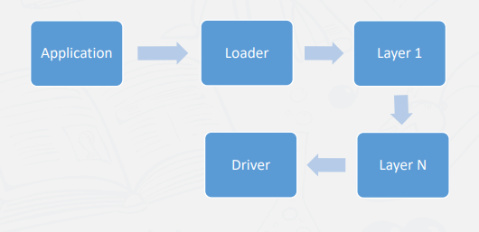
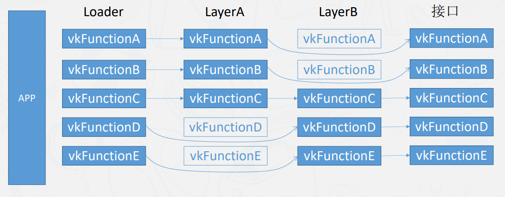

[TOC]

## 初始化

复杂 vulkan 的使用情况

- 创建 Vulkan Instance初始化 Vulkan library。 Instance是程序和Vulkan库之间沟通的桥梁。
- 需要指定你需要开启的扩展，创建swapchain的类型。给Vulkan对象设置名字的调试功能。 •检查Vulkan的错误调用的回调函数。 

### Vulkan Laye

Vulkan 将很多的功能拆分到了不同的 layer 中 

#### layer 的传递

​		例如在调用 vkFunctionC 的时候，会先调用 LayerA 的 vkFunctionC 再调用 LayerB 的 vkFunctionC ，换句话说可以把 Layer 当做函数重载来看，hook非常方便

**相关API和结构体** 

​	vkCreateInstance， 

​	VkInstanceCreateInfo 

​	VkApplicationInfo 

​	 vkEnumeratePhysicalDevices 

### VkQueue

Vulkan所有的Command都需要上传到命令队列 （VkQueue）中，包括绘制，数据上传指令等。 不同类型的队列，来源不同的队列簇(Queue  Family Properties) ，每个队列簇只允许部分类型 的Command。 

- 支持图形操作 
  - VK_QUEUE_GRAPHICS_BIT
- 支持计算着色器相关的操作 
  - VK_QUEUE_COMPUTE_BIT 
- 支持复制Buffer和Image的操作。 
  - VK_QUEUE_TRANSFER_BIT 

根据程序需要查询合适的队列簇，我们的示例程序需要的类型是 graphics 和 transfer。

 **相关API和结构体** 

​	VkDeviceQueueCreateInfo 

​	vkGetPhysicalDeviceQueueFamilyProperties 

### 逻辑设备

程序有了物理设备之后，需要一个逻辑设备和 Vulkan做交互。 根据VkPhysicalDevice查询到的队列簇，创建我们需要类型的队列簇。 

可以选择可选的特性，在结构体 VkPhysicalDeviceFeatures中看到由哪些可选项。 这些可选项开启首先需要物理设备本身支持该项功能，通过vkGetPhysicalDeviceFeatures接口查询。

- 几何着色器功能 
- 细分着色器功能 
- 压缩纹理 

成功创建好逻辑设备之后，就可以从逻辑设备中获取命令队列。 

**相关API和结构体** 

​	VkDeviceQueueCreateInfo 

​	VkDeviceCreateInfo 

​	vkCreateDevice

### SwapChain

首先要通过 VkInstance 创建Surface，vulkan和 显示窗口取得联系。  需要查询使用的队列簇是否同时支持surface 和graphic , 然后创建Swapchain和surface获取联系。创建 swapchain的时候选择属性

- 颜色空间: SRGB/HDR 
- 刷新模式: Vsync
- 缓冲数量: Double Buffer/Triple Buffer

从 Swapchain 中获取缓冲的 image，用于后面创建Frame Buffer用于渲染 

## 渲染主循环

### 绘制管线

绘制管线是实时渲染的核心组件。

一般情况下，通过绘制管线，把几何，贴图， 材质数据绘制到屏幕中。 这里显示的是最核心的绘制管线（不考虑细分，几何，mesh shader等一些进阶的功能)。 不同的RHI，细节上会有一些不一样的概念， 但整体的逻辑都是一致的。 

#### 顶点输入

在顶点输入阶段，顶点数据会缓存到 vertex buffer，会存储一些顶点坐标、顶点法线等顶点属性。

vertex buffer：

比如在上述例子中，一个 buffer 存储顶点的坐标，一个 buffer 存储顶点的法线。不放在一起是可以让 buffer1 一直变化但并不影响 buffer0.

顶点数据缓存的排布对的 vertex shader 会有一定的性能影响 常用的优化算法库[meshoptimizer](https://github.com/zeux/meshoptimizer)

##### 索引缓存

可以通过设置索引缓存来重复使用顶点属性，相当于 GL 的 EBO。

Vulkan 设置索引缓存
	vkCmdBindIndexBuffer  

##### 图元拓扑类型

就是设置图元的类型，比如线段、三角形、点等。

Vulkan 设置图元
  图元拓扑类型的枚举  VkPrimitiveTopology 
  设置图元拓扑类型  VkPipelineInputAssemblyStateCreateInfo::topology 

##### Draw

 Vulkan对象

​	vkCmdDraw
​	vkCmdDrawIndexed
​	vkCmdDrawIndirect
​	vkCmdDrawIndexedIndirect 

#### 顶点着色器（Vertex Shader）

顶点着色器

- 顶点 shader 警告编译器生成 SPIRV
- 主要用于计算顶点位置，经过矩阵变换到屏幕空间的位置
- 顶点的其他属性计算

注意 vulkan 的坐标系与 opengl 的不同！

#### 光栅化（Rasterizer）

 Rasterization State 

- 填充方式（Polygon Mode） 
- 剔除方式（Cull Mode） 
- 正方向（Front Face） 
- 线宽度 
- Depth Bias（用于解决z fighting） 

 Vulkan对象 
	VkGraphicsPipelineCreateInfo::pRasterizationState 
	VkPipelineRasterizationStateCreateInfo 

........................

## Vulkan 绘制流程

