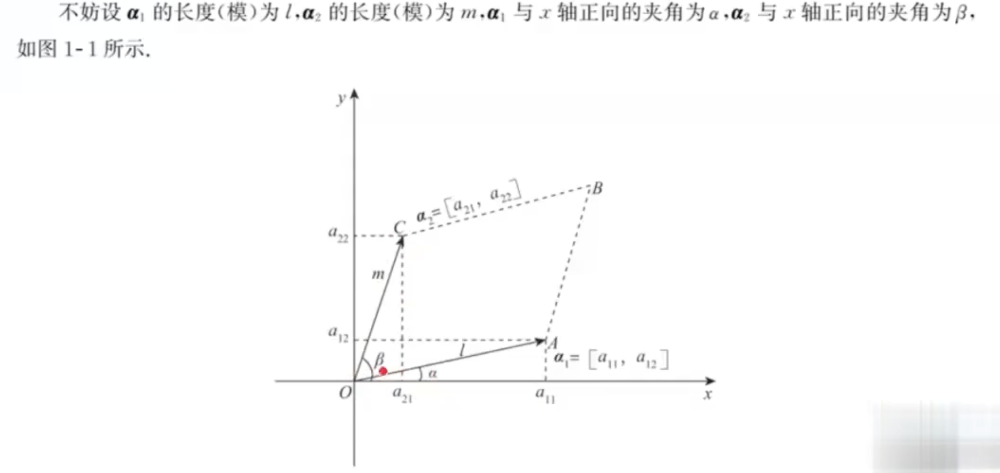
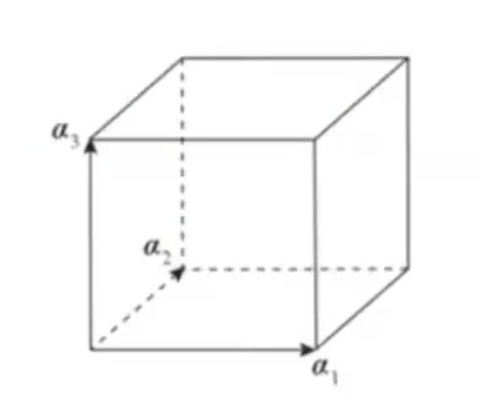

## 行列式的定义

​		先看一个公式如下：
$$
D2= \begin{matrix}
    a11 & a12\\
    a21 & a22
   \end{matrix}
$$
我们称其为2阶行列式，a(ij) 表示此元素所在的行数和列数。

​		可以把第一行的两个元素 a(11),a(12) 看成一个二维向量 [a11,a12] = **α**1(加粗的阿尔法1，表示向量)

则
$$
S(OABC) = l \times m \times \sin(β-α)\\
        = l \times m \times (\sinβ\cosα-\cosβ\sinα)\\
        = l \cosα \times m\sinβ - l\sinα\times\cosβ\\
        = a11 \times a22 - a12 \times a12
$$
于是
$$
\begin{matrix}
    a11 & a12\\
    a21 & a22
   \end{matrix} = a11 \times a22 - a12 \times a21 = S(OABC)
$$
故得到结论：**<u>二阶行列式是由两个二维向量组成的，其（运算规则的）结果为这两个向量为邻边的平行四边形的面积。</u>**

​		线代的最大特点就是可以做**线性推广**，故，三阶行列式的定位如下：
$$
D3= \begin{matrix}
    a11 & a12 & a13\\
    a21 & a22 & a23\\
    a31 & a32 & a33
   \end{matrix}
$$
​		**三阶行列式是由三个三维向量 α1 = [a11, a12, a13], α2 = [a21, a22, a23], α3 = [a31, a32, a33] 组成的，其(运算规则的)结果为<u>以这三个向量为领边的平行六边形体积</u>**，如下图所示：

​		以此类推，我们便可以给出 n 阶行列式
$$
Dn= \begin{matrix}
    a11 & ... & a1n\\
    ... &  & ...\\
    an1 & ... & ann
   \end{matrix}
$$
的本质定义：**<u>n 阶行列式是由n个n维向量 α1 = [a11, a12,...., a1n]......组成的,其结果为以这 n 个向量为邻边的 n 维图形的体积。</u>**

## 行列式的性质

1. 行列互换，其值不变，即 |A| = |A^T|.
   $$
   A= \begin{matrix}
       1 & -1\\
       2 & 3
      \end{matrix},   A^T = \begin{matrix}
       1 & 2\\
       -1 & 3
      \end{matrix}\\
      A = A^T
   $$

2. 若行列式中某行(列)的元素全为 0，  则行列式为 0 .

3. 若行列式中某行(列)的元素有公因子 k (k != 0), 则 k 可以提到行列式的外面，即
   $$
   \begin{matrix}
       a11 & a12 & ... & a1n\\
       ... & ... & ... & ...\\
       kai1 & kai2 & ... & kain\\
       ... & ... & ... & ...\\
       an1 & an2 & ... & ann\\
      \end{matrix}  = k \times \begin{matrix}
       a11 & a12 & ... & a1n\\
       ... & ... & ... & ...\\
       ai1 & ai2 & ... & ain\\
       ... & ... & ... & ...\\
       an1 & an2 & ... & ann\\
      \end{matrix}
   $$

4. 行列式中某行(列)的元素均是两个元素之和，则可拆成两个行列式之和，即
   $$
   \begin{matrix}
       a11 & a12 & ... & a1n\\
       ... & ... & ... & ...\\
       ai1+bi1 & ai2+bi2 & ... & ain+bin\\
       ... & ... & ... & ...\\
       an1 & an2 & ... & ann\\
      \end{matrix}  = \begin{matrix}
       a11 & a12 & ... & a1n\\
       ... & ... & ... & ...\\
       ai1 & ai2 & ... & ain\\
       ... & ... & ... & ...\\
       an1 & an2 & ... & ann\\
      \end{matrix} + \begin{matrix}
       a11 & a12 & ... & a1n\\
       ... & ... & ... & ...\\
       bi1 & bi2 & ... & bin\\
       ... & ... & ... & ...\\
       an1 & an2 & ... & ann\\
      \end{matrix}
   $$
   

