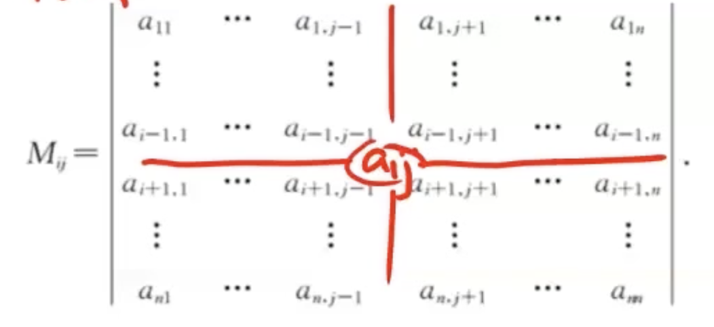
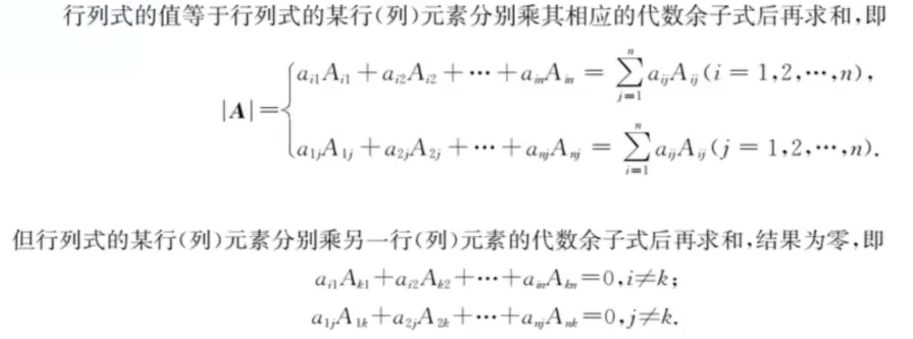
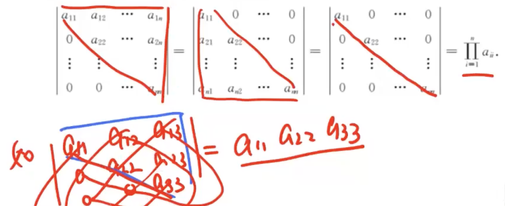
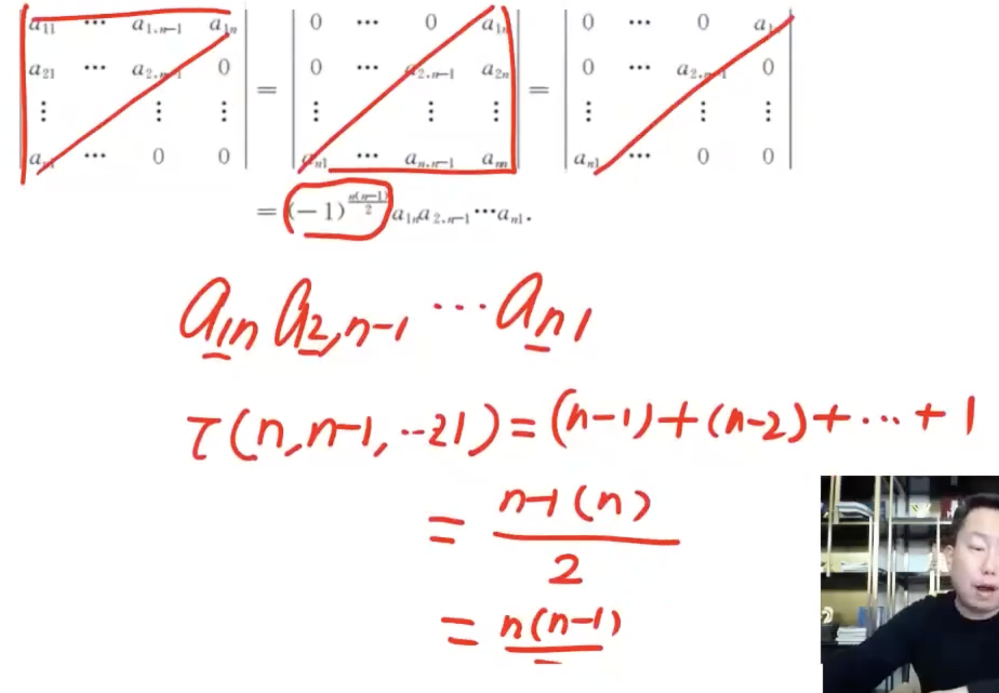
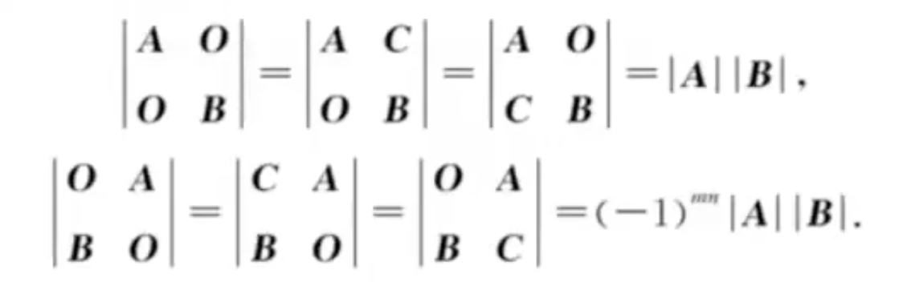
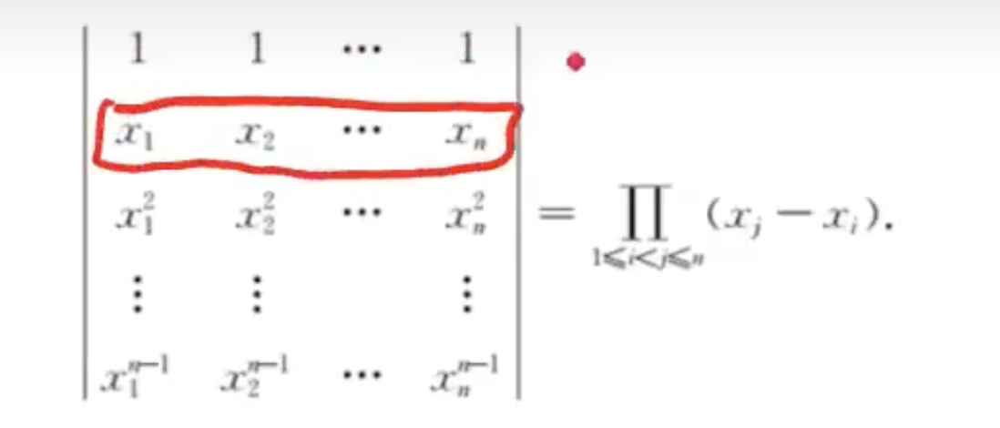

## 行列式的展开定理

### 1、余子式

​		在n阶行列式中，去掉元素 aij 所在的<u>第i行、第j列元素</u>，由剩下的元素按原来的位置与顺序组成的 n-1 阶行列式称为元素 aij 的余子式，记作 Mij，即

### 2、代数余子式

​		余子式 Mij 乘 (-1)^(i+j) 后称为 aij 的代数余子式，记作 Aij ,即
$$
Aij = (-1)^(i+j)\times Mij
$$
显然也有
$$
Mij = (-1)^(i+j)\times Aij
$$

### 3、行列式按某一行(列)展开的展开公式

## 几个重要的行列式

### 1、主对角线行列式(上(下)三角形行列式)

### 2、副对角线行列式

### 3、拉普拉斯展开式

​		设 A 为 m 阶矩阵，B 为 n 阶矩阵，则

### 4、范德蒙德行列式

