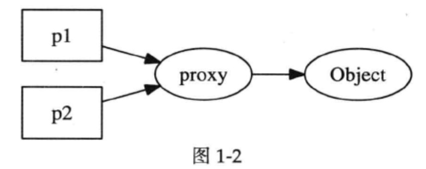

# 当析构函数遇到多线程

[TOC]

​		与其他面向对象语言不同，C++ 要求程序员自己管理对象的生命期，这在多线程环境下显得尤为困难。当一个对象能被多个线程同时看到时，那么对象的销毁时机就会变得模糊不清，可能出现多种**竞态条件( race condition )**:

- 在即将析构一个对象时，从何而知此刻是否有别的线程正在执行该对象的成员函数?
- 如何保证在执行成员函数期间，对象不会在另一个线程被析构?
- 在调用某个对象的成员函数之前，如何得知这个对象还活着 ? 它的析构函数会不会碰巧执行到一半?


### 线程安全的定义

​		依据 [ JCP ] , 一个线程安全的 class 应当满足以下三个条件:

- 多个线程同时访问时，其表现出正确的行为。
- 无论操作系统如何调度这些线程，无论这些线程的执行顺序如何 **交织( interleaving )**。 
- 调用端代码无须额外的同步或其他协调动作。

​        依据这个定义，C++ 标准库里的大多数 class 都不是线程安全的，包括 std :: string 、std :: vector 、 std :: map 等，因为这些 class 通常需要在外部加锁才能供多个线程同时访问。


### 一个线程安全的 Counter 示例

​		编写单个的线程安全的 class 不算太难，只需用同步原语保护其内部状态。例如下面这个简单的计数器类 Counter :

```c++
// A thread-safe counter
class Counter : boost::noncopyable
{
	// copy-ctor and assignment should be private by default for a class.
public:
	Counter() : value_(0){}
	int64_t value() const;
	int64_t getAndIncrease();
private:
	int64_t value_ ;
	mutable MutexLock mutex_ ;
};


int64_t Counter::value() const
{
		MutexLockGuard lock(mutex_); // lock 的析构会晚于返回对象的构造, 因此有效地保护了这个共享数据。
		return value_ ;
}

int64_t Counter::getAndIncrease()
{
		MutexLockGuard lock(mutex_); 
		int64_t ret = value_++;
		return ret;
}
// In a real world, atomic operations are preferred.
//当然在实际项目中，这个 class 用原子操作更合理，这里用锁仅仅为了举例。
```

​		这个 class 很容易验证它是线程安全的。每个 Counter 对象有自己的 mutex_ ，因此不团对象之间不构成**锁争用(lock contention)**。注意到 mutex_ 成员是mutable的，意味着 const 成员函数也能用 non-const 的 mutex_ 。

​		但是这个class析构时还是会发生多线程竞争问题。


## 对象的创建

​        对象构造要做到线程安全，唯一的要求是在构造期间不要泄露 this 指针，即

- <u>不要在构造函数中注册任何回调</u>;
- 也不要在构造函数中把 this 传给<u>跨线程</u>的对象;
- 即便在构造函数的最后一行也不行。

​        之所以这样规定，是因为在构造函数执行期间对象还没有完成初始化，如果 this 被**泄露(escape)**给了其他对象(其自身创建的子对象除外),那么别的线程有可能访问这个半成品对象，这会造成难以预料的后果。

​		即使构造函数的最后一行也不要泄露 this , 因为 Foo有可能是个基类，基类先于派生类构造，执行完Foo::Foo()的最后一行代码还会继续执行派生类的构造函数,这时 most-derived class 的对象还处于构造中，仍然不安全。


## 对象的析构

​		对象析构，这在单线程里不构成问题，最多需要注意避免空悬指针和野指针。

​		而在多线程程序中，存在了太多的竞态条件。对一般成员函数而言，做到线程安全的办法是让它们顺次执行，而不要并发执行 ( 关键是不要同时读写共享状态 ) ,也就是<u>让每个成员函数的临界区不重叠</u>。

​		这是显而易见的，不过有一个隐含条件或许不是每个人都能立刻想到 : 成员函数用来保护临界区的互斥器本身必须是有效的。而析构函数破坏了这一假设，它会把 mutex 成员变量销毁掉。。。。


### mutex 不是办法

​		mutex 只能保证函数一个接一个地执行，考虑下面的代码，它试图用互斥锁来保护析构函数: ( 注意代码中的 ( 1 ) 和 ( 2 ) 两处标记。)

```c++
Foo::~Foo()
{
		MutexLockGuard lock(mutex_);
		// free internal state   (1)
}
```

```c++
void Foo::update()
{
		MutexLockGuard lock(mutex_ );// (2)
		// make use of internal state
}
```

​		此时，有A、B两个线程都能看到 Foo 对象 x，线程 A 即将销毁 x ，而线程 B 正准备调用 x->update()。

```c++
extern Foo* x; // visible by all threads
```

```c++
// thread A
delete х;
x = NULL ;
// helpless
```

```c++
// thread B
if (x) {
		x->update();
```

​		尽管线程 A 在销毁对象之后把指针置为了 NULL ， 尽管线程 B 在调用 x 的成员函数之前检查了指针 x 的值，但还是无法避免一种 race condition:

1. 线程 A 执行到了析构函数的 (1) 处，已经持有了互斥锁，即将继续往下执行。
2. 线程 B 通过了 if (x) 检测，阻塞在 (2) 处。

​        接下来会发生什么，只有天晓得。因为析构函数会把 mutex_ 销毁,那么 (2) 处有可能永远阻塞下去，有可能进入“临界区”，然后 core dump，或者发生其他更糟糕的情况。

​		这个例子至少说明 delete 对象之后把指针置为 NULL 根本没用，如果一个程序要靠这个来防止二次释放，说明代码逻辑出了问题。


### 作为数据成员的 mutex 不能保护析构

​		前面的例子说明，**<u>作为 class 数据成员的 MutexLock 只能用于同步本 class 的其他数据成员的读和写，它不能保护安全地析构。</u>**

​		另外如果要同时读写一个 class 的两个对象，有潜在的死锁可能。比方说有swap() 这个函数:

```c++
void swap(Counter& a, Counter& b)
{
	MutexLockGuard aLock(a.mutex_) ;// potential dead lock
	MutexLockGuard bLock(b.mutex_) ;
	int64_t value = a.value_ ;
	a.value_ = b.value_ ;
	b. value_ = value;
}
```

​		如果线程 A 执行 swap(a, b) ; 而同时线程 B 执行 swap(b, a) ; ,  就有可能死锁。operator=() 也是类似的道理。

```c++
Counter& Counter::operator=( const Counter& rhs)
{
	if (this == &rhs)
			return *this;
	MutexLockGuard myL ock(mutex_) ;// potential dead lock
	MutexLockGuard itsLock(rhs.mutex_);
	value_ = rhs.value_ ; // 改成 value_ = rhs. value() 会死锁
	return *this;
}
```

​		**<u>一个函数如果要锁住相同类型的多个对象，为了保证始终按相同的顺序加锁，我们可以比较mutex对象的地址，始终先加锁地址较小的mutex。</u>**


## 线程安全的 Observer 有多难

​		一个动态创建的对象是否还活着，光看指针是看不出来的(引用也一样看不出来)。指针就是指向了一块内存，这块内存上的对象如果已经销毁,那么就根本不能访问（就像是 free()之后的地址不能访问一样），既然不能访问又如何知道对象的状态呢？换句话说，判断一个指针是不是合法指针没有高效的办法，这是c/c++指针问题的根源。

​		在面向对象程序设计中，对象的关系主要有三种: **composition**、 **aggregation**、**association**。**composition (组合/复合)**关系在多线程里不会遇到什么麻烦，因为对象 x 的生命期由其唯一的拥有者 owner 控制，owner析构的时候会把 x 也析构掉。从形式上看，x是owner的直接数据成员，或者scoped_ptr成员，抑或owner持有的容器的元素。

​		后两种关系在 C++ 里比较难办，处理不好就会造成内存泄漏或重复释放。**association (关联/联系)**是一种很宽泛的关系，它表示一个对象 a 用到了另一个对象 b , 调用了后者的成员函数。从代码形式上看，a 持有 b 的指针(或引用)，但是b的生命期不由 a 单独控制。**aggregation (聚合)**关系从形式上看与**association**相同，除了 a 和 b 有逻辑上的整体与部分关系。如果 b 是动态创建的并在整个程序结束前有可能被释放，那么就会出现之前谈到的竞态条件。

​		一个典型的场景就是 Observer 模式：

```c++
class Observer // : boost: : noncopyable
{
public:
	virtual ~Observer() ;
	virtual void update() = 0;
	//...
};

class Observable // : boost:: noncopyable
public:
	void register_(Observer* x);
	void unregister(Observer* x);

	void notify0bservers() {
		for (Observer* x : observers_) { // 这行 C++11
			x->update(); // (3)
    }
  }
private:
	std: :vector<0bserver*> observers_ ;
};
```

​		当 Observable 通知每一个 Observer 时 ( x->update(); ), 它从何得知 Observer对象 x 还活着 ? 要不试试在 Observer 的析构函数里调用 unregister() 来解注册 ? 恐难奏效。

```c++
class Observer
{
	//同前
	void observe(Observable* s) {
		s->register_(this);
		subject_ = s;
	}

	virtual ~Observer() {
		subject_->unregister(this);
  }
	Observable* subject_ ;
};
```

​		我们试着让 Observer 的析构函数去调用 unregister(this)，这里有两个 race conditions。其中: 析构函数中的  unregister(this) 如何得知 subject_ 还活着 ? 其二 : 就算 subject_ 指向某个永久存在的对象，那么还是险象环生:

1. 线程 A 执行到  unregister(this) 之前，还没有来得及 unregister(this) 本对象。
2. 线程 B 执行到 x->update(); ,  x 正好指向是 unregister(this) 正在析构的对象。

​        这时悲剧又发生了，既然 x 所指的 Observer 对象正在析构，调用它的任何非静态成员函数都是不安全的，何况是虚函数。更糟糕的是，Observer 是个基类，执行到 unregister(this)  时，派生类对象已经析构掉了，这时候整个对象处于将死未死的状态，core dump 恐怕是最幸运的结果。

​		这些 race condition 似乎可以通过加锁来解决，但在哪儿加锁，谁持有这些互斥锁，又似乎不是那么显而易见的。要是有什么活着的对象能帮帮我们就好了，它提供一 个isAlive() 之类的程序函数,告诉我们那个对象还在不在。可惜指针和引用都不是对象，它们是内建类型。


## 原始指针有何不妥

​		当指向对象的指针是坏的，尤其是当暴露给别的线程时。Observable 应当保存的不是原始 Observer* ， 而是别的、能分辨 Observer 对象是否存活。

​		类似地，如果要在析构函数里面解注册，那么类型也不能是原始的指针。

​	有经验的 C++ 程序员或许会想到用智能指针。没错，这是正道，但也没那么简单，有些关窍需要注意。这两处直接使用 shared_ptr 是不行的，会形成循环引用，直接造成资源泄漏。别着急，后文会一一讲到。


### 空悬指针

​		空悬指针是值两个线程有不同的指针p1、p2指向同一个对象，但若其中一个指针偷偷将指向对象销毁，此时另一个指针却不知道，任然指向该地址。


### 解决空悬指针的一个方法

​		一个解决空悬指针的办法是，<u>引入一层间接性，让p1和p2所指的对象永久有效。</u>比如图1-2中的 proxy 对象，这个对象，持有一个指向Object的指针。( 从C语言的角度，p1和p2都是二级指针。)



​		当p1销毁时，p2 仍然可以指向 proxy ，可以通过proxy判断Object是否活着。

​		要线程安全地释放 object 也不是那么容易，race condition 依旧存在。比如 p2看第一眼的时候 proxy 不是零，正准备去调用 object 的成员函数,期间对象已经被p1 给销毁了。

​		问题在于，何时释放proxy指针呢?


### 一个万能的解决方案

​		引入另外一层间接性( another layer of indirection)  ,用对象来管理共享资源(如果把 Object 看作资源的话 ) , 亦即 handle/body 惯用技法( idiom)。 当然，编写线程安全、高效的引用计数 handle 的难度非凡，作为一名谦卑的程序员，用现成的库就行。万幸，C++的只能指针里提供了一对“神兵利器”，可助我们完美解决这个头疼的问题。


