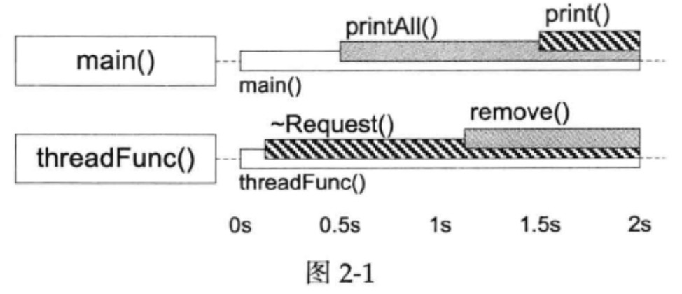

# 线程同步精要

线程同步的四项原则，按重要性排列:

1. 首要原则是尽量最低限度地共享对象，减少需要同步的场合。一个对象能不暴露给别的线程就不要暴露 ;  如果要暴露，优先考虑 immutable 对象;实在不行才暴露可修改的对象，并用同步措施来充分保护它。
2. 其次是使用高级的并发编程构件，如 TaskQueue、Producer Consumer Queue、CountDownLatch 等等。
3. **<u>最后不得已必须使用底层同步原语( primitives ) 时，只用非递归的互斥器和条件变量，慎用读写锁，不要用信号量。</u>**
4. 除了使用 atomic 整数之外，不自己编写 lock-free 代码，也不要用 “ 内核级 ” 同步原语。不凭空猜测 “ 哪种做法性能会更好 ” ，比如 spin lock vs. mutex。

前面两条很容易理解，这里着重讲- -下第3条:底层同步原语的使用。


# 互斥器(mutex)

[TOC]

​		**互斥器 ( mutex ) ( pthread中的，不是 win 的 )** 它保护了临界区，任何一个时刻最多只能有一个线程在此 mutex 划出的临界区内活动。单独使用 mutex 时，我们主要为了保护共享数据。我个人的原则是:

- 用 RAII 手法封装 mutex 的创建、销毁、加锁、解锁这四个操作。用 RAII 封装这几个操作是通行的做法。用本地 class 来自动析构，保证锁的生效期间等于一个作用域 ( scope ) , 不会因异常而忘记解锁。
- 只用非递归的 mutex ( 即不可重入的 mutex )。
- 不手工调用 lock() 和 unlock() 函数，一切交给栈上的 Guard 对象的构造和析构函数负责。Guard 对象的生命期正好等于临界区 ( 分析对象在什么时候析构是C++程序员的基本功 ) 。这样我们保证始终在同一个函数同一个 scope 里对某个 mutex 加锁和解锁。避免在 foo() 里加锁，然后跑到bar() 里解锁 ; 也避免在不同的语句分支中分别加锁、解锁。这种做法被称为 Scoped Locking 。
- 在每次构造 Guard 对象的时候，思考一路上 ( 调用栈上 ) 已经持有的锁，防止因加锁顺序不同而导致死锁 ( deadlock ) 。由于 Guard 对象是栈上对象，看函数调用栈就能分析用锁的情况，非常便利。

次要原则有：

- **<u>不使用跨进程的 mutex</u>**，进程间通信只用 TCP sockets。
- 加锁、解锁在同一个线程，线程 a 不能去 unlock 线程 b 已经锁住的 mutex ( RAII 自动保证 )。
- 别忘了解锁 ( RAII 自动保证 ) 。
- 不重复解锁 ( RAII 自动保证 )。
- 必要的时候可以考虑用 **PTHREAD_MUTEX_ERRORCHECK** 来排错。

​       mutex 恐怕是最简单的同步原语，按照上面的几条原则，几乎不可能用错。若不违背这些原则，编码时出现问题都很快能定位并修复。


## 只用非递归的 mutex

​		mutex 分为**递归 ( recursive )** 和**非递归 ( non-recursive )** 两种，这是 POSIX 的叫法，另外的名字是**可重入 ( reentrant )** 与**非可重入**。这两种 mutex 作为线程间 ( inter-thread )的同步工具时没有区别，它们的唯一区别在于 : **<u>同一个线程可以重复对 recursive mutex 加锁，但是不能重复对 non-recursive mutex加锁。</u>**

​		首选非递归 mutex , 绝对不是为了性能，而是为了体现设计意图。non-recursive 和 recursive 的性能差别其实不大，因为少用一个计数器，前者略快一点点而已。在同一个线程里多次对 non-recursive  mutex 加锁会立刻导致死锁，我认为这是它的优点，能帮助我们思考代码对锁的期求，并且及早 ( 在编码阶段 ) 发现问题。

​		正因为它方便，recursive  mutex 可能会隐藏代码里的一些问题。典型情况是你以为拿到一个锁就能修改对象了，没想到外层代码已经拿到了锁，正在修改( 或读取 ) 同一个对象呢。来看一个具体的例子:

```c++
MutexLock mutex;
std::vector<Foo> foos ;

void post(const Foo& f)
{
	MutexLockGuard lock(mutex);
	foos.push_back(f);
}

void traverse()
{
	MutexLockGuard lock(mutex);
	for (std::vector<Foo>::const_iterator it = foos.begin();
				it != foos.end(); ++it)
  {
			it- ->doit();
  }
}
```

​		post() 加锁，然后修改 foos 对象;  traverse() 加锁，然后遍历 foos 向量。这些都是正确的。

​		将来有一天，Foo::doit() 间接调用了 post() ,  那么会很有戏剧性的结果:

1. mutex 是非递归的，于是死锁了。
2. mutex 是递归的，由于 push_back() 可能 ( 但不总是 ) 导致 vector 迭代器失效 , 程序偶尔会crash。

​        这时候就能体现 non-recursive 的优越性:把程序的逻辑错误暴露出来。死锁比较容易 debug , 把各个线程的调用栈打出来，只要每个函数不是特别长，很容易看 出来是怎么死的。

​		如果确实需要在遍历的时候修改 vector , 有两种做法，一是把修改推后，记住循环中试图添加或删除哪些元素，等循环结束了再依记录修改 foos ; 二是用 copy-on-write。

​		如果一个函数既可能在已加锁的情况下调用，又可能在未加锁的情况下调用，那么就拆成两个函数:

1. 跟原来的函数同名，函数加锁，转而调用第 2 个函数。
2. 给函数名加上后缀 WithLockHold ，不加锁，把原来的函数体搬过来。

就像这样:

```c++
void post(const Foo& f)
{
		MutexLockGuard lock(mutex);
		postWithLockHold(f); // 不用担心开销，编译器会自动内联的
}

//引入这个函数是为了体现代码作者的意图，尽管 push_back 通常可以手动内联
void postWithLockHold(const Foo& f)
{
		foos.push_back(f);
}
```

这有可能出现两个问题 :

​	(a)  误用了加锁版本，死锁了。
​	(b)  误用了不加锁版本，数据损坏了。

​		对于 (a)，仿造下面的死锁的办法能比较容易地排错。对于 (b)，如果 Pthreads 提供 isLockedByThisThread() 就好办，可以写成:

```c++
void postWithLockHold(const Foo& f)
{
	assert(mutex.isLockedByThisThread());
	// muduo::MutexLock提供了这个成员函数
}
```


## 死锁

​		前面说过，如果坚持只使用 Scoped Locking，那么在出现死锁的时候很容易定位。考虑下面这个线程自己与自己死锁的例子：

```c++
1 class Request
2
3 public:
4 		void process() // __attribute__ ((noinline))
5 		{
6				muduo::MutexLockGuard   lock(mutex_);
7				//...
8				print();//原本没有这行，某人为了调试程序不小心添加了。
9			}
10
11		void print() const // _. attribute__ ((noinline))
12		{
13 			muduo::MutexLockGuard lock(mutex_);
14			//...
15		}
16
17 private:
18		mutable muduo::MutexLock mutex_ ;
19	};
20
21	int main()
22	{
23			Request req;
24			req.process() ;
25	}
```

​		要修复这个错误也很容易，按前面的办法，从 Request::print() 抽取出Request: :printWithLockHold() ，并让 Request: :print() 和 Request: :process() 都调用它即可。

​		再来看一个更真实的两个线程死锁的例子 : 

​		容易看出，下面这个 Inventory class 的 add() 和 remove() 成员函数都是线程安全的，它使用了mutex 来保护共享数据 requests_ 。

```c++
class Inventory
{
public:
	void add(Request* req)
  {
		muduo::MutexLockGuard   lock(mutex_);
		requests_.insert(req) ;
  }
  
	void remove(Request* req) //__attribute__ ( (noinline))
  {
		muduo::MutexLockGuard  lock(mutex_);
		requests_.erase(req);
  }
  
	void printAll() const;
private:
	mutable  muduo::MutexLock   mutex_ ;
	std::set<Request*>       requests_ ;
};
  
  
Inventory   g_inventory; //为了简单起见，这里使用了全局对象。
```

​		Request class 与 Inventory class 的交互逻辑很简单，在处理( process ) 请求的时候，往 g_inventory 中添加自己。在析构的时候，从 g_inventory 中移除自己。目前看来，整个程序还是线程安全的。

```c++
1 class Request
2 {
3	public:
4 	void process() // __attribute__ ((noinline))
5		{
6			muduo::MutexLockGuard lock(mutex_);
7			g_inventory.add(this);
8			//...
9		}
10
11	~Request() __attribute__ ( (noinline))
12	{
13		muduo::MutexLockGuard   lock(mutex_);
14		sleep(1);//为了容易复现死锁，这里用了延时
15		g_inventory.remove(this) ;
16	}
17
18	void print() const __attribute__ ((noinline))
19	{
20		muduo: :MutexLockGuard lock (mutex_);
21		//...
22	}
23
24 private:
25 		mutable muduo::MutexLock  mutex_ ;
26 };
```

​		Inventory class 还有一个功能是打印全部已知的 Request 对象。Inventory::printAll() 里的逻辑单独看是没问题的，但是它有可能引发死锁。

```c++
void Inventory::printAll() const
{
	muduo::MutexLockGuard lock(mutex_ );
	sleep(1); // 为了容易夏現死鎖，込里用了延吋
	for (std::set<Request*>::const_iterator 
       	it = requests_.begin();
				it != requests.end();
				++it)
  {
		(*it)->print();
	}
	printf("Inventory::printAll() unlocked\n");
}
```

​		下面这个程序运行起来发生了死锁：

```c++
void threadFunc()
{
	Request* req = new Request;
	req->process();
	delete req;
}
  
int main()
{
	muduo::Thread  thread(threadFunc);
	thread.start() ;
	usleep(500 * 1000);	//为了让另一个线程等在前面第 14 行的 sleep() 上。
	g_inventory.printAll();
	thread.join();
}
```

​		注意到 main() 线程是先调用 Inventory::printAll() 再调用 Request::print() , 而 threadFunc() 线程是先调用 Request:: ~Request() 再调用 Inventory::remove()。这两个调用序列对两个 mutex 的加锁顺序正好相反，于是造成了经典的死锁。见图2-1，Inventory class 的 mutex 的临界区由灰底表示，Request class 的 mutex 的临界区由斜纹表示。一旦 main() 线程中的 printAll() 在另一个线程的 ~Request() 和 remove() 之间开始执行，死锁已不可避免。



​		这里也出现了第1章所说的对象析构的race condition,即一个线程正在析构对象，另一个线程却在调用它的成员函数。

​		解决死锁的办法很简单，要么把 print() 移出 printAll() 的临界区，这可以用后面介绍的办法 ; 要么把 remove() 移出 ~Request() 的临界区，比如交换上面中 13 行 和 15 行两行代码的位置。当然这没有解决对象析构的 race condition。