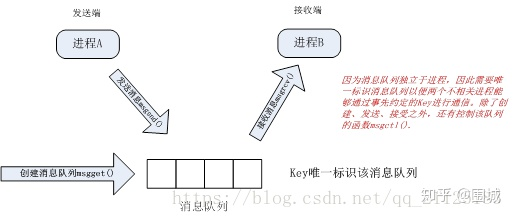
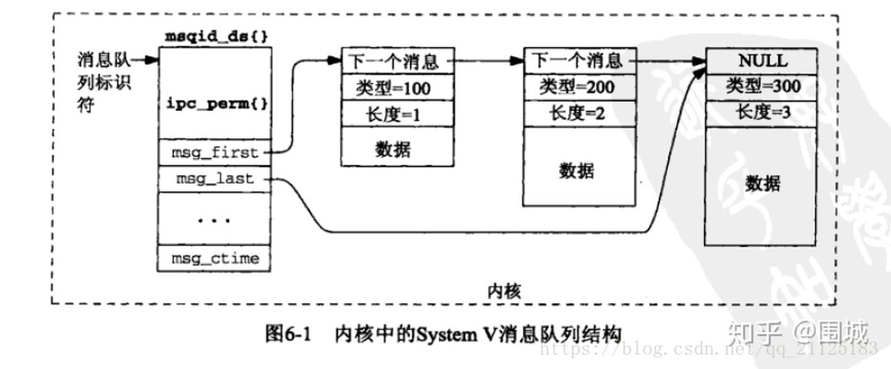

# 消息队列

​		**消息队列是在两个不相关进程间传递数据的一种简单、高效方式，她独立于发送进程、接受进程而存在。**


​		消息队列可以是一种消息链表。有足够的权限的线程可以往队列中放置消息，有足够读权限的线程可以从队列中取走消息。每个消息都是一个记录，它由发送者赋予一个优先级。

​		在某个进程往一个队列写入消息之前，并不需要另外某个进程在该队列上等待消息的到达。这根管道和 FIFO 是相反的，对于后者来说，除非读出者已经存在，否则现有写入者是没有意义的。




​		我们将内核中的某个特定的消息队列画为一个消息链表。假设有一个具有三个消息的队列，消息长度分别为 1 字节、2 字节和 3 字节，而且这些消息就是以这样的顺序写入该队列的。再假设这三个消息的类型（type）分别是100、200、300。



## 消息队列和管道的对比

1. 匿名管道是跟随进程的，消息队列是跟随内核的，也就是说进程结束之后，匿名管道就死了，但是消息队列还会存在（除非显示调用函数销毁）

2. 管道是文件，存放在磁盘上，访问速度慢，消息队列是数据结构，存放在内存，访问速度快

3. 管道是数据流式存取，消息队列是数据块式存取


## 代码实现

​		首先从宏观的角度了解一下消息队列的工作机制。因为消息队列独立于进程而存在，为了区别不同的消息队列，需要以key值标记消息队列，这样两个不相关进程可以通过事先约定的key值通过消息队列进行消息收发。例如进程A向key消息队列发送消息，进程B从Key消息队列读取消息。在这一过程中主要涉及到四个函数：

```c++
#include <sys/msg.h> # 消息队列相关函数及数据结构头文件

int msgctl(int msqid, int cmd, struct msqid_ds *buf);// 控制消息队列函数

int msgget(key_t key, int msgflg); // 创建消息队列，key值唯一标识该消息队列

int msgrcv(int msqid, void *msg_ptr, size_t msg_sz, long int msgtype, int msgflg);// 接收消息

int msgsnd(int msqid, const void *msg_ptr, size_t msg_sz, int msgflg);// 发送消息
```

**server 消息接收方**

```c++
// msg1.c 接收端


#include <stdlib.h>
#include <stdio.h>
#include <string.h>
#include <errno.h>
#include <unistd.h>
#include <sys/msg.h> // 包含消息队列相关函数及数据结构的头文件
struct my_msg_st {
    long int my_msg_type;
    char some_text[BUFSIZ];
};// 消息格式
int main()
{
    int running = 1;
    int msgid;
    struct my_msg_st some_data;
    long int msg_to_receive = 0;
    
    msgid = msgget((key_t)1234, 0666 | IPC_CREAT);// 创建标识符为key = 1234 的消息队列，注意发送端与接收端该值的一致性
    if (msgid == -1) {
        fprintf(stderr, "msgget failed with error: %d\n", errno);
        exit(EXIT_FAILURE);
    }// 错误处理：msgget调用成功返回消息队列标识符，调用失败返回-1
    
    while(running) {
        if (msgrcv(msgid, (void *)&some_data, BUFSIZ,msg_to_receive, 0) == -1) { // 从消息队列接收消息，如果接收失败执行if语句并退出
                fprintf(stderr, "msgrcv failed with error: %d\n", errno);
                exit(EXIT_FAILURE);
        }
        printf("You wrote: %s", some_data.some_text);
        if (strncmp(some_data.some_text, "end", 3) == 0) { // 如果接收到文本含有"end"，将running设置为0，效果是：退出while循环
            running = 0;
        }
    }
    
    if (msgctl(msgid, IPC_RMID, 0) == -1) { // 删除消息队列，如果删除失败执行if语句并退出
        fprintf(stderr, "msgctl(IPC_RMID) failed\n");
        exit(EXIT_FAILURE);
    }
    exit(EXIT_SUCCESS);
}
```

**client 客户端消息发送方**

```c++
# msg2.c 发送端


#include <stdlib.h>
#include <stdio.h>
#include <string.h>
#include <errno.h>
#include <unistd.h>
#include <sys/msg.h>
#define MAX_TEXT 512
struct my_msg_st {
    long int my_msg_type;
    char some_text[MAX_TEXT];
};// 消息格式，与接收端一致
int main()
{
    int running = 1;
    struct my_msg_st some_data;
    int msgid;
    char buffer[BUFSIZ];
    msgid = msgget((key_t)1234, 0666 | IPC_CREAT);// 创建消息标识符key = 1234的消息队列。如果该队列已经存在，则直接返回该队列的标识符，以便向该消息队列收发消息
    if (msgid == -1) {
        fprintf(stderr, "msgget failed with error: %d\n", errno);
        exit(EXIT_FAILURE);
    }// 错误处理，同接收者msg1
    
    while(running) {
        printf("Enter some text: ");
        fgets(buffer, BUFSIZ, stdin);// 由控制台输入文本，并将其存放在buffer之中
        some_data.my_msg_type = 1;// 类型填充，在本例中没有特别含义
        strcpy(some_data.some_text, buffer);// 将buffer数据复制到some_text之中
        if (msgsnd(msgid, (void *)&some_data, MAX_TEXT, 0) == -1) { // 向消息队列发送消息，如果发送失败执行if语句并退出
            fprintf(stderr, "msgsnd failed\n");
            exit(EXIT_FAILURE);
        }
        if (strncmp(buffer, "end", 3) == 0) {// 如果发送的"end"，则在发送"end"之后，退出while，结束程序
            running = 0;
        }
    }
    exit(EXIT_SUCCESS);
}
```


